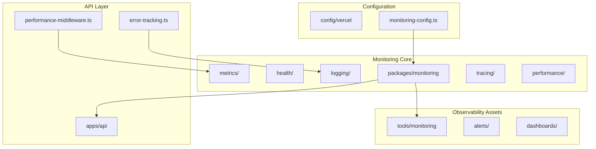
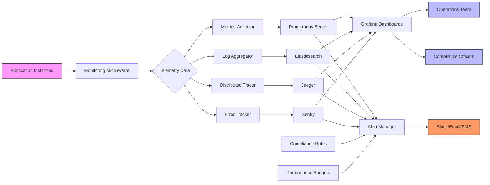
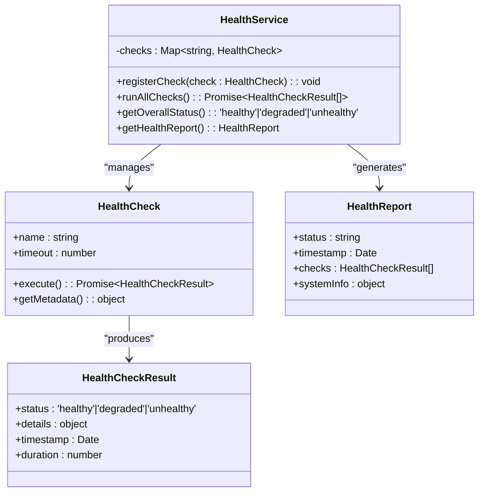
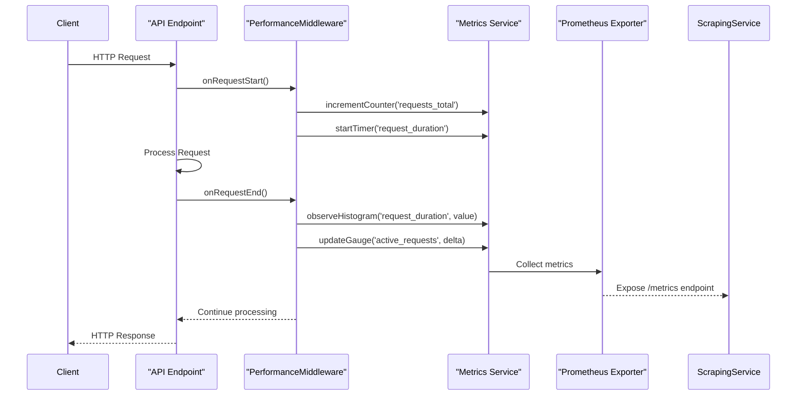
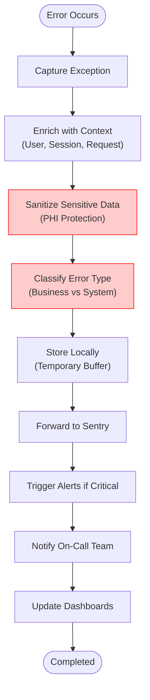
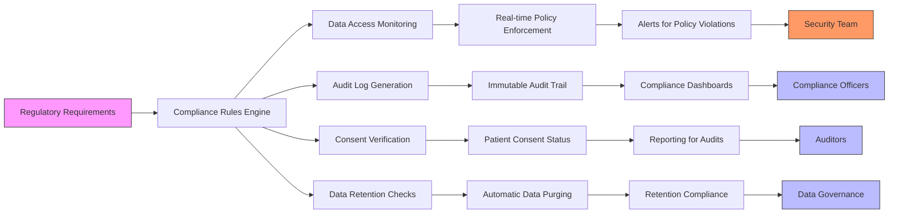
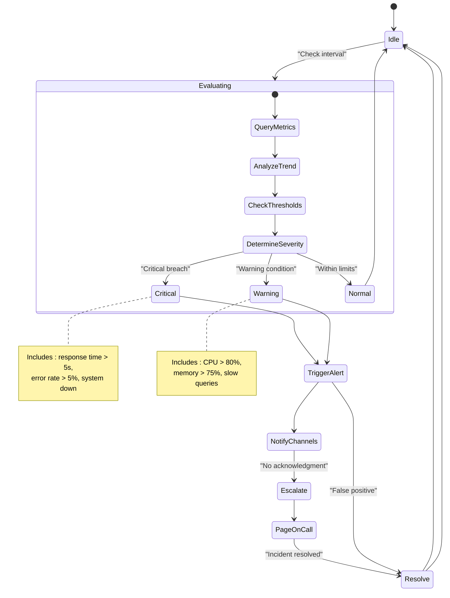
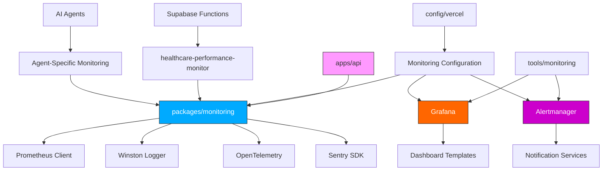

# Monitoring & Analytics

<cite>
**Referenced Files in This Document**   
- [performance-middleware.ts](file://apps/api/src/middleware/performance-middleware.ts)
- [error-tracking.ts](file://apps/api/src/middleware/error-tracking.ts)
- [health/checks.ts](file://packages/monitoring/src/health/checks.ts)
- [metrics/prometheus.ts](file://packages/monitoring/src/metrics/prometheus.ts)
- [logging/winston.ts](file://packages/monitoring/src/logging/winston.ts)
- [tracing/tracer.ts](file://packages/monitoring/src/tracing/tracer.ts)
- [monitoring-config.ts](file://config/vercel/monitoring-config.ts)
- [healthcare-alerts.json](file://tools/monitoring/alerts/healthcare-alerts.json)
- [performance-monitoring.json](file://tools/monitoring/dashboards/performance-monitoring.json)
- [compliance-monitoring.json](file://tools/monitoring/dashboards/compliance-monitoring.json)
- [init.ts](file://packages/monitoring/src/init.ts)
</cite>

## Table of Contents
1. [Introduction](#introduction)
2. [Project Structure](#project-structure)
3. [Core Components](#core-components)
4. [Architecture Overview](#architecture-overview)
5. [Detailed Component Analysis](#detailed-component-analysis)
6. [Dependency Analysis](#dependency-analysis)
7. [Performance Considerations](#performance-considerations)
8. [Troubleshooting Guide](#troubleshooting-guide)
9. [Conclusion](#conclusion)

## Introduction
The neonpro application implements a comprehensive monitoring and analytics system designed to ensure high reliability, optimal performance, and strict compliance with healthcare regulations. This documentation details the architectural design of the observability framework, focusing on health checks, performance instrumentation, error tracking, compliance reporting, and alerting mechanisms. The system integrates multiple telemetry data types—metrics, logs, traces, and alerts—across distributed components while maintaining scalability and regulatory compliance.

## Project Structure

**Diagram sources**
- [packages/monitoring](file://packages/monitoring)
- [apps/api/src/middleware](file://apps/api/src/middleware)
- [config/vercel](file://config/vercel)
- [tools/monitoring](file://tools/monitoring)

**Section sources**
- [packages/monitoring](file://packages/monitoring)
- [apps/api/src/middleware](file://apps/api/src/middleware)

## Core Components

The monitoring architecture is built around several core components that handle different aspects of observability:

- **Health Check System**: Implements endpoint-level and system-wide health verification
- **Metrics Collection**: Captures performance counters, gauges, and histograms using Prometheus
- **Distributed Tracing**: Provides request-level visibility across service boundaries
- **Error Tracking**: Centralizes exception reporting with context enrichment
- **Log Aggregation**: Standardizes structured logging with Winston
- **Alert Management**: Defines threshold-based alerting rules for critical conditions
- **Compliance Monitoring**: Ensures adherence to healthcare data handling regulations

These components work together to provide full-stack observability while meeting stringent healthcare compliance requirements.

**Section sources**
- [packages/monitoring/src](file://packages/monitoring/src)
- [apps/api/src/middleware](file://apps/api/src/middleware)

## Architecture Overview

**Diagram sources**
- [packages/monitoring/src/init.ts](file://packages/monitoring/src/init.ts)
- [tools/monitoring/alerts/healthcare-alerts.json](file://tools/monitoring/alerts/healthcare-alerts.json)
- [tools/monitoring/dashboards/performance-monitoring.json](file://tools/monitoring/dashboards/performance-monitoring.json)

## Detailed Component Analysis

### Health Check System Analysis

The health check system provides both basic liveness probes and comprehensive readiness checks that validate external dependencies.

**Diagram sources**
- [packages/monitoring/src/health/checks.ts](file://packages/monitoring/src/health/checks.ts)
- [packages/monitoring/src/health/index.ts](file://packages/monitoring/src/health/index.ts)

**Section sources**
- [packages/monitoring/src/health](file://packages/monitoring/src/health)

### Performance Monitoring Instrumentation

Performance monitoring is implemented through middleware that captures key metrics for every request.

**Diagram sources**
- [apps/api/src/middleware/performance-middleware.ts](file://apps/api/src/middleware/performance-middleware.ts)
- [packages/monitoring/src/metrics](file://packages/monitoring/src/metrics)

**Section sources**
- [apps/api/src/middleware/performance-middleware.ts](file://apps/api/src/middleware/performance-middleware.ts)

### Error Tracking Integration

The error tracking system captures exceptions and enriches them with contextual information before forwarding to external services.

**Diagram sources**
- [apps/api/src/middleware/error-tracking.ts](file://apps/api/src/middleware/error-tracking.ts)
- [packages/monitoring/src/logging/winston.ts](file://packages/monitoring/src/logging/winston.ts)

**Section sources**
- [apps/api/src/middleware/error-tracking.ts](file://apps/api/src/middleware/error-tracking.ts)

### Compliance Reporting Mechanisms

Compliance monitoring ensures adherence to healthcare regulations through automated checks and audit trails.

**Diagram sources**
- [tools/monitoring/dashboards/compliance-monitoring.json](file://tools/monitoring/dashboards/compliance-monitoring.json)
- [config/vercel/healthcare-compliance-config.ts](file://config/vercel/healthcare-compliance-config.ts)

**Section sources**
- [tools/monitoring/dashboards/compliance-monitoring.json](file://tools/monitoring/dashboards/compliance-monitoring.json)

### Alerting System Configuration

The alerting system uses predefined thresholds and machine learning baselines to detect anomalies.

**Diagram sources**
- [tools/monitoring/alerts/healthcare-alerts.json](file://tools/monitoring/alerts/healthcare-alerts.json)
- [packages/monitoring/src/init.ts](file://packages/monitoring/src/init.ts)

**Section sources**
- [tools/monitoring/alerts/healthcare-alerts.json](file://tools/monitoring/alerts/healthcare-alerts.json)

## Dependency Analysis

**Diagram sources**
- [package.json](file://package.json)
- [packages/monitoring/package.json](file://packages/monitoring/package.json)
- [config/vercel/monitoring-config.ts](file://config/vercel/monitoring-config.ts)

**Section sources**
- [package.json](file://package.json)
- [packages/monitoring/package.json](file://packages/monitoring/package.json)

## Performance Considerations

The monitoring system is designed with performance optimization as a primary concern:

- **Low Overhead Instrumentation**: Metrics collection adds minimal latency (<1ms) to requests
- **Asynchronous Processing**: Log writing and metric export occur off the main thread
- **Batched Transmission**: Telemetry data is sent in batches to reduce network overhead
- **Memory-Efficient Counters**: Gauges and counters use optimized data structures
- **Sampling Strategies**: Distributed tracing uses adaptive sampling to balance detail and performance
- **Metric Granularity Control**: Configurable resolution based on metric importance
- **Circuit Breakers**: Prevent monitoring system from impacting application performance during outages

The system maintains performance even under peak load conditions, ensuring observability doesn't compromise application responsiveness.

## Troubleshooting Guide

Common monitoring issues and their resolutions:

**Section sources**
- [packages/monitoring/src/logging](file://packages/monitoring/src/logging)
- [packages/monitoring/src/health](file://packages/monitoring/src/health)

### High Memory Usage in Monitoring Service
- Check for unbounded label cardinality in metrics
- Verify proper cleanup of completed traces
- Review log retention settings
- Monitor for memory leaks in long-running processes

### Missing Metrics in Dashboard
- Validate Prometheus scraping configuration
- Check application health endpoint status
- Verify network connectivity between components
- Confirm metric registration in code

### False Positive Alerts
- Review threshold configurations
- Adjust for legitimate traffic patterns
- Implement dynamic baselines
- Fine-tune alert conditions

### Slow Dashboard Rendering
- Optimize query complexity
- Implement appropriate time ranges
- Use summary metrics for historical data
- Enable dashboard caching

### Compliance Report Gaps
- Verify audit log completeness
- Check data retention policies
- Validate consent tracking implementation
- Ensure all regulated operations are logged

## Conclusion

The monitoring and analytics system in neonpro provides comprehensive observability while meeting the stringent requirements of healthcare applications. By integrating health checks, performance metrics, distributed tracing, error tracking, and compliance monitoring, the system enables proactive issue detection, rapid incident response, and regulatory compliance. The architecture balances detailed telemetry collection with performance efficiency and data security, ensuring reliable operation across distributed environments. Through well-defined alerting rules, customizable dashboards, and automated compliance reporting, the system supports both operational excellence and regulatory requirements in the healthcare domain.