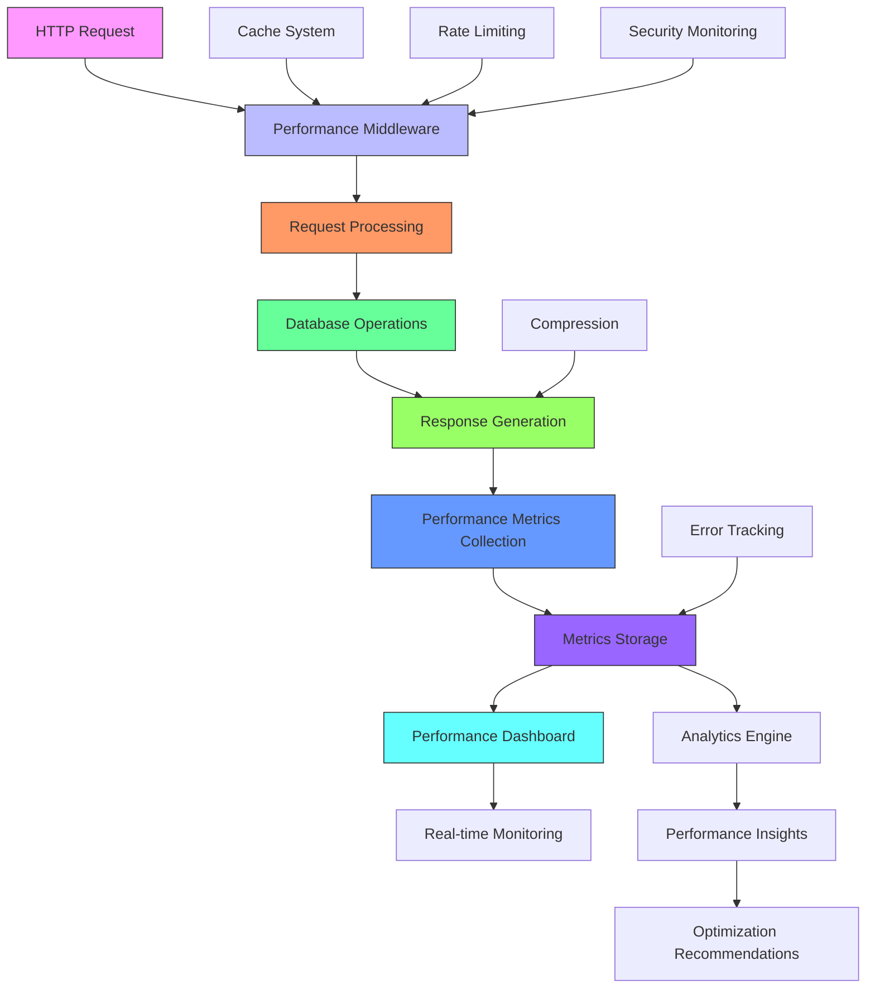
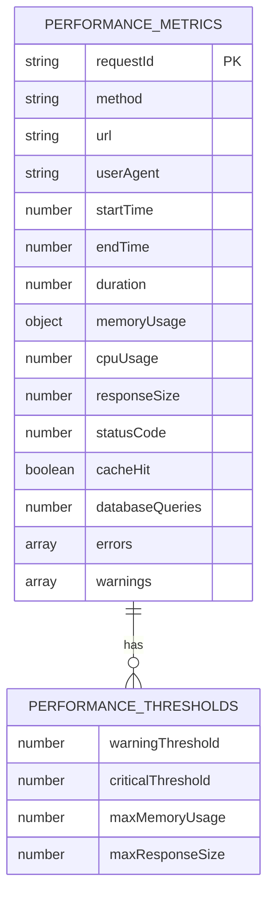
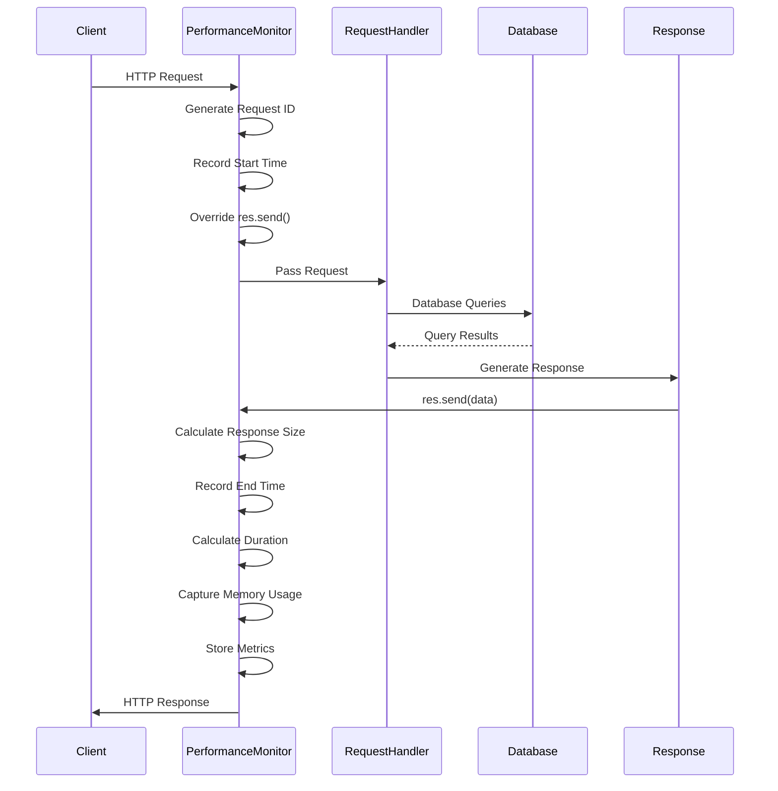

# Performance Monitoring

<cite>
**Referenced Files in This Document **
- [performance-middleware.ts](file://apps/api/src/middleware/performance-middleware.ts)
- [aesthetic-clinic-performance-optimizer.ts](file://apps/api/src/services/performance/aesthetic-clinic-performance-optimizer.ts)
- [performance-dashboard.ts](file://apps/api/src/routes/performance-dashboard.ts)
</cite>

## Table of Contents

1. [Introduction](#introduction)
2. [Performance Monitoring Architecture](#performance-monitoring-architecture)
3. [Core Components](#core-components)
4. [Performance Data Model](#performance-data-model)
5. [Middleware Implementation](#middleware-implementation)
6. [Performance Dashboard and API Endpoints](#performance-dashboard-and-api-endpoints)
7. [Integration with Other Systems](#integration-with-other-systems)
8. [Common Performance Issues and Solutions](#common-performance-issues-and-solutions)
9. [Best Practices for Optimization](#best-practices-for-optimization)

## Introduction

The performance monitoring system in the neonpro application provides comprehensive tracking and optimization capabilities for API requests, database operations, and resource utilization. This documentation details the implementation of the performance middleware that captures request duration, memory usage, and processing time across all API routes. The system is designed to help developers identify bottlenecks, optimize critical paths, and maintain high application responsiveness even under heavy load.

The performance monitoring sub-feature integrates seamlessly with the application's existing architecture, providing real-time insights into system health and performance metrics. It captures data points from HTTP requests, database queries, and system resources, aggregating them into actionable insights that can be used to improve application efficiency and user experience.

**Section sources**

- [performance-middleware.ts](file://apps/api/src/middleware/performance-middleware.ts#L1-L40)

## Performance Monitoring Architecture



**Diagram sources **

- [performance-middleware.ts](file://apps/api/src/middleware/performance-middleware.ts#L1-L40)
- [performance-dashboard.ts](file://apps/api/src/routes/performance-dashboard.ts#L1-L27)

The performance monitoring architecture follows a layered approach where each incoming HTTP request passes through multiple middleware components that collect various performance metrics. The system captures data at key points in the request lifecycle, from initial reception to final response delivery. Metrics are stored temporarily in memory and can be accessed through dedicated API endpoints for real-time monitoring and historical analysis.

The architecture integrates with other system components such as caching, rate limiting, and compression to provide a holistic view of application performance. It also interfaces with error tracking and security monitoring systems to correlate performance issues with potential security concerns or error patterns.

**Section sources**

- [performance-middleware.ts](file://apps/api/src/middleware/performance-middleware.ts#L1-L40)
- [performance-dashboard.ts](file://apps/api/src/routes/performance-dashboard.ts#L1-L27)

## Core Components

The performance monitoring system consists of several core components that work together to capture, store, and analyze performance data. The main component is the `PerformanceMonitor` class, which serves as the central hub for collecting and managing performance metrics across the application.

The `AestheticClinicPerformanceOptimizer` service works in conjunction with the performance monitor to provide domain-specific optimizations for aesthetic clinic data, including intelligent caching strategies, image optimization, and query batching. These components are designed to work together to provide both real-time monitoring and proactive performance optimization.

```mermaid
classDiagram
class PerformanceMonitor {
+metrics : Map~string, PerformanceMetrics~
+thresholds : PerformanceThresholds
+optimizer : AestheticClinicPerformanceOptimizer
+middleware() : Function
+databaseQueryMiddleware() : Function
+compressionMiddleware() : Function
+cacheMiddleware(ttl : number) : Function
+rateLimitMiddleware(options : object) : Function
+optimizationHeadersMiddleware() : Function
+getMetrics(timeRange? : object) : PerformanceMetrics[]
+getStatistics() : object
+exportMetrics() : string
}
class AestheticClinicPerformanceOptimizer {
+performanceService : DatabasePerformanceService
+cache : Map~string, {data : any, timestamp : string, ttl : number}~
+metrics : AestheticPerformanceMetrics[]
+config : object
+getOptimizedClientProfile(clientId : string, options : object) : Promise~any~
+getOptimizedTreatmentCatalog(options : object) : Promise~any~
+getOptimizedBeforeAfterPhotos(clientId : string, options : object) : Promise~any~
+getOptimizedClinicAnalytics(options : object) : Promise~any~
+searchClientsOptimized(params : object) : Promise~any~
+warmUpCache() : Promise~void~
+clearCache(pattern? : string) : void
}
PerformanceMonitor --> AestheticClinicPerformanceOptimizer : "uses"
```

**Diagram sources **

- [performance-middleware.ts](file://apps/api/src/middleware/performance-middleware.ts#L38-L403)
- [aesthetic-clinic-performance-optimizer.ts](file://apps/api/src/services/performance/aesthetic-clinic-performance-optimizer.ts#L84-L805)

The `PerformanceMonitor` class is responsible for capturing key performance indicators such as request duration, memory usage, and response size. It implements a middleware pattern that wraps around HTTP requests, allowing it to measure execution time from start to finish. The monitor also tracks database query counts and response sizes, providing a comprehensive view of each request's resource consumption.

The `AestheticClinicPerformanceOptimizer` service extends the basic monitoring capabilities by adding domain-specific optimizations. It implements intelligent caching strategies for frequently accessed data such as client profiles, treatment catalogs, and before/after photos. The optimizer also handles image optimization, including format conversion to WebP, lazy loading, and CDN integration, which significantly reduces bandwidth usage and improves page load times.

**Section sources**

- [performance-middleware.ts](file://apps/api/src/middleware/performance-middleware.ts#L38-L403)
- [aesthetic-clinic-performance-optimizer.ts](file://apps/api/src/services/performance/aesthetic-clinic-performance-optimizer.ts#L84-L805)

## Performance Data Model



**Diagram sources **

- [performance-middleware.ts](file://apps/api/src/middleware/performance-middleware.ts#L9-L36)

The performance monitoring system uses a well-defined data model to capture and store performance metrics. The core entity is the `PerformanceMetrics` interface, which defines the structure of collected data points. Each metric record includes essential information such as the request ID, HTTP method, URL, user agent, timestamps, duration, memory usage, CPU usage, response size, status code, cache hit status, and database query count.

The `PerformanceThresholds` interface defines the acceptable limits for various performance metrics. These thresholds are used to trigger warnings when performance degrades beyond acceptable levels. The default configuration sets a warning threshold at 1 second and a critical threshold at 5 seconds for response times, with maximum memory usage capped at 500MB and maximum response size at 10MB.

The data model is designed to be extensible, allowing additional fields to be added as needed without breaking existing functionality. This flexibility enables the system to adapt to changing performance requirements and capture new types of metrics as the application evolves.

**Section sources**

- [performance-middleware.ts](file://apps/api/src/middleware/performance-middleware.ts#L9-L36)

## Middleware Implementation



**Diagram sources **

- [performance-middleware.ts](file://apps/api/src/middleware/performance-middleware.ts#L78-L231)

The performance monitoring middleware is implemented as an Express.js middleware function that wraps around HTTP requests. When a request is received, the middleware generates a unique request ID and records the start time using `performance.now()`. It then overrides the `res.send` method to track the response size by measuring the byte length of the data being sent.

As the request progresses through the application, the middleware continues to collect data. When the response finishes (indicated by the 'finish' event), the middleware records the end time, calculates the total duration, and captures the current memory usage using `process.memoryUsage()`. It also records the status code and response size, creating a complete `PerformanceMetrics` object.

The middleware includes several specialized functions for different aspects of performance monitoring:

- `databaseQueryMiddleware()` - Tracks database query counts
- `compressionMiddleware()` - Handles response compression and sets appropriate headers
- `cacheMiddleware()` - Implements caching with configurable TTL
- `rateLimitMiddleware()` - Protects against excessive requests
- `optimizationHeadersMiddleware()` - Adds performance-related HTTP headers

These middleware functions can be used individually or combined into a chain to provide comprehensive performance monitoring and optimization.

**Section sources**

- [performance-middleware.ts](file://apps/api/src/middleware/performance-middleware.ts#L78-L231)

## Performance Dashboard and API Endpoints

```mermaid
flowchart TD
A[/metrics] --> B[Get Performance Metrics]
A --> C[Calculate Statistics]
A --> D[Return JSON Response]
E[/insights] --> F[Generate Performance Insights]
E --> G[Identify Issues]
E --> H[Create Recommendations]
E --> I[Return Insights]
J[/cache] --> K[Get Cache Statistics]
J --> L[Return Cache Data]
M[/cache/clear] --> N[Clear Cache Entries]
M --> O[Return Status]
P[/cache/warmup] --> Q[Warm Up Cache]
P --> R[Return Status]
S[/queries] --> T[Get Query Performance]
S --> U[Analyze Slow Queries]
S --> V[Return Query Data]
W[/images] --> X[Get Image Metrics]
W --> Y[Return Image Data]
Z[/stream] --> AA[Send SSE Headers]
Z --> AB[Send Initial Metrics]
Z --> AC[Send Metrics Every 5s]
Z --> AD[Handle Client Disconnect]
AE[/health] --> AF[Check Performance Health]
AE --> AG[Determine Status Code]
AE --> AH[Return Health Check]
AI[/export] --> AJ[Format Export Data]
AI --> AK[Set Content Headers]
AI --> AL[Send File]
style A fill:#f9f,stroke:#333
style E fill:#f9f,stroke:#333
style J fill:#f9f,stroke:#333
style M fill:#f9f,stroke:#333
style P fill:#f9f,stroke:#333
style S fill:#f9f,stroke:#333
style W fill:#f9f,stroke:#333
style Z fill:#f9f,stroke:#333
style AE fill:#f9f,stroke:#333
style AI fill:#f9f,stroke:#333
```

**Diagram sources **

- [performance-dashboard.ts](file://apps/api/src/routes/performance-dashboard.ts#L27-L390)

The performance dashboard provides a set of API endpoints that expose performance metrics and insights to monitoring tools and administrators. These endpoints are created using the `createPerformanceDashboardRoutes` function, which takes instances of the `AestheticClinicPerformanceOptimizer` and `PerformanceMonitor` as parameters.

Key endpoints include:

- `/metrics` - Returns current performance metrics with optional time range filtering
- `/insights` - Provides performance insights and optimization recommendations
- `/cache` - Returns cache performance statistics
- `/cache/clear` - Allows clearing cache entries, optionally by pattern
- `/cache/warmup` - Initiates cache warm-up for frequently accessed data
- `/queries` - Provides detailed query performance data
- `/images` - Returns image optimization metrics
- `/stream` - Provides real-time performance data via Server-Sent Events
- `/health` - Performs a performance health check with appropriate status codes
- `/export` - Exports performance data in CSV or JSON format

The dashboard routes integrate with the underlying performance monitoring components to provide real-time access to performance data. The `/stream` endpoint is particularly useful for real-time monitoring, sending updated metrics every 5 seconds via Server-Sent Events, allowing dashboards to display live performance data without requiring constant polling.

**Section sources**

- [performance-dashboard.ts](file://apps/api/src/routes/performance-dashboard.ts#L27-L390)

## Integration with Other Systems

The performance monitoring system integrates with several other components within the neonpro application to provide a comprehensive observability solution. It works closely with error tracking systems to correlate performance issues with error patterns, helping identify whether slow responses are related to specific error conditions.

The system also integrates with security monitoring components, sharing data about suspicious request patterns that might indicate abuse or attacks. For example, unusually high request rates from a single IP address can trigger both rate limiting and security alerts.

Performance data is used to inform optimization decisions in other parts of the system. The `AestheticClinicPerformanceOptimizer` uses performance metrics to adjust caching strategies, query optimization, and image processing parameters. When certain endpoints consistently show high response times, the system can automatically recommend or implement caching for those routes.

The monitoring system also provides data to business intelligence tools, allowing non-technical stakeholders to understand application performance trends and their impact on user experience. This cross-functional integration ensures that performance data is not siloed but is instead used to improve multiple aspects of the application.

**Section sources**

- [performance-middleware.ts](file://apps/api/src/middleware/performance-middleware.ts#L1-L40)
- [aesthetic-clinic-performance-optimizer.ts](file://apps/api/src/services/performance/aesthetic-clinic-performance-optimizer.ts#L84-L805)
- [performance-dashboard.ts](file://apps/api/src/routes/performance-dashboard.ts#L1-L27)

## Common Performance Issues and Solutions

The performance monitoring system is designed to detect and help resolve common performance issues in the neonpro application. Some of the most frequent issues and their solutions include:

### Slow Database Queries

Slow database queries are identified by the system when query duration exceeds the configured thresholds. The `AestheticClinicPerformanceOptimizer` addresses this by:

- Implementing intelligent caching for frequently accessed data
- Using query batching to reduce round trips
- Applying index hints to guide query optimization
- Monitoring connection pool usage to prevent exhaustion

[SOLUTION: Optimize Database Queries](file://apps/api/src/services/performance/aesthetic-clinic-performance-optimizer.ts#L84-L805)

### Inefficient AI Model Loading

When AI models are loaded inefficiently, it can cause significant delays in request processing. The system mitigates this by:

- Pre-loading frequently used models during application startup
- Implementing lazy loading for less commonly used models
- Caching model instances to avoid repeated initialization
- Monitoring model loading times to identify optimization opportunities

[SOLUTION: Optimize AI Model Loading](file://apps/api/src/services/performance/aesthetic-clinic-performance-optimizer.ts#L84-L805)

### WebSocket Connection Bottlenecks

WebSocket connections can become bottlenecks when handling large numbers of concurrent clients. The system addresses this by:

- Implementing connection pooling
- Optimizing message serialization
- Using efficient data structures for connection management
- Monitoring connection latency and error rates

[SOLUTION: Optimize WebSocket Connections](file://apps/api/src/services/performance/aesthetic-clinic-performance-optimizer.ts#L84-L805)

### Large Response Sizes

Large response sizes can degrade performance, especially on mobile networks. The system handles this by:

- Implementing response compression (gzip, deflate)
- Optimizing image formats and sizes
- Using pagination for large datasets
- Implementing selective field retrieval

[SOLUTION: Reduce Response Sizes](file://apps/api/src/middleware/performance-middleware.ts#L150-L179)

### High Memory Usage

High memory usage can lead to application instability. The system monitors this and recommends:

- Implementing proper garbage collection
- Optimizing data structures
- Using streaming for large data processing
- Monitoring heap usage patterns

[SOLUTION: Manage Memory Usage](file://apps/api/src/middleware/performance-middleware.ts#L300-L320)

**Section sources**

- [performance-middleware.ts](file://apps/api/src/middleware/performance-middleware.ts#L1-L40)
- [aesthetic-clinic-performance-optimizer.ts](file://apps/api/src/services/performance/aesthetic-clinic-performance-optimizer.ts#L84-L805)

## Best Practices for Optimization

Based on the performance monitoring data and system design, several best practices emerge for optimizing the neonpro application:

### Implement Strategic Caching

Use the `cacheMiddleware` with appropriate TTL values for different types of data:

- Short TTL (5 minutes) for frequently changing data like client appointments
- Medium TTL (1 hour) for relatively stable data like treatment catalogs
- Long TTL (24 hours) for static data like clinic information

[IMPLEMENT CACHING STRATEGY](file://apps/api/src/middleware/performance-middleware.ts#L150-L179)

### Optimize Database Access

Leverage the `AestheticClinicPerformanceOptimizer` features:

- Use batched queries when retrieving related data
- Implement read replicas for reporting queries
- Apply proper indexing based on query patterns
- Monitor query performance regularly

[OPTIMIZE DATABASE ACCESS](file://apps/api/src/services/performance/aesthetic-clinic-performance-optimizer.ts#L84-L805)

### Use Compression Effectively

Enable response compression for all appropriate endpoints:

- Use gzip for text-based responses
- Use deflate as fallback
- Set proper Vary headers to handle client capabilities
- Monitor compression ratios to ensure effectiveness

[ENABLE COMPRESSION](file://apps/api/src/middleware/performance-middleware.ts#L130-L149)

### Implement Rate Limiting

Protect your API from abuse and ensure fair usage:

- Set reasonable limits based on user roles
- Use sliding window algorithms for smoother rate limiting
- Provide clear headers indicating rate limit status
- Monitor for patterns of abusive behavior

[IMPLEMENT RATE LIMITING](file://apps/api/src/middleware/performance-middleware.ts#L180-L231)

### Monitor and Alert on Key Metrics

Set up proactive monitoring for critical performance indicators:

- Average response time
- Error rates
- Memory usage
- Cache hit rates
- Database query performance

[SET UP MONITORING](file://apps/api/src/middleware/performance-middleware.ts#L321-L350)

By following these best practices and leveraging the built-in performance monitoring capabilities, developers can ensure that the neonpro application remains responsive, reliable, and scalable even as traffic grows and requirements evolve.

**Section sources**

- [performance-middleware.ts](file://apps/api/src/middleware/performance-middleware.ts#L1-L40)
- [aesthetic-clinic-performance-optimizer.ts](file://apps/api/src/services/performance/aesthetic-clinic-performance-optimizer.ts#L84-L805)
