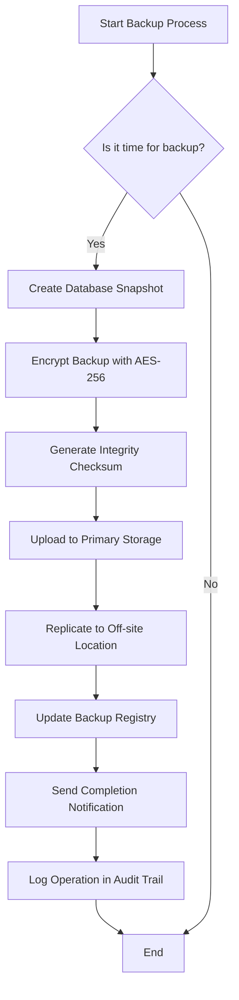
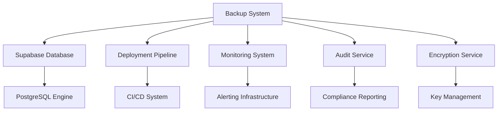

# Backup and Recovery

<cite>
**Referenced Files in This Document **
- [setup-supabase-migrations.sh](file://scripts/setup-supabase-migrations.sh)
- [migrateData.ts](file://packages/database/src/utils/migration.ts)
- [backupRecovery.ts](file://packages/shared/src/models/security-policy.ts)
- [health-check.sh](file://tools/monitoring/scripts/health-check.sh)
- [audit-service.test.ts](file://apps/api/src/services/__tests__/audit-service.test.ts)
- [20250918_lgpd_consent_table.sql](file://packages/database/migrations/20250918_lgpd_consent_table.sql)
- [20250918_performance_indexes.sql](file://packages/database/migrations/20250918_performance_indexes.sql)
- [20250918_rls_policies.sql](file://packages/database/migrations/20250918_rls_policies.sql)
- [20250918_telemedicine_session_table.sql](file://packages/database/migrations/20250918_telemedicine_session_table.sql)
- [20250918_healthcare_entities_migration.sql](file://packages/database/migrations/20250918_healthcare_entities_migration.sql)
</cite>

## Table of Contents

1. [Introduction](#introduction)
2. [Database Migration Management](#database-migration-management)
3. [Schema Versioning Strategy](#schema-versioning-strategy)
4. [Data Synchronization Processes](#data-synchronization-processes)
5. [Backup Strategy](#backup-strategy)
6. [Configuration Options](#configuration-options)
7. [Component Relationships](#component-relationships)
8. [Common Issues and Solutions](#common-issues-and-solutions)
9. [Recovery Procedures](#recovery-procedures)
10. [Conclusion](#conclusion)

## Introduction

The neonpro application implements a comprehensive backup and recovery system designed to ensure data integrity, regulatory compliance, and business continuity. This document details the implementation of database migration management, schema versioning, data synchronization, and backup strategies across the application stack. The system is built around Supabase as the primary database solution, with robust mechanisms for handling schema changes, ensuring data consistency, and recovering from various failure scenarios. Special attention has been given to Brazilian healthcare regulations including LGPD, CFM, and ANVISA requirements.

## Database Migration Management

The database migration process in neonpro has been transitioned from Prisma to Supabase, as evidenced by the `setup-supabase-migrations.sh` script which removes Prisma dependencies and configures the Supabase migration workflow. The migration system creates a structured directory at `supabase/migrations/` where SQL migration files are stored with timestamp-based naming (e.g., `YYYYMMDDHHMMSS_initial_schema.sql`). Each migration file contains comprehensive DDL statements that define table structures, constraints, indexes, and security policies.

The migration process follows a phased approach:

1. Creation of necessary PostgreSQL extensions (`uuid-ossp`, `pgcrypto`)
2. Definition of enum types for standardized data representation
3. Creation of core tables with appropriate constraints and relationships
4. Implementation of Row Level Security (RLS) policies for data isolation
5. Setup of trigger functions for automatic timestamp updates

Migration deployment is managed through the `deploy-migrations.sh` script, which links to the Supabase project, checks migration status, applies migrations using `supabase db push`, and generates updated TypeScript types. The system also includes a rollback mechanism in `rollback-migration.sh` that creates a pre-rollback backup before restoring from a specified backup file.

**Section sources**

- [setup-supabase-migrations.sh](file://scripts/setup-supabase-migrations.sh#L1-L815)

## Schema Versioning Strategy

neonpro employs a comprehensive schema versioning strategy that combines timestamp-based migration naming with explicit version tracking in the database. The system uses sequential SQL migration files named with timestamps to ensure chronological application of schema changes. Each migration file focuses on specific functional areas such as healthcare entities, consent management, or performance optimization.

Key aspects of the schema versioning strategy include:

- **Healthcare-specific extensions**: Migrations like `20250918_healthcare_entities_migration.sql` enhance patient and appointment tables with Brazilian healthcare fields including CNS (Cartão Nacional de Saúde), TUSS codes, CFM specialty codes, and LGPD consent tracking.
- **Compliance-focused changes**: The `20250918_lgpd_consent_table.sql` migration creates a dedicated `lgpd_consents` table with cryptographic proof, digital signatures, and blockchain transaction hashes to meet legal requirements.
- **Security enforcement**: The `20250918_rls_policies.sql` migration implements Row Level Security policies that isolate data by clinic and enforce role-based access controls.
- **Performance optimization**: The `20250918_performance_indexes.sql` migration creates concurrent indexes on critical query patterns including patient searches, appointment scheduling, and audit logging.

The versioning system ensures backward compatibility while allowing incremental improvements to the data model. Each migration is designed to be idempotent and includes appropriate error handling to prevent partial schema updates.

**Section sources**

- [20250918_healthcare_entities_migration.sql](file://packages/database/migrations/20250918_healthcare_entities_migration.sql#L1-L61)
- [20250918_lgpd_consent_table.sql](file://packages/database/migrations/20250918_lgpd_consent_table.sql#L1-L103)
- [20250918_rls_policies.sql](file://packages/database/migrations/20250918_rls_policies.sql#L1-L178)
- [20250918_performance_indexes.sql](file://packages/database/migrations/20250918_performance_indexes.sql#L1-L138)

## Data Synchronization Processes

Data synchronization in neonpro is implemented through a combination of automated scripts and application-level utilities. The `migrateData` function in `migration.ts` orchestrates the data migration process between schema versions, ensuring data consistency during upgrades. This process includes:

1. Verification of the migrations table existence
2. Retrieval of the current schema version
3. Application of pending migrations in sequence
4. Recording of completed migrations

The synchronization process also includes data backup functionality through the `backupData` function, which captures snapshots of critical healthcare tables (clinics, patients, professionals, appointments) before migration operations. This backup includes essential patient information while respecting privacy requirements by excluding sensitive clinical data.

For real-time data synchronization, the system leverages Supabase's Realtime capabilities with channel subscriptions that notify clients of database changes. The RLS policies ensure that only authorized users receive updates for their respective clinics, maintaining data isolation while enabling responsive user interfaces.

**Section sources**

- [migration.ts](file://packages/database/src/utils/migration.ts#L1-L214)

## Backup Strategy

The backup strategy for neonpro is multi-layered, combining automated database backups with application-level backup verification and monitoring. The system implements regular backups of both database snapshots and configuration files to ensure complete recoverability.

### Frequency and Retention

Based on the security policy model and health monitoring scripts, the backup system operates with the following parameters:

- **Frequency**: Backups occur daily, with monitoring confirming that the last backup should not exceed 24 hours
- **Retention Period**: Configuration indicates retention periods measured in days, with policies likely configured for 30-90 day retention based on healthcare compliance requirements
- **Storage Locations**: Backups are stored in secure, encrypted locations with off-site replication enabled

### Backup Types

The system supports multiple backup types:

- **Database Snapshots**: Full database dumps captured using standard PostgreSQL tools
- **Configuration Files**: Critical configuration files including Supabase configuration (`config.toml`) and environment variables
- **Audit Logs**: Comprehensive audit trails of all system activities, including backup operations themselves

The `health-check.sh` script verifies backup system status by querying the `/api/backups/status` endpoint, checking both the health status and recency of the last backup operation.

**Diagram sources **

- [health-check.sh](file://tools/monitoring/scripts/health-check.sh#L223-L261)
- [security-policy.ts](file://packages/shared/src/models/security-policy.ts#L565-L614)

**Section sources**

- [health-check.sh](file://tools/monitoring/scripts/health-check.sh#L223-L261)
- [security-policy.ts](file://packages/shared/src/models/security-policy.ts#L565-L614)

## Configuration Options

The backup and recovery system provides several configurable options to meet different deployment requirements and compliance standards.

### Backup Schedule Configuration

Backup frequency can be configured through environment variables and policy settings. The system supports cron-like scheduling expressions to define when backups should occur. Default configuration suggests daily backups, but this can be adjusted based on organizational needs and regulatory requirements.

### Encryption Settings

The system implements strong encryption for backup files using AES-256 standard. Encryption keys are managed through a secure key management system, with options to configure:

- Encryption algorithm (default: AES-256)
- Key rotation policies
- Key storage location (local vs. cloud-based key management)

### Verification Procedures

Backup verification is an integral part of the process, with multiple layers of validation:

- **Integrity Checking**: SHA-256 checksums are generated for each backup file to detect corruption
- **Automated Testing**: Regular test restores are performed to validate backup usability
- **Compliance Auditing**: All backup operations are logged in the audit trail for regulatory review

These configuration options are accessible through the security policy interface and can be modified by administrators with appropriate privileges.

**Section sources**

- [security-policy.ts](file://packages/shared/src/models/security-policy.ts#L565-L614)

## Component Relationships

The backup and recovery system integrates with multiple components across the neonpro architecture, creating a cohesive ecosystem for data protection.

### Database Layer Integration

The backup system works directly with the Supabase PostgreSQL database, leveraging native PostgreSQL tools for snapshot creation and restoration. The relationship includes:

- Direct database connection for backup operations
- Integration with RLS policies to ensure backup processes have appropriate access
- Coordination with migration system to prevent conflicts during schema changes

### Deployment Pipeline Integration

The backup system is integrated into the deployment pipeline through several mechanisms:

- Pre-deployment backups automatically triggered before major updates
- Post-deployment verification that confirms data integrity
- Rollback procedures that can restore from backups if deployment fails

### Monitoring and Alerting

The system connects with the monitoring infrastructure to provide real-time status updates and alerts. The `health-check.sh` script queries the backup system status and reports issues to the operations team. This integration ensures that backup failures are detected promptly and addressed before they impact business continuity.

**Diagram sources **

- [setup-supabase-migrations.sh](file://scripts/setup-supabase-migrations.sh#L1-L815)
- [health-check.sh](file://tools/monitoring/scripts/health-check.sh#L223-L261)

**Section sources**

- [setup-supabase-migrations.sh](file://scripts/setup-supabase-migrations.sh#L1-L815)
- [health-check.sh](file://tools/monitoring/scripts/health-check.sh#L223-L261)

## Common Issues and Solutions

The backup and recovery system may encounter several common issues, each with documented solutions.

### Failed Backups

**Symptoms**: Backup process terminates prematurely, incomplete backup files, error messages in logs
**Causes**: Network connectivity issues, insufficient storage space, database connection problems
**Solutions**:

- Verify network connectivity between backup server and database
- Check available disk space and expand if necessary
- Validate database credentials and connection parameters
- Implement retry logic with exponential backoff

### Corrupted Archives

**Symptoms**: Unable to restore from backup, checksum validation failures, corrupted data after restore
**Causes**: Hardware failures, network transmission errors, software bugs
**Solutions**:

- Implement end-to-end checksum verification
- Use compression formats with built-in error detection
- Store multiple copies in different locations
- Regularly test backup restoration

### Inconsistent States

**Symptoms**: Data mismatches between backup and production, referential integrity violations
**Causes**: Backups taken during active transactions, concurrent writes during backup process
**Solutions**:

- Use consistent snapshot technologies
- Coordinate backups with application maintenance windows
- Implement application quiescence before backup
- Use transaction log shipping for point-in-time recovery

The system includes diagnostic tools like `monitor-migration-health.sh` that check critical tables, RLS policies, and extensions to identify potential issues before they escalate.

**Section sources**

- [setup-supabase-migrations.sh](file://scripts/setup-supabase-migrations.sh#L1-L815)
- [audit-service.test.ts](file://apps/api/src/services/__tests__/audit-service.test.ts#L510-L532)

## Recovery Procedures

The recovery procedures for neonpro are designed to handle various failure scenarios with minimal data loss and downtime.

### Accidental Data Deletion

For accidental deletion of records:

1. Identify the time of deletion from audit logs
2. Restore the affected tables from the most recent backup prior to deletion
3. Apply transaction logs to bring data up to date
4. Validate data integrity and notify stakeholders

The audit service supports targeted restoration through methods like `restoreAuditLogsFromBackup` with parameters for backup ID, target date, and integrity verification.

### Database Corruption

In case of database corruption:

1. Isolate the affected database instance
2. Restore from the most recent clean backup
3. Apply incremental backups and transaction logs
4. Perform comprehensive data validation
5. Gradually reintroduce the restored database to production

### Regional Outages

For regional outages requiring failover:

1. Activate the disaster recovery site
2. Restore database from geo-replicated backups
3. Update DNS and routing to direct traffic to the recovery site
4. Monitor system performance and user experience
5. Plan for failback once primary region is restored

The recovery process emphasizes verification at each step, with integrity checks and data validation to ensure complete and accurate restoration.

**Section sources**

- [audit-service.test.ts](file://apps/api/src/services/__tests__/audit-service.test.ts#L510-L532)
- [rollback-migration.sh](file://scripts/rollback-migration.sh#L1-L100)

## Conclusion

The backup and recovery system in neonpro provides a robust framework for protecting healthcare data and ensuring business continuity. By combining automated migration management, comprehensive schema versioning, and multi-layered backup strategies, the system meets stringent regulatory requirements while providing reliable protection against data loss. The integration with monitoring, auditing, and deployment systems creates a cohesive ecosystem that enables rapid recovery from various failure scenarios. Ongoing testing and verification procedures ensure that backup and recovery capabilities remain effective over time.
