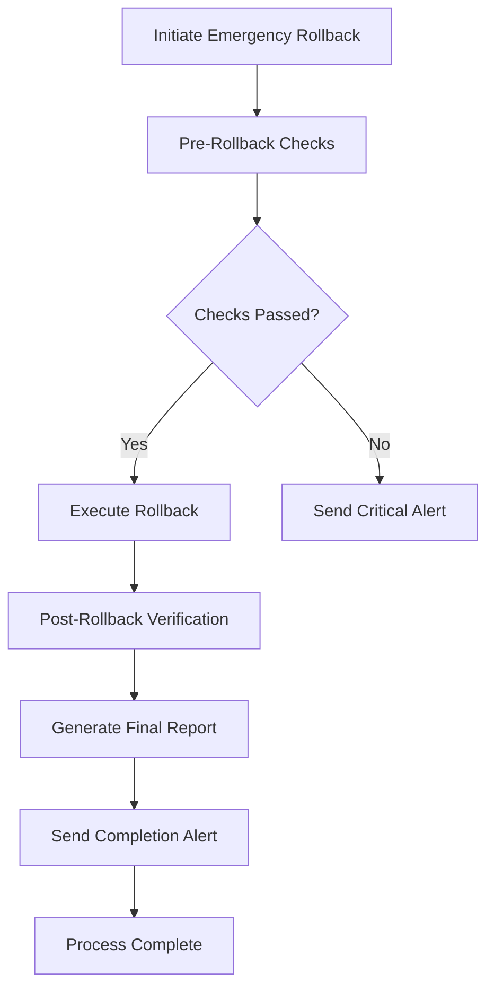
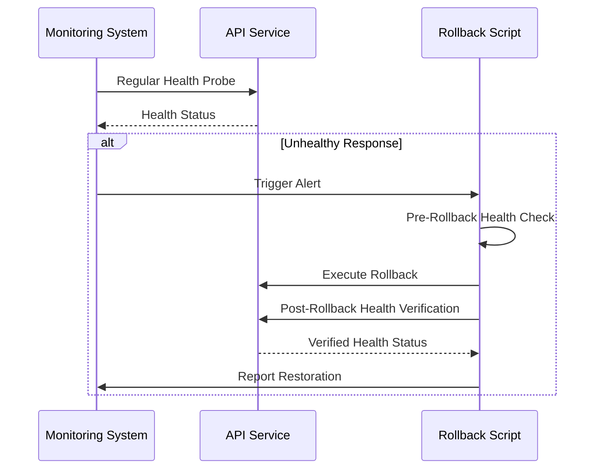
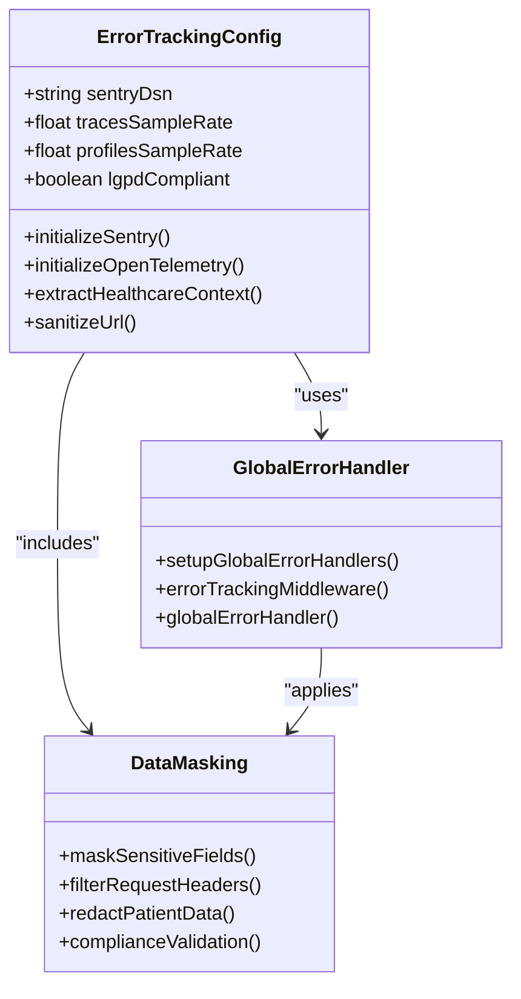
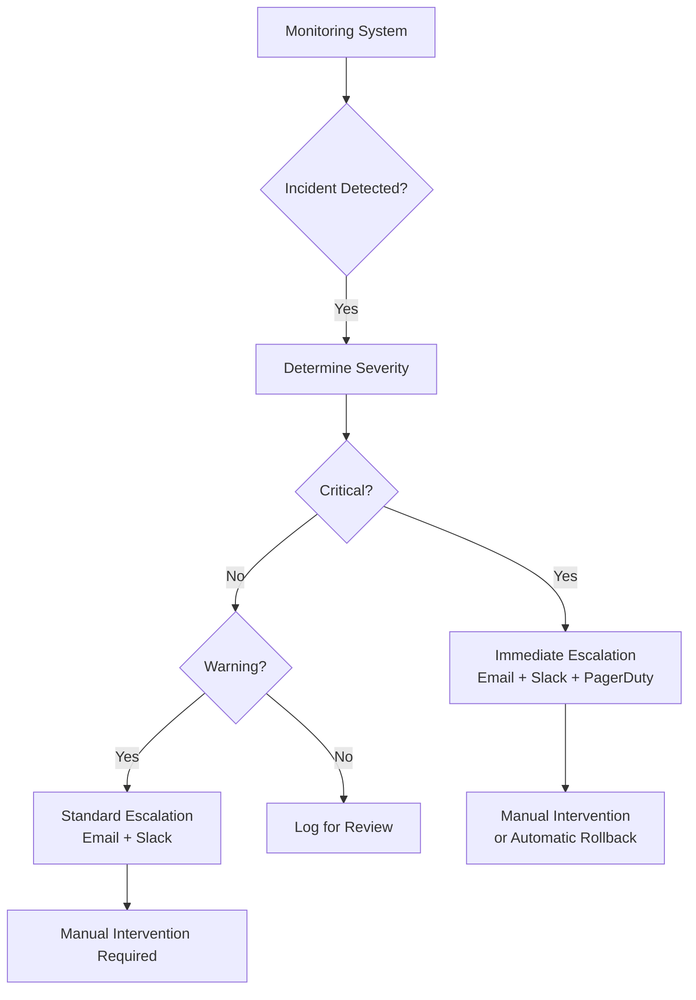
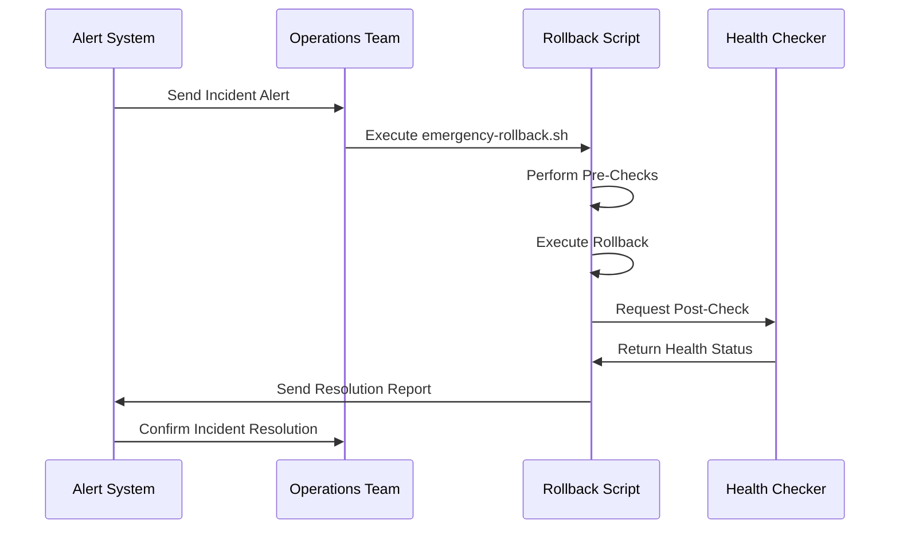
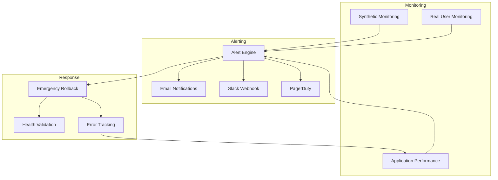

# Incident Response

<cite>
**Referenced Files in This Document **
- [emergency-rollback.sh](file://scripts/emergency-rollback.sh)
- [error-tracking.ts](file://apps/api/src/config/error-tracking.ts)
- [error-tracking.ts](file://apps/api/src/middleware/error-tracking.ts)
- [monitoring-config.ts](file://config/vercel/monitoring-config.ts)
</cite>

## Table of Contents

1. [Introduction](#introduction)
2. [Emergency Rollback Mechanism](#emergency-rollback-mechanism)
3. [Health Check Validation](#health-check-validation)
4. [Error Tracking Integration](#error-tracking-integration)
5. [Incident Identification and Escalation](#incident-identification-and-escalation)
6. [Incident Resolution Process](#incident-resolution-process)
7. [Configuration Options](#configuration-options)
8. [Component Relationships](#component-relationships)
9. [Common Issues and Solutions](#common-issues-and-solutions)
10. [Conclusion](#conclusion)

## Introduction

The NeonPro healthcare platform implements a comprehensive incident response system designed to ensure rapid recovery from critical failures while maintaining compliance with healthcare regulations such as LGPD, ANVISA, and CFM. This document details the implementation of emergency rollback procedures, health check validation mechanisms, and error tracking integration that form the core of the platform's resilience strategy. The system is designed to minimize downtime during deployment failures or service disruptions while protecting sensitive patient data throughout the incident management process.

## Emergency Rollback Mechanism

The emergency rollback mechanism in NeonPro provides automated recovery capabilities for critical incidents through the `emergency-rollback.sh` script. This bash script enables full, partial, or configuration-only rollbacks based on the nature and scope of the incident. The rollback process follows a structured workflow: pre-rollback checks, execution, post-verification, and reporting.

The script supports multiple rollback strategies:

- **Full rollback**: Reverts to the previous deployment using Vercel alias promotion or Git history
- **Partial rollback**: Restores specific components while maintaining other updated elements
- **Configuration-only rollback**: Reverts only configuration changes without affecting codebase

During execution, the script performs comprehensive pre-checks including Vercel CLI availability, current deployment health status, git history verification, and disk space assessment. Upon successful rollback, it conducts post-verification by checking health endpoints, API accessibility, and static asset serving. The entire process generates detailed JSON reports and log files for audit purposes, with automatic alerts sent via Slack, PagerDuty, and email notification systems.

**Diagram sources **

- [emergency-rollback.sh](file://scripts/emergency-rollback.sh#L1-L482)

**Section sources**

- [emergency-rollback.sh](file://scripts/emergency-rollback.sh#L1-L482)

## Health Check Validation

Health check validation in NeonPro ensures service integrity through multiple layers of monitoring and verification. The system implements both synthetic monitoring for critical user flows and real-time health endpoint validation. Synthetic monitoring tests essential healthcare workflows including patient registration, appointment booking, and patient portal access at regular intervals from multiple geographic locations.

The health check system includes performance thresholds for response time (warning at 2 seconds, critical at 5 seconds), availability (warning at 99.9%, critical at 99.0%), and error rate (warning at 1%, critical at 5%). These thresholds trigger appropriate alert levels based on severity. During rollback operations, the system validates health restoration by checking the primary health endpoint, API accessibility, and static asset serving after a stabilization period.

The architecture integrates health checks with the emergency rollback mechanism, where unhealthy deployments automatically justify rollback initiation. Health verification occurs both before rollback (to confirm current instability) and after rollback (to validate recovery). This dual validation approach ensures that rollbacks are performed only when necessary and confirms their success.

**Diagram sources **

- [monitoring-config.ts](file://config/vercel/monitoring-config.ts#L370-L400)
- [emergency-rollback.sh](file://scripts/emergency-rollback.sh#L150-L165)

**Section sources**

- [monitoring-config.ts](file://config/vercel/monitoring-config.ts#L370-L481)
- [emergency-rollback.sh](file://scripts/emergency-rollback.sh#L150-L165)

## Error Tracking Integration

NeonPro's error tracking integration combines Sentry and OpenTelemetry to provide comprehensive visibility into application errors while maintaining strict healthcare data protection standards. The system implements sophisticated data masking and filtering to comply with LGPD requirements, ensuring that sensitive patient information such as CPF numbers, medical records, and personal health data never leaves the secure environment.

The error tracking configuration includes healthcare-specific settings that monitor sensitive operations like patient data access, medical record updates, prescription changes, and billing operations. Before sending error reports to external services, the system removes or masks sensitive fields in request bodies, headers, and context data. This includes filtering authorization tokens, cookies, and any field containing keywords like "patient", "cpf", or "health".

Performance monitoring is integrated with error tracking through sampled tracing (1% in production) and profiling. The system captures breadcrumbs for user interactions while redacting sensitive data points. Global error handlers capture uncaught exceptions and unhandled promise rejections, with production environments configured to exit gracefully on critical errors to prevent inconsistent states.

**Diagram sources **

- [error-tracking.ts](file://apps/api/src/config/error-tracking.ts#L27-L175)
- [error-tracking.ts](file://apps/api/src/middleware/error-tracking.ts#L11-L80)

**Section sources**

- [error-tracking.ts](file://apps/api/src/config/error-tracking.ts#L1-L288)
- [error-tracking.ts](file://apps/api/src/middleware/error-tracking.ts#L1-L114)

## Incident Identification and Escalation

The incident identification and escalation process in NeonPro follows a tiered approach based on severity levels defined in the monitoring configuration. Incidents are identified through multiple channels including synthetic monitoring failures, elevated error rates, performance degradation, security events, and database connection issues.

The escalation policy defines three severity levels:

- **Critical**: Triggers immediate alerts to all channels (email, Slack, PagerDuty) with mandatory response within 15 minutes
- **Warning**: Notifies email and Slack channels with response expected within 1 hour
- **Info**: Logged for awareness without immediate notification

Specific alert rules include high error rate (>5% for 5 minutes), slow response time (>3 seconds p95 for 10 minutes), database connection issues (>10 errors per minute), and any security events. The system prioritizes healthcare-specific compliance violations, treating LGPD breaches, unauthorized data access, and consent violations as critical incidents requiring immediate attention.

Escalation protocols integrate with the emergency rollback mechanism, where certain critical alerts can automatically trigger rollback procedures if manual intervention does not occur within the defined response window. This automated escalation path ensures rapid recovery even when human responders are delayed.

**Diagram sources **

- [monitoring-config.ts](file://config/vercel/monitoring-config.ts#L430-L460)

**Section sources**

- [monitoring-config.ts](file://config/vercel/monitoring-config.ts#L430-L481)

## Incident Resolution Process

The incident resolution process in NeonPro follows a standardized workflow that begins with alert reception and ends with post-incident review. When an incident is detected, operations teams receive notifications through their preferred channels (Slack, email, or PagerDuty) with detailed information about the nature, severity, and potential impact of the issue.

For deployment-related incidents, the emergency rollback script provides a documented procedure for recovery. Operators execute the script with appropriate parameters specifying environment, reason, rollback type, and notification webhooks. The script guides them through pre-checks, execution, and verification steps, generating comprehensive logs and reports for audit purposes.

The resolution process distinguishes between different types of incidents:

- **Deployment failures**: Resolved through emergency rollback with full, partial, or config-only options
- **Performance degradation**: Addressed through scaling, caching optimization, or query tuning
- **Security incidents**: Handled according to healthcare compliance protocols with mandatory reporting
- **Data consistency issues**: Managed through backup restoration and data validation procedures

Post-resolution, the system generates detailed rollback reports containing timestamps, operator information, downtime calculations, critical issues encountered, and recommendations for prevention. These reports are stored for compliance auditing and used in post-mortem analyses to improve system resilience.

**Diagram sources **

- [emergency-rollback.sh](file://scripts/emergency-rollback.sh#L200-L400)

**Section sources**

- [emergency-rollback.sh](file://scripts/emergency-rollback.sh#L1-L482)

## Configuration Options

NeonPro provides extensive configuration options for tailoring incident response behavior to specific operational requirements. These configurations are managed through environment variables and configuration files that control alert thresholds, escalation policies, and communication channels.

Key configuration parameters include:

- **Alert thresholds**: Configurable response time, availability, and error rate thresholds for warning and critical levels
- **Sampling rates**: Adjustable trace and profile sampling rates based on environment (higher in development, lower in production)
- **Notification channels**: Configurable email recipients, Slack webhooks, and PagerDuty service keys
- **Rollback behavior**: Environment-specific settings for Vercel organization, project names, and authentication tokens

The system supports healthcare-specific configuration options that enable or disable monitoring for various compliance frameworks (LGPD, ANVISA, CFM) and sensitive operations. Logging configurations allow specification of log levels, output formats, and file rotation policies. The error tracking system can be fine-tuned to mask specific fields containing sensitive healthcare data based on organizational requirements.

These configuration options are designed to balance operational flexibility with regulatory compliance, ensuring that incident response procedures can be adapted to different environments while maintaining the necessary safeguards for protected health information.

**Section sources**

- [monitoring-config.ts](file://config/vercel/monitoring-config.ts#L1-L481)
- [error-tracking.ts](file://apps/api/src/config/error-tracking.ts#L1-L288)

## Component Relationships

The incident response components in NeonPro are tightly integrated with other system elements to create a cohesive resilience framework. The emergency rollback mechanism interacts directly with the deployment pipeline (Vercel/Git), monitoring system, and notification infrastructure. Health check validation is coordinated between synthetic monitoring services, API endpoints, and the rollback script.

Error tracking integration spans multiple layers of the application architecture, connecting frontend monitoring (RUM), backend error collection (Sentry), distributed tracing (OpenTelemetry), and logging systems. The global error handlers in the middleware layer capture exceptions and route them to the appropriate tracking services while ensuring graceful degradation.

The alerting system serves as the integration point between monitoring data and incident response actions, transforming metric violations into actionable alerts that can trigger manual or automated responses. Compliance monitoring components feed into the same alerting infrastructure, ensuring that regulatory violations receive appropriate attention alongside technical incidents.

This interconnected architecture enables coordinated responses where a single incident can trigger multiple complementary actions across different system components, providing defense in depth for critical healthcare operations.

**Diagram sources **

- [monitoring-config.ts](file://config/vercel/monitoring-config.ts#L1-L481)
- [emergency-rollback.sh](file://scripts/emergency-rollback.sh#L1-L482)

**Section sources**

- [monitoring-config.ts](file://config/vercel/monitoring-config.ts#L1-L481)
- [emergency-rollback.sh](file://scripts/emergency-rollback.sh#L1-L482)

## Common Issues and Solutions

NeonPro's incident response system addresses several common issues encountered in healthcare applications:

**False Alarms**: The system minimizes false positives through duration-based alert conditions (e.g., requiring high error rates to persist for 5 minutes) and multi-location synthetic monitoring to distinguish between localized network issues and genuine service outages.

**Cascading Failures**: Circuit breaker patterns and dependency isolation prevent failures in one component from propagating throughout the system. The health check system identifies failing dependencies early, allowing targeted rollbacks rather than full system recovery.

**Partial Outages**: Geographic redundancy and multi-region monitoring help identify regional outages versus global failures. The system can trigger region-specific responses rather than global rollbacks when appropriate.

**Data Sensitivity Conflicts**: The sophisticated data masking and filtering system resolves the tension between needing diagnostic information for incident resolution and protecting sensitive patient data. Contextual information is preserved while personally identifiable information is redacted.

**Rollback Conflicts**: The script includes pre-flight checks for git history and deployment availability, preventing failed rollback attempts. It also supports multiple rollback strategies (full, partial, config-only) to match the specific nature of the incident.

**Notification Overload**: Tiered severity levels and channel-specific routing prevent alert fatigue by ensuring critical incidents receive maximum attention while less severe issues are handled through appropriate channels.

These solutions are implemented through the coordinated operation of the emergency rollback script, health validation system, and error tracking integration, creating a robust defense against common operational challenges in healthcare technology environments.

**Section sources**

- [emergency-rollback.sh](file://scripts/emergency-rollback.sh#L1-L482)
- [monitoring-config.ts](file://config/vercel/monitoring-config.ts#L1-L481)

## Conclusion

The incident response system in NeonPro provides a comprehensive framework for managing operational incidents in a healthcare environment. By integrating emergency rollback capabilities, rigorous health validation, and compliant error tracking, the platform ensures high availability and rapid recovery while maintaining strict adherence to data protection regulations.

The system balances automation with human oversight, allowing for immediate response to critical incidents through automated rollback procedures while providing detailed reporting and audit trails for compliance purposes. Configuration flexibility enables adaptation to different operational contexts without compromising the core principles of patient data protection and service reliability.

For operations teams, this means a clear, well-documented path for incident resolution that minimizes downtime and maximizes system stability. For developers, it provides rich diagnostic information needed to identify and fix root causes while respecting privacy boundaries. Together, these components create a resilient foundation for delivering reliable healthcare services in a complex technological environment.
