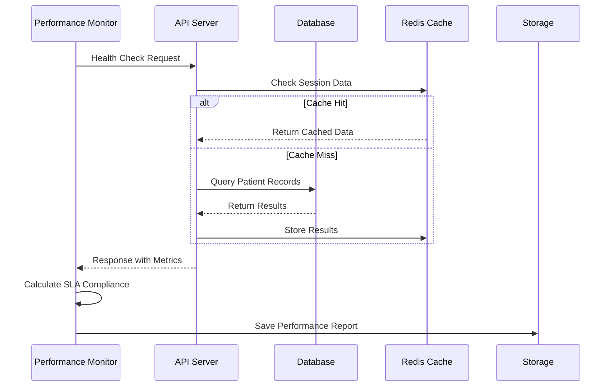
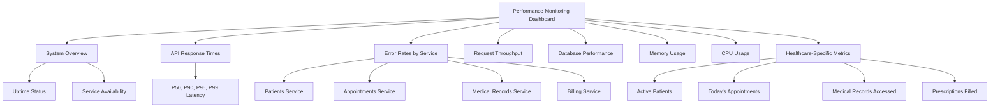
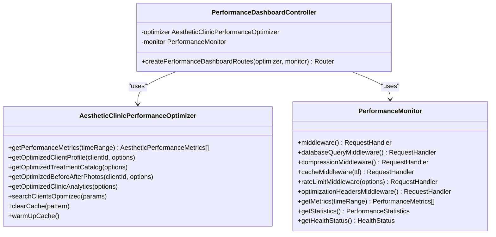

# Monitoring Dashboard

<cite>
**Referenced Files in This Document**
- [performance-monitor.js](file://apps/api/scripts/performance-monitor.js)
- [cert-monitor.js](file://apps/api/scripts/cert-monitor.js)
- [performance-dashboard.ts](file://apps/api/src/routes/performance-dashboard.ts)
- [monitoring-config.ts](file://config/vercel/monitoring-config.ts)
- [health.ts](file://apps/api/vercel/health.ts)
- [performance-monitoring.json](file://tools/monitoring/dashboards/performance-monitoring.json)
- [healthcare-overview.json](file://tools/monitoring/dashboards/healthcare-overview.json)
- [compliance-monitoring.json](file://tools/monitoring/dashboards/compliance-monitoring.json)
</cite>

## Table of Contents

1. [Introduction](#introduction)
2. [Monitoring System Architecture](#monitoring-system-architecture)
3. [Performance Monitoring Implementation](#performance-monitoring-implementation)
4. [Certificate Monitoring Implementation](#certificate-monitoring-implementation)
5. [Dashboard Configuration and Usage](#dashboard-configuration-and-usage)
6. [Data Collection and Integration](#data-collection-and-integration)
7. [Alerting Mechanisms](#alerting-mechanisms)
8. [Configuration Options](#configuration-options)
9. [Common Issues and Solutions](#common-issues-and-solutions)
10. [Performance Considerations](#performance-considerations)

## Introduction

The NeonPro monitoring dashboard provides real-time visibility into system health, performance metrics, and security status for the healthcare platform. This comprehensive monitoring system ensures compliance with Brazilian healthcare regulations while maintaining optimal application performance. The dashboard architecture integrates multiple monitoring components that collect data from various sources across the application stack, providing actionable insights for development and operations teams.

The monitoring system serves several critical purposes:

- Real-time tracking of API response times and error rates
- Continuous monitoring of TLS certificate expiration dates
- Compliance verification with LGPD, ANVISA, and CFM regulations
- Performance optimization through detailed metrics and recommendations
- Proactive alerting for potential issues before they impact users

This documentation covers the complete monitoring ecosystem, including the underlying architecture, implementation details, configuration options, and practical usage guidance for the NeonPro application.

## Monitoring System Architecture

The NeonPro monitoring system follows a distributed architecture that collects data from multiple sources and presents it through integrated dashboards. The system is designed to provide comprehensive visibility into application performance, security status, and regulatory compliance.

```mermaid
graph TB
subgraph "Data Collection"
A[Performance Monitor] --> |HTTP Requests| B[API Endpoints]
C[Certificate Monitor] --> |SSL/TLS Checks| D[External Services]
E[Synthetic Monitoring] --> |User Flows| F[Web Application]
G[Real User Monitoring] --> |Browser Metrics| H[Client Applications]
end
subgraph "Data Processing"
I[Metrics Aggregation] --> J[Time Series Database]
K[Log Processing] --> L[Structured Logging]
M[Event Correlation] --> N[Alert Engine]
end
subgraph "Visualization & Alerting"
O[Performance Dashboard] <- --> P[Grafana Dashboards]
Q[Compliance Dashboard] <- --> R[Healthcare Overview]
S[Alert Channels] --> T[Email]
S --> U[Slack]
S --> V[PagerDuty]
end
A --> I
C --> I
E --> I
G --> I
B --> K
F --> K
H --> K
J --> O
J --> Q
L --> O
L --> Q
N --> S
```

**Diagram sources**

- [performance-monitor.js](file://apps/api/scripts/performance-monitor.js)
- [cert-monitor.js](file://apps/api/scripts/cert-monitor.js)
- [monitoring-config.ts](file://config/vercel/monitoring-config.ts)

**Section sources**

- [performance-monitor.js](file://apps/api/scripts/performance-monitor.js)
- [cert-monitor.js](file://apps/api/scripts/cert-monitor.js)
- [monitoring-config.ts](file://config/vercel/monitoring-config.ts)

## Performance Monitoring Implementation

The performance monitoring system is implemented through a combination of client-side scripts, server-side middleware, and dedicated monitoring services. The core implementation revolves around the `HealthcarePerformanceMonitor` class that conducts regular health checks on critical endpoints and measures key performance indicators.

The performance monitor executes against a predefined set of Brazilian healthcare compliance endpoints, including patient lookup, telemedicine sessions, and adverse event reporting. It measures response times, availability, and error rates against strict SLA requirements specific to medical applications. The system enforces a maximum response time of 100ms, minimum availability of 99.9%, and maximum error rate of 0.1%.



**Diagram sources**

- [performance-monitor.js](file://apps/api/scripts/performance-monitor.js)
- [performance-dashboard.ts](file://apps/api/src/routes/performance-dashboard.ts)

**Section sources**

- [performance-monitor.js](file://apps/api/scripts/performance-monitor.js)
- [performance-dashboard.ts](file://apps/api/src/routes/performance-dashboard.ts)

## Certificate Monitoring Implementation

The certificate monitoring system ensures the security and trustworthiness of all SSL/TLS certificates used by the NeonPro platform. Implemented in the `cert-monitor.js` script, this system runs periodic checks on certificate validity and sends alerts when certificates approach expiration.

The certificate monitoring process operates on a configurable interval (default 6 hours) and can run in two modes: one-time execution for cron jobs or continuous daemon mode. When executed, it invokes the `certificateMonitor.runPeriodicCheck()` method which verifies the status of all configured domains and their associated certificates.

Key features of the certificate monitoring implementation include:

- Automated checking of certificate expiration dates
- Integration with the certificate management service
- Exit code signaling for external monitoring systems
- Graceful shutdown handling for container environments
- Comprehensive error handling and logging

The system returns different exit codes based on the overall health status: 0 for healthy, 1 for warnings, 2 for critical issues, and higher values for monitoring errors. This allows external systems like Kubernetes or CI/CD pipelines to take appropriate actions based on certificate health.

**Section sources**

- [cert-monitor.js](file://apps/api/scripts/cert-monitor.js)

## Dashboard Configuration and Usage

The NeonPro monitoring dashboard provides multiple views for different aspects of system health and performance. These dashboards are configured using JSON definitions that specify panels, data sources, and visualization options.

### Performance Monitoring Dashboard

The primary performance monitoring dashboard (`performance-monitoring.json`) displays comprehensive metrics across several categories:



**Diagram sources**

- [performance-monitoring.json](file://tools/monitoring/dashboards/performance-monitoring.json)

### Healthcare Overview Dashboard

The healthcare overview dashboard (`healthcare-overview.json`) provides a high-level view of system health with a focus on healthcare-specific metrics:

- System health status for web, API, and database services
- Active patient count and today's appointments
- API response time (95th percentile)
- Error rate trends
- Compliance status for LGPD, ANVISA, and CFM regulations
- Security incident tracking
- Audit event monitoring

### Compliance Monitoring Dashboard

The compliance monitoring dashboard (`compliance-monitoring.json`) focuses specifically on regulatory requirements:

- Overall compliance status for LGPD, ANVISA, and CFM
- Detailed metrics for each compliance framework
- Data protection and encryption success rates
- Audit logging completeness and retention
- Access control and authentication metrics
- Patient data governance scores
- Incident response times and resolution rates
- Training compliance metrics
- Third-party vendor compliance
- Risk assessment scores
- Regulatory reporting completion status

These dashboards are accessible through the Grafana interface and automatically refresh every 30 seconds to provide near real-time visibility into system status.

**Section sources**

- [performance-monitoring.json](file://tools/monitoring/dashboards/performance-monitoring.json)
- [healthcare-overview.json](file://tools/monitoring/dashboards/healthcare-overview.json)
- [compliance-monitoring.json](file://tools/monitoring/dashboards/compliance-monitoring.json)

## Data Collection and Integration

The monitoring system collects data from multiple sources through various integration points. The primary data collection mechanisms include Vercel edge functions, API routes, and dedicated monitoring scripts.

### Vercel Edge Function Integration

The health check endpoints in `health.ts` and `v1/health.ts` serve as critical data collection points for system availability monitoring. These edge functions return comprehensive health information including:

- System status and message
- Timestamp of the check
- Deployment identifier
- Environment information
- Method and path of the request
- Presence of critical environment variables (in development/internal mode)

The edge functions implement proper CORS headers to ensure secure access from authorized origins only. They handle preflight OPTIONS requests and return appropriate headers for cross-origin requests from trusted domains.

### API Route Integration

The performance dashboard routes defined in `performance-dashboard.ts` expose several endpoints for retrieving monitoring data:

- `/metrics`: Returns current performance metrics with optional time range filtering
- `/insights`: Provides performance insights and optimization recommendations
- `/cache`: Retrieves cache performance statistics and allows cache clearing
- `/queries`: Returns query performance data and slow query analysis
- `/images`: Provides image optimization metrics
- `/stream`: Establishes a Server-Sent Events connection for real-time metrics
- `/health`: Returns performance health status with degradation detection
- `/export`: Exports performance data in CSV or JSON format

These routes integrate with the `AestheticClinicPerformanceOptimizer` and `PerformanceMonitor` classes to collect and aggregate metrics from various parts of the application.



**Diagram sources**

- [performance-dashboard.ts](file://apps/api/src/routes/performance-dashboard.ts)
- [aesthetic-clinic-performance-optimizer.ts](file://apps/api/src/services/performance/aesthetic-clinic-performance-optimizer.ts)
- [performance-middleware.ts](file://apps/api/src/middleware/performance-middleware.ts)

**Section sources**

- [performance-dashboard.ts](file://apps/api/src/routes/performance-dashboard.ts)
- [health.ts](file://apps/api/vercel/health.ts)

## Alerting Mechanisms

The monitoring system implements a comprehensive alerting framework configured in `monitoring-config.ts`. This framework defines rules for detecting issues and channels for delivering alerts to the appropriate teams.

### Alert Rules

The system monitors several critical conditions and triggers alerts based on predefined thresholds:

- **High Error Rate**: Triggered when error rate exceeds 5% for more than 5 minutes
- **Slow Response Time**: Activated when 95th percentile response time exceeds 3 seconds for 10 minutes
- **High Memory Usage**: Notified when memory usage exceeds 80% for 5 minutes
- **Database Connection Issues**: Critical alert for more than 10 database connection errors in 1 minute
- **Security Events**: Immediate critical alert for any detected security events

### Alert Channels

Alerts are delivered through multiple channels to ensure timely notification:

- **Email**: Sent to devops@neonpro.healthcare and security@neonpro.healthcare for both critical and warning severity levels
- **Slack**: Posted to the #alerts channel for critical issues only, using the configured webhook URL
- **PagerDuty**: Integrated for critical incidents using the service key, ensuring 24/7 on-call coverage

The alerting configuration also includes synthetic monitoring for critical healthcare flows such as patient registration, appointment booking, and patient portal access. These synthetic tests run every 5-10 minutes from multiple geographic locations to ensure global availability.

Performance thresholds are defined for response time, availability, and error rate, with warning and critical levels that trigger appropriate alerts. This multi-tiered approach allows teams to address potential issues before they escalate to critical failures.

**Section sources**

- [monitoring-config.ts](file://config/vercel/monitoring-config.ts)

## Configuration Options

The monitoring system provides extensive configuration options through the `monitoring-config.ts` file and environment variables. These options allow customization of monitoring behavior, data collection, and alerting without code changes.

### Environment-Based Configuration

Several monitoring parameters are controlled by environment variables:

- `SENTRY_DSN`: Data Source Name for Sentry error tracking
- `NODE_ENV`: Application environment (production, staging, development)
- `APM_ENABLED`: Flag to enable or disable Application Performance Monitoring
- `APM_SAMPLE_RATE`: Transaction sampling rate for APM
- `LOG_LEVEL`: Minimum log level to record (debug, info, warn, error)
- `LOG_FORMAT`: Format for log output (json, plain)
- `CERT_CHECK_INTERVAL`: Interval between certificate checks in milliseconds
- `ALLOWED_ORIGINS`: Comma-separated list of allowed origins for CORS

### Dashboard Customization

The Grafana dashboards support several customization options:

- **Time Range**: Configurable from the UI with default set to last hour
- **Refresh Interval**: Automatically set to 30 seconds for performance dashboards
- **Environment Templating**: Dropdown selector for production, staging, and development environments
- **Compliance Framework Filtering**: Selector for LGPD, ANVISA, CFM, HIPAA, and GDPR frameworks

### Performance Monitoring Settings

The performance monitor can be customized with the following parameters:

- Traces sample rate (default 0.1)
- Session replay sample rate (default 0.1)
- Error replay sample rate (default 1.0)
- Profile sample rate (default 0.1)
- Synthetic monitoring frequency (5-10 minutes)
- Performance thresholds for response time, availability, and error rate

These configuration options enable teams to adjust monitoring intensity based on environment requirements, balancing thoroughness with resource utilization.

**Section sources**

- [monitoring-config.ts](file://config/vercel/monitoring-config.ts)

## Common Issues and Solutions

The monitoring system may encounter several common issues that require specific troubleshooting approaches.

### Missing Data Points

Missing data points in the dashboard can occur due to:

- **Collector Service Failure**: Verify that the performance and certificate monitoring services are running
- **Network Connectivity Issues**: Check connectivity between monitoring services and target endpoints
- **Authentication Problems**: Ensure API keys and credentials are valid and have not expired
- **Rate Limiting**: Confirm that monitoring requests are not being blocked by rate limiting

Solutions include restarting monitoring services, verifying network configurations, updating credentials, and adjusting rate limit settings.

### False Positive Alerts

False positive alerts may occur due to:

- **Transient Network Issues**: Short-lived connectivity problems that resolve automatically
- **Scheduled Maintenance**: Planned downtime that hasn't been communicated to the monitoring system
- **Configuration Drift**: Changes in system behavior that haven't been reflected in alert thresholds
- **Time Zone Differences**: Monitoring checks occurring during low-traffic periods

Mitigation strategies include implementing alert deduplication, setting maintenance windows, adjusting thresholds based on historical patterns, and ensuring consistent time zone configurations across all systems.

### Dashboard Loading Issues

Performance problems with dashboard loading can be addressed by:

- Reducing the time range displayed (e.g., from 24 hours to 1 hour)
- Disabling less critical panels temporarily
- Increasing the refresh interval from 30 seconds to 1 minute
- Verifying database performance for the metrics storage backend
- Checking network bandwidth between the client and dashboard server

### Certificate Monitoring Failures

Issues with certificate monitoring typically involve:

- **Permission Errors**: The monitoring service lacks permission to read certificate files
- **Path Configuration**: Incorrect paths to certificate stores or configuration files
- **Network Restrictions**: Firewalls blocking outbound connections to certificate authorities
- **Clock Skew**: System time inaccuracies affecting certificate validity checks

Resolution involves verifying file permissions, correcting configuration paths, adjusting firewall rules, and ensuring accurate system time synchronization.

**Section sources**

- [performance-monitor.js](file://apps/api/scripts/performance-monitor.js)
- [cert-monitor.js](file://apps/api/scripts/cert-monitor.js)
- [monitoring-config.ts](file://config/vercel/monitoring-config.ts)

## Performance Considerations

The monitoring system itself must be optimized to minimize its impact on the overall application performance. Several considerations ensure efficient operation:

### Dashboard Loading Speed

To optimize dashboard loading speed:

- Implement data pagination and limit the amount of data retrieved per request
- Use appropriate time ranges (shorter ranges for detailed analysis, longer ranges for trends)
- Enable panel-level caching where appropriate
- Optimize queries to retrieve only necessary fields
- Use summary metrics instead of raw data when possible

### Data Refresh Intervals

The refresh intervals are carefully balanced between real-time visibility and system load:

- Performance dashboards refresh every 30 seconds to provide near real-time updates
- Compliance dashboards refresh every 5 minutes due to less frequent changes
- Certificate monitoring runs every 6 hours as certificate status changes infrequently
- Synthetic monitoring executes every 5-10 minutes to balance coverage and load

### Resource Utilization

The monitoring system is designed to minimize resource consumption:

- Performance monitoring uses non-intrusive methods that add minimal overhead
- Certificate checks are performed asynchronously to avoid blocking
- Data aggregation occurs at regular intervals rather than continuously
- Historical data is aggregated and older data is rolled up to reduce storage requirements

### Scalability

The monitoring architecture supports scalability through:

- Distributed collectors that can be deployed across multiple regions
- Horizontal scaling of the metrics database
- Load-balanced dashboard servers
- Sharded storage for historical data
- Parallel processing of monitoring tasks

These performance considerations ensure that the monitoring system provides valuable insights without negatively impacting the application it monitors.

**Section sources**

- [performance-monitor.js](file://apps/api/scripts/performance-monitor.js)
- [monitoring-config.ts](file://config/vercel/monitoring-config.ts)
- [performance-monitoring.json](file://tools/monitoring/dashboards/performance-monitoring.json)
