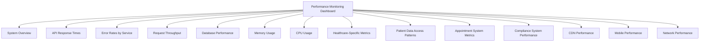
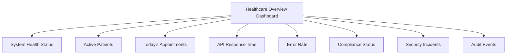
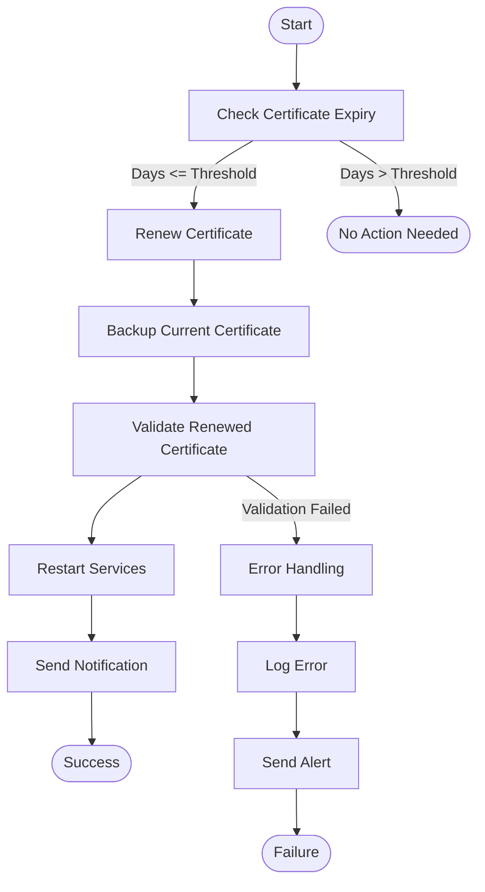

# Operational Guide

<cite>
**Referenced Files in This Document**
- [certificate-renewal.ts](file://apps/api/src/config/certificate-renewal.ts)
- [cert-renewal.sh](file://apps/api/scripts/cert-renewal.sh)
- [https-config.ts](file://apps/api/src/config/https-config.ts)
- [tls-config.ts](file://apps/api/src/config/tls-config.ts)
- [performance-monitoring.json](file://tools/monitoring/dashboards/performance-monitoring.json)
- [healthcare-overview.json](file://tools/monitoring/dashboards/healthcare-overview.json)
- [https-monitoring-middleware.ts](file://apps/api/src/middleware/https-monitoring-middleware.ts)
- [performance-middleware.ts](file://apps/api/src/middleware/performance-middleware.ts)
- [error-tracking.ts](file://apps/api/src/middleware/error-tracking.ts)
- [emergency-rollback.sh](file://scripts/emergency-rollback.sh)
</cite>

## Table of Contents

1. [Introduction](#introduction)
2. [Monitoring Dashboard Configuration](#monitoring-dashboard-configuration)
3. [Incident Response Procedures](#incident-response-procedures)
4. [Backup and Recovery Processes](#backup-and-recovery-processes)
5. [Update Workflows](#update-workflows)
6. [Support Channels](#support-channels)
7. [Common Operational Scenarios](#common-operational-scenarios)
8. [Performance Considerations](#performance-considerations)
9. [Conclusion](#conclusion)

## Introduction

The NeonPro application is a healthcare platform designed to ensure system reliability, availability, and performance in production environments. This operational guide provides comprehensive documentation for maintaining the application, focusing on key aspects such as monitoring, incident response, backup and recovery, updates, and support. The guide is structured to cater to both operations teams seeking conceptual understanding and DevOps engineers requiring technical details for effective system management.

**Section sources**

- [certificate-renewal.ts](file://apps/api/src/config/certificate-renewal.ts#L1-L297)
- [https-config.ts](file://apps/api/src/config/https-config.ts#L1-L166)

## Monitoring Dashboard Configuration

NeonPro utilizes Grafana-based dashboards for real-time monitoring of system health, performance, and compliance. Two primary dashboards are configured: **Performance Monitoring** and **Healthcare Overview**.

### Performance Monitoring Dashboard

The `performance-monitoring.json` dashboard provides detailed insights into system performance metrics across various components:

**Diagram sources**

- [performance-monitoring.json](file://tools/monitoring/dashboards/performance-monitoring.json#L1-L493)

Key features include:

- Real-time tracking of API response times (50th, 90th, 95th, and 99th percentiles)
- Error rate monitoring by service (patients, appointments, medical records, billing)
- Database performance metrics (query duration, active/idle connections)
- Memory and CPU usage across web, API, and database servers
- Healthcare-specific metrics (active patients, today's appointments, medical records accessed)

### Healthcare Overview Dashboard

The `healthcare-overview.json` dashboard offers a high-level view of critical healthcare metrics:

**Diagram sources**

- [healthcare-overview.json](file://tools/monitoring/dashboards/healthcare-overview.json#L1-L268)

This dashboard focuses on:

- System health status (web server, API server, database)
- Patient count and appointment scheduling metrics
- API response time (95th percentile) and error rates
- Compliance status (LGPD, ANVISA, CFM)
- Security incidents and audit event rates

Both dashboards refresh every 30 seconds and use Prometheus as the data source, ensuring timely detection of anomalies.

**Section sources**

- [performance-monitoring.json](file://tools/monitoring/dashboards/performance-monitoring.json#L1-L493)
- [healthcare-overview.json](file://tools/monitoring/dashboards/healthcare-overview.json#L1-L268)

## Incident Response Procedures

NeonPro has established robust incident response procedures to address common issues promptly. These procedures are supported by automated monitoring and alerting systems.

### Certificate Renewal Process

SSL/TLS certificate renewal is managed through a combination of Node.js configuration and shell scripting. The process involves:

1. **Expiry Check**: The `checkCertificateExpiry()` function parses the certificate and calculates days until expiry.
2. **Renewal Trigger**: If the certificate expires within the threshold (default 30 days), renewal is triggered.
3. **Provider Selection**: Supports both Let's Encrypt (`letsencrypt`) and manual renewal processes.
4. **Notification System**: Logs warnings and sends notifications upon successful or failed renewals.

The `cert-renewal.sh` script automates this process with additional features:

- Backup of current certificates before renewal
- Validation of renewed certificates using OpenSSL
- Restart of services post-renewal
- Comprehensive logging and audit trail generation

**Diagram sources**

- [certificate-renewal.ts](file://apps/api/src/config/certificate-renewal.ts#L1-L297)
- [cert-renewal.sh](file://apps/api/scripts/cert-renewal.sh#L1-L231)

### Emergency Rollback Procedure

In case of critical failures, the `emergency-rollback.sh` script enables rapid rollback to a previous deployment state. Key steps include:

1. **Pre-Rollback Checks**: Verifies Vercel CLI availability, current deployment health, and available rollback points.
2. **Rollback Execution**: Supports full, partial, and configuration-only rollbacks.
3. **Post-Rollback Verification**: Validates health endpoint, API accessibility, and static asset serving.
4. **Reporting**: Generates a JSON report detailing rollback results, critical issues, and downtime.

The script integrates with external notification systems (Slack, PagerDuty) for real-time alerts during the rollback process.

**Section sources**

- [certificate-renewal.ts](file://apps/api/src/config/certificate-renewal.ts#L1-L297)
- [cert-renewal.sh](file://apps/api/scripts/cert-renewal.sh#L1-L231)
- [emergency-rollback.sh](file://scripts/emergency-rollback.sh#L1-L482)

## Backup and Recovery Processes

While specific backup scripts are not explicitly mentioned in the provided files, the architecture supports several recovery mechanisms:

- **Certificate Backups**: The `cert-renewal.sh` script automatically backs up certificates before renewal.
- **Git-Based Rollbacks**: Utilizes Git history for full or partial rollbacks.
- **Vercel Deployment History**: Leverages Vercel's deployment aliases for promoting previous versions.

Recovery strategies should incorporate regular backups of:

- Database snapshots
- Configuration files
- Environment variables
- SSL/TLS certificates

**Section sources**

- [cert-renewal.sh](file://apps/api/scripts/cert-renewal.sh#L1-L231)
- [emergency-rollback.sh](file://scripts/emergency-rollback.sh#L1-L482)

## Update Workflows

Application updates follow a structured workflow involving testing, staging, and production deployments. Key scripts include:

- `deploy.sh`: Primary deployment script
- `deploy-api-separate.sh`: API-specific deployment
- `deploy-unified.sh`: Unified deployment approach
- `deploy-vercel.sh`: Vercel-specific deployment

These scripts likely integrate with CI/CD pipelines to automate testing and validation before production deployment.

**Section sources**

- [deploy.sh](file://scripts/deploy.sh#L1-L20)
- [deploy-api-separate.sh](file://scripts/deploy-api-separate.sh#L1-L20)
- [deploy-unified.sh](file://scripts/deploy-unified.sh#L1-L20)
- [deploy-vercel.sh](file://scripts/deploy-vercel.sh#L1-L20)

## Support Channels

Support operations are facilitated through multiple channels:

- **Logging**: Comprehensive logging via `logger` module with different severity levels.
- **Error Tracking**: Global error handlers capture uncaught exceptions and promise rejections.
- **Notifications**: Integration with Slack and PagerDuty for real-time alerts.
- **Audit Trails**: Detailed audit logs for security and compliance purposes.

The `error-tracking.ts` middleware sets up global error handlers that log errors with stack traces and send appropriate responses based on environment settings.

**Section sources**

- [error-tracking.ts](file://apps/api/src/middleware/error-tracking.ts#L1-L114)

## Common Operational Scenarios

### Responding to Performance Degradation

When performance degradation is detected:

1. Monitor the **Performance Monitoring Dashboard** for increased response times or error rates.
2. Use the `performance-middleware.ts` to identify slow requests exceeding thresholds (warning: 1s, critical: 5s).
3. Analyze database query patterns and optimize if necessary.
4. Scale resources or implement caching strategies.

### Handling Certificate Renewals

For certificate renewals:

1. The system automatically checks expiry every 24 hours.
2. When nearing expiration (≤30 days), it triggers renewal via Let's Encrypt or notifies for manual renewal.
3. Post-renewal, validate the certificate using OpenSSL commands.
4. Restart services to load the new certificate.

### Executing Emergency Rollbacks

During emergencies:

1. Initiate `emergency-rollback.sh` with appropriate parameters (environment, reason, type).
2. The script performs pre-checks and executes the specified rollback type.
3. Post-verification ensures health restoration.
4. Generate and distribute the rollback report for post-mortem analysis.

**Section sources**

- [performance-middleware.ts](file://apps/api/src/middleware/performance-middleware.ts#L1-L425)
- [certificate-renewal.ts](file://apps/api/src/config/certificate-renewal.ts#L1-L297)
- [emergency-rollback.sh](file://scripts/emergency-rollback.sh#L1-L482)

## Performance Considerations

### System Tuning

Optimize performance by:

- Adjusting performance thresholds in `performance-middleware.ts`.
- Implementing rate limiting to prevent abuse.
- Enabling compression for API responses.
- Utilizing caching for frequently accessed data.

### Capacity Planning

Plan capacity based on metrics from the monitoring dashboards:

- Monitor memory usage trends to determine scaling needs.
- Track request throughput to anticipate load increases.
- Analyze database connection patterns for optimization.

Regularly review the **Performance Monitoring Dashboard** to identify bottlenecks and plan infrastructure upgrades accordingly.

**Section sources**

- [performance-middleware.ts](file://apps/api/src/middleware/performance-middleware.ts#L1-L425)
- [performance-monitoring.json](file://tools/monitoring/dashboards/performance-monitoring.json#L1-L493)

## Conclusion

Maintaining the NeonPro application in production requires a proactive approach to monitoring, incident response, and system optimization. By leveraging the provided tools and following established procedures, operations teams can ensure high availability, reliability, and performance. Continuous monitoring through dashboards, automated certificate management, and well-defined rollback procedures form the foundation of a resilient operational framework.

**Section sources**

- [certificate-renewal.ts](file://apps/api/src/config/certificate-renewal.ts#L1-L297)
- [performance-middleware.ts](file://apps/api/src/middleware/performance-middleware.ts#L1-L425)
- [emergency-rollback.sh](file://scripts/emergency-rollback.sh#L1-L482)
