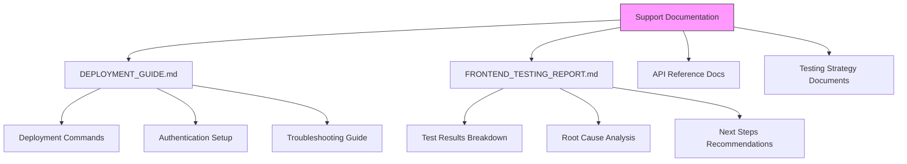
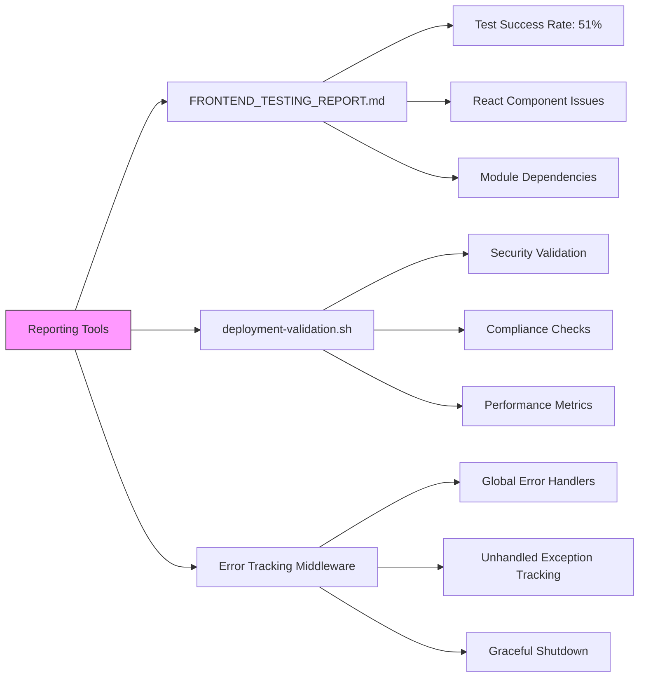
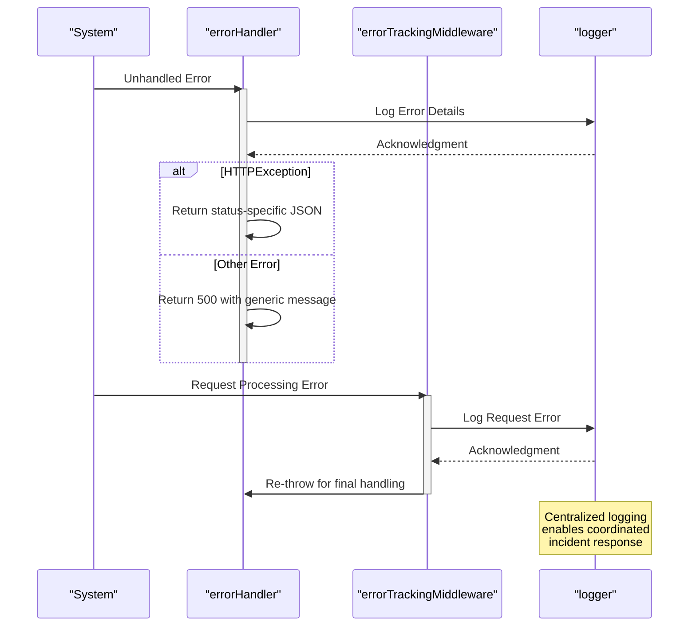
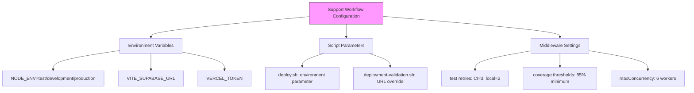
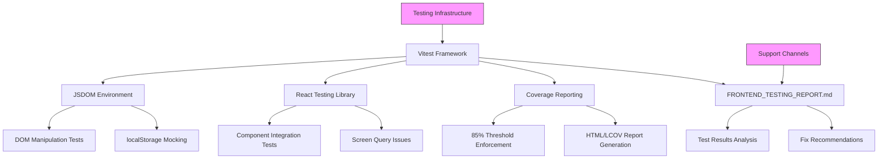
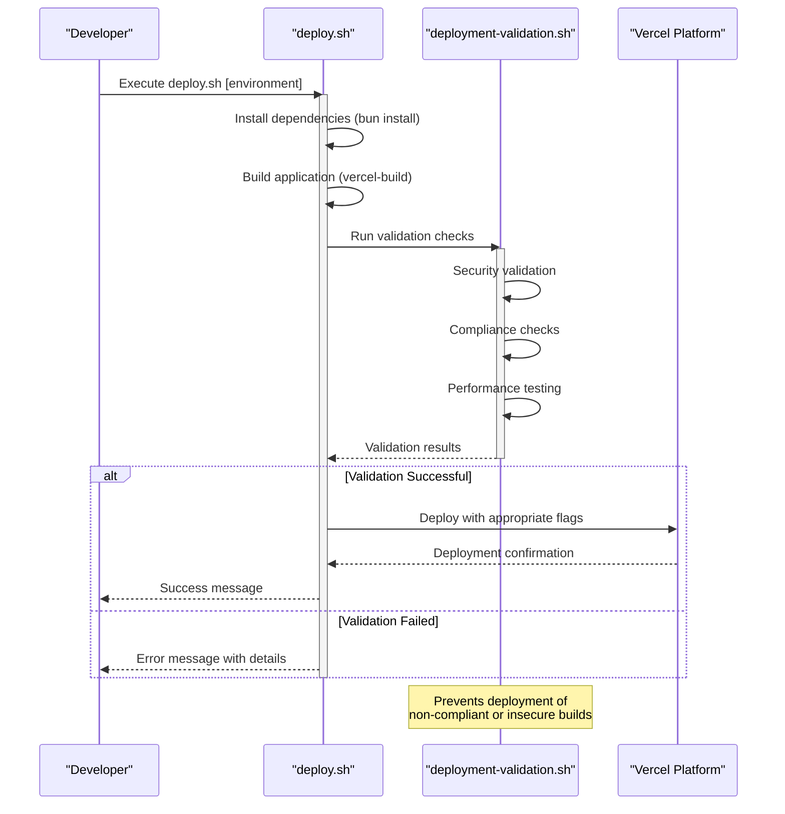
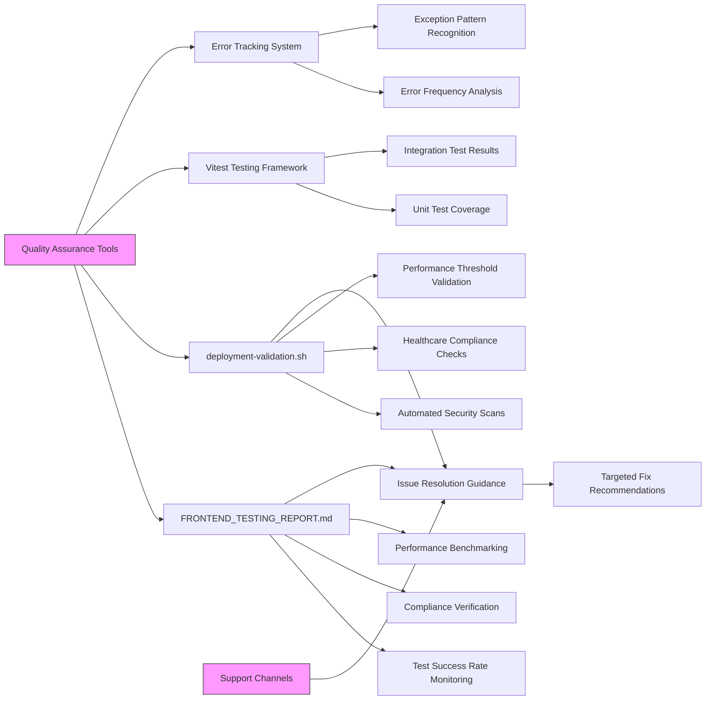
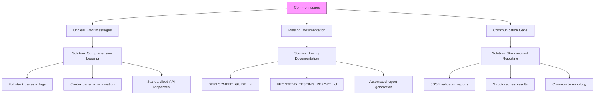
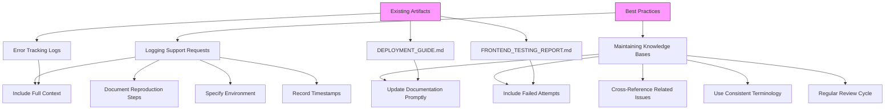

# Support Channels

<cite>
**Referenced Files in This Document**
- [DEPLOYMENT_GUIDE.md](file://DEPLOYMENT_GUIDE.md)
- [FRONTEND_TESTING_REPORT.md](file://FRONTEND_TESTING_REPORT.md)
- [apps/api/src/middleware/error-tracking.ts](file://apps/api/src/middleware/error-tracking.ts)
- [apps/api/src/middleware/error-handler.ts](file://apps/api/src/middleware/error-handler.ts)
- [scripts/deploy.sh](file://scripts/deploy.sh)
- [scripts/deployment-validation.sh](file://scripts/deployment-validation.sh)
</cite>

## Table of Contents

1. [Introduction](#introduction)
2. [Documentation Resources](#documentation-resources)
3. [Reporting Tools](#reporting-tools)
4. [Coordination Mechanisms](#coordination-mechanisms)
5. [Configuration Options for Support Workflows](#configuration-options-for-support-workflows)
6. [Integration with Testing Infrastructure](#integration-with-testing-infrastructure)
7. [Deployment Pipeline Integration](#deployment-pipeline-integration)
8. [Quality Assurance Tools Integration](#quality-assurance-tools-integration)
9. [Common Issues and Solutions](#common-issues-and-solutions)
10. [Best Practices](#best-practices)

## Introduction

The neonpro application provides a comprehensive support ecosystem designed to facilitate operational excellence across development, testing, deployment, and maintenance phases. This document details the various support channels available to teams, including documentation resources, reporting tools, and coordination frameworks that enable efficient troubleshooting, issue resolution, and knowledge sharing.

**Section sources**

- [DEPLOYMENT_GUIDE.md](file://DEPLOYMENT_GUIDE.md)
- [FRONTEND_TESTING_REPORT.md](file://FRONTEND_TESTING_REPORT.md)

## Documentation Resources

The neonpro application maintains extensive documentation resources to assist teams in understanding system behavior, resolving issues, and following best practices. These resources include deployment guides, testing reports, and configuration references that serve as primary knowledge bases for operational support.

The **DEPLOYMENT_GUIDE.md** provides step-by-step instructions for deploying the application to Vercel, covering authentication setup, deployment commands, build verification procedures, and troubleshooting common issues. It includes specific guidance for different deployment scenarios (interactive login vs. token-based authentication) and outlines the required environment variables for successful deployment.

Similarly, the **FRONTEND_TESTING_REPORT.md** offers detailed insights into the frontend testing status, providing an executive summary of test results, progress achieved, technical fixes implemented, and next steps for achieving full test coverage. This report serves as a diagnostic tool for identifying UI problems and guiding remediation efforts.

**Diagram sources**

- [DEPLOYMENT_GUIDE.md](file://DEPLOYMENT_GUIDE.md)
- [FRONTEND_TESTING_REPORT.md](file://FRONTEND_TESTING_REPORT.md)

**Section sources**

- [DEPLOYMENT_GUIDE.md](file://DEPLOYMENT_GUIDE.md#L1-L116)
- [FRONTEND_TESTING_REPORT.md](file://FRONTEND_TESTING_REPORT.md#L1-L160)

## Reporting Tools

The neonpro application incorporates sophisticated reporting tools that provide actionable insights into system performance, error conditions, and compliance status. These tools generate structured reports that help teams diagnose issues and track resolution progress.

The **FRONTEND_TESTING_REPORT.md** exemplifies the reporting capability by providing a comprehensive assessment of frontend test status, including metrics on passing/failing tests, category breakdowns, and performance benchmarks. The report identifies specific failure patterns (such as React Testing Library configuration issues) and provides targeted recommendations for resolution.

Additionally, the **deployment-validation.sh** script generates JSON validation reports that systematically evaluate security, compliance, performance, and functionality aspects of deployments. These automated reports identify critical issues, warnings, and recommendations, enabling teams to address problems before they impact production environments.

**Diagram sources**

- [FRONTEND_TESTING_REPORT.md](file://FRONTEND_TESTING_REPORT.md)
- [scripts/deployment-validation.sh](file://scripts/deployment-validation.sh)
- [apps/api/src/middleware/error-tracking.ts](file://apps/api/src/middleware/error-tracking.ts)

**Section sources**

- [FRONTEND_TESTING_REPORT.md](file://FRONTEND_TESTING_REPORT.md#L1-L160)
- [scripts/deployment-validation.sh](file://scripts/deployment-validation.sh#L1-L360)

## Coordination Mechanisms

The neonpro application implements robust coordination mechanisms through its error handling middleware and global event handlers, ensuring consistent responses to exceptional conditions and facilitating coordinated team responses to incidents.

The error tracking system, defined in **error-tracking.ts**, establishes global handlers for uncaught exceptions, unhandled promise rejections, and system signals (SIGTERM, SIGINT). These handlers ensure graceful shutdown procedures while logging comprehensive error information for diagnostic purposes. In production environments, the system exits on critical errors to prevent unstable states.

The **error-handler.ts** middleware provides request-level error handling for the API, capturing and formatting errors in a standardized way. It distinguishes between HTTP exceptions (from Hono) and other error types, returning appropriate JSON responses while maintaining consistency in error reporting.

**Diagram sources**

- [apps/api/src/middleware/error-handler.ts](file://apps/api/src/middleware/error-handler.ts)
- [apps/api/src/middleware/error-tracking.ts](file://apps/api/src/middleware/error-tracking.ts)

**Section sources**

- [apps/api/src/middleware/error-handler.ts](file://apps/api/src/middleware/error-handler.ts#L7-L45)
- [apps/api/src/middleware/error-tracking.ts](file://apps/api/src/middleware/error-tracking.ts#L11-L112)

## Configuration Options for Support Workflows

The neonpro application provides configurable support workflows through environment variables, script parameters, and middleware settings that allow teams to tailor the support experience to their specific needs.

Deployment scripts like **deploy.sh** accept environment parameters (production, staging, preview) that determine the deployment target and strategy. The script orchestrates dependency installation, application building, and Vercel deployment with appropriate flags for each environment.

The **vitest.config.ts** files in both the API and web applications expose numerous configuration options for testing workflows, including environment settings, performance optimization parameters, retry strategies for flaky tests, coverage thresholds, and mock configurations. These settings enable teams to optimize their testing processes based on specific requirements.

**Diagram sources**

- [scripts/deploy.sh](file://scripts/deploy.sh)
- [apps/web/vitest.config.ts](file://apps/web/vitest.config.ts)
- [apps/api/vitest.config.ts](file://apps/api/vitest.config.ts)

**Section sources**

- [scripts/deploy.sh](file://scripts/deploy.sh#L1-L32)
- [apps/web/vitest.config.ts](file://apps/web/vitest.config.ts#L1-L161)

## Integration with Testing Infrastructure

The neonpro application's support channels are deeply integrated with its testing infrastructure, creating a feedback loop that enhances quality assurance and accelerates issue resolution.

The **FRONTEND_TESTING_REPORT.md** directly reflects the output of the Vitest testing framework configured in **vitest.config.ts**, providing a human-readable interpretation of test results. This integration allows teams to quickly identify failing test categories (like React component tests) and implement targeted fixes.

The testing infrastructure includes specialized configurations for different testing needs:

- JSDOM environment for DOM manipulation testing
- React Testing Library integration for component testing
- Mock implementations for localStorage and sessionStorage
- Coverage reporting with v8 provider and threshold enforcement

**Diagram sources**

- [FRONTEND_TESTING_REPORT.md](file://FRONTEND_TESTING_REPORT.md)
- [apps/web/vitest.config.ts](file://apps/web/vitest.config.ts)

**Section sources**

- [FRONTEND_TESTING_REPORT.md](file://FRONTEND_TESTING_REPORT.md#L1-L160)
- [apps/web/vitest.config.ts](file://apps/web/vitest.config.ts#L1-L161)

## Deployment Pipeline Integration

The neonpro application's support channels are tightly integrated with its deployment pipeline, ensuring that issues are identified and addressed before reaching production environments.

The **deploy.sh** script orchestrates the entire deployment process, from dependency installation to Vercel deployment, providing a standardized workflow that reduces deployment errors. It accepts environment parameters to differentiate between production, staging, and preview deployments.

Complementing this, the **deployment-validation.sh** script performs comprehensive pre-deployment validation, checking security headers, healthcare compliance (LGPD, ANVISA, CFM), performance metrics, and core functionality. This automated validation creates a quality gate that prevents problematic deployments.

**Diagram sources**

- [scripts/deploy.sh](file://scripts/deploy.sh)
- [scripts/deployment-validation.sh](file://scripts/deployment-validation.sh)

**Section sources**

- [scripts/deploy.sh](file://scripts/deploy.sh#L1-L32)
- [scripts/deployment-validation.sh](file://scripts/deployment-validation.sh#L1-L360)

## Quality Assurance Tools Integration

The neonpro application integrates multiple quality assurance tools into its support ecosystem, creating a comprehensive quality control framework that spans development, testing, and deployment phases.

The **FRONTEND_TESTING_REPORT.md** serves as a central QA artifact, aggregating results from various testing categories and highlighting areas needing improvement. It specifically identifies issues with React Testing Library configuration and module dependencies, providing clear direction for quality improvements.

The **deployment-validation.sh** script functions as an automated QA gate, validating multiple dimensions of quality including security, compliance, performance, and functionality. Its JSON output format enables integration with CI/CD pipelines and monitoring systems.

**Diagram sources**

- [FRONTEND_TESTING_REPORT.md](file://FRONTEND_TESTING_REPORT.md)
- [scripts/deployment-validation.sh](file://scripts/deployment-validation.sh)
- [apps/api/src/middleware/error-tracking.ts](file://apps/api/src/middleware/error-tracking.ts)

**Section sources**

- [FRONTEND_TESTING_REPORT.md](file://FRONTEND_TESTING_REPORT.md#L1-L160)
- [scripts/deployment-validation.sh](file://scripts/deployment-validation.sh#L1-L360)

## Common Issues and Solutions

The neonpro application's support channels are designed to address common operational challenges, particularly those related to unclear error messages, missing documentation, and communication gaps between teams.

One prevalent issue is **unclear error messages**, which is mitigated through comprehensive error logging in the middleware components. The **error-tracking.ts** file ensures that all unhandled exceptions and promise rejections are logged with full context (message, stack trace, request path), while the **error-handler.ts** provides standardized JSON responses that maintain consistency across the API.

For **missing documentation**, the system relies on living documents like **DEPLOYMENT_GUIDE.md** and **FRONTEND_TESTING_REPORT.md** that are regularly updated to reflect current system states. These documents not only describe expected behaviors but also document known issues and workarounds.

To address **communication gaps between teams**, the standardized reporting formats (JSON validation reports, structured test reports) create a common language for discussing issues. The automated nature of these reports reduces ambiguity and ensures all teams are working from the same data.

**Diagram sources**

- [apps/api/src/middleware/error-tracking.ts](file://apps/api/src/middleware/error-tracking.ts)
- [apps/api/src/middleware/error-handler.ts](file://apps/api/src/middleware/error-handler.ts)
- [DEPLOYMENT_GUIDE.md](file://DEPLOYMENT_GUIDE.md)
- [FRONTEND_TESTING_REPORT.md](file://FRONTEND_TESTING_REPORT.md)

**Section sources**

- [apps/api/src/middleware/error-tracking.ts](file://apps/api/src/middleware/error-tracking.ts#L11-L112)
- [apps/api/src/middleware/error-handler.ts](file://apps/api/src/middleware/error-handler.ts#L7-L45)
- [DEPLOYMENT_GUIDE.md](file://DEPLOYMENT_GUIDE.md#L1-L116)
- [FRONTEND_TESTING_REPORT.md](file://FRONTEND_TESTING_REPORT.md#L1-L160)

## Best Practices

To maximize the effectiveness of the neonpro application's support channels, teams should follow several best practices for logging support requests and maintaining knowledge bases.

When logging support requests, include comprehensive context such as:

- Exact error messages and stack traces
- Reproduction steps with specific inputs
- Environment information (development, staging, production)
- Timestamps of when the issue occurred
- Any recent changes that might have triggered the issue

For maintaining knowledge bases, follow these guidelines:

- Update documentation immediately when fixes are implemented
- Include both successful solutions and unsuccessful attempts
- Cross-reference related issues and solutions
- Use consistent terminology across all documentation
- Regularly review and prune outdated information

The existing documentation artifacts demonstrate these best practices:

- **DEPLOYMENT_GUIDE.md** includes specific command examples and troubleshooting steps
- **FRONTEND_TESTING_REPORT.md** provides detailed root cause analysis and prioritized recommendations
- The error tracking middleware ensures consistent logging formats across the application

**Diagram sources**

- [DEPLOYMENT_GUIDE.md](file://DEPLOYMENT_GUIDE.md)
- [FRONTEND_TESTING_REPORT.md](file://FRONTEND_TESTING_REPORT.md)
- [apps/api/src/middleware/error-tracking.ts](file://apps/api/src/middleware/error-tracking.ts)

**Section sources**

- [DEPLOYMENT_GUIDE.md](file://DEPLOYMENT_GUIDE.md#L1-L116)
- [FRONTEND_TESTING_REPORT.md](file://FRONTEND_TESTING_REPORT.md#L1-L160)
- [apps/api/src/middleware/error-tracking.ts](file://apps/api/src/middleware/error-tracking.ts#L11-L112)
