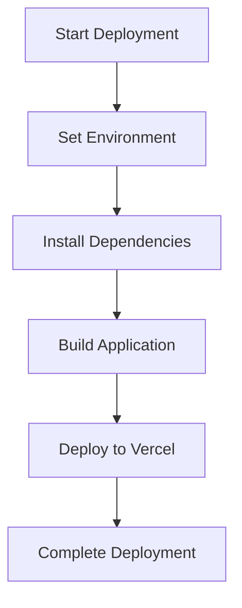
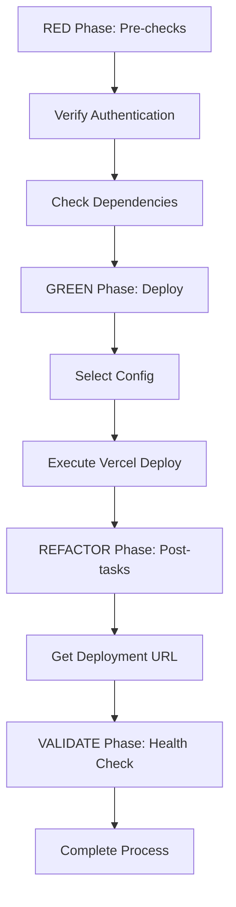
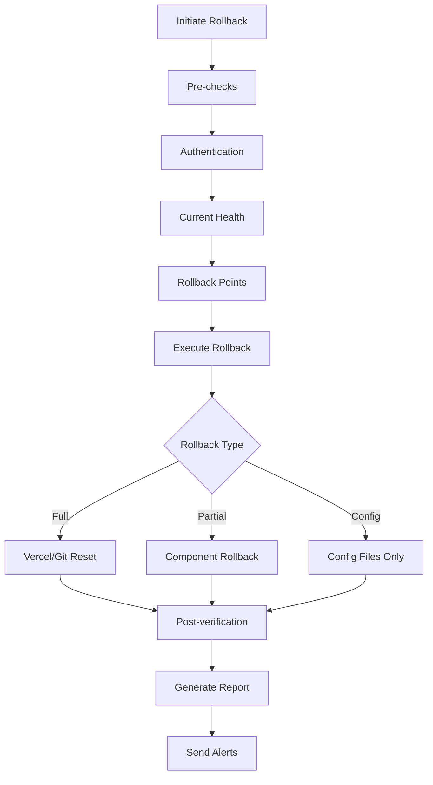
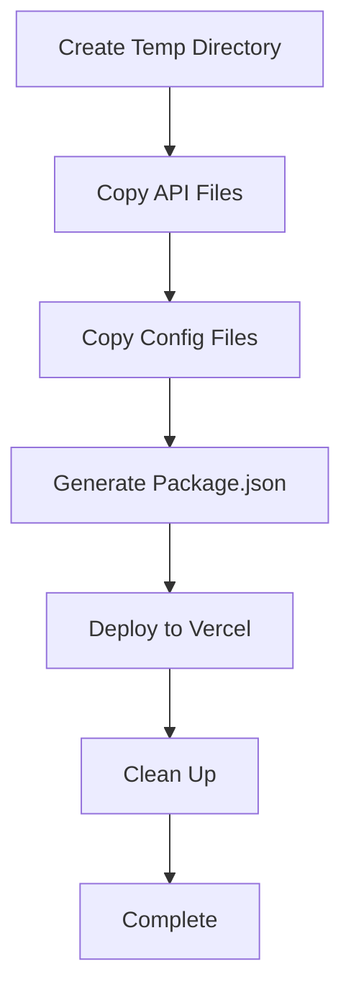
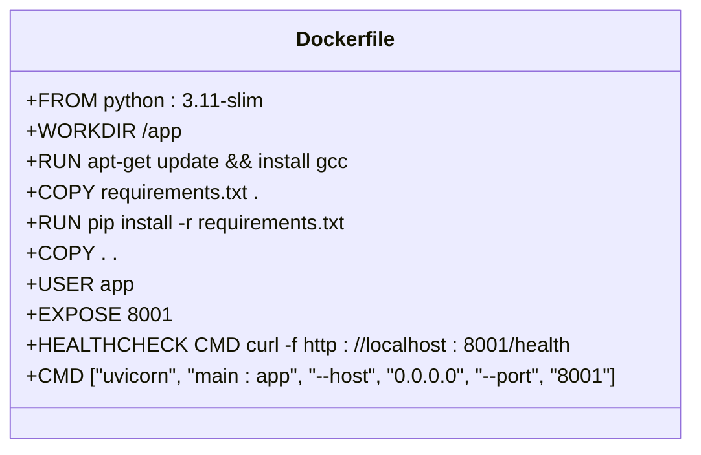
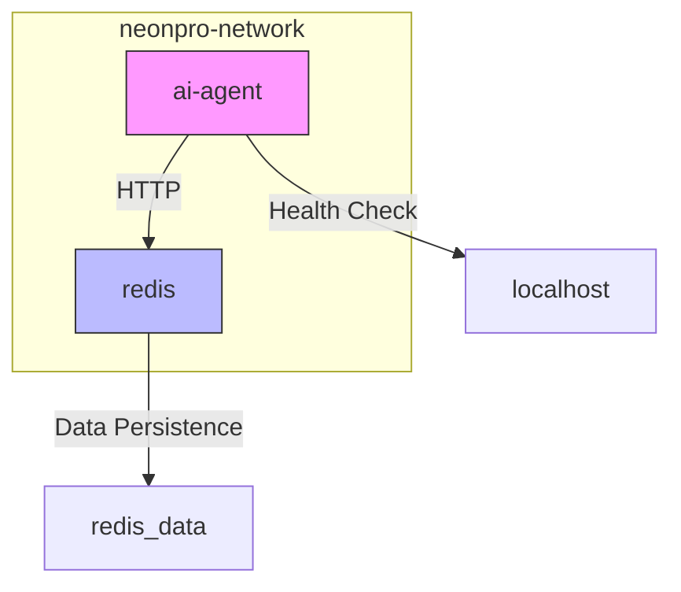
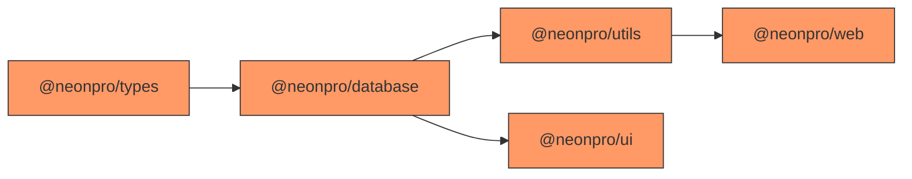
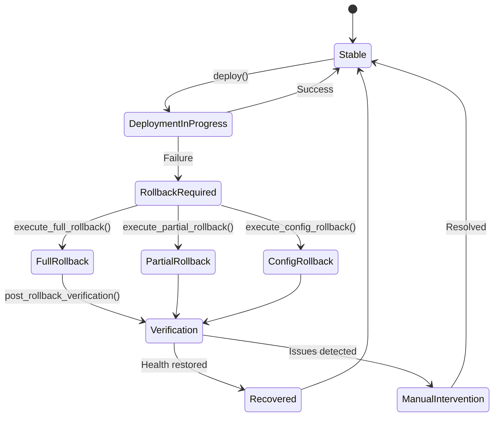
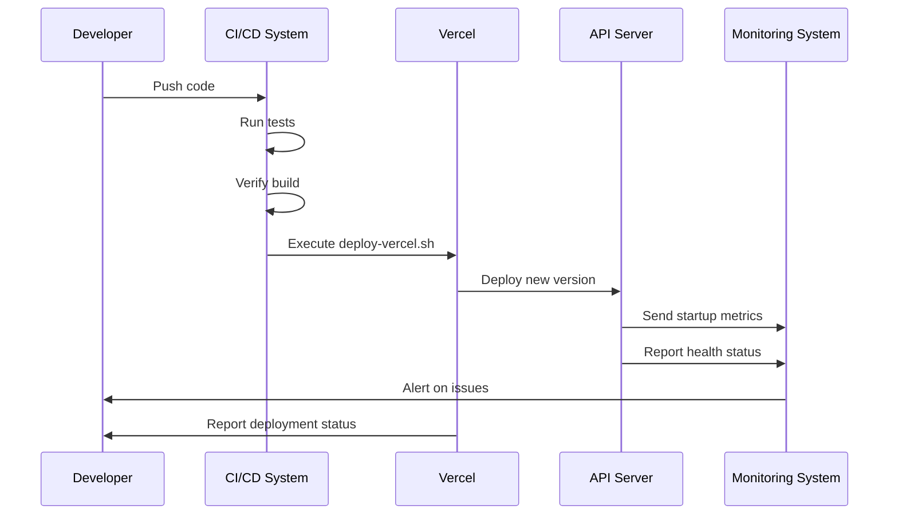

# Update Process

<cite>
**Referenced Files in This Document **   
- [deploy.sh](file://scripts/deploy.sh)
- [deploy-vercel.sh](file://scripts/deploy-vercel.sh)
- [emergency-rollback.sh](file://scripts/emergency-rollback.sh)
- [deploy-api-separate.sh](file://scripts/deploy-api-separate.sh)
- [vercel.json](file://vercel.json)
- [vercel-turbo.json](file://vercel-turbo.json)
- [turbo.json](file://turbo.json)
- [apps/api/package.json](file://apps/api/package.json)
- [apps/web/package.json](file://apps/web/package.json)
- [apps/ai-agent/Dockerfile](file://apps/ai-agent/Dockerfile)
- [apps/ai-agent/docker-compose.yml](file://apps/ai-agent/docker-compose.yml)
- [apps/api/src/app.ts](file://apps/api/src/app.ts)
- [apps/api/src/index.ts](file://apps/api/src/index.ts)
- [DEPLOYMENT_GUIDE.md](file://DEPLOYMENT_GUIDE.md)
</cite>

## Table of Contents
1. [Introduction](#introduction)
2. [Deployment Scripts Overview](#deployment-scripts-overview)
3. [Container Orchestration and Build Configuration](#container-orchestration-and-build-configuration)
4. [Step-by-Step Update Procedures](#step-by-step-update-procedures)
5. [Configuration Options for Deployment Environments](#configuration-options-for-deployment-environments)
6. [Canary Release Settings and Rollback Strategies](#canary-release-settings-and-rollback-strategies)
7. [Integration with CI/CD Pipeline and Monitoring System](#integration-with-cicd-pipeline-and-monitoring-system)
8. [Common Issues and Solutions](#common-issues-and-solutions)
9. [Best Practices for Testing and Maintenance](#best-practices-for-testing-and-maintenance)

## Introduction
The NeonPro application employs a robust deployment strategy designed to ensure seamless updates across its frontend, backend, and AI services. This document details the implementation of deployment scripts, container orchestration, and build system configurations that support reliable and efficient update processes. The system leverages Vercel for frontend and API deployments, Docker and docker-compose for AI agent containerization, and Turbo for monorepo task orchestration. Special attention is given to healthcare compliance requirements including LGPD, CFM, and ANVISA standards.

## Deployment Scripts Overview
NeonPro utilizes a suite of Bash scripts to manage different aspects of the deployment lifecycle. These scripts are located in the `scripts` directory and provide standardized procedures for full deployments, API-specific updates, emergency rollbacks, and environment-specific configurations.

### Full Deployment Script
The `deploy.sh` script orchestrates a complete deployment process by installing dependencies, building the application, and deploying to Vercel. It supports multiple environments (preview, staging, production) through command-line arguments and uses Bun as the package manager for faster operations.



**Diagram sources**
- [deploy.sh](file://scripts/deploy.sh#L1-L33)

**Section sources**
- [deploy.sh](file://scripts/deploy.sh#L1-L33)

### Vercel-Specific Deployment Script
The `deploy-vercel.sh` script implements a TDD-Orchestrator methodology with RED-GREEN-REFACTOR-VALIDATE phases. It performs pre-deployment checks, executes the deployment using either production or development configuration, and conducts post-deployment health validation. This script integrates with Vercel's CLI and supports both authenticated sessions and token-based authentication.



**Diagram sources**
- [deploy-vercel.sh](file://scripts/deploy-vercel.sh#L1-L74)

**Section sources**
- [deploy-vercel.sh](file://scripts/deploy-vercel.sh#L1-L74)

### Emergency Rollback Script
The `emergency-rollback.sh` script provides a comprehensive solution for reverting deployments in response to critical issues. It supports three rollback types: full, partial, and configuration-only. The script includes extensive logging, alerting via Slack and PagerDuty, pre-rollback health checks, and post-rollback verification. It can utilize either Vercel's deployment history or Git version control for rollback operations.



**Diagram sources**
- [emergency-rollback.sh](file://scripts/emergency-rollback.sh#L1-L482)

**Section sources**
- [emergency-rollback.sh](file://scripts/emergency-rollback.sh#L1-L482)

### Separate API Deployment Script
The `deploy-api-separate.sh` script enables independent deployment of the API component to avoid framework conflicts. It creates a temporary deployment directory, copies necessary files, generates a minimal package.json, and deploys the API as a standalone Vercel project. This approach allows the API to be updated without affecting the web frontend.



**Diagram sources**
- [deploy-api-separate.sh](file://scripts/deploy-api-separate.sh#L1-L119)

**Section sources**
- [deploy-api-separate.sh](file://scripts/deploy-api-separate.sh#L1-L119)

## Container Orchestration and Build Configuration
The AI agent component of NeonPro is containerized using Docker and orchestrated with docker-compose, enabling consistent deployment across different environments.

### Docker Configuration
The AI agent uses a slim Python base image with optimized layering for caching efficiency. System dependencies are installed first, followed by Python packages from requirements.txt. The container runs as a non-root user for security and includes a health check endpoint that verifies service availability.



**Diagram sources**
- [apps/ai-agent/Dockerfile](file://apps/ai-agent/Dockerfile#L1-L33)

**Section sources**
- [apps/ai-agent/Dockerfile](file://apps/ai-agent/Dockerfile#L1-L33)

### Docker Compose Orchestration
The docker-compose.yml file defines services for the AI agent and an optional Redis cache. Environment variables are injected from the host system, volumes are mounted for log persistence, and health checks are configured with appropriate start periods. The services run on a dedicated bridge network to isolate communication.



**Diagram sources**
- [apps/ai-agent/docker-compose.yml](file://apps/ai-agent/docker-compose.yml#L1-L48)

**Section sources**
- [apps/ai-agent/docker-compose.yml](file://apps/ai-agent/docker-compose.yml#L1-L48)

## Step-by-Step Update Procedures
This section outlines the detailed procedures for updating each component of the NeonPro system.

### Frontend Updates
Frontend updates are managed through Vercel deployments using either the standard `deploy.sh` script or the more sophisticated `deploy-vercel.sh`. The process involves:
1. Installing dependencies with Bun
2. Building the application using Vite
3. Deploying to Vercel with appropriate configuration
4. Validating the deployment through automated health checks

The build process is optimized through Turbo, which manages dependency relationships between packages in the monorepo.

### Backend/API Updates
API updates can be performed as part of a full deployment or independently using the `deploy-api-separate.sh` script. Independent deployment is recommended when only API changes are required, as it minimizes downtime and avoids potential conflicts with frontend frameworks.

For independent API deployment:
1. The script creates a temporary directory
2. Copies API source files and configuration
3. Generates a minimal package.json with essential dependencies
4. Deploys to Vercel as a standalone project
5. Cleans up temporary files

### AI Services Updates
AI services are updated through Docker container replacement. The process involves:
1. Building a new Docker image with updated code
2. Pushing the image to a container registry
3. Updating the docker-compose configuration
4. Restarting the service with zero-downtime rolling updates

The AI agent exposes a health endpoint at `/health` that is used by Docker's health check mechanism to ensure service availability before routing traffic.

## Configuration Options for Deployment Environments
NeonPro supports multiple deployment environments through configuration files and environment variables.

### Vercel Configuration Files
Two primary configuration files are used for Vercel deployments:

**vercel.json**: Production configuration with null framework setting and simple build commands.
```json
{
  "version": 2,
  "installCommand": "bun install",
  "buildCommand": "cd apps/web && bun run build",
  "outputDirectory": "dist",
  "framework": null
}
```

**vercel-turbo.json**: Development/preview configuration with Turbo integration, custom headers, and rewrites.
```json
{
  "version": 2,
  "name": "neonpro-web",
  "regions": ["gru1"],
  "installCommand": "bun install",
  "buildCommand": "bunx turbo build --filter=@neonpro/web",
  "outputDirectory": "apps/web/dist",
  "rewrites": [{ "source": "/(.*)", "destination": "/index.html" }],
  "headers": [
    {
      "source": "/(.*)",
      "headers": [
        { "key": "Referrer-Policy", "value": "strict-origin-when-cross-origin" },
        { "key": "X-Content-Type-Options", "value": "nosniff" }
      ]
    }
  ]
}
```

**Section sources**
- [vercel.json](file://vercel.json#L1-L9)
- [vercel-turbo.json](file://vercel-turbo.json#L1-L23)

### Turbo Configuration
The `turbo.json` file defines the build pipeline and task dependencies for the monorepo. It specifies global dependencies that trigger rebuilds, output directories for caching, and task relationships. The configuration ensures that dependent packages are built in the correct order and that outputs are properly cached.



**Diagram sources**
- [turbo.json](file://turbo.json#L1-L48)

**Section sources**
- [turbo.json](file://turbo.json#L1-L48)

## Canary Release Settings and Rollback Strategies
NeonPro implements several strategies for gradual rollouts and rapid recovery from deployment issues.

### Canary Release Implementation
While not explicitly implemented in the provided scripts, the architecture supports canary releases through:
- Vercel's preview deployments for testing changes
- Feature flags controlled through environment variables
- Traffic splitting at the CDN level
- Separate API deployment allowing phased frontend updates

The `deploy-vercel.sh` script's ability to create preview deployments serves as the foundation for canary testing, where new versions can be tested with a subset of users before full rollout.

### Rollback Strategies
NeonPro provides multiple rollback mechanisms:

**Automated Emergency Rollback**: The `emergency-rollback.sh` script provides a comprehensive rollback solution that can revert to previous deployments using either Vercel's deployment history or Git version control. It includes pre-rollback health checks, execution tracking, and post-rollback verification.

**Manual Rollback**: For non-emergency situations, developers can use Vercel's dashboard to promote previous deployments or revert Git commits.

**Partial Rollback**: The emergency rollback script supports partial rollbacks that target specific components or configuration files, minimizing disruption when only certain elements are problematic.



**Diagram sources**
- [emergency-rollback.sh](file://scripts/emergency-rollback.sh#L1-L482)

**Section sources**
- [emergency-rollback.sh](file://scripts/emergency-rollback.sh#L1-L482)

## Integration with CI/CD Pipeline and Monitoring System
The deployment process is tightly integrated with monitoring and observability systems.

### CI/CD Pipeline Integration
The deployment scripts are designed to work within automated CI/CD pipelines. Key integration points include:
- Pre-deployment validation through dry-run builds
- Environment variable injection for secrets
- Automated testing before deployment
- Status reporting through console output and JSON reports

The `DEPLOYMENT_GUIDE.md` provides detailed instructions for setting up the CI/CD environment, including authentication setup and build verification steps.

### Monitoring System Integration
The API server includes extensive monitoring capabilities that are activated during and after deployment:

**Error Tracking**: Integration with Sentry and a custom error tracking system provides real-time error monitoring. The `initializeSentry()` function sets up error collection, while `errorTracker.captureException()` handles exception reporting.

**Health Monitoring**: Multiple health endpoints (`/health`, `/v1/health`) provide system status information. The `/v1/monitoring/https` endpoint specifically monitors HTTPS handshake performance to ensure compliance with healthcare regulations.

**Logging**: Structured logging with different severity levels (debug, info, warn, error) provides detailed operational insights. Logs include request IDs for tracing and are sanitized to protect sensitive data.



**Diagram sources**
- [apps/api/src/app.ts](file://apps/api/src/app.ts#L1-L572)
- [apps/api/src/index.ts](file://apps/api/src/index.ts#L1-L96)

**Section sources**
- [apps/api/src/app.ts](file://apps/api/src/app.ts#L1-L572)
- [apps/api/src/index.ts](file://apps/api/src/index.ts#L1-L96)

## Common Issues and Solutions
This section addresses frequent deployment challenges and their resolutions.

### Failed Deployments
**Issue**: Deployment fails due to missing Vercel authentication.
**Solution**: Authenticate using either interactive login (`vercel login`) or set the `VERCEL_TOKEN` environment variable.

**Issue**: Build failures due to dependency conflicts.
**Solution**: Clear the build cache with `bunx turbo build --filter=@neonpro/web --force` and reinstall dependencies.

### Version Mismatches
**Issue**: Frontend and backend versions become incompatible.
**Solution**: Use semantic versioning and maintain backward compatibility in API contracts. Test integration points thoroughly in staging.

### Dependency Conflicts
**Issue**: Monorepo package dependencies conflict.
**Solution**: Use Turbo to manage dependency resolution and ensure proper build ordering. Verify with `bunx turbo build --filter=@neonpro/web --dry-run`.

### Healthcare Compliance Violations
**Issue**: HTTPS handshake times exceed regulatory limits.
**Solution**: Monitor with the `/v1/monitoring/https` endpoint and optimize TLS configuration. The system targets 99% compliance with maximum handshake times.

**Section sources**
- [DEPLOYMENT_GUIDE.md](file://DEPLOYMENT_GUIDE.md#L1-L117)
- [apps/api/src/app.ts](file://apps/api/src/app.ts#L1-L572)

## Best Practices for Testing and Maintenance
Adhering to these best practices ensures reliable and safe updates.

### Testing in Staging Environments
1. Always test updates in a staging environment that mirrors production
2. Use preview deployments to validate changes before promotion
3. Run comprehensive integration tests covering all critical workflows
4. Verify healthcare compliance requirements (LGPD, CFM, ANVISA)
5. Conduct performance testing against realistic data volumes

### Scheduling Maintenance Windows
1. Schedule updates during low-traffic periods (typically 2-5 AM local time)
2. Notify users of planned maintenance at least 24 hours in advance
3. Prepare rollback plans before starting any deployment
4. Coordinate with support teams to handle potential issues
5. Document all changes and outcomes for audit purposes

### Security Considerations
1. Never deploy untested code to production
2. Rotate credentials after major updates
3. Verify security headers are properly configured
4. Check for vulnerabilities in updated dependencies
5. Ensure audit logging is functioning after updates

**Section sources**
- [DEPLOYMENT_GUIDE.md](file://DEPLOYMENT_GUIDE.md#L1-L117)
- [apps/api/src/app.ts](file://apps/api/src/app.ts#L1-L572)
- [apps/ai-agent/Dockerfile](file://apps/ai-agent/Dockerfile#L1-L33)