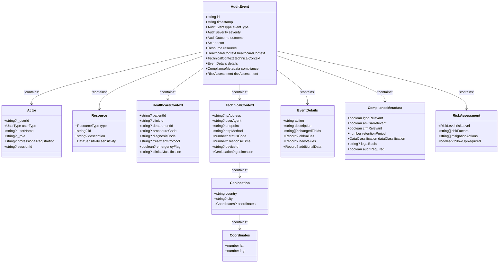
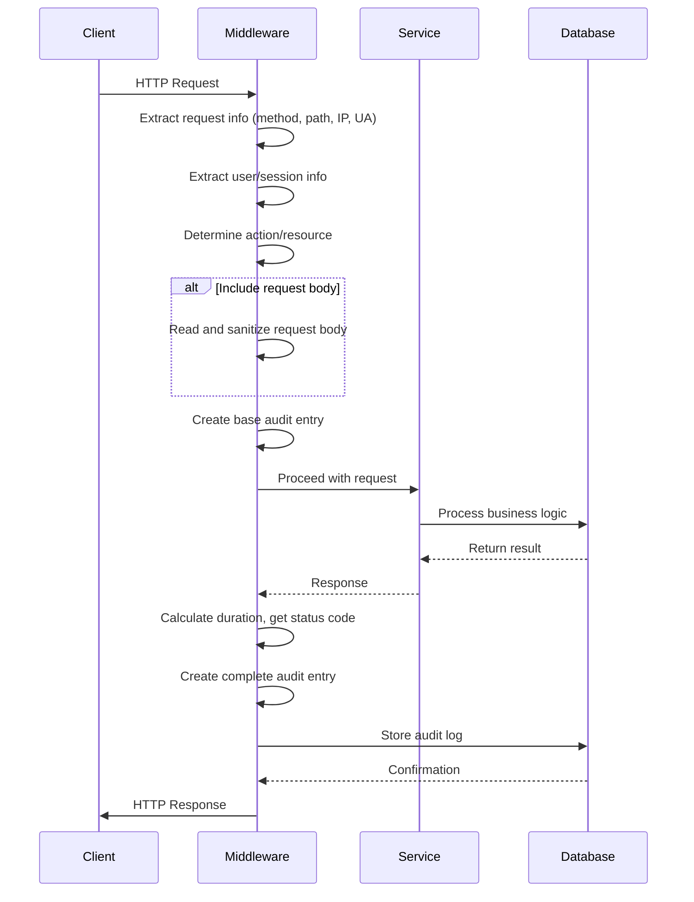
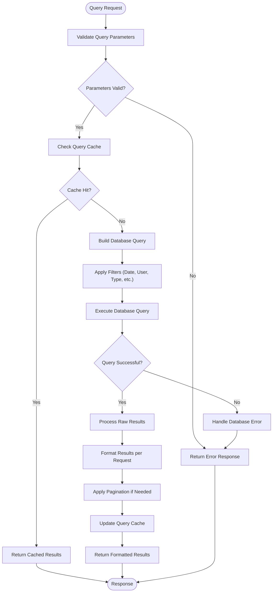
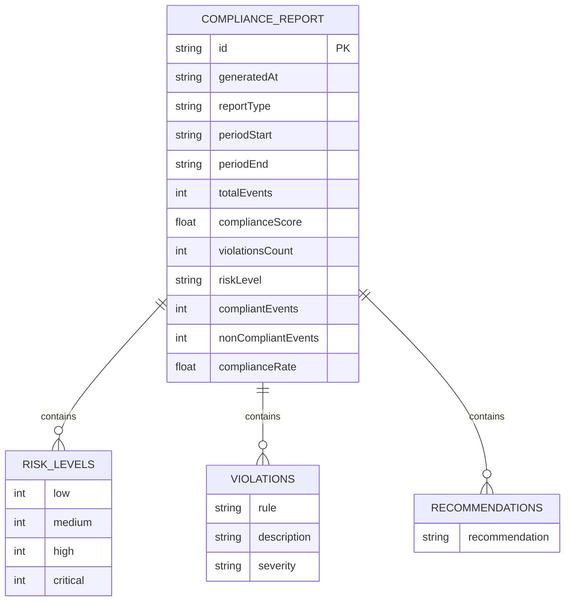

# Audit Logging

<cite>
**Referenced Files in This Document**   
- [audit-log.ts](file://apps/api/src/middleware/audit-log.ts)
- [audit-service.ts](file://apps/api/src/services/audit-service.ts)
- [audit-trail.ts](file://apps/api/src/services/audit-trail.ts)
- [audit-trail-service.ts](file://apps/api/src/services/audit-trail-service.ts)
- [audit.types.ts](file://packages/database/src/types/audit.types.ts)
- [audit-service.ts](file://packages/database/src/services/audit-service.ts)
- [ai-chat.ts](file://packages/types/src/ai-chat.ts)
</cite>

## Table of Contents
1. [Introduction](#introduction)
2. [Core Components](#core-components)
3. [Domain Models for Audit Events](#domain-models-for-audit-events)
4. [Audit Generation Interfaces](#audit-generation-interfaces)
5. [Log Querying and Export Functionality](#log-querying-and-export-functionality)
6. [Log Retention Policies](#log-retention-policies)
7. [Compliance Reporting Formats](#compliance-reporting-formats)
8. [Integration with Business Operations](#integration-with-business-operations)
9. [Security Monitoring Integration](#security-monitoring-integration)
10. [Regulatory Reporting Systems](#regulatory-reporting-systems)
11. [Common Issues and Solutions](#common-issues-and-solutions)
12. [Configuration Guidance](#configuration-guidance)

## Introduction
The neonpro application implements a comprehensive audit logging system designed to provide immutable audit trails for all data access and modification operations. This documentation details the implementation of the audit logging framework, focusing on its capabilities for ensuring data integrity, supporting compliance requirements, and enabling security monitoring. The system captures detailed information about user actions, including timestamp accuracy, user identification, and action categorization, while maintaining performance and scalability.

## Core Components
The audit logging system in neonpro consists of several interconnected components that work together to capture, store, and analyze audit events. The primary components include middleware for automatic log generation, services for handling specific audit operations, and database interfaces for persistent storage. These components ensure that all data access and modification operations are recorded with sufficient detail to support compliance, security, and operational requirements.

**Section sources**
- [audit-log.ts](file://apps/api/src/middleware/audit-log.ts#L1-L330)
- [audit-service.ts](file://apps/api/src/services/audit-service.ts#L1-L200)
- [audit-trail.ts](file://apps/api/src/services/audit-trail.ts#L1-L1000)

## Domain Models for Audit Events
The audit event model in neonpro is designed to capture comprehensive information about each operation while maintaining flexibility for different use cases. The core `AuditEvent` interface includes fields for event identification, actor information, resource details, technical context, and compliance metadata. Each audit event contains a unique identifier, timestamp, event type, severity level, and outcome, providing a standardized structure for all logged activities.

The model also includes detailed actor information such as user ID, user type (patient, healthcare professional, admin, system, or AI agent), user name, role, and professional registration number when applicable. Resource information specifies the type of resource accessed or modified (patient, medical record, appointment, prescription, system, or AI model) along with sensitivity classification (public, internal, confidential, or restricted).

Healthcare-specific context is captured through fields like patient ID, clinic ID, department ID, procedure code, diagnosis code, treatment protocol, emergency flag, and clinical justification. Technical context includes IP address, user agent, endpoint, HTTP method, status code, response time, device ID, and geolocation data. The event details section records the specific action taken, description, changed fields, old values, new values, and any additional data relevant to the operation.

Compliance metadata tracks regulatory relevance (LGPD, ANVISA, CFM), retention period, data classification, legal basis for processing, and whether an audit is required. Risk assessment information includes risk level (low, medium, high, critical), risk factors, mitigation actions, and whether follow-up is required.



**Diagram sources**
- [audit-trail.ts](file://apps/api/src/services/audit-trail.ts#L100-L193)

## Audit Generation Interfaces
The audit logging system provides multiple interfaces for generating audit events, with the primary mechanism being middleware that automatically captures API requests and responses. The `auditLogMiddleware` function creates audit entries for all HTTP requests, capturing essential information such as method, path, IP address, user agent, request ID, user information, session ID, action, resource, and resource ID.

The middleware supports configurable options including whether to include request bodies, which sensitive fields to redact, and the log level for audit entries. It automatically extracts action and resource from HTTP methods and URL paths, mapping GET to "read", POST to "create", PUT/PATCH to "update", and DELETE to "delete". For POST, PUT, and PATCH requests, it can optionally include sanitized request bodies in the audit metadata, with sensitive fields redacted according to predefined patterns.

Specialized middleware variants are available for different domains:
- `healthcareAuditMiddleware`: Includes request bodies but excludes response bodies to avoid logging sensitive healthcare data, with extended sensitive field detection for healthcare-specific data
- `financialAuditMiddleware`: Focuses on financial operations with redaction of payment-related fields
- `authAuditMiddleware`: Excludes request bodies entirely to prevent password logging

The system also provides direct service interfaces for programmatic audit logging. The `AuditService` class offers methods for logging specific types of events such as WebRTC session starts and ends, data access, consent verification, and security events. These methods create structured audit logs with appropriate metadata and store them in the database.



**Diagram sources**
- [audit-log.ts](file://apps/api/src/middleware/audit-log.ts#L114-L260)
- [audit-service.ts](file://packages/database/src/services/audit-service.ts#L51-L678)

## Log Querying and Export Functionality
The audit logging system provides comprehensive interfaces for querying and exporting audit logs to support various use cases including compliance reporting, security investigations, and operational analysis. The `AuditService` class exposes methods for retrieving logs by session, user, date range, and search criteria, enabling flexible retrieval of audit data.

The `searchAuditLogs` method accepts a rich set of search criteria including date ranges, user IDs, session IDs, event types, data classifications, IP addresses, clinic IDs, compliance status, and pagination parameters. This allows for targeted queries to find specific events or patterns of activity. Results are returned in chronological order (newest first) with complete audit event details.

For compliance and reporting purposes, the system provides export functionality in multiple formats. Audit logs can be exported as JSON, CSV, or PDF documents, with appropriate formatting for each format. The JSON export provides the complete structured data, while CSV exports include key fields in a tabular format suitable for spreadsheet analysis. PDF exports generate formatted reports suitable for official submission.

The system also supports aggregation and statistical analysis through methods that calculate metrics such as total events, events by type, events by severity, security violations, emergency accesses, and patient data accesses. These statistics help identify trends and patterns in system usage and security events.



**Diagram sources**
- [audit-service.ts](file://packages/database/src/services/audit-service.ts#L51-L678)
- [audit-trail.ts](file://apps/api/src/services/audit-trail.ts#L342-L387)

## Log Retention Policies
The neonpro audit logging system implements comprehensive retention policies designed to meet regulatory requirements while managing storage costs. Retention periods vary based on the sensitivity and importance of the audited operations, with longer retention for higher-risk activities.

The system defines specific retention periods for different categories of audit events:
- Emergency access: 10 years (3,650 days)
- Patient data access: 20 years (7,300 days)
- Consent modifications: 7 years (2,555 days)
- Financial operations: 5 years (1,825 days)
- Administrative operations: 3 years (1,095 days)
- System operations: 1 year (365 days)

These retention periods are stored in the audit event's compliance metadata and enforced through automated cleanup processes. The system generates retention compliance reports that analyze log entries against these policies, identifying expired entries that can be safely removed and retained entries that must be preserved.

The configuration for audit logging includes settings for automatic cleanup, ensuring that logs beyond their retention period are systematically purged. This prevents indefinite accumulation of audit data while maintaining compliance with legal requirements. The system also supports backup and recovery procedures for audit logs, with encryption and off-site storage options to protect the integrity and availability of historical audit data.

**Section sources**
- [crypto-audit.ts](file://apps/api/src/utils/crypto-audit.ts#L265-L309)
- [security-compliance-validator.ts](file://apps/api/src/services/performance/security-compliance-validator.ts#L265-L308)
- [security-policy.ts](file://packages/shared/src/models/security-policy.ts#L565-L614)

## Compliance Reporting Formats
The audit logging system generates standardized compliance reports in multiple formats to meet various regulatory and organizational requirements. The primary report format is the `ComplianceReport` interface, which includes comprehensive information about audit events within a specified period.

A compliance report contains:
- Report identifier and generation timestamp
- Report type (LGPD, ANVISA, CFM, or GENERAL)
- Period start and end dates
- Summary statistics including total events, compliance score, violations count, and risk level
- Breakdown of risk levels (low, medium, high, critical)
- List of violations or violation counts by type
- Recommendations for addressing identified issues
- Optional metadata

The system automatically calculates the compliance score as the percentage of compliant events out of total events. It determines the overall risk level based on the presence of critical, high, medium, and low risk events, with critical events taking precedence. The report generation process analyzes all audit logs within the specified date range, applying compliance checks to determine which events are compliant and which represent violations.

For specialized regulatory requirements, the system can generate forensic audit reports that include cryptographic signatures and integrity verification. These reports contain detailed information about the audit chain, including validation results, time ranges, event type distributions, compliance metrics, detected anomalies, and error information. The forensic reports are digitally signed to ensure their authenticity and integrity when presented as evidence.



**Diagram sources**
- [audit-service.ts](file://packages/database/src/services/audit-service.ts#L51-L678)
- [audit.types.ts](file://packages/database/src/types/audit.types.ts#L1-L225)

## Integration with Business Operations
The audit logging system is deeply integrated with neonpro's business operations, providing visibility into user activities and system behavior across various functional areas. In healthcare operations, the system tracks patient data access, medical record modifications, prescription changes, and diagnosis updates, with special attention to emergency access scenarios.

For financial operations, the audit system captures billing activities, payment processing, insurance claims, and financial reporting, ensuring transparency and accountability in monetary transactions. The system logs all financial operations with appropriate sensitivity classification and retention periods to meet regulatory requirements.

In administrative operations, the audit system monitors user management activities such as account creation, role assignments, permission changes, and system configuration modifications. This provides oversight of privileged operations and helps prevent unauthorized changes to system settings.

The audit system also integrates with AI-driven features in the application, logging interactions with AI agents, explanations generated, suggestions provided, and rate limit decisions. This ensures transparency in AI-assisted decision-making processes and supports accountability for AI-generated content.

All business operations trigger audit events that include contextual information such as patient ID, clinic ID, professional ID, and clinical justification when applicable. This rich context enables detailed analysis of operational patterns and supports compliance with healthcare regulations like LGPD, ANVISA, and CFM.

**Section sources**
- [audit-trail-service.ts](file://apps/api/src/services/audit-trail-service.ts#L122-L160)
- [agent-audit-service.ts](file://apps/api/src/services/audit/agent-audit-service.ts#L10-L29)
- [ai-chat.ts](file://packages/types/src/ai-chat.ts#L44-L63)

## Security Monitoring Integration
The audit logging system serves as a critical component of neonpro's security monitoring infrastructure, providing real-time visibility into potential security threats and policy violations. Security events are logged with high severity and trigger immediate alerts for investigation.

The system monitors for various security-relevant activities including:
- Failed login attempts and authentication failures
- Unauthorized access attempts and privilege escalation
- Data exfiltration attempts and unusual data access patterns
- Configuration changes to security settings
- Suspicious user behavior and anomalous access times
- Known attack patterns and vulnerability exploitation attempts

When security events are detected, the audit system generates high-severity audit entries and can trigger alerting mechanisms to notify security personnel. The system includes anomaly detection capabilities that identify deviations from normal user behavior patterns, such as accessing systems outside regular hours or from unusual geographic locations.

The audit logs are integrated with security information and event management (SIEM) systems for centralized monitoring and correlation with other security events. This enables comprehensive threat detection and incident response capabilities. The system also supports digital signatures and tamper protection for audit logs, ensuring their integrity and admissibility as evidence in security investigations.

Regular security audits are performed using the audit data to identify vulnerabilities, assess risk exposure, and verify compliance with security policies. The system generates security violation reports that highlight areas requiring attention and provide recommendations for strengthening security controls.

**Section sources**
- [audit-service.ts](file://packages/database/src/services/audit-service.ts#L51-L678)
- [security-compliance-validator.ts](file://apps/api/src/services/performance/security-compliance-validator.ts#L304-L344)
- [structured-logging.ts](file://packages/shared/src/services/structured-logging.ts#L864-L1016)

## Regulatory Reporting Systems
The audit logging system is designed to support compliance with multiple regulatory frameworks, particularly in the healthcare domain. It provides specialized reporting capabilities for LGPD (Brazilian General Data Protection Law), ANVISA (National Health Surveillance Agency), and CFM (Federal Council of Medicine) requirements.

For LGPD compliance, the system tracks all processing of personal data, verifies legal basis for processing, logs consent collection and withdrawal, and monitors data subject rights requests. It ensures that all data access has a legitimate purpose and that appropriate consent has been obtained when required. The system generates LGPD-specific compliance reports that demonstrate adherence to data protection principles.

For ANVISA compliance, the system focuses on tracking adverse events, medication errors, and quality control issues in healthcare delivery. It maintains detailed records of medical device usage, treatment protocols, and patient outcomes to support regulatory inspections and safety monitoring.

For CFM compliance, the system logs professional conduct, adherence to clinical guidelines, and maintenance of professional standards. It tracks continuing education activities, peer reviews, and quality improvement initiatives to demonstrate commitment to medical excellence.

The system also supports international standards such as HIPAA (Health Insurance Portability and Accountability Act) through its comprehensive data protection and privacy controls. All regulatory reports include cryptographic signatures and integrity verification to ensure their authenticity when submitted to regulatory authorities.

**Section sources**
- [audit-trail.ts](file://apps/api/src/services/audit-trail.ts#L195-L248)
- [authentication-middleware.ts](file://packages/shared/src/services/authentication-middleware.ts#L473-L530)
- [anvisa-reporting.test.ts](file://apps/api/tests/compliance/anvisa-reporting.test.ts#L1112-L1154)

## Common Issues and Solutions
The audit logging implementation addresses several common challenges in maintaining secure and reliable audit trails:

### Log Integrity Verification
To ensure log integrity, the system implements cryptographic signing of audit events and forensic reports. Each audit entry can be verified against its digital signature to detect any tampering. The system also uses write-once, read-many storage principles to prevent modification of existing logs. Regular integrity checks are performed on the audit chain, and any broken links trigger immediate alerts.

### High-Volume Logging Performance
The system handles high-volume logging through several optimization strategies:
- Asynchronous logging to prevent blocking of primary operations
- Batch processing of audit entries to reduce database load
- Configurable log levels to control verbosity based on environment
- Caching of frequently accessed audit data
- Indexing of key search fields for rapid query performance

These optimizations ensure that audit logging does not significantly impact application performance even under heavy load.

### PII Redaction in Audit Records
The system automatically redacts personally identifiable information (PII) from audit records to protect patient privacy. Sensitive fields such as CPF, RG, CNS (National Health Card), medical records, diagnoses, medications, and treatments are identified and replaced with "[REDACTED]" markers. The redaction process occurs at multiple levels:
- Middleware-level redaction of request/response bodies
- Service-level filtering of sensitive data before logging
- Database-level protection of stored audit records

The system also supports manual redaction of audit logs when necessary for compliance reasons, with proper authorization and documentation of the redaction process.

```mermaid
flowchart TD
A[Raw Audit Data] --> B{Contains PII?}
B --> |Yes| C[Identify Sensitive Fields]
C --> D[Apply Redaction Rules]
D --> E[Replace with [REDACTED]]
E --> F[Store Securely]
B --> |No| F
F --> G[Access Control]
G --> H{Authorized Access?}
H --> |Yes| I[Retrieve Logs]
H --> |No| J[Deny Access]
I --> K[Display to User]
J --> L[Log Access Attempt]
L --> M[Alert Security Team if Suspicious]
```

**Diagram sources**
- [audit-log.ts](file://apps/api/src/middleware/audit-log.ts#L1-L330)
- [structured-logging.ts](file://packages/shared/src/services/structured-logging.ts#L958-L1016)
- [security-policies.test.ts](file://apps/api/tests/contracts/security-policies.test.ts#L1218-L1241)

## Configuration Guidance
The audit logging system provides extensive configuration options to tailor its behavior to specific organizational needs and compliance requirements. Key configuration parameters include:

### Audit Levels
The system supports multiple audit levels that control the verbosity and scope of logging:
- **Minimal**: Only critical security events and compliance-relevant operations
- **Standard**: All data modifications and significant system events
- **Comprehensive**: All data access and modification operations
- **Detailed**: All operations including read operations and system health checks

The appropriate level should be selected based on regulatory requirements, storage capacity, and performance considerations.

### Log Aggregation Setup
For efficient log management, the system supports integration with external log aggregation platforms such as ELK Stack, Splunk, or cloud-based solutions. Configuration involves:
- Setting up log forwarding endpoints
- Configuring authentication and encryption for log transmission
- Defining log rotation and retention policies on the aggregation platform
- Establishing alerting rules for critical events

### Compliance Evidence Reports
To generate compliance evidence reports, configure the following:
- Set appropriate retention periods based on regulatory requirements
- Enable cryptographic signing of audit logs and reports
- Configure regular report generation schedules
- Establish secure distribution channels for reports
- Implement access controls for report viewing and downloading

The system provides templates for common compliance reports and supports custom report generation through its API. Organizations should establish procedures for reviewing, approving, and archiving compliance reports to maintain an unbroken chain of evidence.

**Section sources**
- [audit-trail.ts](file://apps/api/src/services/audit-trail.ts#L195-L248)
- [security-policy.ts](file://packages/shared/src/models/security-policy.ts#L565-L614)
- [structured-logging.ts](file://packages/shared/src/services/structured-logging.ts#L305-L344)