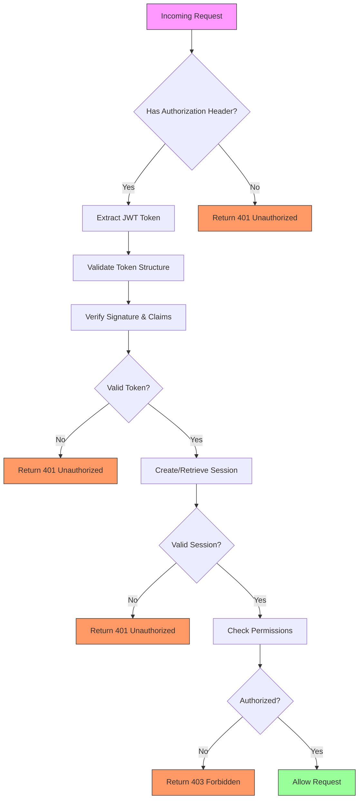
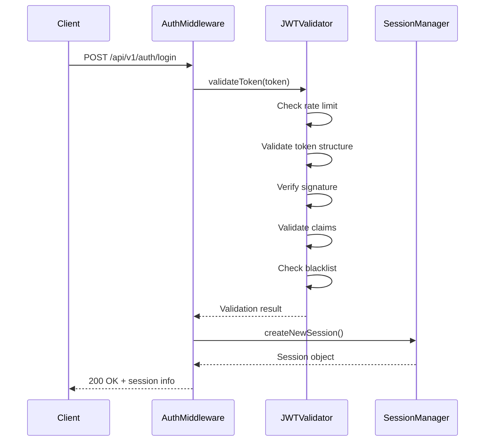
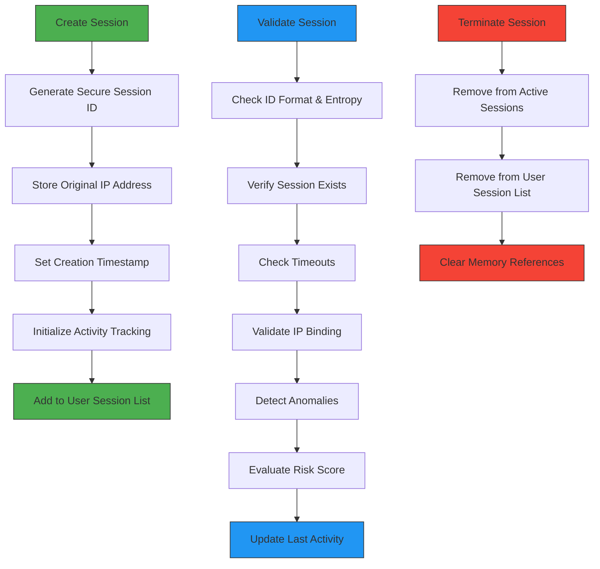
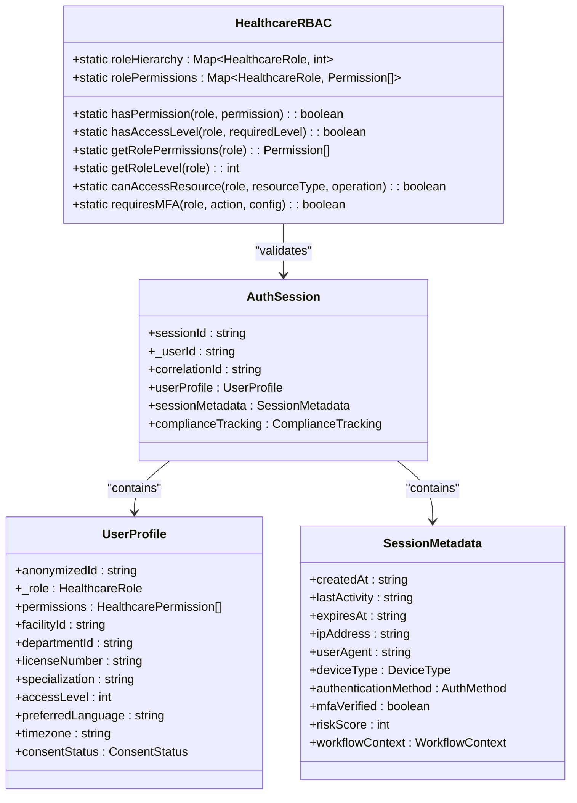
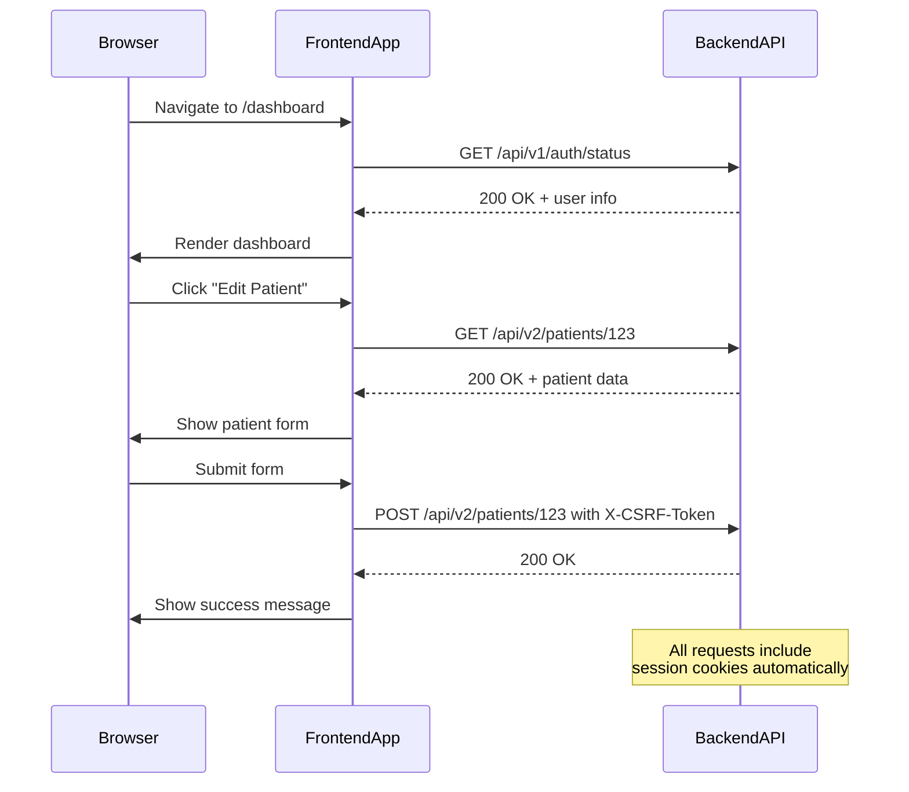
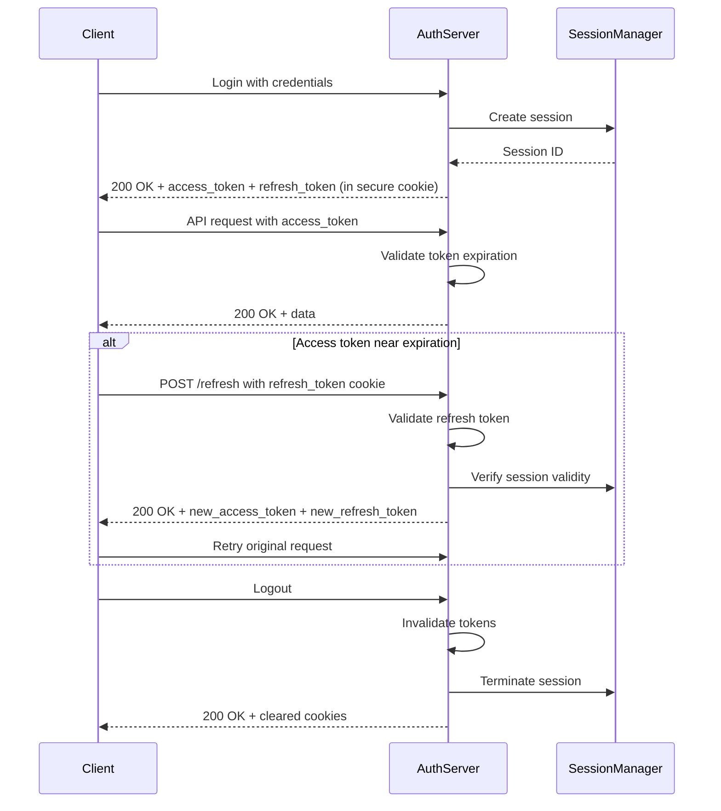
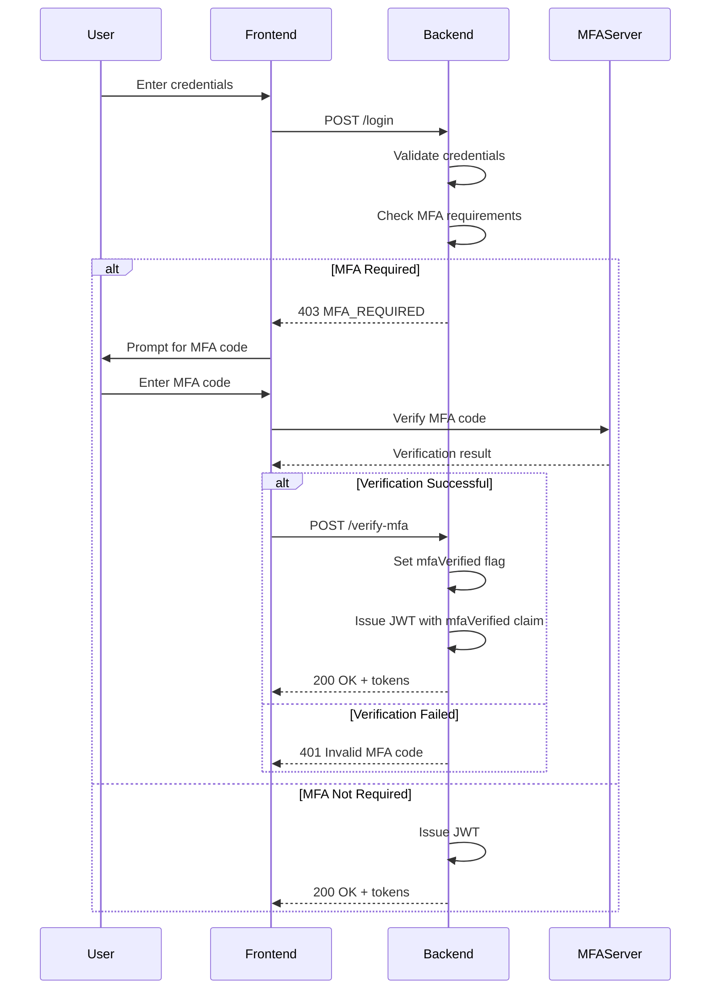
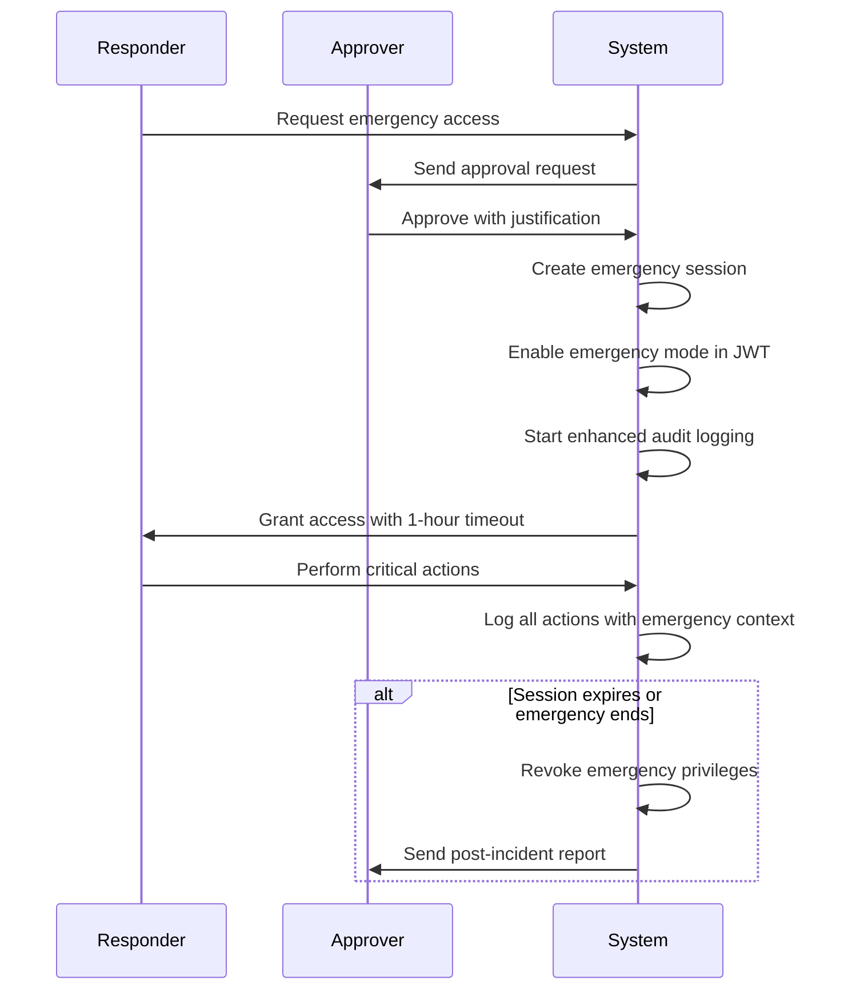
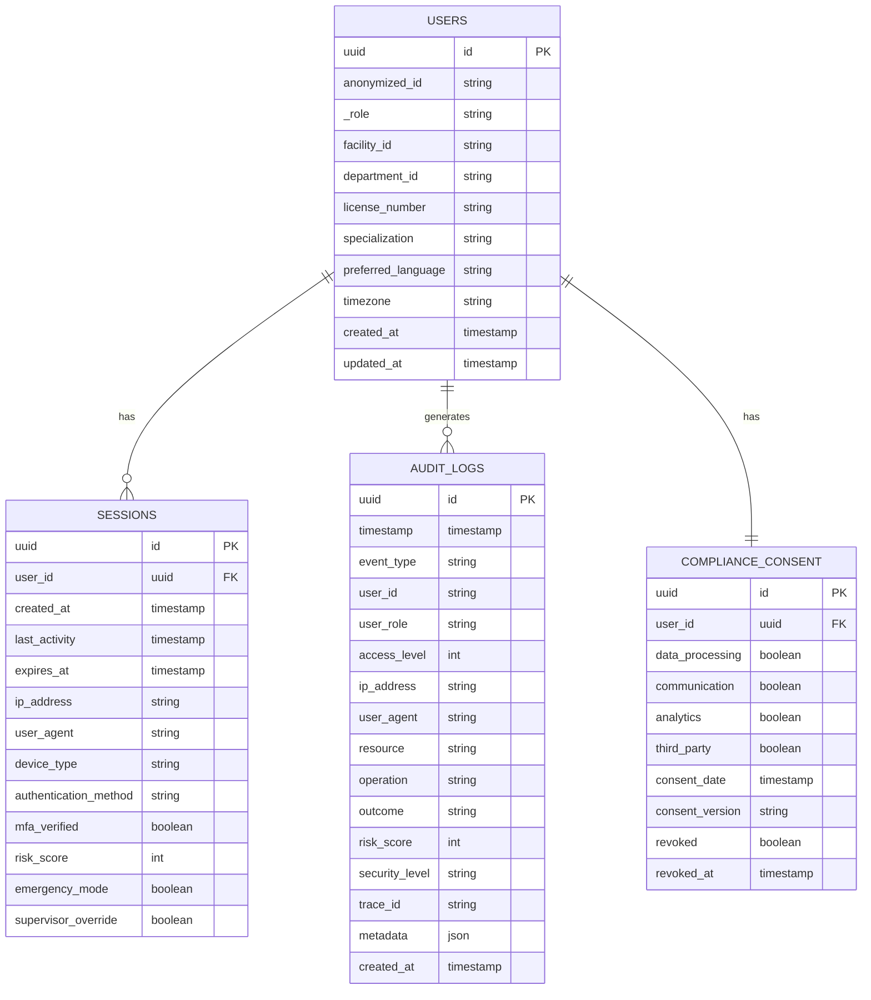

# Authentication and Authorization

<cite>
**Referenced Files in This Document**   
- [authentication-middleware.ts](file://packages/shared/src/services/authentication-middleware.ts)
- [jwt-validator.ts](file://apps/api/src/security/jwt-validator.ts)
- [enhanced-session-manager.ts](file://apps/api/src/security/enhanced-session-manager.ts)
- [session-cookie-utils.ts](file://apps/api/src/security/session-cookie-utils.ts)
- [authn.ts](file://apps/api/src/middleware/authn.ts)
- [healthcare.ts](file://apps/api/src/routes/healthcare.ts)
</cite>

## Table of Contents
1. [Introduction](#introduction)
2. [Core Components](#core-components)
3. [JWT-Based Authentication](#jwt-based-authentication)
4. [Session Management](#session-management)
5. [Role-Based Access Control (RBAC)](#role-based-access-control-rbac)
6. [Middleware Pipeline Integration](#middleware-pipeline-integration)
7. [Frontend Protection Layer](#frontend-protection-layer)
8. [Security Features](#security-features)
9. [Token Expiration and Refresh Mechanisms](#token-expiration-and-refresh-mechanisms)
10. [CSRF Protection](#csrf-protection)
11. [MFA Integration](#mfa-integration)
12. [Emergency Access Protocols](#emergency-access-protocols)
13. [Compliance and Audit Logging](#compliance-and-audit-logging)
14. [Troubleshooting Common Issues](#troubleshooting-common-issues)
15. [Best Practices for Secure Implementation](#best-practices-for-secure-implementation)

## Introduction
The NeonPro Healthcare Platform implements a comprehensive authentication and authorization system designed to meet stringent healthcare compliance requirements while providing robust security for sensitive patient data. This document details the implementation of JWT-based authentication, session management, and role-based access control (RBAC) across both frontend and backend services.

The system is built around several core components that work together to provide secure access to platform resources. At its foundation is a JWT-based authentication mechanism that validates user credentials and issues secure tokens for subsequent requests. These tokens are validated through a multi-layered approach that includes signature verification, claim validation, and blacklisting capabilities.

Session management is handled through an enhanced session manager that tracks user sessions with IP binding, anomaly detection, and concurrent session limits. The system enforces strict security policies including session fixation protection, timeout controls, and automatic cleanup of expired sessions.

Role-based access control (RBAC) provides granular permissions management based on healthcare-specific roles such as doctor, nurse, administrator, and compliance officer. Each role has predefined permissions that determine what actions users can perform and what data they can access.

The authentication system integrates seamlessly with both frontend and backend services through middleware pipelines that protect API routes and UI components. Security features like CSRF protection, MFA integration, and emergency access protocols ensure the platform remains secure against common attack vectors while allowing necessary flexibility for healthcare operations.

All components are designed with LGPD and ANVISA compliance in mind, implementing audit logging, data minimization, and consent validation to protect patient privacy and meet regulatory requirements.

**Section sources**
- [authentication-middleware.ts](file://packages/shared/src/services/authentication-middleware.ts#L1-L100)
- [jwt-validator.ts](file://apps/api/src/security/jwt-validator.ts#L1-L100)

## Core Components
The authentication and authorization system in the NeonPro Healthcare Platform consists of several interconnected components that work together to provide secure access control. These components include the HealthcareAuthMiddleware, JWTSecurityValidator, EnhancedSessionManager, SessionCookieUtils, and various authentication middleware functions.

The HealthcareAuthMiddleware serves as the primary entry point for authentication and authorization, handling the complete authentication flow from token extraction to session creation and permission validation. It integrates with other components to provide a comprehensive security solution.

The JWTSecurityValidator performs comprehensive validation of JWT tokens according to OWASP security best practices. It checks token structure, algorithm safety, signature validity, claim integrity, and blacklist status to prevent common attacks like algorithm confusion and token replay.

The EnhancedSessionManager handles session lifecycle management with advanced security features including IP binding, anomaly detection, and concurrent session limits. It generates cryptographically secure session IDs and tracks session activity for security monitoring.

SessionCookieUtils provides secure cookie handling for session management, generating signed cookies with CSRF protection and validating cookie integrity on each request. This component ensures that session cookies cannot be tampered with or forged.

Authentication middleware functions like authenticationMiddleware and authorizationMiddleware provide reusable components that can be applied to specific routes or groups of routes to enforce authentication and authorization policies.

These components work together in a coordinated fashion: when a request arrives, the authentication middleware extracts the JWT token, passes it to the JWT validator for comprehensive security checks, creates or retrieves a session through the session manager, and validates that the user has appropriate permissions for the requested resource.



**Diagram sources **
- [authentication-middleware.ts](file://packages/shared/src/services/authentication-middleware.ts#L864-L2149)
- [jwt-validator.ts](file://apps/api/src/security/jwt-validator.ts#L65-L707)
- [enhanced-session-manager.ts](file://apps/api/src/security/enhanced-session-manager.ts#L92-L797)

**Section sources**
- [authentication-middleware.ts](file://packages/shared/src/services/authentication-middleware.ts#L1-L2248)
- [jwt-validator.ts](file://apps/api/src/security/jwt-validator.ts#L1-L712)
- [enhanced-session-manager.ts](file://apps/api/src/security/enhanced-session-manager.ts#L1-L799)
- [session-cookie-utils.ts](file://apps/api/src/security/session-cookie-utils.ts#L1-L406)

## JWT-Based Authentication
The NeonPro Healthcare Platform implements JWT-based authentication using industry-standard security practices with additional healthcare-specific requirements. The system uses HS256 algorithm for token signing with configurable support for HS512, ensuring strong cryptographic protection for authentication tokens.

JWT tokens are issued upon successful login and contain essential claims including issuer (iss), audience (aud), expiration time (exp), issued at time (iat), subject (sub), and custom healthcare-specific claims. The issuer is set to "neonpro-healthcare" and audience to "neonpro-api" to prevent token reuse across different systems.

Token validation follows a comprehensive 10-step process implemented by the JWTSecurityValidator class:
1. Rate limiting check to prevent brute force attacks
2. Basic token structure validation to ensure proper JWT format
3. Header analysis to detect potential algorithm confusion attacks
4. Algorithm validation to prevent use of insecure algorithms like 'none'
5. Key ID (kid) validation for key rotation support
6. Security headers validation including HTTPS enforcement in production
7. Signature verification using the appropriate secret key
8. Claim validation for audience, issuer, expiration, and subject
9. Blacklist checking to revoke compromised tokens
10. Healthcare-specific requirements validation

The system prevents algorithm confusion attacks by explicitly rejecting the 'none' algorithm and validating that the algorithm specified in the token header matches those allowed in the configuration. This protects against attacks where an attacker might try to change the algorithm to bypass signature verification.

Token blacklisting is implemented to support immediate revocation of compromised tokens. When a user logs out or their access is revoked, the token's JTI (JWT ID) or user ID is added to a blacklist with a TTL matching the token's remaining lifetime. During validation, the system checks this blacklist to ensure revoked tokens cannot be used.

Rate limiting is enforced at the authentication layer to prevent brute force attacks. The system tracks authentication attempts by client IP address and session ID, temporarily blocking clients that exceed the configured threshold of 100 attempts per minute.



**Diagram sources **
- [jwt-validator.ts](file://apps/api/src/security/jwt-validator.ts#L65-L707)
- [authentication-middleware.ts](file://packages/shared/src/services/authentication-middleware.ts#L864-L2149)

**Section sources**
- [jwt-validator.ts](file://apps/api/src/security/jwt-validator.ts#L1-L712)
- [authentication-middleware.ts](file://packages/shared/src/services/authentication-middleware.ts#L1-L2248)

## Session Management
The NeonPro Healthcare Platform implements comprehensive session management through the EnhancedSessionManager class, which provides advanced security features beyond basic session tracking. The system manages session lifecycle with multiple timeout mechanisms, IP binding, anomaly detection, and concurrent session limits.

Sessions have two timeout mechanisms: idle timeout and absolute timeout. The idle timeout is set to 30 minutes, meaning sessions expire after 30 minutes of inactivity. The absolute timeout is set to 8 hours, representing the maximum duration a session can remain active regardless of activity. This dual timeout approach balances security with usability for healthcare professionals who may need extended access during shifts.

IP binding is enforced to prevent session hijacking. When a session is created, the client's IP address is recorded and bound to the session. Subsequent requests must come from the same IP address or a subnet-compatible address (for mobile networks). The system allows mobile network tolerance by comparing IP subnets rather than full addresses, accommodating legitimate IP changes when healthcare professionals move between network cells.

Concurrent session limits are enforced with a maximum of 3 concurrent sessions per user. When a user attempts to create a fourth session, the oldest session is automatically terminated. This prevents unauthorized simultaneous access while allowing legitimate use across multiple devices.

Anomaly detection monitors for suspicious behavior patterns including rapid IP changes, user agent changes, and consecutive authentication failures. The system calculates a risk score based on detected anomalies and can require additional verification (such as MFA) or block access entirely for high-risk scenarios.

Session fixation protection is implemented by regenerating session IDs upon authentication. This prevents attackers from creating a session and tricking users into authenticating within that session. Session IDs are generated using cryptographically secure random number generators with sufficient entropy to prevent guessing attacks.

The EnhancedSessionManager also provides automatic cleanup of expired sessions every 5 minutes, maintaining system performance and reducing memory usage. Session statistics are available for monitoring active sessions, user counts, and security levels.



**Diagram sources **
- [enhanced-session-manager.ts](file://apps/api/src/security/enhanced-session-manager.ts#L92-L797)

**Section sources**
- [enhanced-session-manager.ts](file://apps/api/src/security/enhanced-session-manager.ts#L1-L799)

## Role-Based Access Control (RBAC)
The NeonPro Healthcare Platform implements a sophisticated role-based access control (RBAC) system tailored to healthcare workflows and compliance requirements. The system defines 14 distinct roles with hierarchical access levels ranging from 0 (guest) to 10 (super_admin), each with specific permissions that determine access to patient data, medical records, and administrative functions.

Roles are defined in the HealthcareRoleSchema with the following hierarchy:
- guest (level 0): Public access
- patient, caregiver (level 1): Basic access to personal information
- receptionist (level 2): Administrative access
- nurse, technician (level 3): Clinical access
- pharmacist, lab_technician, radiologist (level 4): Specialized clinical access
- doctor (level 5): Medical practitioner access
- specialist (level 6): Advanced medical access
- department_head (level 7): Department management
- system_admin, compliance_officer (level 8): System and compliance oversight
- emergency_responder (level 9): Emergency access
- super_admin (level 10): Full system access

Each role has a predefined set of permissions that follow the principle of least privilege. For example, nurses have read access to full patient records and limited write access to allergies, while doctors have full read/write access to diagnoses, treatments, and medications. Pharmacists can view and prescribe medications but cannot modify diagnoses.

Permissions are defined in the HealthcarePermissionSchema with categories including patient data, medical data, laboratory operations, imaging, administrative functions, system operations, and compliance. Each permission follows a consistent naming pattern: resource:operation:scope (e.g., "patient:read:full", "medical:write:diagnoses").

The RBAC system supports both direct permission checks and access level validation. The hasPermission method checks if a user's role includes a specific permission, while hasAccessLevel verifies if a user's role meets or exceeds a required access level. This allows flexible authorization policies that can be based on either specific permissions or minimum role levels.

Resource access is controlled through the canAccessResource method, which determines if a user can perform a specific operation (read, write, delete) on a resource type. This method considers both explicit permissions and role hierarchy, with higher-level roles inheriting access from lower-level roles.

MFA requirements are integrated with the RBAC system, with certain roles and actions requiring multi-factor authentication. High-privilege roles like system_admin and compliance_officer always require MFA, as do sensitive actions like patient deletion and diagnosis modification.



**Diagram sources **
- [authentication-middleware.ts](file://packages/shared/src/services/authentication-middleware.ts#L565-L855)
- [authentication-middleware.ts](file://packages/shared/src/services/authentication-middleware.ts#L206-L340)

**Section sources**
- [authentication-middleware.ts](file://packages/shared/src/services/authentication-middleware.ts#L1-L2248)

## Middleware Pipeline Integration
The authentication and authorization system integrates with the application's middleware pipeline through a series of composable middleware functions that can be applied to specific routes or groups of routes. This modular approach allows fine-grained control over access policies while maintaining code reusability.

The primary middleware components include:
- authenticationMiddleware: Validates JWT tokens and establishes user context
- authorizationMiddleware: Enforces role-based access control
- clinicAccessMiddleware: Ensures users can only access their assigned clinic's data
- optionalAuth: Provides authentication without failing if no credentials are present
- requireAuth: Combines authentication and authorization in a single middleware

These middleware functions follow the Hono framework's middleware pattern, accepting a Context and Next function as parameters. They perform their validation logic and either call next() to continue the request chain or return an error response to terminate the request.

The middleware pipeline is typically structured with authentication first, followed by authorization, and then business logic. This ensures that all protected routes have consistent security enforcement. For example:

```typescript
app.use('/protected/*', authenticationMiddleware())
app.use('/admin/*', authorizationMiddleware(['admin', 'system_admin']))
app.post('/clinic/:clinicId/patients', clinicAccessMiddleware(), createPatientHandler)
```

The healthcareAuthMiddleware variable in the healthcare routes file demonstrates this pattern, applying authentication to all routes under the healthcare API. It extracts the bearer token from the Authorization header, validates it using Supabase's authentication system, retrieves the user's profile and permissions, and sets the user context for downstream handlers.

Error handling is integrated into the middleware pipeline, with appropriate HTTP status codes returned for different failure scenarios:
- 401 Unauthorized: Missing or invalid authentication credentials
- 403 Forbidden: Valid authentication but insufficient permissions
- 400 Bad Request: Malformed requests or invalid parameters

Logging is implemented throughout the middleware pipeline, recording authentication successes, failures, and authorization decisions for audit and troubleshooting purposes. Log entries include user ID, role, path, method, and IP address to support security investigations.

The middleware system also supports conditional authentication through the optionalAuth function, which attempts to authenticate if credentials are present but does not fail the request if they are missing. This is useful for endpoints that provide additional functionality to authenticated users but remain accessible to unauthenticated users.

**Section sources**
- [authn.ts](file://apps/api/src/middleware/authn.ts#L29-L149)
- [healthcare.ts](file://apps/api/src/routes/healthcare.ts#L111-L153)

## Frontend Protection Layer
The frontend protection layer in the NeonPro Healthcare Platform works in conjunction with the backend authentication system to provide a seamless and secure user experience. The frontend implements several security measures to protect against common web vulnerabilities while ensuring smooth interaction with protected routes.

Authentication state is managed through secure session cookies that are HttpOnly, Secure, and SameSite=Strict to prevent XSS and CSRF attacks. The SessionCookieUtils class generates these cookies with cryptographic signatures to ensure integrity and prevent tampering. When a user logs in, the frontend receives session cookies that are automatically sent with subsequent requests.

Protected routes in the frontend application check for valid authentication before rendering sensitive content. If a user attempts to access a protected route without valid credentials, they are redirected to the login page with a return URL parameter to redirect back after successful authentication.

The frontend implements token refresh mechanisms to handle JWT expiration gracefully. Before making API calls, the application checks if the access token is nearing expiration and automatically requests a refresh token if needed. This provides a seamless experience without requiring users to log in again during long sessions.

CSRF protection is implemented through synchronizer tokens. The frontend retrieves a CSRF token from the server during login and includes it in a custom header (X-CSRF-Token) for all state-changing requests. The backend validates this token against the one stored in the session cookie to prevent cross-site request forgery attacks.

User interface elements are dynamically rendered based on the user's role and permissions. Buttons and menu items for sensitive operations are only displayed if the user has the required permissions, providing both visual feedback and an additional layer of security.

Error handling in the frontend distinguishes between different types of authentication failures:
- 401 responses trigger automatic logout and redirect to login
- 403 responses display permission denied messages without logging out
- Network errors show appropriate connectivity messages

The frontend also implements session timeout warnings, displaying a countdown timer when a session is approaching expiration. Users can extend their session by interacting with the application or explicitly refreshing.



**Diagram sources **
- [session-cookie-utils.ts](file://apps/api/src/security/session-cookie-utils.ts#L31-L404)
- [authn.ts](file://apps/api/src/middleware/authn.ts#L29-L149)

**Section sources**
- [session-cookie-utils.ts](file://apps/api/src/security/session-cookie-utils.ts#L1-L406)
- [authn.ts](file://apps/api/src/middleware/authn.ts#L1-L307)

## Security Features
The NeonPro Healthcare Platform incorporates multiple advanced security features to protect against common attack vectors and ensure the confidentiality, integrity, and availability of healthcare data. These features work together to create defense-in-depth protection for the authentication and authorization system.

Session fixation protection is implemented by regenerating session IDs upon successful authentication. The EnhancedSessionManager's regenerateSession method creates a new session ID while preserving session data, preventing attackers from hijacking pre-existing sessions. Session IDs are generated using cryptographically secure random number generators with 128 bits of entropy to prevent guessing attacks.

IP binding ties sessions to the client's IP address, preventing session hijacking from different locations. The system allows mobile network tolerance by comparing IP subnets rather than full addresses, accommodating legitimate IP changes when healthcare professionals move between network cells. Rapid IP changes are flagged as potential security incidents.

Anomaly detection monitors for suspicious behavior patterns including:
- Multiple IP changes within a short timeframe
- User agent changes indicating potential device compromise
- Consecutive authentication failures suggesting brute force attacks
- Geographic inconsistencies in access patterns

The system calculates a risk score based on detected anomalies and can escalate security measures accordingly, from warnings to requiring MFA or blocking access entirely.

Rate limiting is enforced at multiple levels:
- Authentication attempts limited to 100 per minute per client
- Password reset requests limited to 5 per hour
- Account lockout after 5 consecutive failed login attempts for 15 minutes

Token blacklisting allows immediate revocation of compromised tokens. When a user logs out or their access is revoked, the token's JTI (JWT ID) or user ID is added to a blacklist with a TTL matching the token's remaining lifetime. During validation, the system checks this blacklist to ensure revoked tokens cannot be used.

Security headers are enforced to protect against common web vulnerabilities:
- Content Security Policy (CSP) to prevent XSS attacks
- Strict-Transport-Security (HSTS) to enforce HTTPS
- X-Content-Type-Options to prevent MIME type sniffing
- X-Frame-Options to prevent clickjacking

The system also implements secure cookie attributes:
- HttpOnly to prevent JavaScript access
- Secure to ensure transmission over HTTPS only
- SameSite=Strict to prevent CSRF attacks
- Max-Age limited to 8 hours to reduce exposure window

```mermaid
graph TD
A[Security Features] --> B[Session Fixation Protection]
A --> C[IP Binding]
A --> D[Anomaly Detection]
A --> E[Rate Limiting]
A --> F[Token Blacklisting]
A --> G[Security Headers]
A --> H[Secure Cookies]
B --> I[Regenerate Session ID on Auth]
B --> J[Cryptographically Secure IDs]
C --> K[Bind Session to IP]
C --> L[Mobile Network Tolerance]
C --> M[Flag Rapid IP Changes]
D --> N[Monitor IP Changes]
D --> O[Detect User Agent Changes]
D --> P[Track Failed Attempts]
D --> Q[Calculate Risk Score]
E --> R[Limit Auth Attempts]
E --> S[Lock Accounts After Failures]
F --> T[Revoke Tokens Immediately]
F --> U[Check Blacklist on Validation]
G --> V[Enforce HTTPS]
G --> W[Prevent XSS]
G --> X[Block Clickjacking]
H --> Y[HttpOnly Flag]
H --> Z[Secure Flag]
AA[Samesite=Strict]
AB[Reasonable Max-Age]
style A fill:#3498db,stroke:#333
style B fill:#2ecc71,stroke:#333
style C fill:#2ecc71,stroke:#333
style D fill:#2ecc71,stroke:#333
style E fill:#2ecc71,stroke:#333
style F fill:#2ecc71,stroke:#333
style G fill:#2ecc71,stroke:#333
style H fill:#2ecc71,stroke:#333
```



**Diagram sources **
- [enhanced-session-manager.ts](file://apps/api/src/security/enhanced-session-manager.ts#L92-L797)
- [jwt-validator.ts](file://apps/api/src/security/jwt-validator.ts#L65-L707)
- [session-cookie-utils.ts](file://apps/api/src/security/session-cookie-utils.ts#L31-L404)

**Section sources**
- [enhanced-session-manager.ts](file://apps/api/src/security/enhanced-session-manager.ts#L1-L799)
- [jwt-validator.ts](file://apps/api/src/security/jwt-validator.ts#L1-L712)
- [session-cookie-utils.ts](file://apps/api/src/security/session-cookie-utils.ts#L1-L406)

## Token Expiration and Refresh Mechanisms
The NeonPro Healthcare Platform implements a robust token expiration and refresh mechanism to balance security with user experience. The system uses two types of tokens with different lifetimes: access tokens with a 1-hour TTL and refresh tokens with a 1-week TTL.

Access tokens are short-lived to minimize the window of opportunity if a token is compromised. The JWTSecurityValidator enforces this expiration by validating the 'exp' claim in the token payload. When an access token expires, the client must obtain a new one either through re-authentication or by using a refresh token.

Refresh tokens provide a secure way to obtain new access tokens without requiring users to enter their credentials repeatedly. These long-lived tokens are stored securely in HTTP-only, Secure cookies and are bound to the user's session. When a client needs a new access token, it sends the refresh token to the token refresh endpoint.

The token refresh process involves several security checks:
1. Validation of the refresh token's signature and claims
2. Verification that the refresh token has not been revoked
3. Confirmation that the refresh token belongs to the current session
4. Rate limiting to prevent abuse of the refresh endpoint

When a refresh token is used successfully, the system may implement token rotation by issuing a new refresh token along with the new access token. This provides additional security by making each refresh token single-use and creating an audit trail of refresh activities.

The frontend application implements proactive token refresh to provide a seamless user experience. Before making API calls, the application checks if the access token is nearing expiration (within 5 minutes) and automatically requests a refresh if needed. This prevents users from encountering authentication errors during active sessions.

For highly sensitive operations, the system may require re-authentication even with valid tokens. This ensures that critical actions like patient data deletion or diagnosis modification are performed with explicit user consent.

The system also supports emergency token issuance with a 30-minute TTL for urgent situations. These emergency tokens bypass certain security checks but trigger enhanced audit logging and notification to compliance officers.



**Diagram sources **
- [jwt-validator.ts](file://apps/api/src/security/jwt-validator.ts#L65-L707)
- [enhanced-session-manager.ts](file://apps/api/src/security/enhanced-session-manager.ts#L92-L797)

**Section sources**
- [jwt-validator.ts](file://apps/api/src/security/jwt-validator.ts#L1-L712)
- [enhanced-session-manager.ts](file://apps/api/src/security/enhanced-session-manager.ts#L1-L799)

## CSRF Protection
The NeonPro Healthcare Platform implements comprehensive CSRF (Cross-Site Request Forgery) protection to prevent unauthorized commands from being transmitted from a user that the website trusts. The system uses a synchronizer token pattern combined with secure cookie attributes to defend against CSRF attacks.

CSRF protection is implemented through three main mechanisms:
1. Synchronizer tokens: Unique tokens generated for each session and included in a custom HTTP header (X-CSRF-Token) for state-changing requests
2. Secure cookie attributes: Session cookies marked as HttpOnly, Secure, and SameSite=Strict to prevent unauthorized access
3. Double submission: CSRF token value also stored in a cookie for comparison on the server side

The SessionCookieUtils class generates CSRF tokens using cryptographically secure random number generators. These 64-character hexadecimal tokens are created when a session is established and included in a separate cookie (csrfToken) alongside the session cookie.

When a client makes a state-changing request (POST, PUT, DELETE), it must include the CSRF token in the X-CSRF-Token header. The backend middleware validates this token by comparing it to the value stored in the csrfToken cookie. Only requests with matching tokens are processed.

The SameSite=Strict attribute on cookies prevents them from being sent in cross-site requests, providing an additional layer of protection. Even if an attacker can trick a user into making a request, the browser will not send the session cookies, causing authentication to fail.

For AJAX requests, the frontend application automatically includes the CSRF token in the appropriate header. This is handled transparently by the HTTP client library, ensuring all API calls are properly protected.

The system also implements additional CSRF protections:
- Token regeneration on privilege escalation
- Token invalidation on logout
- Rate limiting for CSRF token generation
- Monitoring for unusual CSRF token usage patterns

Error handling for CSRF violations returns a 403 Forbidden response with a clear error message, helping developers identify and fix implementation issues while providing no useful information to potential attackers.

```mermaid
sequenceDiagram
participant Browser
participant Frontend
participant Backend
Browser->>Frontend : Login
Frontend->>Backend : POST /login
Backend-->>Frontend : 200 OK + Set-Cookie : sessionId=abc; HttpOnly; Secure; SameSite=Strict
Backend-->>Frontend : 200 OK + Set-Cookie : csrfToken=xyz; Secure; SameSite=Strict
Frontend->>Browser : Store tokens
Browser->>Frontend : Submit form
Frontend->>Backend : POST /update-profile<br/>X-CSRF-Token : xyz
Backend->>Backend : Validate sessionId cookie
Backend->>Backend : Compare X-CSRF-Token with csrfToken cookie
Backend-->>Frontend : 200 OK
Frontend->>Browser : Show success
alt CSRF Attack Attempt
AttackerSite->>Backend : POST /delete-account<br/>Origin : attacker.com
Backend->>Backend : No sessionId cookie (SameSite=Strict)
Backend-->>AttackerSite : 401 Unauthorized
end
```

**Diagram sources **
- [session-cookie-utils.ts](file://apps/api/src/security/session-cookie-utils.ts#L31-L404)

**Section sources**
- [session-cookie-utils.ts](file://apps/api/src/security/session-cookie-utils.ts#L1-L406)

## MFA Integration
The NeonPro Healthcare Platform implements multi-factor authentication (MFA) integration to enhance security for sensitive operations and high-privilege accounts. The MFA system is selectively enforced based on user role, requested action, and contextual risk factors.

MFA requirements are configured in the authentication middleware with two primary triggers:
1. Role-based requirements: Certain roles always require MFA, including doctor, specialist, department_head, system_admin, compliance_officer, emergency_responder, and super_admin
2. Action-based requirements: Specific sensitive actions require MFA regardless of role, including patient deletion, diagnosis modification, system configuration changes, and data export

The MFA system supports multiple authentication methods:
- Authenticator apps (TOTP)
- SMS verification codes
- Biometric authentication
- Smart cards
- Emergency access codes

When MFA is required, the authentication flow is modified to include an additional verification step. After initial password authentication, the system returns a 403 MFA_REQUIRED response with metadata about the required verification method. The frontend then prompts the user for the second factor.

The session model includes an mfaVerified flag that is set to true once MFA verification is completed. This flag is included in the JWT token and session metadata, allowing protected routes to verify MFA status. A grace period of 5 minutes is implemented to prevent repeated MFA challenges during active sessions.

For emergency situations, the system supports emergency bypass of MFA requirements, but this triggers enhanced audit logging and notifications to compliance officers. Emergency access requires approval from designated roles like department_head or system_admin.

The MFA integration is designed to be user-friendly while maintaining security:
- Remembered devices reduce MFA frequency for trusted devices
- Push notifications provide convenient verification options
- Backup codes are available for account recovery
- Admin override capabilities exist for exceptional circumstances

The system also implements adaptive MFA based on risk assessment. Sessions with higher risk scores (due to unusual location, device changes, or other anomalies) may require MFA even for normally exempt actions.



**Diagram sources **
- [authentication-middleware.ts](file://packages/shared/src/services/authentication-middleware.ts#L864-L2149)

**Section sources**
- [authentication-middleware.ts](file://packages/shared/src/services/authentication-middleware.ts#L1-L2248)

## Emergency Access Protocols
The NeonPro Healthcare Platform implements specialized emergency access protocols to ensure critical healthcare operations can continue during urgent situations while maintaining appropriate security controls and audit trails. These protocols balance the need for immediate access with accountability and compliance requirements.

Emergency access can be granted through several mechanisms:
1. Emergency responder role: Users with the emergency_responder role have elevated privileges during declared emergencies
2. Temporary privilege escalation: Authorized personnel can request temporary elevated access for specific time periods
3. Break-glass accounts: Pre-configured emergency accounts with limited, audited access

The system requires emergency access approval from designated roles including department_head, system_admin, compliance_officer, and super_admin. This approval can be provided through a dedicated emergency access portal or via secondary authentication channels.

When emergency access is granted, the system creates a special session with the following characteristics:
- Shorter timeout (1 hour vs normal 8 hours)
- Enhanced audit logging with immediate notification to compliance team
- Distinct visual indicators in the user interface
- Automatic expiration at the end of the emergency period

Emergency sessions are clearly distinguished in the audit logs and generate real-time alerts to security personnel. All actions performed during emergency access are logged with additional metadata including the reason for emergency access and approver information.

The system implements several safeguards for emergency access:
- Maximum duration of 1 hour for individual emergency sessions
- Requirement for justification of emergency access
- Post-incident review requirements
- Automatic revocation of emergency privileges when normal operations resume

Emergency responders have access to critical patient data and treatment information but are restricted from non-essential administrative functions. Their access is focused on life-saving interventions and immediate patient care needs.

The platform also supports emergency bypass of certain security controls like MFA requirements, but this triggers enhanced monitoring and immediate audit logging. Emergency access cannot bypass all security controls; fundamental protections like authentication and session management remain in place.



**Diagram sources **
- [authentication-middleware.ts](file://packages/shared/src/services/authentication-middleware.ts#L864-L2149)

**Section sources**
- [authentication-middleware.ts](file://packages/shared/src/services/authentication-middleware.ts#L1-L2248)

## Compliance and Audit Logging
The NeonPro Healthcare Platform implements comprehensive compliance and audit logging features to meet LGPD, ANVISA, and other healthcare regulatory requirements. The system maintains detailed records of all authentication and authorization events with appropriate retention periods and access controls.

Audit logging is integrated throughout the authentication and authorization system, capturing key events including:
- Successful and failed login attempts
- Session creation and termination
- Permission checks and access decisions
- MFA verification events
- Emergency access requests and approvals
- Token issuance and revocation
- Configuration changes

Each audit log entry contains rich metadata to support forensic investigations and compliance audits:
- Timestamp with millisecond precision
- User identifier (anonymized where appropriate)
- User role and access level
- Client IP address (anonymized)
- User agent string
- Requested resource and operation
- Outcome (success, failure, blocked)
- Risk score and security level
- Trace identifiers for request correlation

The system implements data minimization principles by storing only the information necessary for security and compliance purposes. Personally identifiable information is minimized in logs, with full patient data access requiring separate authorization and logging.

Log retention is configured to meet regulatory requirements, with authentication audit logs retained for 7 years (2555 days) to comply with healthcare standards. Logs are stored in immutable storage to prevent tampering and are regularly backed up to geographically separate locations.

Access to audit logs is strictly controlled through role-based access, with only compliance officers, system administrators, and authorized auditors able to view log data. All access to audit logs is itself logged to create a complete audit trail.

The system supports real-time monitoring of audit events through integration with security information and event management (SIEM) systems. Critical events like multiple failed login attempts, privilege escalation, and emergency access trigger immediate alerts to security personnel.

Compliance features include:
- LGPD consent validation with audit of consent status
- Data retention policies aligned with regulatory requirements
- Right to erasure implementation with audit of data deletion
- Regular compliance reporting capabilities
- Automated policy enforcement



**Diagram sources **
- [authentication-middleware.ts](file://packages/shared/src/services/authentication-middleware.ts#L206-L340)

**Section sources**
- [authentication-middleware.ts](file://packages/shared/src/services/authentication-middleware.ts#L1-L2248)

## Troubleshooting Common Issues
This section addresses common issues encountered with the authentication and authorization system in the NeonPro Healthcare Platform, providing diagnostic steps and resolution strategies for both developers and support personnel.

### Token Expiration Issues
**Symptoms**: Users frequently encounter 401 Unauthorized errors despite active sessions.
**Diagnosis**: 
- Check if access tokens are expiring (1-hour TTL)
- Verify frontend token refresh mechanism is functioning
- Confirm system clock synchronization between client and server
**Resolution**:
- Ensure frontend implements proactive token refresh before expiration
- Verify refresh token storage in secure HTTP-only cookies
- Check network connectivity issues that might interrupt refresh requests
- Review browser storage limitations that might clear cookies

### Session Invalidation Problems
**Symptoms**: Sessions persist longer than expected or are terminated prematurely.
**Diagnosis**:
- Verify idle timeout (30 minutes) and absolute timeout (8 hours) settings
- Check for IP address changes that might trigger session invalidation
- Review concurrent session limits (maximum 3 per user)
- Examine device fingerprinting that might detect suspicious changes
**Resolution**:
- Implement session keep-alive pings for long-running operations
- Configure appropriate timeout values for different user roles
- Educate users about closing browser tabs to properly terminate sessions
- Monitor for legitimate IP changes in mobile environments

### MFA Challenges
**Symptoms**: Users cannot complete MFA verification or are prompted repeatedly.
**Diagnosis**:
- Verify time synchronization for TOTP codes
- Check SMS delivery issues
- Review grace period configuration (5 minutes)
- Examine remembered devices functionality
**Resolution**:
- Implement multiple MFA methods as fallback options
- Provide clear instructions for time synchronization
- Offer backup codes for account recovery
- Adjust grace period based on user feedback

### CSRF Protection Errors
**Symptoms**: Valid requests are rejected with CSRF errors.
**Diagnosis**:
- Verify SameSite cookie attributes are properly set
- Check if CSRF tokens are being stripped by proxies
- Review custom header inclusion in API requests
- Examine cross-origin request configurations
**Resolution**:
- Ensure frontend includes X-CSRF-Token header in state-changing requests
- Verify secure context (HTTPS) for all requests
- Check proxy configurations that might remove custom headers
- Implement proper CORS configuration for legitimate cross-origin requests

### Role and Permission Issues
**Symptoms**: Users cannot access resources despite having appropriate roles.
**Diagnosis**:
- Verify role-to-permission mapping in HealthcareRBAC
- Check for cached permission data
- Review dynamic permission changes during sessions
- Examine MFA requirements for specific actions
**Resolution**:
- Implement permission refresh mechanism after role changes
- Clear permission caches when user roles are updated
- Provide clear error messages indicating required permissions
- Test role assignments thoroughly in staging environment

### Performance Concerns
**Symptoms**: Authentication requests are slow or timing out.
**Diagnosis**:
- Review JWT validation complexity
- Check database queries for user profile retrieval
- Examine network latency between services
- Monitor rate limiting impacts
**Resolution**:
- Implement caching for frequently accessed user profiles
- Optimize database queries with appropriate indexing
- Consider distributed session storage for high-traffic scenarios
- Adjust rate limiting thresholds based on legitimate traffic patterns

**Section sources**
- [authentication-middleware.ts](file://packages/shared/src/services/authentication-middleware.ts#L1-L2248)
- [jwt-validator.ts](file://apps/api/src/security/jwt-validator.ts#L1-L712)
- [enhanced-session-manager.ts](file://apps/api/src/security/enhanced-session-manager.ts#L1-L799)

## Best Practices for Secure Implementation
Implementing the authentication and authorization system securely requires adherence to several best practices that address both technical and operational aspects. These recommendations ensure the system remains robust against evolving threats while maintaining usability for healthcare professionals.

### Secure Token Storage
- Store refresh tokens in HTTP-only, Secure cookies to prevent XSS attacks
- Keep access tokens in memory rather than persistent storage when possible
- Implement proper cookie attributes: HttpOnly, Secure, SameSite=Strict
- Use short-lived access tokens (1 hour) with rotating refresh tokens
- Regenerate session IDs after authentication to prevent session fixation

### Strong Cryptographic Practices
- Use HS256 or stronger algorithms for JWT signing
- Rotate signing keys periodically and maintain proper key management
- Generate cryptographically secure random values for tokens and secrets
- Implement proper entropy checks for generated values
- Use established cryptographic libraries rather than custom implementations

### Comprehensive Input Validation
- Validate all authentication inputs on both client and server
- Implement rate limiting to prevent brute force attacks
- Use parameterized queries to prevent injection attacks
- Sanitize and validate all user-provided data
- Implement proper error handling that doesn't leak sensitive information

### Robust Session Management
- Enforce both idle and absolute session timeouts
- Implement concurrent session limits with appropriate thresholds
- Use IP binding with mobile network tolerance
- Monitor for anomalous session behavior
- Provide clear session termination mechanisms

### Effective Monitoring and Alerting
- Implement comprehensive audit logging for all authentication events
- Set up real-time alerts for suspicious activities
- Regularly review logs for potential security incidents
- Integrate with SIEM systems for centralized monitoring
- Conduct periodic security assessments and penetration testing

### Secure Development Practices
- Follow the principle of least privilege for role permissions
- Implement defense-in-depth with multiple security layers
- Conduct regular security code reviews
- Keep dependencies updated and patched
- Use automated security scanning tools in CI/CD pipeline

### User Education and Training
- Provide clear guidance on password security
- Educate users about phishing and social engineering risks
- Train staff on proper emergency access procedures
- Establish clear policies for credential sharing (prohibited)
- Conduct regular security awareness training

### Compliance and Governance
- Maintain documentation of security controls and procedures
- Conduct regular compliance audits
- Implement proper data retention and disposal policies
- Establish incident response procedures
- Maintain business continuity and disaster recovery plans

By following these best practices, organizations can maximize the security benefits of the NeonPro Healthcare Platform's authentication and authorization system while minimizing risks to patient data and system integrity.

**Section sources**
- [authentication-middleware.ts](file://packages/shared/src/services/authentication-middleware.ts#L1-L2248)
- [jwt-validator.ts](file://apps/api/src/security/jwt-validator.ts#L1-L712)
- [enhanced-session-manager.ts](file://apps/api/src/security/enhanced-session-manager.ts#L1-L799)
- [session-cookie-utils.ts](file://apps/api/src/security/session-cookie-utils.ts#L1-L406)