# Data Encryption

<cite>
**Referenced Files in This Document**
- [tls-config.ts](file://apps/api/src/config/tls-config.ts)
- [https-config.ts](file://apps/api/src/config/https-config.ts)
- [certificate-renewal.ts](file://apps/api/src/config/certificate-renewal.ts)
- [encryption.ts](file://packages/security/src/encryption.ts)
- [agent_config.py](file://apps/ai-agent/agent_config.py)
- [setup-tls.sh](file://apps/api/agents/ag-ui-rag-agent/setup-tls.sh)
- [cert-renewal.sh](file://apps/api/scripts/cert-renewal.sh)
- [cert-monitor.js](file://apps/api/scripts/cert-monitor.js)
- [healthcare_data_service.py](file://apps/api/agents/ag-ui-rag-agent/healthcare_data_service.py)
- [database_service.py](file://apps/ai-agent/services/database_service.py)
- [supabase-connector.ts](file://apps/api/agents/ag-ui-rag-agent/src/database/supabase-connector.ts)
- [security-middleware.ts](file://apps/api/src/middleware/security-middleware.ts)
- [websocket-security-middleware.ts](file://apps/api/src/middleware/websocket-security-middleware.ts)
- [medical-image-protection-service.ts](file://apps/api/src/security/medical-image-protection-service.ts)
- [enhanced-session-manager.ts](file://apps/api/src/security/enhanced-session-manager.ts)
</cite>

## Table of Contents
1. [Introduction](#introduction)
2. [Encryption Architecture Overview](#encryption-architecture-overview)
3. [In-Transit Encryption Implementation](#in-transit-encryption-implementation)
4. [At-Rest Encryption Strategies](#at-rest-encryption-strategies)
5. [Key Management System](#key-management-system)
6. [Secure Database Integration](#secure-database-integration)
7. [File Storage and Medical Data Protection](#file-storage-and-medical-data-protection)
8. [Certificate Lifecycle Management](#certificate-lifecycle-management)
9. [Performance Considerations](#performance-considerations)
10. [Troubleshooting Common Issues](#troubleshooting-common-issues)

## Introduction
The neonpro healthcare platform implements comprehensive data encryption strategies to protect sensitive patient information across all system components. This document details the implementation of both at-rest and in-transit encryption mechanisms, focusing on TLS configuration, field-level encryption, secure key management, and integration with database services and AI agents. The platform adheres to strict healthcare compliance standards, ensuring end-to-end protection of personal health information (PHI) throughout its lifecycle.

**Section sources**
- [tls-config.ts](file://apps/api/src/config/tls-config.ts#L1-L50)
- [https-config.ts](file://apps/api/src/config/https-config.ts#L1-L30)

## Encryption Architecture Overview
The neonpro platform employs a multi-layered encryption architecture that protects data both in transit and at rest. The system integrates TLS 1.3 for all external communications, implements field-level encryption for sensitive database fields, and utilizes secure key management practices. AI agents communicate through encrypted channels, and medical imaging data receives specialized protection. The architecture is designed to balance security requirements with performance considerations, ensuring compliance with healthcare regulations while maintaining system responsiveness.

**Diagram sources**
- [tls-config.ts](file://apps/api/src/config/tls-config.ts#L1-L100)
- [encryption.ts](file://packages/security/src/encryption.ts#L1-L80)
- [supabase-connector.ts](file://apps/api/agents/ag-ui-rag-agent/src/database/supabase-connector.ts#L1-L60)

**Section sources**
- [tls-config.ts](file://apps/api/src/config/tls-config.ts#L1-L120)
- [encryption.ts](file://packages/security/src/encryption.ts#L1-L100)

## In-Transit Encryption Implementation
The platform enforces HTTPS across all services using TLS 1.3 with strong cipher suites. The TLS configuration specifies modern cryptographic protocols while disabling legacy versions to prevent vulnerabilities. Certificate validation is mandatory for all service-to-service communications, including those between AI agents and backend services. WebSocket connections use WSS protocol with certificate pinning to prevent man-in-the-middle attacks during real-time data exchange.

```mermaid
sequenceDiagram
participant Client as "Web Client"
participant Gateway as "API Gateway"
participant Service as "Healthcare Service"
participant Agent as "AI Agent"
Client->>Gateway : HTTP Request
Gateway->>Gateway : Redirect to HTTPS
Client->>Gateway : HTTPS Request (TLS 1.3)
Gateway->>Service : Forward Request (Mutual TLS)
Service->>Agent : Secure gRPC Call (TLS)
Agent->>Service : Encrypted Response
Service->>Gateway : Encrypted Response
Gateway->>Client : HTTPS Response
Note over Client,Agent : All communications encrypted<br/>using TLS 1.3 with PFS
```

**Diagram sources**
- [https-config.ts](file://apps/api/src/config/https-config.ts#L15-L75)
- [security-middleware.ts](file://apps/api/src/middleware/security-middleware.ts#L20-L90)
- [websocket-security-middleware.ts](file://apps/api/src/middleware/websocket-security-middleware.ts#L10-L50)

**Section sources**
- [https-config.ts](file://apps/api/src/config/https-config.ts#L1-L100)
- [setup-tls.sh](file://apps/api/agents/ag-ui-rag-agent/setup-tls.sh#L1-L40)
- [security-middleware.ts](file://apps/api/src/middleware/security-middleware.ts#L1-L120)

## At-Rest Encryption Strategies
Sensitive patient data stored in the database undergoes field-level encryption using AES-256-GCM algorithm. The encryption process occurs at the application layer before data persistence, ensuring that even direct database access cannot expose plaintext information. Medical images and documents are encrypted with unique keys derived from patient identifiers, providing an additional layer of protection. The system implements deterministic encryption for searchable fields while using random initialization vectors for non-searchable sensitive data.

**Diagram sources**
- [encryption.ts](file://packages/security/src/encryption.ts#L25-L150)
- [healthcare_data_service.py](file://apps/api/agents/ag-ui-rag-agent/healthcare_data_service.py#L30-L85)
- [database_service.py](file://apps/ai-agent/services/database_service.py#L40-L95)

**Section sources**
- [encryption.ts](file://packages/security/src/encryption.ts#L1-L200)
- [healthcare_data_service.py](file://apps/api/agents/ag-ui-rag-agent/healthcare_data_service.py#L1-L120)
- [database_service.py](file://apps/ai-agent/services/database_service.py#L1-L130)

## Key Management System
The platform utilizes a hierarchical key management system with master encryption keys stored in a secure environment. Data encryption keys are rotated automatically according to policy, with old keys retained for decryption of existing data until migration completes. The system supports integration with external key management services through a pluggable interface, allowing organizations to use their preferred hardware security modules or cloud-based key management solutions.

**Diagram sources**
- [encryption.ts](file://packages/security/src/encryption.ts#L100-L300)
- [agent_config.py](file://apps/ai-agent/agent_config.py#L20-L65)
- [config.py](file://apps/ai-agent/config.py#L15-L50)

**Section sources**
- [encryption.ts](file://packages/security/src/encryption.ts#L1-L350)
- [agent_config.py](file://apps/ai-agent/agent_config.py#L1-L80)

## Secure Database Integration
Database interactions incorporate multiple layers of security beyond standard encryption. The platform implements row-level security policies in Supabase to ensure patients can only access their own data. Field-level encryption is applied selectively to sensitive columns such as diagnosis details, treatment plans, and insurance information. Connection pooling uses encrypted credentials, and all queries are parameterized to prevent injection attacks. The system logs all database access attempts for audit purposes without recording sensitive data.

**Diagram sources**
- [supabase-connector.ts](file://apps/api/agents/ag-ui-rag-agent/src/database/supabase-connector.ts#L15-L100)
- [database_service.py](file://apps/ai-agent/services/database_service.py#L25-L75)
- [rls-policies.ts](file://apps/api/src/security/rls-policies.ts#L10-L45)

**Section sources**
- [supabase-connector.ts](file://apps/api/agents/ag-ui-rag-agent/src/database/supabase-connector.ts#L1-L150)
- [database_service.py](file://apps/ai-agent/services/database_service.py#L1-L150)

## File Storage and Medical Data Protection
Medical images and patient documents are stored in encrypted form using customer-managed keys. The medical image protection service applies additional safeguards, including automatic redaction of identifying information from image metadata and enforcement of access controls based on user roles. Files are scanned for malware upon upload, and integrity checks are performed regularly to detect tampering. Temporary files are automatically encrypted and deleted after processing to prevent data leakage.

**Diagram sources**
- [medical-image-protection-service.ts](file://apps/api/src/security/medical-image-protection-service.ts#L5-L85)
- [healthcare_data_service.py](file://apps/api/agents/ag-ui-rag-agent/healthcare_data_service.py#L50-L100)
- [supabase-connector.ts](file://apps/api/agents/ag-ui-rag-agent/src/database/supabase-connector.ts#L30-L70)

**Section sources**
- [medical-image-protection-service.ts](file://apps/api/src/security/medical-image-protection-service.ts#L1-L120)
- [healthcare_data_service.py](file://apps/api/agents/ag-ui-rag-agent/healthcare_data_service.py#L1-L150)

## Certificate Lifecycle Management
The platform implements automated certificate management with proactive monitoring and renewal processes. Certificates are monitored for expiration dates, and renewal is triggered 30 days before expiry. The system maintains a certificate inventory with details including issuer, validity period, domain coverage, and deployment status. Emergency replacement procedures are available for compromised certificates, with immediate revocation and reissuance capabilities.

**Diagram sources**
- [certificate-renewal.ts](file://apps/api/src/config/certificate-renewal.ts#L10-L90)
- [cert-renewal.sh](file://apps/api/scripts/cert-renewal.sh#L5-L50)
- [cert-monitor.js](file://apps/api/scripts/cert-monitor.js#L15-L60)

**Section sources**
- [certificate-renewal.ts](file://apps/api/src/config/certificate-renewal.ts#L1-L120)
- [cert-renewal.sh](file://apps/api/scripts/cert-renewal.sh#L1-L80)
- [cert-monitor.js](file://apps/api/scripts/cert-monitor.js#L1-L100)

## Performance Considerations
Encryption operations are optimized to minimize performance impact on clinical workflows. The system implements connection reuse for TLS handshakes, caches frequently accessed decryption keys, and uses hardware-accelerated cryptography when available. Asynchronous encryption processing is employed for large medical images and documents to prevent blocking of critical patient care functions. Performance monitoring tracks encryption/decryption latency, with alerts triggered if operations exceed acceptable thresholds.

**Section sources**
- [performance-middleware.ts](file://apps/api/src/middleware/performance-middleware.ts#L25-L75)
- [encryption.ts](file://packages/security/src/encryption.ts#L180-L250)
- [database_service.py](file://apps/ai-agent/services/database_service.py#L100-L140)

## Troubleshooting Common Issues
Common encryption-related issues include certificate validation failures, key access errors, and performance degradation during peak usage. The platform provides diagnostic tools to verify certificate chains, test key availability, and monitor encryption operation performance. Detailed logging (with sensitive data redacted) helps identify configuration issues, while automated health checks validate the integrity of encryption systems. For key rotation issues, the system maintains backward compatibility during transition periods to prevent service disruption.

**Section sources**
- [error-handler.ts](file://apps/api/src/middleware/error-handler.ts#L30-L85)
- [security-logging.test.ts](file://packages/security/tests/security-logging.test.ts#L15-L60)
- [https-enforcement.test.ts](file://tests/integration/https-enforcement.test.ts#L20-L75)