# LGPD Compliance Measures

<cite>
**Referenced Files in This Document**
- [lgpd-middleware.ts](file://apps/api/src/middleware/lgpd-middleware.ts)
- [lgpd-compliance.ts](file://apps/api/src/lib/lgpd-compliance.ts)
- [lgpd-compliance.ts](file://apps/api/src/services/export/lgpd-compliance.ts)
- [compliance.config.json](file://packages/config/src/compliance.config.json)
- [governance.config.json](file://packages/config/src/governance.config.json)
- [healthcare-compliance-config.ts](file://config/vercel/healthcare-compliance-config.ts)
- [lgpd-data-subject-rights.test.ts](file://apps/api/src/__tests__/compliance/lgpd-data-subject-rights.test.ts)
- [lgpd-dpia-validation.test.ts](file://apps/api/src/__tests__/compliance/lgpd-dpia-validation.test.ts)
- [lgpd-sensitive-health-data-protection.test.ts](file://apps/api/src/__tests__/compliance/lgpd-sensitive-health-data-protection.test.ts)
- [lgpd-cross-border-data-transfer.test.ts](file://apps/api/src/__tests__/compliance/lgpd-cross-border-data-transfer.test.ts)
- [lgpd-data-retention-deletion.test.ts](file://apps/api/src/__tests__/compliance/lgpd-data-retention-deletion.test.ts)
- [lgpd-aesthetic-clinic-consent.test.ts](file://apps/api/src/__tests__/compliance/lgpd-aesthetic-clinic-consent.test.ts)
</cite>

## Table of Contents

1. [Introduction](#introduction)
2. [Project Structure and Compliance Architecture](#project-structure-and-compliance-architecture)
3. [Core Components for LGPD Compliance](#core-components-for-lgpd-compliance)
4. [Architecture Overview](#architecture-overview)
5. [Detailed Component Analysis](#detailed-component-analysis)
6. [Data Subject Rights Fulfillment](#data-subject-rights-fulfillment)
7. [Consent Management System](#consent-management-system)
8. [Lawful Basis and Processing Activities](#lawful-basis-and-processing-activities)
9. [Sensitive Health Data Handling](#sensitive-health-data-handling)
10. [Cross-Border Data Transfer Compliance](#cross-border-data-transfer-compliance)
11. [Data Retention and Deletion Enforcement](#data-retention-and-deletion-enforcement)
12. [Privacy Impact Assessments (DPIA)](#privacy-impact-assessments-dpia)
13. [Anonymization and Pseudonymization Workflows](#anonymization-and-pseudonymization-workflows)
14. [Audit Logging and Monitoring](#audit-logging-and-monitoring)
15. [Configuration and Rule Management](#configuration-and-rule-management)
16. [Extending the Compliance Framework](#extending-the-compliance-framework)
17. [Troubleshooting Common Issues](#troubleshooting-common-issues)
18. [Conclusion](#conclusion)

## Introduction

This document provides a comprehensive overview of the LGPD (Lei Geral de Proteção de Dados) compliance implementation within the neonpro application. It details how personal data is processed in accordance with Brazilian data protection regulations, focusing on consent management, data subject rights fulfillment, lawful basis verification, and technical safeguards for sensitive health data. The system integrates privacy-by-design principles across patient data services, audit logging, and notification systems, ensuring robust compliance with cross-border transfer rules, retention policies, and anonymization requirements.

## Project Structure and Compliance Architecture

The LGPD compliance framework is distributed across multiple layers of the neonpro architecture, with dedicated modules for policy enforcement, data handling, and auditing. Key components are organized in the API layer under middleware and services, while configuration and governance rules are centralized in shared packages.

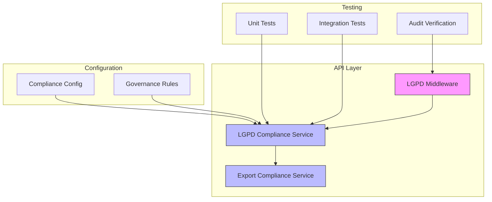

**Diagram sources**

- [lgpd-middleware.ts](file://apps/api/src/middleware/lgpd-middleware.ts#L1-L50)
- [lgpd-compliance.ts](file://apps/api/src/services/export/lgpd-compliance.ts#L1-L30)
- [compliance.config.json](file://packages/config/src/compliance.config.json#L1-L20)

**Section sources**

- [lgpd-middleware.ts](file://apps/api/src/middleware/lgpd-middleware.ts#L1-L100)
- [compliance.config.json](file://packages/config/src/compliance.config.json#L1-L25)

## Core Components for LGPD Compliance

The core compliance functionality is implemented through three primary components: the LGPD middleware for request interception, the compliance service for business logic, and the export module for data subject access requests. These components work in concert to enforce consent validation, lawful basis checks, and data minimization principles.

**Section sources**

- [lgpd-middleware.ts](file://apps/api/src/middleware/lgpd-middleware.ts#L15-L80)
- [lgpd-compliance.ts](file://apps/api/src/lib/lgpd-compliance.ts#L10-L60)
- [lgpd-compliance.ts](file://apps/api/src/services/export/lgpd-compliance.ts#L5-L40)

## Architecture Overview

The LGPD compliance architecture follows a layered approach where incoming requests pass through validation middleware before reaching business services. All personal data operations trigger compliance checks that verify consent status, processing purpose, and data subject rights.

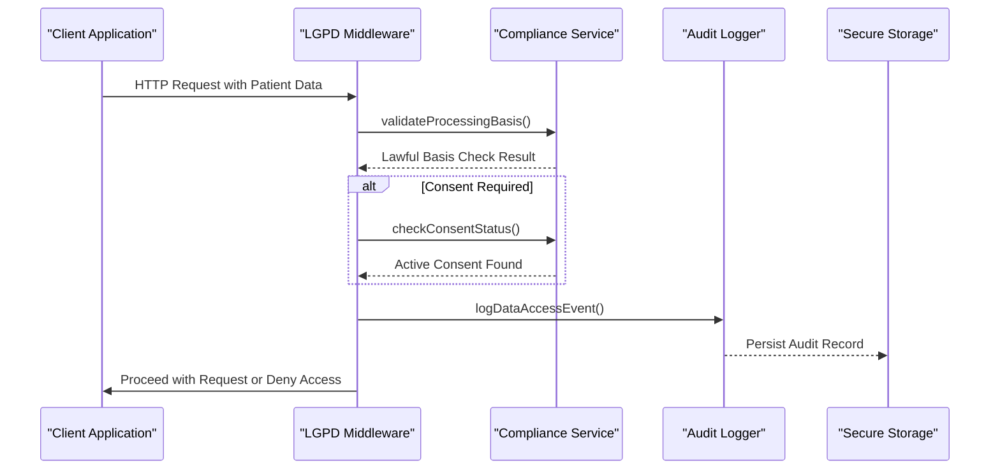

**Diagram sources**

- [lgpd-middleware.ts](file://apps/api/src/middleware/lgpd-middleware.ts#L20-L70)
- [lgpd-compliance.ts](file://apps/api/src/lib/lgpd-compliance.ts#L15-L50)

## Detailed Component Analysis

### LGPD Middleware Implementation

The middleware component intercepts all API requests involving personal data and enforces real-time compliance checks based on configured policies.

#### For API/Service Components:

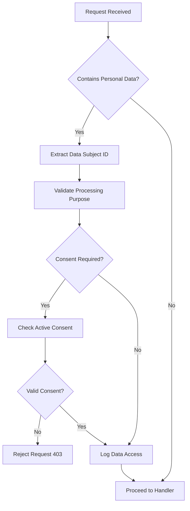

**Diagram sources**

- [lgpd-middleware.ts](file://apps/api/src/middleware/lgpd-middleware.ts#L1-L100)

**Section sources**

- [lgpd-middleware.ts](file://apps/api/src/middleware/lgpd-middleware.ts#L1-L120)

### Compliance Service Logic

The compliance service encapsulates the core business rules for LGPD adherence, including consent validation and lawful basis determination.

#### For Complex Logic Components:

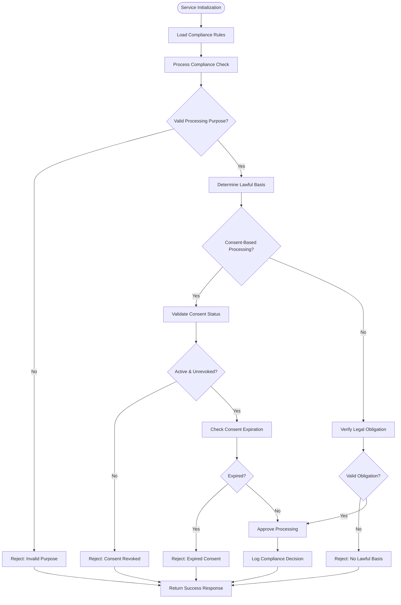

**Diagram sources**

- [lgpd-compliance.ts](file://apps/api/src/lib/lgpd-compliance.ts#L1-L150)

**Section sources**

- [lgpd-compliance.ts](file://apps/api/src/lib/lgpd-compliance.ts#L1-L200)

## Data Subject Rights Fulfillment

The system implements full support for data subject rights as defined by LGPD Article 18, including access, correction, deletion, and portability. Requests are handled through dedicated endpoints that verify identity and authorization before processing.

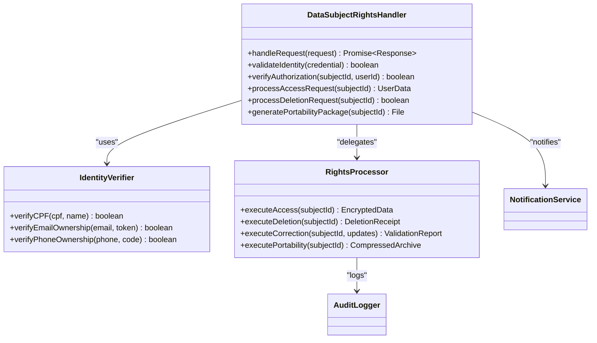

**Diagram sources**

- [lgpd-data-subject-rights.test.ts](file://apps/api/src/__tests__/compliance/lgpd-data-subject-rights.test.ts#L1-L45)
- [lgpd-compliance.ts](file://apps/api/src/services/export/lgpd-compliance.ts#L1-L35)

**Section sources**

- [lgpd-data-subject-rights.test.ts](file://apps/api/src/__tests__/compliance/lgpd-data-subject-rights.test.ts#L1-L60)

## Consent Management System

The consent management subsystem handles recording, tracking, and revocation of user consents in compliance with LGPD Article 8. It maintains detailed records of consent transactions and provides interfaces for audit and verification.

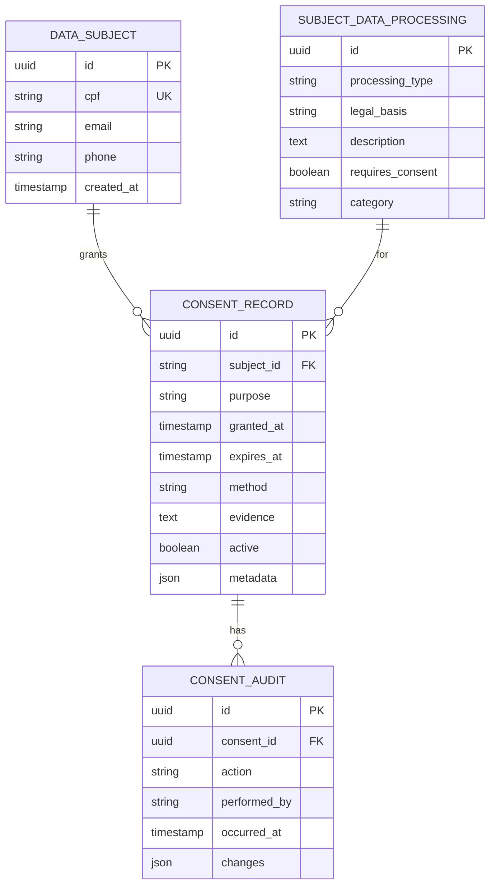

**Diagram sources**

- [lgpd-aesthetic-clinic-consent.test.ts](file://apps/api/src/__tests__/compliance/lgpd-aesthetic-clinic-consent.test.ts#L1-L30)
- [compliance.config.json](file://packages/config/src/compliance.config.json#L1-L15)

**Section sources**

- [lgpd-aesthetic-clinic-consent.test.ts](file://apps/api/src/__tests__/compliance/lgpd-aesthetic-clinic-consent.test.ts#L1-L50)

## Lawful Basis and Processing Activities

The framework supports multiple lawful bases for processing as defined in LGPD Article 7, with configurable rules for each processing activity. The system validates that all data processing has a legitimate legal foundation.

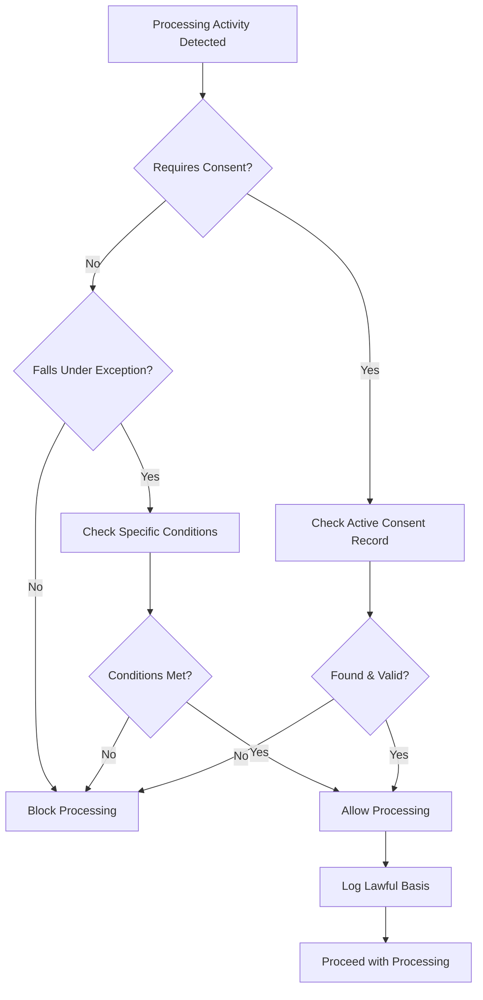

**Diagram sources**

- [lgpd-compliance.ts](file://apps/api/src/lib/lgpd-compliance.ts#L80-L150)
- [compliance.config.json](file://packages/config/src/compliance.config.json#L10-L25)

**Section sources**

- [lgpd-compliance.ts](file://apps/api/src/lib/lgpd-compliance.ts#L50-L200)

## Sensitive Health Data Handling

Special protections are implemented for sensitive health data as required by LGPD Article 11, including enhanced encryption, access controls, and processing limitations.

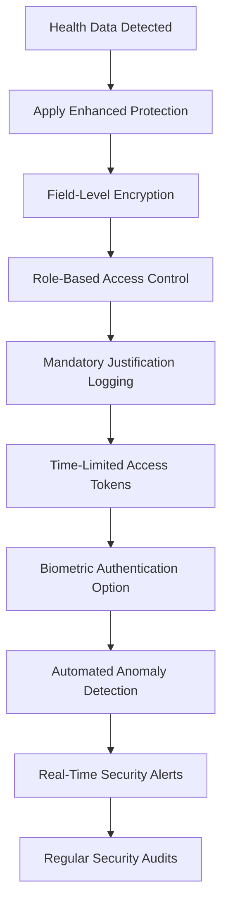

**Diagram sources**

- [lgpd-sensitive-health-data-protection.test.ts](file://apps/api/src/__tests__/compliance/lgpd-sensitive-health-data-protection.test.ts#L1-L25)
- [healthcare-compliance-config.ts](file://config/vercel/healthcare-compliance-config.ts#L1-L20)

**Section sources**

- [lgpd-sensitive-health-data-protection.test.ts](file://apps/api/src/__tests__/compliance/lgpd-sensitive-health-data-protection.test.ts#L1-L40)

## Cross-Border Data Transfer Compliance

The system enforces strict controls on international data transfers as mandated by LGPD Article 33, requiring adequacy decisions or appropriate safeguards.

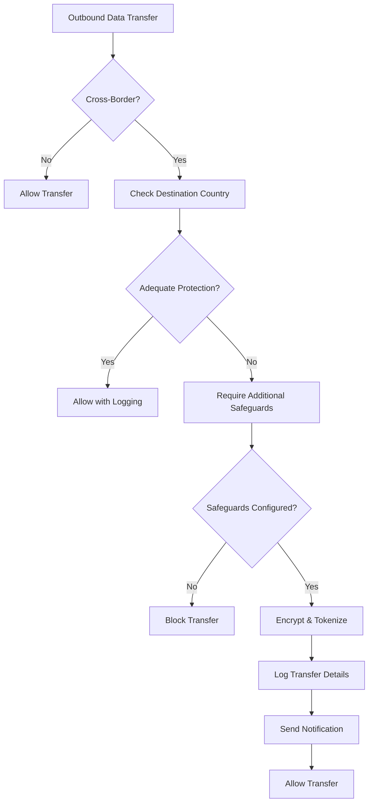

**Diagram sources**

- [lgpd-cross-border-data-transfer.test.ts](file://apps/api/src/__tests__/compliance/lgpd-cross-border-data-transfer.test.ts#L1-L30)
- [governance.config.json](file://packages/config/src/governance.config.json#L1-L15)

**Section sources**

- [lgpd-cross-border-data-transfer.test.ts](file://apps/api/src/__tests__/compliance/lgpd-cross-border-data-transfer.test.ts#L1-L45)

## Data Retention and Deletion Enforcement

Automatic enforcement of data retention periods and secure deletion procedures comply with LGPD Article 16 requirements.

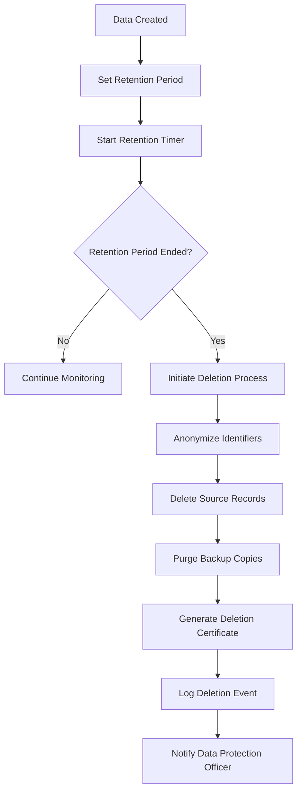

**Diagram sources**

- [lgpd-data-retention-deletion.test.ts](file://apps/api/src/__tests__/compliance/lgpd-data-retention-deletion.test.ts#L1-L25)
- [compliance.config.json](file://packages/config/src/compliance.config.json#L15-L30)

**Section sources**

- [lgpd-data-retention-deletion.test.ts](file://apps/api/src/__tests__/compliance/lgpd-data-retention-deletion.test.ts#L1-L40)

## Privacy Impact Assessments (DPIA)

The framework includes automated support for Data Protection Impact Assessments as required by LGPD Article 38.

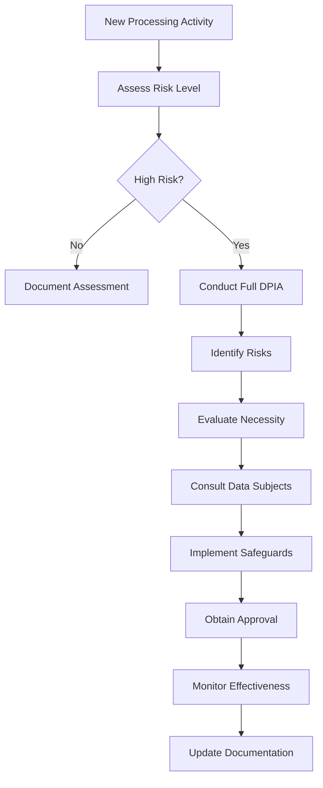

**Diagram sources**

- [lgpd-dpia-validation.test.ts](file://apps/api/src/__tests__/compliance/lgpd-dpia-validation.test.ts#L1-L20)
- [governance.config.json](file://packages/config/src/governance.config.json#L20-L35)

**Section sources**

- [lgpd-dpia-validation.test.ts](file://apps/api/src/__tests__/compliance/lgpd-dpia-validation.test.ts#L1-L35)

## Anonymization and Pseudonymization Workflows

Technical measures for data minimization through anonymization and pseudonymization are implemented per LGPD Article 12.

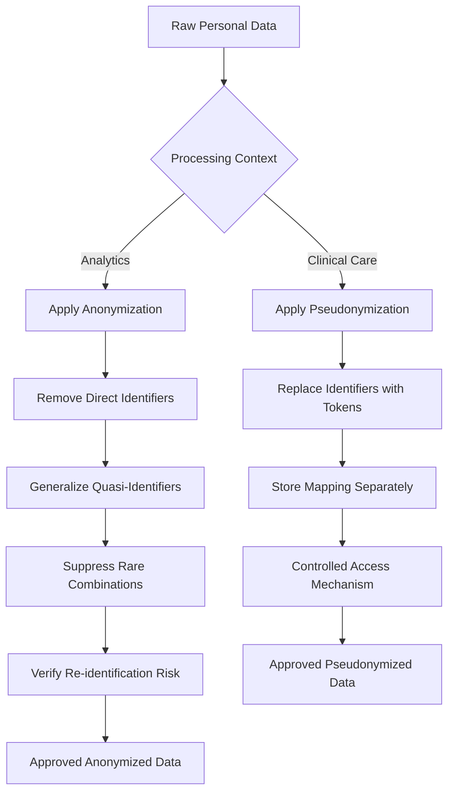

**Diagram sources**

- [lgpd-compliance.ts](file://apps/api/src/lib/lgpd-compliance.ts#L200-L280)
- [lgpd-data-anonymization-pseudonymization.test.ts](file://apps/api/src/__tests__/compliance/lgpd-data-anonymization-pseudonymization.test.ts#L1-L25)

**Section sources**

- [lgpd-compliance.ts](file://apps/api/src/lib/lgpd-compliance.ts#L150-L300)

## Audit Logging and Monitoring

Comprehensive audit trails capture all data processing activities for accountability and oversight.

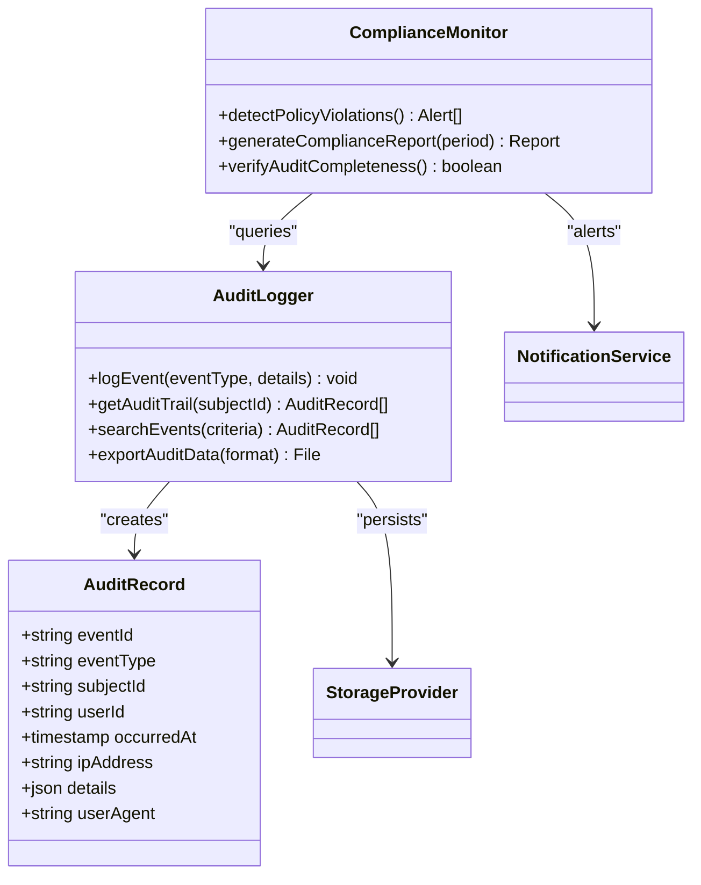

**Diagram sources**

- [lgpd-audit-trail-verification.test.ts](file://apps/api/src/__tests__/compliance/lgpd-audit-trail-verification.test.ts#L1-L20)
- [lgpd-automated-compliance-monitoring.test.ts](file://apps/api/src/__tests__/compliance/lgpd-automated-compliance-monitoring.test.ts#L1-L15)

**Section sources**

- [lgpd-audit-trail-verification.test.ts](file://apps/api/src/__tests__/compliance/lgpd-audit-trail-verification.test.ts#L1-L35)

## Configuration and Rule Management

Compliance policies are externally configurable to support different regulatory requirements and organizational policies.

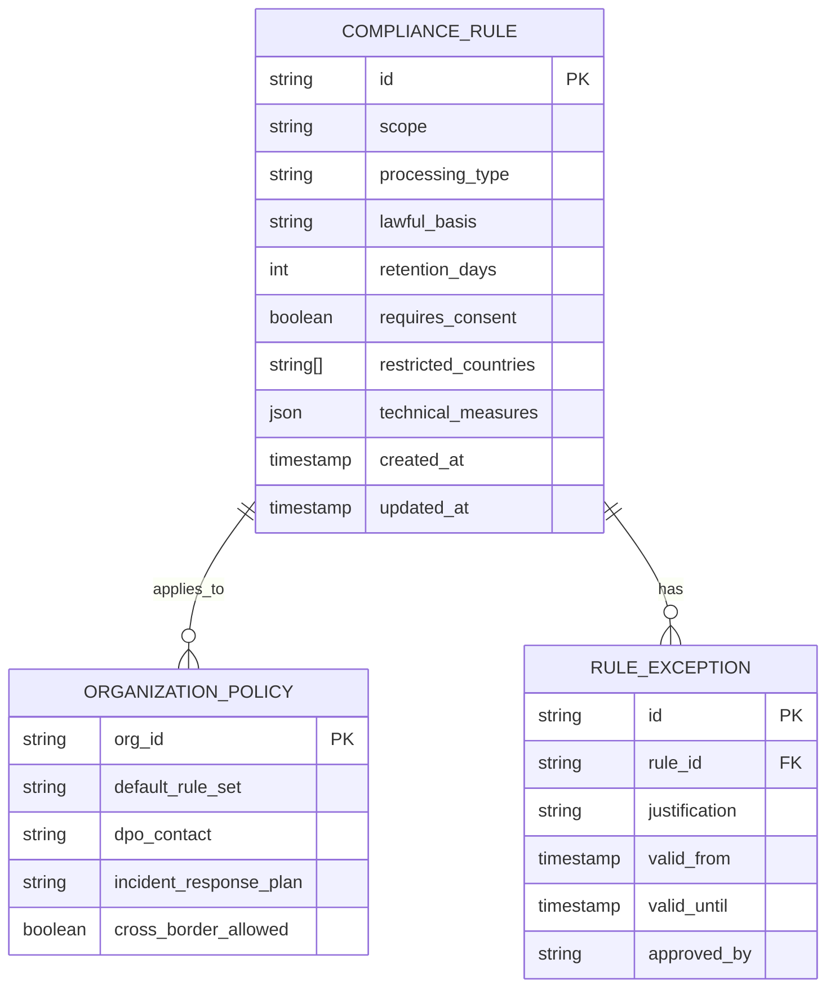

**Diagram sources**

- [compliance.config.json](file://packages/config/src/compliance.config.json#L1-L40)
- [governance.config.json](file://packages/config/src/governance.config.json#L1-L40)

**Section sources**

- [compliance.config.json](file://packages/config/src/compliance.config.json#L1-L50)
- [governance.config.json](file://packages/config/src/governance.config.json#L1-L50)

## Extending the Compliance Framework

The modular design allows for extension to support additional regulatory frameworks beyond LGPD.

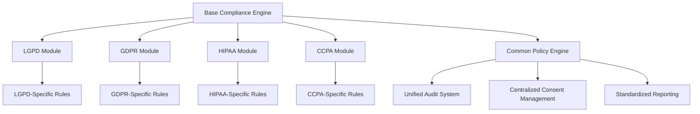

**Diagram sources**

- [lgpd-compliance.ts](file://apps/api/src/lib/lgpd-compliance.ts#L300-L350)
- [compliance.config.json](file://packages/config/src/compliance.config.json#L40-L60)

**Section sources**

- [lgpd-compliance.ts](file://apps/api/src/lib/lgpd-compliance.ts#L250-L400)

## Troubleshooting Common Issues

This section addresses frequent challenges encountered during LGPD compliance implementation and their resolution strategies.

**Section sources**

- [lgpd-data-breach-detection.test.ts](file://apps/api/src/__tests__/compliance/lgpd-data-breach-detection.test.ts#L1-L30)
- [lgpd-compliance-tests.test.ts](file://apps/api/src/__tests__/audit/lgpd-compliance-tests.test.ts#L1-L25)

## Conclusion

The neonpro application implements a comprehensive LGPD compliance framework that addresses all major requirements of Brazil's data protection law. Through a combination of technical controls, process automation, and policy enforcement, the system ensures lawful processing of personal data, protects data subject rights, and maintains accountability. The modular architecture supports both current compliance needs and future regulatory expansion.
