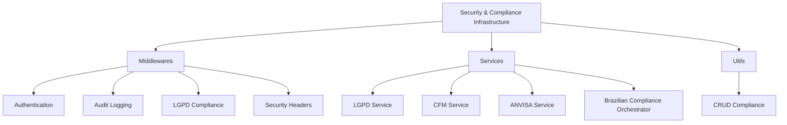
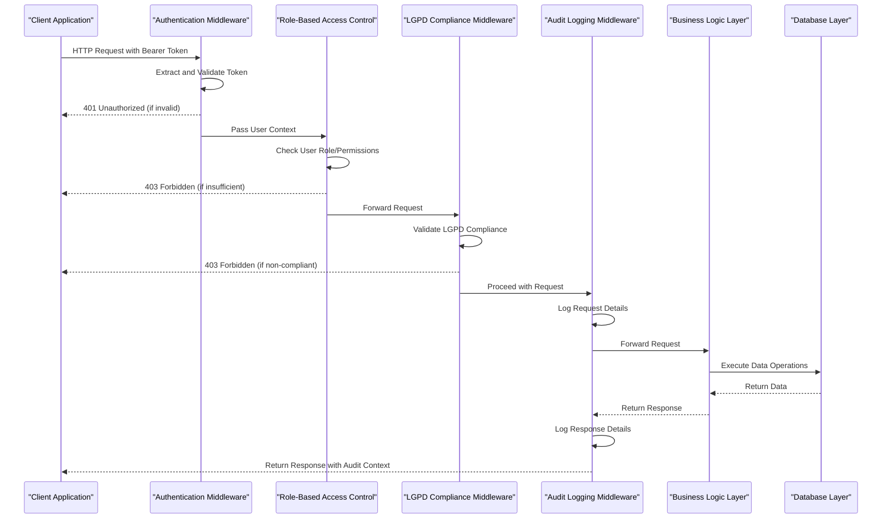
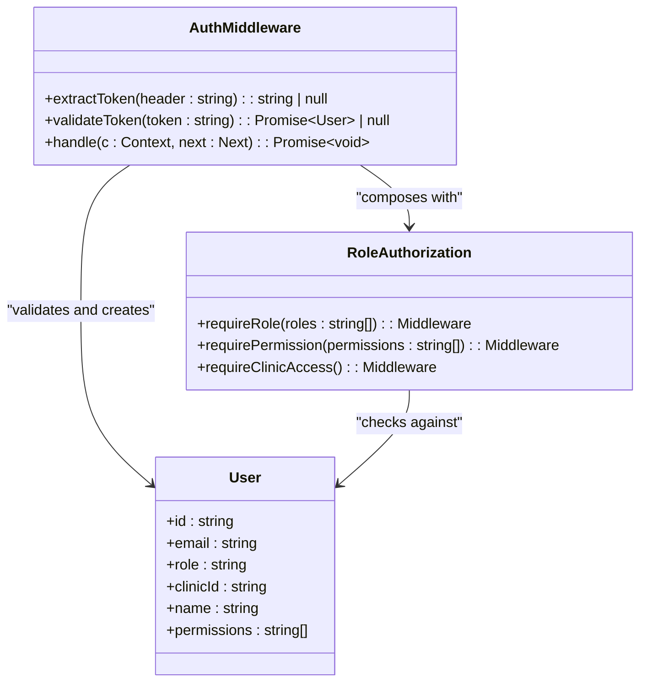
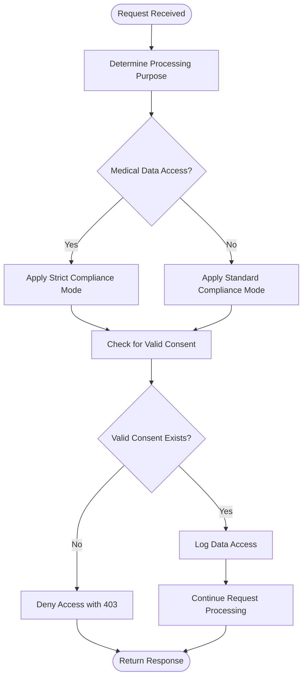
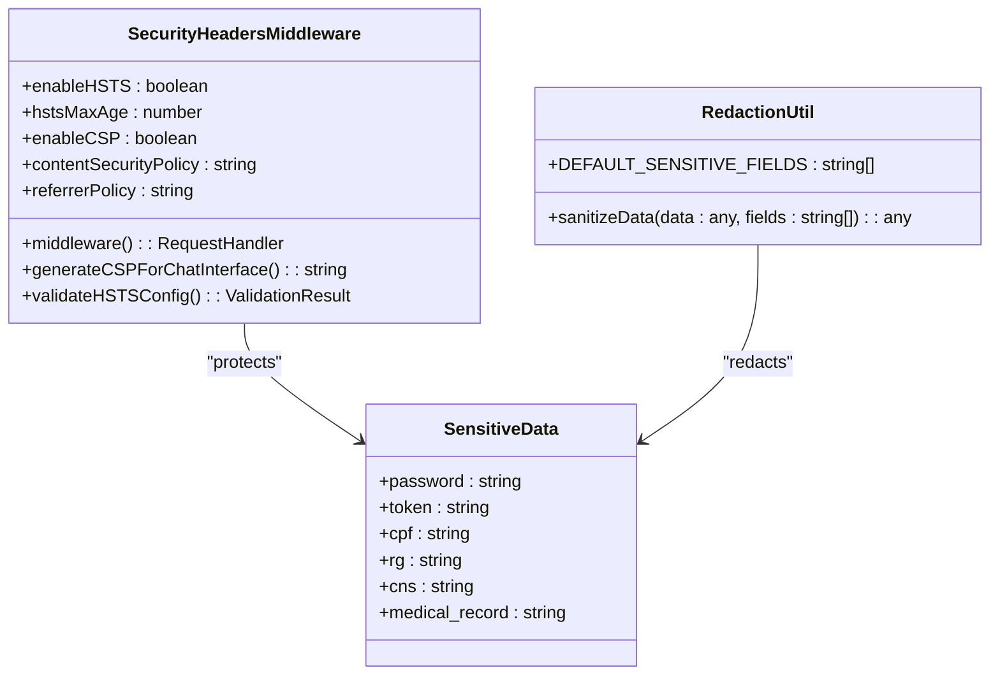
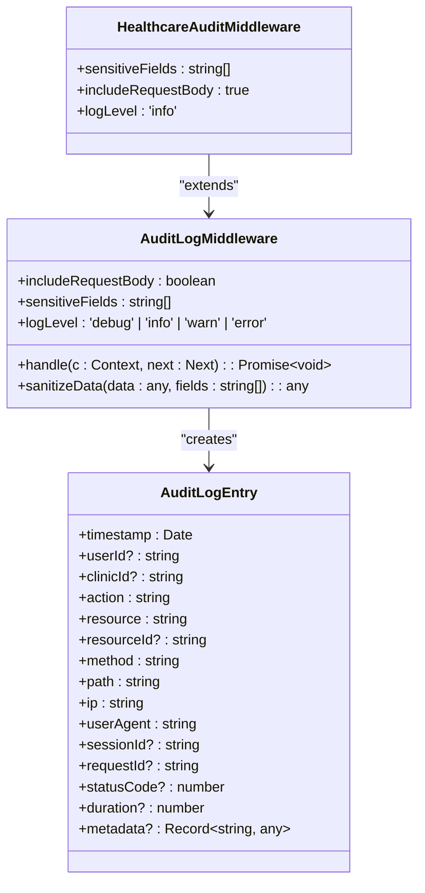
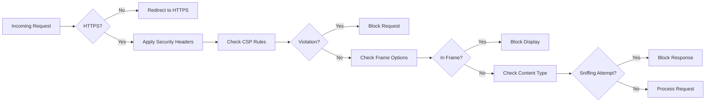
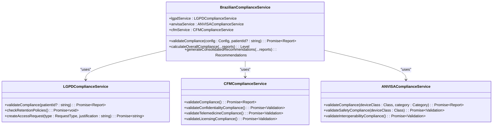
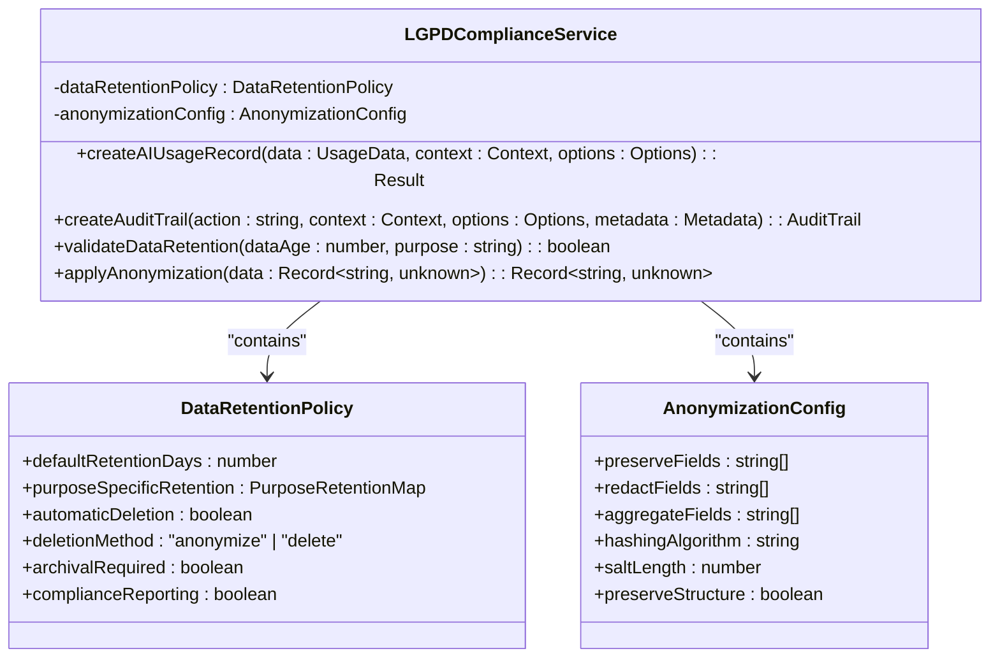
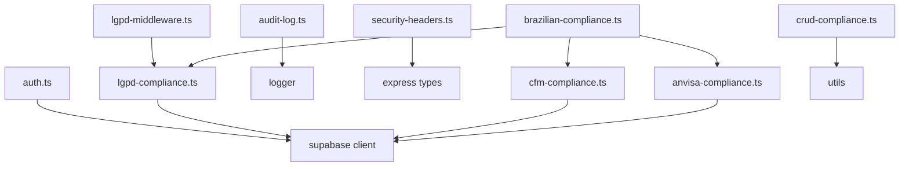

# Security & Compliance

<cite>
**Referenced Files in This Document**   
- [lgpd-middleware.ts](file://apps/api/src/middleware/lgpd-middleware.ts)
- [security-headers.ts](file://apps/api/src/middleware/security-headers.ts)
- [audit-log.ts](file://apps/api/src/middleware/audit-log.ts)
- [auth.ts](file://apps/api/src/middleware/auth.ts)
- [lgpd-compliance.ts](file://apps/api/src/services/lgpd-compliance.ts)
- [cfm-compliance.ts](file://apps/api/src/services/cfm-compliance.ts)
- [anvisa-compliance.ts](file://apps/api/src/services/anvisa-compliance.ts)
- [brazilian-compliance.ts](file://apps/api/src/services/brazilian-compliance.ts)
- [crud-compliance.ts](file://packages/utils/src/crud-compliance.ts)
</cite>

## Table of Contents
1. [Introduction](#introduction)
2. [Project Structure](#project-structure)
3. [Core Components](#core-components)
4. [Architecture Overview](#architecture-overview)
5. [Detailed Component Analysis](#detailed-component-analysis)
6. [Dependency Analysis](#dependency-analysis)
7. [Performance Considerations](#performance-considerations)
8. [Troubleshooting Guide](#troubleshooting-guide)
9. [Conclusion](#conclusion)

## Introduction
The NeonPro application implements a comprehensive security and compliance infrastructure designed to protect sensitive healthcare data in accordance with Brazilian regulations, including the General Data Protection Law (LGPD) and Federal Council of Medicine (CFM) requirements. This documentation provides an architectural overview of the security controls, compliance mechanisms, and data protection strategies implemented across the system. The architecture integrates multiple layers of security, from authentication and authorization to audit logging and vulnerability management, ensuring robust protection of patient information while maintaining regulatory compliance.

## Project Structure
The security and compliance infrastructure is distributed across multiple directories within the NeonPro application, with core components located in the API services and middleware layers. Key security modules are organized under dedicated paths that reflect their functional responsibilities, including authentication, audit logging, LGPD compliance, and general security headers. The modular structure enables clear separation of concerns while allowing for centralized policy enforcement across the application.

**Diagram sources**
- [lgpd-middleware.ts](file://apps/api/src/middleware/lgpd-middleware.ts)
- [audit-log.ts](file://apps/api/src/middleware/audit-log.ts)
- [security-headers.ts](file://apps/api/src/middleware/security-headers.ts)
- [auth.ts](file://apps/api/src/middleware/auth.ts)

**Section sources**
- [apps/api/src/middleware](file://apps/api/src/middleware)
- [apps/api/src/services](file://apps/api/src/services)
- [packages/utils/src](file://packages/utils/src)

## Core Components
The security architecture of NeonPro consists of several core components that work together to enforce compliance with Brazilian healthcare regulations. These include middleware for request interception, services for compliance validation, and utility classes for implementing specific security policies. The system employs a layered approach where each component addresses specific aspects of security and compliance, from user authentication to data protection and audit trail generation.

**Section sources**
- [lgpd-middleware.ts](file://apps/api/src/middleware/lgpd-middleware.ts)
- [security-headers.ts](file://apps/api/src/middleware/security-headers.ts)
- [audit-log.ts](file://apps/api/src/middleware/audit-log.ts)
- [auth.ts](file://apps/api/src/middleware/auth.ts)
- [lgpd-compliance.ts](file://apps/api/src/services/lgpd-compliance.ts)
- [cfm-compliance.ts](file://apps/api/src/services/cfm-compliance.ts)
- [anvisa-compliance.ts](file://apps/api/src/services/anvisa-compliance.ts)

## Architecture Overview
The security architecture follows a middleware-based pattern where security checks are performed at various stages of request processing. When a request enters the system, it first passes through authentication middleware, followed by role-based access control, and then specialized compliance middleware. Each layer adds additional security context to the request, which is used by subsequent layers and ultimately stored in audit logs. The architecture ensures that all data access operations are properly authenticated, authorized, and logged in compliance with regulatory requirements.

**Diagram sources**
- [auth.ts](file://apps/api/src/middleware/auth.ts)
- [lgpd-middleware.ts](file://apps/api/src/middleware/lgpd-middleware.ts)
- [audit-log.ts](file://apps/api/src/middleware/audit-log.ts)

## Detailed Component Analysis

### Authentication and Authorization Mechanisms
The authentication system implements token-based authentication using bearer tokens passed in the Authorization header. Upon receiving a request, the authentication middleware extracts the token and validates it against the system's authentication provider. Validated user information, including ID, role, clinic affiliation, and permissions, is stored in the request context for use by downstream middleware and business logic. The system supports both mandatory and optional authentication flows, allowing for flexible access control based on endpoint requirements.

**Diagram sources**
- [auth.ts](file://apps/api/src/middleware/auth.ts)

**Section sources**
- [auth.ts](file://apps/api/src/middleware/auth.ts)

### LGPD Compliance Implementation
The LGPD compliance system implements Brazil's General Data Protection Law through a combination of middleware and service components. The middleware intercepts requests and enforces consent requirements based on the data processing purpose, while the service layer provides programmatic access to compliance validation functions. The system automatically determines the appropriate processing purpose based on the requested resource and applies corresponding consent rules. For healthcare-specific operations, stricter compliance checks are enforced to ensure protection of sensitive medical data.

**Diagram sources**
- [lgpd-middleware.ts](file://apps/api/src/middleware/lgpd-middleware.ts)

**Section sources**
- [lgpd-middleware.ts](file://apps/api/src/middleware/lgpd-middleware.ts)
- [lgpd-compliance.ts](file://apps/api/src/services/lgpd-compliance.ts)

### Data Encryption and Protection Strategies
While the provided code does not explicitly implement encryption algorithms, it establishes the framework for data protection through comprehensive audit logging and data sanitization. The system identifies sensitive fields such as CPF (Brazilian individual taxpayer registry), RG (identity document), CNS (National Health Card), and medical records, ensuring these are properly redacted when logged or displayed. The architecture supports end-to-end encryption through configuration of security headers that enforce HTTPS and prevent mixed content, creating a secure channel for data transmission.

**Diagram sources**
- [security-headers.ts](file://apps/api/src/middleware/security-headers.ts)
- [audit-log.ts](file://apps/api/src/middleware/audit-log.ts)

**Section sources**
- [security-headers.ts](file://apps/api/src/middleware/security-headers.ts)
- [audit-log.ts](file://apps/api/src/middleware/audit-log.ts)

### Audit Logging Implementation
The audit logging system captures detailed information about all significant operations within the application, creating a comprehensive trail for compliance and security monitoring. Each log entry includes contextual information such as timestamp, user ID, clinic ID, action performed, resource accessed, IP address, user agent, and request duration. The system automatically redacts sensitive fields to prevent exposure of protected health information in logs while maintaining sufficient detail for forensic analysis and compliance reporting.

**Diagram sources**
- [audit-log.ts](file://apps/api/src/middleware/audit-log.ts)

**Section sources**
- [audit-log.ts](file://apps/api/src/middleware/audit-log.ts)

### Vulnerability Management Processes
The system incorporates multiple layers of protection against common web vulnerabilities through security headers and input validation. The Content Security Policy (CSP) prevents cross-site scripting (XSS) attacks by restricting the sources of executable scripts. HTTP Strict Transport Security (HSTS) ensures encrypted communication and prevents protocol downgrade attacks. Additional protections include X-Frame-Options to prevent clickjacking, X-XSS-Protection to enable browser XSS filters, and X-Content-Type-Options to prevent MIME type sniffing attacks.

**Diagram sources**
- [security-headers.ts](file://apps/api/src/middleware/security-headers.ts)

**Section sources**
- [security-headers.ts](file://apps/api/src/middleware/security-headers.ts)

### CFM and ANVISA Compliance Services
The compliance architecture extends beyond LGPD to include validation for CFM (Federal Council of Medicine) and ANVISA (National Health Surveillance Agency) regulations. The CFM compliance service validates adherence to professional standards, including confidentiality requirements, record integrity, telemedicine protocols, and licensing status. The ANVISA compliance service ensures medical device software meets safety, interoperability, and terminology standards. These services operate as independent validators that can be orchestrated together to provide comprehensive regulatory compliance assessment.

**Diagram sources**
- [brazilian-compliance.ts](file://apps/api/src/services/brazilian-compliance.ts)
- [lgpd-compliance.ts](file://apps/api/src/services/lgpd-compliance.ts)
- [cfm-compliance.ts](file://apps/api/src/services/cfm-compliance.ts)
- [anvisa-compliance.ts](file://apps/api/src/services/anvisa-compliance.ts)

**Section sources**
- [brazilian-compliance.ts](file://apps/api/src/services/brazilian-compliance.ts)
- [lgpd-compliance.ts](file://apps/api/src/services/lgpd-compliance.ts)
- [cfm-compliance.ts](file://apps/api/src/services/cfm-compliance.ts)
- [anvisa-compliance.ts](file://apps/api/src/services/anvisa-compliance.ts)

### Data Minimization and Retention Policies
The system implements data minimization principles through the LGPDComplianceService, which enforces strict retention policies based on data processing purpose. Different retention periods are applied to various data categories, with analytics data retained for 365 days, diagnostic data for 730 days (2 years), AI training data for 1095 days (3 years), and audit data for 2555 days (7 years). After the retention period expires, data is either anonymized or securely deleted according to organizational policies and regulatory requirements.

**Diagram sources**
- [crud-compliance.ts](file://packages/utils/src/crud-compliance.ts)

**Section sources**
- [crud-compliance.ts](file://packages/utils/src/crud-compliance.ts)

## Dependency Analysis
The security and compliance components have well-defined dependencies that follow a layered architecture. Middleware components depend on core services for compliance validation, while services may depend on external systems like Supabase for data storage and retrieval. The dependency graph shows minimal circular dependencies, with most relationships flowing from higher-level middleware down to lower-level services and utilities. This clean dependency structure enhances testability and maintainability of the security infrastructure.

**Diagram sources**
- [go.mod](file://go.mod)
- [package.json](file://package.json)

**Section sources**
- [apps/api/src/middleware](file://apps/api/src/middleware)
- [apps/api/src/services](file://apps/api/src/services)
- [packages/utils/src](file://packages/utils/src)

## Performance Considerations
The security infrastructure is designed with performance in mind, employing asynchronous operations and parallel processing to minimize latency impact. Compliance checks are implemented to complete within strict time limits, with LGPD middleware targeting less than 100ms overhead and RLS (Row Level Security) operations under 50ms. The system uses efficient data structures and caching strategies where appropriate to maintain responsiveness while enforcing security policies. Audit logging is optimized to avoid blocking request processing, with log entries written asynchronously to prevent performance degradation during peak loads.

**Section sources**
- [compliance-validation.md](file://apps/api/src/trpc/middleware/compliance-validation.md)

## Troubleshooting Guide
When diagnosing security and compliance issues, administrators should first check the audit logs for relevant entries, which contain detailed information about authentication attempts, authorization decisions, and compliance violations. Common issues include missing or expired authentication tokens, insufficient user roles or permissions, and LGPD consent requirements not being met. The system generates descriptive error messages and structured error codes to facilitate troubleshooting, with specific guidance provided for resolving different types of compliance failures.

**Section sources**
- [auth.ts](file://apps/api/src/middleware/auth.ts)
- [lgpd-middleware.ts](file://apps/api/src/middleware/lgpd-middleware.ts)
- [audit-log.ts](file://apps/api/src/middleware/audit-log.ts)

## Conclusion
The NeonPro application's security and compliance infrastructure provides a robust framework for protecting sensitive healthcare data in accordance with Brazilian regulations. By implementing a layered approach that combines authentication, authorization, audit logging, and regulatory compliance validation, the system ensures that patient information is handled securely and in compliance with LGPD, CFM, and ANVISA requirements. The modular architecture allows for easy maintenance and extension of security features, while comprehensive logging and monitoring capabilities support ongoing compliance verification and incident response. This foundation enables healthcare providers to leverage the platform's capabilities with confidence in the protection of patient privacy and regulatory compliance.