# Vulnerability Management

<cite>
**Referenced Files in This Document**
- [security-headers.ts](file://apps/api/src/middleware/security-headers.ts)
- [sql-sanitizer.ts](file://apps/api/src/security/sql-sanitizer.ts)
- [api-rate-limiting.ts](file://packages/shared/src/services/api-rate-limiting.ts)
- [api-contract.ts](file://apps/api/src/@neonpro/shared/models/api-contract.ts)
- [https-config.ts](file://apps/api/src/config/https-config.ts)
- [tls-config.ts](file://apps/api/src/config/tls-config.ts)
- [tls-constants.ts](file://apps/api/src/config/tls-constants.ts)
</cite>

## Table of Contents

1. [Introduction](#introduction)
2. [Security Headers Implementation](#security-headers-implementation)
3. [Input Validation and Data Sanitization](#input-validation-and-data-sanitization)
4. [Rate Limiting Strategy](#rate-limiting-strategy)
5. [SQL Injection Prevention](#sql-injection-prevention)
6. [XSS Protection Mechanisms](#xss-protection-mechanisms)
7. [Security Policy Configuration](#security-policy-configuration)
8. [Automated Vulnerability Scanning](#automated-vulnerability-scanning)
9. [Incident Detection and Response](#incident-detection-and-response)
10. [Domain Models for Security Controls](#domain-models-for-security-controls)
11. [Integration with Request Processing Pipelines](#integration-with-request-processing-pipelines)
12. [Testing Framework Integration](#testing-framework-integration)
13. [Monitoring System Integration](#monitoring-system-integration)
14. [Common Issues and Solutions](#common-issues-and-solutions)
15. [Customizing Security Policies](#customizing-security-policies)
16. [External Scanner Integration](#external-scanner-integration)
17. [Penetration Testing Guidance](#penetration-testing-guidance)

## Introduction

The neonpro healthcare platform implements a comprehensive vulnerability management system designed to protect sensitive medical data while maintaining compliance with healthcare regulations such as LGPD and HIPAA. This document details the implementation of proactive security measures including security headers, input validation, rate limiting, SQL injection prevention, and XSS protection. The platform's security architecture is built around healthcare-specific requirements, ensuring patient safety while providing robust protection against common web vulnerabilities.

The system incorporates multiple layers of defense, from transport layer security to application-level protections, creating a defense-in-depth strategy. Security controls are implemented through middleware components that integrate seamlessly with the request processing pipeline, allowing for consistent enforcement across all endpoints. The platform also includes automated vulnerability scanning capabilities and incident detection systems that provide real-time monitoring and alerting.

**Section sources**

- [security-headers.ts](file://apps/api/src/middleware/security-headers.ts#L0-L381)
- [sql-sanitizer.ts](file://apps/api/src/security/sql-sanitizer.ts#L0-L512)

## Security Headers Implementation

The neonpro platform implements a comprehensive suite of security headers to protect against common web vulnerabilities. The `SecurityHeadersMiddleware` class enforces HTTP Strict Transport Security (HSTS), Content Security Policy (CSP), X-Frame-Options, X-Content-Type-Options, and X-XSS-Protection headers across all responses.

```mermaid
classDiagram
class SecurityHeadersConfig {
+boolean enableHSTS
+number hstsMaxAge
+boolean hstsIncludeSubDomains
+boolean hstsPreload
+boolean enableCSP
+string contentSecurityPolicy
+boolean enableFrameGuard
+boolean enableXSSProtection
+boolean enableContentTypeSniffingProtection
+string referrerPolicy
+string permissionsPolicy
+Record<string, string> customHeaders
}
class SecurityHeadersMiddleware {
-SecurityHeadersConfig config
-Logger logger
+middleware() (req : Request, res : Response, next : NextFunction) => void
+generateCSPForChatInterface() string
+generatePermissionsPolicy() string
+validateHSTSConfig() {valid : boolean, errors : string[], warnings : string[]}
+getSecurityReport() SecurityReport
}
class SecurityReport {
+string[] enabledFeatures
+HSTSConfig hstsConfig
+boolean cspEnabled
+number headersCount
+ValidationResult validation
}
SecurityHeadersMiddleware --> SecurityHeadersConfig : "uses"
SecurityHeadersMiddleware --> SecurityReport : "generates"
```

**Diagram sources**

- [security-headers.ts](file://apps/api/src/middleware/security-headers.ts#L22-L327)

The HSTS configuration requires a minimum max-age of 31,536,000 seconds (1 year) for production environments, with includeSubDomains and preload directives enabled for maximum security. The CSP policy is specifically tailored for the AI chat interface, allowing necessary inline scripts while restricting other potentially dangerous sources. The Permissions Policy disables access to device sensors like accelerometer, camera, and microphone to prevent unauthorized data collection.

The system validates HSTS configuration through the `validateHSTSConfig` method, which checks for appropriate max-age values and warns if HSTS is disabled. The `getSecurityReport` method provides a comprehensive overview of enabled security features, including HSTS configuration details and validation results.

**Section sources**

- [security-headers.ts](file://apps/api/src/middleware/security-headers.ts#L0-L381)
- [https-config.ts](file://apps/api/src/config/https-config.ts#L0-L165)

## Input Validation and Data Sanitization

The platform implements rigorous input validation through API contract validation, ensuring all incoming data meets defined constraints. The `validateAPIContract` function processes data against a set of validation rules and field constraints, returning detailed validation results with error categorization by severity.

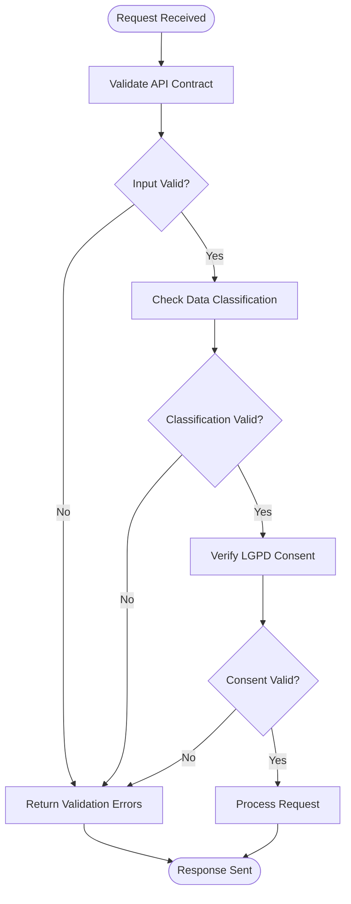

**Diagram sources**

- [api-contract.ts](file://apps/api/src/@neonpro/shared/models/api-contract.ts#L248-L293)

The validation system includes healthcare-specific rules such as patient ID format validation, clinic ID format validation, LGPD consent verification, and medical data classification checks. Field constraints define type requirements, length limits, pattern matching, and enumeration validation for each field. The system returns detailed error objects containing IDs, messages, fields, severity levels, categories, and timestamps for comprehensive error tracking.

Default validation rules include checking for proper patient and clinic ID formats, validating LGPD consent records when processing personal data, and ensuring medical data is properly classified. Field constraints specify requirements for patientId, clinicId, appointmentDate, medicalRecord, consentRecords, and dataClassification fields, with appropriate type, length, and enumeration restrictions.

**Section sources**

- [api-contract.ts](file://apps/api/src/@neonpro/shared/models/api-contract.ts#L0-L506)

## Rate Limiting Strategy

The neonpro platform employs a sophisticated rate limiting strategy through the `APIRateLimitingService`, which implements multiple algorithms and healthcare-aware prioritization. The service supports sliding window, token bucket, fixed window, and leaky bucket algorithms, with configurable tiers for different request priorities.

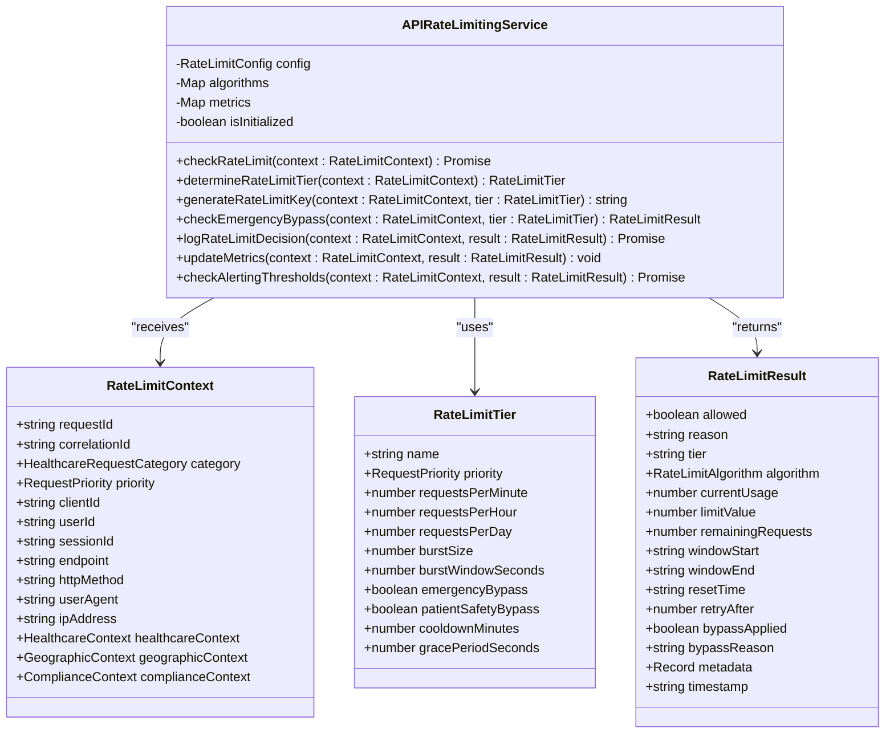

**Diagram sources**

- [api-rate-limiting.ts](file://packages/shared/src/services/api-rate-limiting.ts#L537-L759)

The system defines seven rate limit tiers with corresponding priorities: emergency, critical, urgent, high, normal, low, and background. Each tier has specific request limits per minute, hour, and day, along with burst handling capabilities. Healthcare-specific features include emergency bypass for life-critical requests, patient safety bypass for critical care operations, and critical system bypass for essential infrastructure.

The service integrates with monitoring systems, collecting metrics on request volume, blocked requests, and bypassed requests. When usage exceeds 80% of the configured limit, the system triggers alerts for proactive intervention. In case of service failure, the system defaults to allowing requests (fail-open behavior) to ensure patient safety, logging the event for subsequent analysis.

**Section sources**

- [api-rate-limiting.ts](file://packages/shared/src/services/api-rate-limiting.ts#L0-L799)

## SQL Injection Prevention

The platform implements advanced SQL injection protection through the `SQLSanitizer` class, which uses whitelist-based operation validation and dynamic query sanitization. The system validates all SQL operations against a predefined list of allowed tables, operations, columns, and functions before execution.

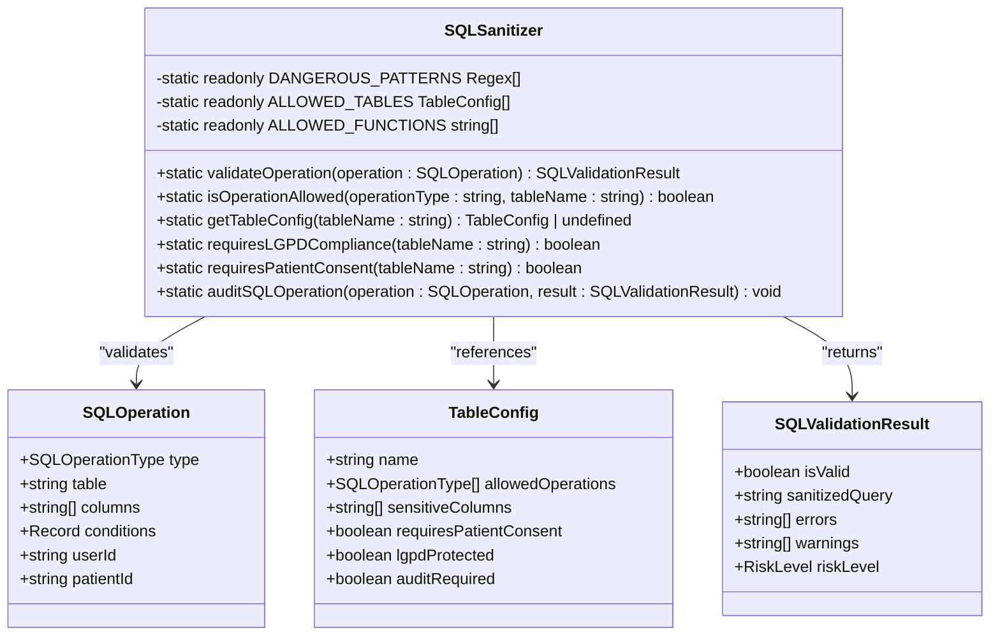

**Diagram sources**

- [sql-sanitizer.ts](file://apps/api/src/security/sql-sanitizer.ts#L39-L509)

The sanitizer maintains a whitelist of allowed tables including patients, appointments, medical_records, users, audit_logs, and system_config, each with specific allowed operations and sensitive columns. For example, the patients table allows SELECT, INSERT, and UPDATE operations but prohibits DELETE, while the appointments table allows all four basic operations.

The system checks for dangerous patterns in SQL input, including DROP, ALTER, CREATE, TRUNCATE, EXEC, EXECUTE, UNION SELECT, INTO OUTFILE, LOAD_FILE, and various script-related patterns. It also validates column names and condition values for dangerous patterns. LGPD compliance is enforced by requiring patient consent for operations on protected data and user identification for LGPD-protected tables.

All SQL operations are audited when required, with detailed logs capturing user ID, patient ID, operation type, data type, endpoint, IP address, and user agent. The system builds sanitized queries using parameterized placeholders (${}) rather than direct string concatenation to prevent injection attacks.

**Section sources**

- [sql-sanitizer.ts](file://apps/api/src/security/sql-sanitizer.ts#L0-L512)

## XSS Protection Mechanisms

The platform implements multiple layers of XSS protection through Content Security Policy (CSP), input validation, and output encoding. The CSP header restricts the sources from which content can be loaded, preventing execution of unauthorized scripts.

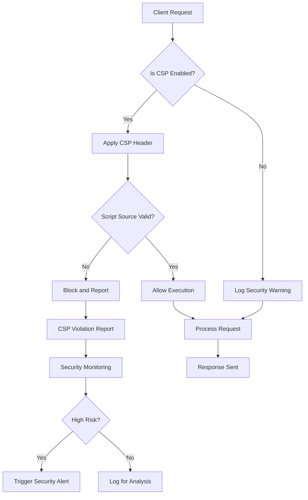

**Diagram sources**

- [security-headers.ts](file://apps/api/src/middleware/security-headers.ts#L22-L327)

The CSP policy for the AI chat interface includes directives for default-src, script-src, style-src, img-src, font-src, connect-src, frame-src, object-src, base-uri, form-action, and frame-ancestors. Script sources are restricted to 'self', 'unsafe-inline', and 'unsafe-eval' with additional allowances for CopilotKit CDN and OpenAI API endpoints. Connect sources are limited to secure origins including wss://*.supabase.co.

The system generates CSP violation reports that capture blocked URIs, violated directives, original policies, document URIs, referrers, user agents, and IP addresses. High-risk violations involving script-src, object-src, default-src, or connect-src directives, or those attempting to load from data:, javascript:, or http: URIs trigger immediate security alerts.

Additional XSS protection is provided by the X-XSS-Protection header set to '1; mode=block', which instructs compatible browsers to block pages when reflected XSS attacks are detected. The X-Content-Type-Options header set to 'nosniff' prevents MIME type sniffing attacks that could lead to XSS vulnerabilities.

**Section sources**

- [security-headers.ts](file://apps/api/src/middleware/security-headers.ts#L0-L381)

## Security Policy Configuration

The platform provides flexible security policy configuration through multiple interfaces and configuration files. Security headers are configured through the `SecurityHeadersConfig` interface, which defines properties for HSTS, CSP, frame guarding, content type sniffing protection, XSS protection, referrer policy, permissions policy, and custom headers.

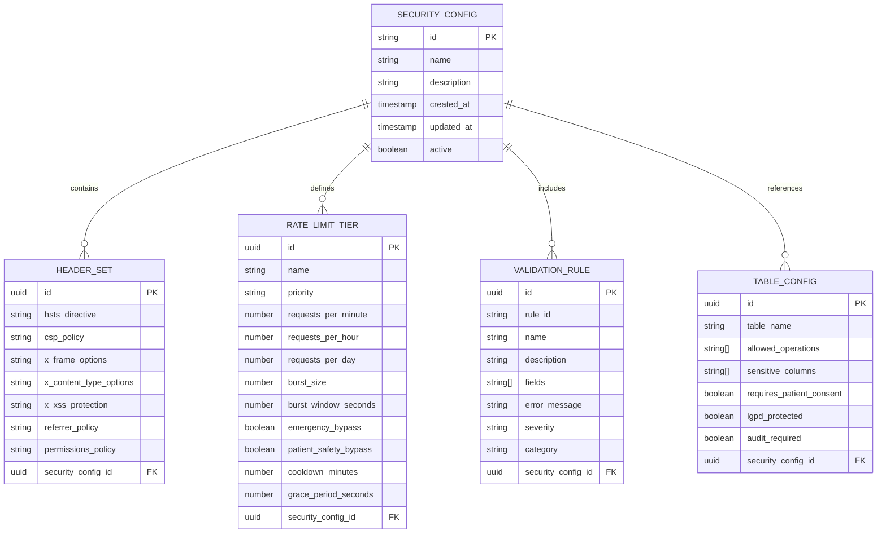

**Diagram sources**

- [security-headers.ts](file://apps/api/src/middleware/security-headers.ts#L22-L327)
- [api-rate-limiting.ts](file://packages/shared/src/services/api-rate-limiting.ts#L537-L759)
- [sql-sanitizer.ts](file://apps/api/src/security/sql-sanitizer.ts#L39-L509)

Rate limiting policies are configured through the `RateLimitConfig` schema, which defines service configuration, tier definitions, global limits, emergency settings, healthcare-specific configuration, storage options, monitoring parameters, and audit settings. The configuration supports multiple storage backends including memory, Redis, and database, with configurable connection strings and TTL settings.

Input validation policies are defined in the `APIContract` interface, which specifies version, data classification, compliance requirements, validation rules, required fields, optional fields, and field constraints. Default configurations include healthcare-specific validation rules for patient ID format, clinic ID format, LGPD consent, and medical data classification.

TLS/HTTPS configuration is managed through the `TLSConfigManager` class, which centralizes certificate management, cipher suite configuration, and security settings. The system enforces TLS 1.3+ with Perfect Forward Secrecy cipher suites and validates certificate presence in production environments.

**Section sources**

- [security-headers.ts](file://apps/api/src/middleware/security-headers.ts#L0-L381)
- [api-rate-limiting.ts](file://packages/shared/src/services/api-rate-limiting.ts#L0-L799)
- [api-contract.ts](file://apps/api/src/@neonpro/shared/models/api-contract.ts#L0-L506)
- [tls-config.ts](file://apps/api/src/config/tls-config.ts#L0-L311)

## Automated Vulnerability Scanning

The platform incorporates automated vulnerability scanning through integrated testing frameworks and security analysis tools. The system performs regular scans for common vulnerabilities including SQL injection, XSS, CSRF, and insecure dependencies.

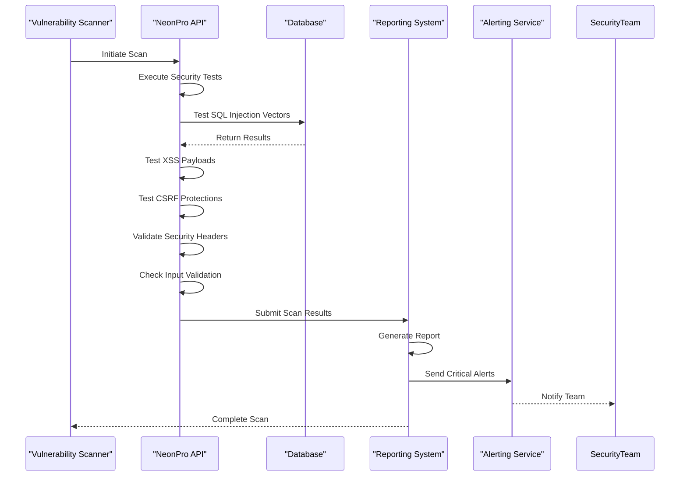

**Diagram sources**

- [security-headers.ts](file://apps/api/src/middleware/security-headers.ts#L0-L381)
- [sql-sanitizer.ts](file://apps/api/src/security/sql-sanitizer.ts#L0-L512)

The scanning process begins with reconnaissance to identify all accessible endpoints and their security configurations. For each endpoint, the scanner tests various attack vectors including SQL injection attempts using UNION SELECT, stacked queries, and blind injection techniques. XSS testing includes both reflected and stored XSS payloads targeting input fields and response outputs.

CSRF protection is validated by attempting to perform state-changing operations without valid CSRF tokens. Security headers are verified for presence and correct configuration, with particular attention to HSTS max-age values, CSP directives, and X-Frame-Options settings. Input validation is tested by submitting malformed data, oversized payloads, and invalid types to ensure proper rejection.

Scan results are compiled into comprehensive reports that categorize vulnerabilities by severity (CRITICAL, HIGH, MEDIUM, LOW) and type (SECURITY, COMPLIANCE, VALIDATION). Critical findings trigger immediate alerts to the security team, while lower-severity issues are tracked in the vulnerability management system for scheduled remediation.

The system includes self-monitoring capabilities that verify the effectiveness of security controls. For example, the `validateHSTSConfig` method checks for appropriate HSTS configuration, while the `validateConfig` method in the security headers service validates CSP settings. These internal validations serve as continuous vulnerability assessments.

**Section sources**

- [security-headers.ts](file://apps/api/src/middleware/security-headers.ts#L0-L381)
- [sql-sanitizer.ts](file://apps/api/src/security/sql-sanitizer.ts#L0-L512)

## Incident Detection and Response

The platform implements comprehensive incident detection and response mechanisms through real-time monitoring, automated alerts, and structured response workflows. Security events are logged and analyzed to detect potential breaches or attacks.

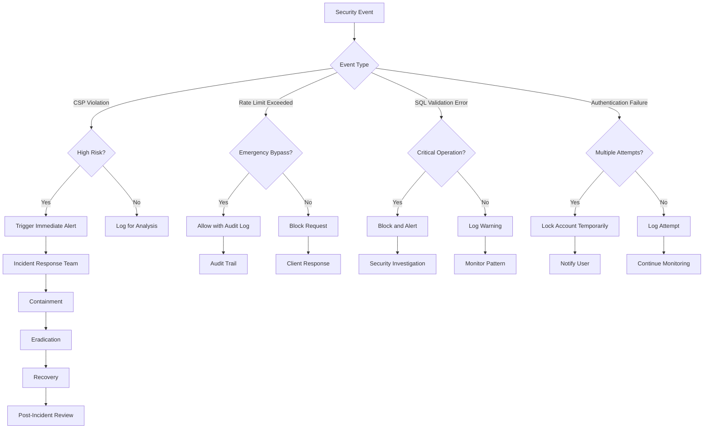

**Diagram sources**

- [security-headers.ts](file://apps/api/src/middleware/security-headers.ts#L0-L381)
- [api-rate-limiting.ts](file://packages/shared/src/services/api-rate-limiting.ts#L0-L799)
- [sql-sanitizer.ts](file://apps/api/src/security/sql-sanitizer.ts#L0-L512)

CSP violation reports are processed to determine risk level based on the violated directive and blocked URI. High-risk violations involving script-src, object-src, or connect-src directives, or those attempting to load from data: or javascript: URIs, trigger immediate alerts to the security team. Lower-risk violations are logged for trend analysis and potential policy refinement.

Rate limit exceedances are handled according to request priority and context. Emergency, critical, and patient safety requests may bypass rate limits when necessary for patient care, with detailed audit logging. Other requests are blocked with appropriate HTTP 429 responses and retry-after headers.

SQL validation errors are categorized by risk level (LOW, MEDIUM, HIGH, CRITICAL) based on the nature of the violation. Critical violations involving disallowed operations on sensitive tables trigger immediate blocking and security alerts, while lower-risk issues generate warnings for developer awareness.

Authentication failures are monitored for patterns of multiple attempts, which may indicate brute force attacks. After five failed attempts within 15 minutes, the system temporarily locks the authentication endpoint for that client IP, requiring a cooling-off period before further attempts.

All security events are logged with comprehensive context including timestamp, event type, client IP, user agent, request path, and relevant identifiers. Logs are retained for 90 days to support incident investigation and compliance requirements.

**Section sources**

- [security-headers.ts](file://apps/api/src/middleware/security-headers.ts#L0-L381)
- [api-rate-limiting.ts](file://packages/shared/src/services/api-rate-limiting.ts#L0-L799)
- [sql-sanitizer.ts](file://apps/api/src/security/sql-sanitizer.ts#L0-L512)

## Domain Models for Security Controls

The platform defines comprehensive domain models for threat categories, security controls, and remediation workflows. These models provide a structured approach to vulnerability management and ensure consistency across security implementations.

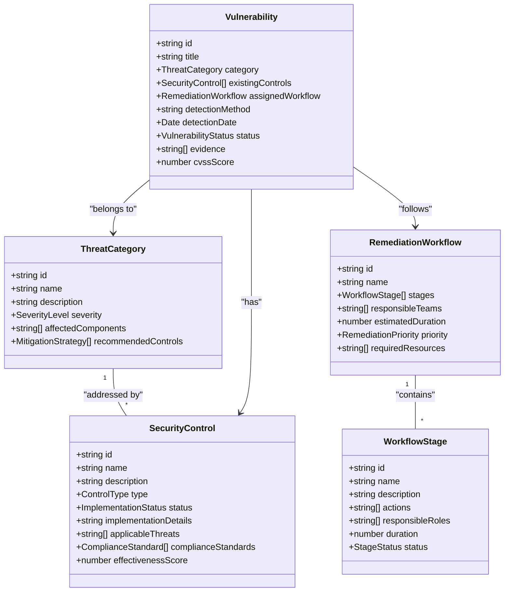

**Diagram sources**

- [api-contract.ts](file://apps/api/src/@neonpro/shared/models/api-contract.ts#L48-L95)
- [sql-sanitizer.ts](file://apps/api/src/security/sql-sanitizer.ts#L39-L509)
- [api-rate-limiting.ts](file://packages/shared/src/services/api-rate-limiting.ts#L537-L759)

Threat categories include injection attacks (SQL, XSS, command), broken authentication, sensitive data exposure, XML external entities, broken access control, security misconfiguration, cross-site scripting, insecure deserialization, using components with known vulnerabilities, and insufficient logging and monitoring. Each category has associated severity levels and recommended mitigation strategies.

Security controls are classified by type including preventive, detective, corrective, deterrent, and recovery controls. Implementation status tracks whether controls are planned, in progress, implemented, or deprecated. Effectiveness scores range from 0-100 based on control maturity and measured impact.

Remediation workflows define structured processes for addressing vulnerabilities, with stages including triage, analysis, development, testing, deployment, and verification. Priority levels align with vulnerability severity, with critical issues receiving immediate attention and lower-severity issues following standard change management processes.

The system maps security controls to compliance standards including LGPD, HIPAA, ANVISA SaMD, and general healthcare security requirements. This ensures that implemented controls satisfy regulatory obligations while providing effective protection against threats.

**Section sources**

- [api-contract.ts](file://apps/api/src/@neonpro/shared/models/api-contract.ts#L0-L506)
- [sql-sanitizer.ts](file://apps/api/src/security/sql-sanitizer.ts#L0-L512)
- [api-rate-limiting.ts](file://packages/shared/src/services/api-rate-limiting.ts#L0-L799)

## Integration with Request Processing Pipelines

Security controls are tightly integrated with the request processing pipelines through middleware components that execute at various stages of request handling. This ensures consistent enforcement of security policies across all endpoints.

```mermaid
flowchart LR
A[Client Request] --> B[HTTPS/TLS Termination]
B --> C[Security Headers Middleware]
C --> D[Rate Limiting Middleware]
D --> E[Input Validation Middleware]
E --> F[CORS Middleware]
F --> G[Authentication Middleware]
G --> H[Authorization Middleware]
H --> I[Healthcare Data Protection]
I --> J[Business Logic Processing]
J --> K[Response Formatting]
K --> L[Security Headers Addition]
L --> M[Server Response]
```

**Diagram sources**

- [security-headers.ts](file://apps/api/src/middleware/security-headers.ts#L0-L381)
- [security-middleware.ts](file://apps/api/src/middleware/security-middleware.ts#L0-L383)

The request processing pipeline begins with HTTPS/TLS termination, where the `TLSConfigManager` ensures secure connections using TLS 1.3+ with Perfect Forward Secrecy cipher suites. The `httpsRedirectMiddleware` automatically redirects HTTP requests to HTTPS in production environments.

Next, the `SecurityHeadersMiddleware` applies security headers to both requests and responses, enforcing HSTS, CSP, X-Frame-Options, and other protective measures. The `healthcareSecurityHeadersMiddleware` provides specialized header configuration for healthcare endpoints.

Rate limiting is enforced by the `APIRateLimitingService`, which evaluates each request against configured limits based on client identity, endpoint, and healthcare context. Emergency and patient safety requests receive priority treatment with potential bypass capabilities.

Input validation occurs through the `validateAPIContract` function, which verifies request data against defined contracts including field constraints and validation rules. Malformed or invalid requests are rejected with appropriate error responses.

CORS policies are applied by the `corsMiddleware`, which validates origin headers and sets appropriate cross-origin headers. Authentication is handled by the `authMiddleware`, which validates bearer tokens and enforces stricter rate limiting for authentication endpoints.

Healthcare-specific protections are applied by the `healthcareDataProtectionMiddleware`, which ensures HTTPS for sensitive endpoints and adds healthcare-specific headers. Throughout the pipeline, security events are logged for monitoring and auditing purposes.

**Section sources**

- [security-headers.ts](file://apps/api/src/middleware/security-headers.ts#L0-L381)
- [security-middleware.ts](file://apps/api/src/middleware/security-middleware.ts#L0-L383)
- [https-config.ts](file://apps/api/src/config/https-config.ts#L0-L165)
- [tls-config.ts](file://apps/api/src/config/tls-config.ts#L0-L311)

## Testing Framework Integration

The platform integrates security testing into its development lifecycle through comprehensive unit, integration, and end-to-end tests. Security controls are validated through automated test suites that verify proper functionality under various conditions.

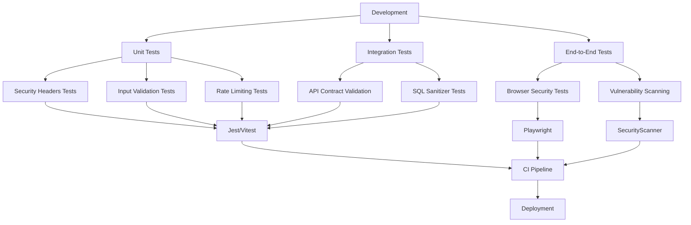

**Diagram sources**

- [security-headers.ts](file://apps/api/src/middleware/security-headers.ts#L0-L381)
- [api-contract.ts](file://apps/api/src/@neonpro/shared/models/api-contract.ts#L0-L506)
- [sql-sanitizer.ts](file://apps/api/src/security/sql-sanitizer.ts#L0-L512)
- [api-rate-limiting.ts](file://packages/shared/src/services/api-rate-limiting.ts#L0-L799)

Unit tests validate individual security components in isolation. The `headers.test.ts` file contains tests verifying that security headers like X-Content-Type-Options, X-Frame-Options, Referrer-Policy, and X-XSS-Protection are properly applied. These tests confirm that the middleware sets expected header values for different response scenarios.

Input validation is tested through API contract validation tests that verify field constraints, required fields, type validation, length limits, pattern matching, and enumeration validation. Tests include both positive cases (valid data) and negative cases (invalid data) to ensure proper error handling.

Rate limiting functionality is validated through tests that simulate multiple requests from the same client, verifying that limits are enforced after the threshold is exceeded. Tests cover different rate limit tiers and emergency bypass scenarios to ensure healthcare-specific requirements are met.

Integration tests verify that security components work together correctly within the request processing pipeline. API contract validation is tested with real request/response cycles to ensure proper integration with business logic. SQL sanitizer tests verify that database operations are properly validated and sanitized before execution.

End-to-end tests use Playwright to simulate real user interactions and verify browser-level security protections. These tests confirm that CSP policies prevent unauthorized script execution, that HSTS redirects HTTP requests to HTTPS, and that security headers are present in all responses.

The CI pipeline runs these tests automatically on every code change, preventing security regressions. Failed security tests block deployment, ensuring only secure code reaches production environments.

**Section sources**

- [security-headers.ts](file://apps/api/src/middleware/security-headers.ts#L0-L381)
- [api-contract.ts](file://apps/api/src/@neonpro/shared/models/api-contract.ts#L0-L506)
- [sql-sanitizer.ts](file://apps/api/src/security/sql-sanitizer.ts#L0-L512)
- [api-rate-limiting.ts](file://packages/shared/src/services/api-rate-limiting.ts#L0-L799)

## Monitoring System Integration

Security controls are integrated with monitoring systems to provide real-time visibility into security events, performance metrics, and potential threats. The platform collects and analyzes security-related data to enable proactive threat detection and response.

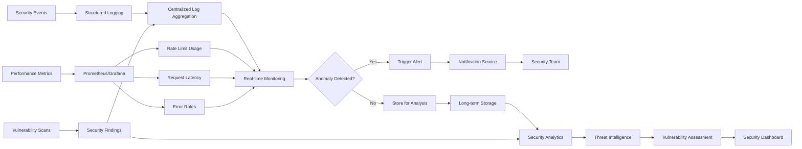

**Diagram sources**

- [security-headers.ts](file://apps/api/src/middleware/security-headers.ts#L0-L381)
- [api-rate-limiting.ts](file://packages/shared/src/services/api-rate-limiting.ts#L0-L799)
- [sql-sanitizer.ts](file://apps/api/src/security/sql-sanitizer.ts#L0-L512)

The system uses structured logging to capture security events with consistent formatting and rich context. All security-related actions, including header application, rate limiting decisions, SQL validation results, and authentication attempts, are logged with timestamps, client information, request details, and outcome status.

Logs are aggregated in a centralized system where they can be queried and analyzed. Real-time monitoring detects anomalies such as sudden spikes in rate limit exceedances, repeated SQL validation errors, or clusters of CSP violations that may indicate coordinated attacks.

Performance metrics are collected for security components, including rate limit usage percentages, request processing latency with and without security checks, and error rates for security-related rejections. These metrics help identify performance bottlenecks and optimize security configurations.

Vulnerability scan results are integrated into the monitoring system, providing a comprehensive view of security posture. Critical findings trigger immediate alerts, while lower-severity issues are tracked for resolution in upcoming sprints.

Security dashboards provide visualizations of key metrics including daily security events, top threat categories, control effectiveness scores, and remediation progress. These dashboards enable security teams to quickly assess the overall security posture and identify areas requiring attention.

The monitoring system also supports forensic analysis by retaining logs for 90 days, enabling investigation of security incidents and compliance audits. Historical data is used to identify trends and improve security controls over time.

**Section sources**

- [security-headers.ts](file://apps/api/src/middleware/security-headers.ts#L0-L381)
- [api-rate-limiting.ts](file://packages/shared/src/services/api-rate-limiting.ts#L0-L799)
- [sql-sanitizer.ts](file://apps/api/src/security/sql-sanitizer.ts#L0-L512)

## Common Issues and Solutions

The platform addresses several common security challenges in healthcare applications, balancing stringent security requirements with usability and performance considerations. These solutions are derived from real-world implementation experience and ongoing security assessments.

One common issue is false positives in security scans, particularly with CSP policies that may block legitimate functionality. The platform addresses this through careful policy tuning and the use of report-only mode during initial implementation. The `handleCSPViolation` method processes violation reports to distinguish between actual threats and false positives, allowing for iterative policy refinement.

Balancing usability with security restrictions presents another challenge, especially for healthcare providers who need rapid access to patient information. The platform implements emergency bypass capabilities for the rate limiting system, allowing critical care operations to proceed even under heavy load. Similarly, the SQL sanitizer allows certain operations on medical data tables while maintaining strict controls on administrative functions.

Responding to identified vulnerabilities requires a structured approach that prioritizes risks based on potential impact to patient safety. The platform uses a risk-based remediation workflow that categorizes vulnerabilities by severity and assigns appropriate response timelines. Critical vulnerabilities receive immediate attention with hotfix deployments, while lower-severity issues follow standard release cycles.

A specific example from the codebase demonstrates how the system handles the tension between security and functionality. The CSP policy for the AI chat interface includes 'unsafe-inline' and 'unsafe-eval' in script-src directives to accommodate React's rendering requirements. While this reduces security, it is necessary for core functionality. The risk is mitigated through additional server-side input validation and output encoding.

Another example involves rate limiting for patient monitoring systems. Rather than applying uniform limits, the system classifies requests by priority, allowing emergency and critical care requests to bypass normal limits. This ensures life-saving interventions are not delayed by security controls while still protecting against denial-of-service attacks.

The platform also addresses the challenge of maintaining security during rapid feature development. By implementing security as reusable middleware components and validation contracts, new features inherit security protections automatically. This reduces the risk of security oversights during development while minimizing the burden on developers.

**Section sources**

- [security-headers.ts](file://apps/api/src/middleware/security-headers.ts#L0-L381)
- [api-rate-limiting.ts](file://packages/shared/src/services/api-rate-limiting.ts#L0-L799)
- [sql-sanitizer.ts](file://apps/api/src/security/sql-sanitizer.ts#L0-L512)

## Customizing Security Policies

The platform provides flexible mechanisms for customizing security policies to meet specific organizational requirements and evolving threat landscapes. Security configurations can be adjusted through code, environment variables, and runtime APIs.

Security headers can be customized by modifying the `SecurityHeadersConfig` passed to the `SecurityHeadersMiddleware`. Organizations can adjust HSTS max-age values, modify CSP directives, or add custom security headers as needed. The `addCustomConfig` method in the `SecurityHeadersService` allows adding entirely new configuration profiles for different endpoint types.

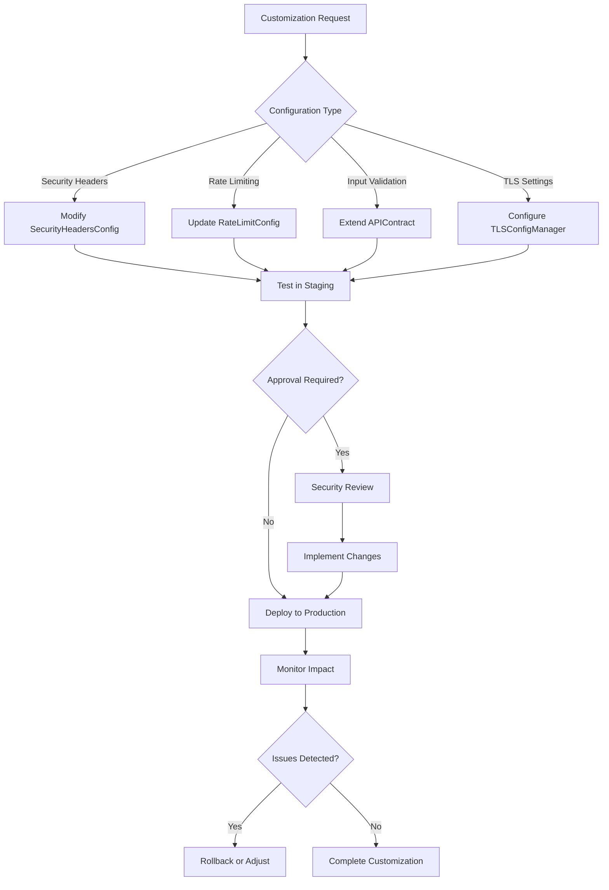

**Diagram sources**

- [security-headers.ts](file://apps/api/src/middleware/security-headers.ts#L0-L381)
- [api-rate-limiting.ts](file://packages/shared/src/services/api-rate-limiting.ts#L0-L799)
- [api-contract.ts](file://apps/api/src/@neonpro/shared/models/api-contract.ts#L0-L506)
- [tls-config.ts](file://apps/api/src/config/tls-config.ts#L0-L311)

Rate limiting policies can be customized by updating the `RateLimitConfig` passed to the `APIRateLimitingService`. Organizations can modify request limits, adjust tier configurations, change rate limiting algorithms, or configure emergency bypass settings. The system supports dynamic configuration updates without requiring server restarts.

Input validation rules can be extended by adding custom validation functions to API contracts. The `ValidationRule` interface allows defining new rules with custom validation logic, error messages, and severity levels. Field constraints can be modified to reflect specific data requirements for different healthcare domains.

TLS/HTTPS settings can be customized through the `TLSConfigManager`, which supports different certificate paths, cipher suite preferences, and security options. Organizations can enforce stricter TLS versions or add additional certificate authorities as needed.

All security customizations follow a controlled change management process that includes testing in staging environments, security review for high-impact changes, and post-deployment monitoring to verify intended behavior. This ensures that security improvements do not inadvertently introduce new vulnerabilities or disrupt critical healthcare operations.

**Section sources**

- [security-headers.ts](file://apps/api/src/middleware/security-headers.ts#L0-L381)
- [api-rate-limiting.ts](file://packages/shared/src/services/api-rate-limiting.ts#L0-L799)
- [api-contract.ts](file://apps/api/src/@neonpro/shared/models/api-contract.ts#L0-L506)
- [tls-config.ts](file://apps/api/src/config/tls-config.ts#L0-L311)

## External Scanner Integration

The platform supports integration with external security scanners to enhance vulnerability detection capabilities and provide independent security assessments. These integrations complement the built-in security controls with additional testing methodologies and threat intelligence.

External scanners can be integrated through API endpoints that expose security configuration and vulnerability data. The `/api/security/csp-reports` endpoint accepts CSP violation reports from browser-based scanners, while other endpoints provide access to rate limiting statistics, SQL validation errors, and security header configurations.

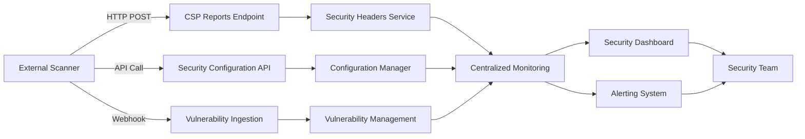

**Diagram sources**

- [security-headers.ts](file://apps/api/src/middleware/security-headers.ts#L0-L381)
- [api-rate-limiting.ts](file://packages/shared/src/services/api-rate-limiting.ts#L0-L799)
- [sql-sanitizer.ts](file://apps/api/src/security/sql-sanitizer.ts#L0-L512)

The integration process begins with authentication and authorization to ensure only approved scanners can submit data. Scanners authenticate using API keys with limited scopes that restrict access to security reporting endpoints only.

Once authenticated, scanners can retrieve current security configurations to understand the protection landscape before testing. This allows them to focus on areas most likely to have vulnerabilities and avoid redundant tests of well-protected components.

Vulnerability findings are submitted through standardized formats that include vulnerability type, severity, affected endpoint, evidence, and recommended remediation steps. The platform normalizes these findings and correlates them with internal security events to provide a comprehensive view of security posture.

Integrated scanners include static application security testing (SAST) tools that analyze source code for vulnerabilities, dynamic application security testing (DAST) tools that test running applications, and software composition analysis (SCA) tools that identify vulnerable dependencies.

The platform also supports penetration testing as a service (PTaaS) providers, allowing organizations to schedule regular external assessments. Test results are automatically ingested and tracked in the vulnerability management system, ensuring timely remediation.

All external scanner integrations follow strict data handling policies to protect sensitive healthcare information. Scanners operate with minimal privileges and are subject to the same security controls as other clients, including rate limiting
