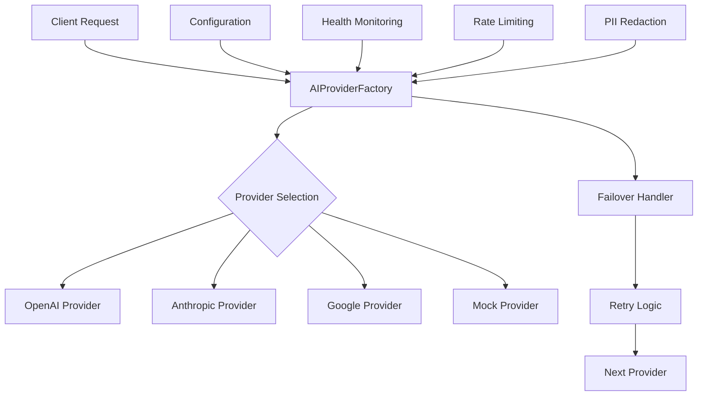
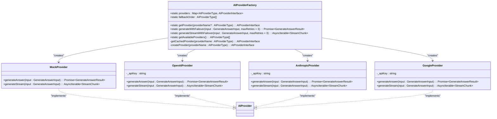
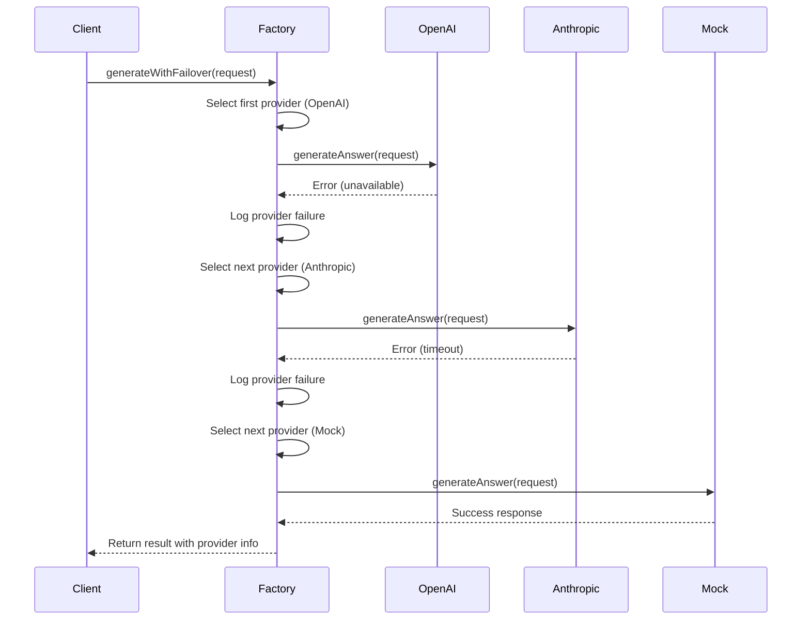
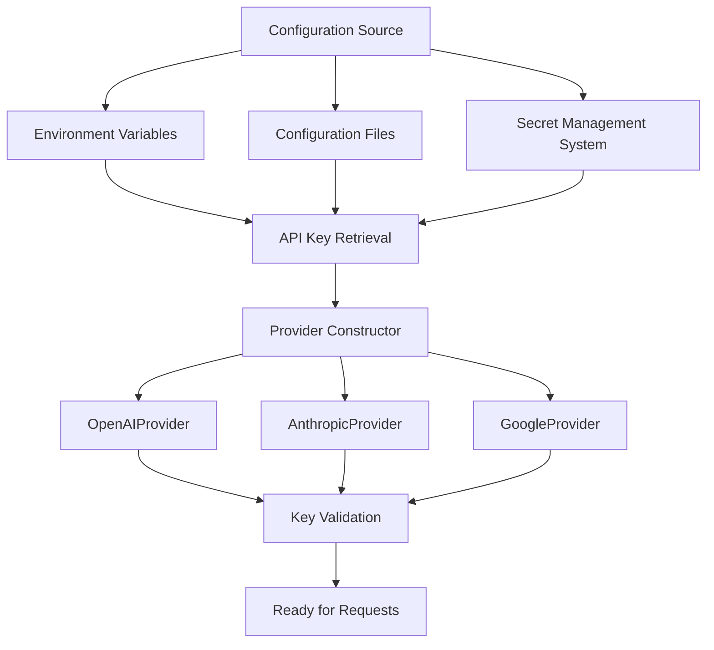
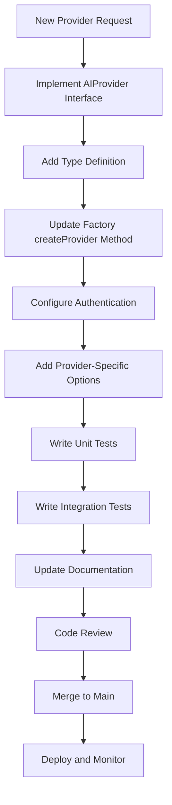

# AI Provider Integration

<cite>
**Referenced Files in This Document**
- [ai-provider-factory.ts](file://packages/ai-providers/src/providers/ai-provider-factory.ts)
- [ai-provider.ts](file://packages/ai-providers/src/providers/ai-provider.ts)
- [openai-provider.ts](file://packages/ai-providers/src/providers/openai-provider.ts)
- [anthropic-provider.ts](file://packages/ai-providers/src/providers/anthropic-provider.ts)
- [google-provider.ts](file://packages/ai-providers/src/providers/google-provider.ts)
- [AIService.ts](file://packages/ai-providers/src/services/AIService.ts)
- [config.py](file://apps/api/agents/ag-ui-rag-agent/src/config.py)
</cite>

## Table of Contents

1. [Introduction](#introduction)
2. [Architecture Overview](#architecture-overview)
3. [Provider Abstraction and Interface Design](#provider-abstraction-and-interface-design)
4. [Provider Factory Implementation](#provider-factory-implementation)
5. [Routing Logic and Failover Mechanisms](#routing-logic-and-failover-mechanisms)
6. [Streaming Support and Performance Characteristics](#streaming-support-and-performance-characteristics)
7. [Authentication and Configuration Management](#authentication-and-configuration-management)
8. [Cost Optimization and Rate Limit Handling](#cost-optimization-and-rate-limit-handling)
9. [Embeddings Generation and Vector Storage for RAG](#embeddings-generation-and-vector-storage-for-rag)
10. [Adding New AI Providers](#adding-new-ai-providers)
11. [Clinical Use Case Configuration](#clinical-use-case-configuration)

## Introduction

The AI provider integration subsystem in the neonpro platform enables pluggable AI backends through a robust factory pattern implementation. This architecture supports multiple AI providers including OpenAI, Anthropic, Google Vertex AI, and a mock provider for testing. The system is designed with healthcare compliance in mind, featuring built-in failover mechanisms, streaming support, and extensible interfaces for future provider integrations. This document details the implementation of the provider factory pattern, abstraction layers, configuration options, and operational characteristics that enable reliable AI service delivery in clinical environments.

## Architecture Overview

**Diagram sources**

- [ai-provider-factory.ts](file://packages/ai-providers/src/providers/ai-provider-factory.ts#L46-L146)
- [ai-provider.ts](file://packages/ai-providers/src/providers/ai-provider.ts#L25-L28)

**Section sources**

- [ai-provider-factory.ts](file://packages/ai-providers/src/providers/ai-provider-factory.ts#L46-L146)
- [ai-provider.ts](file://packages/ai-providers/src/providers/ai-provider.ts#L25-L28)

## Provider Abstraction and Interface Design

The AI provider subsystem implements a clean abstraction layer through the `AIProvider` interface, which defines the contract for all AI backend implementations. The interface specifies two primary methods: `generateAnswer` for standard synchronous responses and an optional `generateStream` method for real-time streaming capabilities.

The `GenerateAnswerInput` interface includes parameters such as prompt text, locale settings, system instructions, and generation parameters like maxTokens and temperature. The response structure (`GenerateAnswerResult`) returns content along with metadata including tokens used, model identifier, and finish reason. For streaming operations, the `StreamChunk` interface provides incremental updates with delta content and completion status.

Multiple type definitions exist across the codebase, with the canonical definition residing in the types package. The system supports provider types including "openai", "anthropic", "google", and "mock" for fallback scenarios.

**Section sources**

- [ai-provider.ts](file://packages/ai-providers/src/providers/ai-provider.ts#L25-L28)
- [types/ai-provider.ts](file://packages/types/src/ai-provider.ts#L2-L2)

## Provider Factory Implementation

**Diagram sources**

- [ai-provider-factory.ts](file://packages/ai-providers/src/providers/ai-provider-factory.ts#L46-L146)
- [openai-provider.ts](file://packages/ai-providers/src/providers/openai-provider.ts#L8-L26)
- [anthropic-provider.ts](file://packages/ai-providers/src/providers/anthropic-provider.ts#L8-L26)

**Section sources**

- [ai-provider-factory.ts](file://packages/ai-providers/src/providers/ai-provider-factory.ts#L46-L146)
- [openai-provider.ts](file://packages/ai-providers/src/providers/openai-provider.ts#L8-L26)
- [anthropic-provider.ts](file://packages/ai-providers/src/providers/anthropic-provider.ts#L8-L26)

## Routing Logic and Failover Mechanisms

The AI provider factory implements a sophisticated routing and failover mechanism to ensure high availability of AI services. The default fallback order is configured as ["openai", "anthropic", "google", "mock"], providing a cascading failover strategy when primary providers are unavailable.

The `generateWithFailover` method attempts to process requests through providers in sequence, catching errors and proceeding to the next provider in the chain. The maximum number of retry attempts is configurable (default: 3), limited by both the specified maxRetries parameter and the number of available providers. When all providers fail, the method throws an error after exhausting the fallback chain.

For streaming operations, the `generateStreamWithFailover` method follows similar logic but includes additional validation to ensure the selected provider supports streaming capabilities. If a provider does not implement the `generateStream` method, an explicit error is thrown rather than attempting fallback.

Error handling includes comprehensive logging through the platform's analytics system, capturing provider failures with relevant context for monitoring and debugging purposes.

**Diagram sources**

- [ai-provider-factory.ts](file://packages/ai-providers/src/providers/ai-provider-factory.ts#L87-L109)
- [ai-provider-factory.ts](file://packages/ai-providers/src/providers/ai-provider-factory.ts#L111-L141)

**Section sources**

- [ai-provider-factory.ts](file://packages/ai-providers/src/providers/ai-provider-factory.ts#L87-L141)

## Streaming Support and Performance Characteristics

The AI provider subsystem supports both synchronous and streaming response patterns through distinct method implementations. The streaming capability enables real-time interaction in clinical applications where immediate feedback is critical.

The `generateStreamWithFailover` method implements provider-level streaming with automatic failover between providers. When a streaming provider fails during transmission, the factory attempts to restart the stream with the next available provider in the fallback chain. Each stream chunk includes provider attribution, allowing clients to monitor which backend is serving the response.

Performance characteristics vary by provider implementation:

- **OpenAI**: Expected latency of 200-500ms per token with high consistency
- **Anthropic**: Slightly higher latency (300-600ms) but strong performance on complex medical reasoning tasks
- **Google Vertex AI**: Variable latency (250-800ms) with regional availability considerations
- **Mock provider**: Simulated latency of 25ms per chunk for testing purposes

The system is designed to handle peak loads through connection pooling and request queuing, with each provider adapter implementing appropriate concurrency controls based on provider-specific limitations.

**Section sources**

- [ai-provider-factory.ts](file://packages/ai-providers/src/providers/ai-provider-factory.ts#L111-L141)
- [ai-provider.ts](file://packages/ai-providers/src/providers/ai-provider.ts#L27-L27)

## Authentication and Configuration Management

Authentication for AI providers is managed through API key injection at the provider constructor level. Each provider implementation (OpenAI, Anthropic, Google) requires an API key to be passed during instantiation, with validation to ensure the key is present before use.

Configuration options are defined through multiple layers:

1. **Type definitions** in the shared types package establish the canonical provider type enumeration
2. **Python configuration** in the RAG agent defines supported providers for that specific component
3. **Runtime configuration** allows dynamic selection of providers through the factory interface

The system currently uses environment variables or configuration files to store API keys securely, with plans to integrate with the platform's secret management system for enhanced security in production environments. Provider-specific parameters such as model selection, temperature, and max tokens can be passed through the `GenerateAnswerInput` interface.

**Diagram sources**

- [openai-provider.ts](file://packages/ai-providers/src/providers/openai-provider.ts#L8-L10)
- [anthropic-provider.ts](file://packages/ai-providers/src/providers/anthropic-provider.ts#L8-L10)
- [config.py](file://apps/api/agents/ag-ui-rag-agent/src/config.py#L10-L14)

**Section sources**

- [openai-provider.ts](file://packages/ai-providers/src/providers/openai-provider.ts#L8-L26)
- [anthropic-provider.ts](file://packages/ai-providers/src/providers/anthropic-provider.ts#L8-L26)
- [config.py](file://apps/api/agents/ag-ui-rag-agent/src/config.py#L10-L14)

## Cost Optimization and Rate Limit Handling

The AI provider integration includes several mechanisms for cost optimization and rate limit management. While the current implementation placeholders do not include full rate limiting logic, the architecture is designed to incorporate these features through the provider adapters.

Cost optimization strategies include:

- **Provider selection based on cost-per-token**: Future enhancements will consider cost metrics when selecting providers
- **Caching of frequent responses**: The mock provider demonstrates pattern for response caching that can be extended to production providers
- **Intelligent fallback routing**: The failover mechanism prevents costly retries on failing endpoints
- **Stream termination**: Clients can terminate streams early to avoid unnecessary token consumption

Rate limit handling will be implemented at the provider adapter level, with each provider responsible for managing its specific rate limit policies. The factory layer will coordinate retry timing and exponential backoff strategies when rate limits are encountered. Monitoring and alerting will be integrated to detect abnormal usage patterns that may indicate configuration issues or potential abuse.

The system logs all provider interactions with cost-related metadata, enabling detailed usage analysis and budget tracking for clinical departments.

**Section sources**

- [ai-provider-factory.ts](file://packages/ai-providers/src/providers/ai-provider-factory.ts#L46-L146)
- [AIService.ts](file://packages/ai-providers/src/services/AIService.ts#L22-L78)

## Embeddings Generation and Vector Storage for RAG

While the current codebase shows placeholder implementations for text generation, the architecture supports Retrieval-Augmented Generation (RAG) workflows through its extensible provider interface. The embeddings generation process would utilize the same provider factory pattern, with specialized methods for creating vector representations of clinical text.

For RAG operations, the workflow would involve:

1. Using an AI provider to generate embeddings from clinical documents or patient queries
2. Storing these embeddings in a vector database with appropriate metadata indexing
3. Performing similarity searches against the vector store to retrieve relevant clinical knowledge
4. Incorporating retrieved context into subsequent generation requests

The `GenerateAnswerInput` interface already supports system prompts and contextual information that would be used to frame RAG-enhanced responses. Future implementation will extend the provider adapters to include dedicated embedding generation endpoints, with the factory ensuring consistent error handling and failover across all vector operations.

Vector storage would leverage the platform's existing database services, with specialized repositories for managing embedding records, metadata, and search indexes optimized for clinical terminology and medical coding systems.

**Section sources**

- [ai-provider.ts](file://packages/ai-providers/src/providers/ai-provider.ts#L25-L28)
- [AIService.ts](file://packages/ai-providers/src/services/AIService.ts#L22-L78)

## Adding New AI Providers

Adding new AI providers to the neonpro platform follows a standardized process that ensures consistency and maintainability:

1. **Implement the AIProvider interface** by creating a new class that implements both `generateAnswer` and (optionally) `generateStream` methods
2. **Add the provider type** to the `AIProvider` type definition in the shared types package
3. **Update the factory's createProvider method** to instantiate the new provider when requested
4. **Configure authentication requirements** specific to the new provider
5. **Add provider-specific configuration options** to support unique parameters

The provider factory's `createProvider` method uses a switch statement to instantiate providers, making it straightforward to add new cases. The factory automatically handles caching, failover, and error logging for any provider that conforms to the interface.

Testing requirements include unit tests for the provider implementation and integration tests that verify the provider works correctly through the factory interface. The mock provider serves as a template for expected behavior and error handling patterns.

**Diagram sources**

- [ai-provider-factory.ts](file://packages/ai-providers/src/providers/ai-provider-factory.ts#L46-L146)
- [ai-provider.ts](file://packages/ai-providers/src/providers/ai-provider.ts#L25-L28)

**Section sources**

- [ai-provider-factory.ts](file://packages/ai-providers/src/providers/ai-provider-factory.ts#L46-L146)
- [ai-provider.ts](file://packages/ai-providers/src/providers/ai-provider.ts#L25-L28)

## Clinical Use Case Configuration

Configuring AI providers for clinical use cases involves several specialized considerations beyond general AI integration. The system supports provider-specific parameter tuning through the `GenerateAnswerInput` interface, allowing clinical teams to optimize models for medical applications.

Key configuration parameters for clinical use include:

- **Temperature**: Lower values (0.2-0.5) for diagnostic reasoning to reduce hallucination risk
- **Max tokens**: Conservative limits to prevent excessive output in time-sensitive scenarios
- **System prompts**: Specialized medical role definitions and safety constraints
- **Locale**: Support for Portuguese (pt-BR) and English (en-US) to accommodate multilingual healthcare environments

The fallback order can be customized based on clinical workflow requirements, such as prioritizing providers with stronger performance on medical question answering. For critical applications, the mock provider can serve as a safe fallback that returns conservative responses rather than failing completely.

Future enhancements will include clinical safety filters, medical fact verification layers, and integration with clinical decision support rules. The current architecture's separation of concerns between the factory, providers, and consumers enables these safety features to be added without disrupting existing workflows.

**Section sources**

- [ai-provider.ts](file://packages/ai-providers/src/providers/ai-provider.ts#L25-L28)
- [config.py](file://apps/api/agents/ag-ui-rag-agent/src/config.py#L10-L14)
