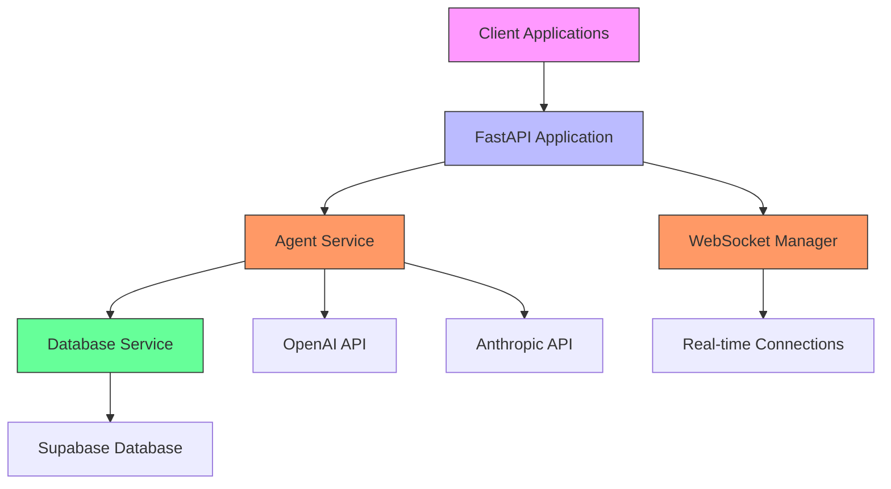
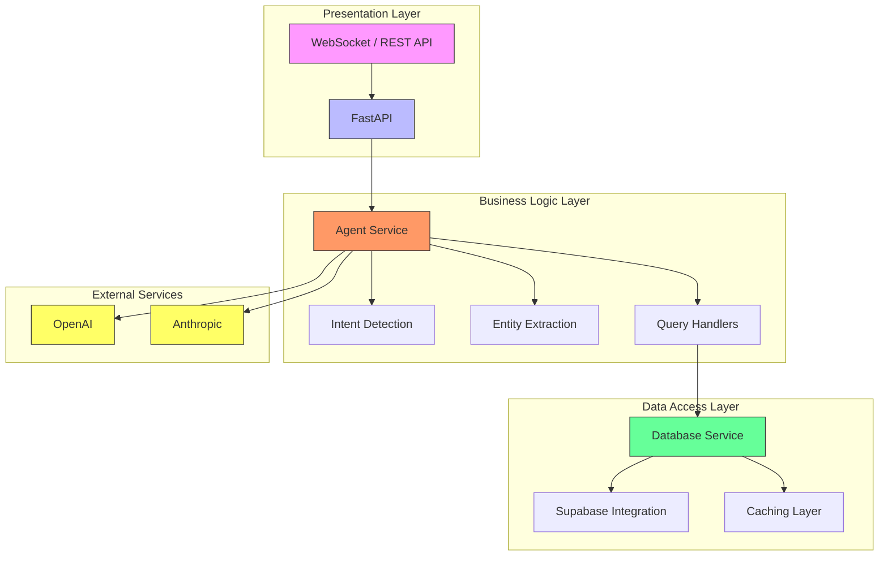
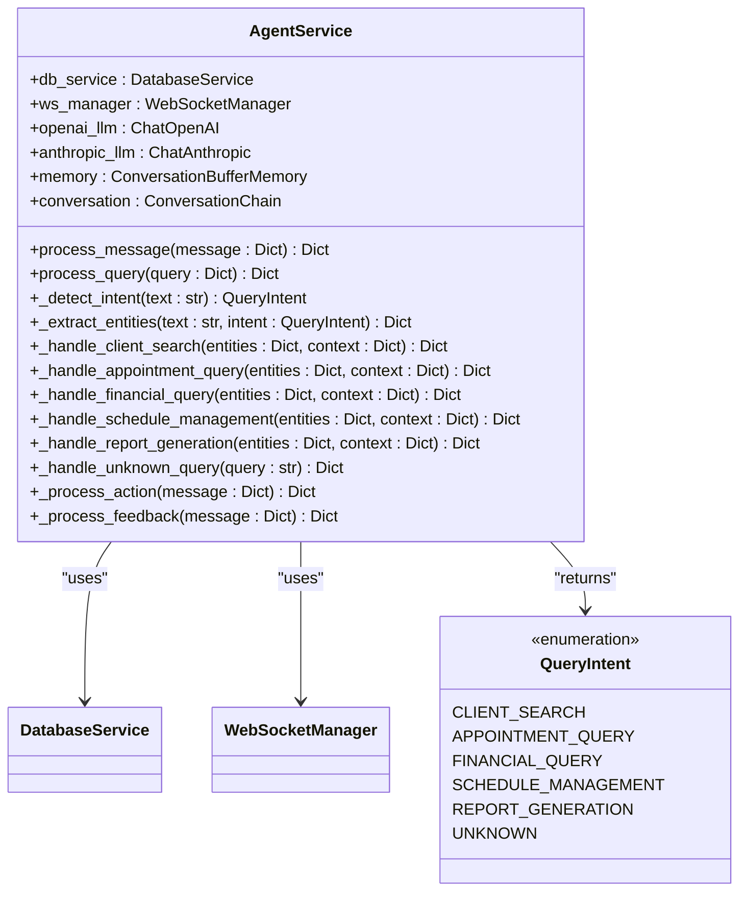
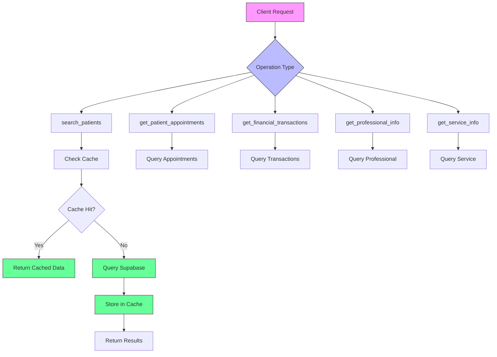
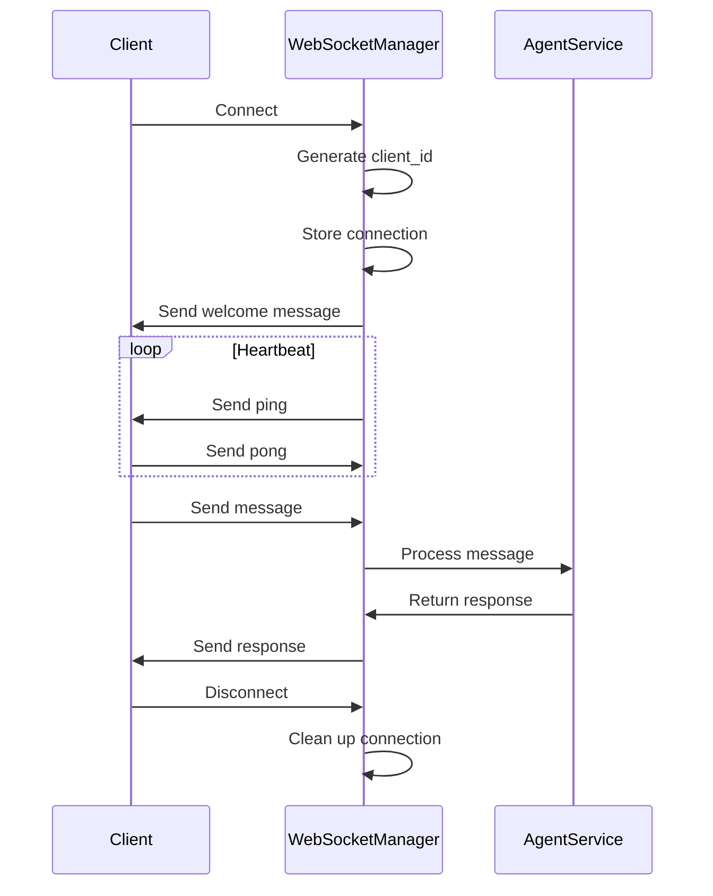
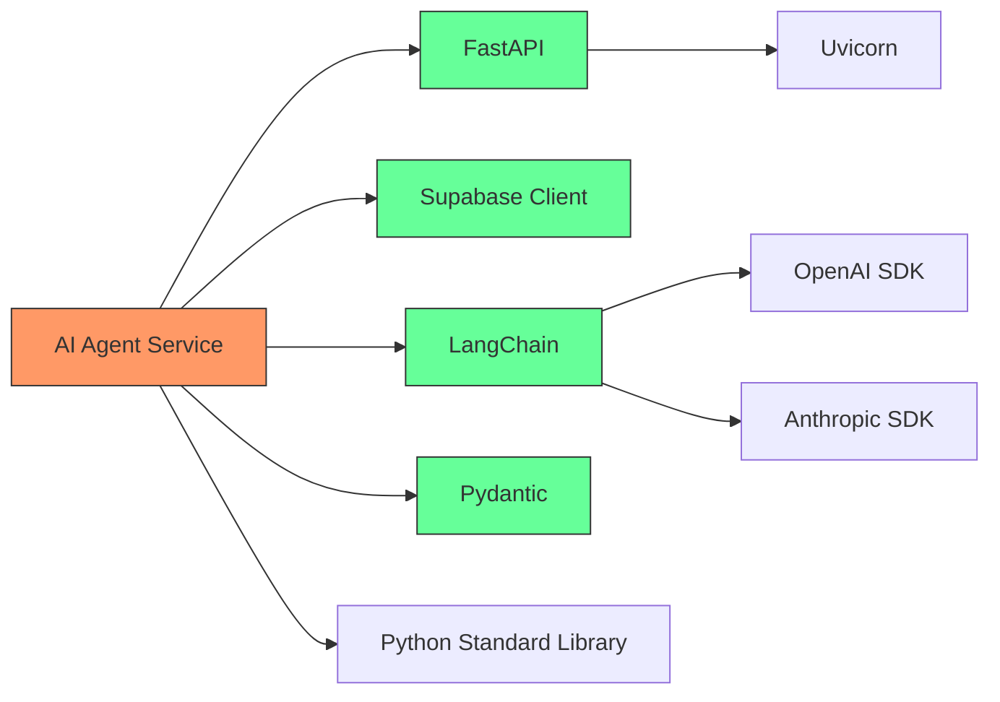

# AI Services

<cite>
**Referenced Files in This Document**   
- [main.py](file://apps/ai-agent/main.py)
- [config.py](file://apps/ai-agent/config.py)
- [agent_service.py](file://apps/ai-agent/services/agent_service.py)
- [database_service.py](file://apps/ai-agent/services/database_service.py)
- [websocket_manager.py](file://apps/ai-agent/services/websocket_manager.py)
- [agui_protocol.py](file://apps/api/agents/ag-ui-rag-agent/agui_protocol.py)
</cite>

## Table of Contents
1. [Introduction](#introduction)
2. [Project Structure](#project-structure)
3. [Core Components](#core-components)
4. [Architecture Overview](#architecture-overview)
5. [Detailed Component Analysis](#detailed-component-analysis)
6. [Dependency Analysis](#dependency-analysis)
7. [Performance Considerations](#performance-considerations)
8. [Troubleshooting Guide](#troubleshooting-guide)
9. [Conclusion](#conclusion)

## Introduction
The NeonPro AI Agent Services provide a real-time, AI-powered healthcare data assistant system built on FastAPI and WebSocket protocols. The architecture is designed to handle conversational queries about patients, appointments, and financial data through both WebSocket and REST interfaces. The system integrates with Supabase for database operations and leverages multiple AI providers (OpenAI and Anthropic) for natural language processing. Built with Brazilian healthcare compliance (LGPD) in mind, the service includes audit logging, data encryption, and role-based access control. The AG-UI protocol enables rich, structured interactions between the frontend and AI agent with support for actions, navigation, and accessibility features.

## Project Structure
The AI agent services are organized within the `apps/ai-agent` directory with a clear separation of concerns. The main application entry point (`main.py`) initializes the FastAPI application and manages service lifecycles. Core business logic is encapsulated in the `services` directory with three primary components: `agent_service.py` for AI processing and intent handling, `database_service.py` for Supabase interactions, and `websocket_manager.py` for real-time connection management. Configuration is centralized in `config.py` using Pydantic settings, while environment-specific variables are managed through `.env` files. The service follows a microservices-by-domain pattern, focusing specifically on healthcare data retrieval and analysis.

**Diagram sources**
- [main.py](file://apps/ai-agent/main.py#L1-L180)
- [agent_service.py](file://apps/ai-agent/services/agent_service.py#L1-L480)
- [database_service.py](file://apps/ai-agent/services/database_service.py#L1-L284)
- [websocket_manager.py](file://apps/ai-agent/services/websocket_manager.py#L1-L230)

**Section sources**
- [main.py](file://apps/ai-agent/main.py#L1-L180)
- [config.py](file://apps/ai-agent/config.py#L1-L90)

## Core Components
The AI agent system comprises three core services that work together to process user queries and deliver responses. The AgentService orchestrates the overall workflow, handling intent detection, entity extraction, and routing to appropriate handlers based on query type. It maintains conversation memory and interfaces with external AI models for natural language understanding. The DatabaseService provides a caching layer over Supabase operations, optimizing repeated queries while ensuring LGPD compliance through proper consent checks. The WebSocketManager handles real-time connections, managing client sessions, sending periodic pings, and broadcasting messages. These components are initialized during application startup and maintain their state throughout the service lifecycle, enabling efficient processing of concurrent requests.

**Section sources**
- [agent_service.py](file://apps/ai-agent/services/agent_service.py#L1-L480)
- [database_service.py](file://apps/ai-agent/services/database_service.py#L1-L284)
- [websocket_manager.py](file://apps/ai-agent/services/websocket_manager.py#L1-L230)

## Architecture Overview
The AI agent system follows a layered architecture with clear separation between presentation, business logic, and data access layers. At the presentation layer, FastAPI exposes both WebSocket and REST endpoints for client interaction. The business logic layer contains the AgentService which processes user intents and coordinates between different system components. Below this, the data access layer abstracts database operations through the DatabaseService. The system employs event-driven communication patterns, particularly through WebSocket connections where clients can receive real-time updates. Protocol-specific handlers manage the AG-UI protocol requirements including message formatting, encryption, and session management. External AI providers are integrated as pluggable components, allowing flexibility in model selection while maintaining consistent interfaces.

**Diagram sources**
- [main.py](file://apps/ai-agent/main.py#L1-L180)
- [agent_service.py](file://apps/ai-agent/services/agent_service.py#L1-L480)
- [database_service.py](file://apps/ai-agent/services/database_service.py#L1-L284)

## Detailed Component Analysis

### Agent Service Analysis
The AgentService is the central component responsible for processing user queries and generating appropriate responses. It implements a rule-based intent detection system that categorizes incoming queries into specific domains such as client search, appointment queries, and financial data access. For each detected intent, specialized handler methods extract relevant entities and formulate database queries through the DatabaseService. The service maintains conversation context using LangChain's ConversationBufferMemory, allowing for coherent multi-turn interactions. When queries don't match predefined intents, a fallback conversation chain using OpenAI's GPT-4 model provides general responses. The service also handles action requests like data exports and navigation commands, demonstrating its role as an orchestration layer between user requests and system capabilities.

**Diagram sources**
- [agent_service.py](file://apps/ai-agent/services/agent_service.py#L35-L480)

**Section sources**
- [agent_service.py](file://apps/ai-agent/services/agent_service.py#L1-L480)

### Database Service Analysis
The DatabaseService provides a dedicated interface for accessing healthcare data stored in Supabase. It implements a caching mechanism to improve performance for frequently accessed data, with a configurable TTL of 300 seconds. The service exposes methods for searching patients by name, retrieving patient appointments, fetching financial transactions, and obtaining related information about professionals and services. Each method applies appropriate filters based on context, such as clinic ID, to ensure data isolation between different healthcare providers. The service also includes functionality for LGPD compliance, including audit logging of data access and checking patient consent status. Error handling is implemented consistently across all methods, with detailed logging to support troubleshooting while maintaining system stability.

**Diagram sources**
- [database_service.py](file://apps/ai-agent/services/database_service.py#L14-L284)

**Section sources**
- [database_service.py](file://apps/ai-agent/services/database_service.py#L1-L284)

### WebSocket Manager Analysis
The WebSocketManager handles real-time bidirectional communication between the AI agent and client applications. It maintains a registry of active connections with associated metadata including connection time, IP address, and user agent. The manager enforces connection limits to prevent resource exhaustion and implements a ping-pong mechanism to detect and clean up stale connections. For each connected client, it assigns a unique client ID and tracks last activity to support connection statistics. The manager provides methods for sending messages to individual clients, broadcasting to all connections, and handling various message types including subscriptions and unsubscriptions. During shutdown, it gracefully closes all active connections to ensure proper cleanup. The implementation includes comprehensive error handling to maintain stability even when individual client connections fail unexpectedly.

**Diagram sources**
- [websocket_manager.py](file://apps/ai-agent/services/websocket_manager.py#L14-L230)

**Section sources**
- [websocket_manager.py](file://apps/ai-agent/services/websocket_manager.py#L1-L230)

## Dependency Analysis
The AI agent service has well-defined dependencies managed through Python's packaging system. The core framework dependency is FastAPI, which provides the web server capabilities and WebSocket support. Database interactions are handled through the Supabase Python client, while AI functionality relies on LangChain integrations for OpenAI and Anthropic. Configuration management uses Pydantic settings, providing environment variable validation and type safety. The service also depends on standard libraries for logging, asynchronous operations, and regular expression matching. All external dependencies are specified in `requirements.txt`, with test dependencies separated in `requirements-test.txt`. The architecture minimizes direct dependencies between internal components, promoting loose coupling and easier maintenance. Circular dependencies are avoided through careful interface design and dependency injection during service initialization.

**Diagram sources**
- [main.py](file://apps/ai-agent/main.py#L1-L180)
- [requirements.txt](file://apps/ai-agent/requirements.txt)

**Section sources**
- [main.py](file://apps/ai-agent/main.py#L1-L180)
- [config.py](file://apps/ai-agent/config.py#L1-L90)

## Performance Considerations
The AI agent system incorporates several performance optimizations to ensure responsive interactions. The DatabaseService implements caching with a 5-minute TTL for frequently accessed data, reducing database load and improving response times for repeated queries. Connection pooling is implicitly handled by the Supabase client, maximizing database efficiency. The WebSocketManager uses asyncio for non-blocking I/O operations, allowing thousands of concurrent connections with minimal overhead. Message processing is designed to be lightweight, with intent detection using simple string matching rather than computationally expensive NLP models. The system monitors connection statistics and can be configured to limit maximum connections to prevent resource exhaustion. For AI operations, the service uses temperature=0.1 to reduce variability and improve response consistency, balancing quality with predictability.

## Troubleshooting Guide
Common issues with the AI agent service typically fall into connectivity, authentication, or data access categories. For WebSocket connection problems, verify that the client is connecting to the correct endpoint (`/ws/agent`) and that CORS settings in `config.py` include the client origin. Authentication failures may occur if required environment variables (SUPABASE_URL, SUPABASE_SERVICE_ROLE_KEY, OPENAI_API_KEY) are not properly set. Database query issues should be checked against the Supabase schema and proper table permissions. When debugging, enable DEBUG mode in configuration to get more detailed logs, and use the health check endpoint (`/health`) to verify service status. For AI model issues, confirm API keys are valid and check rate limits with the respective providers. Memory leaks can be monitored through connection count metrics exposed by the WebSocketManager.

**Section sources**
- [main.py](file://apps/ai-agent/main.py#L1-L180)
- [agent_service.py](file://apps/ai-agent/services/agent_service.py#L1-L480)
- [database_service.py](file://apps/ai-agent/services/database_service.py#L1-L284)

## Conclusion
The NeonPro AI agent services provide a robust foundation for real-time healthcare data assistance through natural language interfaces. The architecture effectively combines FastAPI's capabilities with WebSocket-based real-time communication, creating a responsive system for conversational data retrieval. By separating concerns into distinct services—agent processing, database access, and connection management—the system achieves maintainability and scalability. The integration of multiple AI providers offers flexibility in natural language processing approaches, while the focus on Brazilian healthcare compliance ensures regulatory adherence. Future enhancements could include implementing the planned schedule management and report generation features, adding support for additional AI models, and enhancing the caching strategy for better performance at scale.