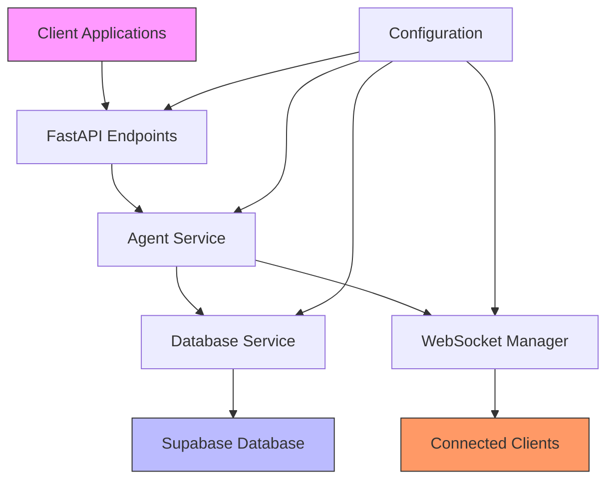
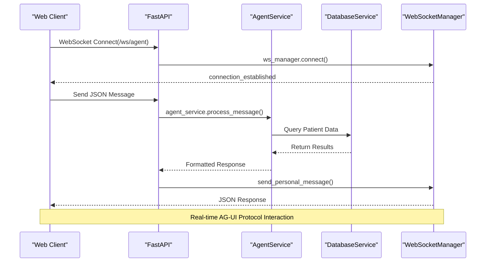
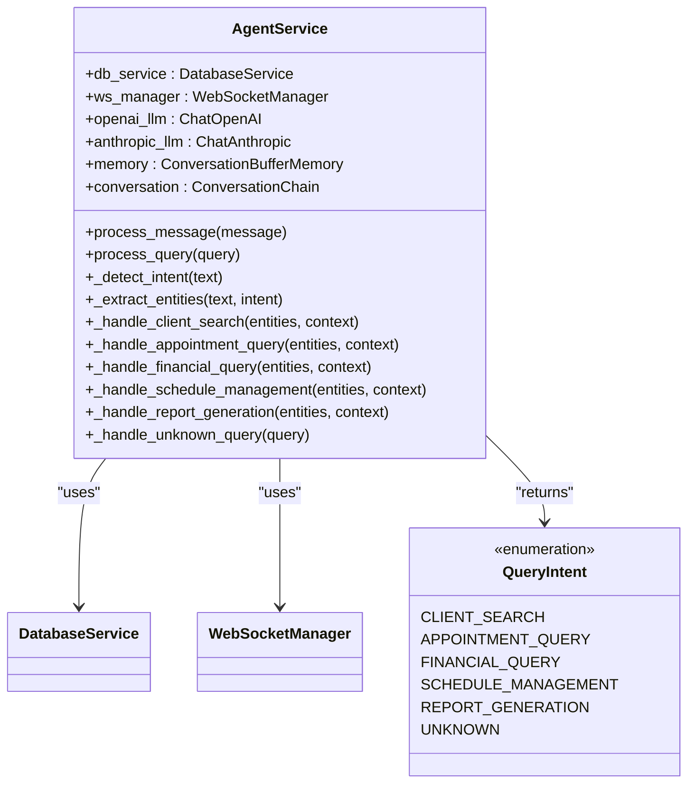
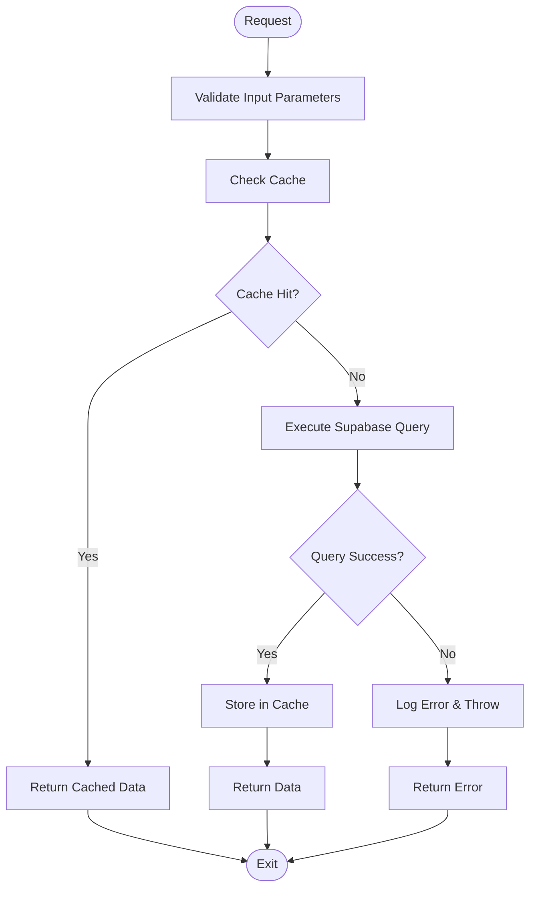
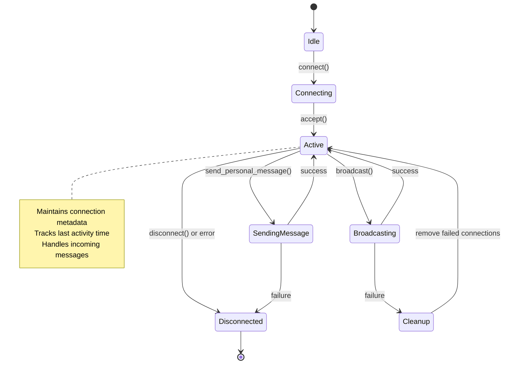
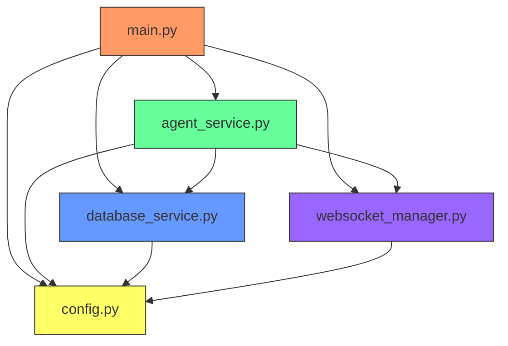

# Agent Architecture

<cite>
**Referenced Files in This Document**
- [main.py](file://apps/ai-agent/main.py)
- [agent_service.py](file://apps/ai-agent/services/agent_service.py)
- [database_service.py](file://apps/ai-agent/services/database_service.py)
- [websocket_manager.py](file://apps/ai-agent/services/websocket_manager.py)
- [config.py](file://apps/ai-agent/config.py)
</cite>

## Table of Contents

1. [Introduction](#introduction)
2. [Project Structure](#project-structure)
3. [Core Components](#core-components)
4. [Architecture Overview](#architecture-overview)
5. [Detailed Component Analysis](#detailed-component-analysis)
6. [Dependency Analysis](#dependency-analysis)
7. [Performance Considerations](#performance-considerations)
8. [Troubleshooting Guide](#troubleshooting-guide)
9. [Conclusion](#conclusion)

## Introduction

The AI agent architecture in the neonpro platform is a FastAPI-based microservice designed to facilitate intelligent interactions within a healthcare context. This service leverages advanced AI models and integrates with Supabase for data persistence, providing capabilities such as patient search, appointment queries, financial data access, and more. The system supports both WebSocket and REST API communication patterns, enabling real-time interaction through the AG-UI protocol while maintaining compatibility with traditional HTTP endpoints.

Built on Python 3.10+ and utilizing modern asynchronous programming paradigms, the agent service follows a modular design with clear separation of concerns across service layers. It incorporates robust configuration management, dependency injection, and state handling mechanisms to ensure reliability and scalability in production environments. Special attention has been given to Brazilian healthcare compliance standards including LGPD, ANVISA, and CFM regulations, ensuring secure and compliant handling of sensitive medical data.

## Project Structure

The AI agent service resides under the `apps/ai-agent` directory and follows a clean, modular structure that separates concerns into distinct components:

```
apps/
└── ai-agent/
    ├── services/
    │   ├── agent_service.py        # Core business logic
    │   ├── database_service.py     # Data persistence layer
    │   └── websocket_manager.py    # Real-time connection handling
    ├── config.py                   # Configuration settings
    ├── main.py                     # Application entry point
    ├── requirements.txt            # Python dependencies
    └── Dockerfile                  # Containerization definition
```

This organization enables independent development and testing of each component while maintaining loose coupling between layers. The service layer abstraction allows for easy extension and maintenance, with each service responsible for a specific domain of functionality.



**Diagram sources**

- [main.py](file://apps/ai-agent/main.py#L1-L180)
- [agent_service.py](file://apps/ai-agent/services/agent_service.py#L1-L480)
- [database_service.py](file://apps/ai-agent/services/database_service.py#L1-L284)
- [websocket_manager.py](file://apps/ai-agent/services/websocket_manager.py#L1-L230)
- [config.py](file://apps/ai-agent/config.py#L1-L90)

**Section sources**

- [main.py](file://apps/ai-agent/main.py#L1-L180)
- [config.py](file://apps/ai-agent/config.py#L1-L90)

## Core Components

The AI agent architecture consists of four primary components working in concert: the main application entry point (`main.py`), the agent service for business logic processing, the database service for data persistence operations, and the configuration system that governs runtime behavior. These components are orchestrated through dependency injection at startup, creating a cohesive system where each part can operate independently yet collaboratively.

The agent service acts as the central orchestrator, receiving input from both WebSocket and REST endpoints, determining intent, extracting relevant entities, and coordinating with the database service to retrieve or update information. State management is handled through conversation memory and WebSocket session tracking, allowing for contextual interactions across multiple turns. The system is designed with fault tolerance in mind, incorporating retry mechanisms, error logging, and graceful degradation when external services are unavailable.

**Section sources**

- [main.py](file://apps/ai-agent/main.py#L1-L180)
- [agent_service.py](file://apps/ai-agent/services/agent_service.py#L1-L480)
- [database_service.py](file://apps/ai-agent/services/database_service.py#L1-L284)
- [websocket_manager.py](file://apps/ai-agent/services/websocket_manager.py#L1-L230)

## Architecture Overview

The AI agent service implements a layered microservices architecture built on FastAPI, featuring a clear separation between presentation, business logic, and data access layers. At startup, the application initializes all required services through a lifespan context manager, establishing connections to external systems before accepting traffic.

Requests enter the system through two primary channels: WebSocket connections for real-time interactive sessions using the AG-UI protocol, and REST API endpoints for synchronous query operations. Both pathways converge on the agent service, which processes natural language input, determines user intent, extracts relevant entities, and executes appropriate actions based on detected intent. Responses are formatted according to the AG-UI message specification and returned either through the established WebSocket connection or as JSON responses for REST calls.



**Diagram sources**

- [main.py](file://apps/ai-agent/main.py#L1-L180)
- [agent_service.py](file://apps/ai-agent/services/agent_service.py#L1-L480)
- [database_service.py](file://apps/ai-agent/services/database_service.py#L1-L284)
- [websocket_manager.py](file://apps/ai-agent/services/websocket_manager.py#L1-L230)

## Detailed Component Analysis

### Agent Service Analysis

The `AgentService` class serves as the core business logic processor, implementing intent detection, entity extraction, and action routing based on user input. It maintains conversation state using LangChain's `ConversationBufferMemory`, allowing it to provide contextually relevant responses across multiple interactions. The service supports multiple AI backends (OpenAI and Anthropic) with configurable API keys, enabling flexibility in model selection based on performance, cost, or regulatory requirements.

Intent classification is performed through keyword matching in Portuguese, identifying whether a query relates to client search, appointment management, financial data, schedule changes, or report generation. Once intent is determined, the service extracts relevant entities such as patient names, CPF numbers, dates, and contextual parameters before delegating to specialized handler methods for execution.



**Diagram sources**

- [agent_service.py](file://apps/ai-agent/services/agent_service.py#L1-L480)

**Section sources**

- [agent_service.py](file://apps/ai-agent/services/agent_service.py#L1-L480)

### Database Service Analysis

The `DatabaseService` provides an abstraction layer over Supabase, offering typed methods for querying healthcare data while implementing caching for improved performance. It handles connections to the PostgreSQL database via the Supabase client, executing queries against tables such as patients, appointments, and financial transactions. Each method includes comprehensive error handling and logging to support observability and debugging.

Caching is implemented with a time-to-live (TTL) mechanism, storing frequently accessed data like patient records for up to five minutes to reduce database load and improve response times. The service also includes specialized methods for compliance-related operations such as LGPD consent verification and audit log creation, ensuring regulatory requirements are met during normal operation.



**Diagram sources**

- [database_service.py](file://apps/ai-agent/services/database_service.py#L1-L284)

**Section sources**

- [database_service.py](file://apps/ai-agent/services/database_service.py#L1-L284)

### WebSocket Manager Analysis

The `WebSocketManager` class manages real-time bidirectional communication between clients and the AI agent, handling connection lifecycle events, message routing, and connection health monitoring. It maintains a registry of active connections with associated metadata including connection time, IP address, and user agent information. To prevent resource exhaustion, the manager enforces a maximum connection limit configurable through environment variables.

A background ping task runs periodically to detect stale connections, broadcasting ping messages to all connected clients at configurable intervals. Upon receiving a pong response, the connection is considered healthy; otherwise, it will be automatically cleaned up after timeout. The manager also supports subscription-based event delivery, allowing clients to register interest in specific event types for push notifications.



**Diagram sources**

- [websocket_manager.py](file://apps/ai-agent/services/websocket_manager.py#L1-L230)

**Section sources**

- [websocket_manager.py](file://apps/ai-agent/services/websocket_manager.py#L1-L230)

## Dependency Analysis

The AI agent service exhibits a well-defined dependency graph with minimal circular references, promoting maintainability and testability. The main application (`main.py`) depends on all service modules and configuration, initializing them during startup. The `AgentService` depends on both `DatabaseService` and `WebSocketManager`, but neither of these services depend back on the agent, preventing tight coupling.

External dependencies include FastAPI for web framework functionality, LangChain for AI integration, and Supabase for database access. These are managed through standard Python packaging in `requirements.txt`. Configuration values are injected rather than hard-coded, allowing different environments (development, staging, production) to use appropriate settings without code changes.



**Diagram sources**

- [main.py](file://apps/ai-agent/main.py#L1-L180)
- [agent_service.py](file://apps/ai-agent/services/agent_service.py#L1-L480)
- [database_service.py](file://apps/ai-agent/services/database_service.py#L1-L284)
- [websocket_manager.py](file://apps/ai-agent/services/websocket_manager.py#L1-L230)
- [config.py](file://apps/ai-agent/config.py#L1-L90)

**Section sources**

- [main.py](file://apps/ai-agent/main.py#L1-L180)
- [agent_service.py](file://apps/ai-agent/services/agent_service.py#L1-L480)

## Performance Considerations

The AI agent architecture incorporates several performance optimizations to handle expected workloads efficiently. Database query results are cached for 300 seconds (configurable) to reduce redundant calls to Supabase, particularly beneficial for frequently searched patient records. Connection pooling is implicitly handled by the Supabase client, reusing underlying HTTP connections for improved throughput.

For real-time interactions, the WebSocket manager maintains persistent connections, eliminating the overhead of repeated handshakes. Background tasks such as ping monitoring run asynchronously without blocking request processing. The system is designed to scale horizontally, with stateless service instances capable of being deployed behind a load balancer, sharing access to the same Supabase database and Redis-backed cache if needed.

Scalability constraints documented in the specifications indicate support for multiple concurrent sessions and horizontal scaling capability for read operations. Workload patterns suggest peak usage during clinical hours (8 AM to 6 PM, Monday-Friday), with reduced activity during lunch and after hours, informing potential auto-scaling strategies based on time-of-day patterns.

## Troubleshooting Guide

Common issues in the AI agent service typically fall into three categories: connectivity problems, authentication failures, and AI provider errors. Connectivity issues may manifest as failed WebSocket handshakes or database health check failures, often related to incorrect Supabase URL or service key configuration. These can be diagnosed by checking the service logs for connection error messages and verifying environment variables.

Authentication problems usually stem from invalid JWT tokens or missing permissions in Supabase Row Level Security (RLS) policies. When users receive permission denied errors despite valid credentials, administrators should verify the RLS policies in the database and ensure proper role assignments. AI provider errors occur when OpenAI or Anthropic APIs are unreachable or return errors, which the system logs but does not expose directly to end users for security reasons.

Monitoring should focus on key metrics including active WebSocket connections, average response time, error rates, and database query performance. Health checks are available at the `/health` endpoint, which verifies database connectivity and service status. For debugging complex issues, increasing the log level to DEBUG provides detailed tracing of request processing flow.

**Section sources**

- [main.py](file://apps/ai-agent/main.py#L1-L180)
- [agent_service.py](file://apps/ai-agent/services/agent_service.py#L1-L480)
- [database_service.py](file://apps/ai-agent/services/database_service.py#L1-L284)

## Conclusion

The AI agent architecture in the neonpro platform represents a robust, scalable solution for healthcare data interaction, combining modern web technologies with domain-specific compliance requirements. By leveraging FastAPI's async capabilities, Supabase's real-time features, and leading AI providers, the system delivers responsive, intelligent assistance to medical professionals while adhering to strict privacy regulations.

Key strengths include its modular design, clear separation of concerns, comprehensive error handling, and adherence to Brazilian healthcare standards. Future enhancements could include implementing the pending schedule management and report generation features, adding support for additional AI providers with automatic failover, and enhancing the caching strategy with distributed cache coordination for multi-instance deployments.

The architecture demonstrates sound engineering principles with appropriate trade-offs between complexity and functionality, positioning it well for both current needs and future expansion as requirements evolve.
