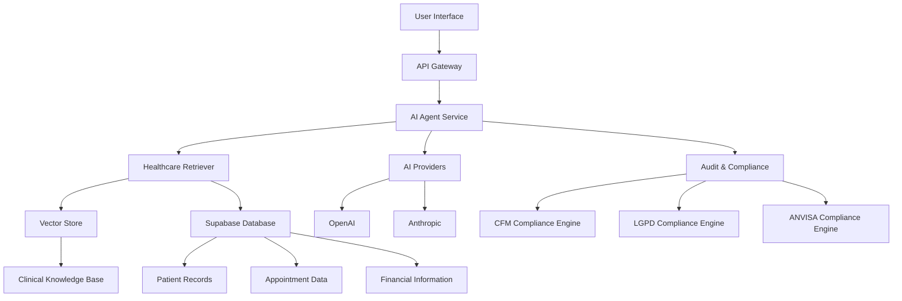
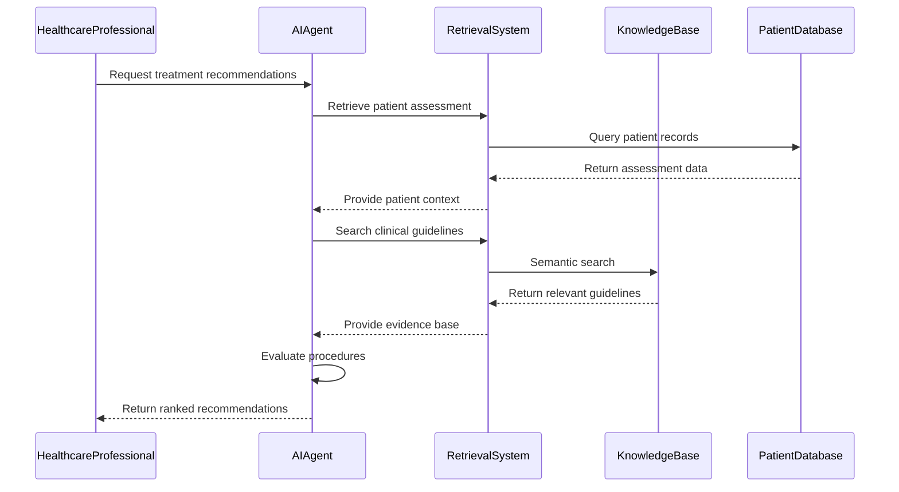
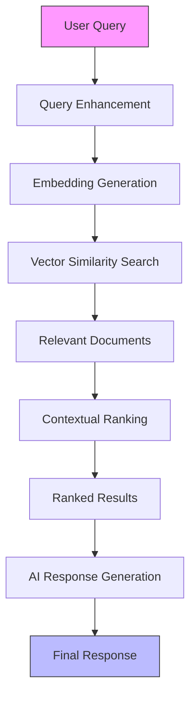
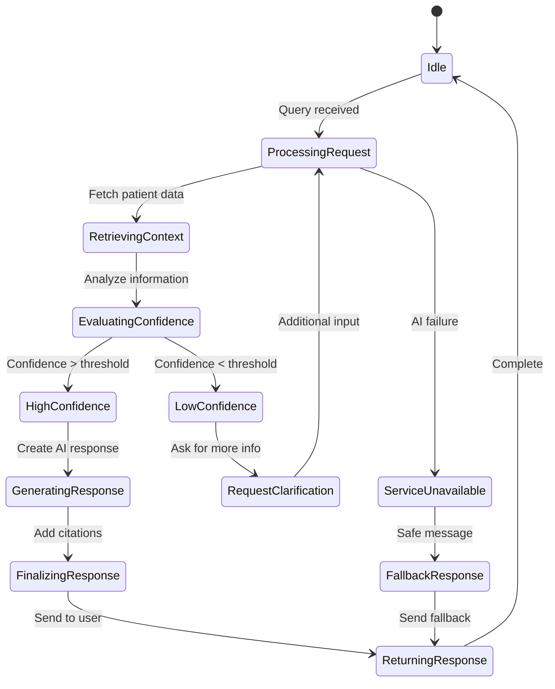
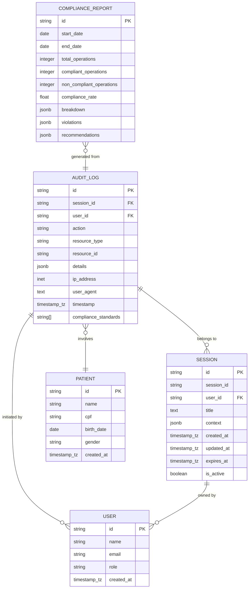

# Clinical Decision Support

<cite>
**Referenced Files in This Document**
- [agent_service.py](file://apps/ai-agent/services/agent_service.py)
- [agent.py](file://apps/api/agents/ag-ui-rag-agent/src/agent.py)
- [retriever.py](file://apps/api/agents/ag-ui-rag-agent/src/retriever.py)
- [vector_store.py](file://apps/api/agents/ag-ui-rag-agent/src/vector_store.py)
- [database.py](file://apps/api/agents/ag-ui-rag-agent/src/database.py)
- [config.py](file://apps/api/agents/ag-ui-rag-agent/src/config.py)
- [ai-clinical-decision-support.ts](file://packages/core-services/src/services/ai-clinical-decision-support.ts)
- [cfm-compliance.ts](file://apps/api/src/services/cfm-compliance.ts)
- [agent.ts](file://apps/api/src/trpc/routers/agent.ts)
- [aesthetic-rag-service.ts](file://apps/api/src/services/agui-protocol/aesthetic-rag-service.ts)
</cite>

## Table of Contents

1. [Introduction](#introduction)
2. [Architecture Overview](#architecture-overview)
3. [Core Components](#core-components)
4. [AI-Powered Treatment Planning](#ai-powered-treatment-planning)
5. [Contraindication Checking and Patient Assessment](#contraindication-checking-and-patient-assessment)
6. [Integration with Clinical Knowledge Bases](#integration-with-clinical-knowledge-bases)
7. [Appointment Scheduling with Medical Context](#appointment-scheduling-with-medical-context)
8. [Safety Mechanisms and Confidence Scoring](#safety-mechanisms-and-confidence-scoring)
9. [Human-in-the-Loop Validation](#human-in-the-loop-validation)
10. [Regulatory Compliance and Audit Trails](#regulatory-compliance-and-audit-trails)
11. [Conclusion](#conclusion)

## Introduction

The NeonPro platform's Clinical Decision Support system leverages artificial intelligence to assist healthcare professionals in delivering high-quality patient care. This document details the implementation of AI-powered features that support treatment planning, contraindication checking, and comprehensive patient assessment. The system integrates an AI agent with clinical knowledge bases to provide evidence-based recommendations while maintaining strict compliance with Brazilian healthcare regulations, including CFM (Federal Council of Medicine) guidelines for telemedicine.

The architecture combines retrieval-augmented generation (RAG) with specialized healthcare data retrieval to ensure recommendations are grounded in both current medical knowledge and individual patient history. Safety mechanisms, confidence scoring, and human oversight protocols are embedded throughout the system to maintain appropriate levels of trust and accountability in AI-assisted decision making.

## Architecture Overview

**Diagram sources**

- [agent.py](file://apps/api/agents/ag-ui-rag-agent/src/agent.py)
- [retriever.py](file://apps/api/agents/ag-ui-rag-agent/src/retriever.py)
- [vector_store.py](file://apps/api/agents/ag-ui-rag-agent/src/vector_store.py)
- [database.py](file://apps/api/agents/ag-ui-rag-agent/src/database.py)
- [cfm-compliance.ts](file://apps/api/src/services/cfm-compliance.ts)

**Section sources**

- [agent.py](file://apps/api/agents/ag-ui-rag-agent/src/agent.py)
- [retriever.py](file://apps/api/agents/ag-ui-rag-agent/src/retriever.py)

## Core Components

The Clinical Decision Support system comprises several interconnected components that work together to deliver AI-powered assistance to healthcare professionals. At its core is the AG-UI RAG Agent, which processes user queries, retrieves relevant information from multiple data sources, and generates contextually appropriate responses using large language models.

The system employs a modular architecture with distinct components for database management, vector storage, embedding generation, and healthcare-specific data retrieval. Configuration is managed through a comprehensive settings system that allows for environment-specific customization while maintaining security and compliance requirements.

Key architectural patterns include separation of concerns between data retrieval and AI processing, asynchronous operations for improved responsiveness, and comprehensive logging for audit and compliance purposes.

**Section sources**

- [agent.py](file://apps/api/agents/ag-ui-rag-agent/src/agent.py)
- [config.py](file://apps/api/agents/ag-ui-rag-agent/src/config.py)

## AI-Powered Treatment Planning

The system provides AI-powered treatment planning capabilities through its integration of patient assessment data with evidence-based clinical guidelines. When generating treatment recommendations, the AI evaluates patient-specific factors against available procedures to determine suitability scores.

The `AIClinicalDecisionSupport` service orchestrates this process by first retrieving all available procedures and then evaluating each one against the patient's assessment data. Recommendations are generated only when the suitability score exceeds a minimum threshold of 0.4, ensuring that suggested treatments have meaningful relevance to the patient's condition.

Treatment plans are created by prioritizing selected recommendations based on clinical goals and patient needs. The system considers multiple factors including procedure efficacy, potential risks, recovery time, and alignment with patient preferences to create comprehensive, personalized treatment pathways.

**Diagram sources**

- [ai-clinical-decision-support.ts](file://packages/core-services/src/services/ai-clinical-decision-support.ts)
- [retriever.py](file://apps/api/agents/ag-ui-rag-agent/src/retriever.py)

**Section sources**

- [ai-clinical-decision-support.ts](file://packages/core-services/src/services/ai-clinical-decision-support.ts)
- [retriever.py](file://apps/api/agents/ag-ui-rag-agent/src/retriever.py)

## Contraindication Checking and Patient Assessment

The system performs comprehensive contraindication checking as part of its patient assessment process. When evaluating treatment options, the AI considers the patient's complete medical history, including existing conditions, allergies, current medications, and previous treatments.

The healthcare retriever component accesses multiple data sources to build a comprehensive patient profile before any treatment recommendation is made. This includes retrieving active conditions, medication lists, allergy information, and recent laboratory results or observations. By having access to this holistic view of the patient's health status, the system can identify potential contraindications and flag them for healthcare professional review.

Patient assessment extends beyond simple contraindication checking to include risk stratification and outcome prediction. The system calculates clinical risk scores based on various KPIs and provides insights into potential treatment outcomes, helping healthcare professionals make more informed decisions.

**Section sources**

- [retriever.py](file://apps/api/agents/ag-ui-rag-agent/src/retriever.py)
- [clinical-kpis.ts](file://packages/analytics/src/types/clinical-kpis.ts)

## Integration with Clinical Knowledge Bases

The AI agent integrates with clinical knowledge bases through a sophisticated retrieval-augmented generation (RAG) system. This approach combines the generative capabilities of large language models with access to authoritative medical information, ensuring that recommendations are grounded in current, evidence-based guidelines.

The system uses semantic similarity search to find relevant information in the knowledge base. When a query is received, the system first creates an embedding of the query text, then searches the vector store for documents with similar embeddings. This allows for contextual understanding rather than simple keyword matching, enabling the system to find relevant information even when different terminology is used.

Medical queries are enhanced with domain-specific terms to improve retrieval accuracy. For example, a query about "high blood pressure" might be expanded to include terms like "hypertension," "cardiovascular risk," and "antihypertensive treatment" to ensure comprehensive coverage of relevant guidelines.

**Diagram sources**

- [retriever.py](file://apps/api/agents/ag-ui-rag-agent/src/retriever.py)
- [vector_store.py](file://apps/api/agents/ag-ui-rag-agent/src/vector_store.py)

**Section sources**

- [retriever.py](file://apps/api/agents/ag-ui-rag-agent/src/retriever.py)
- [vector_store.py](file://apps/api/agents/ag-ui-rag-agent/src/vector_store.py)

## Appointment Scheduling with Medical Context

The system incorporates medical history and treatment plans into appointment scheduling decisions through its specialized scheduling service. When considering appointment availability, the system takes into account not just calendar conflicts but also medical requirements and contraindications.

The scheduling logic considers factors such as required consultation time based on treatment complexity, necessary pre-care or post-care instructions, specific equipment requirements, and professional expertise needed for particular procedures. For patients with complex medical histories, the system may recommend longer appointment durations or suggest consultations with specialists.

The integration between treatment planning and scheduling ensures continuity of care. When a treatment plan is approved, the system can automatically propose an optimized schedule that aligns with the recommended treatment timeline, considers the patient's availability preferences, and accounts for necessary recovery periods between procedures.

**Section sources**

- [aesthetic-rag-service.ts](file://apps/api/src/services/agui-protocol/aesthetic-rag-service.ts)
- [ai-appointment-scheduling-service.test.ts](file://apps/api/src/__tests__/services/ai-scheduling/ai-appointment-scheduling-service.test.ts)

## Safety Mechanisms and Confidence Scoring

The system implements multiple safety mechanisms to ensure reliable and trustworthy AI assistance. A circuit breaker pattern is employed to detect and respond to failures in the AI service, providing fallback responses when the primary AI provider is unavailable.

Confidence scoring is integrated throughout the system, with the AI providing confidence levels for its recommendations. When confidence falls below acceptable thresholds, the system either requests additional information from the user or defers to human expertise. The response formatter includes confidence metrics in all AI-generated responses, allowing healthcare professionals to assess the reliability of suggestions.

Data sensitivity classification ensures appropriate handling of medical information. Requests involving medical diagnosis or patient analysis are classified as "restricted" and subject to additional security measures, while general appointment scheduling is classified as "confidential." This tiered approach enables appropriate resource allocation and security protocols based on the sensitivity of the request.

**Diagram sources**

- [agent.py](file://apps/api/agents/ag-ui-rag-agent/src/agent.py)
- [integration-example.ts](file://apps/api/src/services/circuit-breaker/integration-example.ts)

**Section sources**

- [agent.py](file://apps/api/agents/ag-ui-rag-agent/src/agent.py)
- [integration-example.ts](file://apps/api/src/services/circuit-breaker/integration-example.ts)

## Human-in-the-Loop Validation

The system incorporates human-in-the-loop validation at multiple stages to ensure appropriate oversight of AI-generated recommendations. All AI suggestions are presented as decision support rather than autonomous directives, requiring explicit approval from qualified healthcare professionals.

Feedback mechanisms allow users to rate the quality and accuracy of AI responses, with this feedback used to continuously improve the system. The agent service includes explicit feedback processing that captures user satisfaction and identifies areas for improvement in the AI's performance.

Critical decisions, particularly those involving diagnosis or treatment planning, trigger additional validation steps. The system may require secondary review by another professional or prompt for confirmation of key assumptions before proceeding. This multi-layered validation approach balances efficiency with appropriate caution in medical decision-making.

**Section sources**

- [agent_service.py](file://apps/ai-agent/services/agent_service.py)
- [agent.py](file://apps/api/agents/ag-ui-rag-agent/src/agent.py)

## Regulatory Compliance and Audit Trails

The system maintains rigorous compliance with Brazilian healthcare regulations, including CFM guidelines for telemedicine, LGPD (General Data Protection Law), and ANVISA standards. A dedicated compliance engine validates clinical decision support functionality against these regulatory requirements.

Comprehensive audit trails are generated for all AI interactions, capturing details such as the user who initiated the request, the patient involved, the nature of the query, the AI's response, and any follow-up actions. These audit logs include timestamps, IP addresses, and user agents to support forensic analysis if needed.

The system implements data minimization principles, collecting and processing only the information necessary for the specific clinical purpose. Patient data is encrypted both at rest and in transit, with access controls enforcing the principle of least privilege. Regular compliance assessments generate reports that evaluate adherence to regulatory requirements and identify areas for improvement.

**Diagram sources**

- [database.py](file://apps/api/agents/ag-ui-rag-agent/src/database.py)
- [cfm-compliance.ts](file://apps/api/src/services/cfm-compliance.ts)
- [agent.ts](file://apps/api/src/trpc/routers/agent.ts)

**Section sources**

- [cfm-compliance.ts](file://apps/api/src/services/cfm-compliance.ts)
- [agent.ts](file://apps/api/src/trpc/routers/agent.ts)
- [database.py](file://apps/api/agents/ag-ui-rag-agent/src/database.py)

## Conclusion

The Clinical Decision Support system in the NeonPro platform represents a sophisticated integration of artificial intelligence and healthcare expertise designed to enhance the quality and efficiency of patient care. By combining retrieval-augmented generation with comprehensive patient data and evidence-based guidelines, the system provides healthcare professionals with actionable insights while maintaining appropriate safeguards and regulatory compliance.

The architecture demonstrates a thoughtful balance between automation and human oversight, ensuring that AI serves as a tool to augment professional judgment rather than replace it. Safety mechanisms, confidence scoring, and human-in-the-loop validation processes work together to maintain trust and accountability in AI-assisted decision making.

Through its integration of treatment planning, contraindication checking, patient assessment, and intelligent scheduling, the system supports a holistic approach to patient care that considers both clinical effectiveness and operational efficiency. The comprehensive audit trails and compliance frameworks ensure that the system meets the highest standards for medical ethics and data protection in the Brazilian healthcare context.
