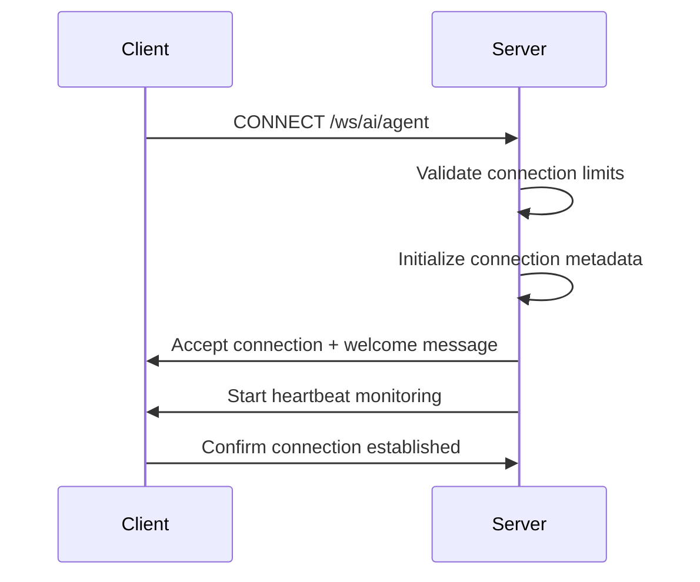
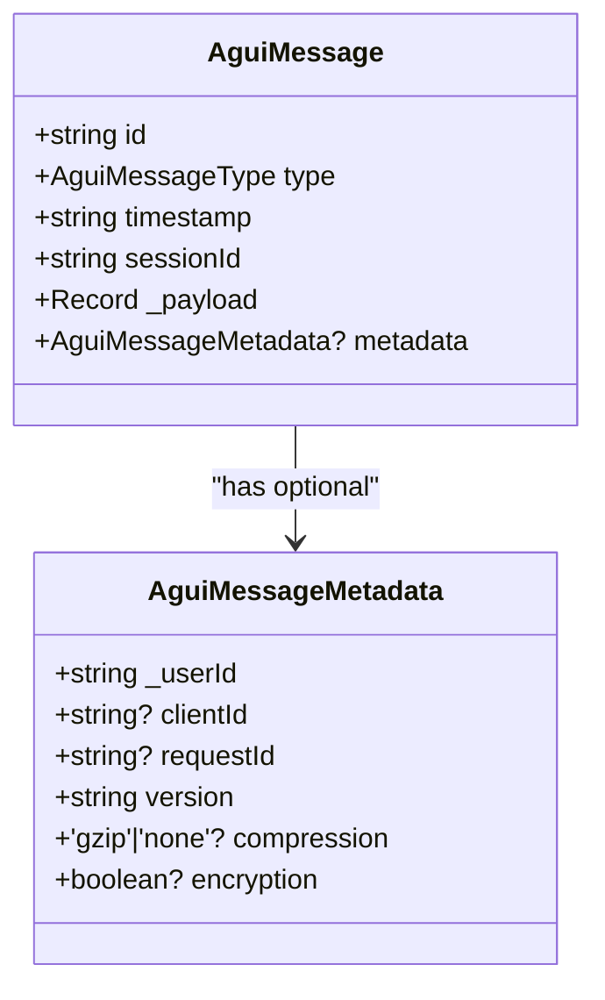
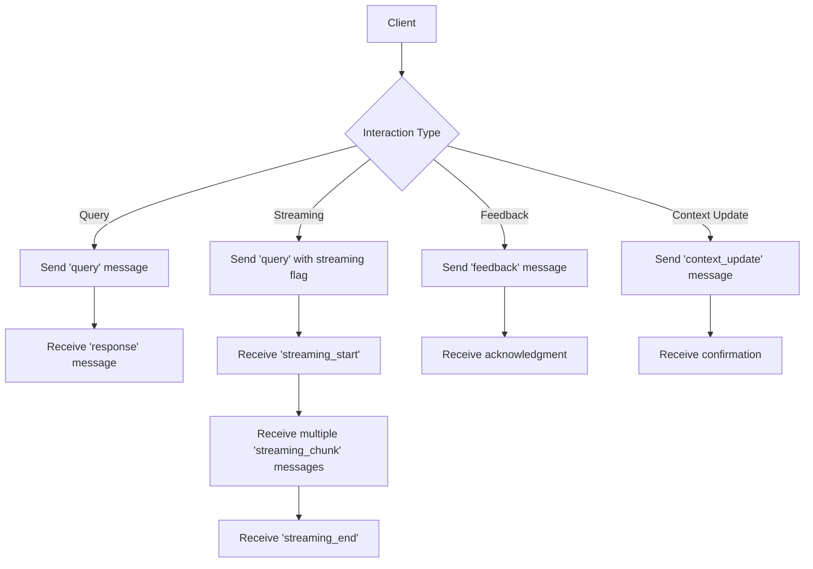
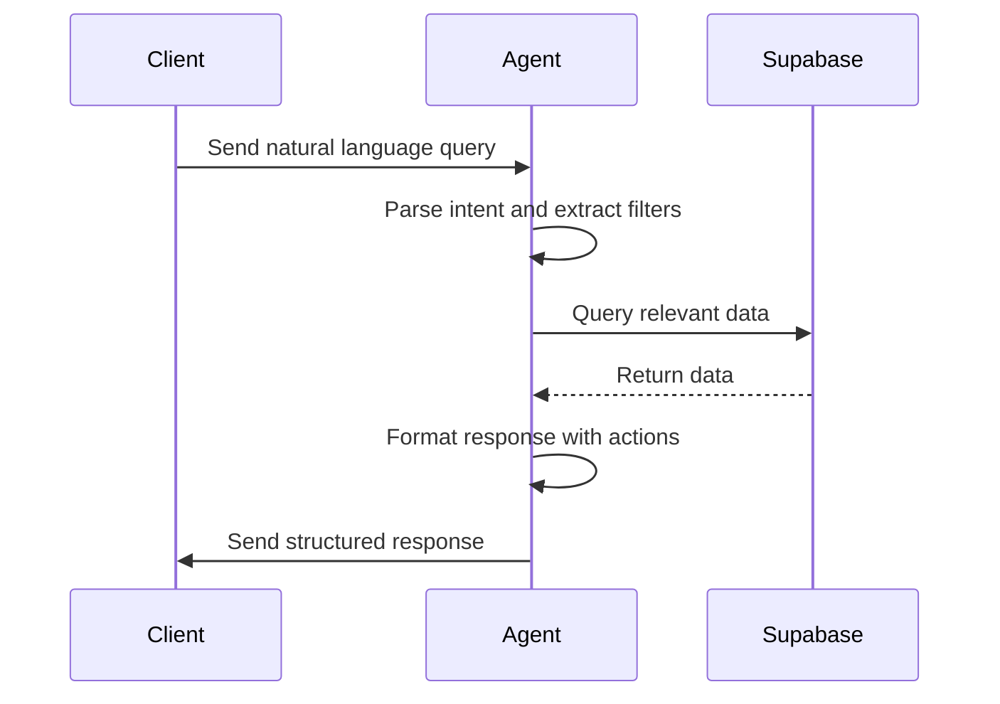
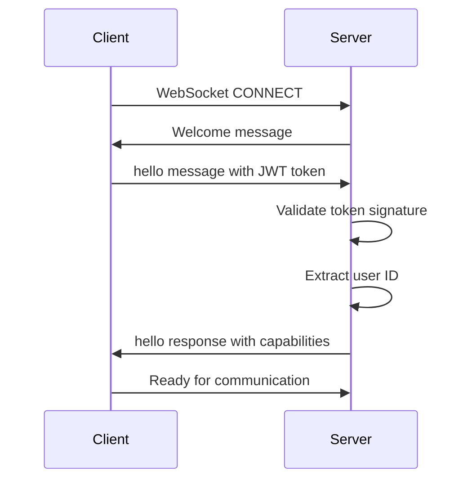
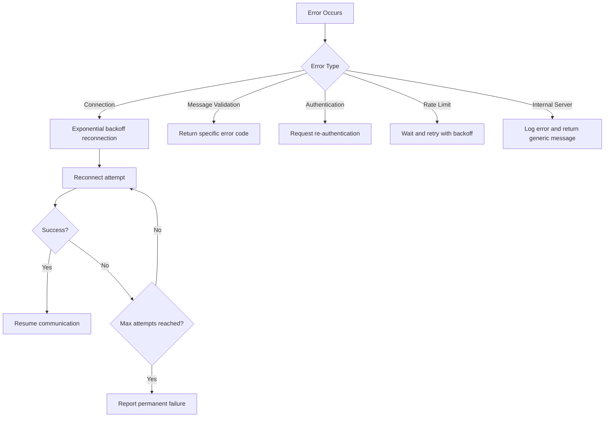
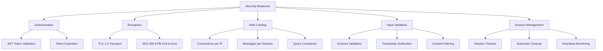

# Communication Protocols

<cite>
**Referenced Files in This Document **   
- [agui_protocol.py](file://apps/api/agents/ag-ui-rag-agent/agui_protocol.py)
- [websocket_manager.py](file://apps/ai-agent/services/websocket_manager.py)
- [agent.py](file://apps/api/agents/ag-ui-rag-agent/agent.py)
- [protocol.ts](file://packages/agui-protocol/src/protocol.ts)
- [types.ts](file://packages/agui-protocol/src/types.ts)
</cite>

## Table of Contents
1. [Introduction](#introduction)
2. [Connection Establishment Process](#connection-establishment-process)
3. [Message Framing and Protocol Structure](#message-framing-and-protocol-structure)
4. [Real-Time Interaction Patterns](#real-time-interaction-patterns)
5. [AG-UI RAG Agent Protocol](#ag-ui-rag-agent-protocol)
6. [Handshake Procedures and Authentication](#handshake-procedures-and-authentication)
7. [Error Recovery Strategies](#error-recovery-strategies)
8. [Security Considerations](#security-considerations)
9. [Client Implementation Guidelines](#client-implementation-guidelines)
10. [Protocol Message Examples](#protocol-message-examples)

## Introduction
The NeonPro AI agent system utilizes a WebSocket-based communication protocol to enable real-time interaction between frontend clients and AI agents. This document details the AG-UI protocol implementation, focusing on connection management, message framing, and real-time data exchange patterns. The protocol supports Retrieval Augmented Generation (RAG) operations for healthcare data access, with comprehensive security measures and error handling mechanisms.

## Connection Establishment Process
The WebSocket connection establishment process follows a standardized handshake procedure that ensures secure and authenticated communication between clients and the AI agent service. The process begins with the client initiating a WebSocket connection to the designated endpoint `/ws/ai/agent`. Upon receiving the connection request, the server accepts the connection and assigns a unique client identifier if not provided by the client.

The connection manager performs several critical functions during establishment:
- Validates connection limits to prevent resource exhaustion
- Initializes connection metadata including timestamps, IP address, and user agent
- Sends a welcome message confirming successful connection
- Establishes heartbeat monitoring for connection health

Once connected, the system creates a session context that persists throughout the communication lifecycle. The AG-UI protocol implementation includes automatic reconnection logic with exponential backoff, allowing clients to maintain continuity even during temporary network disruptions.



**Diagram sources **
- [websocket_manager.py](file://apps/ai-agent/services/websocket_manager.py#L14-L230)
- [agui_protocol.py](file://apps/api/agents/ag-ui-rag-agent/agui_protocol.py#L203-L424)

**Section sources**
- [websocket_manager.py](file://apps/ai-agent/services/websocket_manager.py#L14-L230)
- [agui_protocol.py](file://apps/api/agents/ag-ui-rag-agent/agui_protocol.py#L203-L424)

## Message Framing and Protocol Structure
The AG-UI protocol employs a structured message format designed for efficient and secure data exchange. Each message follows a consistent schema with required fields including unique identifiers, timestamps, session information, and payload data. The protocol supports multiple message types through the `AguiMessageType` enumeration, which defines various communication patterns.

Key message components include:
- `id`: Unique identifier for message tracking and deduplication
- `type`: Specifies the message purpose (e.g., query, response, error)
- `timestamp`: ISO 8601 formatted timestamp for message ordering
- `sessionId`: Correlates messages within a specific user session
- `_payload`: Contains the actual data or command
- `metadata`: Optional contextual information about the message

The protocol implements message validation to ensure structural integrity, verifying that all required fields are present and properly formatted. Timestamp validation prevents replay attacks by rejecting messages with timestamps that are too far in the past or future. Session ID validation confirms proper formatting and authenticity.



**Diagram sources **
- [types.ts](file://packages/agui-protocol/src/types.ts#L7-L14)
- [protocol.ts](file://packages/agui-protocol/src/protocol.ts#L15-L201)

**Section sources**
- [types.ts](file://packages/agui-protocol/src/types.ts#L7-L14)
- [protocol.ts](file://packages/agui-protocol/src/protocol.ts#L15-L201)

## Real-Time Interaction Patterns
The AG-UI protocol supports several real-time interaction patterns optimized for AI agent communication. These patterns facilitate efficient data exchange while maintaining responsiveness and reliability. The primary interaction models include request-response, streaming responses, and event-driven notifications.

For standard queries, the protocol follows a request-response pattern where the client sends a query message and receives a corresponding response. For longer-running operations or large data sets, the protocol supports streaming responses through specialized message types (`streaming_start`, `streaming_chunk`, `streaming_end`). This allows the AI agent to begin transmitting results immediately while still processing, reducing perceived latency.

Event-driven interactions enable the server to push updates to clients without explicit requests. This includes system status updates, session expiration warnings, and real-time analytics. The protocol also supports client-initiated events such as feedback submission and context updates, creating a bidirectional communication channel.



**Diagram sources **
- [protocol.ts](file://packages/agui-protocol/src/protocol.ts#L15-L201)
- [agui_protocol.py](file://apps/api/agents/ag-ui-rag-agent/agui_protocol.py#L203-L424)

**Section sources**
- [protocol.ts](file://packages/agui-protocol/src/protocol.ts#L15-L201)
- [agui_protocol.py](file://apps/api/agents/ag-ui-rag-agent/agui_protocol.py#L203-L424)

## AG-UI RAG Agent Protocol
The AG-UI RAG (Retrieval Augmented Generation) agent protocol extends the core WebSocket communication to support sophisticated healthcare data queries. This specialized protocol enables natural language interaction with clinical, appointment, and financial databases through a retrieval-augmented approach.

The protocol workflow begins with intent parsing, where the AI agent analyzes the user's natural language query to determine the primary domain (clients, appointments, or finances) and intended action. Based on this analysis, the system retrieves relevant data from Supabase, formats it appropriately, and generates a comprehensive response.

Key features of the RAG protocol include:
- Context-aware querying with filter extraction
- Structured data presentation with appropriate UI components
- Actionable responses with suggested follow-up actions
- Secure access to sensitive healthcare information

The protocol supports various response types including lists, summaries, and detailed records, each formatted with appropriate metadata for optimal rendering in the frontend interface.



**Diagram sources **
- [agent.py](file://apps/api/agents/ag-ui-rag-agent/agent.py#L1-L320)
- [agui_protocol.py](file://apps/api/agents/ag-ui-rag-agent/agui_protocol.py#L203-L424)

**Section sources**
- [agent.py](file://apps/api/agents/ag-ui-rag-agent/agent.py#L1-L320)
- [agui_protocol.py](file://apps/api/agents/ag-ui-rag-agent/agui_protocol.py#L203-L424)

## Handshake Procedures and Authentication
The handshake procedure combines WebSocket connection establishment with authentication to ensure secure access to the AI agent services. The process begins with a standard WebSocket handshake, followed by a protocol-specific hello exchange that establishes communication parameters.

Authentication is implemented through JWT (JSON Web Token) tokens provided in the hello message. The server validates the token signature using a configured secret key and extracts the user ID for session association. The protocol supports version negotiation during the handshake, allowing clients and servers to agree on compatible protocol versions.

The handshake sequence includes:
1. Client connects to WebSocket endpoint
2. Server sends welcome message
3. Client sends hello message with authentication token
4. Server validates credentials and responds with hello confirmation
5. Secure communication channel established

Rate limiting is enforced at the connection level to prevent brute force attacks, with configurable limits per IP address. Failed authentication attempts are logged for security monitoring.



**Diagram sources **
- [protocol.ts](file://packages/agui-protocol/src/protocol.ts#L15-L201)
- [agui_protocol.py](file://apps/api/agents/ag-ui-rag-agent/agui_protocol.py#L203-L424)

**Section sources**
- [protocol.ts](file://packages/agui-protocol/src/protocol.ts#L15-L201)
- [agui_protocol.py](file://apps/api/agents/ag-ui-rag-agent/agui_protocol.py#L203-L424)

## Error Recovery Strategies
The AG-UI protocol implements comprehensive error recovery mechanisms to maintain reliable communication in unstable network conditions. These strategies address both transient errors and permanent failures, providing appropriate responses and recovery options.

For connection interruptions, the protocol includes automatic reconnection logic with exponential backoff. Clients attempt to reconnect with increasing delays between attempts, preventing network congestion during widespread outages. The maximum number of reconnection attempts is configurable, after which manual intervention may be required.

Message-level error handling provides specific error codes and descriptive messages to help diagnose issues. Common error types include:
- `INVALID_FORMAT`: Malformed JSON or missing required fields
- `AUTHENTICATION_FAILED`: Invalid or expired authentication token
- `RATE_LIMITED`: Exceeded allowed request frequency
- `INTERNAL_ERROR`: Server-side processing failure

The protocol also includes heartbeat monitoring to detect unresponsive connections. If a client fails to respond to ping messages, the server gracefully closes the connection and cleans up associated resources. Clients can detect disconnections and initiate reconnection procedures automatically.



**Diagram sources **
- [protocol.ts](file://packages/agui-protocol/src/protocol.ts#L15-L201)
- [agui_protocol.py](file://apps/api/agents/ag-ui-rag-agent/agui_protocol.py#L203-L424)

**Section sources**
- [protocol.ts](file://packages/agui-protocol/src/protocol.ts#L15-L201)
- [agui_protocol.py](file://apps/api/agents/ag-ui-rag-agent/agui_protocol.py#L203-L424)

## Security Considerations
The AG-UI protocol incorporates multiple security layers to protect sensitive healthcare data and prevent common WebSocket vulnerabilities. These measures address authentication, authorization, data protection, and attack prevention.

Authentication is enforced through JWT tokens validated on each connection, ensuring only authorized users can access the AI agent services. Role-based access control could be implemented at the application layer to restrict data access based on user permissions.

Data protection includes end-to-end encryption using AES-256-CFB mode with PBKDF2 key derivation. All sensitive data transmitted through the WebSocket connection is encrypted before transmission. The protocol also supports TLS 1.3 for transport-layer security.

Rate limiting is implemented at multiple levels:
- Connection rate limiting by IP address
- Message rate limiting per session
- Query complexity limiting to prevent resource exhaustion

Input validation protects against injection attacks and malformed messages. All incoming messages are validated for structure, content, and timing. Messages with timestamps significantly different from the current time are rejected to prevent replay attacks.

The protocol also includes protections against denial-of-service attacks through connection limits and timeout mechanisms. Inactive sessions are automatically cleaned up after a configurable period, freeing server resources.



**Diagram sources **
- [agui_protocol.py](file://apps/api/agents/ag-ui-rag-agent/agui_protocol.py#L203-L424)
- [protocol.ts](file://packages/agui-protocol/src/protocol.ts#L15-L201)

**Section sources**
- [agui_protocol.py](file://apps/api/agents/ag-ui-rag-agent/agui_protocol.py#L203-L424)
- [protocol.ts](file://packages/agui-protocol/src/protocol.ts#L15-L201)

## Client Implementation Guidelines
Client implementations should follow these guidelines to ensure reliable and secure communication with the NeonPro AI agent system. These recommendations apply to both web and mobile platforms.

For web clients:
- Use the provided `AguiProtocol` class to manage WebSocket connections
- Implement connection status monitoring and appropriate UI feedback
- Handle reconnection attempts gracefully with user notifications
- Validate input before sending queries to reduce error responses
- Implement proper error handling for different error codes

For mobile clients:
- Optimize for intermittent connectivity with robust reconnection logic
- Implement background processing considerations to conserve battery
- Handle app suspension and resumption appropriately
- Cache recent responses for offline access when appropriate
- Respect platform-specific networking policies

All clients should:
- Generate unique message IDs for tracking and deduplication
- Include proper metadata in messages when available
- Implement timeout mechanisms for requests
- Monitor connection health through heartbeat responses
- Provide clear feedback during loading states
- Handle streaming responses incrementally for better UX

The protocol client library handles many low-level details such as message queuing during disconnections, automatic reconnection, and basic error handling, allowing developers to focus on application logic.

**Section sources**
- [protocol.ts](file://packages/agui-protocol/src/protocol.ts#L15-L201)
- [agui_protocol.py](file://apps/api/agents/ag-ui-rag-agent/agui_protocol.py#L203-L424)

## Protocol Message Examples
This section provides examples of protocol messages for common scenarios, illustrating the expected structure and content.

### Connection Establishment
```json
{
  "id": "msg_1648723498_abc123",
  "type": "hello",
  "timestamp": "2024-01-01T12:00:00.000Z",
  "sessionId": "session_1648723498_xyz789",
  "payload": {
    "version": "1.0.0",
    "authentication": {
      "type": "jwt",
      "token": "eyJhbGciOiJIUzI1NiIsInR5cCI6IkpXVCJ9.xxxxx"
    },
    "capabilities": ["query", "streaming", "feedback"]
  },
  "metadata": {
    "_userId": "user_123",
    "version": "1.0.0"
  }
}
```

### Query Submission
```json
{
  "id": "msg_1648723500_def456",
  "type": "query",
  "timestamp": "2024-01-01T12:00:02.000Z",
  "sessionId": "session_1648723498_xyz789",
  "payload": {
    "_query": "Show me tomorrow's appointments",
    "context": {
      "last_query": "Show me today's clients"
    },
    "options": {
      "includeDetails": true
    }
  },
  "metadata": {
    "_userId": "user_123",
    "requestId": "req_789",
    "version": "1.0.0"
  }
}
```

### Streaming Response
```json
// Streaming start
{
  "id": "msg_1648723501_ghi789",
  "type": "streaming_start",
  "timestamp": "2024-01-01T12:00:03.000Z",
  "sessionId": "session_1648723498_xyz789",
  "payload": {
    "responseId": "resp_1648723501",
    "contentType": "text/plain",
    "estimatedLength": 1024
  }
}

// Streaming chunk
{
  "id": "msg_1648723502_jkl012",
  "type": "streaming_chunk",
  "timestamp": "2024-01-01T12:00:04.000Z",
  "sessionId": "session_1648723498_xyz789",
  "payload": {
    "responseId": "resp_1648723501",
    "content": "Here are tomorrow's appointments:\n\n1. Maria Silva - 9:00 AM\n2. João Santos - 10:30 AM\n",
    "isFinal": false
  }
}

// Streaming end
{
  "id": "msg_1648723505_mno345",
  "type": "streaming_end",
  "timestamp": "2024-01-01T12:00:07.000Z",
  "sessionId": "session_1648723498_xyz789",
  "payload": {
    "responseId": "resp_1648723501",
    "completionReason": "complete"
  }
}
```

### Session Termination
```json
{
  "id": "msg_1648723600_pqr678",
  "type": "session_update",
  "timestamp": "2024-01-01T12:15:00.000Z",
  "sessionId": "session_1648723498_xyz789",
  "payload": {
    "updates": {
      "isActive": false,
      "endedAt": "2024-01-01T12:15:00.000Z"
    }
  }
}
```

**Section sources**
- [types.ts](file://packages/agui-protocol/src/types.ts#L7-L14)
- [protocol.ts](file://packages/agui-protocol/src/protocol.ts#L15-L201)
- [agui_protocol.py](file://apps/api/agents/ag-ui-rag-agent/agui_protocol.py#L203-L424)