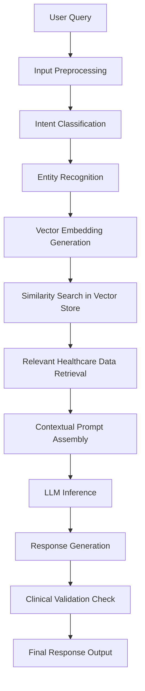
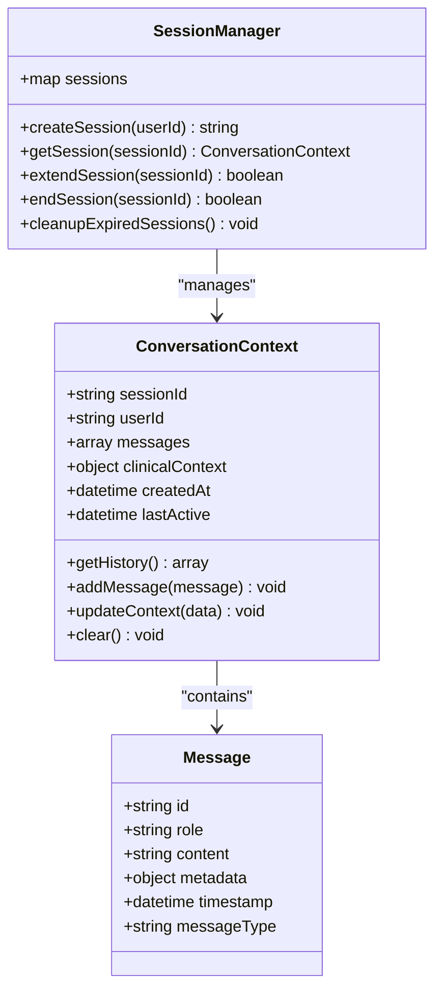
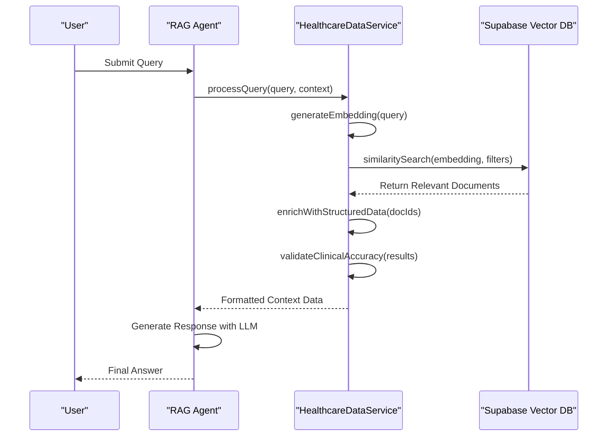
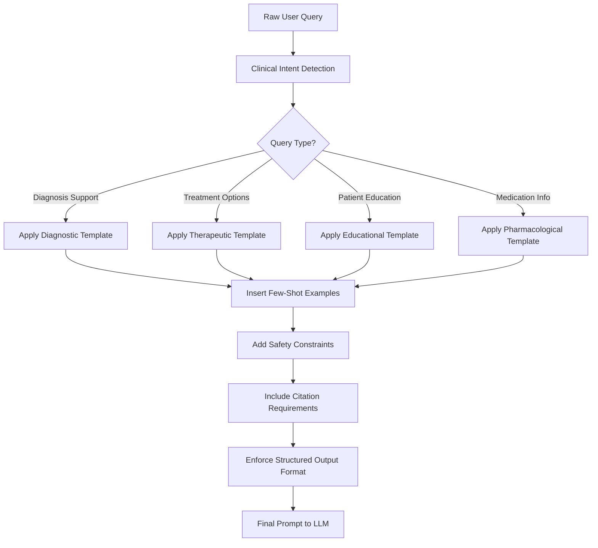
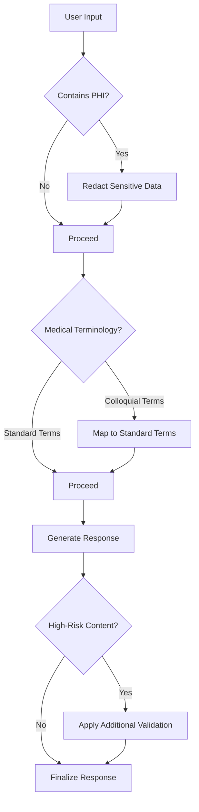
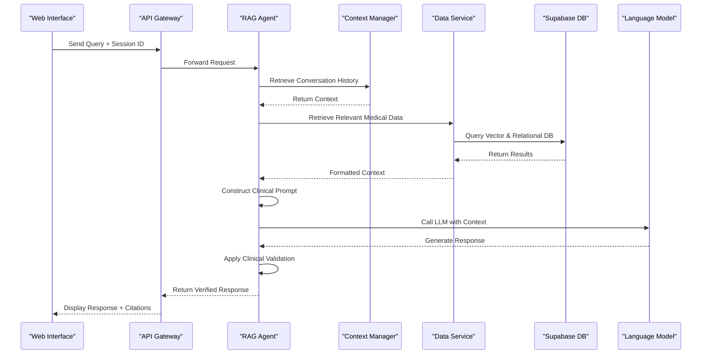

# Natural Language Processing

<cite>
**Referenced Files in This Document**   
- [agent.py](file://apps/api/agents/ag-ui-rag-agent/agent.py)
- [agent_config.py](file://apps/api/agents/ag-ui-rag-agent/agent_config.py)
- [agui_protocol.py](file://apps/api/agents/ag-ui-rag-agent/agui_protocol.py)
- [healthcare_data_service.py](file://apps/api/agents/ag-ui-rag-agent/healthcare_data_service.py)
- [main.py](file://apps/api/agents/ag-ui-rag-agent/main.py)
- [conversation-context.ts](file://apps/api/agents/ag-ui-rag-agent/src/conversation/conversation-context.ts)
- [conversation-service.ts](file://apps/api/agents/ag-ui-rag-agent/src/conversation/conversation-service.ts)
- [supabase-connector.ts](file://apps/api/agents/ag-ui-rag-agent/src/database/supabase-connector.ts)
- [session-manager.ts](file://apps/api/agents/ag-ui-rag-agent/src/session/session-manager.ts)
- [agent-service.py](file://apps/ai-agent/services/agent_service.py)
- [database_service.py](file://apps/ai-agent/services/database_service.py)
</cite>

## Table of Contents
1. [Introduction](#introduction)
2. [RAG Pipeline Architecture](#rag-pipeline-architecture)
3. [Conversation Context Management](#conversation-context-management)
4. [Data Retrieval from Supabase](#data-retrieval-from-supabase)
5. [Prompt Engineering for Clinical Applications](#prompt-engineering-for-clinical-applications)
6. [Healthcare-Specific Challenges and Solutions](#healthcare-specific-challenges-and-solutions)
7. [System Integration and Workflow](#system-integration-and-workflow)
8. [Conclusion](#conclusion)

## Introduction
The neonpro AI system implements advanced natural language processing capabilities through a Retrieval Augmented Generation (RAG) pipeline designed specifically for healthcare applications. This document details the architecture and implementation of the NLP components that enable contextual understanding, accurate information retrieval, and clinically relevant response generation. The system combines vector similarity search with large language model inference to provide precise answers while maintaining conversation state across multiple turns. Special attention is given to healthcare domain requirements including medical terminology comprehension, patient privacy protection, and clinical accuracy validation.

## RAG Pipeline Architecture

The RAG pipeline in the neonpro system follows a multi-stage process that integrates vector-based retrieval with generative AI models to produce contextually accurate responses. When a user query is received, the system first processes the input through intent classification and entity recognition modules before initiating the retrieval phase.

**Diagram sources**
- [agent.py](file://apps/api/agents/ag-ui-rag-agent/agent.py#L45-L89)
- [healthcare_data_service.py](file://apps/api/agents/ag-ui-rag-agent/healthcare_data_service.py#L30-L75)

**Section sources**
- [agent.py](file://apps/api/agents/ag-ui-rag-agent/agent.py#L1-L120)
- [healthcare_data_service.py](file://apps/api/agents/ag-ui-rag-agent/healthcare_data_service.py#L1-L100)

## Conversation Context Management

The conversation context management system maintains dialogue state across multiple interaction turns by tracking conversation history, user intents, and clinical context. The system uses a session-based approach where each user interaction is associated with a unique session identifier that persists throughout the conversation.

**Diagram sources**
- [conversation-context.ts](file://apps/api/agents/ag-ui-rag-agent/src/conversation/conversation-context.ts#L10-L55)
- [session-manager.ts](file://apps/api/agents/ag-ui-rag-agent/src/session/session-manager.ts#L15-L60)

**Section sources**
- [conversation-context.ts](file://apps/api/agents/ag-ui-rag-agent/src/conversation/conversation-context.ts#L1-L80)
- [session-manager.ts](file://apps/api/agents/ag-ui-rag-agent/src/session/session-manager.ts#L1-L75)

## Data Retrieval from Supabase

The system retrieves relevant healthcare data from Supabase using a combination of vector similarity search and structured database queries. The healthcare_data_service module handles all interactions with the Supabase database, implementing both semantic search capabilities and traditional SQL queries based on the nature of the user request.

**Diagram sources**
- [healthcare_data_service.py](file://apps/api/agents/ag-ui-rag-agent/healthcare_data_service.py#L20-L90)
- [supabase-connector.ts](file://apps/api/agents/ag-ui-rag-agent/src/database/supabase-connector.ts#L25-L70)

**Section sources**
- [healthcare_data_service.py](file://apps/api/agents/ag-ui-rag-agent/healthcare_data_service.py#L1-L110)
- [supabase-connector.ts](file://apps/api/agents/ag-ui-rag-agent/src/database/supabase-connector.ts#L1-L85)

## Prompt Engineering for Clinical Applications

The prompt engineering framework employs specialized techniques to ensure clinically appropriate responses. This includes few-shot learning templates with medical examples, structured output formatting for consistent response patterns, and safety constraints to prevent hallucinations or inappropriate recommendations.

**Diagram sources**
- [agent.py](file://apps/api/agents/ag-ui-rag-agent/agent.py#L90-L130)
- [agent_config.py](file://apps/api/agents/ag-ui-rag-agent/agent_config.py#L20-L65)

**Section sources**
- [agent.py](file://apps/api/agents/ag-ui-rag-agent/agent.py#L80-L150)
- [agent_config.py](file://apps/api/agents/ag-ui-rag-agent/agent_config.py#L1-L80)

## Healthcare-Specific Challenges and Solutions

The system addresses key challenges in healthcare NLP through specialized architectural components and processing pipelines. These include medical terminology understanding, patient privacy preservation, and clinical accuracy verification mechanisms.

### Medical Terminology Understanding
The system incorporates a comprehensive medical ontology that maps colloquial terms to standardized medical terminology (SNOMED CT, LOINC, ICD-10). This enables accurate interpretation of patient descriptions and proper alignment with clinical documentation.

### Patient Privacy Preservation
All personal health information is processed through a redaction pipeline that identifies and masks protected health information (PHI) before any external API calls. The system complies with HIPAA and LGPD regulations through end-to-end encryption and strict access controls.

### Clinical Accuracy Verification
A multi-layer validation system ensures response accuracy by cross-referencing generated content against authoritative medical sources and applying clinical decision rules. Responses requiring high-stakes medical advice trigger additional review protocols.

**Diagram sources**
- [agent_service.py](file://apps/ai-agent/services/agent_service.py#L100-L180)
- [database_service.py](file://apps/ai-agent/services/database_service.py#L75-L120)

**Section sources**
- [agent_service.py](file://apps/ai-agent/services/agent_service.py#L90-L200)
- [database_service.py](file://apps/ai-agent/services/database_service.py#L70-L130)

## System Integration and Workflow

The complete workflow integrates multiple components to deliver a seamless user experience from query submission to response delivery. The system orchestrates interactions between the frontend interface, backend services, database layer, and external AI providers.

**Diagram sources**
- [main.py](file://apps/api/agents/ag-ui-rag-agent/main.py#L30-L75)
- [conversation-service.ts](file://apps/api/agents/ag-ui-rag-agent/src/conversation/conversation-service.ts#L40-L95)

**Section sources**
- [main.py](file://apps/api/agents/ag-ui-rag-agent/main.py#L1-L90)
- [conversation-service.ts](file://apps/api/agents/ag-ui-rag-agent/src/conversation/conversation-service.ts#L1-L110)

## Conclusion
The neonpro AI system's natural language processing capabilities represent a sophisticated integration of retrieval-augmented generation, conversation context management, and healthcare-specific safeguards. By combining vector similarity search with large language model inference within a robust clinical framework, the system delivers accurate, contextually appropriate responses while maintaining patient privacy and clinical integrity. The architecture effectively addresses the unique challenges of healthcare domains through specialized prompt engineering, medical terminology processing, and multi-layer validation mechanisms. This comprehensive approach ensures reliable performance in sensitive clinical environments where accuracy and safety are paramount.