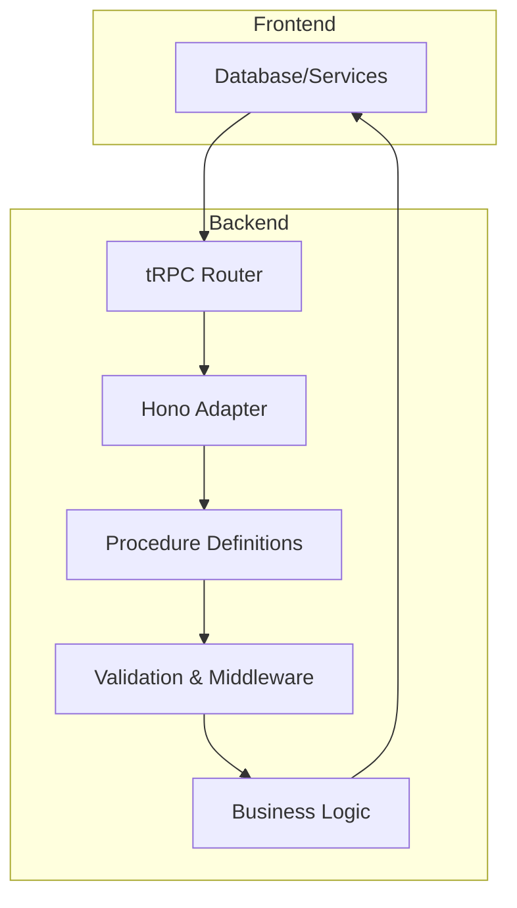
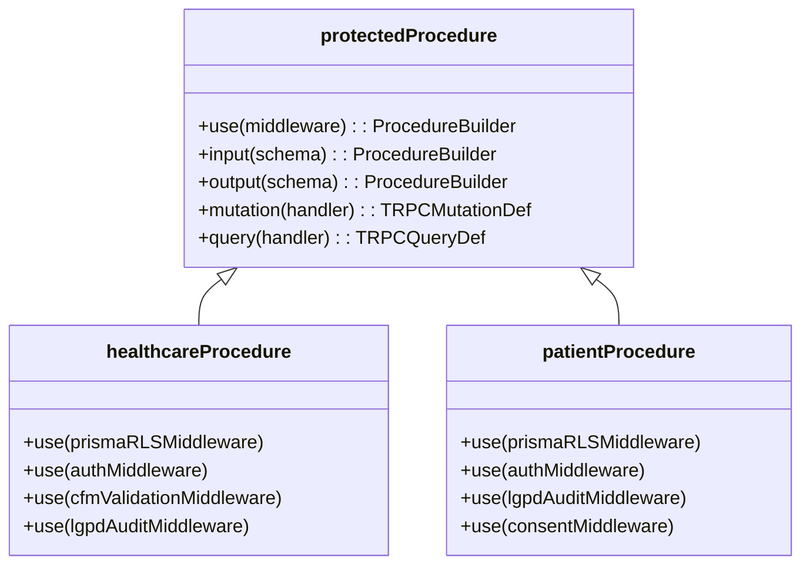
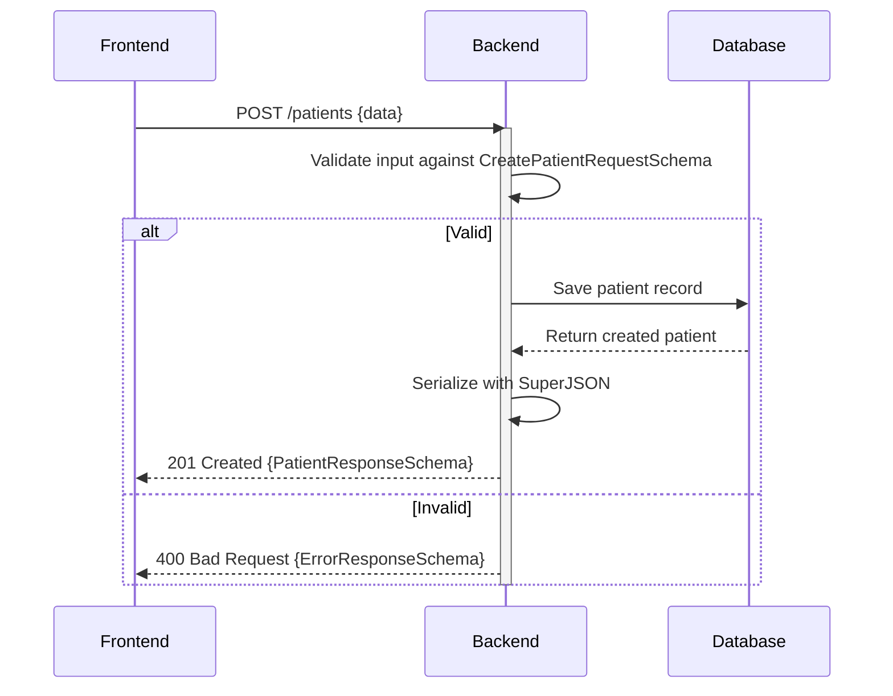
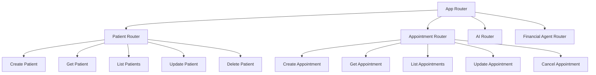
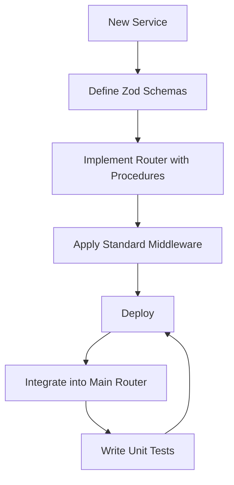

# API Design

<cite>
**Referenced Files in This Document**
- [hono.ts](file://apps/api/src/trpc/hono.ts)
- [router.ts](file://apps/api/src/trpc/router.ts)
- [trpc.ts](file://apps/api/src/trpc/trpc.ts)
- [agent.ts](file://apps/api/src/trpc/contracts/agent.ts)
- [ai.ts](file://apps/api/src/trpc/contracts/ai.ts)
- [appointment.ts](file://apps/api/src/trpc/contracts/appointment.ts)
- [patient.ts](file://apps/api/src/trpc/contracts/patient.ts)
- [clinic.ts](file://apps/api/src/trpc/contracts/clinic.ts)
- [professional.ts](file://apps/api/src/trpc/contracts/professional.ts)
- [index.ts](file://apps/api/src/trpc/contracts/index.ts)
- [openapi-schemas.ts](file://apps/api/src/schemas/openapi-schemas.ts)
- [openapi-routes.ts](file://apps/api/src/schemas/openapi-routes.ts)
</cite>

## Table of Contents

1. [Introduction](#introduction)
2. [Architecture Overview](#architecture-overview)
3. [Type-Safe API Patterns with tRPC and Hono](#type-safe-api-patterns-with-trpc-and-hono)
4. [Contract-First Approach with OpenAPI](#contract-first-approach-with-openapi)
5. [End-to-End Type Safety with TypeScript Interfaces](#end-to-end-type-safety-with-typescript-interfaces)
6. [Router Composition and Procedure Definitions](#router-composition-and-procedure-definitions)
7. [Request Validation and Response Serialization](#request-validation-and-response-serialization)
8. [Error Formatting and Handling](#error-formatting-and-handling)
9. [Versioning Strategy and Backward Compatibility](#versioning-strategy-and-backward-compatibility)
10. [Extending APIs with Consistency](#extending-apis-with-consistency)

## Introduction

The NeonPro backend implements a robust API design centered around type safety, compliance, and maintainability. By leveraging tRPC and the Hono framework, the system ensures end-to-end type safety between frontend and backend while adhering to healthcare regulations such as LGPD, CFM, and ANVISA. The architecture follows a contract-first approach using OpenAPI schema generation for automatic documentation and validation. This document details how TypeScript interfaces, router composition, procedure definitions, and error formatting work together to create a scalable, secure, and developer-friendly API ecosystem.

## Architecture Overview

The API architecture is built on a modular foundation where domain-specific routers are composed into a unified app router. Each router encapsulates related functionality (e.g., patients, appointments, AI services) and integrates compliance middleware for authentication, authorization, and audit logging. The use of tRPC enables seamless type inference across client and server boundaries, while Hono provides lightweight routing capabilities optimized for performance. OpenAPI schemas define contracts that are automatically validated at runtime, ensuring consistency and reducing integration errors.



**Diagram sources**

- [hono.ts](file://apps/api/src/trpc/hono.ts#L1-L16)
- [router.ts](file://apps/api/src/trpc/router.ts#L1-L114)
- [trpc.ts](file://apps/api/src/trpc/trpc.ts#L1-L186)

**Section sources**

- [router.ts](file://apps/api/src/trpc/router.ts#L1-L114)
- [trpc.ts](file://apps/api/src/trpc/trpc.ts#L1-L186)

## Type-Safe API Patterns with tRPC and Hono

The integration of tRPC with Hono enables a powerful type-safe API pattern where endpoints are defined as procedures with strongly-typed inputs and outputs. Procedures are grouped into routers, which can be nested and combined to form complex endpoint hierarchies. The `protectedProcedure`, `healthcareProcedure`, and `patientProcedure` abstractions apply different middleware chains based on security and compliance requirements, ensuring appropriate validation and auditing for each operation.



**Diagram sources**

- [trpc.ts](file://apps/api/src/trpc/trpc.ts#L1-L186)

**Section sources**

- [trpc.ts](file://apps/api/src/trpc/trpc.ts#L1-L186)

## Contract-First Approach with OpenAPI

The API design follows a contract-first methodology using Zod schemas annotated with OpenAPI metadata via `@hono/zod-openapi`. These schemas define request parameters, response structures, and error formats, enabling automatic OpenAPI specification generation. The `openapi-schemas.ts` file contains reusable component definitions, while `openapi-routes.ts` maps these components to specific endpoints with detailed descriptions, tags, and security requirements.

```mermaid
flowchart TD
A[Zod Schema Definition] --> B[OpenAPI Annotation]
B --> C[Route Creation with createRoute()]
C --> D[Automatic Documentation Generation]
D --> E[Runtime Validation]
E --> F[Type-Safe Endpoint Implementation]
```

**Diagram sources**

- [openapi-schemas.ts](file://apps/api/src/schemas/openapi-schemas.ts#L1-L299)
- [openapi-routes.ts](file://apps/api/src/schemas/openapi-routes.ts#L1-L463)

**Section sources**

- [openapi-schemas.ts](file://apps/api/src/schemas/openapi-schemas.ts#L1-L299)
- [openapi-routes.ts](file://apps/api/src/schemas/openapi-routes.ts#L1-L463)

## End-to-End Type Safety with TypeScript Interfaces

TypeScript interfaces generated from Zod schemas ensure consistent data typing across the entire stack. Input validation schemas like `CreatePatientRequestSchema` and output response schemas like `PatientResponseSchema` are used both in API route definitions and client-side code, eliminating discrepancies between expected and actual data structures. Superjson serialization allows complex types (e.g., dates, BigInts) to be safely transmitted over JSON.



**Diagram sources**

- [patient.ts](file://apps/api/src/trpc/contracts/patient.ts#L1-L416)
- [openapi-schemas.ts](file://apps/api/src/schemas/openapi-schemas.ts#L1-L299)

**Section sources**

- [patient.ts](file://apps/api/src/trpc/contracts/patient.ts#L1-L416)

## Router Composition and Procedure Definitions

Domain routers (e.g., `patientRouter`, `appointmentRouter`) are composed into the main `appRouter` through explicit imports and registration. Each router exports procedures that represent CRUD operations or specialized business logic. The composition pattern allows independent development and testing of modules while maintaining a cohesive API surface. Routers can be versioned independently by creating parallel implementations (e.g., `v1/patients`, `v2/patients`).



**Diagram sources**

- [router.ts](file://apps/api/src/trpc/router.ts#L1-L114)
- [patient.ts](file://apps/api/src/trpc/contracts/patient.ts#L1-L416)
- [appointment.ts](file://apps/api/src/trpc/contracts/appointment.ts#L1-L680)

**Section sources**

- [router.ts](file://apps/api/src/trpc/router.ts#L1-L114)
- [patient.ts](file://apps/api/src/trpc/contracts/patient.ts#L1-L416)
- [appointment.ts](file://apps/api/src/trpc/contracts/appointment.ts#L1-L680)

## Request Validation and Response Serialization

All incoming requests are validated against Zod schemas before reaching business logic. Validation occurs at multiple levels: path parameters, query strings, request bodies, and headers. On successful processing, responses are serialized according to predefined response schemas that include standardized fields like `success`, `data`, `message`, `timestamp`, and `requestId`. Error responses follow a uniform structure with `code`, `message`, and optional `details`.


**Diagram sources**

- [trpc.ts](file://apps/api/src/trpc/trpc.ts#L1-L186)
- [patient.ts](file://apps/api/src/trpc/contracts/patient.ts#L1-L416)

**Section sources**

- [trpc.ts](file://apps/api/src/trpc/trpc.ts#L1-L186)
- [patient.ts](file://apps/api/src/trpc/contracts/patient.ts#L1-L416)

## Error Formatting and Handling

Custom error formatting is implemented through tRPC's `errorFormatter` option, which enriches standard error shapes with additional context such as Zod validation messages. Healthcare-specific errors extend `TRPCError` with codes like `LGPD_CONSENT_REQUIRED`, `CLINIC_ACCESS_DENIED`, and `PATIENT_NOT_FOUND`. Errors are logged with full audit trails including user ID, patient ID, action, and severity level.

```mermaid
classDiagram
class TRPCError {
+code : string
+message : string
+data? : object
}
class HealthcareTRPCError {
+constructor(code, message, errorCode, details?)
}
TRPCError <|-- HealthcareTRPCError
class ErrorResponseSchema {
+success : false
+error : {code, message, details?}
+timestamp : string
}
HealthcareTRPCError --> ErrorResponseSchema
```

**Diagram sources**

- [trpc.ts](file://apps/api/src/trpc/trpc.ts#L1-L186)
- [patient.ts](file://apps/api/src/trpc/contracts/patient.ts#L1-L416)

**Section sources**

- [trpc.ts](file://apps/api/src/trpc/trpc.ts#L1-L186)
- [patient.ts](file://apps/api/src/trpc/contracts/patient.ts#L1-L416)

## Versioning Strategy and Backward Compatibility

API versioning is achieved through URL path prefixes (e.g., `/v1/patients`, `/v2/patients`) and router branching. Backward compatibility is maintained by deprecating endpoints gradually rather than removing them abruptly. Deprecated endpoints return a `Deprecation` header indicating the preferred replacement. Breaking changes require new major versions, while additive changes may occur within minor versions following semantic versioning principles.

```mermaid
graph LR
V1[/v1/patients] --> |Deprecated| V2[/v2/patients]
V2 --> |Current| Implementation
Legacy[/legacy/patients] --> |Redirect| V1
Experimental[/experimental/patients] --> |Testing| V3[/v3/patients]
```

**Diagram sources**

- [openapi-routes.ts](file://apps/api/src/schemas/openapi-routes.ts#L1-L463)

**Section sources**

- [openapi-routes.ts](file://apps/api/src/schemas/openapi-routes.ts#L1-L463)

## Extending APIs with Consistency

New APIs are extended by creating corresponding files in the `contracts` directory (e.g., `new-service.ts`) and importing them into `index.ts`. All new endpoints must adhere to established patterns for authentication, validation, error handling, and logging. Shared schemas from `@neonpro/types` ensure consistency across domains. Documentation is automatically updated through OpenAPI annotations, reducing maintenance overhead.



**Diagram sources**

- [index.ts](file://apps/api/src/trpc/contracts/index.ts#L1-L70)
- [openapi-schemas.ts](file://apps/api/src/schemas/openapi-schemas.ts#L1-L299)

**Section sources**

- [index.ts](file://apps/api/src/trpc/contracts/index.ts#L1-L70)
- [openapi-schemas.ts](file://apps/api/src/schemas/openapi-schemas.ts#L1-L299)
