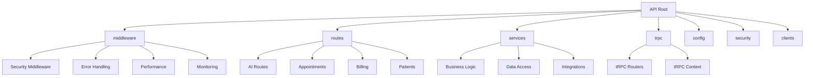
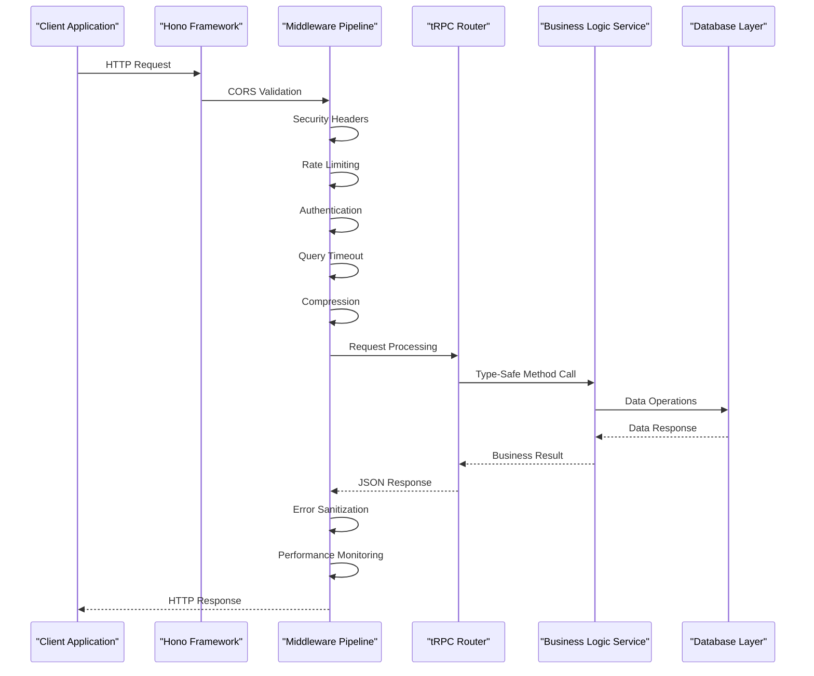
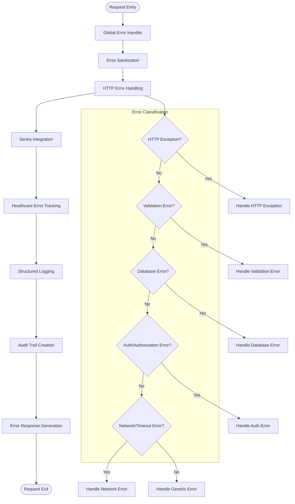
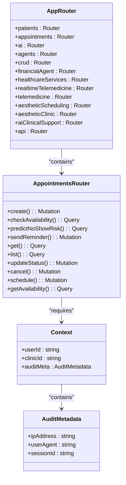
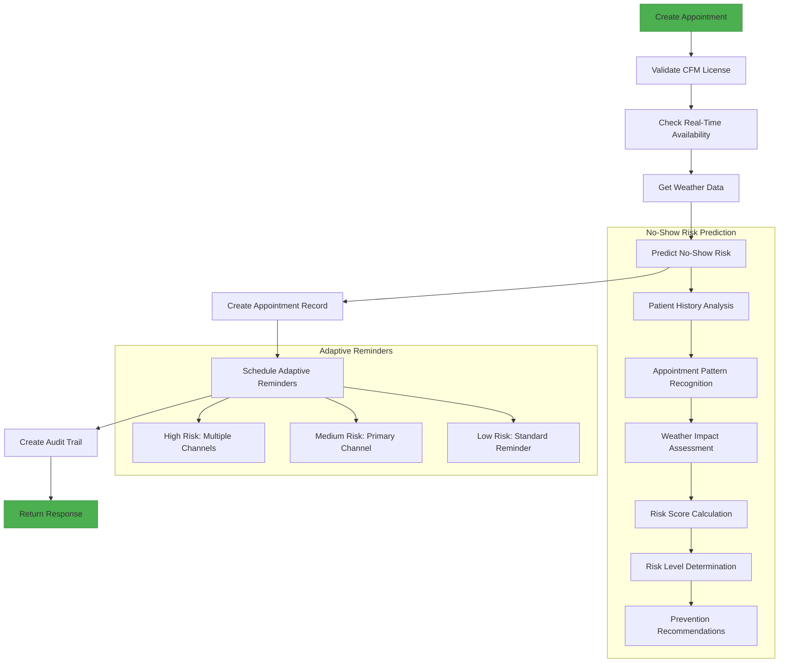
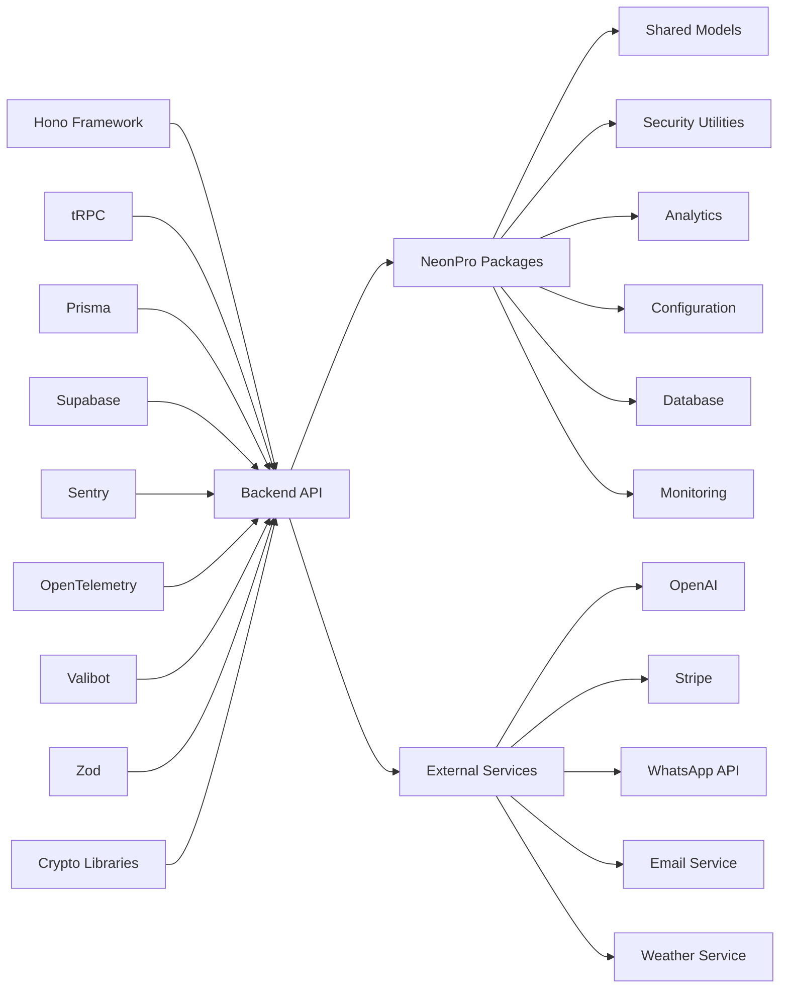

# Backend Architecture

<cite>
**Referenced Files in This Document**   
- [app.ts](file://apps/api/src/app.ts)
- [index.ts](file://apps/api/src/index.ts)
- [error-sanitization.ts](file://apps/api/src/middleware/error-sanitization.ts)
- [http-error-handling.ts](file://apps/api/src/middleware/http-error-handling.ts)
- [error-handler.ts](file://apps/api/src/middleware/error-handler.ts)
- [security-headers.ts](file://apps/api/src/middleware/security-headers.ts)
- [rate-limiting.ts](file://apps/api/src/middleware/rate-limiting.ts)
- [query-timeout-middleware.ts](file://apps/api/src/middleware/query-timeout-middleware.ts)
- [compression-middleware.ts](file://apps/api/src/middleware/compression-middleware.ts)
- [sensitive-field-analyzer.ts](file://apps/api/src/services/sensitive-field-analyzer.ts)
- [router.ts](file://apps/api/src/trpc/router.ts)
- [appointments.ts](file://apps/api/src/trpc/routers/appointments.ts)
</cite>

## Table of Contents
1. [Introduction](#introduction)
2. [Project Structure](#project-structure)
3. [Core Components](#core-components)
4. [Architecture Overview](#architecture-overview)
5. [Detailed Component Analysis](#detailed-component-analysis)
6. [Dependency Analysis](#dependency-analysis)
7. [Performance Considerations](#performance-considerations)
8. [Troubleshooting Guide](#troubleshooting-guide)
9. [Conclusion](#conclusion)

## Introduction
The NeonPro backend API service is a healthcare-compliant system built on the Hono framework with tRPC for type-safe API design. The architecture implements a layered approach with comprehensive middleware pipeline for request processing, security enforcement, and observability. The system handles critical healthcare workflows including patient management, appointment scheduling, AI clinical support, and financial operations while maintaining strict compliance with Brazilian regulations (LGPD, CFM, ANVISA). The backend integrates advanced features such as AI-powered no-show prediction, real-time availability checking, and multi-channel communication systems.

## Project Structure
The backend API service follows a modular structure organized by functional domains and architectural layers. The core application resides in the `apps/api/src` directory with components separated into logical directories for routes, middleware, services, and configuration.



**Diagram sources**
- [app.ts](file://apps/api/src/app.ts)
- [middleware](file://apps/api/src/middleware)
- [routes](file://apps/api/src/routes)
- [services](file://apps/api/src/services)
- [trpc](file://apps/api/src/trpc)

**Section sources**
- [app.ts](file://apps/api/src/app.ts)
- [index.ts](file://apps/api/src/index.ts)

## Core Components
The backend architecture centers around several key components that work together to provide a robust, secure, and compliant API service. The Hono framework serves as the foundation, providing a lightweight and performant HTTP server implementation. tRPC enables end-to-end type safety between client and server, ensuring API contracts are strictly enforced. The middleware pipeline implements a comprehensive security and monitoring stack, while the routing system organizes functionality into domain-specific modules. Business logic is encapsulated in services that interact with data sources through Prisma and Supabase clients.

**Section sources**
- [app.ts](file://apps/api/src/app.ts#L1-L572)
- [index.ts](file://apps/api/src/index.ts#L1-L96)

## Architecture Overview
The NeonPro backend implements a layered architecture with a sophisticated middleware pipeline that processes requests through multiple stages of validation, security checks, and monitoring before reaching business logic handlers. The system follows a clear separation of concerns with distinct layers for presentation (routes), application logic (services), and data access (repositories).



**Diagram sources**
- [app.ts](file://apps/api/src/app.ts#L1-L572)
- [trpc/router.ts](file://apps/api/src/trpc/router.ts)
- [services](file://apps/api/src/services)

## Detailed Component Analysis

### Middleware Pipeline Analysis
The middleware pipeline is the backbone of the NeonPro backend, implementing a comprehensive chain of processing steps that ensure security, performance, and reliability. Each request passes through multiple middleware layers that handle cross-cutting concerns before reaching the business logic.

#### Security and Compliance Middleware
```mermaid
classDiagram
class SecurityHeadersMiddleware {
+enableHSTS : boolean
+hstsMaxAge : number
+contentSecurityPolicy : string
+permissionsPolicy : string
+middleware() : Function
}
class RateLimitingMiddleware {
+windowMs : number
+maxRequests : number
+keyGenerator() : string
+middleware() : Function
}
class QueryTimeoutMiddleware {
+defaultTimeout : number
+maxTimeout : number
+timeoutHeader : string
+middleware() : Function
}
class CompressionMiddleware {
+enableBrotli : boolean
+enableGzip : boolean
+compressionLevel : number
+minSize : number
+threshold : number
+middleware() : Function
+getCompressionStats() : Object
}
class CSPViolationHandler {
+handleViolation() : Function
+logViolation() : Function
+notifySecurityTeam() : Function
}
SecurityHeadersMiddleware -->|applies| HTTPResponse
RateLimitingMiddleware -->|controls| RequestFlow
QueryTimeoutMiddleware -->|enforces| HealthcareCompliance
CompressionMiddleware -->|optimizes| HTTPSResponses
CSPViolationHandler -->|processes| CSPReports
```

**Diagram sources**
- [security-headers.ts](file://apps/api/src/middleware/security-headers.ts)
- [rate-limiting.ts](file://apps/api/src/middleware/rate-limiting.ts)
- [query-timeout-middleware.ts](file://apps/api/src/middleware/query-timeout-middleware.ts)
- [compression-middleware.ts](file://apps/api/src/middleware/compression-middleware.ts)

#### Error Handling and Observability Middleware


**Diagram sources**
- [error-handler.ts](file://apps/api/src/middleware/error-handler.ts)
- [error-sanitization.ts](file://apps/api/src/middleware/error-sanitization.ts)
- [http-error-handling.ts](file://apps/api/src/middleware/http-error-handling.ts)

### tRPC API Design Analysis
The tRPC integration provides type-safe API endpoints that ensure contract consistency between frontend and backend. The router structure exposes domain-specific functionality while maintaining backward compatibility with legacy endpoints.



**Diagram sources**
- [trpc/router.ts](file://apps/api/src/trpc/router.ts)
- [trpc/routers/appointments.ts](file://apps/api/src/trpc/routers/appointments.ts)
- [app.ts](file://apps/api/src/app.ts#L1-L572)

### Business Logic Service Analysis
The appointments service demonstrates the sophisticated business logic implemented in the NeonPro backend, combining regulatory compliance, AI prediction, and real-time data processing.



**Diagram sources**
- [trpc/routers/appointments.ts](file://apps/api/src/trpc/routers/appointments.ts)
- [services](file://apps/api/src/services)

**Section sources**
- [trpc/routers/appointments.ts](file://apps/api/src/trpc/routers/appointments.ts#L637-L1530)
- [trpc/router.ts](file://apps/api/src/trpc/router.ts#L78-L102)

## Dependency Analysis
The backend service has well-defined dependencies that support its functionality while maintaining separation of concerns. The architecture leverages both internal packages and external libraries to implement its features.



**Diagram sources**
- [package.json](file://apps/api/package.json)
- [tsconfig.json](file://apps/api/tsconfig.json)
- [app.ts](file://apps/api/src/app.ts)

**Section sources**
- [app.ts](file://apps/api/src/app.ts#L1-L572)
- [index.ts](file://apps/api/src/index.ts#L1-L96)

## Performance Considerations
The NeonPro backend implements several performance optimization strategies to ensure responsive operation under load while maintaining healthcare compliance requirements. The system is designed to meet strict response time targets (<2 seconds) for all endpoints.

### Key Performance Features:
- **Query Timeout Middleware**: Enforces 2-second timeout for all database queries to comply with healthcare regulations
- **Response Compression**: Implements Brotli and Gzip compression to reduce payload sizes
- **Rate Limiting**: Prevents abuse and ensures fair resource allocation across users
- **Caching Strategy**: Uses ETag and Cache-Control headers for conditional requests
- **Connection Pooling**: Efficient database connection management
- **Asynchronous Processing**: Non-blocking I/O operations throughout the stack

The compression middleware analyzes each response to determine if compression will be beneficial, applying it only when the size reduction justifies the CPU cost. The rate limiting middleware applies different thresholds based on endpoint sensitivity, with stricter limits for patient data access and authentication endpoints.

**Section sources**
- [query-timeout-middleware.ts](file://apps/api/src/middleware/query-timeout-middleware.ts#L488-L496)
- [compression-middleware.ts](file://apps/api/src/middleware/compression-middleware.ts)
- [rate-limiting.ts](file://apps/api/src/middleware/rate-limiting.ts)

## Troubleshooting Guide
When diagnosing issues with the NeonPro backend, consider the following common scenarios and their solutions:

### Common Issues and Solutions:
- **500 Internal Server Errors**: Check error tracking in Sentry and structured logs for detailed exception information
- **429 Too Many Requests**: Verify rate limiting configuration and client behavior; check if legitimate traffic is being blocked
- **Slow Response Times**: Examine query timeout logs and database performance metrics; optimize slow queries
- **Authentication Failures**: Validate JWT tokens and session management; check security headers configuration
- **CORS Errors**: Verify origin whitelist in development and production environments
- **Data Inconsistencies**: Review audit trail entries for changes; validate transaction boundaries in business logic

The system provides several diagnostic endpoints for troubleshooting:
- `/health`: Basic health check
- `/v1/health`: Detailed health status with monitoring data
- `/v1/info`: System information and configuration
- `/v1/monitoring/https`: HTTPS performance and compliance status
- `/v1/security/status`: Security configuration and status

**Section sources**
- [app.ts](file://apps/api/src/app.ts#L1-L572)
- [error-handler.ts](file://apps/api/src/middleware/error-handler.ts)
- [http-error-handling.ts](file://apps/api/src/middleware/http-error-handling.ts)

## Conclusion
The NeonPro backend API service demonstrates a sophisticated architecture that balances performance, security, and regulatory compliance requirements for healthcare applications. By leveraging the Hono framework and tRPC, the system achieves high performance with type-safe APIs. The comprehensive middleware pipeline enforces security policies, rate limiting, and observability across all requests. The layered architecture separates concerns effectively, with business logic encapsulated in services that interact with data sources through well-defined interfaces. The implementation of advanced features like AI-powered no-show prediction and adaptive reminders showcases the platform's capability to deliver innovative healthcare solutions while maintaining strict compliance with Brazilian regulations. Future enhancements could include more granular rate limiting policies, enhanced caching strategies, and additional AI-driven features for clinical decision support.