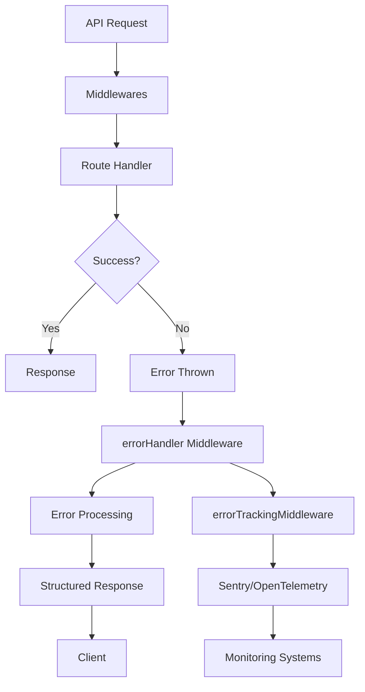
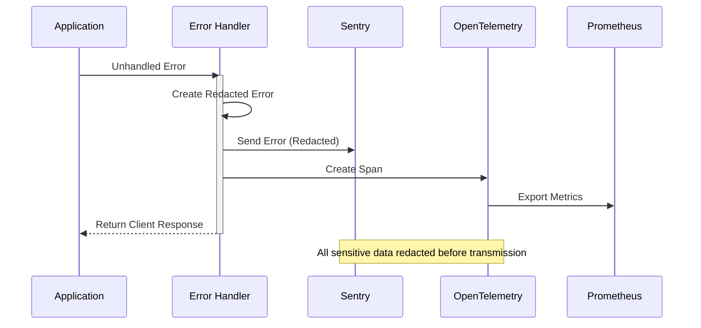
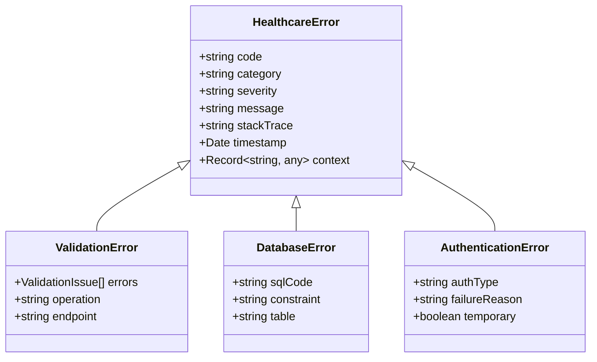
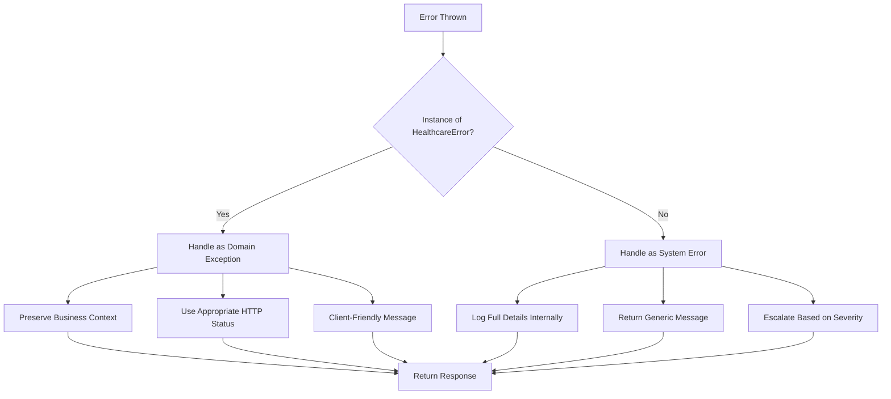
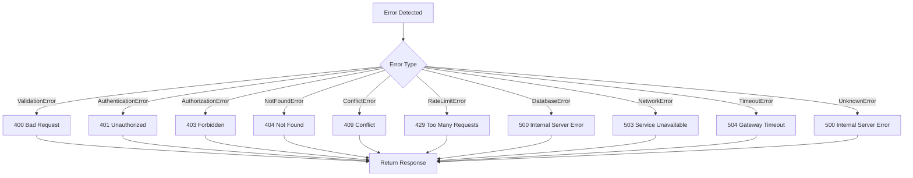
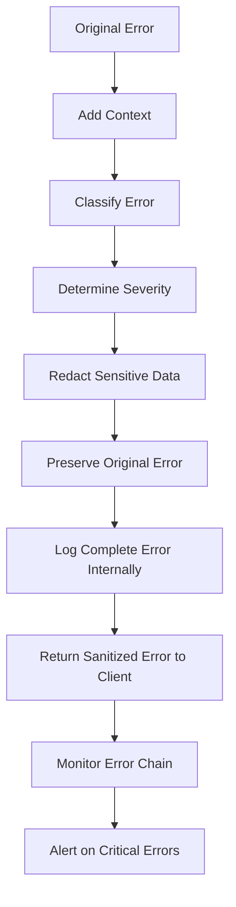
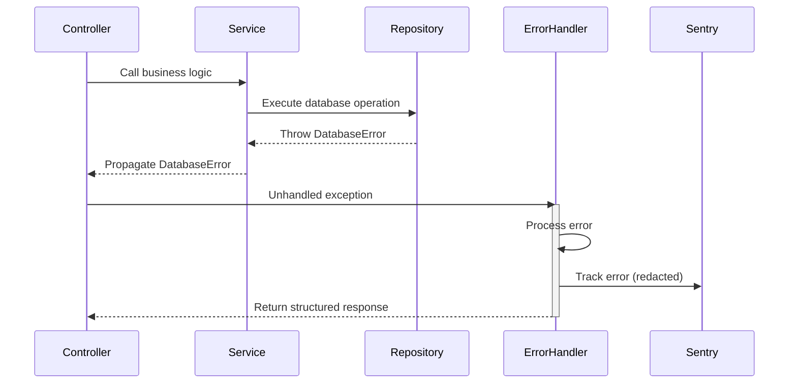
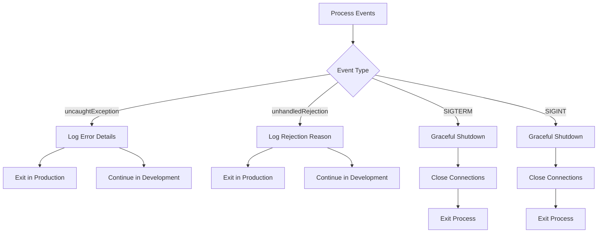

# Error Handling

<cite>
**Referenced Files in This Document **
- [error-handler.ts](file://apps/api/src/middleware/error-handler.ts)
- [error-sanitization.ts](file://apps/api/src/middleware/error-sanitization.ts)
- [http-error-handling.ts](file://apps/api/src/middleware/http-error-handling.ts)
- [error-tracking.ts](file://apps/api/src/middleware/error-tracking.ts)
- [error-tracking.ts](file://apps/api/src/services/error-tracking.ts)
- [error-tracking.ts](file://apps/api/src/config/error-tracking.ts)
</cite>

## Table of Contents

1. [Introduction](#introduction)
2. [Centralized Error Handling Architecture](#centralized-error-handling-architecture)
3. [Error Classification System](#error-classification-system)
4. [Structured Error Responses](#structured-error-responses)
5. [Error Sanitization and Data Protection](#error-sanitization-and-data-protection)
6. [Error Tracking and Monitoring](#error-tracking-and-monitoring)
7. [Domain Exceptions vs System Errors](#domain-exceptions-vs-system-errors)
8. [HTTP Status Code Mapping](#http-status-code-mapping)
9. [Common Issues and Solutions](#common-issues-and-solutions)
10. [Global Error Handlers](#global-error-handlers)

## Introduction

The neonpro backend implements a comprehensive error handling system designed specifically for healthcare applications with strict LGPD compliance requirements. The system features middleware-based interception, structured error responses, sensitive data redaction, and integration with monitoring tools like Sentry and OpenTelemetry. This documentation details the architecture, implementation patterns, and best practices for error handling across the platform.

## Centralized Error Handling Architecture

The error handling system is built around a middleware-based interception pattern that captures errors at multiple levels of the application stack. The primary entry point is the `errorHandler` middleware which serves as the global exception catcher for all API routes.



**Diagram sources **

- [error-handler.ts](file://apps/api/src/middleware/error-handler.ts#L1-L46)
- [error-tracking.ts](file://apps/api/src/middleware/error-tracking.ts#L1-L113)

**Section sources**

- [error-handler.ts](file://apps/api/src/middleware/error-handler.ts#L1-L46)
- [http-error-handling.ts](file://apps/api/src/middleware/http-error-handling.ts#L1-L254)

## Error Classification System

The system implements a sophisticated error classification mechanism that categorizes errors by type and severity. Errors are classified into healthcare-specific categories such as patient data exposure, LGPD compliance issues, and unauthorized access, with corresponding severity levels.

### Error Severity Levels

The severity classification follows a four-tier system:

| Severity Level | Description                                                                      | Response Required                               |
| -------------- | -------------------------------------------------------------------------------- | ----------------------------------------------- |
| critical       | Patient data exposure, LGPD violations, security breaches                        | Immediate response required, incident reporting |
| high           | Unauthorized access attempts, data integrity issues, service outages             | High priority response within 1 hour            |
| medium         | Performance degradation, database connectivity issues, external service failures | Response within 4 hours                         |
| low            | Validation errors, rate limit exceeded, configuration issues                     | Response within 24 hours                        |

### Healthcare Error Types

The system recognizes 15 distinct error types specific to healthcare applications:

```mermaid
graph TD
A[Healthcare Error Types] --> B[data_access_violation]
A --> C[lgpd_compliance_issue]
A --> D[patient_data_exposure]
A --> E[unauthorized_access]
A --> F[data_integrity_violation]
A --> G[performance_degradation]
A --> H[service_unavailable]
A --> I[validation_error]
A --> J[business_logic_error]
A --> K[external_service_error]
A --> L[database_error]
A --> M[authentication_error]
A --> N[authorization_error]
A --> O[rate_limit_exceeded]
A --> P[configuration_error]
```



**Diagram sources **

- [error-tracking.ts](file://apps/api/src/services/error-tracking.ts#L1-L618)
- [error-tracking.ts](file://apps/api/src/config/error-tracking.ts#L1-L287)

**Section sources**

- [error-tracking.ts](file://apps/api/src/services/error-tracking.ts#L1-L618)

## Structured Error Responses

The system returns standardized error responses that include essential information while protecting sensitive data. All error responses follow a consistent JSON structure regardless of the underlying error type.

### Response Format

```json
{
  "error": {
    "message": "User-friendly error message",
    "status": 500,
    "code": "INTERNAL_ERROR"
  },
  "requestId": "unique-request-identifier",
  "timestamp": "ISO8601 timestamp"
}
```

### Client-Friendly Message Formatting

Error messages are tailored based on severity and environment:

- **Critical errors**: Generic messages like "System temporarily unavailable" to prevent information leakage
- **High/Medium errors**: Descriptive but non-technical messages explaining what went wrong
- **Low severity errors**: Specific guidance on how to correct the issue
- **Development environment**: Detailed error messages including stack traces
- **Production environment**: Minimal information to prevent sensitive data exposure

```mermaid
flowchart TD
A[Error Occurs] --> B{Severity Level}
B --> |Critical| C[Generic Message<br>"Sistema temporariamente indisponível"]
B --> |High/Medium| D[Descriptive Message<br>Explaining issue without technical details]
B --> |Low| E[Specific Guidance<br>How to fix the problem]
B --> |Development| F[Detailed Message<br>With stack trace and context]
B --> |Production| G[Minimal Information<br>Preventing data exposure]
C --> H[Return Response]
D --> H
E --> H
F --> H
G --> H
```

**Diagram sources **

- [http-error-handling.ts](file://apps/api/src/middleware/http-error-handling.ts#L1-L254)
- [error-handler.ts](file://apps/api/src/middleware/error-handler.ts#L1-L46)

**Section sources**

- [http-error-handling.ts](file://apps/api/src/middleware/http-error-handling.ts#L1-L254)

## Error Sanitization and Data Protection

The system implements comprehensive data protection measures to prevent sensitive healthcare information from being exposed in error messages and logs.

### Sensitive Data Redaction

The `errorSanitizationMiddleware` automatically redacts sensitive information from error messages and contexts using pattern matching:

```mermaid
flowchart TD
A[Error Object] --> B{Contains Sensitive Data?}
B --> |Yes| C[Apply Redaction Patterns]
C --> D[CPF/CNPJ: XXX.XXX.XXX-XX → [CPF_REDACTED]]
C --> E[Email: user@domain.com → [EMAIL_REDACTED]]
C --> F[Phone: +55 (11) 99999-9999 → [PHONE_REDACTED]]
C --> G[Credit Card: 4111 1111 1111 1111 → [CARD_REDACTED]]
C --> H[Password/Token: secret → [REDACTED]]
B --> |No| I[Proceed Normally]
D --> J[Sanitized Error]
E --> J
F --> J
G --> J
H --> J
I --> J
J --> K[Log/Send Error]
```

### Protected Data Categories

The system protects the following categories of sensitive information:

- **Authentication & Security**: passwords, tokens, secrets, keys, authorization headers
- **Personal Identifiers**: CPF, CNPJ, RG, CNS (Cartão Nacional de Saúde), email, phone numbers
- **Healthcare Data**: prontuário (medical records), diagnosis, medications, treatments
- **Financial Information**: credit/debit cards, bank accounts, PIX transactions

**Diagram sources **

- [error-sanitization.ts](file://apps/api/src/middleware/error-sanitization.ts#L1-L147)
- [error-tracking.ts](file://apps/api/src/services/error-tracking.ts#L1-L618)

**Section sources**

- [error-sanitization.ts](file://apps/api/src/middleware/error-sanitization.ts#L1-L147)

## Error Tracking and Monitoring

The error tracking system integrates with both Sentry and OpenTelemetry to provide comprehensive monitoring while maintaining healthcare data privacy.

### Integration Architecture



### Configuration Settings

The error tracking configuration includes healthcare-specific settings:

```typescript
export const errorTrackingConfig = {
  sentry: {
    enabled: !!sentryDsn,
    dsn: sentryDsn,
    environment: process.env.NODE_ENV || 'development',
    release: serviceVersion,
  },
  openTelemetry: {
    enabled: true,
    serviceName,
    serviceVersion,
    endpoint: openTelemetryEndpoint,
  },
  healthcare: {
    lgpdCompliant: true,
    dataMasking: true,
    auditLogging: true,
    region: 'brazil',
  },
  performance: {
    sampleRate: isProduction ? 0.1 : 1.0,
    tracesSampleRate: isProduction ? 0.01 : 0.1,
    metricsEnabled: true,
  },
}
```

**Diagram sources **

- [error-tracking.ts](file://apps/api/src/config/error-tracking.ts#L1-L287)
- [error-tracking.ts](file://apps/api/src/services/error-tracking.ts#L1-L618)

**Section sources**

- [error-tracking.ts](file://apps/api/src/config/error-tracking.ts#L1-L287)

## Domain Exceptions vs System Errors

The system distinguishes between domain-specific exceptions and general system errors, handling each appropriately.

### Domain Exception Pattern

Domain exceptions represent business rule violations and are thrown intentionally:



### Error Handling Flow



**Diagram sources **

- [error-tracking.ts](file://apps/api/src/services/error-tracking.ts#L1-L618)
- [error-handler.ts](file://apps/api/src/middleware/error-handler.ts#L1-L46)

**Section sources**

- [error-tracking.ts](file://apps/api/src/services/error-tracking.ts#L1-L618)

## HTTP Status Code Mapping

The system implements proper HTTP status code mapping based on error types, ensuring clients receive appropriate responses.

### Status Code Rules

| Error Type              | HTTP Status | Error Code          | Example Scenario                   |
| ----------------------- | ----------- | ------------------- | ---------------------------------- |
| Validation Error        | 400         | VALIDATION_ERROR    | Invalid patient data format        |
| Authentication Required | 401         | UNAUTHORIZED        | Missing or invalid JWT token       |
| Access Forbidden        | 403         | FORBIDDEN           | User lacks permission for resource |
| Not Found               | 404         | NOT_FOUND           | Patient record not found           |
| Conflict                | 409         | CONFLICT            | Duplicate patient registration     |
| Rate Limited            | 429         | TOO_MANY_REQUESTS   | Excessive API calls from client    |
| Internal Server Error   | 500         | INTERNAL_ERROR      | Unexpected server exception        |
| Service Unavailable     | 503         | SERVICE_UNAVAILABLE | Database connection failure        |
| Gateway Timeout         | 504         | GATEWAY_TIMEOUT     | External service timeout           |

### Status Code Determination Logic



**Diagram sources **

- [http-error-handling.ts](file://apps/api/src/middleware/http-error-handling.ts#L1-L254)
- [error-handler.ts](file://apps/api/src/middleware/error-handler.ts#L1-L46)

**Section sources**

- [http-error-handling.ts](file://apps/api/src/middleware/http-error-handling.ts#L1-L254)

## Common Issues and Solutions

The system addresses common error handling challenges with specific solutions.

### Error Masking Prevention

To prevent error masking, the system uses a layered approach:



### Sensitive Information Leakage

Multiple safeguards prevent sensitive data exposure:

1. **Request-level sanitization**: Remove sensitive headers from tracing
2. **Response-level sanitization**: Redact sensitive fields in error messages
3. **Logging sanitization**: Apply redaction patterns to all log entries
4. **Monitoring sanitization**: Filter sensitive data before sending to external services

### Proper Error Propagation

The system ensures errors are properly propagated through the call stack:



**Section sources**

- [error-sanitization.ts](file://apps/api/src/middleware/error-sanitization.ts#L1-L147)
- [error-tracking.ts](file://apps/api/src/services/error-tracking.ts#L1-L618)

## Global Error Handlers

The system configures global handlers for uncaught exceptions and promise rejections to ensure no error goes unhandled.

### Process-Level Handlers



### Handler Implementation

The global error handlers are configured during application startup:

```typescript
export function setupGlobalErrorHandlers(): void {
  // Handle uncaught exceptions
  process.on('uncaughtException', (error: Error) => {
    logger.error('Uncaught Exception', {
      error: error.message,
      stack: error.stack,
      type: 'uncaughtException',
    })

    if (process.env.NODE_ENV === 'production') {
      process.exit(1)
    }
  })

  // Handle unhandled promise rejections
  process.on('unhandledRejection', (reason: unknown) => {
    logger.error('Unhandled Promise Rejection', {
      reason: reason instanceof Error ? reason.message : String(reason),
      stack: reason instanceof Error ? reason.stack : undefined,
      type: 'unhandledRejection',
    })

    if (process.env.NODE_ENV === 'production') {
      process.exit(1)
    }
  })
}
```

**Section sources**

- [error-tracking.ts](file://apps/api/src/middleware/error-tracking.ts#L1-L113)
