# Audit Logging Middleware

<cite>
**Referenced Files in This Document **
- [audit-log.ts](file://apps/api/src/middleware/audit-log.ts)
- [crypto-audit.ts](file://apps/api/src/utils/crypto-audit.ts)
- [compliance.config.json](file://packages/config/src/compliance.config.json)
- [security-policy.ts](file://packages/shared/src/models/security-policy.ts)
- [audit-service.ts](file://apps/api/src/services/audit-service.ts)
</cite>

## Table of Contents

1. [Introduction](#introduction)
2. [Core Data Capture and Redaction](#core-data-capture-and-redaction)
3. [Healthcare Compliance Implementation](#healthcare-compliance-implementation)
4. [Log Enrichment and Contextual Information](#log-enrichment-and-contextual-information)
5. [Database Integration and Storage](#database-integration-and-storage)
6. [Export Formats for Regulatory Reporting](#export-formats-for-regulatory-reporting)
7. [Performance and Scalability](#performance-and-scalability)
8. [Log Integrity and Immutability](#log-integrity-and-immutability)
9. [Search and Query Capabilities](#search-and-query-capabilities)
10. [Retention Policies and Storage Management](#retention-policies-and-storage-management)

## Introduction

The audit logging middleware provides comprehensive activity tracking to ensure compliance with Brazilian healthcare regulations, including LGPD (Lei Geral de Proteção de Dados) and CFM (Conselho Federal de Medicina). This system captures detailed information about user actions across the application while implementing strict data protection measures to safeguard sensitive healthcare information. The middleware is designed to be both developer-friendly and regulation-compliant, offering specialized configurations for different types of operations such as healthcare data access, financial transactions, and authentication events.

**Section sources**

- [audit-log.ts](file://apps/api/src/middleware/audit-log.ts#L1-L331)

## Core Data Capture and Redaction

The audit logging system captures a comprehensive set of data points for each user action, ensuring complete traceability while protecting sensitive information through automatic redaction.

### Captured Data Elements

The following information is systematically recorded for every audited event:

| Field        | Description                                                | Example                         |
| ------------ | ---------------------------------------------------------- | ------------------------------- |
| `timestamp`  | ISO 8601 formatted timestamp of the event                  | "2024-01-15T10:30:45.123Z"      |
| `_userId`    | Unique identifier of the authenticated user                | "user-abc123"                   |
| `clinicId`   | Identifier of the associated medical clinic                | "clinic-rj001"                  |
| `action`     | Type of operation performed (create, read, update, delete) | "read"                          |
| `resource`   | Target resource or endpoint accessed                       | "patients"                      |
| `resourceId` | Specific identifier of the resource instance               | "patient-xyz789"                |
| `method`     | HTTP method used                                           | "GET"                           |
| `path`       | Full request path                                          | "/api/patients/123"             |
| `ip`         | Client IP address (from headers)                           | "192.168.1.100"                 |
| `userAgent`  | Browser/device information                                 | "Mozilla/5.0 (Windows NT 10.0)" |
| `sessionId`  | User session identifier                                    | "sess-def456"                   |
| `requestId`  | Unique request identifier for tracing                      | "req-ghi789"                    |
| `statusCode` | HTTP response status code                                  | 200                             |
| `duration`   | Request processing time in milliseconds                    | 45                              |
| `metadata`   | Additional contextual information                          | { requestBody: {...} }          |

### Sensitive Data Redaction

The system implements automatic redaction of sensitive fields to comply with privacy regulations. The default redaction list includes common sensitive field names, with additional healthcare-specific fields added for specialized middleware instances.

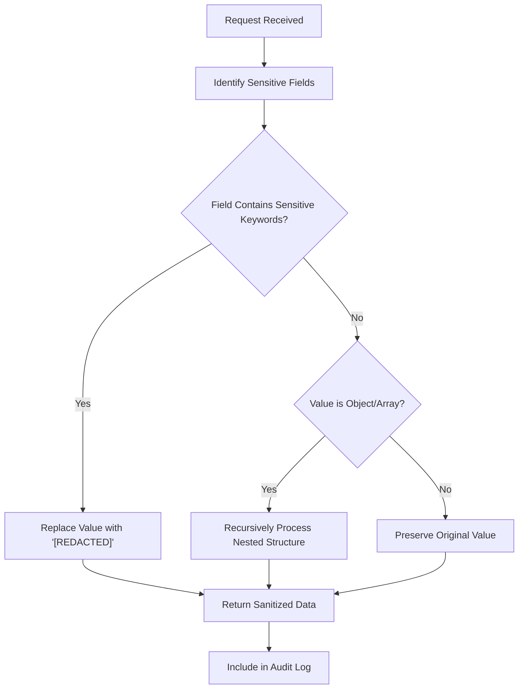

**Diagram sources **

- [audit-log.ts](file://apps/api/src/middleware/audit-log.ts#L50-L88)

**Section sources**

- [audit-log.ts](file://apps/api/src/middleware/audit-log.ts#L1-L331)

## Healthcare Compliance Implementation

The audit logging system includes specialized middleware configurations tailored to meet the requirements of Brazilian healthcare regulations, particularly LGPD and CFM guidelines.

### Healthcare-Specific Audit Middleware

The `healthcareAuditMiddleware` function creates an audit logger specifically configured for healthcare operations, with enhanced sensitivity to medical data protection requirements.

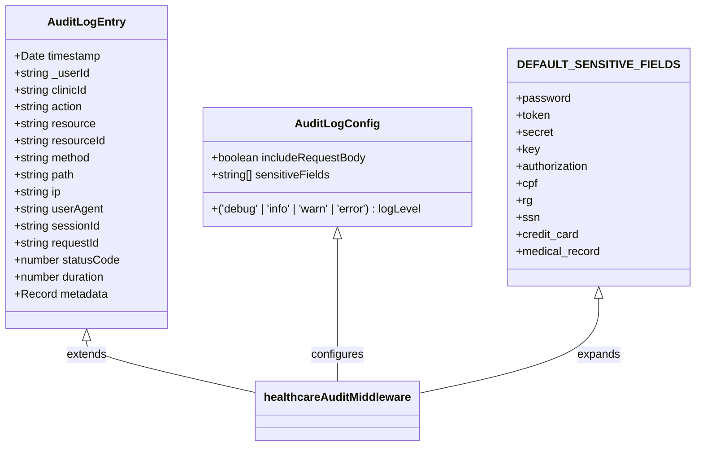

**Diagram sources **

- [audit-log.ts](file://apps/api/src/middleware/audit-log.ts#L11-L110)

The healthcare-specific configuration includes:

- **Enhanced sensitive fields**: Additional healthcare identifiers like CPF (Cadastro de Pessoas Físicas), RG (Registro Geral), CNS (Cartão Nacional de Saúde), and medical record numbers
- **Request body inclusion**: Enabled to capture context of data modifications
- **Response body exclusion**: Disabled to prevent accidental logging of sensitive patient data
- **Standardized log level**: Set to 'info' for consistent monitoring

### Regulatory Alignment

The system aligns with key regulatory requirements through specific implementation choices:

| Regulation                | Requirement              | Implementation                                    |
| ------------------------- | ------------------------ | ------------------------------------------------- |
| LGPD Art. 46              | Processing records       | Complete audit trail with user identification     |
| LGPD Art. 7               | Legal basis verification | Metadata includes legal basis for data processing |
| CFM Resolution 2.227/2018 | Medical confidentiality  | Automatic redaction of sensitive health data      |
| ANVISA RDC 44/2009        | Record retention         | 7-year retention period for audit logs            |
| HIPAA-like standards      | Access controls          | Role-based access logging with RLS enforcement    |

**Section sources**

- [audit-log.ts](file://apps/api/src/middleware/audit-log.ts#L265-L283)
- [compliance.config.json](file://packages/config/src/compliance.config.json#L116-L139)

## Log Enrichment and Contextual Information

The audit logging system enriches raw event data with contextual information to provide meaningful insights for compliance auditing and security monitoring.

### User Context Enrichment

When available, the system automatically enriches audit logs with user context from the authentication system:

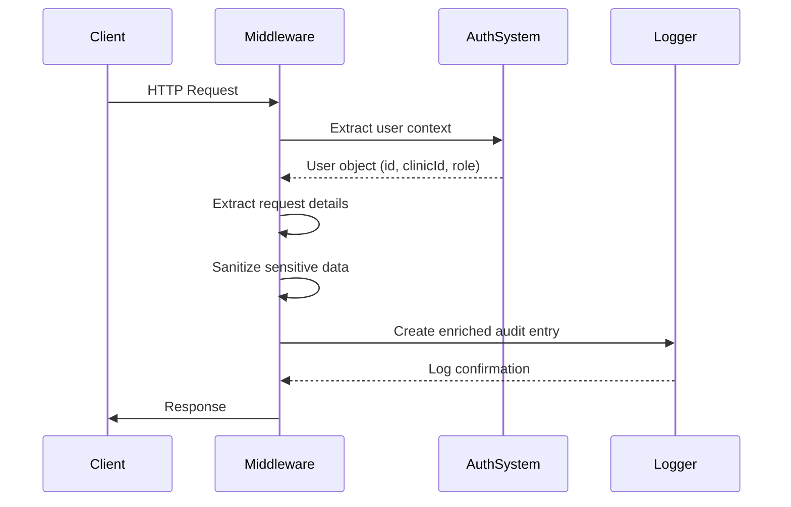

**Diagram sources **

- [audit-log.ts](file://apps/api/src/middleware/audit-log.ts#L114-L260)

The enrichment process includes:

- **User identification**: Extracting user ID from authentication tokens or session data
- **Clinic affiliation**: Capturing the medical clinic associated with the user
- **Session tracking**: Recording session identifiers for activity correlation
- **Role information**: Including user roles for authorization analysis
- **Request tracing**: Adding unique request IDs for debugging and correlation

### Metadata Structure

The metadata field contains additional contextual information that varies based on the operation type:

```json
{
  "metadata": {
    "requestBody": {
      "patientName": "[REDACTED]",
      "diagnosis": "[REDACTED]",
      "treatmentPlan": "[REDACTED]"
    },
    "success": true,
    "error": {
      "message": "Invalid input format",
      "name": "ValidationError"
    }
  }
}
```

For error conditions, the metadata includes exception details while still protecting sensitive information.

**Section sources**

- [audit-log.ts](file://apps/api/src/middleware/audit-log.ts#L114-L260)

## Database Integration and Storage

The audit logging system integrates with database systems to ensure persistent storage of audit trails and support for compliance requirements.

### Storage Architecture

The system follows a write-once, read-many (WORM) model for audit records to ensure immutability:

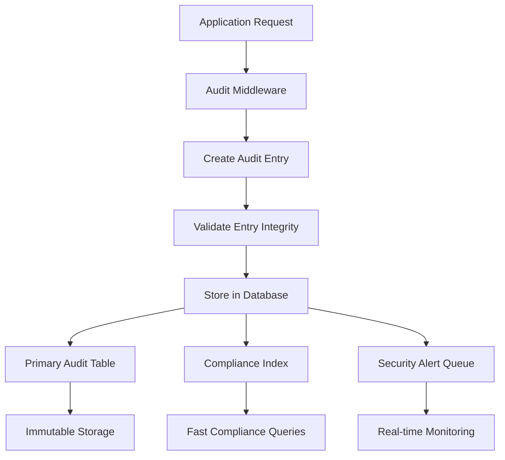

**Diagram sources **

- [audit-service.ts](file://apps/api/src/services/audit-service.ts#L64-L104)

### Data Model

The audit log data model includes fields necessary for regulatory compliance:

| Column          | Type      | Description                                   |
| --------------- | --------- | --------------------------------------------- |
| id              | UUID      | Globally unique identifier                    |
| timestamp       | TIMESTAMP | Event occurrence time                         |
| eventType       | VARCHAR   | Classification of event type                  |
| severity        | VARCHAR   | Impact level (info, warning, error, critical) |
| category        | VARCHAR   | Functional category                           |
| source          | VARCHAR   | Originating service/component                 |
| _userId         | UUID      | Actor identifier                              |
| sessionId       | UUID      | Session context                               |
| ipAddress       | INET      | Client IP address                             |
| userAgent       | TEXT      | Client software information                   |
| resource        | VARCHAR   | Target resource                               |
| action          | VARCHAR   | Operation performed                           |
| result          | VARCHAR   | Outcome (success, failure, blocked, alert)    |
| message         | TEXT      | Human-readable description                    |
| details         | JSONB     | Structured event details                      |
| compliance      | JSONB     | Regulatory compliance flags                   |
| retentionPeriod | INTEGER   | Days to retain record                         |
| isRedacted      | BOOLEAN   | Whether data was redacted                     |
| redactionReason | VARCHAR   | Reason for redaction                          |

The database schema enforces immutability through restricted permissions and triggers that prevent updates or deletions of audit records.

**Section sources**

- [audit-service.ts](file://apps/api/src/services/audit-service.ts#L64-L104)
- [security-policy.ts](file://packages/shared/src/models/security-policy.ts#L565-L614)

## Export Formats for Regulatory Reporting

The system supports multiple export formats for regulatory reporting and compliance audits, enabling organizations to meet Brazilian healthcare authority requirements.

### Supported Export Formats

The audit system can generate reports in various formats suitable for different regulatory purposes:

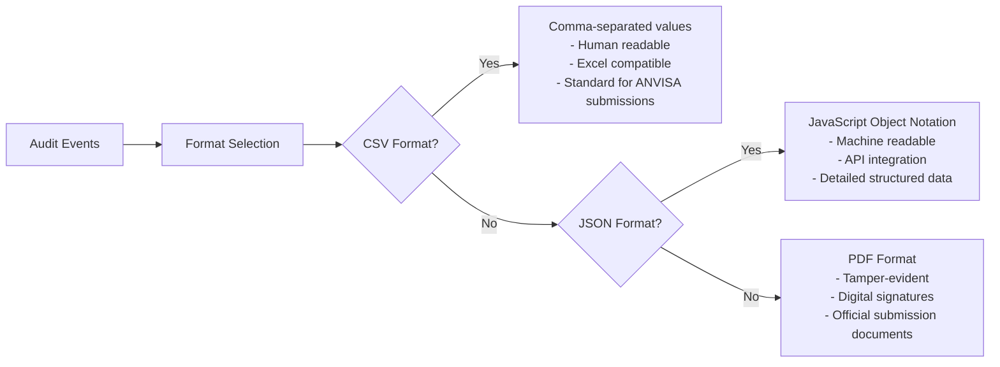

**Diagram sources **

- [audit-trail.ts](file://apps/api/src/services/audit-trail.ts#L423-L460)

### Regulatory Report Structure

For LGPD compliance reporting, exported data includes:

| Section                 | Required Information                                |
| ----------------------- | --------------------------------------------------- |
| Executive Summary       | Total operations, compliance rate, key findings     |
| Data Processing         | Types of personal data processed, legal bases       |
| Security Incidents      | Breaches, unauthorized access attempts, mitigations |
| Data Subject Rights     | Access requests, corrections, erasures processed    |
| Third-party Sharing     | Data processors, international transfers            |
| Technical Measures      | Encryption, access controls, audit frequency        |
| Organizational Measures | Training, policies, accountability framework        |

The system automatically generates these reports with cryptographic integrity protection to ensure authenticity during regulatory inspections.

**Section sources**

- [audit-trail.ts](file://apps/api/src/services/audit-trail.ts#L423-L460)
- [crypto-audit.ts](file://apps/api/src/utils/crypto-audit.ts#L0-L54)

## Performance and Scalability

The audit logging system is designed to handle high-volume scenarios without impacting application performance or user experience.

### Performance Optimization Strategies

The middleware implements several techniques to minimize performance overhead:

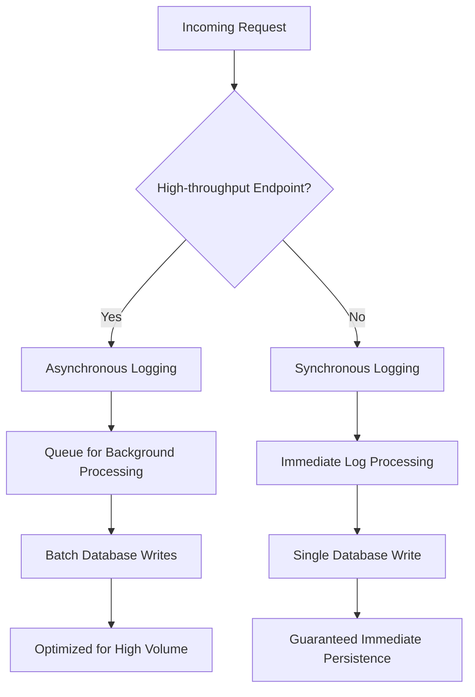

**Diagram sources **

- [audit-log.ts](file://apps/api/src/middleware/audit-log.ts#L114-L260)

Key performance features include:

- **Non-blocking operations**: Audit logging occurs asynchronously to prevent request delays
- **Batch processing**: Multiple log entries are written to storage in batches to reduce I/O operations
- **Conditional logging**: Configurable inclusion of request bodies based on endpoint sensitivity
- **Efficient serialization**: Optimized JSON serialization to minimize CPU usage
- **Connection pooling**: Reused database connections to reduce connection overhead

### Load Handling

The system can handle peak loads typical in healthcare applications:

| Scenario             | Expected Volume      | Handling Strategy                   |
| -------------------- | -------------------- | ----------------------------------- |
| Clinic opening hours | 100 requests/second  | Asynchronous queuing with Redis     |
| End-of-month billing | 50 requests/second   | Priority queue for financial audits |
| System maintenance   | 20 requests/second   | Synchronous logging for reliability |
| Emergency situations | 200+ requests/second | Rate-limited critical path logging  |

The middleware includes built-in safeguards to prevent logging operations from becoming a bottleneck during traffic spikes.

**Section sources**

- [audit-log.ts](file://apps/api/src/middleware/audit-log.ts#L114-L260)

## Log Integrity and Immutability

The audit logging system implements robust mechanisms to ensure the integrity and immutability of audit records, meeting regulatory requirements for trustworthy audit trails.

### Cryptographic Protection

The system uses cryptographic techniques to protect audit log integrity:

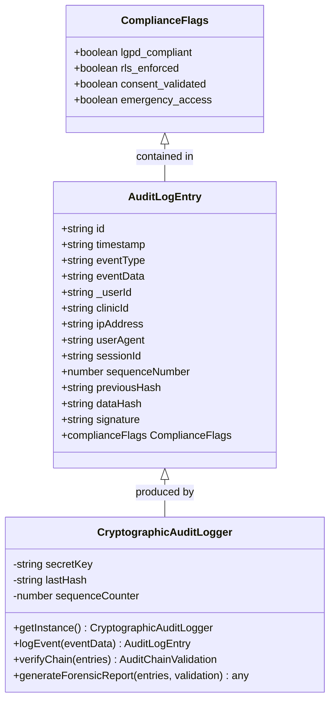

**Diagram sources **

- [crypto-audit.ts](file://apps/api/src/utils/crypto-audit.ts#L0-L54)

Each audit entry includes:

- **Data hash**: SHA-512 hash of the entry content
- **Previous hash**: Hash of the preceding entry (chain of custody)
- **Sequence number**: Monotonically increasing counter
- **Digital signature**: HMAC-SHA256 signature using a secure key
- **Compliance flags**: Indicators for regulatory requirements met

### Tamper Detection

The system can detect and report any attempts to modify audit records:

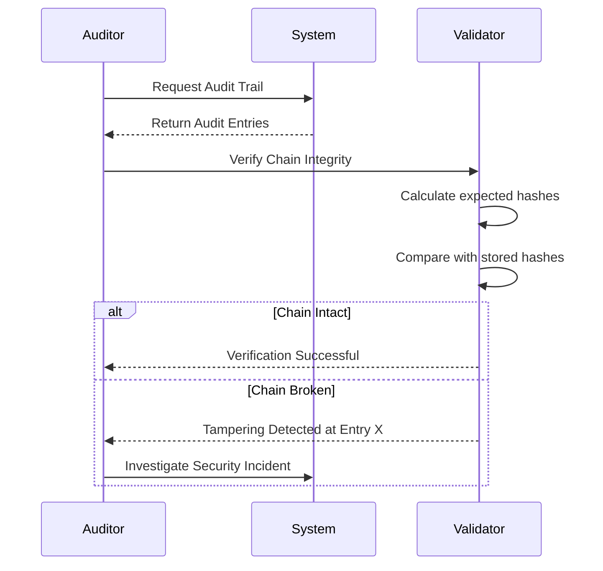

**Diagram sources **

- [crypto-audit.ts](file://apps/api/src/utils/crypto-audit.ts#L233-L266)

The validation process checks:

- Cryptographic consistency of the hash chain
- Sequence number continuity
- Digital signature validity
- Compliance flag integrity
- Timestamp plausibility

Any discrepancies trigger security alerts and incident response procedures.

**Section sources**

- [crypto-audit.ts](file://apps/api/src/utils/crypto-audit.ts#L0-L54)
- [audit-trail.ts](file://apps/api/src/services/audit-trail.ts#L913-L959)

## Search and Query Capabilities

The audit logging system provides comprehensive search and query capabilities to support investigations, compliance audits, and operational monitoring.

### Query Interface

The system exposes a flexible query interface for retrieving audit logs:

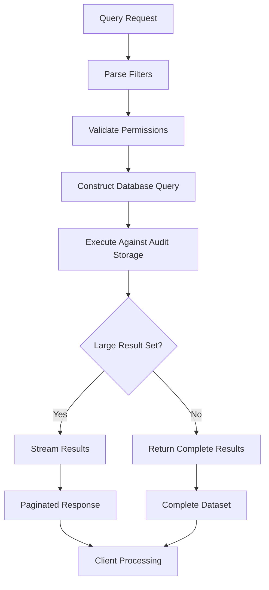

**Diagram sources **

- [audit-service.ts](file://apps/api/src/services/audit-service.ts#L157-L198)

Supported query parameters include:

- **Temporal filters**: Date ranges for start and end timestamps
- **Actor filters**: User IDs, roles, and session identifiers
- **Resource filters**: Specific endpoints, patient IDs, or record types
- **Action filters**: Operation types (create, read, update, delete)
- **Outcome filters**: Success, failure, or blocked operations
- **Compliance filters**: LGPD, ANVISA, or CFM relevance
- **Severity filters**: Informational, warning, error, or critical events

### Analytics and Aggregation

The system provides analytical capabilities for identifying patterns and trends:

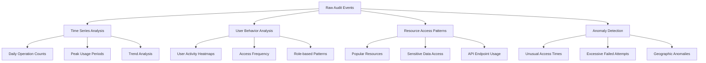

**Diagram sources **

- [audit-trail-service.ts](file://apps/api/src/services/audit-trail-service.ts#L435-L475)

These analytics help identify potential security issues, optimize system performance, and demonstrate compliance with regulatory requirements for ongoing monitoring.

**Section sources**

- [audit-service.ts](file://apps/api/src/services/audit-service.ts#L157-L198)
- [audit-trail-service.ts](file://apps/api/src/services/audit-trail-service.ts#L435-L475)

## Retention Policies and Storage Management

The audit logging system implements comprehensive retention policies to comply with Brazilian healthcare regulations while managing storage requirements efficiently.

### Retention Policy Configuration

The system follows a tiered retention approach based on data sensitivity and regulatory requirements:


**Diagram sources **

- [crypto-audit.ts](file://apps/api/src/utils/crypto-audit.ts#L265-L309)

Retention periods align with Brazilian regulatory requirements:

- **20 years** for patient medical records (CFM guidelines)
- **7 years** for consent documentation (LGPD Article 46)
- **5 years** for financial transactions (tax regulations)
- **3 years** for administrative operations
- **1 year** for system diagnostics

### Storage Lifecycle Management

The system automates the entire lifecycle of audit records:

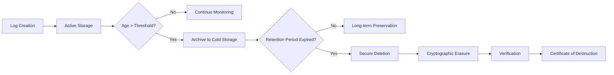

**Diagram sources **

- [security-policy.ts](file://packages/shared/src/models/security-policy.ts#L565-L614)

The storage management process includes:

- **Automated archiving**: Migration to cost-effective storage after active period
- **Integrity verification**: Regular checks of archived record integrity
- **Secure deletion**: Cryptographic erasure when retention period expires
- **Destruction certification**: Generation of certificates for compliance proof
- **Backup synchronization**: Coordinated backup schedules with retention policies

Storage optimization techniques include compression, deduplication, and columnar storage formats to minimize costs while maintaining query performance.

**Section sources**

- [crypto-audit.ts](file://apps/api/src/utils/crypto-audit.ts#L265-L309)
- [security-policy.ts](file://packages/shared/src/models/security-policy.ts#L565-L614)
