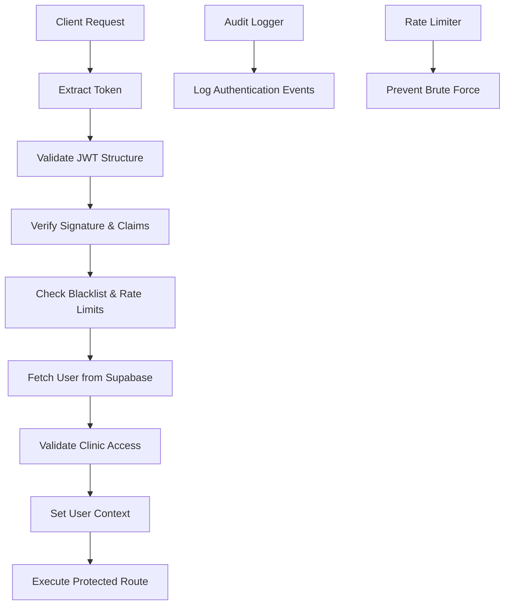
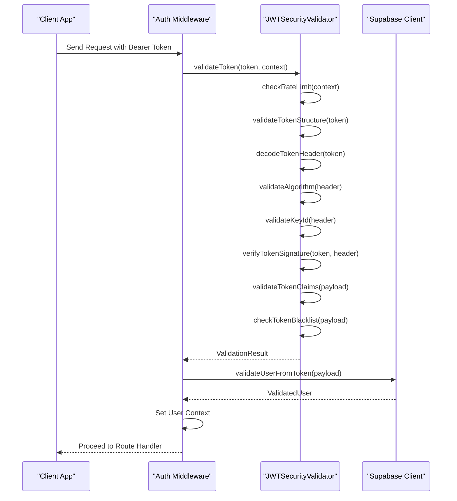
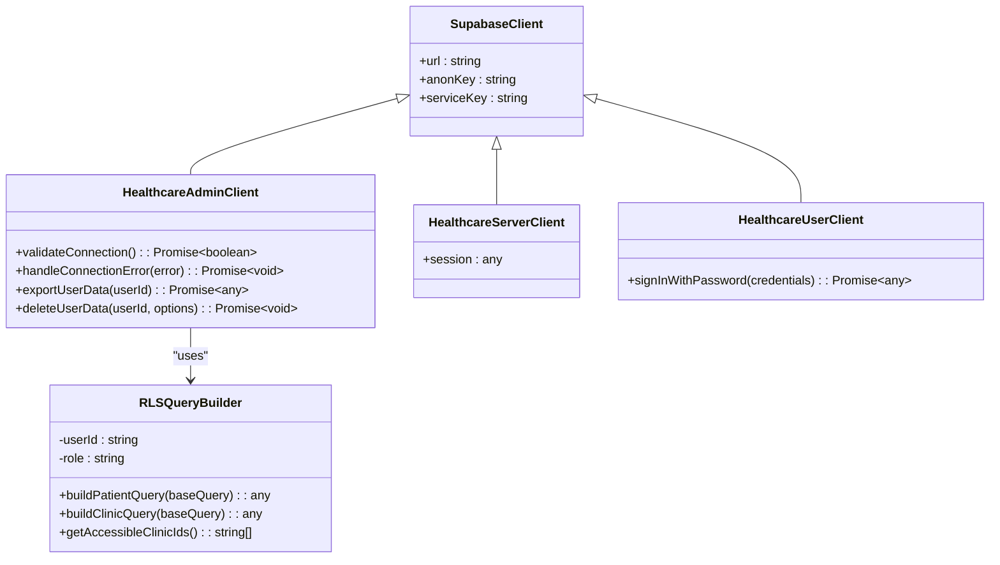
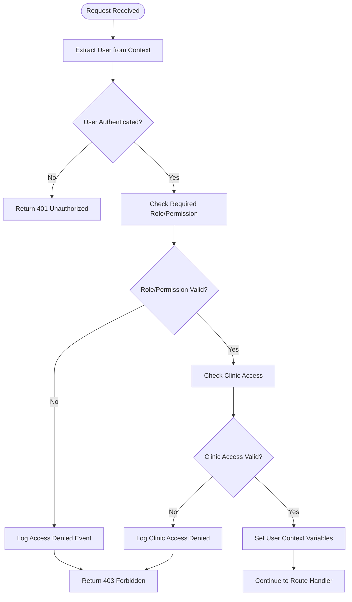
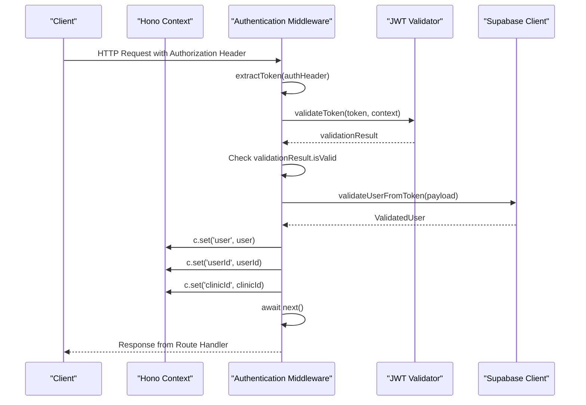
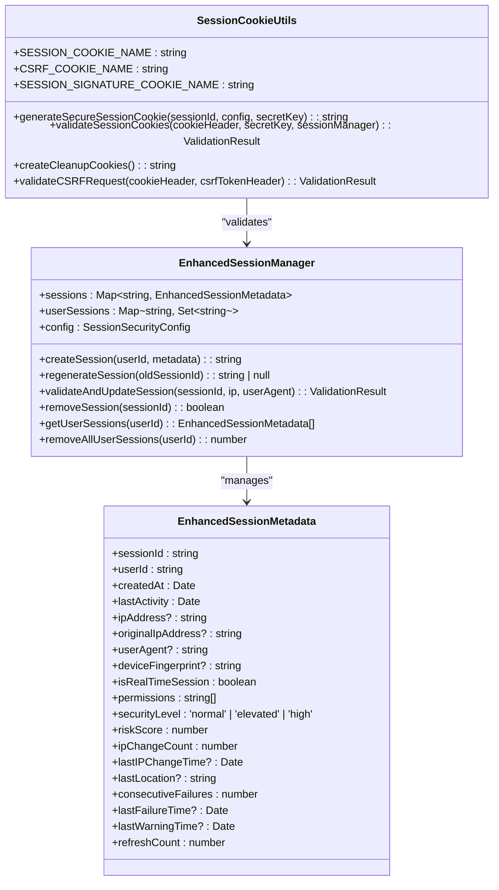
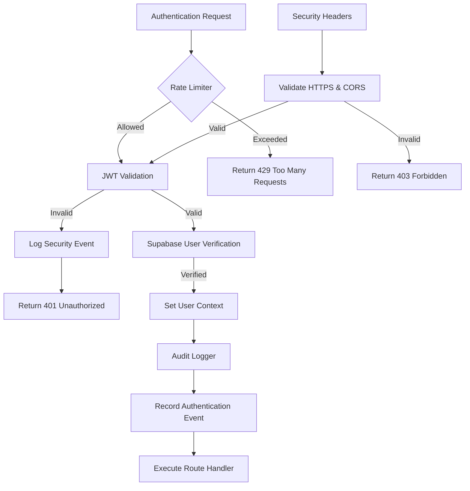

# Authentication Middleware

<cite>
**Referenced Files in This Document**
- [auth.ts](file://apps/api/src/middleware/auth.ts)
- [authn.ts](file://apps/api/src/middleware/authn.ts)
- [jwt-validator.ts](file://apps/api/src/security/jwt-validator.ts)
- [supabase.ts](file://apps/api/src/clients/supabase.ts)
- [session-cookie-utils.ts](file://apps/api/src/security/session-cookie-utils.ts)
- [enhanced-session-manager.ts](file://apps/api/src/security/enhanced-session-manager.ts)
- [audit-log.ts](file://apps/api/src/middleware/audit-log.ts)
- [rate-limit.ts](file://apps/api/src/middleware/rate-limit.ts)
</cite>

## Table of Contents

1. [Introduction](#introduction)
2. [Core Architecture](#core-architecture)
3. [JWT Validation Process](#jwt-validation-process)
4. [Supabase Integration](#supabase-integration)
5. [Role-Based Access Control](#role-based-access-control)
6. [Request Flow and Context Population](#request-flow-and-context-population)
7. [Protected Route Implementation](#protected-route-implementation)
8. [Session Management](#session-management)
9. [Security Component Integration](#security-component-integration)
10. [Common Issues and Troubleshooting](#common-issues-and-troubleshooting)

## Introduction

The authentication middleware component provides a comprehensive security framework for the NeonPro healthcare platform, implementing JWT validation, Supabase integration, and role-based access control patterns. Built on the Hono.js framework, this middleware ensures secure access to protected resources while maintaining compliance with healthcare regulations such as LGPD and ANVISA.

The system follows a layered security approach, combining token validation, database verification, and contextual authorization to protect sensitive medical data. It supports both traditional session-based authentication and token-based authentication, providing flexibility for different client types and use cases.

This documentation explains the implementation details of the authentication system, covering the complete request flow from token extraction to user context population, and detailing how various security components work together to provide robust protection.

**Section sources**

- [auth.ts](file://apps/api/src/middleware/auth.ts#L1-L282)
- [authn.ts](file://apps/api/src/middleware/authn.ts#L1-L306)

## Core Architecture

The authentication system is built around a modular architecture that separates concerns between token validation, user verification, and access control. The core components include:

- **JWT Security Validator**: Comprehensive JWT validation following OWASP best practices
- **Authentication Middleware**: Token extraction and validation layer
- **Authorization Middleware**: Role and permission-based access control
- **Supabase Client Integration**: Database-backed user verification
- **Enhanced Session Manager**: Secure session management with anomaly detection
- **Audit Logging**: Comprehensive activity tracking for compliance

The architecture implements a defense-in-depth strategy, where each layer provides additional security checks to prevent unauthorized access. The system is designed to be extensible, allowing custom authentication strategies to be implemented while maintaining consistent security standards.



**Diagram sources**

- [authn.ts](file://apps/api/src/middleware/authn.ts#L1-L306)
- [jwt-validator.ts](file://apps/api/src/security/jwt-validator.ts#L1-L711)

**Section sources**

- [authn.ts](file://apps/api/src/middleware/authn.ts#L1-L306)
- [jwt-validator.ts](file://apps/api/src/security/jwt-validator.ts#L1-L711)

## JWT Validation Process

The JWT validation process implements comprehensive security checks following OWASP best practices and healthcare compliance requirements. The `JWTSecurityValidator` class performs multiple validation steps to ensure token integrity and authenticity.

### Validation Steps

1. **Rate Limiting Check**: Prevents brute force attacks by limiting authentication attempts
2. **Token Structure Validation**: Ensures proper JWT format with three base64-encoded parts
3. **Algorithm Validation**: Prevents algorithm confusion attacks by rejecting 'none' algorithm
4. **Key ID Validation**: Validates the presence and correctness of key identifiers
5. **Signature Verification**: Verifies token signature using appropriate secret keys
6. **Claim Validation**: Validates standard JWT claims (aud, iss, exp, sub)
7. **Blacklist Check**: Ensures tokens haven't been revoked or blacklisted
8. **Healthcare Requirements**: Validates healthcare-specific claims and roles

The validator uses a configurable security policy that can be adjusted based on environment and compliance requirements. In production, HTTPS enforcement is required, and strict algorithm policies prevent known vulnerabilities.



**Diagram sources**

- [jwt-validator.ts](file://apps/api/src/security/jwt-validator.ts#L1-L711)
- [authn.ts](file://apps/api/src/middleware/authn.ts#L1-L306)

**Section sources**

- [jwt-validator.ts](file://apps/api/src/security/jwt-validator.ts#L1-L711)

## Supabase Integration

The authentication system integrates with Supabase to provide database-backed user verification and multi-tenant isolation. The integration uses a three-tier client architecture with different privilege levels for various operations.

### Client Architecture

- **Admin Client**: Service-role authenticated client for administrative operations
- **Server Client**: SSR-capable client for server-side rendering
- **User Client**: Browser-capable client for client-side operations

The admin client has elevated privileges to perform user management operations, including creating and deleting users, exporting user data for LGPD compliance, and managing clinic memberships. The server and user clients have more limited permissions, focusing on data access within the user's authorized scope.

### Row Level Security (RLS)

The system implements healthcare-specific RLS policies to ensure data isolation between clinics and patients. The `healthcareRLS` helper functions validate access based on clinic membership and professional permissions:

- **Clinic Access**: Users can only access data from clinics they belong to
- **Patient Access**: Healthcare professionals can only access patients assigned to their clinics
- **Data Export**: Admins can export all user data for compliance purposes
- **Data Deletion**: Implements LGPD-compliant data deletion procedures

The integration also includes connection pooling and resource management to optimize database performance and prevent resource exhaustion.



**Diagram sources**

- [supabase.ts](file://apps/api/src/clients/supabase.ts#L1-L489)

**Section sources**

- [supabase.ts](file://apps/api/src/clients/supabase.ts#L1-L489)

## Role-Based Access Control

The authentication system implements a flexible role-based access control (RBAC) model that supports both role-based and permission-based authorization. The system defines several healthcare-specific roles and associated permissions to ensure appropriate access levels.

### Roles and Permissions

- **Patient**: Can access their own medical records and appointment information
- **Healthcare Professional**: Can access patient data within their clinic and update treatment plans
- **Staff**: Can manage appointments and billing information
- **Admin**: Full access to all system features and user management capabilities

Each role has a defined set of permissions that determine what actions the user can perform. The system supports both coarse-grained role checking and fine-grained permission checking, allowing for precise access control.

### Authorization Middleware

The authorization middleware provides several functions for enforcing access control:

- **requireRole()**: Ensures the user has one of the specified roles
- **requirePermission()**: Ensures the user has the required permission(s)
- **requireClinicAccess()**: Ensures the user can only access their clinic's data
- **requireAIAccess()**: Specialized middleware for AI feature access

The middleware automatically logs access denial events for audit purposes, capturing the user's role, required roles, and the requested resource.



**Diagram sources**

- [auth.ts](file://apps/api/src/middleware/auth.ts#L1-L282)

**Section sources**

- [auth.ts](file://apps/api/src/middleware/auth.ts#L1-L282)

## Request Flow and Context Population

The authentication middleware processes requests through a well-defined flow that extracts and validates authentication tokens, verifies user identity, and populates the request context with user information.

### Request Processing Flow

1. **Token Extraction**: Extract Bearer token from Authorization header
2. **JWT Validation**: Validate token structure, signature, and claims
3. **User Verification**: Fetch user data from Supabase using validated token
4. **Context Population**: Set user information in the Hono context
5. **Downstream Processing**: Pass control to the next middleware or route handler

During context population, the middleware sets several variables that are available to downstream handlers:

- **user**: Complete user object with ID, email, role, clinic ID, and name
- **userId**: User ID for convenience
- **clinicId**: Clinic ID for multi-tenant isolation
- **permissions**: Array of user permissions for fine-grained access control

The system handles both mandatory and optional authentication scenarios, allowing some routes to be accessible without authentication while still providing user context when available.



**Diagram sources**

- [authn.ts](file://apps/api/src/middleware/authn.ts#L1-L306)
- [auth.ts](file://apps/api/src/middleware/auth.ts#L1-L282)

**Section sources**

- [authn.ts](file://apps/api/src/middleware/authn.ts#L1-L306)

## Protected Route Implementation

The authentication middleware provides several ways to implement protected routes, ranging from simple authentication requirements to complex role-based access control.

### Basic Authentication

For routes requiring simple authentication, use the `authenticationMiddleware()` function:

```typescript
app.get('/protected', authenticationMiddleware(), async (c) => {
  const user = c.get('user');
  return c.json({ message: `Hello ${user.name}` });
});
```

### Role-Based Protection

For routes requiring specific roles, use the `requireAuth()` function with role parameters:

```typescript
app.get('/admin', requireAuth(['admin']), async (c) => {
  // Only accessible to admin users
  return c.json({ data: 'Admin data' });
});

app.get('/clinical', requireAuth(['healthcare_professional', 'staff']), async (c) => {
  // Accessible to healthcare professionals and staff
  return c.json({ data: 'Clinical data' });
});
```

### Permission-Based Protection

For fine-grained access control based on permissions:

```typescript
app.post('/ai/generate', requirePermission('ai_access'), async (c) => {
  // Only users with ai_access permission can use AI features
  return c.json({ result: 'AI generated content' });
});
```

### Optional Authentication

For routes that work with or without authentication:

```typescript
app.get('/profile', optionalAuth(), async (c) => {
  const user = c.get('user');
  if (user) {
    return c.json({ profile: user, authenticated: true });
  }
  return c.json({ message: 'Public profile', authenticated: false });
});
```

The system also supports combined authentication and authorization through specialized middleware like `requireAIAccess()` which combines permission checks with authentication.

**Section sources**

- [auth.ts](file://apps/api/src/middleware/auth.ts#L1-L282)

## Session Management

The authentication system includes a comprehensive session management solution that provides secure session handling with advanced security features.

### Enhanced Session Manager

The `EnhancedSessionManager` implements several security features:

- **IP Binding**: Sessions are bound to the user's IP address with tolerance for mobile network changes
- **Session Fixation Protection**: Session IDs are regenerated upon authentication
- **Concurrent Session Limits**: Limits the number of simultaneous sessions per user
- **Anomaly Detection**: Detects suspicious behavior like rapid IP changes
- **Timeout Controls**: Implements both idle and absolute session timeouts

### Secure Cookie Handling

The `SessionCookieUtils` class manages secure cookie creation and validation:

- **HttpOnly Flag**: Prevents client-side script access to session cookies
- **Secure Flag**: Ensures cookies are only sent over HTTPS
- **SameSite Protection**: Prevents CSRF attacks
- **Session Signature**: Cryptographic signature to prevent tampering
- **CSRF Token**: Additional protection against cross-site request forgery

The system supports session cleanup on logout by setting expired cookies, ensuring complete session termination.



**Diagram sources**

- [enhanced-session-manager.ts](file://apps/api/src/security/enhanced-session-manager.ts#L1-L798)
- [session-cookie-utils.ts](file://apps/api/src/security/session-cookie-utils.ts#L1-L405)

**Section sources**

- [enhanced-session-manager.ts](file://apps/api/src/security/enhanced-session-manager.ts#L1-L798)
- [session-cookie-utils.ts](file://apps/api/src/security/session-cookie-utils.ts#L1-L405)

## Security Component Integration

The authentication middleware integrates with other security components to provide a comprehensive security posture for the application.

### Audit Logging

The system integrates with the audit logging middleware to record all authentication events:

- **Successful authentications**: Logged at debug level with user ID and role
- **Failed authentications**: Logged at warning level with error details
- **Access denials**: Logged at warning level with required and actual roles
- **Suspicious activities**: Logged at high severity for potential security incidents

The audit logger redacts sensitive information like passwords and tokens while preserving necessary context for security analysis.

### Rate Limiting

The authentication system incorporates rate limiting to prevent brute force attacks:

- **General rate limiting**: Applies to authentication endpoints
- **Chat-specific rate limiting**: Stricter limits for AI chat endpoints
- **IP-based and user-based limits**: Tracks attempts by both IP address and user ID
- **Multiple time windows**: Enforces limits over 5-minute and 1-hour periods

Rate limit information is included in response headers to inform clients of their usage status.

### Security Headers

The system validates security headers as part of the authentication process:

- **HTTPS enforcement**: Requires HTTPS in production environments
- **CORS validation**: Ensures requests come from authorized origins
- **Content Security Policy**: Validates against configured CSP rules
- **X-Forwarded-Proto**: Checks for secure transport in proxy environments



**Diagram sources**

- [rate-limit.ts](file://apps/api/src/middleware/rate-limit.ts#L1-L221)
- [audit-log.ts](file://apps/api/src/middleware/audit-log.ts#L1-L330)

**Section sources**

- [rate-limit.ts](file://apps/api/src/middleware/rate-limit.ts#L1-L221)
- [audit-log.ts](file://apps/api/src/middleware/audit-log.ts#L1-L330)

## Common Issues and Troubleshooting

This section addresses common issues encountered with the authentication system and provides troubleshooting guidance.

### Token Expiration Handling

When tokens expire, the system returns a 401 Unauthorized response with the message "Token has expired". Clients should handle this by:

1. Redirecting to the login page for web applications
2. Prompting for re-authentication in mobile apps
3. Implementing silent refresh mechanisms for SPAs

The JWT validator enforces a maximum expiration time of 24 hours to prevent excessively long-lived tokens.

### Refresh Mechanisms

The system supports token refresh through:

- **Silent authentication**: Using refresh tokens in secure storage
- **Session-based renewal**: Extending session lifetime on activity
- **Manual re-authentication**: Requiring credentials for high-security operations

Clients should implement retry logic with exponential backoff when encountering rate limits.

### Debugging Authentication Failures

Common authentication failures and their causes:

- **401 Unauthorized**: Missing or invalid token, expired token, or incorrect credentials
- **403 Forbidden**: Insufficient permissions or role mismatch
- **429 Too Many Requests**: Rate limit exceeded
- **500 Internal Server Error**: System failure during authentication processing

Debugging steps:

1. Check browser developer tools for request/response details
2. Verify token format and expiration time
3. Confirm user has appropriate role/permissions
4. Check server logs for detailed error messages
5. Validate Supabase connection and user existence

### Testing Considerations

The system includes test-friendly features:

- Test tokens for development environments
- Configurable rate limits for testing
- Mock user implementations
- Reset functions for test isolation

When writing tests, use the provided test utilities and avoid hardcoding sensitive values.

**Section sources**

- [auth.ts](file://apps/api/src/middleware/auth.ts#L1-L282)
- [authn.ts](file://apps/api/src/middleware/authn.ts#L1-L306)
- [jwt-validator.ts](file://apps/api/src/security/jwt-validator.ts#L1-L711)
