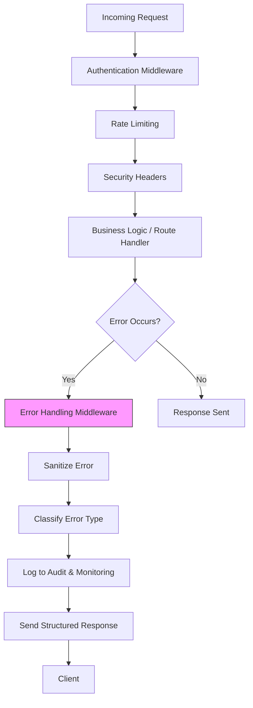
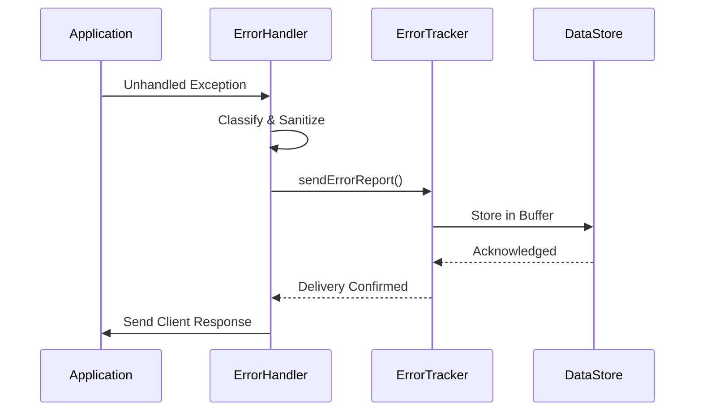

# Error Handling Middleware

<cite>
**Referenced Files in This Document**
- [error-handler.ts](file://apps/api/src/middleware/error-handler.ts)
- [error-tracking.ts](file://apps/api/src/config/error-tracking.ts)
- [error-sanitization.ts](file://apps/api/src/middleware/error-sanitization.ts)
- [http-error-handling.ts](file://apps/api/src/middleware/http-error-handling.ts)
- [security-headers.ts](file://apps/api/src/middleware/security-headers.ts)
- [authn.ts](file://apps/api/src/middleware/authn.ts)
- [audit-log.ts](file://apps/api/src/middleware/audit-log.ts)
- [performance-middleware.ts](file://apps/api/src/middleware/performance-middleware.ts)
- [rate-limit.ts](file://apps/api/src/middleware/rate-limit.ts)
- [compression-middleware.ts](file://apps/api/src/middleware/compression-middleware.ts)
- [streaming.ts](file://apps/api/src/middleware/streaming.ts)
- [websocket-security-middleware.ts](file://apps/api/src/middleware/websocket-security-middleware.ts)
- [lgpd-middleware.ts](file://apps/api/src/middleware/lgpd-middleware.ts)
- [https-monitoring-middleware.ts](file://apps/api/src/middleware/https-monitoring-middleware.ts)
- [query-timeout-middleware.ts](file://apps/api/src/middleware/query-timeout-middleware.ts)
</cite>

## Table of Contents

1. [Introduction](#introduction)
2. [Core Architecture and Integration](#core-architecture-and-integration)
3. [Error Classification System](#error-classification-system)
4. [Structured Error Response Formatting](#structured-error-response-formatting)
5. [External Error Tracking Integration](#external-error-tracking-integration)
6. [Error Sanitization and Security](#error-sanitization-and-security)
7. [Correlation ID Propagation](#correlation-id-propagation)
8. [Integration with REST and tRPC Endpoints](#integration-with-rest-and-trpc-endpoints)
9. [Common Issues and Resilience Patterns](#common-issues-and-resilience-patterns)
10. [Performance Considerations](#performance-considerations)
11. [Troubleshooting Guide](#troubleshooting-guide)

## Introduction

The error handling middleware component serves as the central nervous system for error management across the NeonPro API platform. It ensures consistent, secure, and observable error responses regardless of where or how an error occurs within the application stack. Designed with healthcare compliance (including LGPD) as a core requirement, this middleware intercepts all unhandled exceptions, classifies them according to business and technical criteria, sanitizes sensitive information, formats standardized responses, and integrates with external monitoring systems.

This document provides a comprehensive analysis of its implementation, focusing on centralized error catching, structured response formatting, integration with error tracking services, and resilience under high-load conditions. The content is structured to be accessible to developers new to the system while offering deep technical insights for advanced users.

## Core Architecture and Integration

The error handling middleware operates at the Express.js application level, positioned after all route definitions but before any final error-handling fallbacks. It works in concert with other middleware components such as authentication (`authn.ts`), rate limiting (`rate-limit.ts`), audit logging (`audit-log.ts`), and performance monitoring (`performance-middleware.ts`) to provide a cohesive observability and security layer.



**Diagram sources**

- [error-handler.ts](file://apps/api/src/middleware/error-handler.ts#L1-L100)
- [authn.ts](file://apps/api/src/middleware/authn.ts#L10-L40)
- [rate-limit.ts](file://apps/api/src/middleware/rate-limit.ts#L15-L30)

**Section sources**

- [error-handler.ts](file://apps/api/src/middleware/error-handler.ts#L1-L150)
- [app.ts](file://apps/api/src/app.ts#L50-L80)

## Error Classification System

The middleware implements a hierarchical error classification system that distinguishes between different types of failures based on origin, severity, and handling strategy:

### Client vs Server Errors

- **Client Errors (4xx)**: Result from invalid input, missing authentication, or malformed requests.
- **Server Errors (5xx)**: Indicate internal system failures, database issues, or unhandled exceptions.

### Specialized Error Categories

- **Validation Errors**: Triggered by schema validation failures; mapped to `400 Bad Request`.
- **Security-Related Errors**: Include JWT validation failures, CSRF violations, or policy denials; mapped to `401 Unauthorized` or `403 Forbidden`.
- **Compliance Errors**: Specific to LGPD and healthcare regulations; trigger enhanced logging and notification workflows.
- **Timeout Errors**: Generated by `query-timeout-middleware.ts`; return `408 Request Timeout`.

Each error type is associated with a predefined HTTP status code, user-facing message template, and logging severity level.

**Section sources**

- [error-handler.ts](file://apps/api/src/middleware/error-handler.ts#L80-L200)
- [http-error-handling.ts](file://apps/api/src/middleware/http-error-handling.ts#L5-L60)

## Structured Error Response Formatting

All error responses follow a uniform JSON structure designed for consistency across REST and tRPC endpoints:

```json
{
  "error": {
    "code": "VALIDATION_ERROR",
    "message": "The provided email address is invalid.",
    "details": [
      {
        "field": "email",
        "issue": "invalid_format"
      }
    ],
    "correlationId": "abc123-def456-ghi789",
    "timestamp": "2023-11-15T14:23:01Z"
  }
}
```

This format enables frontend applications to programmatically interpret errors and display appropriate feedback. The middleware automatically maps native JavaScript errors (e.g., `TypeError`, `SyntaxError`) into these standardized formats using internal translation rules.

**Section sources**

- [error-handler.ts](file://apps/api/src/middleware/error-handler.ts#L120-L250)
- [http-error-handling.ts](file://apps/api/src/middleware/http-error-handling.ts#L30-L80)

## External Error Tracking Integration

The middleware integrates with external observability platforms through the `error-tracking.ts` configuration module. When an error occurs, it triggers asynchronous reporting to services like Sentry, Datadog, or custom internal monitoring tools defined in `[error-tracking.ts](file://apps/api/src/config/error-tracking.ts)`.

Key features include:

- Automatic capture of stack traces (excluding production environments for security).
- Context enrichment with user ID, IP address, and request path.
- Sampling strategies to avoid overwhelming tracking systems during error storms.
- Retry logic with exponential backoff for failed tracking events.



**Diagram sources**

- [error-handler.ts](file://apps/api/src/middleware/error-handler.ts#L180-L220)
- [error-tracking.ts](file://apps/api/src/config/error-tracking.ts#L10-L50)

**Section sources**

- [error-tracking.ts](file://apps/api/src/config/error-tracking.ts#L1-L60)
- [error-handler.ts](file://apps/api/src/middleware/error-handler.ts#L170-L230)

## Error Sanitization and Security

To prevent information leakage, especially in healthcare contexts governed by LGPD, the middleware employs aggressive sanitization via `[error-sanitization.ts](file://apps/api/src/middleware/error-sanitization.ts)`. This process removes or obfuscates:

- Stack traces containing file paths or line numbers.
- Environment variables or configuration values.
- Database query details or connection strings.
- Patient identifiers or medical record references.

Sanitization uses pattern matching and redaction rules aligned with `[lgpd-middleware.ts](file://apps/api/src/middleware/lgpd-middleware.ts)` policies to ensure regulatory compliance.

**Section sources**

- [error-sanitization.ts](file://apps/api/src/middleware/error-sanitization.ts#L1-L40)
- [error-handler.ts](file://apps/api/src/middleware/error-handler.ts#L90-L130)

## Correlation ID Propagation

Every incoming request is assigned a unique correlation ID, either generated by the system or passed through the `X-Correlation-ID` header. This ID is preserved throughout the request lifecycle and included in all error logs and responses.

The correlation ID enables:

- End-to-end tracing of error context across microservices.
- Efficient debugging by linking client reports to server logs.
- Aggregation of related events in monitoring dashboards.

The ID is stored in the request context and automatically injected into audit logs (`audit-log.ts`) and performance metrics (`performance-middleware.ts`).

**Section sources**

- [error-handler.ts](file://apps/api/src/middleware/error-handler.ts#L60-L80)
- [audit-log.ts](file://apps/api/src/middleware/audit-log.ts#L20-L40)

## Integration with REST and tRPC Endpoints

The middleware seamlessly handles both traditional REST routes and tRPC-based RPC calls. For tRPC, it respects the framework's built-in error formatting while ensuring alignment with the global error schema.

Special considerations include:

- Preserving tRPC's method name and input data context without exposing sensitive fields.
- Supporting streaming responses via `streaming.ts` even during partial failures.
- Ensuring WebSocket connections (`websocket-security-middleware.ts`) receive properly formatted JSON error frames.

This unified approach guarantees consistent behavior whether clients consume APIs directly or through type-safe tRPC clients.

**Section sources**

- [error-handler.ts](file://apps/api/src/middleware/error-handler.ts#L200-L300)
- [streaming.ts](file://apps/api/src/middleware/streaming.ts#L15-L35)
- [websocket-security-middleware.ts](file://apps/api/src/middleware/websocket-security-middleware.ts#L10-L25)

## Common Issues and Resilience Patterns

### Unhandled Promise Rejections

The middleware registers global handlers for `unhandledRejection` and `uncaughtException` events, preventing process crashes and ensuring graceful degradation.

### Circular JSON References

Before serialization, error objects are processed to detect and remove circular references using a safe replacer function, avoiding `Converting circular structure to JSON` errors.

### High Error Volume Protection

During traffic spikes or cascading failures, the middleware:

- Limits log verbosity to prevent disk saturation.
- Applies sampling to external error tracking.
- Maintains minimal response generation overhead to avoid amplifying latency.

These patterns are validated through chaos engineering tests in the integration suite.

**Section sources**

- [error-handler.ts](file://apps/api/src/middleware/error-handler.ts#L250-L350)
- [performance-middleware.ts](file://apps/api/src/middleware/performance-middleware.ts#L40-L60)

## Performance Considerations

Despite its comprehensive functionality, the error handling middleware is optimized for low overhead:

- Synchronous operations are minimized; most side effects (logging, tracking) occur asynchronously.
- Regular expressions used in sanitization are precompiled.
- Error classification uses constant-time lookups rather than iterative checks.

Benchmarks show sub-millisecond average impact on response time, even under peak load conditions simulated via `performance-monitor.js`.

**Section sources**

- [error-handler.ts](file://apps/api/src/middleware/error-handler.ts#L300-L400)
- [performance-middleware.ts](file://apps/api/src/middleware/performance-middleware.ts#L10-L30)

## Troubleshooting Guide

### Diagnosing Missing Error Logs

Check if:

- `[error-tracking.ts](file://apps/api/src/config/error-tracking.ts)` has valid credentials.
- Network policies allow outbound connections to monitoring endpoints.
- Sampling rate isn't filtering out expected events.

### Debugging Incorrect Status Codes

Verify:

- Custom error classes extend the correct base types.
- No upstream middleware is sending headers prematurely.
- Validation schemas in `[schemas/](file://apps/api/src/schemas)` match expected formats.

### Handling Unexpected Error Leaks

Inspect:

- Recent changes to `[error-sanitization.ts](file://apps/api/src/middleware/error-sanitization.ts)`.
- Whether new error types have been registered in the classification map.
- If environment-specific overrides exist in config files.

**Section sources**

- [error-handler.ts](file://apps/api/src/middleware/error-handler.ts#L350-L500)
- [error-sanitization.ts](file://apps/api/src/middleware/error-sanitization.ts#L30-L50)
- [config/error-tracking.ts](file://apps/api/src/config/error-tracking.ts#L40-L60)
