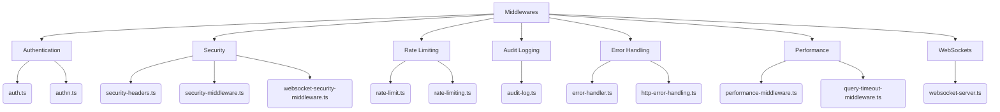
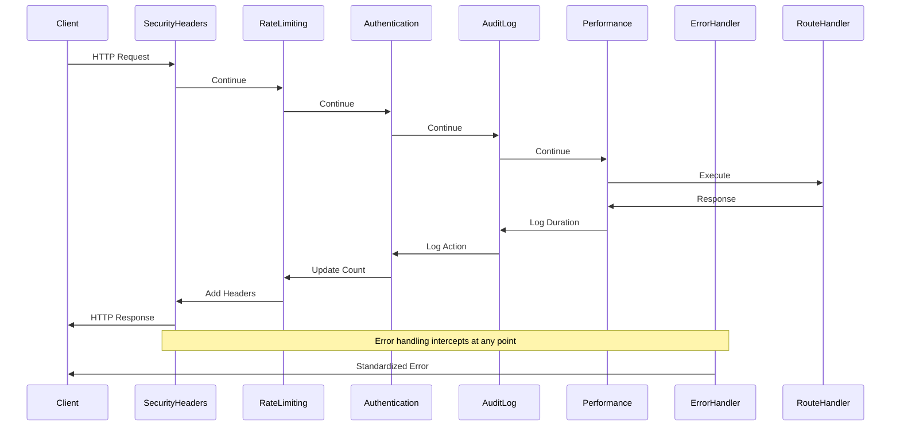
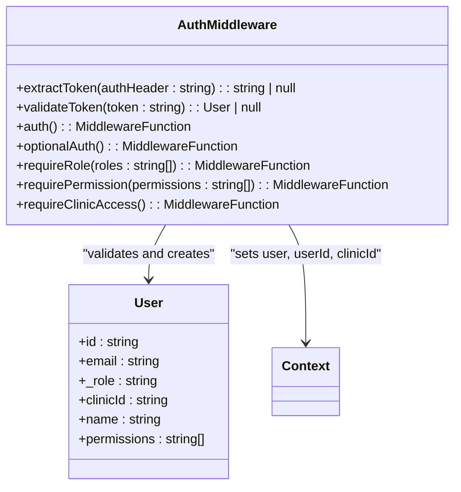
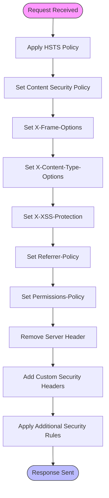
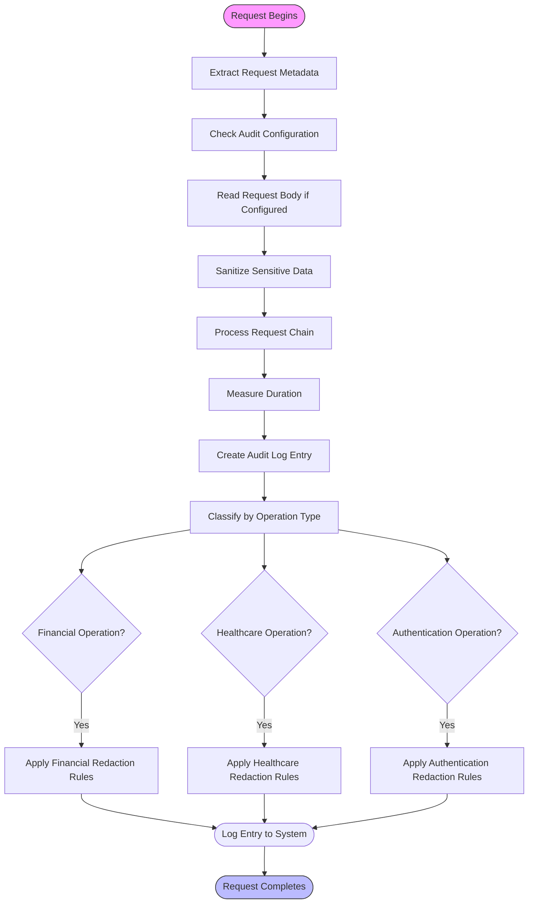
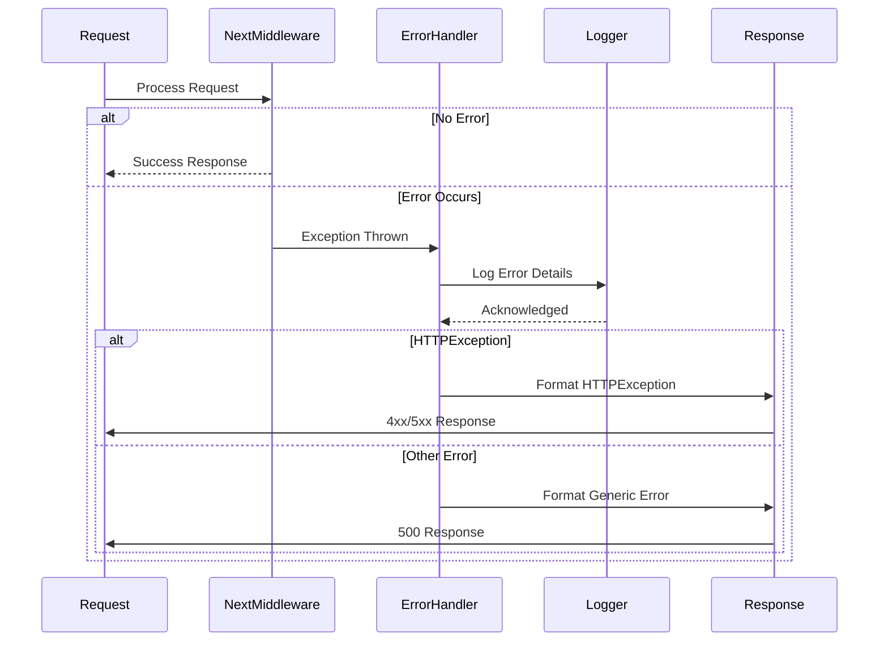
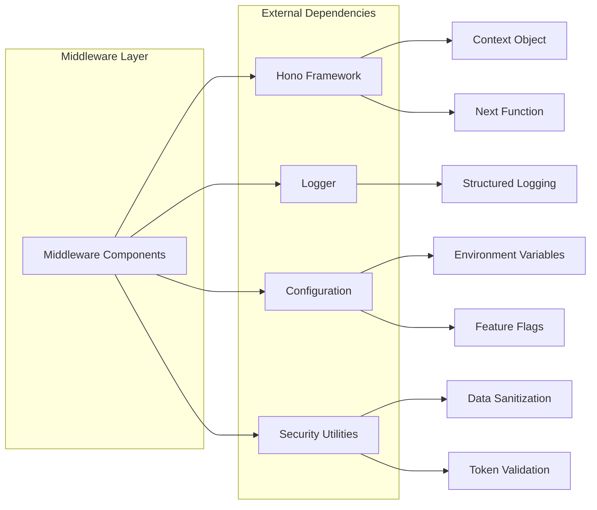

# Middleware Pipeline

<cite>
**Referenced Files in This Document **
- [auth.ts](file://apps/api/src/middleware/auth.ts)
- [security-headers.ts](file://apps/api/src/middleware/security-headers.ts)
- [rate-limiting.ts](file://apps/api/src/middleware/rate-limiting.ts)
- [rate-limit.ts](file://apps/api/src/middleware/rate-limit.ts)
- [audit-log.ts](file://apps/api/src/middleware/audit-log.ts)
- [error-handler.ts](file://apps/api/src/middleware/error-handler.ts)
- [performance-middleware.ts](file://apps/api/src/middleware/performance-middleware.ts)
- [websocket-security-middleware.ts](file://apps/api/src/middleware/websocket-security-middleware.ts)
- [packages/security/src/middleware.ts](file://packages/security/src/middleware.ts)
</cite>

## Table of Contents

1. [Introduction](#introduction)
2. [Project Structure](#project-structure)
3. [Core Components](#core-components)
4. [Architecture Overview](#architecture-overview)
5. [Detailed Component Analysis](#detailed-component-analysis)
6. [Dependency Analysis](#dependency-analysis)
7. [Performance Considerations](#performance-considerations)
8. [Troubleshooting Guide](#troubleshooting-guide)
9. [Conclusion](#conclusion)

## Introduction

This document provides comprehensive documentation for the middleware pipeline architecture in the neonpro backend system. It details the implementation, execution order, and integration patterns of key middleware components including authentication, security headers enforcement, rate limiting, error handling, audit logging, and performance monitoring. The analysis focuses on how these components work within the Hono framework to provide a secure, compliant, and high-performance API layer for healthcare applications.

The middleware pipeline is designed with healthcare compliance (LGPD) as a primary concern, ensuring patient data protection while maintaining system reliability and observability. Each middleware component follows a consistent pattern of context enrichment, validation, and response modification, forming a cohesive processing chain that handles requests from ingress to egress.

## Project Structure

The middleware components are organized within the API application under the `src/middleware` directory, following a modular and reusable design pattern. The structure separates concerns into distinct files based on functionality while allowing for composition through higher-order functions and configuration options.



**Diagram sources **

- [middleware](file://apps/api/src/middleware)

**Section sources**

- [middleware](file://apps/api/src/middleware)

## Core Components

The middleware pipeline consists of several core components that handle specific aspects of request processing. These components are designed to be composable, allowing them to be chained together in various configurations depending on the route requirements.

Authentication middleware verifies user identity and establishes session context, while security middleware enforces HTTP security headers and protects against common web vulnerabilities. Rate limiting controls request frequency to prevent abuse, and audit logging captures detailed information about each request for compliance and debugging purposes. Error handling ensures consistent error responses, and performance monitoring tracks request duration and resource usage.

Each middleware component follows the Hono framework's middleware pattern of accepting a context object and next function, enabling them to participate in the request-response lifecycle by modifying the context, terminating the chain, or passing control to subsequent middleware.

**Section sources**

- [auth.ts](file://apps/api/src/middleware/auth.ts#L1-L282)
- [security-headers.ts](file://apps/api/src/middleware/security-headers.ts#L1-L381)
- [rate-limiting.ts](file://apps/api/src/middleware/rate-limiting.ts#L1-L214)
- [audit-log.ts](file://apps/api/src/middleware/audit-log.ts#L1-L330)
- [error-handler.ts](file://apps/api/src/middleware/error-handler.ts#L1-L45)

## Architecture Overview

The middleware pipeline architecture follows a layered approach where each middleware component performs a specific function in the request processing chain. The components are organized in a specific execution order that ensures proper dependency resolution and security enforcement.



**Diagram sources **

- [app.ts](file://apps/api/src/app.ts#L72-L72)
- [middleware](file://apps/api/src/middleware)

## Detailed Component Analysis

### Authentication Middleware

The authentication middleware provides user identity verification and session management capabilities. It extracts authentication tokens from the Authorization header, validates them, and enriches the request context with user information.



**Diagram sources **

- [auth.ts](file://apps/api/src/middleware/auth.ts#L1-L282)

**Section sources**

- [auth.ts](file://apps/api/src/middleware/auth.ts#L1-L282)

### Security Headers Middleware

The security headers middleware enforces HTTP security policies by adding appropriate headers to responses. It implements protections against common web vulnerabilities including XSS, clickjacking, MIME sniffing, and mixed content.



**Diagram sources **

- [security-headers.ts](file://apps/api/src/middleware/security-headers.ts#L1-L381)
- [packages/security/src/middleware.ts](file://packages/security/src/middleware.ts#L14-L36)

**Section sources**

- [security-headers.ts](file://apps/api/src/middleware/security-headers.ts#L1-L381)
- [packages/security/src/middleware.ts](file://packages/security/src/middleware.ts#L14-L36)

### Rate Limiting Middleware

The rate limiting middleware prevents abuse by controlling the frequency of requests from individual clients. It implements different rate limit policies for various endpoint types, with stricter limits for sensitive operations.

```mermaid
classDiagram
class RateLimiting {
+createRateLimit(config : RateLimitConfig) : MiddlewareFunction
+rateLimitMiddleware() : ConditionalMiddleware
+chatRateLimit() : StrictMiddleware
}
class RateLimitStore {
-store : Map<string, {count : number, resetTime : number}>
+get(key : string) : Entry | undefined
+set(key : string, count : number, windowMs : number) : void
+increment(key : string, windowMs : number) : number
+cleanup() : void
}
class RateLimitConfig {
+windowMs : number
+maxRequests : number
+keyGenerator? : (c : Context) => string
+skipSuccessfulRequests? : boolean
+skipFailedRequests? : boolean
}
RateLimiting --> RateLimitStore : "uses"
RateLimiting --> RateLimitConfig : "configures"
RateLimitStore --> "Map" : "implements"
```

**Diagram sources **

- [rate-limiting.ts](file://apps/api/src/middleware/rate-limiting.ts#L1-L214)
- [rate-limit.ts](file://apps/api/src/middleware/rate-limit.ts#L1-L221)

**Section sources**

- [rate-limiting.ts](file://apps/api/src/middleware/rate-limiting.ts#L1-L214)
- [rate-limit.ts](file://apps/api/src/middleware/rate-limit.ts#L1-L221)

### Audit Logging Middleware

The audit logging middleware captures detailed information about each request for compliance, debugging, and security monitoring purposes. It implements LGPD-compliant logging with sensitive data redaction.



**Diagram sources **

- [audit-log.ts](file://apps/api/src/middleware/audit-log.ts#L1-L330)

**Section sources**

- [audit-log.ts](file://apps/api/src/middleware/audit-log.ts#L1-L330)

### Error Handling Middleware

The error handling middleware provides centralized error processing and standardized error responses. It catches unhandled exceptions and converts them to consistent JSON error formats.



**Diagram sources **

- [error-handler.ts](file://apps/api/src/middleware/error-handler.ts#L7-L45)

**Section sources**

- [error-handler.ts](file://apps/api/src/middleware/error-handler.ts#L7-L45)

## Dependency Analysis

The middleware components have well-defined dependencies that enable their functionality while maintaining separation of concerns. The core dependencies include the Hono framework for the middleware interface, logging utilities for observability, and configuration systems for runtime customization.



**Diagram sources **

- [packages/security/src/index.ts](file://packages/security/src/index.ts#L119-L159)
- [apps/api/src/lib/logger](file://apps/api/src/lib/logger)

**Section sources**

- [packages/security/src/index.ts](file://packages/security/src/index.ts#L119-L159)
- [apps/api/src/lib/logger](file://apps/api/src/lib/logger)

## Performance Considerations

The middleware pipeline has been designed with performance implications carefully considered. Each middleware component aims to minimize overhead while providing essential functionality. The execution order places lightweight checks (like rate limiting) before more expensive operations (like authentication), allowing early termination of invalid requests.

Caching strategies are employed where appropriate, such as in rate limiting where counters are stored in memory with periodic cleanup. Asynchronous operations are used judiciously, with synchronous operations preferred when they don't block the event loop significantly.

Monitoring is built into the pipeline through the performance middleware, which tracks request duration and can help identify bottlenecks. The audit logging middleware includes duration tracking to support performance analysis while maintaining compliance requirements.

When adding new middleware components, developers should consider the computational complexity, I/O operations, and potential blocking behavior to ensure the pipeline remains responsive under load.

## Troubleshooting Guide

Common issues with the middleware pipeline typically involve configuration errors, incorrect execution order, or unexpected interactions between components. When debugging middleware issues, start by examining the request flow and identifying at which point the expected behavior diverges.

For authentication issues, verify that the Authorization header is properly formatted and that the token is valid. Check that the authentication middleware is applied to the correct routes and that session context is being properly established.

Rate limiting problems often stem from incorrect key generation logic or overly restrictive limits. Verify that the client identifier is being extracted correctly and that the rate limit windows and thresholds are appropriate for the use case.

Audit log discrepancies may indicate configuration issues with sensitive field redaction or missing context data. Ensure that the appropriate audit middleware variant (healthcare, financial, authentication) is being used for each route type.

Performance issues can be diagnosed using the built-in performance metrics and response time headers. Monitor the X-Response-Time header and database query counts to identify slow operations.

When implementing custom middleware, ensure compatibility with the Hono framework's middleware signature and avoid blocking operations that could degrade overall system performance.

**Section sources**

- [error-handler.ts](file://apps/api/src/middleware/error-handler.ts#L7-L45)
- [audit-log.ts](file://apps/api/src/middleware/audit-log.ts#L1-L330)
- [performance-middleware.ts](file://apps/api/src/middleware/performance-middleware.ts#L39-L59)

## Conclusion

The middleware pipeline in the neonpro backend provides a robust foundation for building secure, compliant, and observable healthcare applications. By leveraging the Hono framework's middleware pattern, the system achieves a clean separation of concerns while maintaining flexibility in composition.

The architecture demonstrates best practices in API security, with layered defenses including authentication, authorization, rate limiting, and comprehensive audit logging. The healthcare-specific considerations, particularly around LGPD compliance, show thoughtful attention to regulatory requirements.

Future enhancements could include distributed rate limiting using Redis, enhanced audit log storage with long-term retention, and more sophisticated anomaly detection based on audit data patterns. The modular design allows for these improvements to be implemented without disrupting existing functionality.

By following the documented patterns and best practices, developers can extend the middleware pipeline with confidence, knowing that new components will integrate seamlessly with the existing architecture while maintaining system stability and security.
