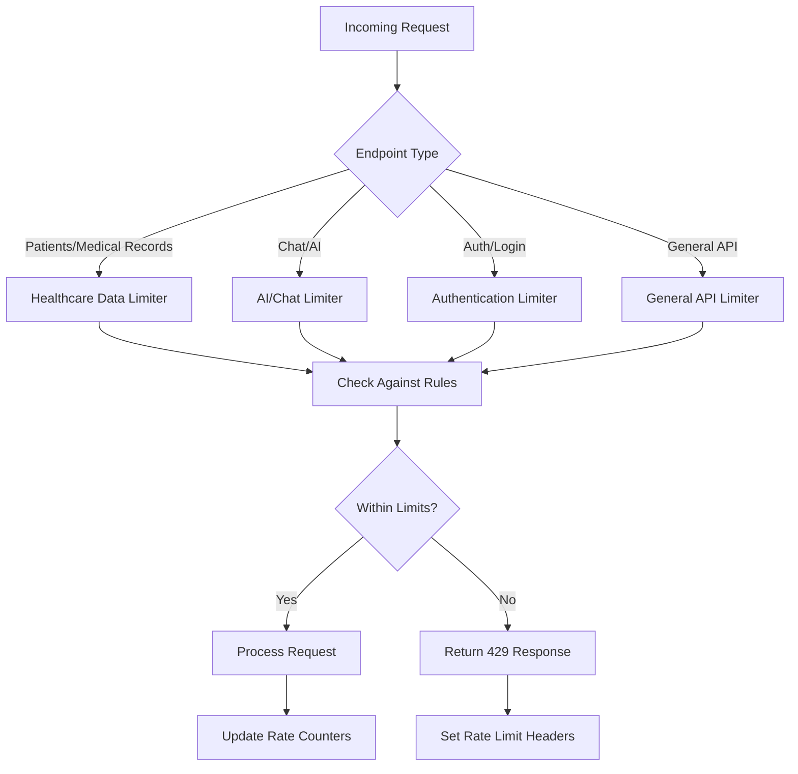
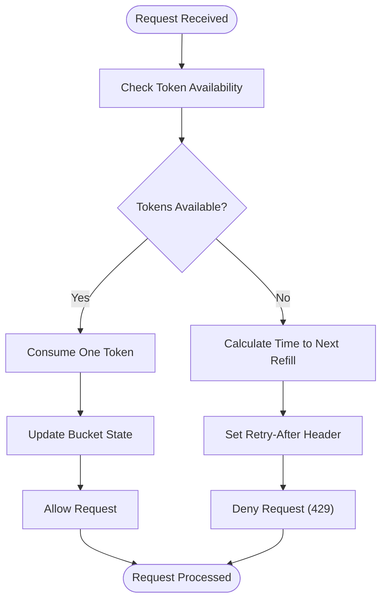
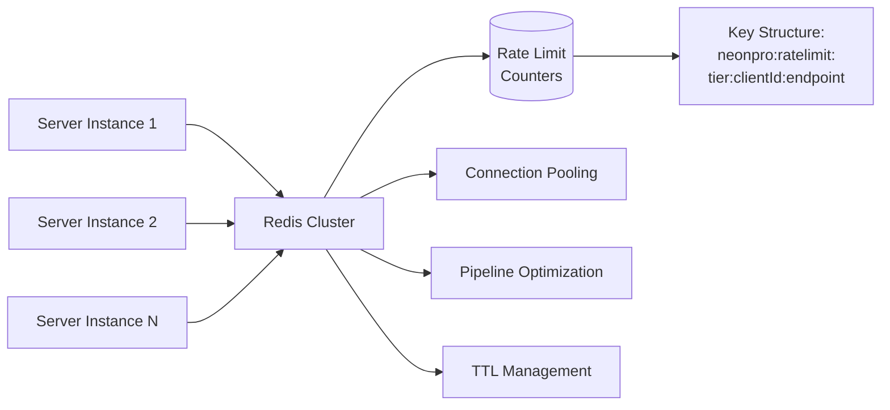
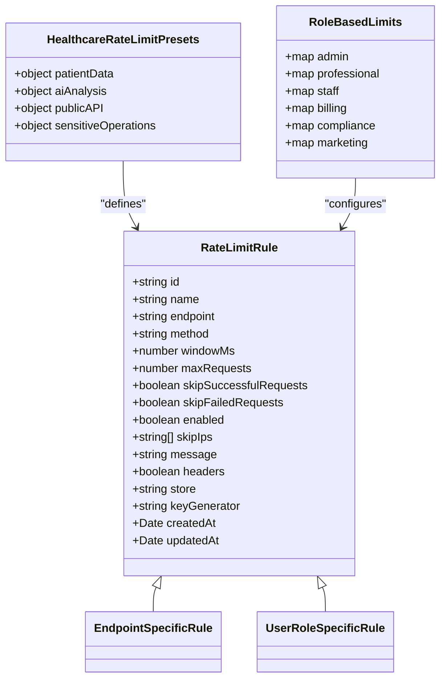
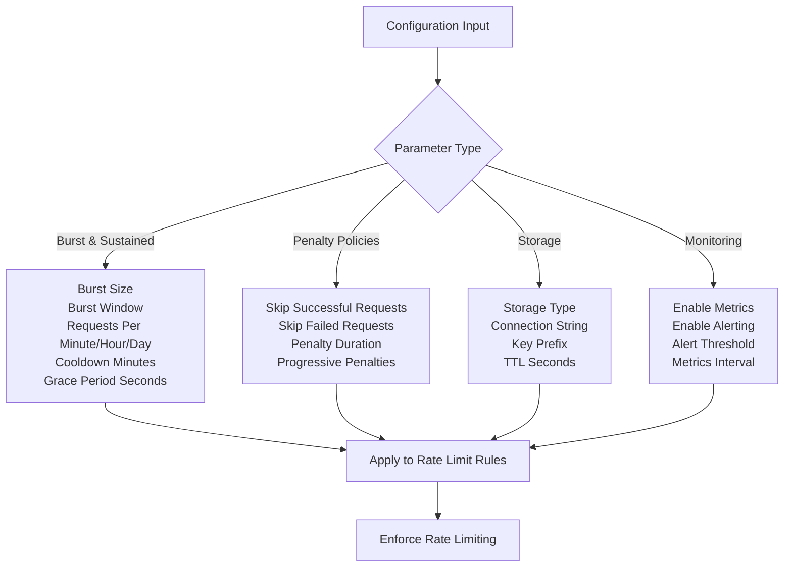
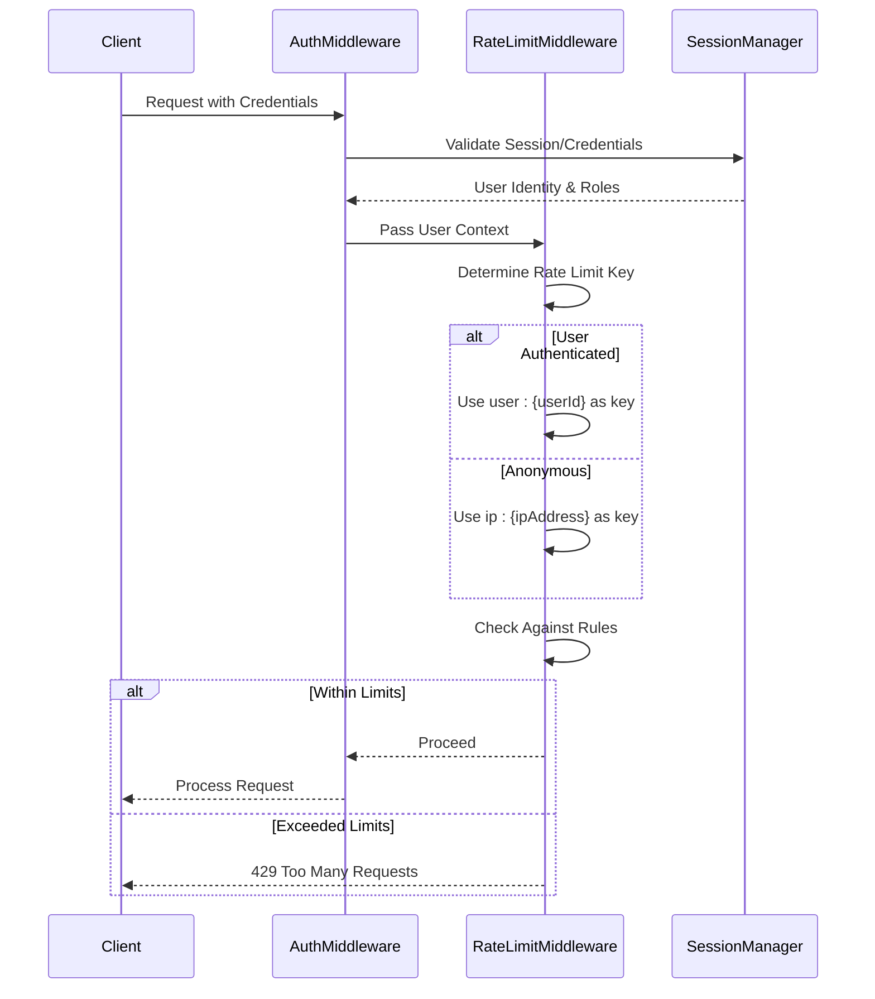
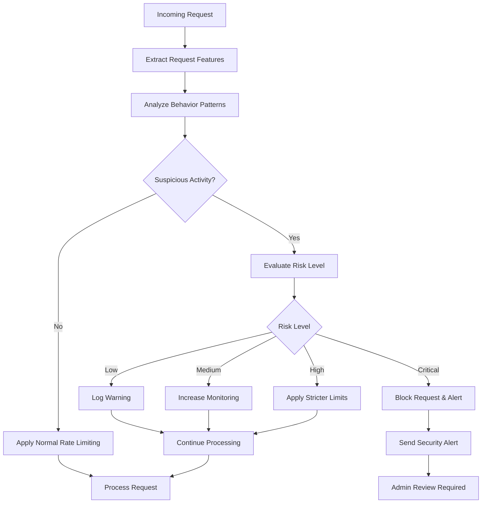
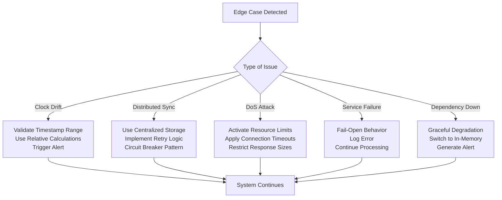
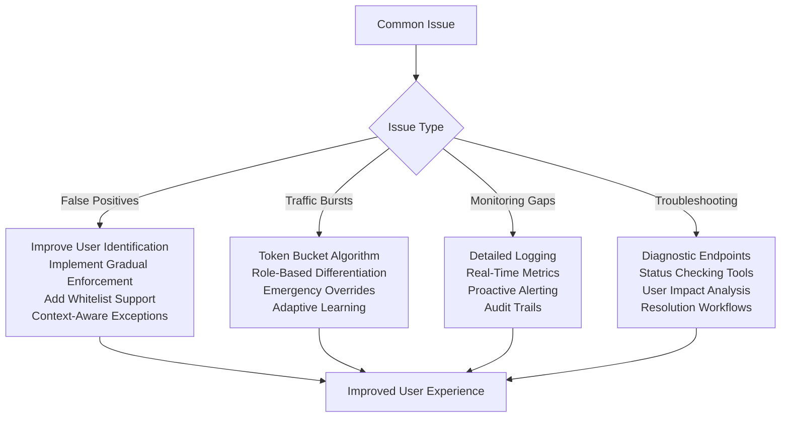
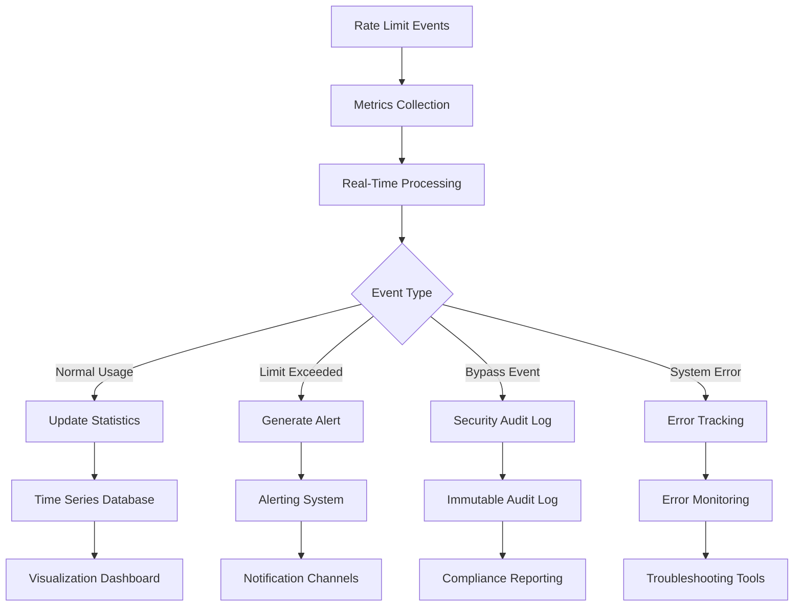

# Rate Limiting Middleware

<cite>
**Referenced Files in This Document**
- [rate-limit.ts](file://apps/api/src/middleware/rate-limit.ts)
- [rate-limiting.ts](file://apps/api/src/middleware/rate-limiting.ts)
- [rate-limit-service.ts](file://apps/api/src/services/rate-limit-service.ts)
- [api-rate-limiting.ts](file://packages/shared/src/services/api-rate-limiting.ts)
</cite>

## Table of Contents

1. [Introduction](#introduction)
2. [Implementation Overview](#implementation-overview)
3. [Token Bucket Algorithm](#token-bucket-algorithm)
4. [Redis-Backed Storage for Distributed Rate Tracking](#redis-backed-storage-for-distributed-rate-tracking)
5. [Dynamic Limits Based on User Roles and API Endpoints](#dynamic-limits-based-on-user-roles-and-api-endpoints)
6. [Configuration Parameters](#configuration-parameters)
7. [Integration with Authentication](#integration-with-authentication)
8. [Abuse Detection Systems](#abuse-detection-systems)
9. [Edge Case Handling](#edge-case-handling)
10. [Common Issues and Solutions](#common-issues-and-solutions)
11. [Monitoring Rate Limit Events](#monitoring-rate-limit-events)
12. [Conclusion](#conclusion)

## Introduction

The rate limiting middleware component is a critical security and performance feature designed to protect the healthcare application from abuse, denial-of-service attacks, and resource exhaustion. This document provides comprehensive documentation of the implementation, focusing on the token bucket algorithm, Redis-backed storage for distributed systems, dynamic limits based on user roles and API endpoints, and various configuration parameters.

The middleware serves multiple purposes: preventing brute force attacks on authentication endpoints, protecting sensitive patient data access, ensuring fair usage of AI/Chat resources, and maintaining system stability during traffic spikes. It implements sophisticated rate limiting strategies that balance security requirements with usability needs in a healthcare context where emergency access may be required.

This documentation is structured to be accessible to beginners while providing sufficient technical depth for experienced developers implementing or modifying the rate limiting system.

**Section sources**

- [rate-limit.ts](file://apps/api/src/middleware/rate-limit.ts#L1-L222)
- [rate-limiting.ts](file://apps/api/src/middleware/rate-limiting.ts#L1-L215)

## Implementation Overview

The rate limiting system consists of multiple components working together to provide comprehensive protection across different API endpoints. The architecture includes specialized middleware for different types of endpoints, a service layer for rule management, and configurable algorithms for rate limit enforcement.

The core implementation uses an in-memory store for basic rate limiting functionality, with provisions for Redis-backed storage in distributed environments. The system supports multiple rate limiting algorithms including token bucket and sliding window approaches, allowing different strategies to be applied based on endpoint sensitivity and usage patterns.

Key architectural decisions include:

- Hierarchical rate limiting with different thresholds for various endpoint categories
- Support for both IP-based and user-based identification
- Configurable behavior for handling successful vs failed requests
- Comprehensive logging and monitoring capabilities
- Emergency bypass mechanisms for critical healthcare scenarios

The middleware is designed to fail-open in case of errors, ensuring that legitimate medical emergencies are not blocked by rate limiting failures—a critical consideration in healthcare applications.

**Diagram sources**

- [rate-limiting.ts](file://apps/api/src/middleware/rate-limiting.ts#L172-L213)
- [rate-limit.ts](file://apps/api/src/middleware/rate-limit.ts#L82-L215)

**Section sources**

- [rate-limiting.ts](file://apps/api/src/middleware/rate-limiting.ts#L1-L215)
- [rate-limit-service.ts](file://apps/api/src/services/rate-limit-service.ts#L1-L194)

## Token Bucket Algorithm

The token bucket algorithm is implemented as one of the primary rate limiting strategies in the system, particularly for managing burst traffic while maintaining sustained rate control. This algorithm works by allocating tokens to each client at a fixed rate, with clients consuming tokens for each request they make.

In the implementation, each client has a virtual "bucket" of tokens with a defined capacity (burst size). Tokens are replenished at a configured rate (refill rate), and each request consumes one token. When the bucket is empty, requests are rejected until more tokens are added through the refill process.

The key advantages of this approach include:

- Allowing legitimate traffic bursts within defined limits
- Preventing sustained high-volume attacks
- Providing smooth rate limiting behavior without abrupt cutoffs
- Supporting different burst sizes for different user tiers

The algorithm implementation includes precise timing calculations to ensure accurate token replenishment based on elapsed time between requests. It also handles edge cases such as clock drift by using monotonic time sources when available and implementing appropriate fallbacks.

**Diagram sources**

- [api-rate-limiting.ts](file://packages/shared/src/services/api-rate-limiting.ts#L476-L522)
- [api-rate-limiting.ts](file://packages/shared/src/services/api-rate-limiting.ts#L399-L434)

**Section sources**

- [api-rate-limiting.ts](file://packages/shared/src/services/api-rate-limiting.ts#L432-L565)

## Redis-Backed Storage for Distributed Rate Tracking

For distributed environments, the rate limiting system supports Redis-backed storage to ensure consistent rate tracking across multiple server instances. This capability is essential for maintaining accurate rate limits in horizontally scaled deployments where requests may be handled by different servers.

The Redis implementation provides several key benefits:

- Consistent state across all application instances
- Persistence of rate limit data during server restarts
- High-performance access to rate tracking information
- Support for large-scale deployments with thousands of concurrent users

The storage configuration allows flexible connection settings, including connection strings, key prefixes, and TTL (time-to-live) values. The system automatically handles connection failures with appropriate retry logic and fallback behaviors to prevent availability issues.

When Redis is configured as the storage backend, all rate limit counters are stored with keys that incorporate the client identifier, endpoint, and time window. This structure enables efficient querying and updating of rate limit data while minimizing collisions between different rate limiting contexts.

The implementation also includes connection pooling and pipeline optimizations to maximize Redis performance under heavy load conditions typical in healthcare applications during peak usage periods.

**Diagram sources**

- [api-rate-limiting.ts](file://packages/shared/src/services/api-rate-limiting.ts#L313-L352)
- [api-rate-limiting.ts](file://packages/shared/src/services/api-rate-limiting.ts#L520-L565)

**Section sources**

- [api-rate-limiting.ts](file://packages/shared/src/services/api-rate-limiting.ts#L313-L352)

## Dynamic Limits Based on User Roles and API Endpoints

The rate limiting system implements dynamic limits that vary based on both user roles and specific API endpoints, providing granular control over access patterns. This approach recognizes that different users have different legitimate usage requirements and that certain endpoints require more restrictive protection due to their sensitivity.

For API endpoints, the system categorizes routes into different sensitivity levels:

- **Patient data endpoints**: Highly restrictive limits for GET requests to /patients and /medical-records paths
- **AI/Chat endpoints**: Moderate limits for AI-powered features that are resource-intensive
- **Authentication endpoints**: Strict limits with special handling for failed attempts
- **General API endpoints**: Standard limits for most other API functionality

User role-based differentiation allows higher limits for privileged users such as administrators and healthcare professionals while maintaining stricter controls for regular users. The role hierarchy considers the clinical responsibilities and trust levels associated with different roles in the healthcare setting.

The dynamic limit system also incorporates emergency bypass mechanisms that allow critical requests to proceed even when normal rate limits would be exceeded. These bypasses are triggered by specific flags indicating emergency situations or patient safety concerns.

**Diagram sources**

- [rate-limit-service.ts](file://apps/api/src/services/rate-limit-service.ts#L34-L81)
- [rate-limit-service.ts](file://apps/api/src/services/rate-limit-service.ts#L136-L192)
- [aesthetic-data-handling.ts](file://apps/api/src/services/agui-protocol/aesthetic-data-handling.ts#L694-L732)

**Section sources**

- [rate-limit-service.ts](file://apps/api/src/services/rate-limit-service.ts#L34-L192)
- [aesthetic-data-handling.ts](file://apps/api/src/services/agui-protocol/aesthetic-data-handling.ts#L694-L732)

## Configuration Parameters

The rate limiting middleware exposes extensive configuration options to accommodate different deployment scenarios and security requirements. These parameters allow fine-tuning of the rate limiting behavior to balance security, performance, and usability.

Key configuration parameters include:

### Burst Limits and Sustained Rates

- **Burst size**: Maximum number of requests allowed in a short time window
- **Burst window seconds**: Duration of the burst window
- **Requests per minute/hour/day**: Sustained rate limits over longer periods
- **Cooldown minutes**: Waiting period after limit exhaustion before partial recovery
- **Grace period seconds**: Additional time buffer before enforcing limits

### Penalty Policies

- **Skip successful requests**: Option to exclude successful requests from counting toward limits (useful for authentication endpoints)
- **Skip failed requests**: Option to exclude failed requests from counting (prevents attackers from triggering rate limits on legitimate users)
- **Penalty duration**: Extended blocking period for abusive behavior patterns
- **Progressive penalties**: Increasingly severe restrictions for repeated violations

### Storage and Persistence

- **Storage type**: Memory, Redis, or database backend selection
- **Connection string**: Configuration for external storage systems
- **Key prefix**: Namespace prefix for storage keys
- **TTL seconds**: Time-to-live for rate limit data

### Monitoring and Alerting

- **Enable metrics**: Collection of rate limiting statistics
- **Enable alerting**: Notifications when thresholds are approached
- **Alert threshold**: Percentage of limit utilization that triggers alerts
- **Metrics interval**: Frequency of metrics collection

These configuration parameters can be set globally, per endpoint, or per user role, providing maximum flexibility in tailoring the rate limiting behavior to specific use cases.

**Diagram sources**

- [api-rate-limiting.ts](file://packages/shared/src/services/api-rate-limiting.ts#L610-L659)
- [api-rate-limiting.ts](file://packages/shared/src/services/api-rate-limiting.ts#L313-L352)

**Section sources**

- [api-rate-limiting.ts](file://packages/shared/src/services/api-rate-limiting.ts#L313-L352)
- [api-rate-limiting.ts](file://packages/shared/src/services/api-rate-limiting.ts#L610-L659)

## Integration with Authentication

The rate limiting middleware integrates closely with the authentication system to provide per-user limits and enhanced security features. This integration enables more sophisticated rate limiting strategies that consider user identity, session state, and authentication status.

Key integration points include:

- **User identification**: Using authenticated user IDs as rate limit keys when available, falling back to IP addresses for unauthenticated requests
- **Session binding**: Associating rate limits with active sessions to prevent circumvention through credential rotation
- **Multi-factor authentication state**: Adjusting rate limits based on MFA verification status
- **Role-based limits**: Applying different rate limits based on user roles and permissions

The chat-specific rate limiter demonstrates this integration by first attempting to retrieve the user object from the request context, then falling back to user ID if available, and finally using IP address as a last resort. This hierarchical approach ensures the most accurate user identification possible while maintaining protection against anonymous abuse.

For authentication endpoints specifically, the system implements special handling that only counts failed login attempts toward the rate limit. This prevents attackers from locking out legitimate users by triggering rate limits through excessive failed attempts, while still protecting against brute force attacks.

The integration also supports emergency bypass mechanisms that can be triggered by authentication claims indicating urgent medical situations, ensuring that critical care is not impeded by security controls.

**Diagram sources**

- [rate-limit.ts](file://apps/api/src/middleware/rate-limit.ts#L82-L215)
- [authn.ts](file://apps/api/src/middleware/authn.ts)
- [enhanced-session-manager.ts](file://apps/api/src/security/enhanced-session-manager.ts)

**Section sources**

- [rate-limit.ts](file://apps/api/src/middleware/rate-limit.ts#L82-L215)
- [enhanced-session-manager.ts](file://apps/api/src/security/enhanced-session-manager.ts#L104-L150)

## Abuse Detection Systems

The rate limiting middleware incorporates sophisticated abuse detection systems that go beyond simple request counting to identify and mitigate complex attack patterns. These systems analyze request behavior, timing, and context to distinguish between legitimate traffic bursts and malicious activity.

Key abuse detection features include:

- **Suspicious activity pattern recognition**: Monitoring for high-frequency permission checks, unusual access patterns, or rapid sequential operations
- **Geographic anomaly detection**: Identifying logins or requests from unexpected geographic locations
- **Device fingerprinting**: Tracking known devices and flagging unknown ones for additional scrutiny
- **Time-based risk assessment**: Evaluating risk based on request timing (e.g., unusual hours)
- **Concurrent session monitoring**: Detecting excessive concurrent sessions that may indicate account sharing or compromise

The system implements progressive enforcement, starting with warnings and gradually increasing restrictions based on the severity and persistence of suspicious behavior. For example, a user exceeding 80% of their rate limit threshold triggers a suspicious activity log entry, while repeated violations lead to temporary blocks.

Emergency response capabilities allow administrators to clear all caches and reset rate limits in crisis situations. The system also supports real-time cache invalidation via Supabase realtime channels when user roles or permissions change, ensuring that rate limiting policies are immediately updated.

The abuse detection system is designed with healthcare-specific considerations, including emergency bypass mechanisms for critical situations and patient safety overrides that allow essential medical interventions even when normal security policies would block them.

**Diagram sources**

- [agent-permissions.ts](file://apps/api/src/services/permissions/agent-permissions.ts#L863-L911)
- [authentication-middleware.ts](file://packages/shared/src/services/authentication-middleware.ts#L1609-L1667)
- [bulk-operations-service.ts](file://apps/api/src/services/bulk-operations-service.ts#L259-L294)

**Section sources**

- [agent-permissions.ts](file://apps/api/src/services/permissions/agent-permissions.ts#L863-L911)
- [authentication-middleware.ts](file://packages/shared/src/services/authentication-middleware.ts#L1609-L1667)

## Edge Case Handling

The rate limiting system includes comprehensive handling of various edge cases to ensure reliability and security in production environments. These edge cases cover technical challenges, distributed system complexities, and denial-of-service protection scenarios.

### Clock Drift and Timing Issues

The system accounts for potential clock drift between servers by using relative time calculations and implementing tolerance windows. Timestamps are validated against expected ranges, and significant discrepancies trigger alerts rather than immediate enforcement actions.

### Distributed System Synchronization

In multi-instance deployments, the system uses Redis or database storage to maintain consistent state across all nodes. Connection resilience features include automatic reconnection, retry logic with exponential backoff, and circuit breaker patterns to prevent cascading failures.

### Denial-of-Service Protection

Beyond standard rate limiting, the system implements additional DoS protection measures:

- **Resource exhaustion prevention**: Limiting concurrent requests per user/session
- **Slowloris attack mitigation**: Timeout controls for incomplete requests
- **Amplification attack prevention**: Restrictions on response sizes for certain endpoints
- **Cache-aware limiting**: Protecting caching layers from being overwhelmed

### Fail-Open vs Fail-Closed Behavior

The system follows a fail-open approach for rate limiting, meaning that if the rate limiting service itself fails, requests are allowed to proceed. This design prioritizes availability in healthcare contexts where blocking legitimate emergency requests could have serious consequences.

### Graceful Degradation

When external dependencies like Redis are unavailable, the system gracefully degrades to in-memory storage with appropriate logging and alerting. This ensures continued operation while notifying administrators of the reduced protection level.

**Diagram sources**

- [api-rate-limiting.ts](file://packages/shared/src/services/api-rate-limiting.ts#L757-L791)
- [session-integration.ts](file://apps/api/src/services/session/copilotkit-session-integration.ts#L632-L676)
- [enhanced-session-manager.ts](file://apps/api/src/security/enhanced-session-manager.ts#L430-L487)

**Section sources**

- [api-rate-limiting.ts](file://packages/shared/src/services/api-rate-limiting.ts#L757-L791)
- [copilotkit-session-integration.ts](file://apps/api/src/services/session/copilotkit-session-integration.ts#L632-L676)

## Common Issues and Solutions

The rate limiting implementation addresses several common issues encountered in real-world deployments, providing solutions that balance security requirements with user experience.

### False Positives

False positives occur when legitimate users are incorrectly blocked by rate limiting. The system mitigates this through:

- **User identification prioritization**: Preferring user IDs over IP addresses to avoid blocking multiple users behind NAT
- **Gradual enforcement**: Warming up with warnings before full blocking
- **Whitelist support**: Allowing trusted IPs to bypass certain limits
- **Context-aware exceptions**: Recognizing legitimate traffic patterns that resemble abuse

### Legitimate Traffic Bursts

Healthcare applications often experience legitimate traffic bursts during shift changes, emergencies, or scheduled procedures. The system accommodates these through:

- **Burst allowance**: Token bucket algorithm permitting short-term spikes
- **Role-based differentiation**: Higher limits for clinical staff during working hours
- **Emergency overrides**: Bypass mechanisms for critical situations
- **Adaptive learning**: Monitoring historical patterns to distinguish normal bursts from attacks

### Monitoring and Troubleshooting

Comprehensive monitoring capabilities help identify and resolve rate limiting issues:

- **Detailed logging**: Recording rate limit events with full context
- **Real-time metrics**: Dashboard visibility into current utilization
- **Alerting**: Notifications when thresholds are approached
- **Audit trails**: Complete history of rate limit decisions

The system also provides diagnostic endpoints that allow administrators to check rate limit status for specific users or endpoints, facilitating troubleshooting of access issues.

**Diagram sources**

- [rate-limit-service.ts](file://apps/api/src/services/rate-limit-service.ts#L83-L134)
- [rate-counter.ts](file://packages/core-services/src/services/rate-counter.ts#L0-L68)
- [rate-counter.test.ts](file://packages/core-services/tests/rate-counter.test.ts#L0-L56)

**Section sources**

- [rate-limit-service.ts](file://apps/api/src/services/rate-limit-service.ts#L83-L134)
- [rate-counter.ts](file://packages/core-services/src/services/rate-counter.ts#L0-L170)

## Monitoring Rate Limit Events

The rate limiting system includes comprehensive monitoring capabilities to track usage patterns, detect anomalies, and ensure proper enforcement. These monitoring features provide visibility into both normal operations and potential security incidents.

Key monitoring components include:

- **Real-time metrics collection**: Gathering data on request volumes, limit hits, and bypass events
- **Usage analytics**: Analyzing patterns across users, endpoints, and time periods
- **Alerting system**: Notifying administrators when thresholds are crossed
- **Audit logging**: Maintaining immutable records of rate limit decisions
- **Dashboard visualization**: Presenting key metrics in an accessible format

The system collects detailed statistics such as:

- Active keys (current users being tracked)
- Total requests processed
- Rate limit violations
- Bypass events (emergency, patient safety, etc.)
- Storage performance metrics
- Error rates and failure modes

These metrics are collected at regular intervals (configurable via metricsInterval parameter) and can be integrated with external monitoring platforms for centralized observability. The system also supports exporting metrics in standard formats for compliance reporting and long-term analysis.

Security-focused monitoring includes detection of potential abuse patterns such as:

- Rapid successive requests from single users
- Coordinated attacks from multiple IPs
- Attempts to enumerate valid user accounts
- Unusual access patterns to sensitive endpoints

**Diagram sources**

- [api-rate-limiting.ts](file://packages/shared/src/services/api-rate-limiting.ts#L833-L884)
- [api-rate-limiting.ts](file://packages/shared/src/services/api-rate-limiting.ts#L1034-L1076)
- [monitoring-config.ts](file://config/vercel/monitoring-config.ts)

**Section sources**

- [api-rate-limiting.ts](file://packages/shared/src/services/api-rate-limiting.ts#L833-L1076)

## Conclusion

The rate limiting middleware component provides a robust, flexible, and healthcare-aware solution for protecting API endpoints from abuse while accommodating legitimate usage patterns. By implementing the token bucket algorithm with Redis-backed storage, dynamic limits based on user roles and endpoints, and comprehensive configuration options, the system strikes an optimal balance between security, performance, and usability.

Key strengths of the implementation include its adaptability to different endpoint sensitivities, integration with authentication systems for per-user limits, and sophisticated abuse detection capabilities. The system's attention to edge cases—particularly its fail-open behavior and emergency bypass mechanisms—demonstrates thoughtful design for healthcare contexts where availability can be a matter of patient safety.

For beginners, the system provides sensible defaults and clear configuration parameters that make it easy to get started. For experienced developers, the extensible architecture and comprehensive monitoring capabilities enable deep customization and integration with existing infrastructure.

Future enhancements could include machine learning-based anomaly detection, more sophisticated burst handling algorithms, and tighter integration with identity federation systems. However, the current implementation already provides a solid foundation for securing healthcare APIs against a wide range of threats while maintaining the responsiveness required for clinical applications.
