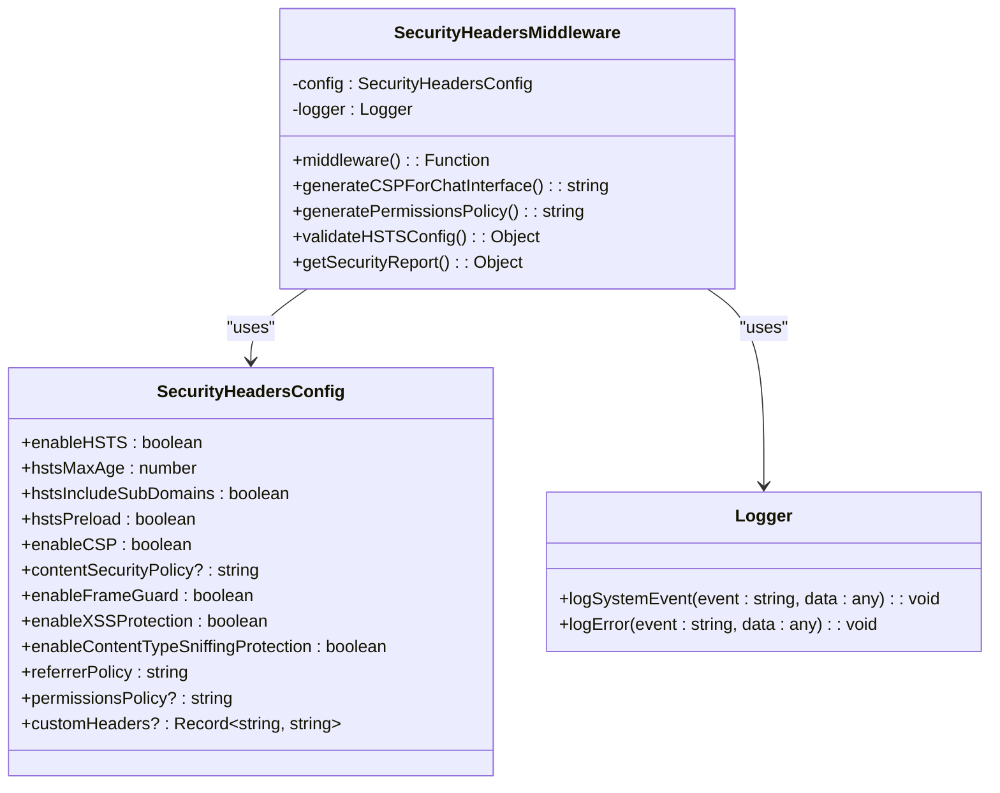
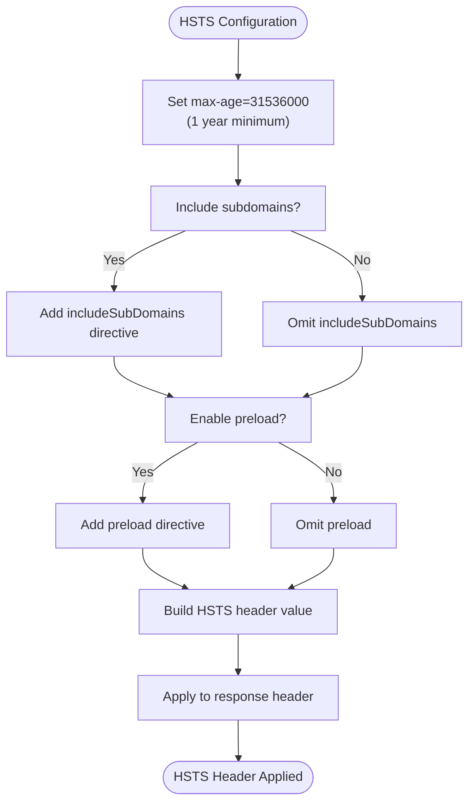
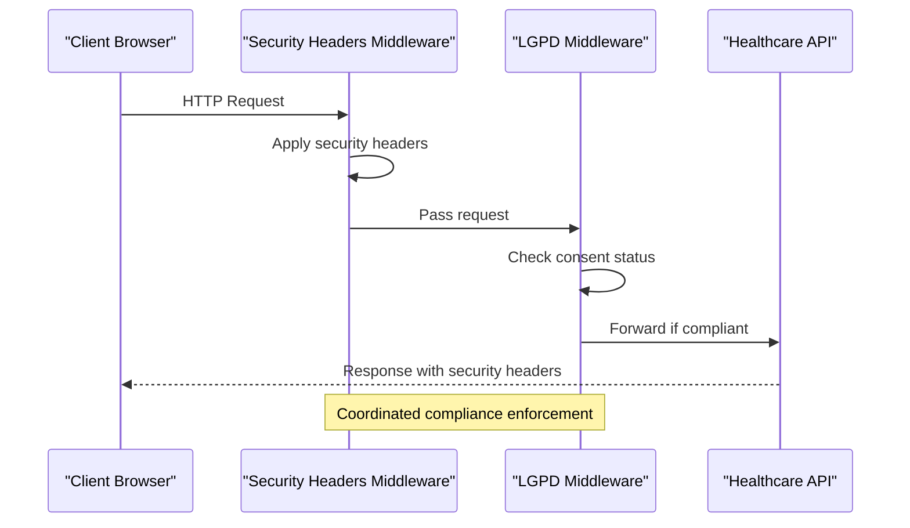
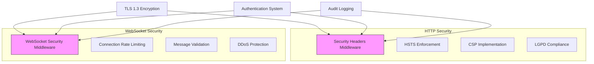

# Security Headers Middleware

<cite>
**Referenced Files in This Document**
- [security-headers.ts](file://apps/api/src/middleware/security-headers.ts)
- [https-config.ts](file://apps/api/src/config/https-config.ts)
- [tls-config.ts](file://apps/api/src/config/tls-config.ts)
- [tls-constants.ts](file://apps/api/src/config/tls-constants.ts)
- [lgpd-middleware.ts](file://apps/api/src/middleware/lgpd-middleware.ts)
- [websocket-security-middleware.ts](file://apps/api/src/middleware/websocket-security-middleware.ts)
- [security-middleware.ts](file://apps/api/src/middleware/security-middleware.ts)
</cite>

## Table of Contents

1. [Introduction](#introduction)
2. [Core Implementation](#core-implementation)
3. [Security Header Configuration](#security-header-configuration)
4. [Compliance Integration](#compliance-integration)
5. [WebSocket Security Integration](#websocket-security-integration)
6. [Configuration Validation and Testing](#configuration-validation-and-testing)
7. [Common Issues and Troubleshooting](#common-issues-and-troubleshooting)
8. [Best Practices](#best-practices)

## Introduction

The Security Headers Middleware is a critical component of the NeonPro healthcare platform, designed to enforce HTTP security headers across all API endpoints. This middleware implements industry-standard security measures including Content Security Policy (CSP), Strict-Transport-Security (HSTS), X-Content-Type-Options, and X-Frame-Options to protect against common web vulnerabilities such as cross-site scripting (XSS), clickjacking, and MIME type sniffing attacks.

Built with healthcare compliance in mind, this middleware supports both general security requirements and specific regulatory frameworks like Brazil's LGPD (Lei Geral de Proteção de Dados) and CFM (Conselho Federal de Medicina) guidelines. The implementation provides configurable options for different environments while maintaining strict security standards required for handling sensitive medical data.

The middleware operates as part of a comprehensive security architecture that includes TLS 1.3+ encryption, rate limiting, authentication controls, and audit logging. It is designed to be flexible enough for various deployment scenarios while ensuring that minimum security standards are always enforced.

**Section sources**

- [security-headers.ts](file://apps/api/src/middleware/security-headers.ts#L1-L382)
- [https-config.ts](file://apps/api/src/config/https-config.ts#L1-L166)

## Core Implementation

The Security Headers Middleware is implemented as a class-based solution with a clear separation between configuration, execution, and validation logic. The core implementation revolves around the `SecurityHeadersMiddleware` class which encapsulates all header enforcement functionality.



**Diagram sources**

- [security-headers.ts](file://apps/api/src/middleware/security-headers.ts#L1-L382)

The middleware follows the Express.js middleware pattern, returning a function that intercepts HTTP requests before they reach the application routes. When invoked, it applies the configured security headers based on the request context and environment settings.

Key implementation features include:

- Conditional header application based on request protocol (HTTP vs HTTPS)
- Dynamic header generation for specific use cases like AI chat interfaces
- Comprehensive logging of security events for audit and monitoring
- Error handling with graceful degradation to prevent service disruption
- Support for custom headers to extend functionality without modifying core logic

The implementation also includes specialized functions for generating complex headers like Content Security Policy and Permissions Policy, which require careful construction to balance security with functionality.

**Section sources**

- [security-headers.ts](file://apps/api/src/middleware/security-headers.ts#L1-L382)

## Security Header Configuration

The Security Headers Middleware provides extensive configuration options through the `SecurityHeadersConfig` interface, allowing fine-grained control over security behavior across different environments and compliance requirements.

### HSTS Configuration

HTTP Strict Transport Security (HSTS) is configured through several parameters that determine how browsers should handle HTTPS connections:



**Diagram sources**

- [security-headers.ts](file://apps/api/src/middleware/security-headers.ts#L50-L75)
- [https-config.ts](file://apps/api/src/config/https-config.ts#L145-L165)

The default production configuration enforces a maximum security posture with:

- **max-age**: 31536000 seconds (1 year)
- **includeSubDomains**: Enabled to protect all subdomains
- **preload**: Enabled for inclusion in browser preload lists

### Content Security Policy

The Content Security Policy (CSP) implementation provides robust protection against XSS attacks by controlling resource loading. The middleware supports both static CSP configuration and dynamic generation for specific interfaces:

```typescript
[SPEC SYMBOL](file://apps/api/src/middleware/security-headers.ts#L300-L350)
```

For the AI chat interface, a specialized CSP is generated that allows necessary inline scripts while maintaining strong security controls. The policy includes directives for:

- script-src: Self and trusted CDNs
- connect-src: WebSocket and API endpoints
- frame-src: Restricted to none to prevent framing
- object-src: Blocked to prevent plugin-based attacks

### Additional Security Headers

The middleware implements multiple layers of protection through various HTTP headers:

| Header                 | Purpose                      | Value                           |
| ---------------------- | ---------------------------- | ------------------------------- |
| X-Frame-Options        | Clickjacking protection      | DENY or SAMEORIGIN              |
| X-Content-Type-Options | MIME sniffing prevention     | nosniff                         |
| X-XSS-Protection       | Legacy XSS filter            | 1; mode=block                   |
| Referrer-Policy        | Referrer information control | strict-origin-when-cross-origin |
| Permissions-Policy     | Browser feature restrictions | Disabled high-risk features     |

Route-specific header customization is also supported, with stricter caching controls for API endpoints and enhanced anti-clickjacking measures for administrative interfaces.

**Section sources**

- [security-headers.ts](file://apps/api/src/middleware/security-headers.ts#L1-L382)
- [https-config.ts](file://apps/api/src/config/https-config.ts#L145-L165)
- [tls-constants.ts](file://apps/api/src/config/tls-constants.ts#L90-L100)

## Compliance Integration

The Security Headers Middleware integrates seamlessly with healthcare compliance requirements, particularly Brazil's LGPD (General Data Protection Law) and CFM regulations governing medical data protection.

### LGPD Compliance Features

The middleware works in conjunction with the LGPD-specific middleware to ensure comprehensive data protection:



**Diagram sources**

- [security-headers.ts](file://apps/api/src/middleware/security-headers.ts#L1-L382)
- [lgpd-middleware.ts](file://apps/api/src/middleware/lgpd-middleware.ts#L1-L686)

Key compliance integrations include:

- Automatic addition of `X-LGPD-Compliant: true` header when LGPD requirements are met
- Synchronization with consent management systems to ensure data processing aligns with user permissions
- Audit logging of security header application for compliance reporting
- Custom headers like `X-Healthcare-API` to identify compliant services

### Healthcare-Specific Security Profile

A dedicated healthcare security profile is available through the `healthcareSecurityHeadersMiddleware` function, which configures optimal settings for medical applications:

```typescript
[SPEC SYMBOL](file://apps/api/src/middleware/security-headers.ts#L385-L450)
```

This profile enforces:

- Maximum HSTS duration with preload and subdomain inclusion
- Strict CSP that blocks unnecessary external resources
- Enhanced privacy controls through referrer policy
- Comprehensive permissions policy disabling high-risk browser features
- Custom headers identifying the service as LGPD-compliant

The integration ensures that all patient data transmissions meet the stringent security requirements mandated by healthcare regulations, providing both technical protection and auditability for compliance verification.

**Section sources**

- [security-headers.ts](file://apps/api/src/middleware/security-headers.ts#L385-L450)
- [lgpd-middleware.ts](file://apps/api/src/middleware/lgpd-middleware.ts#L1-L686)

## WebSocket Security Integration

The Security Headers Middleware complements the WebSocket security infrastructure by ensuring consistent security policies across both HTTP and WebSocket connections.

### Unified Security Architecture



**Diagram sources**

- [security-headers.ts](file://apps/api/src/middleware/security-headers.ts#L1-L382)
- [websocket-security-middleware.ts](file://apps/api/src/middleware/websocket-security-middleware.ts#L1-L715)

While the Security Headers Middleware handles HTTP-level protections, the WebSocket Security Middleware manages connection-level security for real-time communications. Both components share common security principles and configuration standards.

### Cross-Protocol Consistency

The middleware ensures that security policies remain consistent across different communication protocols:

- **TLS Enforcement**: Both HTTP and WebSocket connections require TLS 1.3+ encryption
- **Origin Validation**: Same origin policies apply to both connection types
- **Rate Limiting**: Consistent rate limiting strategies prevent abuse
- **Authentication**: Unified authentication mechanisms verify client identity
- **Audit Logging**: Comprehensive logging provides visibility across protocols

For WebSocket connections, the security model extends beyond headers to include:

- Connection attempt validation
- Message rate limiting
- Payload structure validation
- Session tracking and timeout management
- IP-based blocking for malicious clients

This integrated approach ensures that real-time features like AI chat and telemedicine services maintain the same high security standards as traditional REST API endpoints.

**Section sources**

- [security-headers.ts](file://apps/api/src/middleware/security-headers.ts#L1-L382)
- [websocket-security-middleware.ts](file://apps/api/src/middleware/websocket-security-middleware.ts#L1-L715)

## Configuration Validation and Testing

The Security Headers Middleware includes built-in validation and reporting capabilities to ensure proper configuration and facilitate testing.

### Configuration Validation

The middleware provides a comprehensive validation system for HSTS configuration:

```typescript
[SPEC SYMBOL](file://apps/api/src/middleware/security-headers.ts#L352-L375)
```

Validation checks include:

- HSTS max-age minimum of 1 year (31536000 seconds)
- Warning for excessively long max-age values
- Alert when HSTS is disabled in production environments

Additionally, the middleware offers a security report endpoint that provides detailed information about the current security configuration:

```typescript
[SPEC SYMBOL](file://apps/api/src/middleware/security-headers.ts#L377-L400)
```

### Testing Strategies

Effective testing of security headers requires multiple approaches:

1. **Automated Integration Tests**: Verify header presence and values across different endpoints
2. **Browser Developer Tools**: Inspect network requests to confirm header application
3. **Security Scanning Tools**: Use automated scanners to identify potential weaknesses
4. **Manual Verification**: Test edge cases and error conditions

The repository includes integration tests in `/tests/integration/https-enforcement.test.ts` that validate header enforcement across various scenarios, including:

- HTTP to HTTPS redirection
- Header application on secure connections
- Route-specific header variations
- Error handling during header application

### Browser Compatibility Considerations

While modern browsers fully support the implemented security headers, some considerations must be addressed:

- Older browsers may not recognize newer CSP directives
- Enterprise environments with legacy systems may have compatibility requirements
- Mobile browsers may interpret certain policies differently
- Browser extensions can interfere with security header enforcement

The configuration strikes a balance between maximum security and broad compatibility, using well-supported header formats and providing fallback options where necessary.

**Section sources**

- [security-headers.ts](file://apps/api/src/middleware/security-headers.ts#L352-L400)
- [https-config.ts](file://apps/api/src/config/https-config.ts#L100-L140)
- [tls-config.ts](file://apps/api/src/config/tls-config.ts#L1-L312)

## Common Issues and Troubleshooting

Despite careful implementation, several common issues may arise when deploying the Security Headers Middleware in production environments.

### Configuration Errors

The most frequent configuration problems include:

- **Incorrect HSTS max-age values**: Setting values below the recommended 1-year minimum
- **Missing HTTPS enforcement**: Failing to redirect HTTP traffic to HTTPS
- **Overly restrictive CSP**: Blocking legitimate resources needed by the application
- **Inconsistent header application**: Applying different policies across environments

To troubleshoot these issues, administrators should:

1. Review the security report endpoint output
2. Check server logs for validation warnings
3. Verify header values using browser developer tools
4. Test across multiple browsers and devices

### Browser Compatibility Issues

Some browsers may exhibit unexpected behavior with certain security headers:

- Safari's strict interpretation of CSP directives
- Internet Explorer's limited support for modern security headers
- Mobile browsers' handling of HSTS preload lists
- Privacy-focused browsers blocking certain tracking prevention headers

When encountering browser-specific issues, consider:

- Implementing progressive enhancement strategies
- Using feature detection to adjust header policies
- Providing clear error messages for unsupported configurations
- Maintaining compatibility with healthcare organization's standard browser configurations

### Performance Considerations

While security headers have minimal performance impact, large CSP policies or excessive logging can affect server performance. Monitor:

- Memory usage under high load
- Response time with and without security middleware
- Log file growth from security event logging
- CPU utilization during header processing

The middleware is optimized for performance with efficient string operations and minimal overhead, but regular monitoring is recommended to ensure optimal operation.

**Section sources**

- [security-headers.ts](file://apps/api/src/middleware/security-headers.ts#L1-L382)
- [https-config.ts](file://apps/api/src/config/https-config.ts#L1-L166)
- [tls-config.ts](file://apps/api/src/config/tls-config.ts#L1-L312)

## Best Practices

Implementing the Security Headers Middleware effectively requires adherence to established security best practices.

### Production Deployment Guidelines

For production environments, follow these recommendations:

- Always enable HSTS with a minimum 1-year max-age
- Use TLS 1.3+ with perfect forward secrecy cipher suites
- Implement HSTS preload for maximum protection
- Regularly audit and update CSP policies
- Enable comprehensive logging for security monitoring

### Development Environment Configuration

In development environments, maintain security awareness while allowing flexibility:

- Use self-signed certificates with proper validation
- Implement relaxed CSP for development tools
- Maintain consistent header structure across environments
- Never disable security headers completely, even in development

### Monitoring and Maintenance

Establish ongoing monitoring and maintenance procedures:

- Regularly review security reports and logs
- Update configurations to address emerging threats
- Test header effectiveness after application changes
- Conduct periodic security audits and penetration testing
- Stay informed about browser security updates and changes

By following these best practices, organizations can maximize the effectiveness of the Security Headers Middleware while maintaining compliance with healthcare regulations and protecting sensitive patient data from evolving web-based threats.

**Section sources**

- [security-headers.ts](file://apps/api/src/middleware/security-headers.ts#L1-L382)
- [https-config.ts](file://apps/api/src/config/https-config.ts#L1-L166)
- [tls-config.ts](file://apps/api/src/config/tls-config.ts#L1-L312)
- [tls-constants.ts](file://apps/api/src/config/tls-constants.ts#L1-L173)
