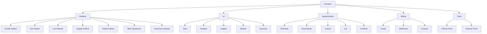
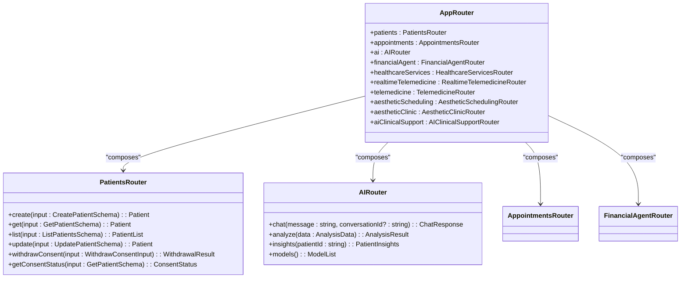
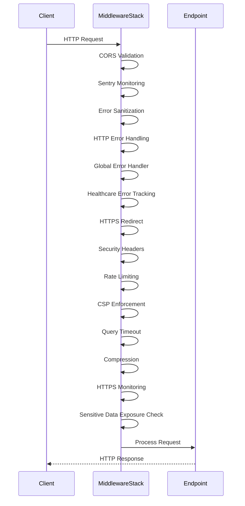
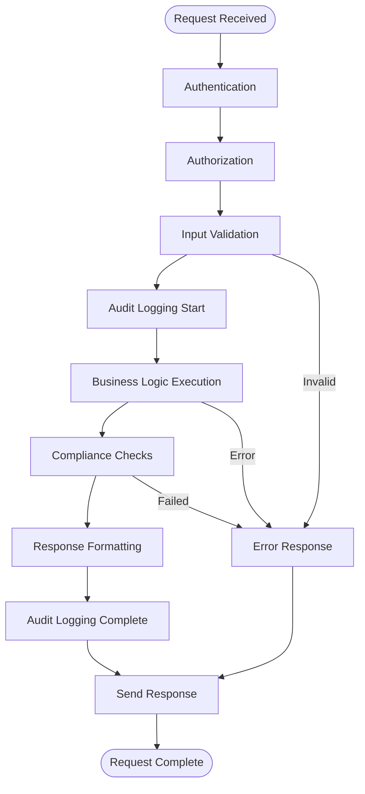

# Route Structure

<cite>
**Referenced Files in This Document**
- [app.ts](file://apps/api/src/app.ts)
- [patients.ts](file://apps/api/src/routes/patients.ts)
- [chat.ts](file://apps/api/src/routes/ai/chat.ts)
- [router.ts](file://apps/api/src/trpc/router.ts)
- [patients.router.ts](file://apps/api/src/trpc/routers/patients.ts)
- [authn.ts](file://apps/api/src/middleware/authn.ts)
- [rate-limiting.ts](file://apps/api/src/middleware/rate-limiting.ts)
- [v1/index.ts](file://apps/api/src/routes/v1/index.ts)
- [v1/ai/index.ts](file://apps/api/src/routes/v1/ai/index.ts)
- [ai/analyze.ts](file://apps/api/src/routes/ai/analyze.ts)
- [ai/crud.ts](file://apps/api/src/routes/v1/ai/crud.ts)
</cite>

## Table of Contents

1. [Introduction](#introduction)
2. [Routing Hierarchy and Versioning](#routing-hierarchy-and-versioning)
3. [Domain-Based RESTful Endpoints](#domain-based-restful-endpoints)
4. [tRPC Procedure Organization](#trpc-procedure-organization)
5. [Middleware Integration](#middleware-integration)
6. [Request Handling Patterns](#request-handling-patterns)
7. [Parameter Extraction and Validation](#parameter-extraction-and-validation)
8. [Response Formatting Standards](#response-formatting-standards)
9. [Common Issues and Solutions](#common-issues-and-solutions)
10. [Conclusion](#conclusion)

## Introduction

The NeonPro backend implements a comprehensive routing structure that combines RESTful endpoints with tRPC procedures to provide a robust API for healthcare applications. The system is organized around key domains including patient management, AI interactions, appointments, billing, and other clinical operations. This documentation details the architecture of the route structure, focusing on how endpoints are organized by domain, versioned for backward compatibility, and secured through middleware integration. The design emphasizes healthcare compliance (LGPD, CFM), performance optimization, and secure data handling while providing flexible access patterns for both traditional REST clients and type-safe tRPC consumers.

**Section sources**

- [app.ts](file://apps/api/src/app.ts#L1-L572)

## Routing Hierarchy and Versioning

The routing hierarchy in NeonPro follows a clear versioning strategy with multiple API versions coexisting to ensure backward compatibility. The system implements both v1 and v2 API versions, with v1 primarily serving legacy endpoints and v2 hosting the current generation of RESTful APIs. The main application router in `app.ts` establishes this versioning scheme by mounting different route modules under specific path prefixes.

Versioned routes are implemented through explicit path mounting, where v1 endpoints are typically mounted under `/api/v1` while v2 endpoints use `/api/v2`. Additionally, some legacy v1 routes exist directly under `/v1` for specific services like health checks and monitoring. The system also maintains a forward-compatible approach by organizing major domains under versioned paths, allowing for future expansion without breaking existing integrations.

```mermaid
graph TD
A[API Root] --> B[/api/v1]
A --> C[/api/v2]
A --> D[/v1]
A --> E[/trpc]
B --> B1[AI Operations]
B --> B2[Billing]
B --> B3[Appointments]
B --> B4[Medical Records]
C --> C1[Patients]
C --> C2[AI]
C --> C3[Financial Copilot]
D --> D1[Health Checks]
D --> D2[Monitoring]
D --> D3[Security Status]
E --> E1[tRPC Procedures]
```

**Diagram sources **

- [app.ts](file://apps/api/src/app.ts#L1-L572)

**Section sources**

- [app.ts](file://apps/api/src/app.ts#L1-L572)
- [v1/index.ts](file://apps/api/src/routes/v1/index.ts#L1-L15)
- [v1/ai/index.ts](file://apps/api/src/routes/v1/ai/index.ts#L1-L19)

## Domain-Based RESTful Endpoints

RESTful endpoints in NeonPro are organized by functional domain, with each major business area having its dedicated route module. The primary domains include patients, appointments, AI interactions, billing, and various clinical tools. Each domain's routes are implemented as independent Hono router instances that can be mounted at specific path locations within the main application.

The patient management domain exemplifies this organization, with endpoints for CRUD operations, bulk operations, document handling, and search functionality all grouped within the patients route module. Similarly, AI-related functionality is divided into specialized subdomains such as chat, analysis, and financial copilot, each with their own set of endpoints. This domain-driven approach enables focused development, testing, and maintenance of related functionality while maintaining clear separation of concerns.



**Diagram sources **

- [patients.ts](file://apps/api/src/routes/patients.ts#L1-L438)
- [chat.ts](file://apps/api/src/routes/ai/chat.ts#L1-L754)
- [ai/analyze.ts](file://apps/api/src/routes/ai/analyze.ts#L1-L294)

**Section sources**

- [patients.ts](file://apps/api/src/routes/patients.ts#L1-L438)
- [chat.ts](file://apps/api/src/routes/ai/chat.ts#L1-L754)
- [ai/analyze.ts](file://apps/api/src/routes/ai/analyze.ts#L1-L294)

## tRPC Procedure Organization

The tRPC procedure organization in NeonPro follows a modular approach that mirrors the domain-based structure of the RESTful endpoints while providing type safety and enhanced developer experience. The main tRPC router (`appRouter`) composes multiple domain-specific routers, each responsible for a particular aspect of the application's functionality. This composition allows for clean separation of concerns while maintaining a unified API surface.

Each domain router exposes procedures that correspond to specific operations within that domain. For example, the patients router includes procedures for creating, retrieving, updating, and listing patients, as well as specialized operations for LGPD consent management. The tRPC procedures benefit from automatic TypeScript inference, ensuring that request and response types are consistent across the entire stack. The router implementation also incorporates healthcare-specific features such as cryptographic consent proofs and audit logging for compliance purposes.



**Diagram sources **

- [router.ts](file://apps/api/src/trpc/router.ts#L1-L115)
- [patients.router.ts](file://apps/api/src/trpc/routers/patients.ts#L1-L684)

**Section sources**

- [router.ts](file://apps/api/src/trpc/router.ts#L1-L115)
- [patients.router.ts](file://apps/api/src/trpc/routers/patients.ts#L1-L684)

## Middleware Integration

Middleware integration in NeonPro's routing system provides a comprehensive security and operational framework that applies consistently across all endpoints. The middleware stack is applied globally to all routes, ensuring that every request passes through the same security, validation, and monitoring processes regardless of the specific endpoint being accessed. This approach guarantees uniform behavior and compliance across the entire API surface.

The middleware chain includes authentication, authorization, rate limiting, error handling, and security headers enforcement. Authentication middleware validates JWT tokens and extracts user context, while authorization middleware enforces role-based access control. Rate limiting is implemented with differentiated policies for various endpoint types, applying stricter limits to sensitive healthcare data endpoints. Security middleware adds healthcare-compliant headers and enforces HTTPS, while error handling middleware ensures consistent error responses and proper logging.



**Diagram sources **

- [app.ts](file://apps/api/src/app.ts#L1-L572)
- [authn.ts](file://apps/api/src/middleware/authn.ts#L1-L307)
- [rate-limiting.ts](file://apps/api/src/middleware/rate-limiting.ts#L1-L215)

**Section sources**

- [app.ts](file://apps/api/src/app.ts#L1-L572)
- [authn.ts](file://apps/api/src/middleware/authn.ts#L1-L307)
- [rate-limiting.ts](file://apps/api/src/middleware/rate-limiting.ts#L1-L215)

## Request Handling Patterns

The request handling patterns in NeonPro follow a consistent approach across both RESTful endpoints and tRPC procedures, emphasizing validation, security, and healthcare compliance. All requests pass through a standardized processing pipeline that begins with authentication and authorization, followed by input validation, business logic execution, and response formatting. This pipeline ensures that every request is handled securely and predictably, regardless of the specific endpoint.

For RESTful endpoints, request handling typically involves extracting validated input from the request object, invoking the appropriate service layer method, and returning a properly formatted response. The system uses Zod for schema validation, ensuring that all incoming data meets expected formats before processing. Error handling is centralized through middleware, but individual endpoints may add additional context-specific error handling when needed. The pattern also includes comprehensive audit logging for compliance purposes, particularly for operations involving patient data.



**Diagram sources **

- [patients.ts](file://apps/api/src/routes/patients.ts#L1-L438)
- [chat.ts](file://apps/api/src/routes/ai/chat.ts#L1-L754)
- [ai/analyze.ts](file://apps/api/src/routes/ai/analyze.ts#L1-L294)

**Section sources**

- [patients.ts](file://apps/api/src/routes/patients.ts#L1-L438)
- [chat.ts](file://apps/api/src/routes/ai/chat.ts#L1-L754)
- [ai/analyze.ts](file://apps/api/src/routes/ai/analyze.ts#L1-L294)

## Parameter Extraction and Validation

Parameter extraction and validation in NeonPro employs a systematic approach using Zod schemas to ensure data integrity and security across all endpoints. Both RESTful and tRPC endpoints leverage schema validation to verify that incoming requests contain properly formatted and semantically correct data. The validation process occurs early in the request handling pipeline, preventing invalid data from reaching business logic layers.

For RESTful endpoints, parameters are extracted from query strings, URL parameters, and request bodies based on their location, then validated against predefined Zod schemas. The patients endpoint demonstrates this pattern with separate schemas for creation, update, and query operations, each defining the required fields, data types, and constraints. Similarly, AI endpoints use specialized schemas that validate message content, model preferences, and contextual information. This schema-driven approach enables automatic type inference and provides clear error messages when validation fails.

**Section sources**

- [patients.ts](file://apps/api/src/routes/patients.ts#L1-L438)
- [chat.ts](file://apps/api/src/routes/ai/chat.ts#L1-L754)
- [ai/analyze.ts](file://apps/api/src/routes/ai/analyze.ts#L1-L294)

## Response Formatting Standards

Response formatting standards in NeonPro ensure consistency across all API endpoints, providing predictable and well-structured responses regardless of the underlying operation. The system follows healthcare industry best practices for API responses, including standardized success and error formats, comprehensive metadata, and compliance-related headers. Successful responses typically include a success flag, data payload, and optional message, while error responses provide detailed error information with appropriate HTTP status codes.

All endpoints include standardized response headers that convey important operational and compliance information. These include X-Request-ID for tracing, X-Response-Time for performance monitoring, and various healthcare compliance headers such as X-CFM-Compliant and X-LGPD-Compliant. The response structure also incorporates pagination metadata for list operations and cryptographic proofs for audit trail purposes. This consistent formatting enables client applications to handle responses uniformly while meeting regulatory requirements for healthcare data handling.

**Section sources**

- [patients.ts](file://apps/api/src/routes/patients.ts#L1-L438)
- [chat.ts](file://apps/api/src/routes/ai/chat.ts#L1-L754)
- [ai/analyze.ts](file://apps/api/src/routes/ai/analyze.ts#L1-L294)

## Common Issues and Solutions

Common issues in NeonPro's routing system include route conflicts, query parameter parsing challenges, and payload validation errors, all of which have been addressed through deliberate architectural choices. Route conflicts are prevented through careful namespace planning and the use of versioned endpoints, ensuring that new functionality can be added without disrupting existing integrations. The hierarchical routing structure with clear domain separation minimizes the risk of naming collisions.

Query parameter parsing is handled consistently across endpoints using Zod validation with transformation functions that convert string inputs to appropriate types while enforcing limits and defaults. For example, the patients endpoint transforms page and limit parameters from strings to numbers while applying sensible defaults and maximum values. Payload validation issues are mitigated through comprehensive schema definitions that specify required fields, data types, and constraints, with detailed error messages returned when validation fails. The system also addresses performance concerns through caching strategies, query timeouts, and rate limiting tailored to different endpoint types.

**Section sources**

- [patients.ts](file://apps/api/src/routes/patients.ts#L1-L438)
- [chat.ts](file://apps/api/src/routes/ai/chat.ts#L1-L754)
- [rate-limiting.ts](file://apps/api/src/middleware/rate-limiting.ts#L1-L215)

## Conclusion

The route structure in NeonPro's backend represents a sophisticated blend of RESTful design principles and modern tRPC capabilities, organized around healthcare domains and optimized for compliance, security, and performance. By combining versioned REST endpoints with type-safe tRPC procedures, the system provides flexible access patterns for different client needs while maintaining a consistent security posture through comprehensive middleware integration. The domain-driven organization enables focused development and maintenance, while standardized patterns for request handling, parameter validation, and response formatting ensure predictability and reliability across the entire API surface. This architecture effectively balances the need for innovation with the requirements of healthcare regulation, providing a robust foundation for clinical applications.
