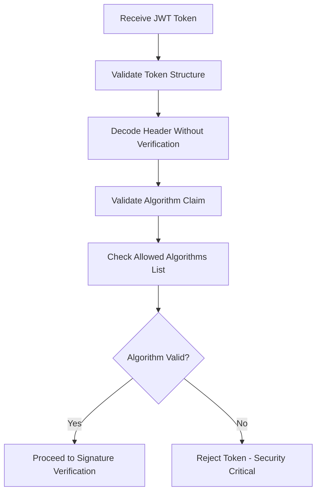
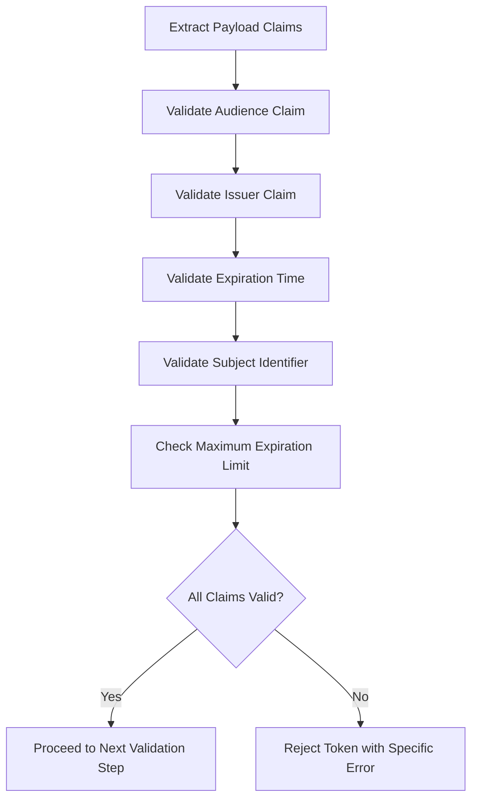
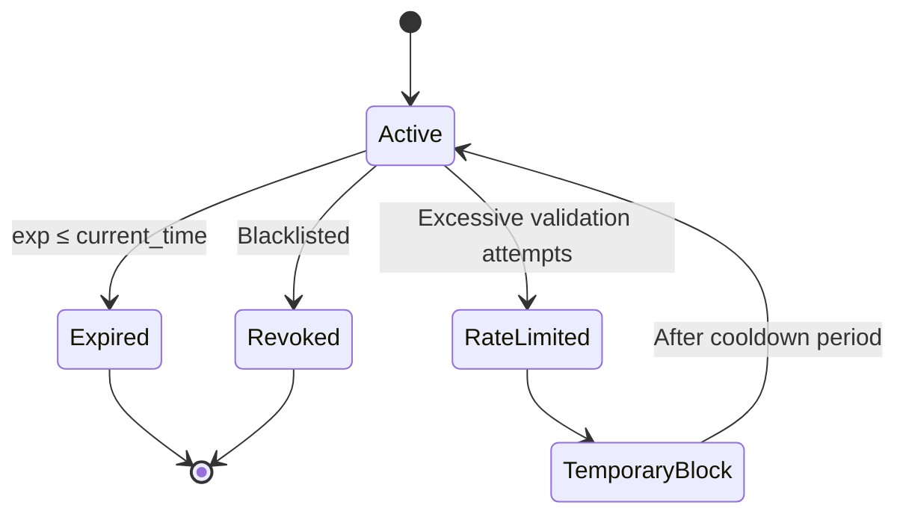
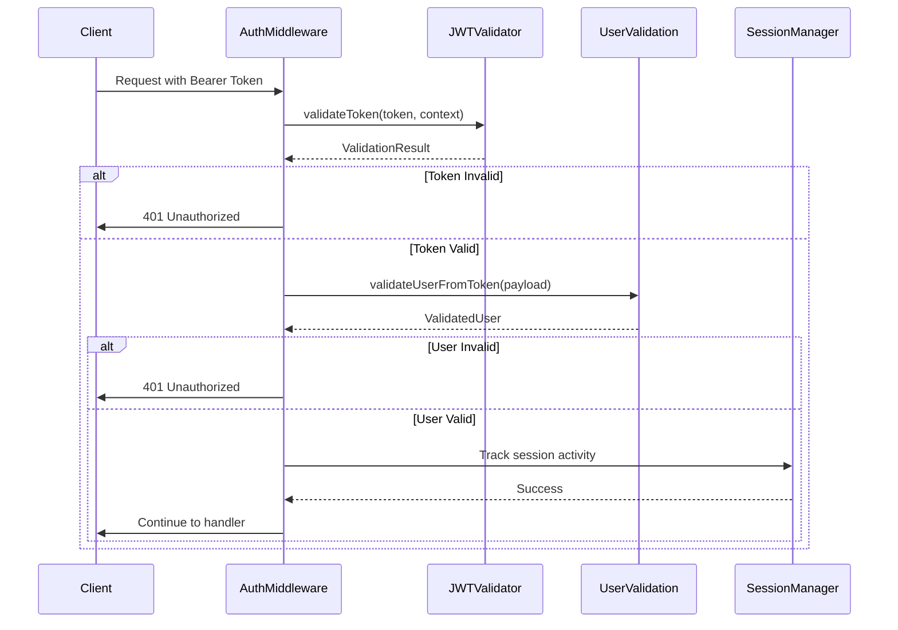
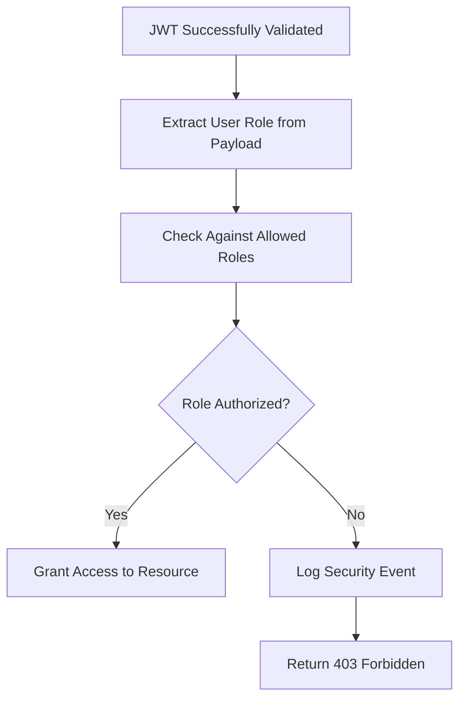
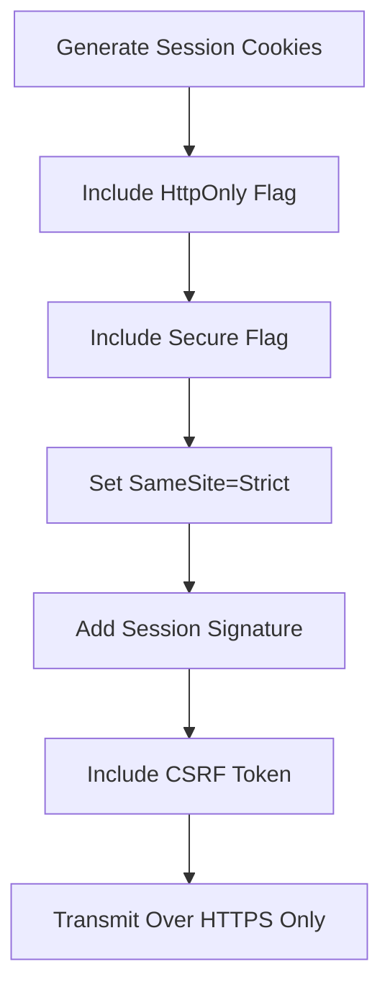
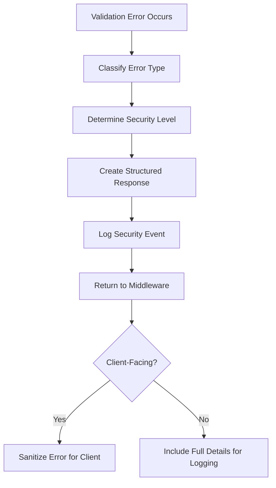

# JWT Validation

<cite>
**Referenced Files in This Document**   
- [jwt-validator.ts](file://apps/api/src/security/jwt-validator.ts)
- [authn.ts](file://apps/api/src/middleware/authn.ts)
- [session-cookie-utils.ts](file://apps/api/src/security/session-cookie-utils.ts)
- [enhanced-session-manager.ts](file://apps/api/src/security/enhanced-session-manager.ts)
</cite>

## Table of Contents
1. [Introduction](#introduction)
2. [Token Structure and Signing Algorithms](#token-structure-and-signing-algorithms)
3. [Claims Validation Process](#claims-validation-process)
4. [Token Lifecycle Management](#token-lifecycle-management)
5. [Integration with Authentication Providers](#integration-with-authentication-providers)
6. [Role-Based Access Control Integration](#role-based-access-control-integration)
7. [Security Considerations](#security-considerations)
8. [Healthcare Data Privacy Compliance](#healthcare-data-privacy-compliance)
9. [Error Handling and Middleware](#error-handling-and-middleware)

## Introduction
The JWT validation system in the neonpro backend implements comprehensive security measures for token-based authentication, following OWASP security best practices and healthcare compliance requirements (LGPD, ANVISA). The system provides robust validation of JSON Web Tokens through multiple layers of security checks, including algorithm validation, claim verification, rate limiting, and token revocation mechanisms.

The core implementation is centered around the `JWTSecurityValidator` class, which performs a 10-step validation process to ensure token integrity and security. This documentation details the complete architecture, functionality, and security features of the JWT validation system.

**Section sources**
- [jwt-validator.ts](file://apps/api/src/security/jwt-validator.ts#L1-L712)

## Token Structure and Signing Algorithms
The JWT validation system supports multiple signing algorithms while implementing strict security controls to prevent common vulnerabilities. The system currently allows HS256 and HS512 algorithms for HMAC-based signatures, with configuration options to support additional algorithms as needed.

### Algorithm Security Features
The validator implements several critical security measures:

- **Algorithm Confusion Prevention**: Explicitly rejects the 'none' algorithm to prevent signature bypass attacks
- **Whitelist Enforcement**: Only allows algorithms specified in the security configuration
- **Key ID Validation**: Supports key rotation through kid (key ID) claims
- **Flexible Configuration**: Allows different algorithms for development and production environments

**Diagram sources**
- [jwt-validator.ts](file://apps/api/src/security/jwt-validator.ts#L263-L314)

The system uses a key store (Map<string, string>) to manage signing keys, supporting both default keys and key ID-based lookup for rotation scenarios. The key store is initialized with secrets from the environment or secret manager, with fallback mechanisms for development environments.

**Section sources**
- [jwt-validator.ts](file://apps/api/src/security/jwt-validator.ts#L70-L100)

## Claims Validation Process
The JWT validation system performs comprehensive claims validation to ensure token authenticity and integrity. The validation process checks multiple standard JWT claims as well as custom healthcare-specific claims.

### Standard Claims Validation
The system validates the following standard JWT claims:

- **Audience (aud)**: Must match allowed audiences ('authenticated' by default)
- **Issuer (iss)**: Must be from trusted issuers (Supabase URLs configured automatically)
- **Expiration (exp)**: Must be present, not expired, and within maximum allowed duration
- **Subject (sub)**: Must be present and properly formatted

**Diagram sources**
- [jwt-validator.ts](file://apps/api/src/security/jwt-validator.ts#L414-L467)

### Healthcare-Specific Claims
In addition to standard claims, the system validates healthcare-specific requirements:

- **User Role Validation**: Ensures roles are one of: patient, healthcare_professional, admin, staff
- **Compliance Requirements**: Enforces LGPD and ANVISA regulations for healthcare data access
- **Contextual Validation**: Validates claims based on the specific healthcare context

The validation occurs after signature verification but before blacklist checking, ensuring that only properly signed tokens with valid claims are processed further.

**Section sources**
- [jwt-validator.ts](file://apps/api/src/security/jwt-validator.ts#L510-L549)

## Token Lifecycle Management
The JWT validation system implements comprehensive token lifecycle management, including issuance, refresh, expiration, and revocation mechanisms.

### Token Expiration Policies
The system enforces strict expiration policies to minimize the window of opportunity for token misuse:

- **Maximum Token Lifetime**: Configurable limit (default 24 hours)
- **Clock Drift Handling**: Proper timestamp comparison using Unix time
- **Expiration Validation**: Tokens are rejected if past their expiration time
- **Excessive Duration Detection**: Tokens with unreasonably long expiration times are rejected

**Diagram sources**
- [jwt-validator.ts](file://apps/api/src/security/jwt-validator.ts#L467-L510)

### Token Revocation Strategies
The system implements multiple token revocation strategies:

- **Token Blacklisting**: Immediate revocation of specific tokens using jti (JWT ID)
- **User-Wide Revocation**: Invalidating all tokens for a specific user (sub claim)
- **Automatic Cleanup**: Periodic removal of expired blacklist entries
- **Rate Limiting**: Protection against brute force attacks on token validation

The blacklist is implemented as an in-memory Map with expiration tracking, where each entry contains the blocked token identifier, block timestamp, expiration time, and reason for blocking.

**Section sources**
- [jwt-validator.ts](file://apps/api/src/security/jwt-validator.ts#L509-L549)

## Integration with Authentication Providers
The JWT validation system integrates seamlessly with authentication providers and user session management through a multi-layered middleware architecture.

### Authentication Middleware Flow
The authentication process follows a structured flow:

**Diagram sources**
- [authn.ts](file://apps/api/src/middleware/authn.ts#L29-L111)
- [jwt-validator.ts](file://apps/api/src/security/jwt-validator.ts#L118-L209)

### Session Management Integration
The JWT system integrates with the enhanced session manager to provide comprehensive session security:

- **IP Binding**: Sessions are bound to the originating IP address with mobile network tolerance
- **Anomaly Detection**: Monitors for suspicious activities like rapid IP changes
- **Concurrent Session Control**: Limits the number of concurrent sessions per user
- **Timeout Management**: Implements both idle and absolute session timeouts

The integration ensures that JWT validation works in conjunction with session-level security controls, providing defense in depth.

**Section sources**
- [authn.ts](file://apps/api/src/middleware/authn.ts#L29-L111)
- [enhanced-session-manager.ts](file://apps/api/src/security/enhanced-session-manager.ts#L92-L797)

## Role-Based Access Control Integration
The JWT validation system integrates with role-based access control (RBAC) to enforce granular permissions based on user roles extracted from token claims.

### Authorization Workflow
After successful JWT validation, the system extracts user roles and applies appropriate access controls:

The authorization middleware checks if the user's role (_role claim) is included in the list of allowed roles for the requested resource. This check is performed after authentication to ensure only validated users are subject to role checks.

### Healthcare Role Validation
During JWT validation, the system specifically validates healthcare-related roles:

- **Allowed Roles**: patient, healthcare_professional, admin, staff
- **Invalid Role Handling**: Tokens with unauthorized roles are rejected during validation
- **Role-Based Access Patterns**: Different roles have different access levels to healthcare data

This two-tier approach—validating roles during JWT validation and enforcing them during authorization—provides layered security for healthcare data access.

**Section sources**
- [authn.ts](file://apps/api/src/middleware/authn.ts#L116-L149)
- [jwt-validator.ts](file://apps/api/src/security/jwt-validator.ts#L510-L549)

## Security Considerations
The JWT validation system implements multiple security measures to protect against common threats and vulnerabilities.

### Token Leakage Prevention
The system employs several strategies to prevent token leakage:

- **Secure Cookie Attributes**: Uses HttpOnly, Secure, and SameSite flags for session cookies
- **Request Header Validation**: Only accepts tokens via Authorization header
- **CSRF Protection**: Implements CSRF tokens alongside session cookies
- **Signature Validation**: Requires cryptographic signature verification

**Diagram sources**
- [session-cookie-utils.ts](file://apps/api/src/security/session-cookie-utils.ts#L31-L324)

### Replay Attack Protection
The system protects against replay attacks through:

- **Short Token Lifetimes**: Limited expiration windows reduce replay opportunities
- **Token Blacklisting**: Immediate revocation capability for compromised tokens
- **Rate Limiting**: Prevents brute force attempts to reuse tokens
- **Unique Identifiers**: Leverages jti claims when available

The rate limiting mechanism tracks authentication attempts by client IP or session ID, blocking excessive requests to prevent token validation abuse.

### Clock Drift Handling
The system properly handles clock drift between servers:

- **Unix Timestamp Comparison**: Uses standard Unix time (seconds since epoch)
- **No Built-in Buffer**: Relies on proper NTP synchronization rather than time buffers
- **Consistent Time Source**: All services use the same time reference

**Section sources**
- [session-cookie-utils.ts](file://apps/api/src/security/session-cookie-utils.ts#L31-L405)
- [jwt-validator.ts](file://apps/api/src/security/jwt-validator.ts#L467-L510)

## Healthcare Data Privacy Compliance
The JWT validation system is designed to comply with healthcare data privacy regulations, particularly LGPD (Brazilian General Data Protection Law) and ANVISA requirements.

### Regulatory Alignment
The implementation aligns with key regulatory requirements:

- **Data Minimization**: Only necessary claims are validated and stored
- **Purpose Limitation**: Tokens are used solely for authentication purposes
- **Storage Limitation**: In-memory storage with automatic cleanup
- **Integrity and Confidentiality**: Cryptographic protection of tokens and sessions

### Healthcare-Specific Security Controls
The system implements healthcare-specific security features:

- **Role-Based Access**: Restricts access based on healthcare professional status
- **Audit Logging**: Comprehensive logging of authentication events
- **Emergency Access**: Support for supervisor override scenarios
- **Consent Management**: Integration with consent tracking systems

The validator specifically checks for valid healthcare roles and can be extended to validate additional healthcare-specific claims as required by compliance frameworks.

**Section sources**
- [jwt-validator.ts](file://apps/api/src/security/jwt-validator.ts#L1-L712)
- [enhanced-session-manager.ts](file://apps/api/src/security/enhanced-session-manager.ts#L92-L797)

## Error Handling and Middleware
The JWT validation system includes comprehensive error handling and is integrated into the application through middleware components.

### Error Handling Strategy
The system returns detailed validation results that include:

- **Validation Status**: Boolean indicating success or failure
- **Error Code**: Machine-readable code for programmatic handling
- **Security Level**: Assessment of the security severity
- **Error Message**: Human-readable description (for logging, not client exposure)

Common error codes include:
- RATE_LIMIT_EXCEEDED
- INVALID_TOKEN_STRUCTURE
- ALGORITHM_NOT_ALLOWED
- TOKEN_EXPIRED
- INVALID_SIGNATURE
- USER_TOKENS_REVOKED

### Middleware Implementation
The primary authentication middleware is implemented in authn.ts and performs the following steps:

1. Extract token from Authorization header
2. Validate JWT using the comprehensive security validator
3. Extract and validate user information from token payload
4. Set user context for downstream handlers
5. Handle errors appropriately with logging

The middleware integrates rate limiting, secure header validation, and proper error handling to provide a robust authentication layer.

**Section sources**
- [authn.ts](file://apps/api/src/middleware/authn.ts#L29-L111)
- [jwt-validator.ts](file://apps/api/src/security/jwt-validator.ts#L118-L209)