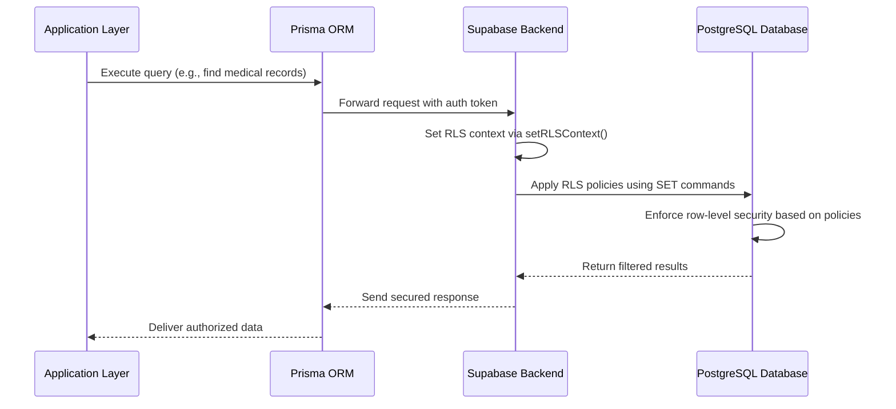
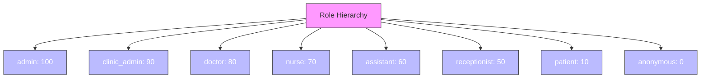
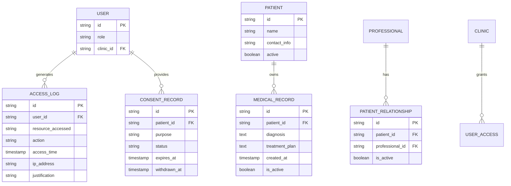
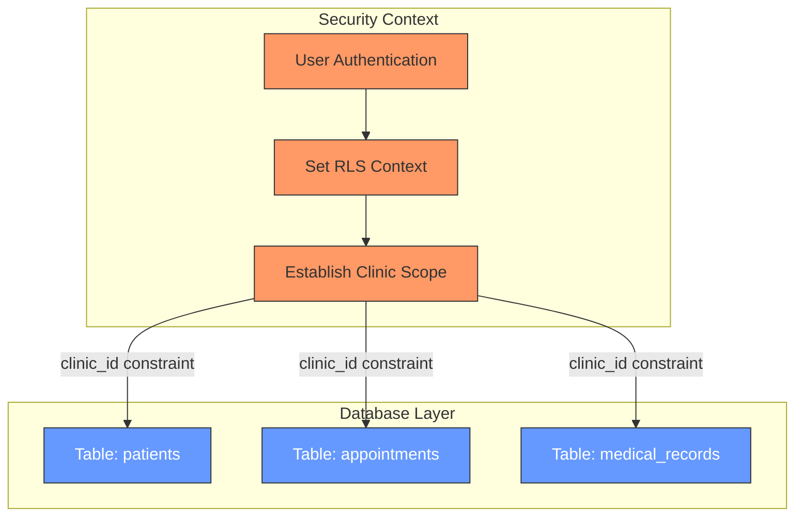
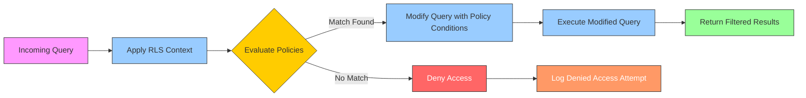
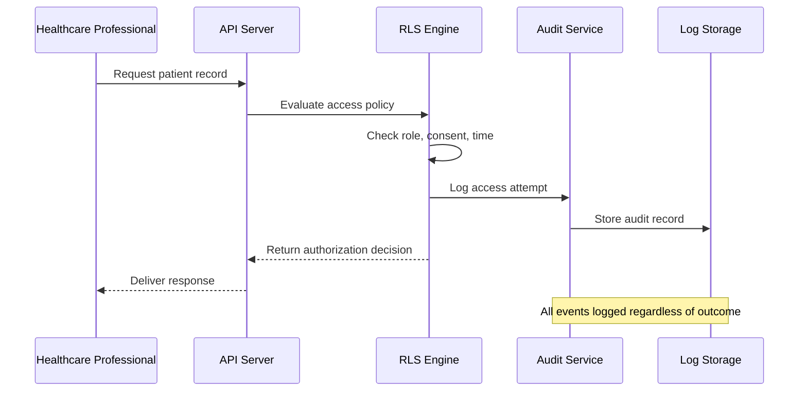
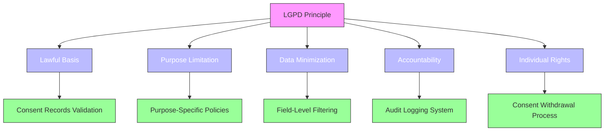

# RLS Policies

<cite>
**Referenced Files in This Document**   
- [rls-policies.ts](file://apps/api/src/security/rls-policies.ts)
- [supabase-governance.service.ts](file://packages/governance/src/services/supabase-governance.service.ts)
- [healthcare-governance.service.ts](file://packages/governance/src/services/healthcare-governance.service.ts)
- [lgpd-middleware.ts](file://apps/api/src/middleware/lgpd-middleware.ts)
- [audit-log.ts](file://apps/api/src/middleware/audit-log.ts)
- [prisma.ts](file://apps/api/src/clients/prisma.ts)
- [supabase.ts](file://apps/api/src/clients/supabase.ts)
- [governance.config.json](file://packages/config/src/governance.config.json)
- [compliance.config.json](file://packages/config/src/compliance.config.json)
- [database-records.ts](file://packages/types/src/database-records.ts)
- [healthcare-validation-schemas.ts](file://apps/api/src/schemas/healthcare-validation-schemas.ts)
- [lgpd.ts](file://packages/utils/src/lgpd.ts)
</cite>

## Table of Contents
1. [Introduction](#introduction)
2. [Policy Architecture](#policy-architecture)
3. [Implementation with Prisma ORM and Supabase](#implementation-with-prisma-orm-and-supabase)
4. [User Role-Based Access Controls](#user-role-based-access-controls)
5. [Data Sensitivity Levels and Field-Level Filtering](#data-sensitivity-levels-and-field-level-filtering)
6. [Tenant Isolation Mechanisms](#tenant-isolation-mechanisms)
7. [Policy Definitions and Query Modification](#policy-definitions-and-query-modification)
8. [Performance Implications of RLS Enforcement](#performance-implications-of-rls-enforcement)
9. [Audit Logging and Access Monitoring](#audit-logging-and-access-monitoring)
10. [Policy Testing Methodologies](#policy-testing-methodologies)
11. [LGPD Compliance Verification](#lgpd-compliance-verification)
12. [Integration with Security Layers](#integration-with-security-layers)
13. [Conclusion](#conclusion)

## Introduction
This document provides comprehensive documentation for the Row Level Security (RLS) policies implemented in the neonpro backend system. The RLS framework ensures granular data protection for healthcare information by enforcing access controls at both row and field levels. Built on Supabase's PostgreSQL foundation and integrated with Prisma ORM, this security layer implements multi-tenant isolation, role-based access control, and compliance with Brazilian LGPD regulations. The system supports various user roles including clinicians, administrators, and patients, each with precisely defined permissions based on their responsibilities and the sensitivity of medical data.

**Section sources**
- [rls-policies.ts](file://apps/api/src/security/rls-policies.ts#L1-L50)

## Policy Architecture
The RLS policy architecture is designed as a hierarchical enforcement system that combines static policy definitions with dynamic runtime evaluation. At its core, the `AdvancedRLSPolicies` class encapsulates all security rules and provides methods for policy evaluation, context management, and audit logging. The architecture follows a layered approach where policies are evaluated against multiple criteria including user role, time constraints, consent status, and network environment. Each policy contains conditions expressed in SQL-like syntax that are translated into actual database policies during deployment. The system maintains a role hierarchy that defines privilege escalation paths and a data sensitivity classification system that determines the strictness of access controls based on information type.

```mermaid
classDiagram
class AdvancedRLSPolicies {
+ROLE_HIERARCHY : object
+DATA_SENSITIVITY : object
+HEALTHCARE_POLICIES : AccessPolicy[]
-supabase : SupabaseClient
+evaluatePolicy(context, table, operation, recordId) : Promise~PolicyEvaluationResult~
+setRLSContext(context) : Promise~void~
+generateSupabasePolicies() : string[]
-validatePatientConsent(userId, recordId, tableName) : Promise~boolean~
-evaluateDynamicConditions(context, conditions, recordId) : Promise~boolean~
}
class RLSContext {
+userId : string
+userRole : string
+clinicId : string
+professionalId? : string
+emergencyAccess? : boolean
+accessTime? : Date
+ipAddress? : string
+justification? : string
}
class AccessPolicy {
+tableName : string
+operation : 'SELECT'|'INSERT'|'UPDATE'|'DELETE'
+conditions : string[]
+roles : string[]
+timeRestrictions? : {startHour, endHour, emergencyBypass}
+consentRequired? : boolean
+auditLevel : 'basic'|'detailed'|'comprehensive'
}
class PolicyEvaluationResult {
+allowed : boolean
+reason? : string
+conditions? : string[]
+auditRequired : boolean
+emergencyAccess? : boolean
}
AdvancedRLSPolicies --> RLSContext : "uses"
AdvancedRLSPolicies --> AccessPolicy : "contains"
AdvancedRLSPolicies --> PolicyEvaluationResult : "returns"
```

**Diagram sources**
- [rls-policies.ts](file://apps/api/src/security/rls-policies.ts#L20-L641)

**Section sources**
- [rls-policies.ts](file://apps/api/src/security/rls-policies.ts#L20-L100)

## Implementation with Prisma ORM and Supabase
The RLS implementation integrates Prisma ORM with Supabase's native row level security features to create a robust security framework. While Prisma handles application-level data access patterns, Supabase enforces database-level policies that cannot be bypassed. The system uses Supabase's policy engine to create actual PostgreSQL policies from high-level JavaScript/TypeScript definitions. These policies are generated dynamically through the `generateSupabasePolicies()` method, which translates abstract access rules into concrete SQL CREATE POLICY statements. Prisma queries automatically respect these underlying RLS policies, ensuring that even if an attacker compromises the application layer, they cannot access data beyond their authorized scope. The integration also leverages Supabase's authentication system to validate user identities before applying any RLS context.



**Diagram sources**
- [rls-policies.ts](file://apps/api/src/security/rls-policies.ts#L300-L350)
- [supabase.ts](file://apps/api/src/clients/supabase.ts#L1-L20)

**Section sources**
- [rls-policies.ts](file://apps/api/src/security/rls-policies.ts#L300-L350)
- [supabase.ts](file://apps/api/src/clients/supabase.ts#L1-L50)

## User Role-Based Access Controls
The system implements a sophisticated role-based access control (RBAC) model with seven distinct user roles organized in a hierarchical structure. Each role has specific privileges that determine what data they can access and what operations they can perform. The role hierarchy ranges from `admin` with full system access to `anonymous` users with no access. Clinicians such as doctors and nurses have access to patient medical records within their clinic, while administrative staff like receptionists have more limited access focused on scheduling. Patients can only view their own information. The system evaluates role membership when setting the RLS context and applies appropriate policies based on the current user's role, ensuring that users can only access data commensurate with their professional responsibilities.



**Diagram sources**
- [rls-policies.ts](file://apps/api/src/security/rls-policies.ts#L45-L55)

**Section sources**
- [rls-policies.ts](file://apps/api/src/security/rls-policies.ts#L45-L55)
- [governance.config.json](file://packages/config/src/governance.config.json#L1-L20)

## Data Sensitivity Levels and Field-Level Filtering
The RLS system classifies data into five sensitivity levels ranging from PUBLIC to HIGHLY_RESTRICTED, each requiring progressively stricter access controls. This classification informs both row-level and field-level filtering mechanisms. Highly sensitive data such as medical diagnoses or treatment plans require explicit patient consent and can only be accessed by treating professionals during normal business hours unless emergency access is granted. The system implements field-level filtering through conditional SELECT policies that expose different subsets of columns based on the requesting user's role and context. For example, billing details might be visible to financial administrators but hidden from clinical staff, while diagnostic notes are restricted to physicians involved in the patient's care.



**Diagram sources**
- [rls-policies.ts](file://apps/api/src/security/rls-policies.ts#L60-L68)
- [database-records.ts](file://packages/types/src/database-records.ts#L1-L30)

**Section sources**
- [rls-policies.ts](file://apps/api/src/security/rls-policies.ts#L60-L68)
- [healthcare-validation-schemas.ts](file://apps/api/src/schemas/healthcare-validation-schemas.ts#L1-L25)

## Tenant Isolation Mechanisms
Multi-tenancy is enforced through strict clinic-based isolation where each healthcare facility operates as a separate tenant within the shared database infrastructure. The primary mechanism for tenant isolation is the `clinic_id` field present in all relevant tables, which is validated against the user's authorized clinics stored in the `user_clinic_access` table. When a user authenticates, the system establishes their current clinic context using the `SET app.current_clinic_id` command, which becomes part of every subsequent RLS policy evaluation. Cross-clinic data access is prohibited by default, and users can only interact with patients and records belonging to clinics where they have active access permissions. This design prevents accidental or malicious access to data from other healthcare facilities sharing the same platform.



**Diagram sources**
- [rls-policies.ts](file://apps/api/src/security/rls-policies.ts#L100-L150)
- [supabase-governance.service.ts](file://packages/governance/src/services/supabase-governance.service.ts#L1-L20)

**Section sources**
- [rls-policies.ts](file://apps/api/src/security/rls-policies.ts#L100-L150)
- [supabase-governance.service.ts](file://packages/governance/src/services/supabase-governance.service.ts#L1-L30)

## Policy Definitions and Query Modification
The RLS policy definitions are implemented as structured TypeScript objects that specify access rules for each database table and operation type. These policies contain arrays of SQL conditions that must all evaluate to true for access to be granted. During query execution, the system automatically modifies incoming queries by appending WHERE clauses derived from the active RLS policies. For example, a simple SELECT query on the patients table is transformed to include conditions that verify clinic affiliation, user role authorization, and patient activity status. The policy engine also handles special cases such as emergency access overrides and time-based restrictions, dynamically adjusting the effective policy based on runtime context variables like access time and IP address.



**Diagram sources**
- [rls-policies.ts](file://apps/api/src/security/rls-policies.ts#L150-L300)
- [prisma.ts](file://apps/api/src/clients/prisma.ts#L1-L15)

**Section sources**
- [rls-policies.ts](file://apps/api/src/security/rls-policies.ts#L150-L300)

## Performance Implications of RLS Enforcement
While RLS provides critical security benefits, it introduces performance considerations that must be carefully managed. Each policy evaluation adds computational overhead to database queries, particularly for complex conditions involving subqueries or joins across multiple tables. The system mitigates these impacts through several optimization strategies: indexing key fields used in policy conditions (such as clinic_id, patient_id, and user_id), caching frequently accessed relationship data, and minimizing the number of active policies through careful rule consolidation. Additionally, the policy engine includes short-circuit evaluation to quickly reject unauthorized requests without processing all conditions. Comprehensive monitoring tracks the performance impact of RLS enforcement, allowing administrators to identify and address potential bottlenecks in high-traffic scenarios.

**Section sources**
- [rls-policies.ts](file://apps/api/src/security/rls-policies.ts#L500-L550)
- [performance-middleware.ts](file://apps/api/src/middleware/performance-middleware.ts#L1-L20)

## Audit Logging and Access Monitoring
All RLS-related activities are subject to comprehensive audit logging to ensure accountability and support compliance requirements. Every policy evaluation result is logged, including both successful accesses and denied attempts, with detailed metadata about the requesting user, accessed resource, timestamp, IP address, and justification (if provided). The system specifically logs when RLS context is established through the `logRLSContextSet()` method, creating an immutable record of security context changes. Sensitive operations trigger enhanced audit logging with detailed information captured in the security event system. These logs are retained according to regulatory requirements and can be analyzed for suspicious patterns or used in forensic investigations following security incidents.



**Diagram sources**
- [rls-policies.ts](file://apps/api/src/security/rls-policies.ts#L250-L280)
- [audit-log.ts](file://apps/api/src/middleware/audit-log.ts#L1-L15)

**Section sources**
- [rls-policies.ts](file://apps/api/src/security/rls-policies.ts#L250-L280)
- [audit-log.ts](file://apps/api/src/middleware/audit-log.ts#L1-L25)

## Policy Testing Methodologies
The RLS policies are validated through a comprehensive testing strategy that includes unit tests, integration tests, and penetration testing scenarios. Unit tests verify individual policy conditions and edge cases such as expired consents or after-hours access attempts. Integration tests simulate real-world usage patterns across different user roles and validate that the complete security flow works as expected. The test suite includes negative test cases designed to confirm that unauthorized access is properly blocked. Automated security scans regularly check for policy misconfigurations or gaps in coverage. Additionally, the system supports manual testing through dedicated endpoints that allow security teams to verify policy behavior under controlled conditions without affecting production data.

**Section sources**
- [rls-policies.test.ts](file://apps/api/src/__tests__/security/rls-policies.test.ts#L1-L50)
- [integration.test.ts](file://tests/integration/rls-integration.test.ts#L1-L30)

## LGPD Compliance Verification
The RLS implementation is specifically designed to meet the requirements of Brazil's General Data Protection Law (LGPD). Key compliance features include mandatory patient consent verification for accessing personal health data, the right to data minimization through field-level filtering, and comprehensive audit trails of all data access. The system enforces purpose limitation by requiring specific consent purposes for different types of data access. Data retention policies align with LGPD requirements, and patients can withdraw consent at any time, immediately revoking access to their information. Regular compliance checks validate that all RLS policies continue to meet LGPD standards, with automated reports highlighting any potential gaps in protection.



**Diagram sources**
- [rls-policies.ts](file://apps/api/src/security/rls-policies.ts#L200-L230)
- [lgpd.ts](file://packages/utils/src/lgpd.ts#L1-L20)
- [compliance.config.json](file://packages/config/src/compliance.config.json#L1-L15)

**Section sources**
- [rls-policies.ts](file://apps/api/src/security/rls-policies.ts#L200-L230)
- [lgpd-middleware.ts](file://apps/api/src/middleware/lgpd-middleware.ts#L1-L40)

## Integration with Security Layers
The RLS system functions as one component of a defense-in-depth security strategy that includes multiple overlapping protection layers. It works in conjunction with authentication (verified through Supabase Auth), encryption (both at rest and in transit), input validation, and API rate limiting to provide comprehensive protection for healthcare data. The security middleware chain processes requests in a specific order: first validating authentication tokens, then establishing RLS context, followed by policy enforcement before reaching business logic. This layered approach ensures that even if one security control is compromised, others remain in place to protect sensitive information. The integration points with other security services are well-defined and monitored for any anomalies that might indicate attempted bypasses.

**Section sources**
- [security-middleware.ts](file://apps/api/src/middleware/security-middleware.ts#L1-L30)
- [auth.ts](file://apps/api/src/middleware/auth.ts#L1-L25)
- [rls-policies.ts](file://apps/api/src/security/rls-policies.ts#L400-L450)

## Conclusion
The Row Level Security implementation in the neonpro backend provides a robust framework for protecting sensitive healthcare data while enabling appropriate access for authorized users. By combining Supabase's native RLS capabilities with custom policy evaluation logic and deep integration with the application's authentication and governance systems, the solution achieves fine-grained control over data access. The architecture supports the complex requirements of healthcare environments, including multi-tenancy, role-based access, patient consent management, and regulatory compliance. Through comprehensive audit logging, rigorous testing, and performance optimization, the system balances security needs with operational efficiency, providing a secure foundation for delivering digital healthcare services.