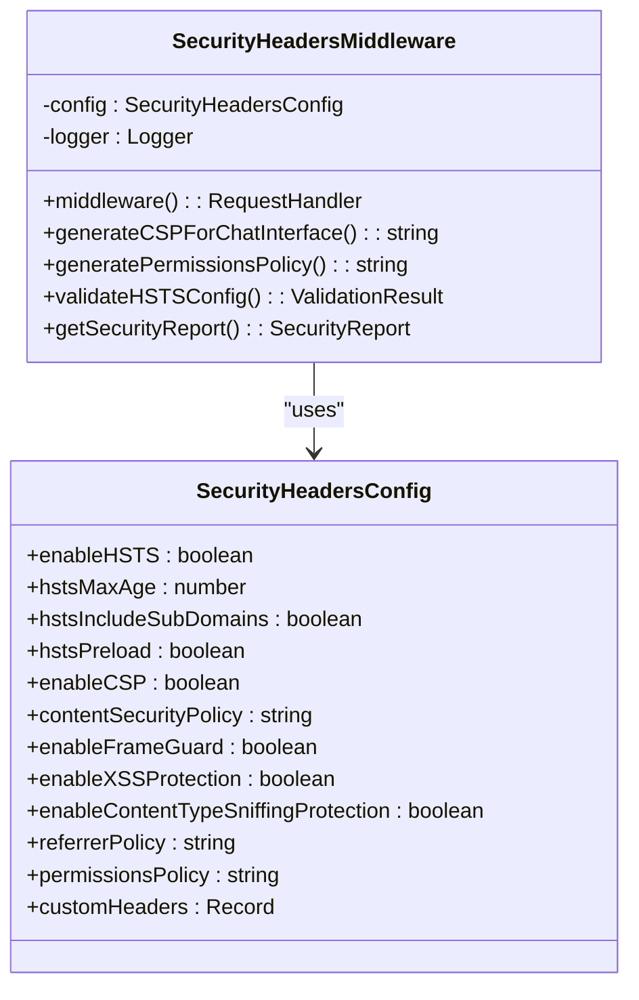
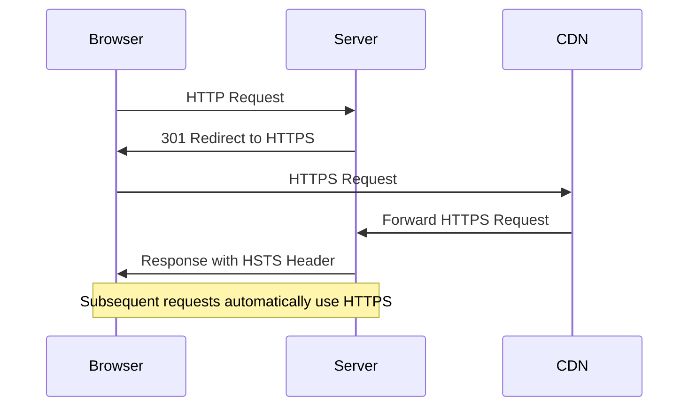
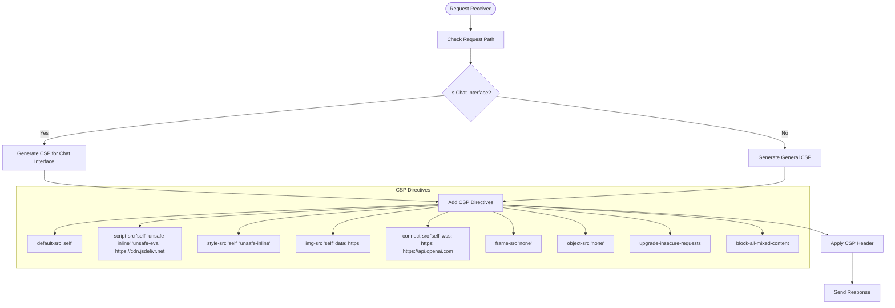
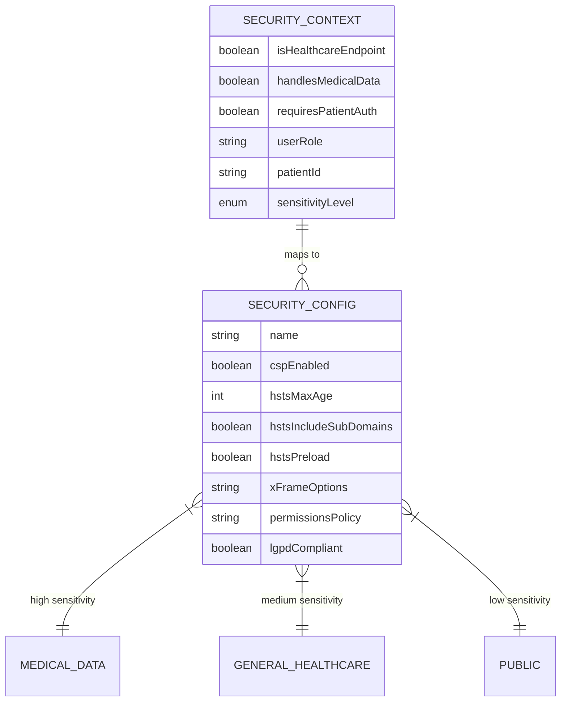
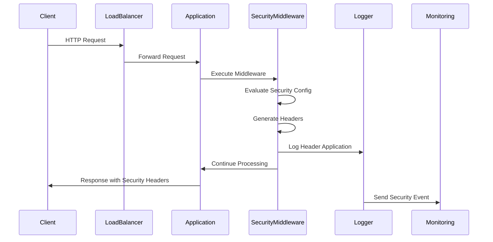
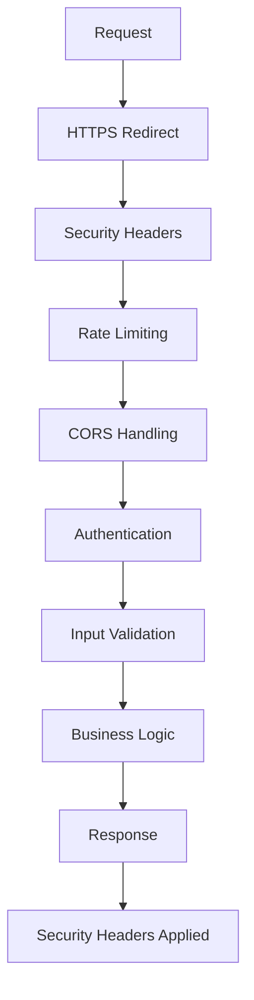

# Security Headers

<cite>
**Referenced Files in This Document**
- [security-headers.ts](file://apps/api/src/middleware/security-headers.ts)
- [https-config.ts](file://apps/api/src/config/https-config.ts)
- [tls-config.ts](file://apps/api/src/config/tls-config.ts)
- [tls-constants.ts](file://apps/api/src/config/tls-constants.ts)
- [security-headers-service.ts](file://apps/api/src/services/security-headers-service.ts)
</cite>

## Table of Contents

1. [Introduction](#introduction)
2. [Security Headers Configuration](#security-headers-configuration)
3. [HTTP Strict Transport Security (HSTS)](#http-strict-transport-security-hsts)
4. [Content Security Policy (CSP)](#content-security-policy-csp)
5. [X-Frame-Options and Clickjacking Protection](#x-frame-options-and-clickjacking-protection)
6. [X-Content-Type-Options and MIME Sniffing Protection](#x-content-type-options-and-mime-sniffing-protection)
7. [X-XSS-Protection](#x-xss-protection)
8. [Healthcare Compliance and LGPD Requirements](#healthcare-compliance-and-lgpd-requirements)
9. [Request/Response Flow and Header Injection](#requestresponse-flow-and-header-injection)
10. [Configuration Options by Environment](#configuration-options-by-environment)
11. [Troubleshooting Common Issues](#troubleshooting-common-issues)
12. [Performance Implications](#performance-implications)
13. [Integration with Middleware Pipeline](#integration-with-middleware-pipeline)

## Introduction

The NeonPro backend implements a comprehensive security headers framework to protect against common web vulnerabilities while ensuring compliance with Brazilian healthcare regulations (LGPD). The security headers system is designed to prevent cross-site scripting (XSS), clickjacking, MIME type sniffing, and protocol downgrade attacks through strategic header configuration. Implemented as middleware in the Express.js application, these headers are applied consistently across all endpoints with special considerations for healthcare data protection. The system includes both standard security headers and healthcare-specific custom headers that ensure patient data confidentiality and regulatory compliance.

**Section sources**

- [security-headers.ts](file://apps/api/src/middleware/security-headers.ts#L1-L50)
- [security-headers-service.ts](file://apps/api/src/services/security-headers-service.ts#L1-L50)

## Security Headers Configuration

The security headers implementation is configured through the `SecurityHeadersConfig` interface, which defines all configurable parameters for the security middleware. The configuration system supports environment-specific settings and healthcare compliance requirements. Key configuration options include HSTS settings, Content Security Policy directives, frame protection, XSS protection, and content type sniffing prevention. The system also supports custom headers for healthcare-specific compliance needs.

**Diagram sources**

- [security-headers.ts](file://apps/api/src/middleware/security-headers.ts#L22-L327)

**Section sources**

- [security-headers.ts](file://apps/api/src/middleware/security-headers.ts#L1-L50)

## HTTP Strict Transport Security (HSTS)

The HTTP Strict Transport Security (HSTS) header enforces secure HTTPS connections and prevents protocol downgrade attacks. In the NeonPro backend, HSTS is configured with a maximum age of 31,536,000 seconds (1 year), includes subdomains, and is set for preload eligibility. This configuration ensures that browsers will automatically upgrade HTTP requests to HTTPS for the specified duration, protecting against SSL-stripping attacks and man-in-the-middle attacks.

The HSTS implementation includes validation logic that checks for appropriate max-age values, warning when the value is less than one year (31,536,000 seconds) for production environments. The header is only applied when requests are served over HTTPS, preventing potential issues during development or when behind proxy servers.

**Diagram sources**

- [security-headers.ts](file://apps/api/src/middleware/security-headers.ts#L55-L75)
- [https-config.ts](file://apps/api/src/config/https-config.ts#L130-L165)

**Section sources**

- [security-headers.ts](file://apps/api/src/middleware/security-headers.ts#L55-L100)
- [https-config.ts](file://apps/api/src/config/https-config.ts#L130-L165)
- [tls-constants.ts](file://apps/api/src/config/tls-constants.ts#L100-L120)

## Content Security Policy (CSP)

The Content Security Policy (CSP) implementation in NeonPro provides robust protection against cross-site scripting (XSS) attacks by defining approved sources for content loading. The CSP configuration varies based on the application context, with specific policies for the AI chat interface and general healthcare endpoints. For the chat interface, the policy allows scripts from self, inline scripts, unsafe-eval, and jsDelivr CDN, while restricting frame sources and object sources to 'none'.

The CSP implementation includes specialized directives for CopilotKit integration, allowing connections to OpenAI's API and Supabase WebSocket services. The policy also includes modern directives like 'upgrade-insecure-requests' and 'block-all-mixed-content' to enhance security. For healthcare compliance, the CSP restricts external resource loading and prevents unauthorized script execution.

**Diagram sources**

- [security-headers.ts](file://apps/api/src/middleware/security-headers.ts#L200-L250)
- [security-headers-service.ts](file://apps/api/src/services/security-headers-service.ts#L300-L400)

**Section sources**

- [security-headers.ts](file://apps/api/src/middleware/security-headers.ts#L110-L130)
- [security-headers-service.ts](file://apps/api/src/services/security-headers-service.ts#L300-L400)

## X-Frame-Options and Clickjacking Protection

The X-Frame-Options header implementation provides protection against clickjacking attacks by controlling whether a page can be embedded in frames. By default, the NeonPro backend sets X-Frame-Options to 'DENY', preventing any framing of the application. However, the implementation includes context-aware behavior where certain administrative routes use 'SAMEORIGIN' to allow framing within the same domain.

This dual approach balances security with usability, preventing external sites from embedding sensitive healthcare interfaces while allowing legitimate internal functionality. The header is applied through the security middleware, ensuring consistent protection across all endpoints. Additional anti-clickjacking measures are implemented in the `addAdditionalSecurityHeaders` method for specific routes like admin and settings pages.

**Section sources**

- [security-headers.ts](file://apps/api/src/middleware/security-headers.ts#L135-L145)
- [security-headers.ts](file://apps/api/src/middleware/security-headers.ts#L260-L270)

## X-Content-Type-Options and MIME Sniffing Protection

The X-Content-Type-Options header is configured to 'nosniff' to prevent MIME type sniffing attacks. This setting instructs browsers to strictly adhere to the declared Content-Type header rather than attempting to guess the file type based on content. This protection is critical for preventing drive-by download attacks and ensuring that resources are interpreted correctly.

In the NeonPro implementation, this header is enabled by default and applied to all responses. The configuration is controlled by the `enableContentTypeSniffingProtection` flag in the security configuration. When enabled, the header prevents browsers from executing files with incorrect MIME types, such as treating a text file as executable JavaScript.

**Section sources**

- [security-headers.ts](file://apps/api/src/middleware/security-headers.ts#L145-L155)

## X-XSS-Protection

The X-XSS-Protection header is configured to '1; mode=block' to enable the browser's built-in XSS filtering mechanism. This setting activates the XSS auditor in supported browsers and instructs them to block the entire page if an XSS attack is detected, rather than attempting to sanitize the malicious content.

While modern browsers are moving toward relying more on Content Security Policy for XSS protection, this header provides additional defense-in-depth for older browsers and complements the CSP implementation. The header is conditionally applied based on the `enableXSSProtection` configuration option, allowing for environment-specific control.

**Section sources**

- [security-headers.ts](file://apps/api/src/middleware/security-headers.ts#L155-L165)

## Healthcare Compliance and LGPD Requirements

The security headers implementation includes specific features to ensure compliance with Brazil's General Data Protection Law (LGPD) and other healthcare regulations. The system applies healthcare-specific custom headers including 'X-Healthcare-API' and 'X-LGPD-Compliant' to indicate regulatory compliance. These headers are part of the healthcare security configuration that is automatically applied to relevant endpoints.

The implementation also includes context-based security policies through the `SecurityHeadersService`, which selects appropriate configurations based on the sensitivity level of the requested data. Three distinct security profiles are defined: medical_data (highest security), general_healthcare, and public, each with progressively relaxed security settings based on the data sensitivity.

**Diagram sources**

- [security-headers-service.ts](file://apps/api/src/services/security-headers-service.ts#L40-L112)
- [security-headers-service.ts](file://apps/api/src/services/security-headers-service.ts#L78-L112)

**Section sources**

- [security-headers.ts](file://apps/api/src/middleware/security-headers.ts#L348-L380)
- [security-headers-service.ts](file://apps/api/src/services/security-headers-service.ts#L40-L112)

## Request/Response Flow and Header Injection

The security headers are injected into the response pipeline through middleware processing. When a request is received, the security middleware processes the request and adds the appropriate headers before the response is sent. The flow begins with request reception, followed by security configuration evaluation, header generation, and finally header injection into the response.

The system logs the application of security headers, including which headers were applied and the URL of the request. This logging provides audit trails for security compliance and troubleshooting. The middleware also handles errors gracefully, ensuring that security header processing failures do not disrupt the primary application functionality.

**Diagram sources**

- [security-headers.ts](file://apps/api/src/middleware/security-headers.ts#L75-L129)
- [security-headers-service.ts](file://apps/api/src/services/security-headers-service.ts#L187-L227)

**Section sources**

- [security-headers.ts](file://apps/api/src/middleware/security-headers.ts#L75-L129)
- [security-headers-service.ts](file://apps/api/src/services/security-headers-service.ts#L187-L227)

## Configuration Options by Environment

The security headers system supports different configurations for various deployment environments. In production, the system enforces strict security policies including HSTS with a one-year max-age, comprehensive CSP, and complete frame denial. Development environments may have relaxed settings to facilitate debugging and testing.

Environment-specific configuration is managed through environment variables and conditional logic in the middleware. The `healthcareSecurityHeadersMiddleware` function creates a production-ready configuration with HSTS enabled, while other configurations can be adjusted based on the NODE_ENV value. This flexibility allows for secure production deployments while maintaining developer productivity in non-production environments.

**Section sources**

- [security-headers.ts](file://apps/api/src/middleware/security-headers.ts#L348-L380)
- [https-config.ts](file://apps/api/src/config/https-config.ts#L80-L100)

## Troubleshooting Common Issues

Common issues with security headers typically involve misconfigurations that can break application functionality. One frequent issue is overly restrictive CSP policies that block legitimate resources, causing functionality to fail. The system includes a security report feature that validates HSTS configuration and identifies potential issues.

Another common issue is HSTS configuration problems, particularly when the max-age is set too low or when HSTS is incorrectly applied to HTTP connections. The validation system warns about HSTS max-age values below one year and ensures HSTS is only applied to secure connections.

CSP violation reporting is implemented to help identify and resolve policy issues. When a CSP violation occurs, the system can log the details including the blocked URI, violated directive, and original policy, facilitating rapid diagnosis and policy adjustment.

**Section sources**

- [security-headers.ts](file://apps/api/src/middleware/security-headers.ts#L250-L280)
- [security-headers-service.ts](file://apps/api/src/services/security-headers-service.ts#L500-L600)

## Performance Implications

The security headers implementation has minimal performance impact as header injection occurs during the response preparation phase with negligible computational overhead. The system is designed to avoid expensive operations during the header application process, focusing on simple string operations and conditional checks.

The logging of security events is optimized to avoid blocking the main request-response cycle, using asynchronous logging where possible. The configuration validation occurs during application startup rather than on each request, preventing runtime performance degradation.

Memory usage is optimized by reusing configuration objects and avoiding unnecessary object creation during the middleware execution. The system maintains a small memory footprint while providing comprehensive security protection.

**Section sources**

- [security-headers.ts](file://apps/api/src/middleware/security-headers.ts#L100-L129)
- [security-headers-service.ts](file://apps/api/src/services/security-headers-service.ts#L600-L650)

## Integration with Middleware Pipeline

The security headers middleware is integrated into the Express.js application pipeline, typically positioned early in the middleware chain to ensure headers are applied to all responses. The middleware works in conjunction with other security components including rate limiting, input validation, and CORS handling.

The integration follows the standard Express middleware pattern, with the security headers middleware function being added to the application using the `use` method. This ensures that the security headers are applied to all routes unless specifically overridden.

The system also integrates with healthcare-specific middleware that adds additional compliance headers and enforces HTTPS for sensitive endpoints. This layered approach provides comprehensive protection while maintaining separation of concerns between different security aspects.

**Diagram sources**

- [security-headers.ts](file://apps/api/src/middleware/security-headers.ts#L30-L50)
- [security-middleware.ts](file://apps/api/src/middleware/security-middleware.ts#L150-L200)

**Section sources**

- [security-headers.ts](file://apps/api/src/middleware/security-headers.ts#L30-L50)
- [security-middleware.ts](file://apps/api/src/middleware/security-middleware.ts#L150-L200)
