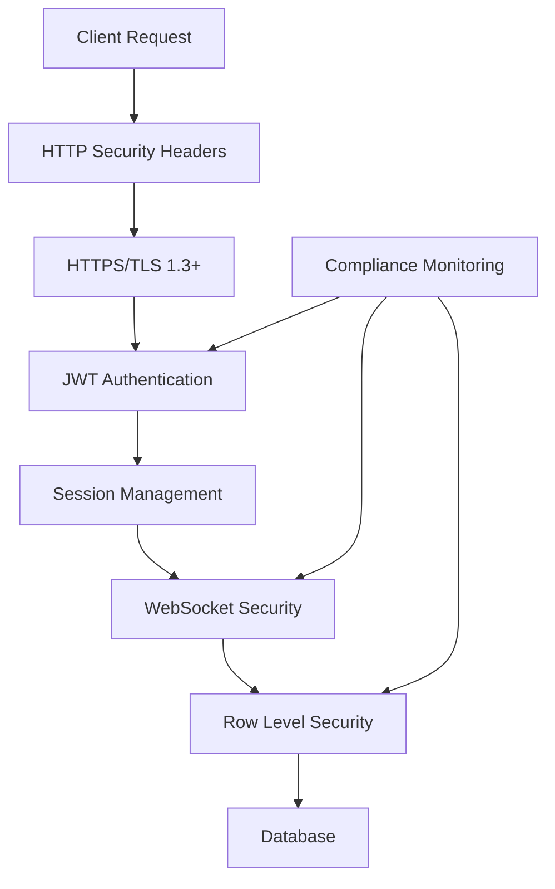
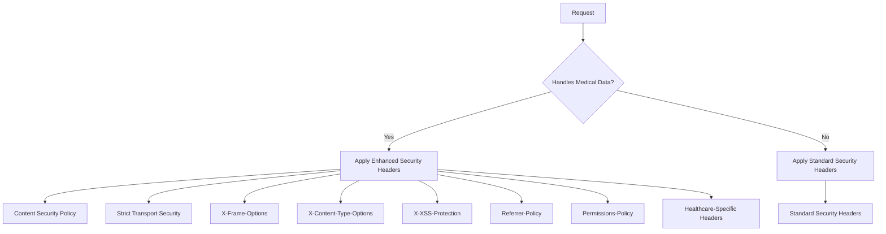
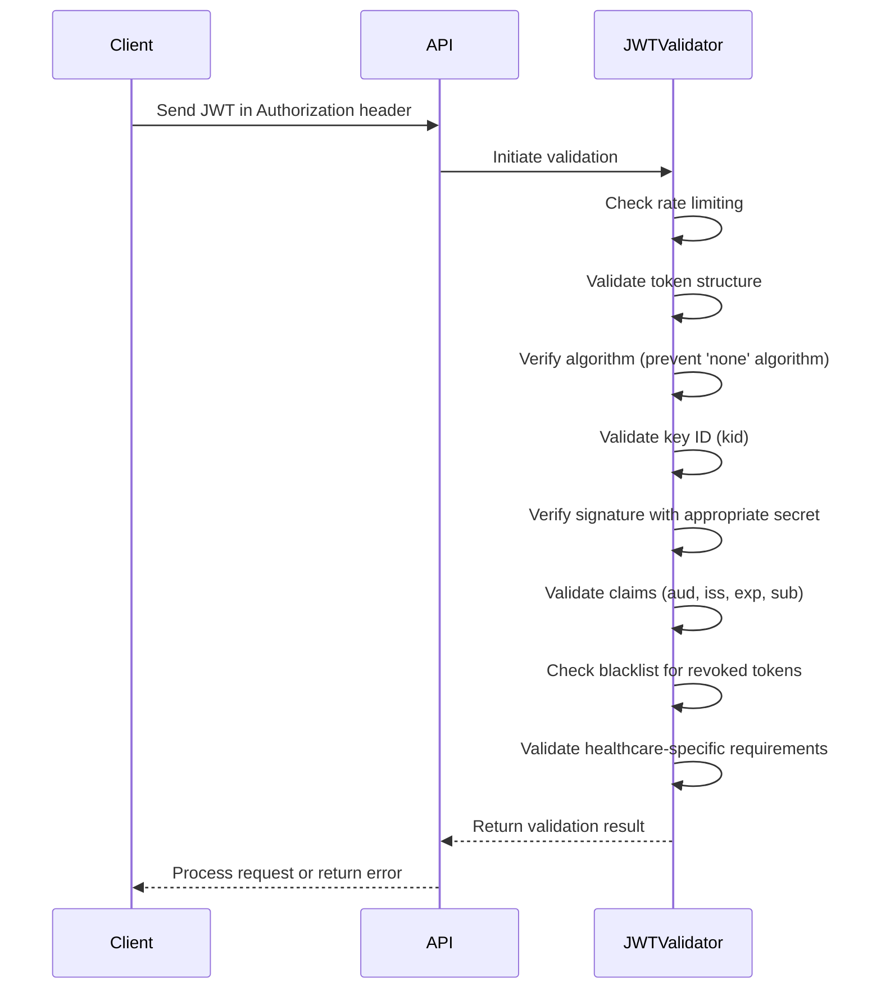
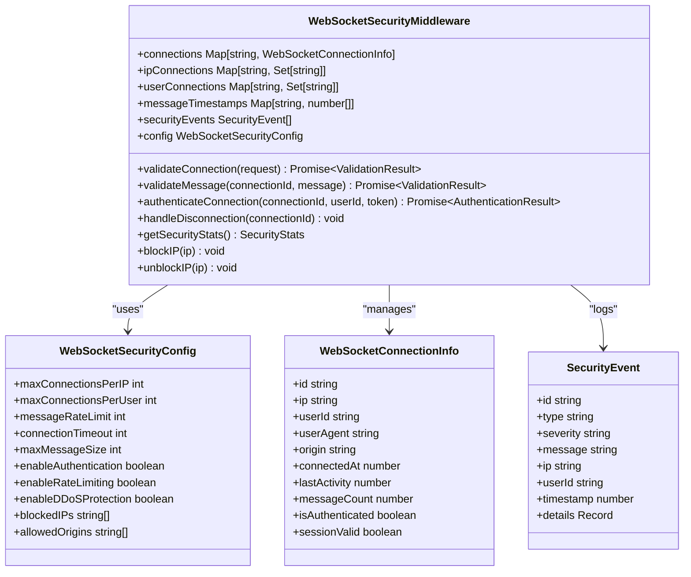
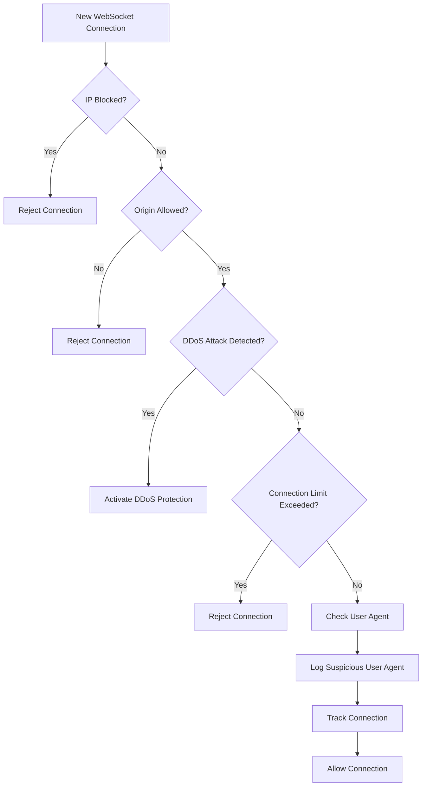
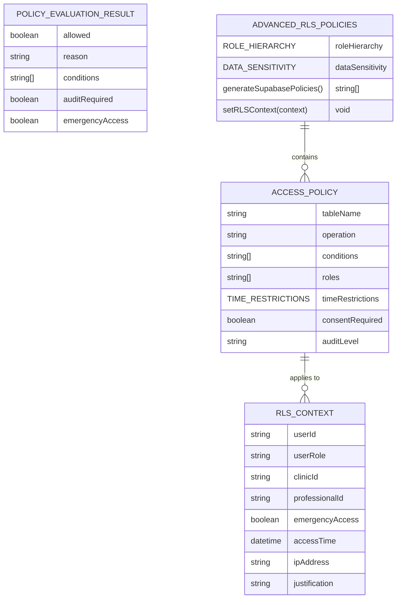
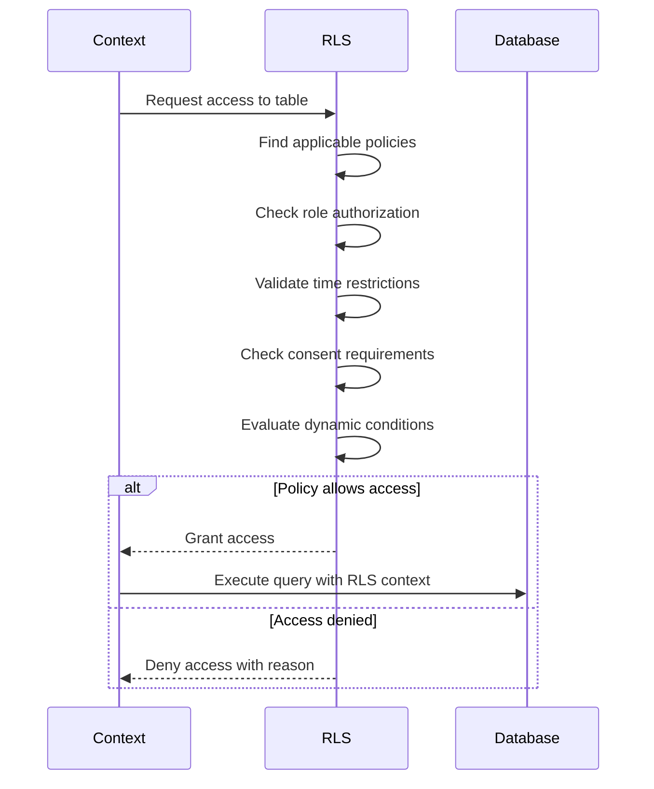
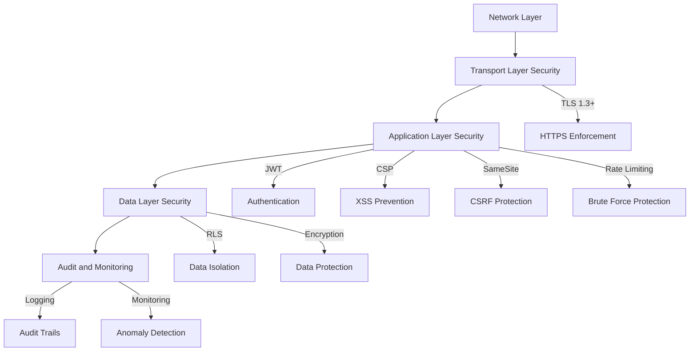
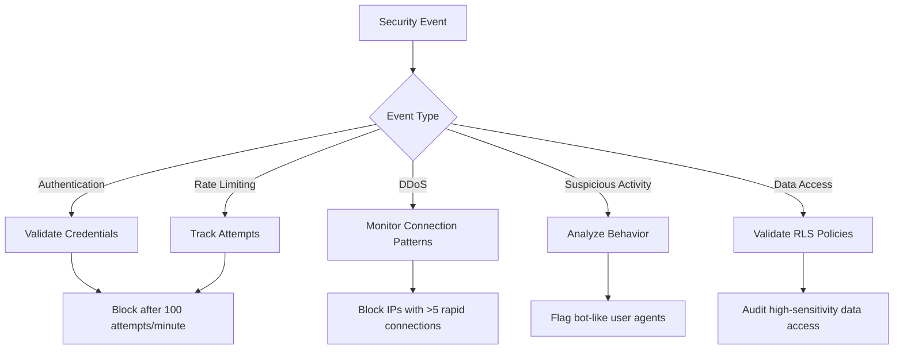
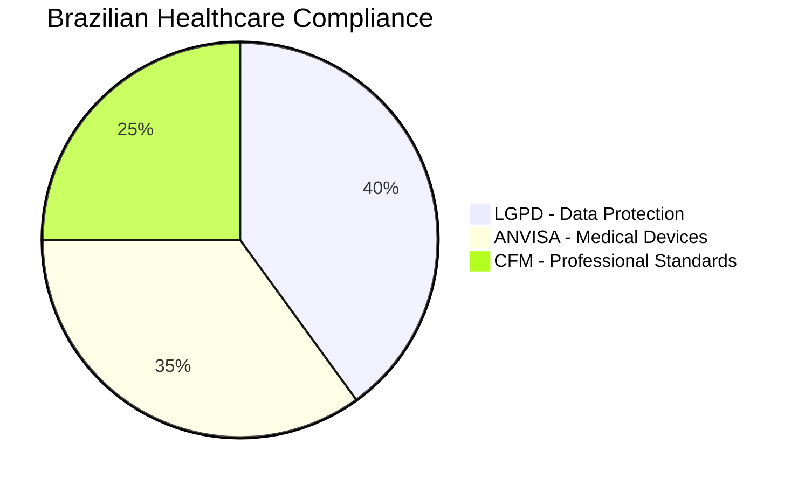

# Security Implementation

<cite>
**Referenced Files in This Document**
- [jwt-validator.ts](file://apps/api/src/security/jwt-validator.ts)
- [rls-policies.ts](file://apps/api/src/security/rls-policies.ts)
- [websocket-security-middleware.ts](file://apps/api/src/middleware/websocket-security-middleware.ts)
- [security-headers-service.ts](file://apps/api/src/services/security-headers-service.ts)
- [session-cookie-utils.ts](file://apps/api/src/security/session-cookie-utils.ts)
- [brazilian-compliance.ts](file://apps/api/src/services/brazilian-compliance.ts)
- [https-config.ts](file://apps/api/src/config/https-config.ts)
</cite>

## Table of Contents

1. [Introduction](#introduction)
2. [Multi-Layered Security Approach](#multi-layered-security-approach)
3. [HTTP Security Headers](#http-security-headers)
4. [JWT Validation](#jwt-validation)
5. [WebSocket Protection](#websocket-protection)
6. [Row Level Security (RLS)](#row-level-security-rls)
7. [Defense-in-Depth Strategy](#defense-in-depth-strategy)
8. [Security Policy Configuration](#security-policy-configuration)
9. [Threat Detection and Compliance](#threat-detection-and-compliance)
10. [Healthcare Security in Brazil](#healthcare-security-in-brazil)
11. [Conclusion](#conclusion)

## Introduction

The neonpro backend implements a comprehensive multi-layered security approach designed specifically for healthcare applications. The system follows defense-in-depth principles with multiple overlapping security controls to protect sensitive medical data and ensure compliance with Brazilian regulations including LGPD, ANVISA, and CFM standards. This documentation details the security implementation across various layers including HTTP security headers, JWT validation, WebSocket protection, and Row Level Security enforcement.

**Section sources**

- [jwt-validator.ts](file://apps/api/src/security/jwt-validator.ts#L1-L712)
- [rls-policies.ts](file://apps/api/src/security/rls-policies.ts#L1-L642)
- [websocket-security-middleware.ts](file://apps/api/src/middleware/websocket-security-middleware.ts#L1-L715)

## Multi-Layered Security Approach

The neonpro backend employs a defense-in-depth strategy with multiple security layers working in concert to protect the application. This approach ensures that even if one security control is bypassed, others remain in place to prevent unauthorized access or data breaches. The security architecture includes HTTP security headers, JWT-based authentication, WebSocket connection protection, and database-level Row Level Security policies.

**Diagram sources **

- [https-config.ts](file://apps/api/src/config/https-config.ts#L1-L57)
- [jwt-validator.ts](file://apps/api/src/security/jwt-validator.ts#L1-L712)
- [websocket-security-middleware.ts](file://apps/api/src/middleware/websocket-security-middleware.ts#L1-L715)
- [rls-policies.ts](file://apps/api/src/security/rls-policies.ts#L1-L642)

## HTTP Security Headers

The system implements comprehensive HTTP security headers to protect against common web vulnerabilities. These headers are applied through the SecurityHeadersService which dynamically configures security policies based on the healthcare context of each request.

### Header Implementation

The security headers middleware applies the following protections:

**Diagram sources **

- [security-headers-service.ts](file://apps/api/src/services/security-headers-service.ts#L187-L821)
- [security-headers.ts](file://apps/api/src/middleware/security-headers.ts#L1-L382)

### Security Header Configuration

The system uses different security configurations based on the sensitivity level of the requested resource:

| Header                 | Public Endpoints                | General Healthcare                   | Medical Data                    |
| ---------------------- | ------------------------------- | ------------------------------------ | ------------------------------- |
| CSP                    | Enabled                         | Enabled with additional restrictions | Strict policy with reporting    |
| HSTS                   | 1 year                          | 1 year with subdomains               | 1 year with preload             |
| X-Frame-Options        | DENY                            | DENY                                 | DENY                            |
| X-Content-Type-Options | nosniff                         | nosniff                              | nosniff                         |
| X-XSS-Protection       | 1; mode=block                   | 1; mode=block                        | 1; mode=block                   |
| Referrer-Policy        | strict-origin-when-cross-origin | strict-origin-when-cross-origin      | strict-origin-when-cross-origin |
| Permissions-Policy     | Restricted                      | Highly restricted                    | Maximum restriction             |
| Healthcare-Security    | Not present                     | Enabled                              | Enabled with sensitivity level  |

**Section sources**

- [security-headers-service.ts](file://apps/api/src/services/security-headers-service.ts#L187-L821)
- [security-headers.ts](file://apps/api/src/middleware/security-headers.ts#L1-L382)

## JWT Validation

The JWT validation system provides robust token verification with multiple security checks to prevent common attacks such as token tampering, replay attacks, and algorithm confusion.

### JWT Validation Process

**Diagram sources **

- [jwt-validator.ts](file://apps/api/src/security/jwt-validator.ts#L1-L712)
- [authn.ts](file://apps/api/src/middleware/authn.ts#L1-L305)

### Security Features

The JWT validator implements several critical security features:

- **Algorithm Confusion Prevention**: Rejects tokens with 'none' algorithm and validates against allowed algorithms (HS256, HS512)
- **Key ID Validation**: Ensures tokens include a valid key ID (kid) that matches available secrets
- **Rate Limiting**: Prevents brute force attacks with configurable rate limits (100 attempts per minute)
- **Token Blacklisting**: Supports token revocation through a memory-based blacklist
- **Healthcare Claim Validation**: Validates user roles specific to healthcare applications
- **HTTPS Enforcement**: Requires HTTPS in production environments

**Section sources**

- [jwt-validator.ts](file://apps/api/src/security/jwt-validator.ts#L1-L712)

## WebSocket Protection

WebSocket connections are protected by a dedicated security middleware that implements rate limiting, authentication, DDoS protection, and message validation.

### WebSocket Security Architecture

**Diagram sources **

- [websocket-security-middleware.ts](file://apps/api/src/middleware/websocket-security-middleware.ts#L1-L715)

### Connection Validation Flow

**Section sources**

- [websocket-security-middleware.ts](file://apps/api/src/middleware/websocket-security-middleware.ts#L1-L715)

## Row Level Security (RLS)

The system implements comprehensive Row Level Security policies to ensure data isolation and compliance with healthcare regulations. RLS policies are enforced at the database level with additional application-level validation.

### RLS Policy Structure

**Diagram sources **

- [rls-policies.ts](file://apps/api/src/security/rls-policies.ts#L1-L642)

### Policy Evaluation Process

**Section sources**

- [rls-policies.ts](file://apps/api/src/security/rls-policies.ts#L1-L642)
- [prisma-rls.ts](file://apps/api/src/trpc/middleware/prisma-rls.ts#L1-L334)

## Defense-in-Depth Strategy

The neonpro backend implements a comprehensive defense-in-depth strategy with multiple overlapping security controls to protect against various attack vectors.

### Security Layers

**Diagram sources **

- [https-config.ts](file://apps/api/src/config/https-config.ts#L1-L57)
- [jwt-validator.ts](file://apps/api/src/security/jwt-validator.ts#L1-L712)
- [session-cookie-utils.ts](file://apps/api/src/security/session-cookie-utils.ts#L1-L406)
- [rls-policies.ts](file://apps/api/src/security/rls-policies.ts#L1-L642)

### Secure Session Management

The system implements secure session management with multiple protective measures:

- **HttpOnly Cookies**: Session cookies are marked HttpOnly to prevent JavaScript access
- **Secure Flag**: All security-related cookies require HTTPS
- **SameSite Strict**: Prevents CSRF attacks by restricting cookie sending
- **Session Signature**: Cryptographic signature ensures session integrity
- **CSRF Token**: Synchronizer token pattern prevents cross-site request forgery
- **Session Expiration**: 8-hour maximum session duration with server-side validation

**Section sources**

- [session-cookie-utils.ts](file://apps/api/src/security/session-cookie-utils.ts#L1-L406)

## Security Policy Configuration

Security policies are highly configurable to meet different compliance requirements and operational needs.

### Configuration Options

The system provides extensive configuration options for security rules:

| Component          | Configurable Parameters                                                                                   | Default Values                                                                 |
| ------------------ | --------------------------------------------------------------------------------------------------------- | ------------------------------------------------------------------------------ |
| JWT Validation     | algorithms, allowedAudiences, allowedIssuers, maxExpirationHours, rateLimitWindowMs, rateLimitMaxAttempts | HS256, HS512; authenticated; Supabase URLs; 24 hours; 60s window; 100 attempts |
| WebSocket Security | maxConnectionsPerIP, maxConnectionsPerUser, messageRateLimit, connectionTimeout, maxMessageSize           | 10 IP connections; 5 user connections; 100 messages/min; 5 minutes; 1MB        |
| HTTP Security      | HSTS maxAge, CSP directives, referrerPolicy, permissionsPolicy                                            | 1 year; self-only; strict-origin-when-cross-origin; restricted                 |
| RLS Policies       | timeRestrictions, consentRequired, auditLevel, role-based access                                          | 6AM-10PM; required for medical data; detailed/comprehensive; role hierarchy    |

**Section sources**

- [jwt-validator.ts](file://apps/api/src/security/jwt-validator.ts#L1-L712)
- [websocket-security-middleware.ts](file://apps/api/src/middleware/websocket-security-middleware.ts#L1-L715)
- [security-headers-service.ts](file://apps/api/src/services/security-headers-service.ts#L187-L821)
- [rls-policies.ts](file://apps/api/src/security/rls-policies.ts#L1-L642)

## Threat Detection and Compliance

The system includes comprehensive threat detection mechanisms and compliance validation for healthcare applications.

### Threat Detection Mechanisms

**Section sources**

- [jwt-validator.ts](file://apps/api/src/security/jwt-validator.ts#L1-L712)
- [websocket-security-middleware.ts](file://apps/api/src/middleware/websocket-security-middleware.ts#L1-L715)
- [rls-policies.ts](file://apps/api/src/security/rls-policies.ts#L1-L642)

### Compliance Requirements

The system enforces compliance with healthcare regulations through automated validation and reporting:

- **LGPD Compliance**: Data subject rights, consent management, data minimization
- **ANVISA Compliance**: Medical device regulations, software classification
- **CFM Compliance**: Professional standards, ethics committee requirements
- **Interoperability**: HL7/FHIR, TISS standards, SUS integration

## Healthcare Security in Brazil

The neonpro backend is specifically designed to meet the stringent security requirements for healthcare applications in Brazil.

### Brazilian Compliance Framework

**Diagram sources **

- [brazilian-compliance.ts](file://apps/api/src/services/brazilian-compliance.ts#L1-L547)

### Common Vulnerabilities and Mitigations

The system addresses common vulnerabilities in healthcare applications:

| Vulnerability              | Risk Level | Mitigation Strategy                                       |
| -------------------------- | ---------- | --------------------------------------------------------- |
| Unauthorized Data Access   | Critical   | RLS policies with role-based access control               |
| Data Breaches              | High       | Encryption at rest and in transit, strict access controls |
| Account Takeover           | High       | JWT validation, rate limiting, session management         |
| XSS Attacks                | Medium     | Content Security Policy, input validation                 |
| CSRF Attacks               | Medium     | SameSite cookies, CSRF tokens, anti-forgery patterns      |
| DDoS Attacks               | Medium     | Rate limiting, connection monitoring, IP blocking         |
| Insufficient Audit Logging | Medium     | Comprehensive audit trails for sensitive operations       |
| Insecure APIs              | Medium     | JWT authentication, input validation, rate limiting       |

**Section sources**

- [brazilian-compliance.ts](file://apps/api/src/services/brazilian-compliance.ts#L1-L547)
- [security-headers-service.ts](file://apps/api/src/services/security-headers-service.ts#L187-L821)

## Conclusion

The neonpro backend implements a comprehensive, multi-layered security approach specifically designed for healthcare applications in Brazil. By combining HTTP security headers, robust JWT validation, WebSocket protection, and granular Row Level Security policies, the system provides defense-in-depth protection for sensitive medical data. The security implementation adheres to Brazilian regulations including LGPD, ANVISA, and CFM standards, while providing configurable security policies and comprehensive threat detection capabilities. This holistic approach ensures both regulatory compliance and robust protection against evolving security threats in the healthcare domain.
