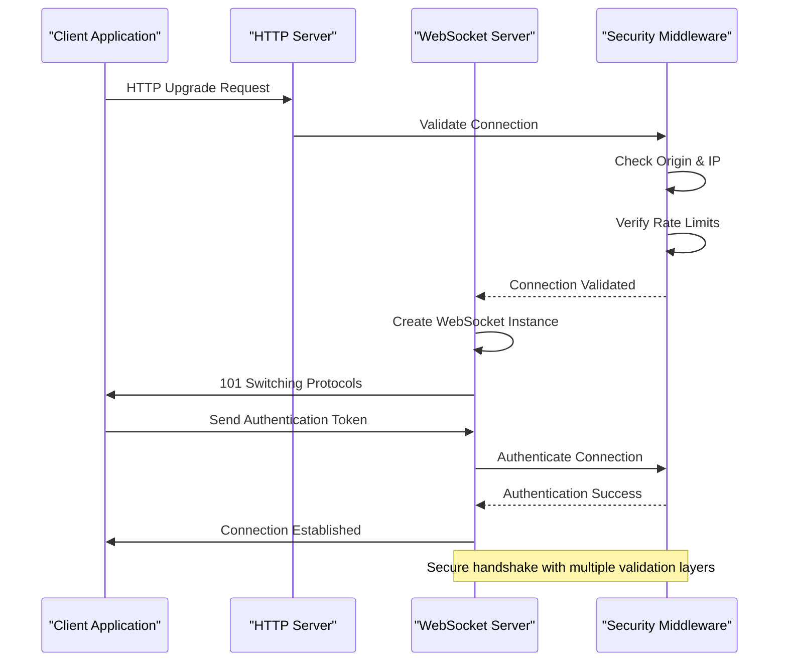
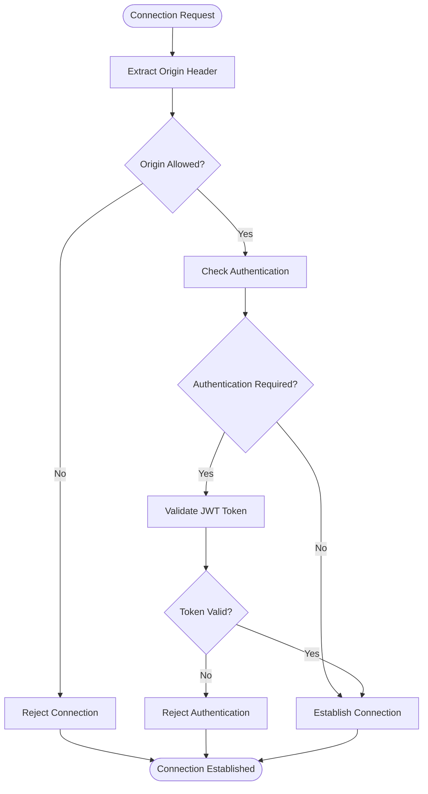
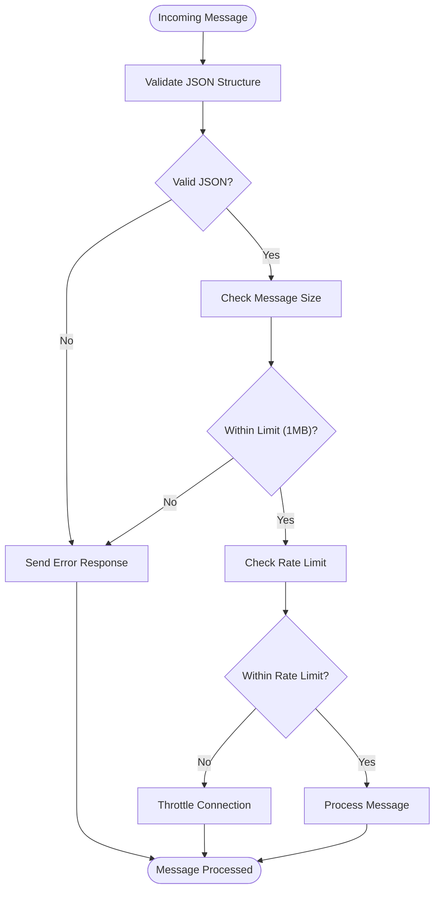
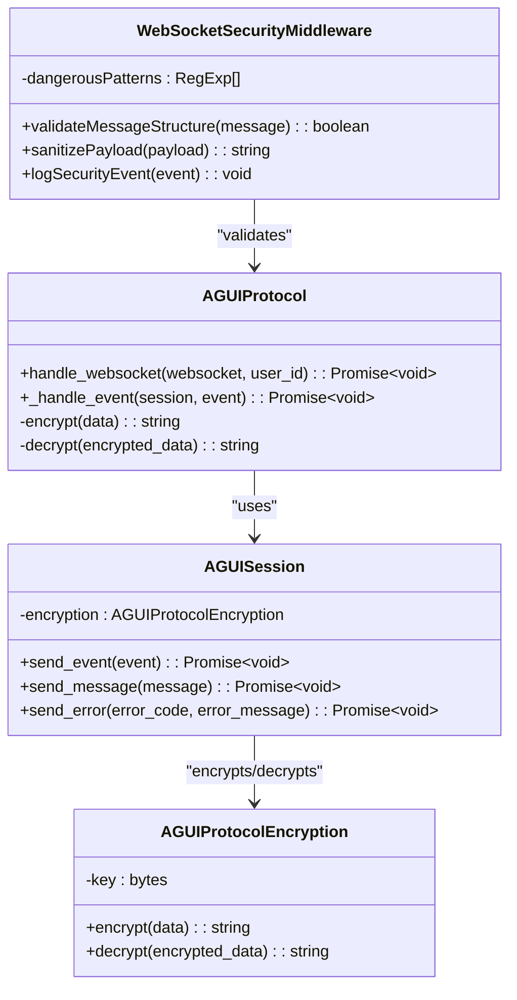
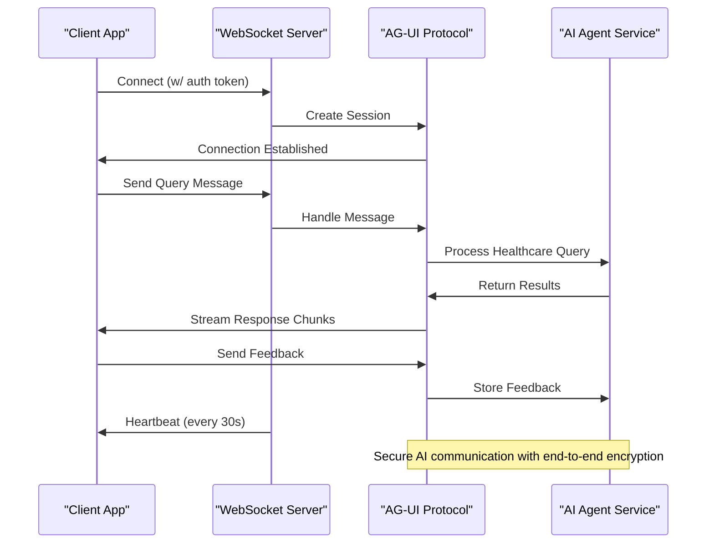
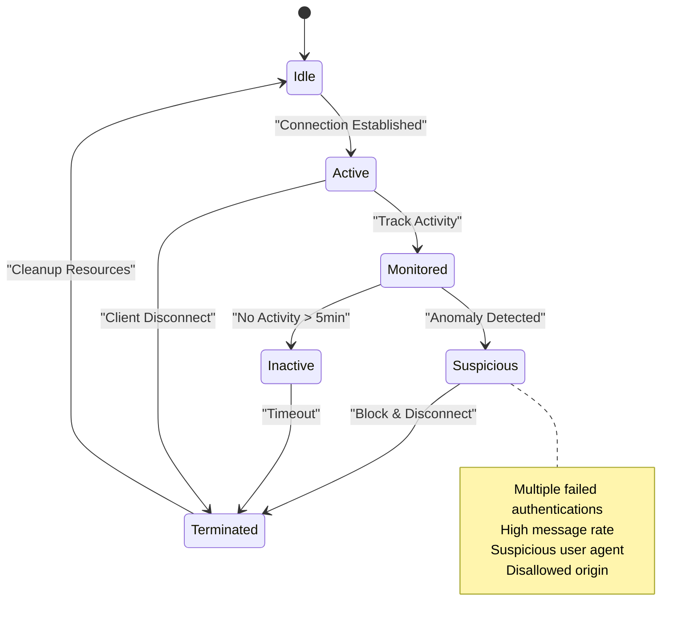
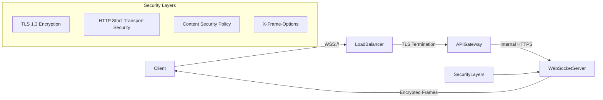
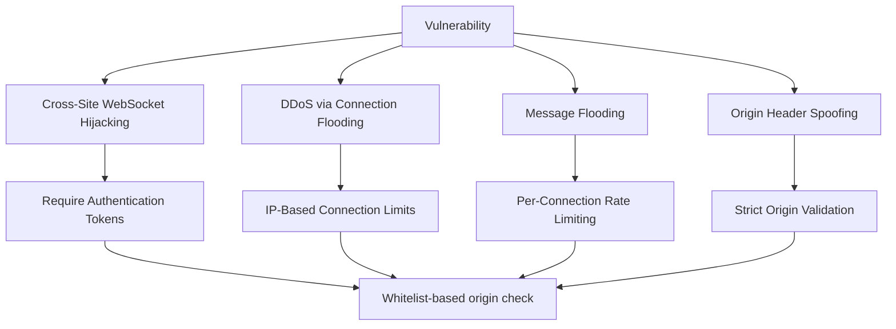
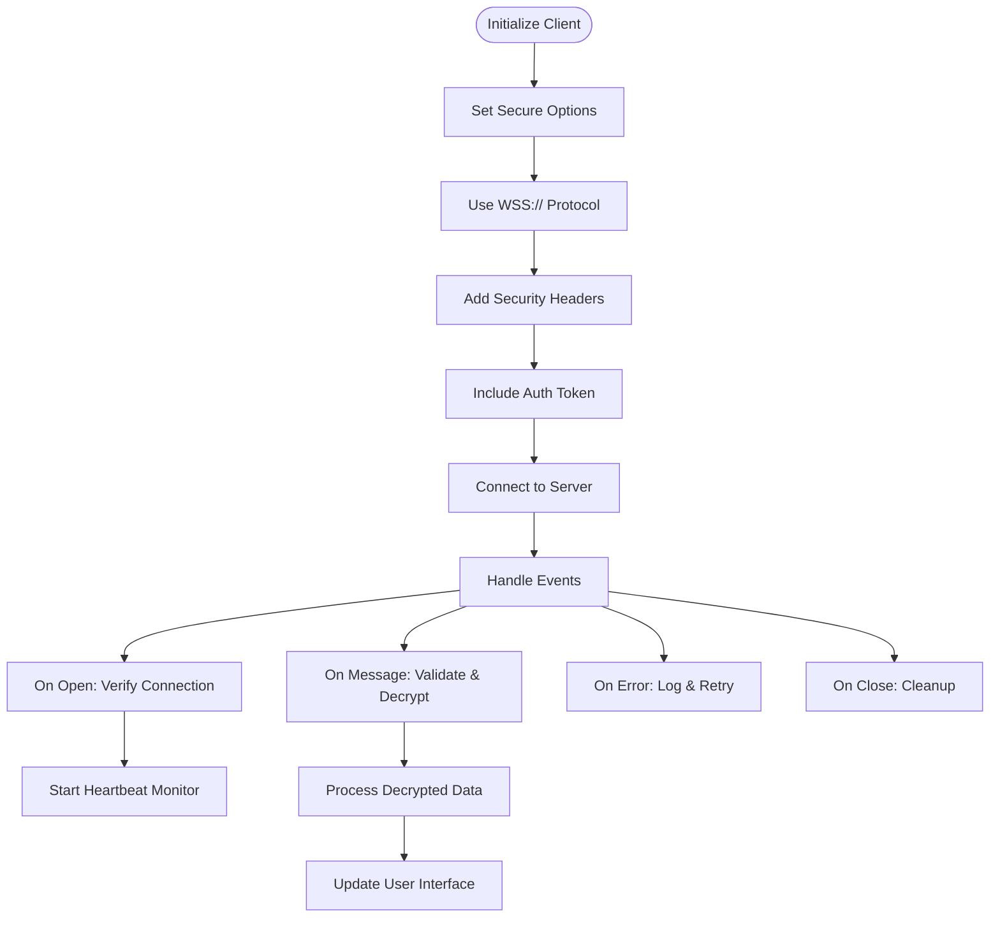
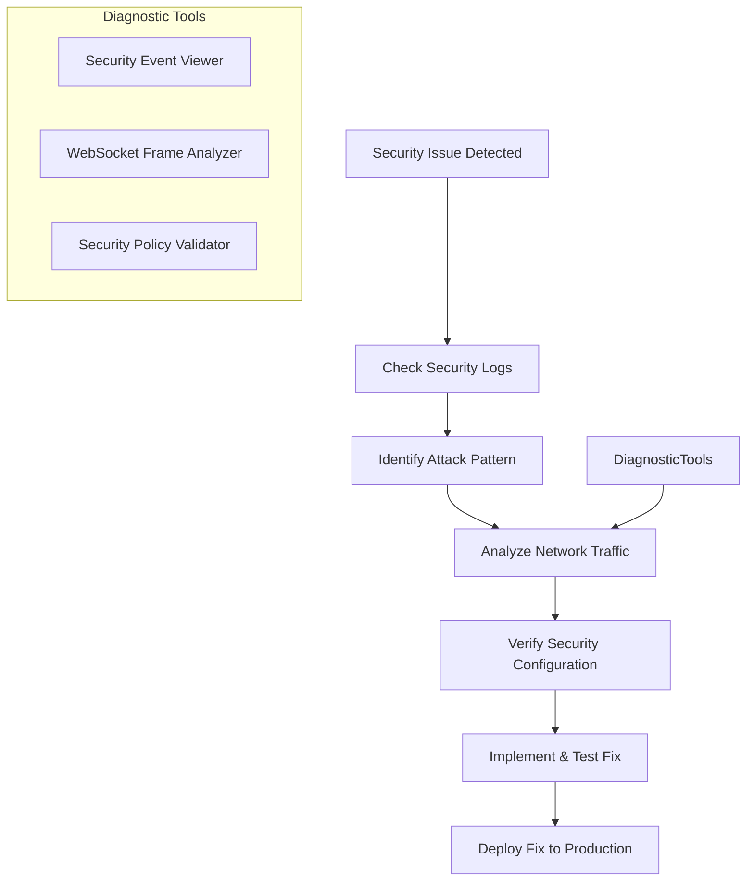

# WebSocket Security

<cite>
**Referenced Files in This Document **
- [websocket_manager.py](file://apps/ai-agent/services/websocket_manager.py)
- [websocket-security-middleware.ts](file://apps/api/src/middleware/websocket-security-middleware.ts)
- [websocket-server.ts](file://apps/api/src/middleware/websocket-server.ts)
- [agui_protocol.py](file://apps/api/agents/ag-ui-rag-agent/agui_protocol.py)
- [security-headers.ts](file://apps/api/src/middleware/security-headers.ts)
- [auth.ts](file://apps/api/src/middleware/auth.ts)
- [rate-limit.ts](file://apps/api/src/middleware/rate-limit.ts)
</cite>

## Table of Contents

1. [Introduction](#introduction)
2. [WebSocket Connection Handshake Process](#websocket-connection-handshake-process)
3. [Origin Validation and Authentication](#origin-validation-and-authentication)
4. [Message Validation and Rate Limiting](#message-validation-and-rate-limiting)
5. [Payload Sanitization and Injection Prevention](#payload-santization-and-injection-prevention)
6. [AI Agent Communication Integration](#ai-agent-communication-integration)
7. [Connection Monitoring and Anomaly Detection](#connection-monitoring-and-anomaly-detection)
8. [Encryption in Transit and Frame Validation](#encryption-in-transit-and-frame-validation)
9. [WebSocket-Specific Vulnerability Protection](#websocket-specific-vulnerability-protection)
10. [Secure Client Implementation Examples](#secure-client-implementation-examples)
11. [Debugging WebSocket Security Issues](#debugging-websocket-security-issues)

## Introduction

The NeonPro backend implements a comprehensive WebSocket security framework to protect real-time communication between clients and AI agents. This documentation details the security architecture, covering connection establishment, authentication, message validation, rate limiting, and protection against common WebSocket vulnerabilities. The system integrates with healthcare compliance requirements while maintaining high performance for AI agent interactions.

## WebSocket Connection Handshake Process

The WebSocket handshake process in NeonPro follows a multi-layered security approach that validates connections before establishing communication channels. The process begins with the client initiating a connection request that is intercepted by the WebSocket server middleware.

**Diagram sources**

- [websocket-server.ts](file://apps/api/src/middleware/websocket-server.ts#L100-L150)
- [websocket-security-middleware.ts](file://apps/api/src/middleware/websocket-security-middleware.ts#L81-L177)

**Section sources**

- [websocket-server.ts](file://apps/api/src/middleware/websocket-server.ts#L81-L177)
- [websocket-security-middleware.ts](file://apps/api/src/middleware/websocket-security-middleware.ts#L81-L177)

## Origin Validation and Authentication

NeonPro enforces strict origin validation and authentication requirements to prevent unauthorized access to WebSocket endpoints. The security middleware validates the `Origin` header against a whitelist of allowed domains before proceeding with the connection.

The authentication process requires a valid JWT token passed during the initial connection phase. The system verifies the token signature and expiration before establishing the authenticated session.

**Diagram sources**

- [websocket-security-middleware.ts](file://apps/api/src/middleware/websocket-security-middleware.ts#L81-L177)
- [auth.ts](file://apps/api/src/middleware/auth.ts#L50-L100)

**Section sources**

- [websocket-security-middleware.ts](file://apps/api/src/middleware/websocket-security-middleware.ts#L81-L177)
- [auth.ts](file://apps/api/src/middleware/auth.ts#L50-L100)

## Message Validation and Rate Limiting

NeonPro implements robust message validation and rate limiting mechanisms to prevent abuse and ensure system stability. Each incoming message is validated for structure, size, and content before processing.

The rate limiting system tracks messages per connection and applies limits at both IP and user levels to prevent DDoS attacks and excessive resource consumption.

**Diagram sources**

- [websocket-security-middleware.ts](file://apps/api/src/middleware/websocket-security-middleware.ts#L178-L250)
- [rate-limit.ts](file://apps/api/src/middleware/rate-limit.ts#L20-L100)

**Section sources**

- [websocket-security-middleware.ts](file://apps/api/src/middleware/websocket-security-middleware.ts#L178-L250)
- [rate-limit.ts](file://apps/api/src/middleware/rate-limit.ts#L20-L100)

## Payload Sanitization and Injection Prevention

To prevent injection attacks, NeonPro implements comprehensive payload sanitization across all WebSocket communications. The system analyzes message content for potentially dangerous patterns and blocks suspicious payloads.

The sanitization process includes checking for script tags, JavaScript URIs, and other XSS attack vectors in message content. All sensitive data is encrypted end-to-end using AES-256-CFB encryption.

**Diagram sources**

- [websocket-security-middleware.ts](file://apps/api/src/middleware/websocket-security-middleware.ts#L350-L380)
- [agui_protocol.py](file://apps/api/agents/ag-ui-rag-agent/agui_protocol.py#L100-L150)

**Section sources**

- [websocket-security-middleware.ts](file://apps/api/src/middleware/websocket-security-middleware.ts#L350-L380)
- [agui_protocol.py](file://apps/api/agents/ag-ui-rag-agent/agui_protocol.py#L100-L150)

## AI Agent Communication Integration

The WebSocket security implementation is tightly integrated with the AI agent communication protocols, ensuring secure real-time data streaming between clients and AI services. The AG-UI protocol provides a structured framework for AI interactions.

The integration supports streaming responses from AI agents, allowing for real-time display of generated content while maintaining security controls.

**Diagram sources**

- [agui_protocol.py](file://apps/api/agents/ag-ui-rag-agent/agui_protocol.py#L259-L310)
- [websocket_manager.py](file://apps/ai-agent/services/websocket_manager.py#L24-L54)

**Section sources**

- [agui_protocol.py](file://apps/api/agents/ag-ui-rag-agent/agui_protocol.py#L259-L310)
- [websocket_manager.py](file://apps/ai-agent/services/websocket_manager.py#L24-L54)

## Connection Monitoring and Anomaly Detection

NeonPro continuously monitors WebSocket connections for suspicious activity and automatically terminates sessions exhibiting anomalous behavior. The system tracks connection metrics and enforces timeout policies.

The monitoring system detects DDoS attack patterns by analyzing connection rates from individual IPs and blocks abusive clients automatically.

**Diagram sources**

- [websocket-security-middleware.ts](file://apps/api/src/middleware/websocket-security-middleware.ts#L450-L500)
- [websocket_manager.py](file://apps/ai-agent/services/websocket_manager.py#L200-L230)

**Section sources**

- [websocket-security-middleware.ts](file://apps/api/src/middleware/websocket-security-middleware.ts#L450-L500)
- [websocket_manager.py](file://apps/ai-agent/services/websocket_manager.py#L200-L230)

## Encryption in Transit and Frame Validation

All WebSocket communications in NeonPro are protected with encryption in transit using TLS 1.3. The system validates WebSocket frames and enforces secure connection policies.

The implementation uses the WSS (WebSocket Secure) protocol exclusively, redirecting all WS connections to encrypted channels. Frame validation ensures that only properly formatted WebSocket frames are processed.

**Diagram sources**

- [security-headers.ts](file://apps/api/src/middleware/security-headers.ts#L200-L250)
- [websocket-server.ts](file://apps/api/src/middleware/websocket-server.ts#L50-L80)

**Section sources**

- [security-headers.ts](file://apps/api/src/middleware/security-headers.ts#L200-L250)
- [websocket-server.ts](file://apps/api/src/middleware/websocket-server.ts#L50-L80)

## WebSocket-Specific Vulnerability Protection

NeonPro addresses WebSocket-specific vulnerabilities through multiple protective measures, including cross-site WebSocket hijacking prevention and connection exhaustion protection.

The system prevents cross-site WebSocket hijacking by requiring authentication tokens even for connection establishment, making it impossible for third-party sites to establish valid sessions.

**Diagram sources**

- [websocket-security-middleware.ts](file://apps/api/src/middleware/websocket-security-middleware.ts#L100-L150)
- [security-headers.ts](file://apps/api/src/middleware/security-headers.ts#L100-L150)

**Section sources**

- [websocket-security-middleware.ts](file://apps/api/src/middleware/websocket-security-middleware.ts#L100-L150)
- [security-headers.ts](file://apps/api/src/middleware/security-headers.ts#L100-L150)

## Secure Client Implementation Examples

The following example demonstrates a secure WebSocket client implementation for connecting to the NeonPro backend:

Key security practices include always using the WSS protocol, validating server certificates, implementing proper error handling, and maintaining heartbeat monitoring to detect connection issues.

**Diagram sources**

- [agui_protocol.py](file://apps/api/agents/ag-ui-rag-agent/agui_protocol.py#L371-L381)
- [websocket_manager.py](file://apps/ai-agent/services/websocket_manager.py#L67-L73)

**Section sources**

- [agui_protocol.py](file://apps/api/agents/ag-ui-rag-agent/agui_protocol.py#L371-L381)
- [websocket_manager.py](file://apps/ai-agent/services/websocket_manager.py#L67-L73)

## Debugging WebSocket Security Issues

When debugging WebSocket security issues, developers should monitor connection logs, security events, and client behavior. The system provides detailed logging for troubleshooting.

Common issues include misconfigured origin headers, expired authentication tokens, and rate limiting triggers. The security middleware provides detailed error messages to aid in diagnosis.

**Diagram sources**

- [websocket-security-middleware.ts](file://apps/api/src/middleware/websocket-security-middleware.ts#L550-L600)
- [websocket_manager.py](file://apps/ai-agent/services/websocket_manager.py#L150-L180)

**Section sources**

- [websocket-security-middleware.ts](file://apps/api/src/middleware/websocket-security-middleware.ts#L550-L600)
- [websocket_manager.py](file://apps/ai-agent/services/websocket_manager.py#L150-L180)
