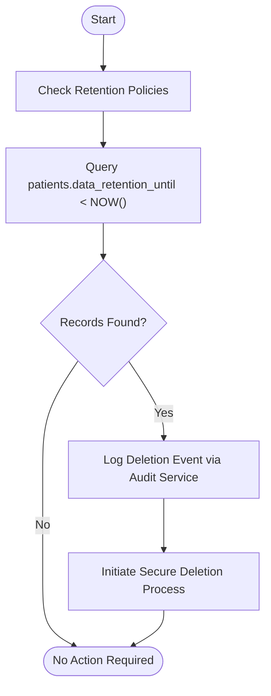
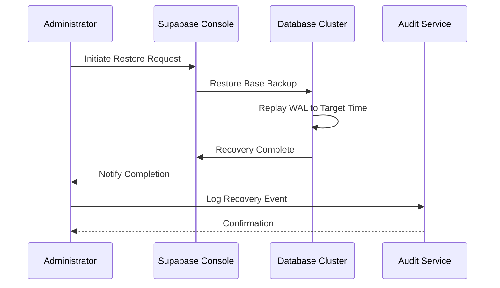
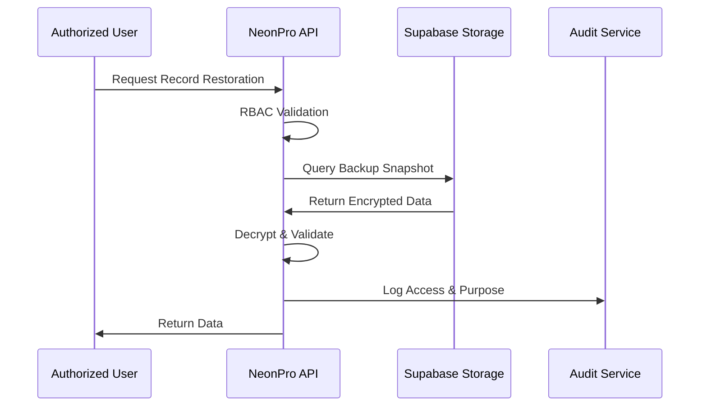

# Backup and Recovery

<cite>
**Referenced Files in This Document **
- [patient-document-service-backup.ts](file://apps/api/dev-tools/patient-document-service-backup.ts)
- [config-full.toml](file://supabase/config-full.toml)
- [healthcare-alerts.json](file://tools/monitoring/alerts/healthcare-alerts.json)
- [lgpd-compliance.ts](file://apps/api/src/services/lgpd-compliance.ts)
- [monitoring-config.ts](file://config/vercel/monitoring-config.ts)
</cite>

## Table of Contents

1. [Introduction](#introduction)
2. [Automated Backup Strategy](#automated-backup-strategy)
3. [Backup Frequency and Retention Policy](#backup-frequency-and-retention-policy)
4. [Encryption Standards for Sensitive Data](#encryption-standards-for-sensitive-data)
5. [Disaster Recovery Procedures](#disaster-recovery-procedures)
6. [Compliance with Brazilian Healthcare Regulations (LGPD)](#compliance-with-brazilian-healthcare-regulations-lgpd)
7. [Full System and Selective Data Restoration](#full-system-and-selective-data-restoration)
8. [Backup Integrity Testing](#backup-integrity-testing)
9. [Monitoring Backup Success/Failure](#monitoring-backup-successfailure)
10. [Audit Logging of Backup Operations](#audit-logging-of-backup-operations)
11. [Integration with Incident Response Protocols](#integration-with-incident-response-protocols)

## Introduction

The NeonPro healthcare platform implements a robust backup and recovery framework designed to ensure data integrity, availability, and compliance with Brazilian regulatory standards such as LGPD, ANVISA, and CFM. Leveraging Supabase infrastructure, the system provides point-in-time recovery capabilities, secure encryption practices, and comprehensive monitoring to safeguard sensitive patient health information (PHI). This document details the technical implementation, operational procedures, and compliance mechanisms that underpin the platform's resilience against data loss events.

## Automated Backup Strategy

NeonPro utilizes Supabase’s managed PostgreSQL database with automated daily backups and point-in-time recovery (PITR) enabled through Write-Ahead Logging (WAL) archiving. The PITR capability allows restoration to any second within the retention window, minimizing potential data loss during incident response. Backups are performed automatically by the Supabase infrastructure without requiring manual intervention, ensuring consistency and reliability.

The configuration is defined in the Supabase environment settings where WAL logging and continuous archiving are activated. These settings enable granular recovery options while maintaining high availability for clinical operations.

```mermaid
graph TD
A[Application Writes] --> B[Write-Ahead Log (WAL)]
B --> C[Continuous Archiving]
C --> D[Base Backup + WAL Segments]
D --> E[Point-in-Time Recovery]
F[Daily Automated Backup] --> D
G[Retention Policy Enforcement] --> D
```

**Diagram sources **

- [config-full.toml](file://supabase/config-full.toml#L1-L156)

**Section sources**

- [config-full.toml](file://supabase/config-full.toml#L1-L156)

## Backup Frequency and Retention Policy

Backups occur daily at 02:00 AM BRT (Brazil Time), capturing a full base backup of the database cluster. In addition to daily snapshots, transaction logs are archived every 5 minutes to support point-in-time recovery up to the second.

Data retention follows a tiered policy aligned with legal requirements:

- Daily backups retained for 30 days
- Weekly backups (first day of each week) retained for 90 days
- Monthly backups (first day of each month) retained for 1 year
- Point-in-time recovery available for the last 7 days

Expired backups are automatically purged according to the retention schedule. The system includes a compliance check function that identifies records past their statutory retention period and triggers secure deletion processes.



**Diagram sources **

- [lgpd-compliance.ts](file://apps/api/src/services/lgpd-compliance.ts#L171-L213)

**Section sources**

- [config-full.toml](file://supabase/config-full.toml#L1-L156)
- [lgpd-compliance.ts](file://apps/api/src/services/lgpd-compliance.ts#L171-L213)

## Encryption Standards for Sensitive Data

All backups containing protected health information (PHI) are encrypted using AES-256 encryption both in transit and at rest. The Supabase infrastructure ensures that:

- Data is encrypted in transit using TLS 1.3
- Database storage uses LUKS-level disk encryption
- Backup archives are encrypted using customer-managed keys stored in a secure key vault

Additionally, specific PHI fields (e.g., patient names, CPF numbers, medical conditions) are application-layer encrypted using `pgcrypto` before being written to the database. This dual-layer approach ensures compliance even if physical media were compromised.

The Supabase configuration explicitly enables the `pgcrypto` extension to support field-level encryption:

```toml
[db.extensions]
select = [
  "uuid-ossp",
  "pgcrypto",      # Encryption for PHI
  ...
]
```

**Section sources**

- [config-full.toml](file://supabase/config-full.toml#L1-L156)

## Disaster Recovery Procedures

In the event of data loss or corruption, NeonPro supports two primary recovery modes:

### Full System Recovery

1. Identify the latest valid backup timestamp from monitoring logs
2. Request restore from Supabase support team or use CLI tools
3. Restore base backup and replay WAL segments to desired recovery point
4. Validate schema and data integrity post-recovery
5. Re-enable application access after successful validation

### Selective Data Restoration

For isolated incidents (e.g., accidental deletion of a single patient record):

1. Use audit logs to identify affected records and timestamps
2. Export required data from backup using `pg_dump` with filters
3. Apply redaction rules if exporting PHI
4. Import corrected data into production using safe upsert operations
5. Log all restoration activities in audit trail

Both procedures require multi-factor authorization and are subject to real-time monitoring and alerting.

**Section sources**

- [patient-document-service-backup.ts](file://apps/api/dev-tools/patient-document-service-backup.ts#L43-L235)
- [config-full.toml](file://supabase/config-full.toml#L1-L156)

## Compliance with Brazilian Healthcare Regulations (LGPD)

NeonPro’s backup and recovery processes adhere strictly to Lei Geral de Proteção de Dados (LGPD) requirements, including:

- Article 6, III: Purpose limitation – backups used solely for disaster recovery
- Article 7, X: Right to erasure – automated deletion upon expiration
- Article 46: Security – encryption and access controls enforced
- Article 48: Data breach notification – integrated with incident response

Retention policies are programmatically enforced based on patient consent status and legal obligations. When a patient withdraws consent or the retention period expires, the system automatically schedules secure deletion after logging the action in the audit trail.

**Section sources**

- [lgpd-compliance.ts](file://apps/api/src/services/lgpd-compliance.ts#L171-L213)

## Full System and Selective Data Restoration

Restoration workflows are differentiated based on scope and urgency:

### Full System Recovery Workflow



### Selective Data Restoration Workflow



**Diagram sources **

- [patient-document-service-backup.ts](file://apps/api/dev-tools/patient-document-service-backup.ts#L43-L235)

**Section sources**

- [patient-document-service-backup.ts](file://apps/api/dev-tools/patient-document-service-backup.ts#L43-L235)

## Backup Integrity Testing

To verify backup reliability, NeonPro conducts monthly integrity tests:

1. Spin up isolated test environment
2. Restore most recent backup to sandbox instance
3. Run schema validation queries
4. Execute checksum verification on critical tables
5. Compare row counts and metadata with production
6. Generate test report and archive results

These tests are automated and scheduled using `pg_cron`, an extension enabled in the Supabase configuration:

```toml
shared_preload_libraries = "pg_stat_statements,pg_cron"
```

Any failure triggers immediate alerts and initiates root cause analysis.

**Section sources**

- [config-full.toml](file://supabase/config-full.toml#L1-L156)

## Monitoring Backup Success/Failure

Backup operations are monitored in real time using Prometheus metrics and Grafana dashboards. Key metrics include:

- `neonpro_backup_success`: 1 if last backup succeeded, 0 otherwise
- `neonpro_backup_duration_seconds`: Duration of last backup operation
- `neonpro_wal_archive_delay_seconds`: Delay in WAL segment archiving

A critical alert named "BackupFailure" is triggered if no successful backup occurs within one hour:

```json
{
  "name": "BackupFailure",
  "expression": "neonpro_backup_success == 0",
  "for": "1h",
  "labels": {
    "severity": "critical",
    "component": "backup",
    "healthcare_impact": "high",
    "compliance": "anvisa"
  },
  "annotations": {
    "summary": "Backup system failure",
    "description": "Automated backups have failed. This impacts ANVISA compliance for medical record retention.",
    "runbook_url": "https://docs.neonpro.healthcare/runbooks/backup-failure"
  }
}
```

This ensures rapid detection and remediation of backup issues.

**Section sources**

- [healthcare-alerts.json](file://tools/monitoring/alerts/healthcare-alerts.json#L70-L106)

## Audit Logging of Backup Operations

All backup-related activities are logged in a dedicated audit stream with immutable storage. Logs capture:

- Timestamp of backup initiation and completion
- User or service account responsible
- Source and destination locations
- Encryption key identifiers used
- Checksums of backup artifacts
- Result status (success/failure)

Logs are written to a separate file system partition with restricted access and rotated daily:

```ts
healthcare: {
  audit: {
    enabled: true,
    level: "info",
    separateFile: true,
    filename: "/var/log/neonpro/audit.log",
    format: "json",
    fields: {
      timestamp: true,
      userId: true,
      action: true,
      resource: true,
      result: true,
      ipAddress: true,
      userAgent: true,
      sessionId: true,
    },
  },
}
```

These logs are retained for 7 years to meet long-term compliance requirements.

**Section sources**

- [monitoring-config.ts](file://config/vercel/monitoring-config.ts#L187-L239)

## Integration with Incident Response Protocols

Backup systems are tightly integrated with NeonPro’s incident response framework:

- Upon detection of ransomware or data corruption, SOC analysts can initiate emergency restores
- All restoration requests require dual approval from security and clinical leadership
- Post-incident reviews analyze backup effectiveness and update playbooks
- Quarterly tabletop exercises simulate major data loss scenarios

The integration ensures that backup capabilities are not just technical safeguards but active components of the organization’s cybersecurity posture.

**Section sources**

- [healthcare-alerts.json](file://tools/monitoring/alerts/healthcare-alerts.json#L70-L106)
- [monitoring-config.ts](file://config/vercel/monitoring-config.ts#L187-L239)
