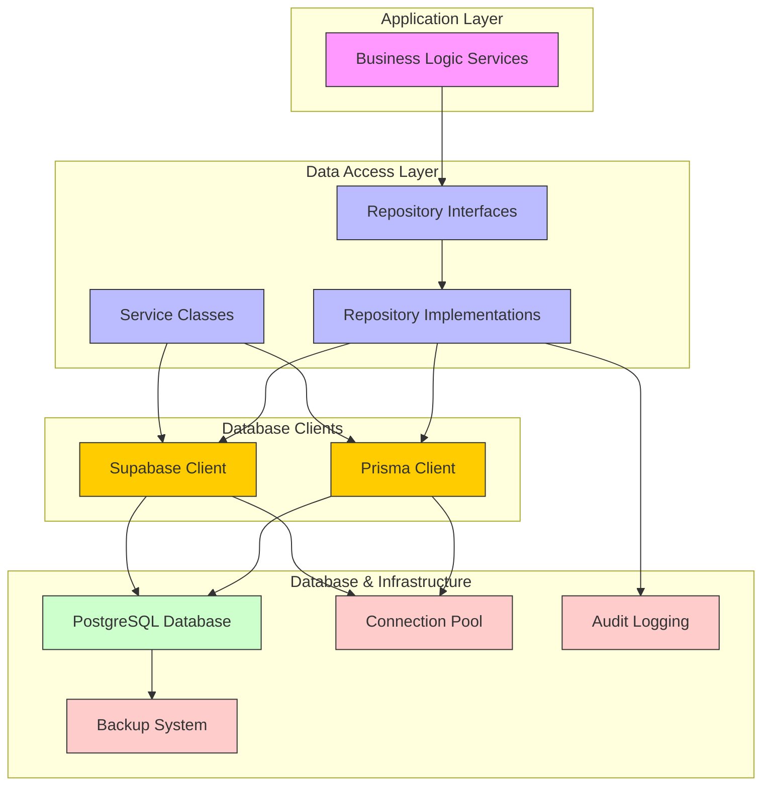
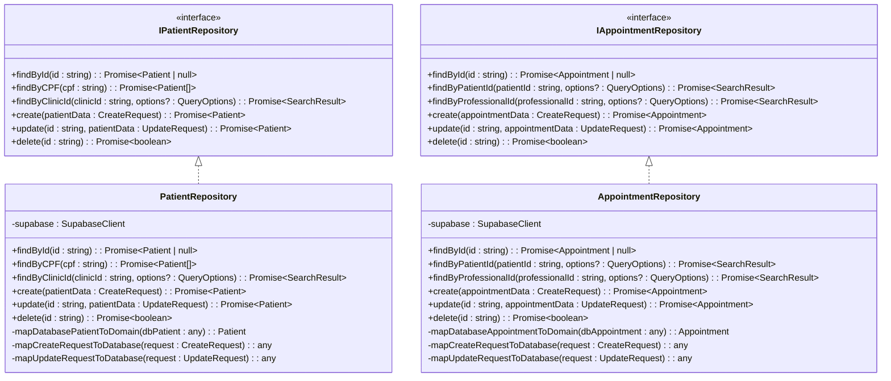
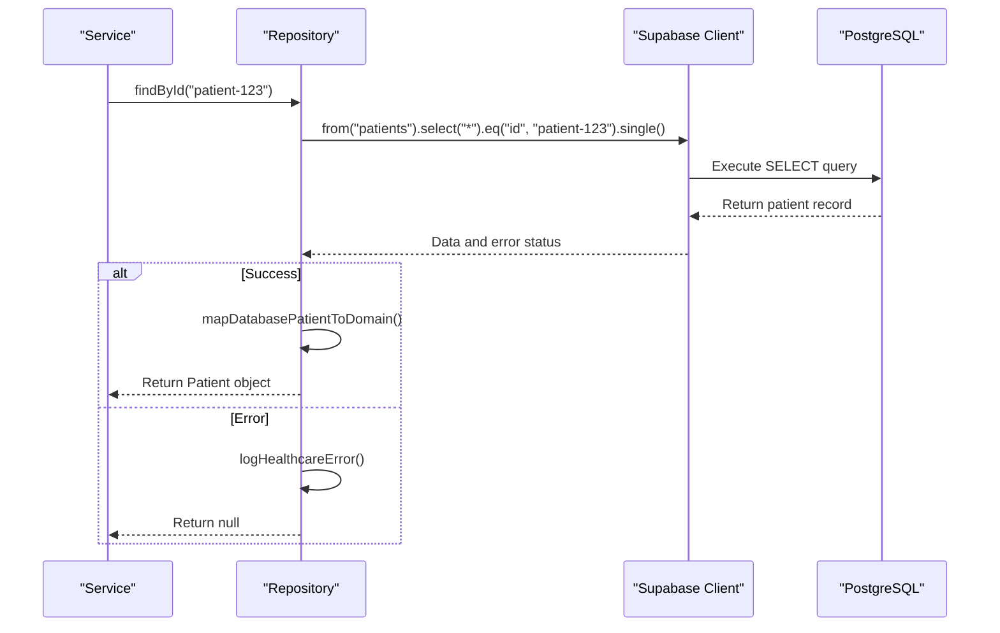
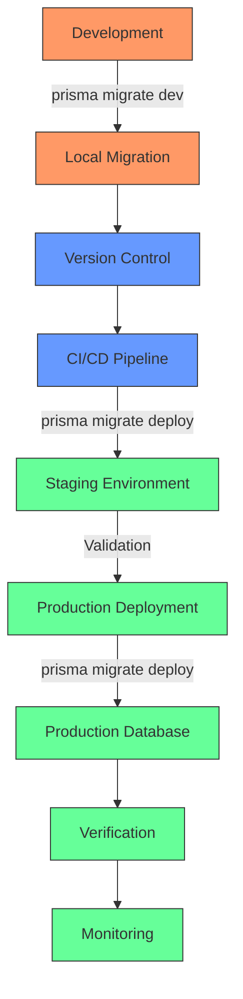
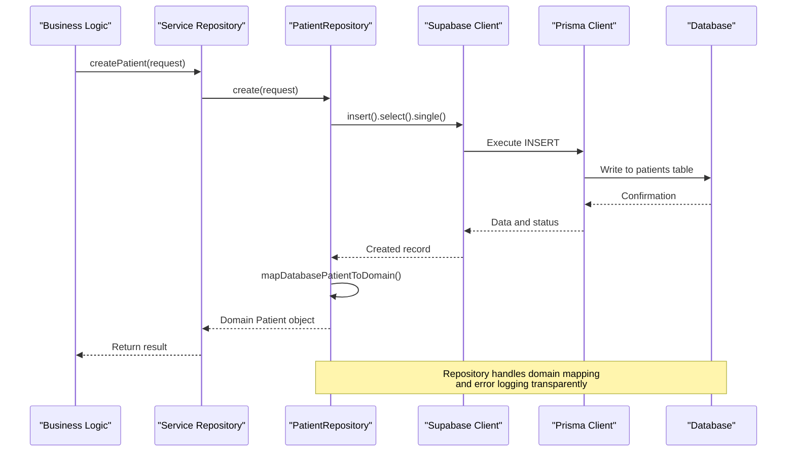
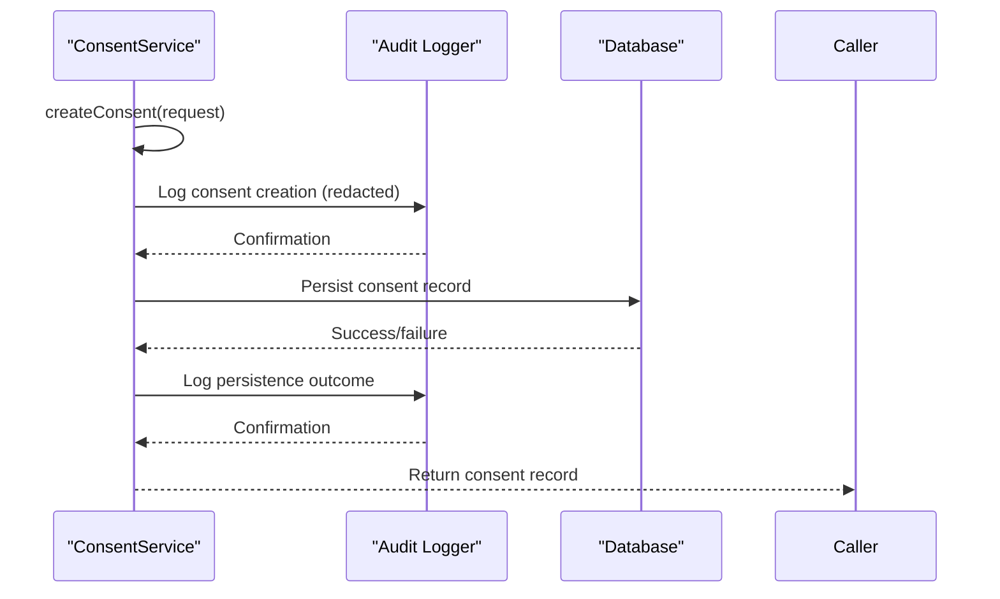

# Data Management

<cite>
**Referenced Files in This Document**
- [schema.prisma](file://packages/database/prisma/schema.prisma)
- [client.ts](file://packages/database/src/client.ts)
- [patient-repository.ts](file://packages/database/src/repositories/patient-repository.ts)
- [appointment-repository.ts](file://packages/database/src/repositories/appointment-repository.ts)
- [consent-service.ts](file://packages/database/src/services/consent-service.ts)
- [audit-service.ts](file://packages/database/src/services/audit-service.ts)
- [base.service.ts](file://packages/database/src/services/base.service.ts)
- [audit.types.ts](file://packages/database/src/types/audit.types.ts)
</cite>

## Table of Contents

1. [Introduction](#introduction)
2. [Architecture Overview](#architecture-overview)
3. [Schema Definition and Type Safety](#schema-definition-and-type-safety)
4. [Data Access Layer Abstraction](#data-access-layer-abstraction)
5. [Repository Pattern Implementation](#repository-pattern-implementation)
6. [Connection Pooling and Client Management](#connection-pooling-and-client-management)
7. [Migration Strategy](#migration-strategy)
8. [Component Interactions](#component-interactions)
9. [Cross-Cutting Concerns](#cross-cutting-concerns)
10. [Conclusion](#conclusion)

## Introduction

The data management layer in the neonpro platform is designed to provide a robust, secure, and compliant foundation for healthcare applications operating under Brazilian regulations such as LGPD (Lei Geral de Proteção de Dados). This documentation details the architectural approach using Prisma ORM with PostgreSQL database, focusing on schema definition, type-safe queries, migration strategy, and implementation patterns that ensure data integrity, privacy, and performance.

The system leverages Prisma ORM to generate type-safe database clients while integrating with Supabase for enhanced real-time capabilities and Row Level Security (RLS). The architecture implements repository pattern abstractions, connection pooling strategies, and comprehensive audit logging to meet healthcare compliance requirements. Special attention has been given to data privacy controls, backup strategies, and recovery procedures essential for medical applications.

This document provides a comprehensive overview of the data management architecture, including system context diagrams, component interactions, and implementation details that demonstrate how business logic services interact with database repositories through well-defined interfaces.

## Architecture Overview

The data management architecture in neonpro follows a layered approach with clear separation between database access, business logic, and application services. At its core, the system uses Prisma ORM as the primary interface to PostgreSQL, providing type safety and developer productivity benefits while maintaining direct SQL control when needed.



**Diagram sources**

- [schema.prisma](file://packages/database/prisma/schema.prisma)
- [client.ts](file://packages/database/src/client.ts)
- [patient-repository.ts](file://packages/database/src/repositories/patient-repository.ts)

The architecture demonstrates a clean separation of concerns where business logic services interact with repository interfaces rather than directly with database clients. This abstraction enables testability, maintainability, and flexibility in implementation. The dual client approach—using both Prisma Client for transactional operations and Supabase Client for RLS-enabled queries—provides optimal security and performance characteristics for healthcare workloads.

## Schema Definition and Type Safety

The neonpro platform employs Prisma ORM to define its database schema with strong typing and comprehensive modeling capabilities. The schema is defined in `schema.prisma` and includes detailed models for healthcare entities such as Patient, Appointment, Professional, and ConsentRecord, each mapped to corresponding database tables with appropriate field mappings.

```prisma
model Patient {
  id                           String    @id @default(uuid())
  clinicId                     String    @map("clinic_id")
  medicalRecordNumber          String    @map("medical_record_number")
  cpf                          String?   @unique
  cns                          String?   @unique
  dataConsentStatus            String?   @default("pending") @map("data_consent_status")
  lgpdConsentGiven             Boolean   @default(false) @map("lgpd_consent_given")
  
  // Relations
  appointments          Appointment[]
  consentRecords        ConsentRecord[]
  auditTrails           AuditTrail[]
  
  @@index([clinicId, isActive])
  @@index([cpf])
  @@index([cns])
  @@index([dataConsentStatus])
  @@map("patients")
}
```

**Section sources**

- [schema.prisma](file://packages/database/prisma/schema.prisma)

The schema design incorporates several key features specific to healthcare applications:

- **Brazilian Compliance Fields**: CPF (Cadastro de Pessoas Físicas), CNS (Cartão Nacional de Saúde), RG (Registro Geral), and other national identifiers are included with proper constraints.
- **LGPD Compliance Attributes**: Explicit fields for data consent status, retention periods, anonymization scheduling, and right-to-be-forgotten requests ensure regulatory compliance.
- **Medical-Specific Data**: Blood type, allergies, chronic conditions, current medications, and insurance information are modeled to support clinical workflows.
- **AI-Driven Features**: No-show risk scoring and prediction features are integrated into appointment models to enable predictive analytics.
- **Comprehensive Indexing**: Strategic database indexes are defined on frequently queried fields like clinicId, status, timestamps, and identification numbers to optimize query performance.

Type safety is achieved through Prisma's code generation capabilities, which create TypeScript types based on the schema definition. These generated types are used throughout the application to ensure compile-time verification of database operations, eliminating runtime errors due to incorrect field names or data types. The integration with TypeScript provides autocompletion, refactoring support, and error detection during development.

## Data Access Layer Abstraction

The data access layer in neonpro implements a clean abstraction over database operations through repository interfaces and service classes. This abstraction provides a consistent API for business logic components while encapsulating database-specific details and ensuring testability.



**Diagram sources**

- [patient-repository.ts](file://packages/database/src/repositories/patient-repository.ts)
- [appointment-repository.ts](file://packages/database/src/repositories/appointment-repository.ts)

The repository pattern implementation provides several benefits:

- **Interface Segregation**: Each repository exposes only the methods relevant to its entity, following the Interface Segregation Principle.
- **Domain Mapping**: Private mapping methods convert between database representations and domain objects, handling field name transformations (e.g., snake_case to camelCase) and data type conversions.
- **Error Handling**: Comprehensive error handling with structured logging ensures that database errors are properly captured and reported without exposing sensitive information.
- **Query Optimization**: Methods include support for pagination, filtering, sorting, and counting to optimize data retrieval performance.
- **Type Safety**: Repository methods use strongly-typed parameters and return values, leveraging TypeScript interfaces defined in shared packages.

The abstraction allows business logic services to operate on domain models rather than database records, promoting cleaner code and easier testing. Repository implementations can be swapped or mocked for testing purposes without affecting higher-level components.

## Repository Pattern Implementation

The repository pattern in neonpro is implemented with a focus on healthcare-specific requirements, including compliance, privacy, and data integrity. Each repository class follows a consistent structure with standardized error handling, logging, and domain mapping capabilities.



**Diagram sources**

- [patient-repository.ts](file://packages/database/src/repositories/patient-repository.ts)
- [client.ts](file://packages/database/src/client.ts)

Key aspects of the repository implementation include:

- **Standardized Error Handling**: All repository methods wrap database operations in try-catch blocks and use the `logHealthcareError` utility to capture errors with appropriate context while protecting sensitive patient information.
- **Domain Mapping**: Each repository contains private methods to transform database records to domain objects and vice versa, handling field name mappings and data type conversions.
- **Query Building**: Methods construct queries using Supabase's query builder syntax, applying filters, pagination, sorting, and relationships as needed.
- **Performance Optimization**: Repositories implement efficient querying patterns, including selective field selection, proper indexing usage, and avoidance of N+1 query problems through relationship loading.
- **Compliance Integration**: Repository operations integrate with audit logging and compliance checking systems to ensure all data access is properly recorded and validated.

The repository container pattern is used for dependency injection, allowing repositories to be instantiated with the appropriate database client. This approach facilitates testing by enabling the injection of mock clients in test environments.

## Connection Pooling and Client Management

The neonpro platform implements sophisticated connection pooling and client management strategies to optimize database performance and resource utilization for healthcare workloads. The system uses Prisma Client for transactional operations and Supabase Client for Row Level Security (RLS)-enabled queries, with both clients configured for optimal performance.

```typescript
// Connection pool configuration optimized for healthcare workloads
const createOptimizedSupabaseClient = (): SupabaseClient => {
  return createSupabaseClient(
    process.env.SUPABASE_URL,
    process.env.SUPABASE_SERVICE_ROLE_KEY,
    {
      db: {
        schema: 'public',
      },
      auth: {
        persistSession: false,
        autoRefreshToken: false,
      },
      realtime: {
        params: {
          eventsPerSecond: 10,
        },
      },
      global: {
        headers: {
          'x-application-name': 'neonpro-healthcare',
          'x-client-info': 'neonpro-database-client',
        },
      },
    },
  );
};
```

**Section sources**

- [client.ts](file://packages/database/src/client.ts)

Key features of the connection management system include:

- **Lazy Loading**: Database clients are instantiated lazily using Proxy objects to avoid initialization overhead until first use.
- **Environment-Specific Configuration**: Different configurations are applied based on environment (development, production, test) to optimize logging and performance.
- **Health Checks**: The `checkDatabaseHealth` function provides a mechanism to verify database connectivity and readiness.
- **Graceful Shutdown**: Proper cleanup handlers are registered to close database connections during process termination, preventing resource leaks.
- **Multiple Client Types**: Separate clients are created for different use cases:
  - Optimized server-side client for backend operations
  - Browser client for client-side RLS-enabled queries
  - Service role client for administrative operations
  - Node client for general server operations

The connection pooling strategy ensures that database resources are efficiently managed, with appropriate timeouts and retry mechanisms in place. The system also includes monitoring capabilities to track connection health and performance metrics.

## Migration Strategy

The neonpro platform employs Prisma Migrate for database schema evolution, with a structured approach to version control and deployment. Migrations are stored in the `prisma/migrations` directory and follow a timestamp-based naming convention to ensure proper ordering.



**Diagram sources**

- [schema.prisma](file://packages/database/prisma/schema.prisma)

The migration management approach includes:

- **Version Control Integration**: All migration files are committed to version control alongside application code, ensuring that schema changes are tracked and reviewed.
- **Automated Deployment**: CI/CD pipelines use `prisma migrate deploy` to apply migrations to staging and production environments in a controlled manner.
- **Rollback Procedures**: The system maintains a verification checklist and deployment script (`deploy.sh`) to support rollback operations if needed.
- **Pre-deployment Validation**: Migrations are tested in isolated environments before being applied to production databases.
- **Schema Drift Detection**: Prisma's migration system detects schema drift between the migration history and the current database state.

The migration strategy emphasizes safety and reliability, with particular attention to healthcare data integrity. All schema changes undergo rigorous testing to ensure they do not compromise data consistency or compliance requirements. The system also maintains comprehensive documentation of migration procedures and rollback plans.

## Component Interactions

The interaction between business logic services and database repositories in neonpro follows a well-defined pattern that ensures separation of concerns, testability, and maintainability. Services consume repository interfaces rather than concrete implementations, allowing for flexible composition and easy testing.



**Diagram sources**

- [patient-repository.ts](file://packages/database/src/repositories/patient-repository.ts)
- [consent-service.ts](file://packages/database/src/services/consent-service.ts)

Key aspects of component interactions include:

- **Dependency Injection**: Services receive repository instances through constructor injection, promoting loose coupling.
- **Error Propagation**: Errors are properly handled and propagated through the call stack, with appropriate logging at each layer.
- **Transaction Management**: Critical operations that involve multiple database writes use Prisma transactions to ensure atomicity.
- **Audit Integration**: Service operations integrate with audit logging systems to record important actions and decisions.
- **Compliance Checking**: Services invoke compliance checks before performing sensitive operations on patient data.

The interaction model ensures that business logic remains focused on domain rules while delegating data access concerns to specialized repository components. This separation enables independent development and testing of business logic and data access layers.

## Cross-Cutting Concerns

The neonpro data management layer addresses several cross-cutting concerns essential for healthcare applications, particularly around data privacy, security, and compliance. These concerns are addressed through dedicated services and integrated patterns across the architecture.

### Data Privacy Controls

The system implements comprehensive data privacy controls aligned with LGPD requirements:

- **Consent Management**: The `ConsentService` manages patient consent records with full audit trails, expiration tracking, and revocation capabilities.
- **Right to Be Forgotten**: Support for data erasure requests is built into the schema with fields like `rightToForgetRequested` and `dataAnonymizedAt`.
- **Data Minimization**: Only necessary data elements are collected and stored, with sensitive information protected through encryption and access controls.
- **Privacy-Safe Logging**: Audit logs use hashing and redaction to protect personally identifiable information (PII) while maintaining auditability.



**Diagram sources**

- [consent-service.ts](file://packages/database/src/services/consent-service.ts)
- [audit-service.ts](file://packages/database/src/services/audit-service.ts)

### Backup Strategies and Recovery Procedures

The platform implements robust backup and recovery procedures:

- **Regular Backups**: Automated backups are performed according to a defined schedule with retention policies.
- **Point-in-Time Recovery**: PostgreSQL's WAL (Write-Ahead Logging) enables point-in-time recovery for disaster scenarios.
- **Verification Checklists**: Comprehensive checklists ensure backup integrity and recovery readiness.
- **Disaster Recovery Testing**: Regular testing validates recovery procedures and RTO/RPO objectives.

### Audit and Compliance Services

The `AuditService` provides comprehensive monitoring and reporting capabilities:

- **Real-time Auditing**: WebRTC session auditing captures critical events with timestamps and metadata.
- **Compliance Reporting**: Automated generation of compliance reports for regulatory requirements.
- **Security Event Logging**: Tracking of security-related events with severity classification.
- **Search and Investigation**: Powerful search capabilities enable investigation of audit trails.

The service integrates with external monitoring systems and provides APIs for compliance reporting and security analysis.

## Conclusion

The data management layer in the neonpro platform represents a sophisticated, compliance-focused architecture designed specifically for healthcare applications in regulated environments. By leveraging Prisma ORM with PostgreSQL, the system achieves type safety, developer productivity, and performance optimization while maintaining strict adherence to Brazilian data protection regulations like LGPD.

Key strengths of the architecture include:

- **Robust Schema Design**: Comprehensive modeling of healthcare entities with built-in compliance features
- **Clean Abstraction**: Repository pattern implementation with clear separation between business logic and data access
- **Type Safety**: End-to-end type safety from database schema to application code
- **Compliance Integration**: Built-in support for consent management, audit logging, and privacy controls
- **Performance Optimization**: Strategic indexing, connection pooling, and query optimization
- **Reliable Migration Strategy**: Version-controlled schema evolution with automated deployment

The architecture successfully balances the competing demands of healthcare applications: stringent regulatory requirements, high availability needs, complex data relationships, and evolving business requirements. By implementing these patterns consistently across the platform, neonpro establishes a solid foundation for building secure, reliable, and maintainable healthcare software solutions.

Future enhancements could include additional monitoring capabilities, more sophisticated data anonymization techniques, and expanded support for interoperability standards like HL7 FHIR, further strengthening the platform's position as a leading solution for digital healthcare in Brazil.
