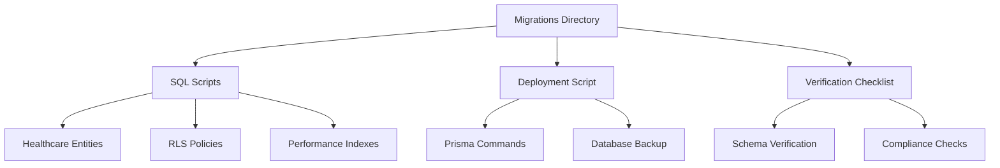
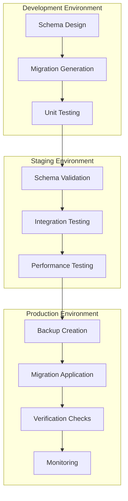
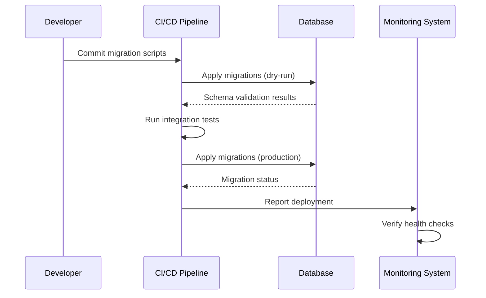
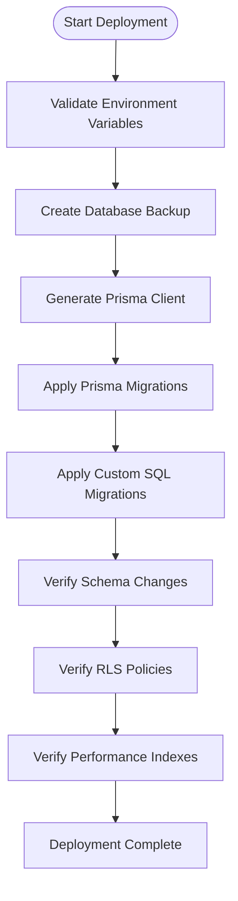
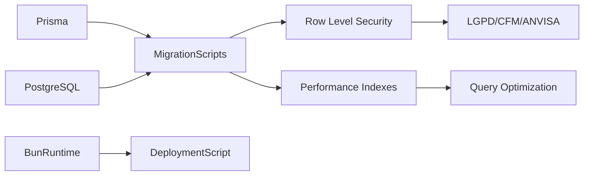

# Data Migration Strategy

<cite>
**Referenced Files in This Document **   
- [prisma.ts](file://apps/api/src/clients/prisma.ts)
- [migration.ts](file://packages/database/src/utils/migration.ts)
- [deploy.sh](file://packages/database/migrations/deploy.sh)
- [README.md](file://packages/database/migrations/README.md)
- [verification-checklist.md](file://packages/database/migrations/verification-checklist.md)
- [20250918_healthcare_entities_migration.sql](file://packages/database/migrations/20250918_healthcare_entities_migration.sql)
- [20250918_rls_policies.sql](file://packages/database/migrations/20250918_rls_policies.sql)
- [20250918_performance_indexes.sql](file://packages/database/migrations/20250918_performance_indexes.sql)
</cite>

## Table of Contents
1. [Introduction](#introduction)
2. [Project Structure](#project-structure)
3. [Core Components](#core-components)
4. [Architecture Overview](#architecture-overview)
5. [Detailed Component Analysis](#detailed-component-analysis)
6. [Dependency Analysis](#dependency-analysis)
7. [Performance Considerations](#performance-considerations)
8. [Troubleshooting Guide](#troubleshooting-guide)
9. [Conclusion](#conclusion)

## Introduction
This document outlines the data migration strategy for the neonpro platform, focusing on schema evolution using Prisma Migrate with PostgreSQL. The strategy emphasizes version-controlled database changes, safety procedures, and deployment automation across development, staging, and production environments. The implementation supports Brazilian healthcare compliance requirements including LGPD, CFM, and ANVISA regulations through a multi-schema architecture with Row Level Security (RLS) policies.

## Project Structure
The data migration system is organized within the packages/database/migrations directory, containing SQL migration scripts, deployment automation, and verification checklists. The migration workflow integrates with Prisma's type-safe ORM to ensure schema consistency across environments while maintaining backward compatibility during deployments.

**Diagram sources **
- [README.md](file://packages/database/migrations/README.md)
- [deploy.sh](file://packages/database/migrations/deploy.sh)
- [verification-checklist.md](file://packages/database/migrations/verification-checklist.md)

**Section sources**
- [README.md](file://packages/database/migrations/README.md)
- [deploy.sh](file://packages/database/migrations/deploy.sh)

## Core Components
The core components of the data migration strategy include Prisma Migrate for version control, custom SQL scripts for complex healthcare compliance requirements, automated deployment scripts, and comprehensive verification checklists. The system implements multi-schema support with RLS policies to ensure data isolation between clinics while maintaining performance through optimized indexing strategies.

**Section sources**
- [20250918_healthcare_entities_migration.sql](file://packages/database/migrations/20250918_healthcare_entities_migration.sql)
- [20250918_rls_policies.sql](file://packages/database/migrations/20250918_rls_policies.sql)
- [20250918_performance_indexes.sql](file://packages/database/migrations/20250918_performance_indexes.sql)

## Architecture Overview
The data migration architecture follows a phased approach to schema evolution, starting with structural changes, followed by security policy implementation, and concluding with performance optimization. The system uses Prisma Migrate for baseline schema management while supplementing with raw SQL scripts for features not supported by Prisma, such as advanced RLS policies and specialized indexes.

**Diagram sources **
- [deploy.sh](file://packages/database/migrations/deploy.sh)
- [verification-checklist.md](file://packages/database/migrations/verification-checklist.md)

## Detailed Component Analysis

### Migration Workflow Analysis
The migration workflow begins with schema design documented in specifications, followed by migration script generation using Prisma CLI tools. Each migration undergoes testing in isolated environments before progressing through the deployment pipeline.

#### For API/Service Components:

**Diagram sources **
- [deploy.sh](file://packages/database/migrations/deploy.sh)
- [prisma.ts](file://apps/api/src/clients/prisma.ts)

### Deployment Automation
The deployment automation script orchestrates the entire migration process, from environment validation to post-migration verification. It implements safety measures including automatic database backups before migration application and comprehensive verification of all schema changes.

#### For Complex Logic Components:

**Diagram sources **
- [deploy.sh](file://packages/database/migrations/deploy.sh)
- [migration.ts](file://packages/database/src/utils/migration.ts)

**Section sources**
- [deploy.sh](file://packages/database/migrations/deploy.sh)
- [migration.ts](file://packages/database/src/utils/migration.ts)

## Dependency Analysis
The data migration system depends on Prisma ORM for schema management, PostgreSQL 15+ for database capabilities, and various Node.js/Bun runtime dependencies for script execution. The migration scripts have interdependencies that must be executed in a specific order to maintain referential integrity and security policy enforcement.

**Diagram sources **
- [package.json](file://package.json)
- [deploy.sh](file://packages/database/migrations/deploy.sh)

**Section sources**
- [package.json](file://package.json)
- [deploy.sh](file://packages/database/migrations/deploy.sh)

## Performance Considerations
The migration strategy incorporates performance optimization through concurrent index creation using PostgreSQL's CREATE INDEX CONCURRENTLY command. The system implements connection pooling via Prisma Accelerate to handle multi-tenant workloads efficiently while maintaining low latency for real-time healthcare applications.

**Section sources**
- [20250918_performance_indexes.sql](file://packages/database/migrations/20250918_performance_indexes.sql)
- [prisma.ts](file://apps/api/src/clients/prisma.ts)

## Troubleshooting Guide
The troubleshooting guide addresses common issues encountered during migration execution, including failed RLS policy application, index creation timeouts, and schema verification failures. The deployment script includes built-in verification commands to diagnose issues and confirm successful migration completion.

**Section sources**
- [deploy.sh](file://packages/database/migrations/deploy.sh)
- [verification-checklist.md](file://packages/database/migrations/verification-checklist.md)

## Conclusion
The neonpro platform's data migration strategy provides a robust framework for managing schema evolution in a regulated healthcare environment. By combining Prisma Migrate with custom SQL scripts and automated verification, the system ensures reliable, auditable, and compliant database changes across all environments. The implementation supports zero-downtime deployments through careful migration ordering and comprehensive rollback procedures, enabling continuous delivery while maintaining data integrity and regulatory compliance.