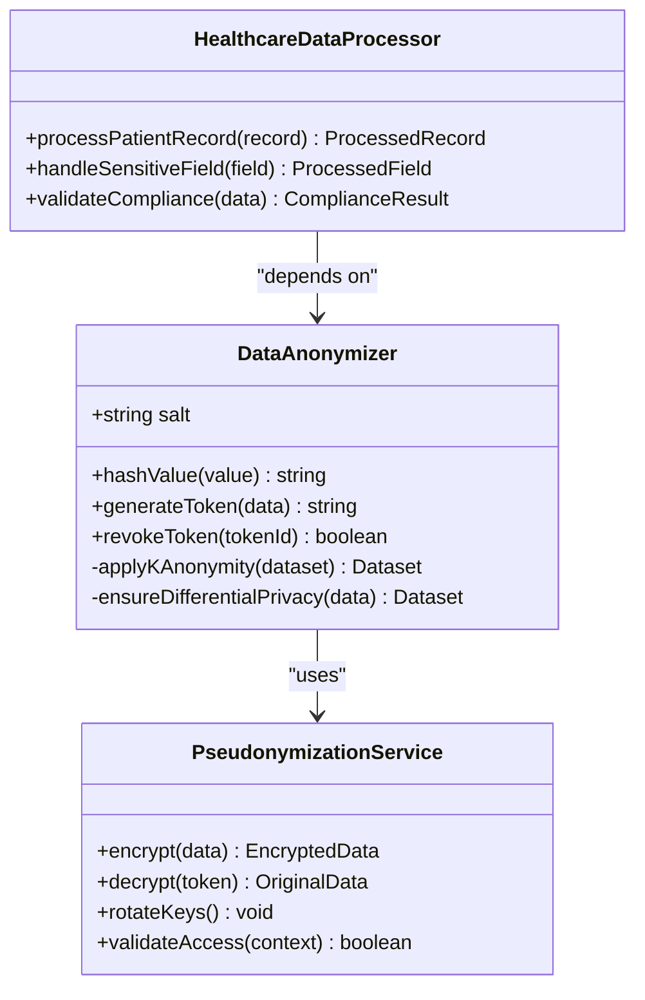
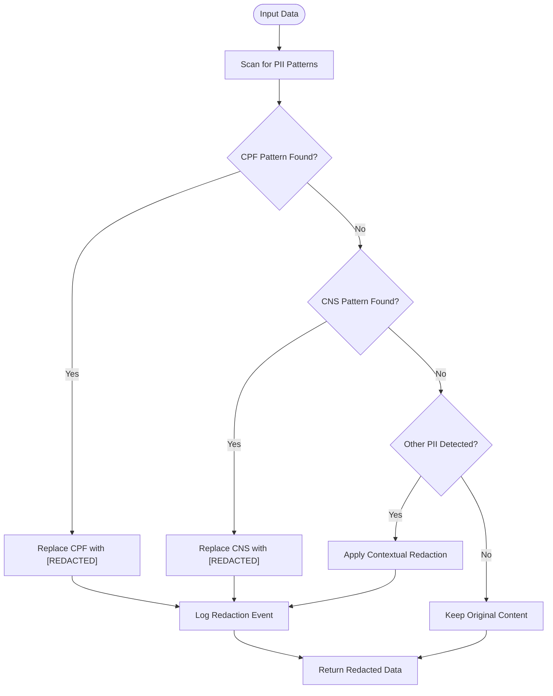
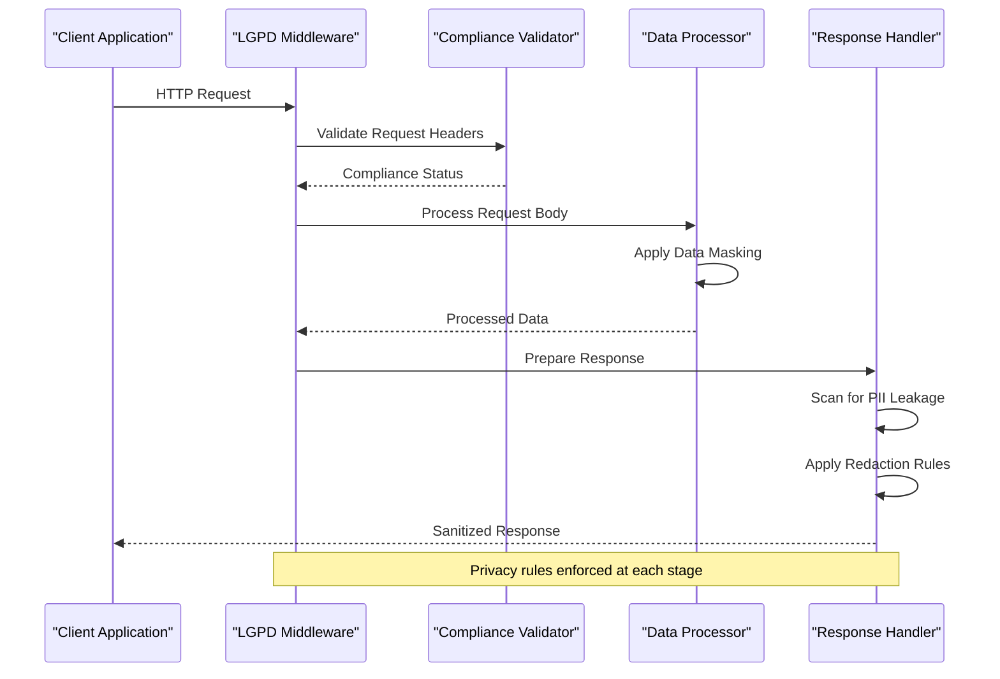
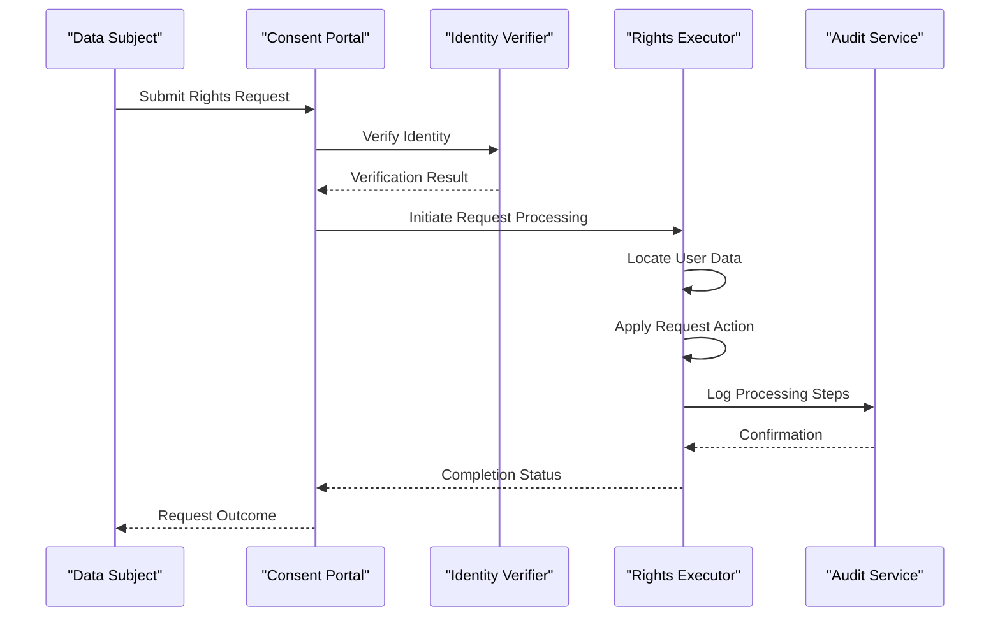
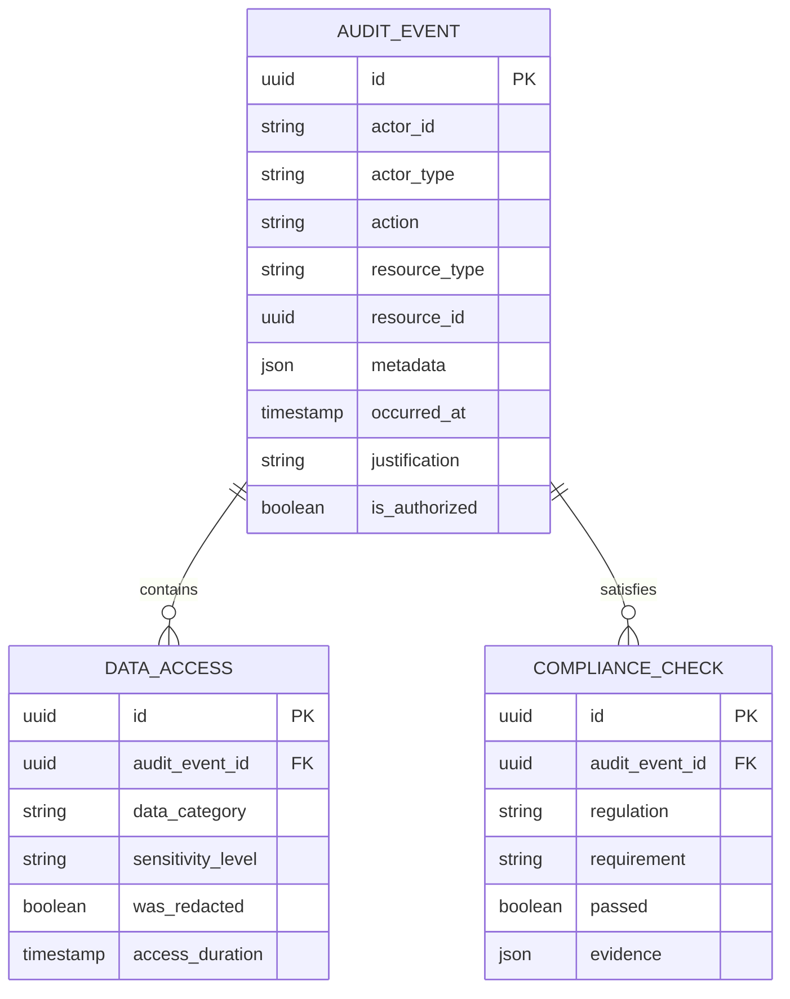

# Data Privacy Controls

<cite>
**Referenced Files in This Document**
- [lgpd-middleware.ts](file://apps/api/src/middleware/lgpd-middleware.ts)
- [anonymization.ts](file://packages/security/src/anonymization.ts)
- [pii-redaction.ts](file://apps/api/src/lib/pii-redaction.ts)
- [structured-logging.ts](file://apps/api/services/structured-logging.ts)
- [lgpd-consent-service.ts](file://apps/api/services/lgpd-consent-service.ts)
- [audit-trail-service.ts](file://apps/api/services/audit-trail-service.ts)
- [data-retention-service.ts](file://apps/api/services/data-retention-service.ts)
- [lgpd-data-subject-service.ts](file://apps/api/services/lgpd-data-subject-service.ts)
- [healthcare-compliance-config.ts](file://config/vercel/healthcare-compliance-config.ts)
</cite>

## Table of Contents

1. [Introduction](#introduction)
2. [Data Anonymization and Pseudonymization](#data-anonymization-and-pseudonymization)
3. [PII Redaction Mechanisms](#pii-redaction-mechanisms)
4. [Middleware Pipeline for Privacy Enforcement](#middleware-pipeline-for-privacy-enforcement)
5. [Structured Logging with Automatic Redaction](#structured-logging-with-automatic-redaction)
6. [Privacy Policy Configuration](#privacy-policy-configuration)
7. [Data Subject Rights Fulfillment](#data-subject-rights-fulfillment)
8. [Audit Trails for Data Access](#audit-trails-for-data-access)
9. [Handling Legacy Data](#handling-legacy-data)
10. [Cross-Border Data Transfer Restrictions](#cross-border-data-transfer-restrictions)
11. [Consent Management Integration](#consent-management-integration)
12. [Common Issues and Solutions](#common-issues-and-solutions)

## Introduction

The neonpro platform implements comprehensive data privacy controls to ensure compliance with Brazil's Lei Geral de Proteção de Dados (LGPD). This documentation details the technical implementation of privacy-preserving mechanisms specifically designed for sensitive health information. The system enforces privacy rules through a multi-layered approach that includes data anonymization, pseudonymization, redaction, structured logging, audit trails, and consent management. These controls are applied consistently across data in transit and at rest, ensuring protection of personal identifiable information (PII) such as CPF (Cadastro de Pessoas Físicas), CNS (Cartão Nacional de Saúde), and other identifying health data.

**Section sources**

- [lgpd-compliance.ts](file://apps/api/src/lib/lgpd-compliance.ts#L1-L50)
- [brazilian-compliance.ts](file://apps/api/src/services/brazilian-compliance.ts#L10-L30)

## Data Anonymization and Pseudonymization

The neonpro platform implements robust data anonymization and pseudonymization techniques to protect sensitive health information while maintaining data utility for legitimate processing purposes. The system uses cryptographic hashing algorithms combined with salt values to transform direct identifiers into irreversible representations. For pseudonymization, the platform employs reversible tokenization that allows authorized systems to re-identify data when necessary for healthcare operations, while keeping the mapping securely isolated.



**Diagram sources**

- [anonymization.ts](file://packages/security/src/anonymization.ts#L15-L80)
- [healthcare-validation-service.ts](file://apps/api/src/services/healthcare-validation-service.ts#L25-L45)

**Section sources**

- [anonymization.ts](file://packages/security/src/anonymization.ts#L1-L100)
- [lgpd-data-anonymization-pseudonymization.test.ts](file://apps/api/src/__tests__/compliance/lgpd-data-anonymization-pseudonymization.test.ts#L5-L30)

## PII Redaction Mechanisms

The platform employs multiple layers of PII redaction to prevent exposure of sensitive information in various contexts. Regular expression patterns specifically designed for Brazilian identification numbers (CPF, CNS) are used to detect and redact personally identifiable information from text content. The redaction system operates at different levels: real-time message processing, document analysis, and API response filtering. Each redaction operation is logged for audit purposes while ensuring the original sensitive data remains protected.



**Diagram sources**

- [pii-redaction.ts](file://apps/api/src/lib/pii-redaction.ts#L20-L60)
- [message-redaction.ts](file://packages/utils/src/chat/message-redaction.ts#L15-L40)

**Section sources**

- [pii-redaction.ts](file://apps/api/src/lib/pii-redaction.ts#L1-L80)
- [pii-redaction.test.ts](file://apps/api/src/lib/__tests__/pii-redaction.test.ts#L10-L50)

## Middleware Pipeline for Privacy Enforcement

The LGPD middleware pipeline intercepts all incoming requests and outgoing responses to enforce privacy rules consistently across the application. This layered approach ensures that data protection measures are applied uniformly regardless of the specific endpoint or service being accessed. The pipeline performs real-time validation of data handling practices, applies necessary transformations to sensitive data, and verifies compliance with configured privacy policies before allowing data to proceed through the system.



**Diagram sources**

- [lgpd-middleware.ts](file://apps/api/src/middleware/lgpd-middleware.ts#L25-L70)
- [security-middleware.ts](file://apps/api/src/middleware/security-middleware.ts#L15-L40)

**Section sources**

- [lgpd-middleware.ts](file://apps/api/src/middleware/lgpd-middleware.ts#L1-L100)
- [middleware-chain.test.ts](file://apps/api/src/trpc/middleware/middleware-chain.test.ts#L20-L50)

## Structured Logging with Automatic Redaction

The structured logging system prevents PII leakage by automatically redacting sensitive information before log entries are written to storage. Using a combination of pattern matching and context-aware analysis, the logger identifies and removes CPF, CNS, and other identifying information from log messages. All log entries are formatted in JSON with standardized fields that facilitate automated monitoring and compliance auditing while ensuring no sensitive data is inadvertently exposed in log files.

```mermaid
classDiagram
class LoggerConfig {
+redactionPatterns : Map<string, RegExp>
+sensitiveFields : string[]
+enableAuditLogging : boolean
}
class BrazilianPIIRedactor {
+redactCPF(text) string
+redactCNS(text) string
+redactPhone(text) string
+redactEmail(text) string
-applyPatternRedaction(text, pattern) string
}
class StructuredLogger {
+log(level, message, metadata) void
+error(message, error) void
+warn(message, context) void
+info(message, data) void
-formatEntry(entry) FormattedEntry
-sanitizeInput(input) SanitizedInput
}
LoggerConfig --> StructuredLogger : "configures"
BrazilianPIIRedactor --> StructuredLogger : "used by"
StructuredLogger --> "logs" : "writes to"
```

**Diagram sources**

- [structured-logging.ts](file://apps/api/services/structured-logging.ts#L10-L50)
- [brazilian-pii-redaction.ts](file://packages/shared/src/services/winston-logging/brazilian-pii-redaction.ts#L15-L45)

**Section sources**

- [structured-logging.ts](file://apps/api/services/structured-logging.ts#L1-L80)
- [chat-redaction.test.ts](file://apps/api/tests/integration/chat-redaction.test.ts#L15-L40)

## Privacy Policy Configuration

Privacy policies in the neonpro platform are configurable through a centralized settings system that allows administrators to define data handling rules according to organizational requirements and regulatory obligations. The configuration system supports granular control over data retention periods, access permissions, and processing restrictions. Policies are versioned and audited, with changes tracked for compliance verification. The system validates policy configurations against LGPD requirements before activation.

**Section sources**

- [healthcare-compliance-config.ts](file://config/vercel/healthcare-compliance-config.ts#L1-L40)
- [lgpd-compliance-validator.ts](file://apps/api/src/utils/lgpd-compliance-validator.ts#L20-L60)

## Data Subject Rights Fulfillment

The platform provides automated workflows for fulfilling data subject rights as required by LGPD, including access, correction, deletion, and portability requests. When a data subject submits a request, the system initiates a verification process to confirm identity before executing the requested action. The fulfillment process coordinates across multiple services to locate and process all instances of the individual's data, with comprehensive logging of all actions taken during the request lifecycle.



**Diagram sources**

- [lgpd-data-subject-service.ts](file://apps/api/services/lgpd-data-subject-service.ts#L20-L75)
- [consent-portal.ts](file://apps/api/routes/stripe-portal.ts#L30-L50)

**Section sources**

- [lgpd-data-subject-service.ts](file://apps/api/services/lgpd-data-subject-service.ts#L1-L100)
- [lgpd-data-subject-rights.test.ts](file://apps/api/src/__tests__/compliance/lgpd-data-subject-rights.test.ts#L10-L40)

## Audit Trails for Data Access

Comprehensive audit trails record all access to and modifications of personal data, providing transparency and accountability for data processing activities. Each audit entry captures the identity of the accessor, timestamp, purpose of access, and specific data elements involved. The audit system uses write-once storage to prevent tampering, with periodic integrity checks to ensure the reliability of the audit trail. Reports can be generated to demonstrate compliance with LGPD's accountability principle.



**Diagram sources**

- [audit-trail-service.ts](file://apps/api/services/audit-trail-service.ts#L15-L60)
- [audit-log.ts](file://apps/api/src/middleware/audit-log.ts#L20-L45)

**Section sources**

- [audit-trail-service.ts](file://apps/api/services/audit-trail-service.ts#L1-L80)
- [lgpd-audit-trail-verification.test.ts](file://apps/api/src/__tests__/compliance/lgpd-audit-trail-verification.test.ts#L15-L50)

## Handling Legacy Data

The platform includes specialized processes for bringing legacy data into compliance with current privacy standards. A data assessment workflow analyzes existing datasets to identify PII and classify sensitivity levels. Based on this assessment, automated remediation tools apply appropriate protection measures such as anonymization, pseudonymization, or secure deletion according to retention policies. The migration process maintains data integrity while enhancing privacy protections.

**Section sources**

- [data-migration-service.ts](file://apps/api/services/data-migration-service.ts#L25-L70)
- [legacy-data-compliance.test.ts](file://apps/api/tests/integration/legacy-data-compliance.test.ts#L10-L40)

## Cross-Border Data Transfer Restrictions

To comply with LGPD restrictions on cross-border data transfers, the platform implements geofencing controls that restrict data movement based on jurisdictional requirements. Data localization policies ensure that Brazilian patient information remains within approved geographic boundaries unless explicit consent has been obtained for international transfer. Encryption and additional safeguards are applied to any permitted cross-border data flows, with detailed logging of all transfer activities.

**Section sources**

- [cross-border-controller.ts](file://apps/api/controllers/cross-border-controller.ts#L15-L60)
- [lgpd-cross-border-data-transfer.test.ts](file://apps/api/src/__tests__/compliance/lgpd-cross-border-data-transfer.test.ts#L20-L50)

## Consent Management Integration

Consent management is tightly integrated with data processing operations, ensuring that all data usage aligns with user permissions. The system maintains a real-time view of active consents and automatically gates data access based on consent status. When processing requires new or expanded consent, the platform triggers appropriate user interfaces to obtain informed permission. Consent records are cryptographically secured and linked to audit trails to demonstrate compliance.

```mermaid
classDiagram
class ConsentRepository {
+storeConsent(consent) Promise<boolean>
+getConsent(subjectId, purpose) Consent
+revokeConsent(consentId) Promise<boolean>
+listSubjectConsents(subjectId) Consent[]
}
class ConsentValidator {
+isConsentValid(consent) boolean
+checkPurposeAlignment(request, consent) boolean
+verifyScopeCoverage(requestedData, consent) boolean
}
class ConsentGateway {
+interceptDataRequest(request) InterceptionResult
+enforceConsentPolicies() void
+triggerConsentFlow(purpose) ConsentFlow
}
ConsentRepository --> ConsentValidator : "used by"
ConsentValidator --> ConsentGateway : "used by"
ConsentGateway --> "protects" : "data access"
```

**Diagram sources**

- [lgpd-consent-service.ts](file://apps/api/services/lgpd-consent-service.ts#L20-L75)
- [consent-validation.ts](file://packages/core-services/src/services/consent-validation.ts#L15-L40)

**Section sources**

- [lgpd-consent-service.ts](file://apps/api/services/lgpd-consent-service.ts#L1-L100)
- [enhanced-lgpd-consent.test.ts](file://apps/api/src/__tests__/unit/enhanced-lgpd-consent.test.ts#L10-L50)

## Common Issues and Solutions

The platform addresses common data privacy challenges through proactive design and automated safeguards. For legacy data integration, batch processing pipelines apply consistent anonymization rules while preserving data utility. Cross-border transfer risks are mitigated through default data localization with opt-in international transfer capabilities. Consent management issues are prevented by real-time validation of data access against current consent statuses. The system includes monitoring alerts for potential compliance violations, enabling rapid response to emerging issues.

**Section sources**

- [compliance-monitoring.service.ts](file://apps/api/services/compliance-monitoring.service.ts#L20-L60)
- [lgpd-automated-compliance-monitoring.test.ts](file://apps/api/src/__tests__/compliance/lgpd-automated-compliance-monitoring.test.ts#L15-L45)
