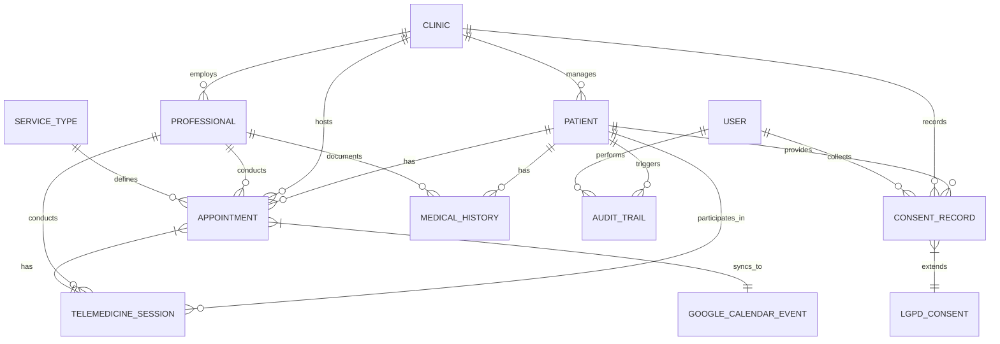

# Database Schema

<cite>
**Referenced Files in This Document**
- [schema.prisma](file://packages/database/prisma/schema.prisma)
- [patient.ts](file://packages/domain/src/entities/patient.ts)
- [appointment.ts](file://packages/domain/src/entities/appointment.ts)
- [consent.ts](file://packages/domain/src/entities/consent.ts)
- [lgpd.ts](file://packages/domain/src/value-objects/lgpd.ts)
- [medical-history.ts](file://packages/shared/src/types/medical-history.ts)
</cite>

## Table of Contents

1. [Introduction](#introduction)
2. [Core Entities](#core-entities)
3. [Entity Relationships](#entity-relationships)
4. [Prisma-Specific Features](#prisma-specific-features)
5. [Business Rules and Constraints](#business-rules-and-constraints)
6. [Data Access Patterns](#data-access-patterns)
7. [Indexing Strategy](#indexing-strategy)
8. [Conclusion](#conclusion)

## Introduction

The NeonPro platform's database schema is designed to support comprehensive healthcare management with a strong emphasis on Brazilian regulatory compliance, particularly LGPD (Lei Geral de Proteção de Dados) and CFM (Conselho Federal de Medicina) requirements. The schema models core healthcare entities such as patients, appointments, consent records, and medical history, while incorporating advanced features for telemedicine, aesthetic clinics, and AI-driven analytics. Built using Prisma ORM, the schema includes sophisticated data modeling patterns, relationship configurations, and performance optimizations tailored for healthcare applications. This documentation provides a detailed overview of the database structure, entity relationships, business rules, and access patterns that ensure both regulatory compliance and operational efficiency.

## Core Entities

### Patient Entity

The Patient entity serves as the central record for patient information, encompassing demographic details, contact information, medical history, and compliance-related data. It includes fields for Brazilian identity documents such as CPF (Cadastro de Pessoas Físicas), RG (Registro Geral), and CNS (Cartão Nacional de Saúde), ensuring adherence to local regulations. The entity also tracks LGPD consent status, data processing purposes, and retention policies, providing a comprehensive framework for data privacy and protection. Additional fields support AI-driven no-show prediction, communication preferences, and administrative metadata.

**Section sources**

- [schema.prisma](file://packages/database/prisma/schema.prisma#L100-L399)
- [patient.ts](file://packages/domain/src/entities/patient.ts#L19-L90)

### Appointment Entity

The Appointment entity manages scheduling and clinical workflow, capturing essential details such as appointment timing, status, type, and associated professionals. It incorporates Brazilian healthcare compliance features through TUSS (Terminologia Unificada da Saúde Suplementar) codes and CFM specialty codes, ensuring proper documentation and billing. The entity supports AI-driven no-show prediction with risk scores and contributing factors, enabling proactive patient engagement. Comprehensive fields track patient confirmation, reminder delivery, clinical notes, financial information, and quality metrics, facilitating end-to-end appointment management.

**Section sources**

- [schema.prisma](file://packages/database/prisma/schema.prisma#L400-L799)
- [appointment.ts](file://packages/domain/src/entities/appointment.ts#L54-L112)

### Consent Entity

The Consent entity implements robust LGPD compliance by tracking consent lifecycle, legal basis, processing purposes, and data categories. It captures granular consent for sensitive data, marketing, and research, with cryptographic proof and audit trails to ensure data integrity. The entity supports multiple consent types, including explicit, implicit, withdrawn, and revoked, with timestamps for each lifecycle stage. Additional fields document collection context, technical metadata, and legal compliance across various frameworks such as GDPR, CCPA, and HIPAA, providing a comprehensive consent management system.

**Section sources**

- [schema.prisma](file://packages/database/prisma/schema.prisma#L1200-L1400)
- [consent.ts](file://packages/domain/src/entities/consent.ts#L44-L60)

### MedicalHistory Entity

The MedicalHistory entity provides a structured framework for documenting patient health records, including consultations, exams, surgeries, and vaccinations. It supports vital signs tracking, prescription management, and medical procedures, with attachments for supporting documentation. The entity incorporates LGPD compliance features for data anonymization and access logging, ensuring patient privacy. Additional fields capture healthcare provider information, follow-up requirements, and metadata, enabling comprehensive medical record keeping and analysis.

**Section sources**

- [medical-history.ts](file://packages/shared/src/types/medical-history.ts#L0-L54)
- [medical-history.ts](file://packages/shared/src/types/medical-history.ts#L56-L123)

## Entity Relationships

**Diagram sources **

- [schema.prisma](file://packages/database/prisma/schema.prisma#L100-L2070)

## Prisma-Specific Features

### Enums

The schema utilizes Prisma enums to define standardized values for critical fields, ensuring data consistency and integrity. Key enums include:

- **AuditAction**: VIEW, CREATE, READ, UPDATE, DELETE, EXPORT, LOGIN, LOGOUT, AI_CHAT, AI_PREDICTION, AI_ANALYSIS, AI_RECOMMENDATION
- **ResourceType**: PATIENT_RECORD, PATIENT_DATA, PATIENT_CONSENT, APPOINTMENT, COMMUNICATION, AI_PREDICTION, AI_MODEL_PERFORMANCE, TELEMEDICINE_SESSION, PRESCRIPTION, COMPLIANCE_REPORT, REPORT, SYSTEM_CONFIG, USER_ACCOUNT
- **AuditStatus**: SUCCESS, FAILED, FAILURE, PARTIAL_SUCCESS, BLOCKED
- **RiskLevel**: LOW, MEDIUM, HIGH, CRITICAL
- **ComplianceFramework**: HIPAA, LGPD, GDPR, SOC2
- **AIModelStatus**: ACTIVE, INACTIVE, TRAINING, DEPRECATED
- **PolicyStatus**: ACTIVE, DRAFT, ARCHIVED, UNDER_REVIEW
- **EscalationPriority**: LOW, MEDIUM, HIGH, CRITICAL
- **EscalationStatus**: OPEN, IN_PROGRESS, ESCALATED, RESOLVED, CLOSED
- **HealthcareMetricType**: CFM_COMPLIANCE_RATE, ANVISA_AUDIT_SCORE, LGPD_COMPLIANCE_SCORE, PATIENT_SAFETY_INCIDENTS, DATA_BREACH_INCIDENTS, CONSENT_COMPLIANCE_RATE, AVERAGE_RESPONSE_TIME, ERROR_RATE, SYSTEM_AVAILABILITY, AUDIT_COMPLETION_RATE
- **HealthcareMetricStatus**: COMPLIANT, WARNING, CRITICAL, UNKNOWN
- **HealthcareMetricCategory**: CFM, ANVISA, LGPD, PERFORMANCE, SAFETY, AUDIT
- **SyncDirection**: TO_GOOGLE, FROM_GOOGLE, BIDIRECTIONAL
- **GoogleCalendarSyncStatus**: SYNCED, PENDING, FAILED, CONFLICT, IGNORED
- **GoogleCalendarOperation**: CREATE, UPDATE, DELETE, SYNC, REFRESH_TOKEN
- **SyncLogStatus**: SUCCESS, FAILED, RETRYING, IGNORED

### Composite Types and Relation Modes

The schema leverages JSON fields to store composite data structures, providing flexibility while maintaining relational integrity. Key composite types include:

- **Patient**: externalIds (Json?), dataProcessingPurpose (String[]), sensitiveDataConsent (Json?), lgpdWithdrawalHistory (Json[]), dataSharingConsent (Json?), noShowPredictionFeatures (Json?), behavioralPatterns (Json?), communicationPreferences (Json?)
- **Appointment**: noShowRiskFactors (Json?), subscriptionChannels (String[])
- **TelemedicineSession**: ngs2KeyManagement (Json), ngs2AccessControl (Json), ngs2AuditTrail (Json[]), sessionMetadata (Json?), recordingAccessLog (Json[]), technicalIssues (Json[]), troubleshootingLog (Json[]), auditEvents (Json[]), securityIncidents (Json[])
- **LGPDConsent**: cryptographicProof (Json), evidenceDocuments (Json[]), auditLog (Json[])

Relation modes are configured with appropriate onDelete behaviors, such as Cascade for dependent records, ensuring referential integrity across the data model.

**Section sources**

- [schema.prisma](file://packages/database/prisma/schema.prisma#L1000-L1600)

## Business Rules and Constraints

### Appointment Conflict Constraints

The system enforces strict appointment conflict constraints to prevent double-booking and ensure professional availability. These constraints are implemented through application-level validation and database indexing:

- **Professional Overlap**: Prevents overlapping appointments for the same professional, detected by comparing startTime and endTime fields
- **Room Double-Booking**: Prevents simultaneous appointments in the same room, identified through roomId checks
- **Back-to-Back Appointments**: Enforces minimum break periods between consecutive appointments based on professional preferences
- **Maximum Daily Appointments**: Limits the number of daily appointments per professional to prevent over-scheduling
- **Time Zone Consistency**: Ensures all appointments adhere to the clinic's configured time zone (default: America/Sao_Paulo)

These constraints are validated through the RealtimeAvailabilityService, which detects conflicts and suggests resolutions based on severity and impact.

### Patient Identity Validation

Patient identity validation follows Brazilian regulatory requirements, implementing rigorous verification processes for key identification documents:

- **CPF Validation**: Validates 11-digit format, checks for identical digits, and verifies check digits using modulo 11 algorithm
- **RG Validation**: Confirms format consistency with state-specific patterns using regex validation
- **CNS Validation**: Verifies 15-digit format and applies CNS-specific algorithm validation based on leading digit ranges (1-2 or 7-9)
- **Data Minimization**: Ensures only necessary personal data is collected and processed
- **Purpose Limitation**: Restricts data usage to specified purposes documented in consent records

The PatientIdentityService coordinates these validations, updating patient records with verification status and risk scores.

### Consent Lifecycle States

The consent management system implements a comprehensive lifecycle with defined states and transitions:

- **Pending**: Initial state when consent request is created but not yet given
- **Active**: Consent has been granted and is currently valid
- **Withdrawn**: Patient has exercised their right to withdraw consent
- **Expired**: Consent has reached its scheduled expiration date
- **Revoked**: Organization has revoked consent due to policy violations
- **Archived**: Historical record of past consent states

Transitions between states are audited and require cryptographic proof, with automatic expiration based on retention policies (typically 5 years for personal data, 20 years for medical records). The system supports granular consent for specific data categories and processing purposes, enabling fine-grained control over patient data usage.

**Section sources**

- [schema.prisma](file://packages/database/prisma/schema.prisma#L100-L2070)
- [patient-identity.service.ts](file://packages/database/src/services/patient-identity.service.ts#L450-L547)
- [lgpd-service.ts](file://apps/api/src/services/lgpd-service.ts#L247-L293)

## Data Access Patterns

### Common Lookup Scenarios

The database schema supports several critical lookup scenarios optimized for healthcare operations:

- **Patient Search**: Full-text search across name, phone, email, CPF, and medical record number with relevance scoring
- **Appointment Scheduling**: Querying available time slots by professional, service type, and date range
- **Patient History Retrieval**: Fetching complete medical history with filtering by type, date range, and clinical significance
- **LGPD Compliance Verification**: Checking current consent status and processing permissions for specific data categories
- **Audit Trail Generation**: Retrieving action logs for specific patients, users, or resource types
- **Performance Dashboard Queries**: Aggregating key metrics such as appointment completion rates, patient satisfaction, and revenue

### Query Performance Considerations

Query performance is optimized through strategic indexing, caching, and query optimization techniques:

- **Sub-second Response Requirements**: Critical operations must respond within 100ms, with LGPD compliance queries prioritized for fastest response
- **Connection Pool Management**: Configured with maximum connections (20), connection timeout (30 seconds), and idle timeout (10 minutes) to balance resource utilization
- **Query Monitoring**: Real-time monitoring of average response time, slow queries, and error rates to identify performance bottlenecks
- **Healthcare-Specific Optimization**: Prioritization of patient data queries over audit trail queries, with LGPD-compliant queries constituting at least 80% of patient data access

**Section sources**

- [database-performance.test.ts](file://apps/api/src/services/__tests__/database-performance.test.ts#L295-L344)
- [index-optimizer.ts](file://apps/api/src/services/index-optimizer.ts#L50-L88)
- [healthcare-performance.ts](file://apps/api/src/utils/healthcare-performance.ts#L245-L300)

## Indexing Strategy

### Primary Indexes

The schema implements a comprehensive indexing strategy to optimize query performance for common healthcare operations:

#### Patient Table Indexes

- **patients(clinic_id, full_name)**: Optimizes patient search by clinic and name
- **patients(clinic_id, cpf)**: Accelerates patient lookup by CPF (critical for Brazilian healthcare)
- **patients USING gin(to_tsvector('portuguese', full_name || ' ' || phone_primary || ' ' || email))**: Enables full-text search across key patient fields
- **patients(data_consent_status)**: Facilitates LGPD compliance queries
- **patients(no_show_risk_score)**: Supports AI-driven no-show prediction analysis
- **patients(created_at)**: Optimizes chronological patient registration queries

#### Appointment Table Indexes

- **appointments(professional_id, start_time)**: Critical for professional schedule management
- **appointments(patient_id, start_time)**: Optimizes patient appointment history retrieval
- **appointments(clinic_id, start_time)**: Supports daily clinic schedule generation
- **appointments(status, start_time)**: Enables efficient filtering by appointment status
- **appointments(tuss_code)**: Accelerates billing and insurance processing
- **appointments(cfm_validation_status)**: Supports CFM compliance reporting

#### Consent and Compliance Indexes

- **consent_records(patient_id, consent_type)**: Optimizes consent status verification
- **lgpd_consents(consent_hash)**: Ensures cryptographic integrity with unique constraint
- **audit_logs(user_id, created_at)**: Facilitates user activity auditing
- **google_calendar_events(sync_status)**: Supports calendar synchronization monitoring

These indexes are prioritized based on healthcare relevance, with critical operations such as CPF lookup, professional scheduling, and LGPD consent tracking receiving the highest priority.

**Section sources**

- [schema.prisma](file://packages/database/prisma/schema.prisma#L100-L2070)
- [index-optimizer.ts](file://apps/api/src/services/index-optimizer.ts#L50-L88)

## Conclusion

The NeonPro platform's database schema represents a sophisticated healthcare data model designed to meet the complex requirements of modern medical practices, particularly within the Brazilian regulatory environment. By integrating comprehensive patient management, appointment scheduling, consent tracking, and medical history documentation, the schema provides a robust foundation for delivering high-quality care while ensuring strict compliance with LGPD, CFM, and other healthcare regulations. The strategic use of Prisma ORM features, including enums, JSON composite types, and relationship configurations, enables flexible yet consistent data modeling. Performance optimizations through targeted indexing, connection pooling, and query monitoring ensure responsive operations even under heavy load. As healthcare continues to evolve with increasing regulatory complexity and technological innovation, this schema provides the adaptability and scalability needed to support future enhancements in telemedicine, AI-driven analytics, and patient engagement.
