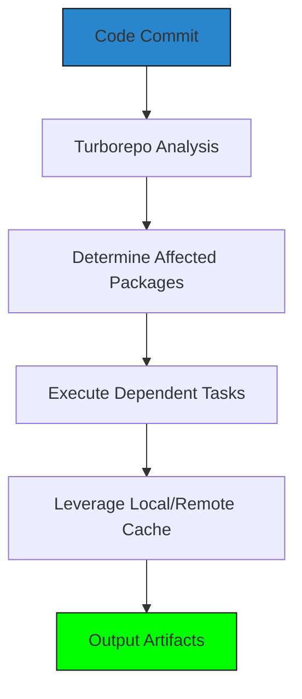
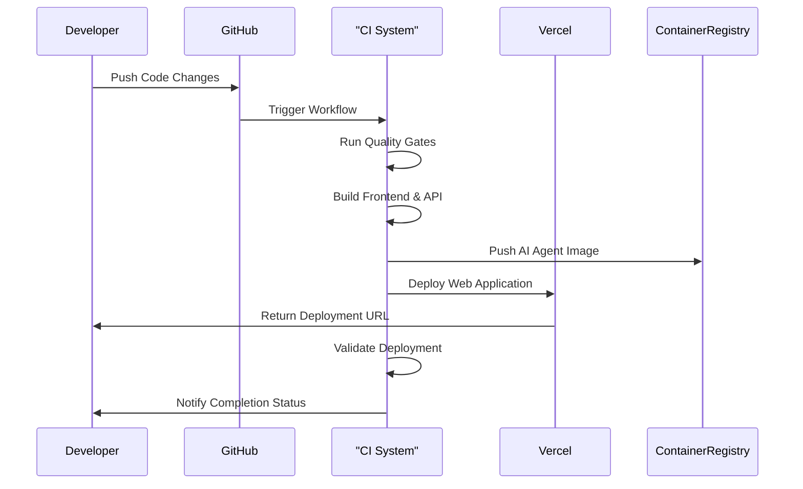
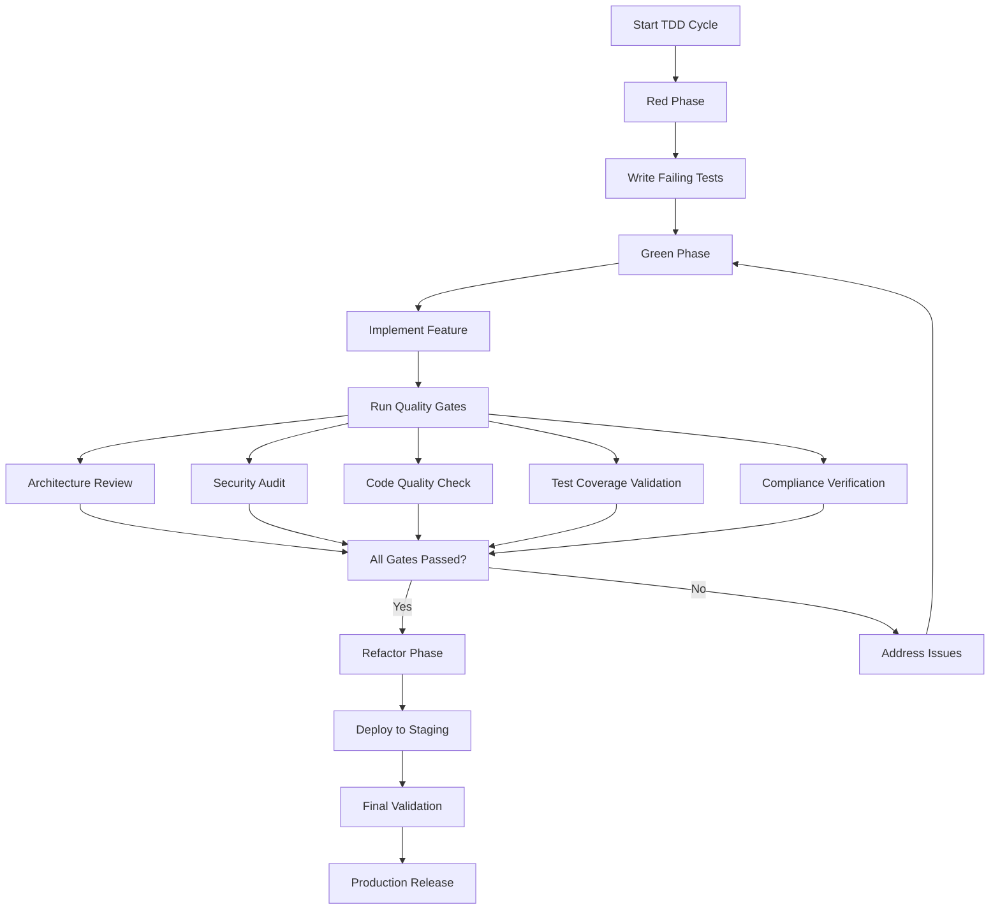

# CI/CD Pipeline

<cite>
**Referenced Files in This Document **
- [turbo.json](file://turbo.json)
- [deploy-unified.sh](file://scripts/deploy-unified.sh)
- [api/package.json](file://apps/api/package.json)
- [web/package.json](file://apps/web/package.json)
- [ai-agent/Dockerfile](file://apps/ai-agent/Dockerfile)
- [vercel.json](file://vercel.json)
- [quality-gates.ts](file://tools/quality/src/orchestrator/quality-gates.ts)
- [workflow-engine.ts](file://tools/quality/src/orchestrator/workflow-engine.ts)
</cite>

## Table of Contents

1. [Introduction](#introduction)
2. [Build Orchestration with Turbo](#build-orchestration-with-turbo)
3. [Deployment Workflow](#deployment-workflow)
4. [Quality Gates and Testing Toolkit](#quality-gates-and-testing-toolkit)
5. [Common Issues and Solutions](#common-issues-and-solutions)
6. [Performance Optimization](#performance-optimization)
7. [Healthcare-Critical Deployment Considerations](#healthcare-critical-deployment-considerations)

## Introduction

The NeonPro platform implements a comprehensive CI/CD pipeline designed for reliability, speed, and compliance in healthcare environments. The pipeline leverages Turborepo for monorepo optimization, integrates with GitHub Actions and Vercel, and enforces strict quality gates through the testing-toolkit. This document details the complete deployment lifecycle from code commit to production release.

## Build Orchestration with Turbo

The build process is orchestrated using Turborepo, which optimizes task execution across the monorepo structure. The configuration in `turbo.json` defines task dependencies and caching strategies that enable efficient incremental builds.

**Diagram sources **

- [turbo.json](file://turbo.json#L1-L48)

**Section sources**

- [turbo.json](file://turbo.json#L1-L48)

### Task Dependency Management

Turbo manages dependencies between packages by analyzing the monorepo structure and package.json files. When a change occurs, Turbo determines which packages are affected and only rebuilds what's necessary. The globalDependencies field in turbo.json specifies files that affect all tasks when changed, such as environment variables and TypeScript configurations.

### Caching Strategies

The pipeline employs both local and remote caching to minimize redundant work. Build outputs are cached based on content hashes, allowing identical builds to be skipped entirely. The outputs field in task definitions specifies which directories should be cached (e.g., dist/**, .next/**). This caching mechanism significantly reduces build times, especially for unchanged components in subsequent deployments.

## Deployment Workflow

The deployment workflow follows a structured sequence from code commit through automated testing to production release. The primary deployment script `deploy-unified.sh` coordinates this process, integrating multiple tools and services.

**Diagram sources **

- [deploy-unified.sh](file://scripts/deploy-unified.sh#L1-L673)
- [vercel.json](file://vercel.json#L1-L9)

**Section sources**

- [deploy-unified.sh](file://scripts/deploy-unified.sh#L1-L673)
- [vercel.json](file://vercel.json#L1-L9)

### Unified Deployment Coordination

The `deploy-unified.sh` script provides a single interface for coordinating deployments across frontend, API, and AI agent services. It supports multiple strategies including Turbo, Bun, and npm, automatically selecting the optimal approach based on available tooling. The script handles pre-deployment validation, build execution, Vercel deployment, and post-deployment verification in a cohesive workflow.

### Integration with External Services

The pipeline integrates with Vercel for frontend and API deployments, while containerized AI agents are pushed to container registries. The vercel.json configuration specifies build commands and output directories, ensuring compatibility with Vercel's deployment infrastructure. Environment variables are managed through Vercel's CLI, with critical settings like VITE_SUPABASE_URL and VITE_SUPABASE_ANON_KEY required for successful deployment.

## Quality Gates and Testing Toolkit

Quality assurance is enforced through the testing-toolkit, which implements a series of quality gates that must pass before deployment proceeds. These gates validate various aspects of code quality, security, and compliance.

**Diagram sources **

- [quality-gates.ts](file://tools/quality/src/orchestrator/quality-gates.ts#L1-L343)
- [workflow-engine.ts](file://tools/quality/src/orchestrator/workflow-engine.ts#L413-L445)

**Section sources**

- [quality-gates.ts](file://tools/quality/src/orchestrator/quality-gates.ts#L1-L343)
- [workflow-engine.ts](file://tools/quality/src/orchestrator/workflow-engine.ts#L413-L445)

### Quality Gate Implementation

The quality gates system validates multiple dimensions of code quality:

- **Architecture**: Ensures adherence to design patterns and system boundaries
- **Security**: Identifies vulnerabilities and ensures compliance with security policies
- **Code Quality**: Measures maintainability, complexity, and coding standards
- **Test Coverage**: Verifies sufficient test coverage (minimum 80% threshold)
- **Performance**: Validates response times and resource usage
- **Compliance**: Checks for healthcare-specific requirements like LGPD and CFM certification

Each gate has configurable thresholds and can be marked as required or optional. The default configuration requires code quality and test coverage gates to pass, while architecture, security, performance, and compliance gates are optional but recommended.

### Relationship with Testing Toolkit

The testing-toolkit orchestrates the execution of quality gates within the TDD cycle. During the red phase, tests are written but quality gates are skipped. In the green phase, implementation occurs and quality gates are evaluated. The refactor phase focuses on improving code without changing behavior, with all quality gates re-evaluated. This systematic approach ensures that quality is built into the development process rather than being an afterthought.

## Common Issues and Solutions

Several common issues can arise during the CI/CD process, particularly in complex healthcare applications. Understanding these challenges and their solutions is critical for maintaining reliable deployments.

### Build Failures Due to Dependency Conflicts

Dependency conflicts often occur when different packages require incompatible versions of the same dependency. The unified deployment script addresses this by using Bun's deterministic installation strategy when available, falling back to npm with legacy peer dependencies when necessary. Regular dependency audits using `bunx turbo run audit` help identify and resolve potential conflicts before they impact builds.

### Test Flakiness

Flaky tests can undermine confidence in the CI/CD pipeline. The testing toolkit includes mechanisms to detect and handle flaky tests, including retry logic for transient failures and isolation of problematic tests. For healthcare-critical components, tests are designed with explicit timeouts and robust error handling to minimize flakiness.

### Deployment Timeouts

Deployment timeouts may occur due to network issues or resource constraints. The deployment script implements exponential backoff with a maximum of three retries for failed operations. Additionally, health checks are configured with appropriate start periods and timeouts to accommodate initialization delays in containerized services.

## Performance Optimization

Optimizing build performance is essential for maintaining developer productivity and rapid feedback cycles. The NeonPro pipeline employs several strategies to maximize efficiency.

### Monorepo Optimization Techniques

Turborepo's intelligent task scheduling minimizes redundant work by leveraging file hashing and dependency analysis. When changes are made, only affected packages and their dependents are rebuilt. This selective rebuilding dramatically reduces overall build time compared to full repository rebuilds.

### Parallel Execution

Where possible, tasks are executed in parallel to reduce total execution time. Unit tests, linting, and type checking can run concurrently across different packages. The workflow engine supports parallelizable phases, allowing certain quality gates to be evaluated simultaneously rather than sequentially.

### Caching Best Practices

Both local and remote caching are utilized to avoid repeating expensive operations. Build artifacts, test results, and dependency installations are cached based on content hashes. The remote cache allows teams to share build outputs, further reducing duplication across developers and CI environments.

## Healthcare-Critical Deployment Considerations

Deployments in healthcare environments require additional safeguards to ensure patient safety, data privacy, and regulatory compliance.

### Compliance Enforcement

The deployment process includes specific checks for healthcare regulations including LGPD (Brazilian General Data Protection Law), CFM (Federal Council of Medicine) certification requirements, and ANVISA (National Health Surveillance Agency) approval standards. These checks verify the presence of audit logging, data anonymization features, and proper consent management.

### Emergency Rollback Procedures

In case of critical issues, the `emergency-rollback.sh` script provides a rapid rollback capability. This script restores the previous known-good deployment and validates its functionality before redirecting traffic. The rollback process is fully automated and can be initiated with minimal manual intervention.

### Monitoring and Alerting

Post-deployment monitoring includes healthcare-specific metrics such as patient data access patterns, audit log completeness, and system availability. Alerts are configured to notify on-call personnel of any anomalies that could impact patient care or data security.

**Section sources**

- [deploy-unified.sh](file://scripts/deploy-unified.sh#L1-L673)
- [quality-gates.ts](file://tools/quality/src/orchestrator/quality-gates.ts#L1-L343)
- [ai-agent/Dockerfile](file://apps/ai-agent/Dockerfile#L1-L33)
