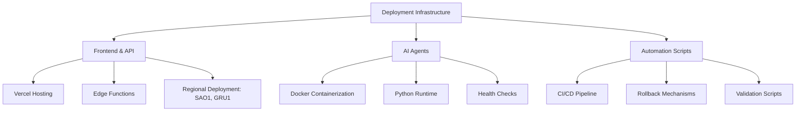
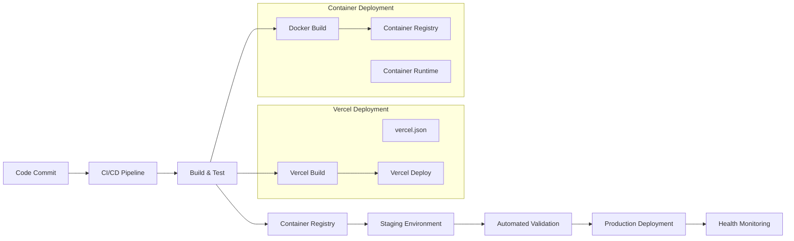
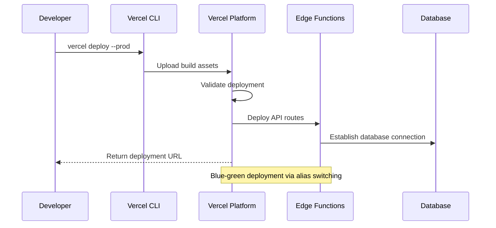
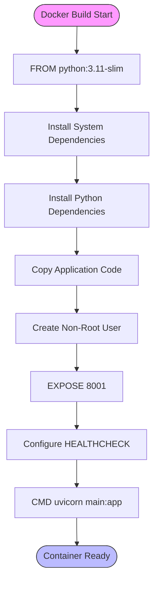
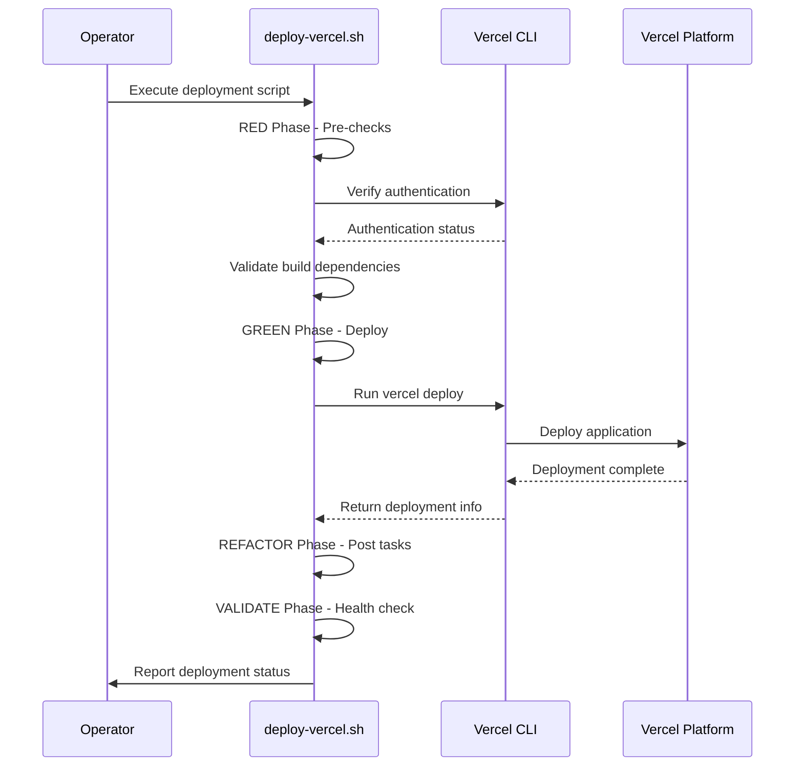
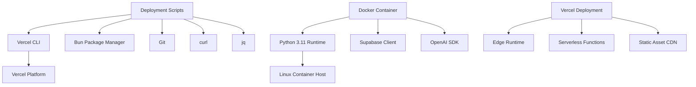

# Deployment Architecture

<cite>
**Referenced Files in This Document**   
- [Dockerfile](file://apps/ai-agent/Dockerfile)
- [vercel.json](file://apps/api/vercel.json)
- [web-vercel.json](file://apps/web/vercel.json)
- [deploy.sh](file://scripts/deploy.sh)
- [deploy-vercel.sh](file://scripts/deploy-vercel.sh)
- [emergency-rollback.sh](file://scripts/emergency-rollback.sh)
- [config.py](file://apps/ai-agent/config.py)
- [DEPLOYMENT_GUIDE.md](file://DEPLOYMENT_GUIDE.md)
- [DEPLOYMENT_SUCCESS_FINAL.md](file://DEPLOYMENT_SUCCESS_FINAL.md)
</cite>

## Table of Contents
1. [Introduction](#introduction)
2. [Project Structure](#project-structure)
3. [Core Components](#core-components)
4. [Architecture Overview](#architecture-overview)
5. [Detailed Component Analysis](#detailed-component-analysis)
6. [Dependency Analysis](#dependency-analysis)
7. [Performance Considerations](#performance-considerations)
8. [Troubleshooting Guide](#troubleshooting-guide)
9. [Conclusion](#conclusion)

## Introduction
The NeonPro platform implements a hybrid deployment architecture supporting multiple target environments including Vercel for frontend and API services, and containerized environments for AI agents. The system employs automated CI/CD pipelines, environment configuration management, and blue-green deployment strategies to ensure reliable and secure deployments. This document details the architectural patterns, component interactions, and operational procedures that enable the platform's deployment infrastructure.

## Project Structure
The NeonPro deployment infrastructure is organized across multiple directories with distinct responsibilities:
- `apps/`: Contains application-specific code and configurations for different services (AI agent, API, web frontend)
- `scripts/`: Houses deployment automation scripts including deploy, rollback, and health check utilities
- `config/vercel/`: Stores Vercel-specific configuration files for compliance and performance
- `packages/`: Shared components used across multiple applications
- Root-level configuration files manage monorepo-wide settings and deployment parameters

**Diagram sources**
- [vercel.json](file://apps/api/vercel.json#L1-L180)
- [Dockerfile](file://apps/ai-agent/Dockerfile#L1-L32)

**Section sources**
- [DEPLOYMENT_GUIDE.md](file://DEPLOYMENT_GUIDE.md#L1-L116)
- [DEPLOYMENT_SUCCESS_FINAL.md](file://DEPLOYMENT_SUCCESS_FINAL.md#L1-L137)

## Core Components
The deployment architecture consists of several core components that work together to deliver a robust deployment pipeline. These include Vercel configuration files that define deployment parameters for frontend and API services, Dockerfiles for containerizing AI agents, and shell scripts that automate the deployment process. The system also includes emergency rollback capabilities and comprehensive health checking mechanisms to ensure service reliability.

**Section sources**
- [vercel.json](file://apps/api/vercel.json#L1-L180)
- [Dockerfile](file://apps/ai-agent/Dockerfile#L1-L32)
- [deploy-vercel.sh](file://scripts/deploy-vercel.sh#L1-L73)

## Architecture Overview
The NeonPro deployment architecture follows a multi-environment strategy with distinct deployment targets for different service types. Frontend and API services are deployed to Vercel using optimized build configurations, while AI agents run in containerized environments with dedicated resource allocation. The architecture supports blue-green deployments through Vercel's aliasing system and provides emergency rollback capabilities for critical situations.

**Diagram sources**
- [deploy-vercel.sh](file://scripts/deploy-vercel.sh#L1-L73)
- [vercel.json](file://apps/api/vercel.json#L1-L180)
- [Dockerfile](file://apps/ai-agent/Dockerfile#L1-L32)

## Detailed Component Analysis

### Vercel Configuration Analysis
The Vercel configuration files define critical deployment parameters for both API and web applications. These configurations include region-specific deployment settings, security headers compliant with Brazilian healthcare regulations, and edge function routing for optimal performance.

#### For API/Service Components:

**Diagram sources**
- [vercel.json](file://apps/api/vercel.json#L1-L180)
- [deploy-vercel.sh](file://scripts/deploy-vercel.sh#L1-L73)

**Section sources**
- [vercel.json](file://apps/api/vercel.json#L1-L180)
- [web-vercel.json](file://apps/web/vercel.json#L1-L8)

### Containerization Strategy
The AI agent services are containerized using Docker to ensure consistent runtime environments across different deployment targets. The containerization strategy includes optimized base images, proper user permissions, and health checking mechanisms.

#### For Complex Logic Components:

**Diagram sources**
- [Dockerfile](file://apps/ai-agent/Dockerfile#L1-L32)
- [config.py](file://apps/ai-agent/config.py#L1-L90)

**Section sources**
- [Dockerfile](file://apps/ai-agent/Dockerfile#L1-L32)
- [config.py](file://apps/ai-agent/config.py#L1-L90)

### Deployment Automation
The deployment process is automated through shell scripts that implement the RED-GREEN-REFACTOR-VALIDATE methodology. These scripts handle pre-deployment checks, execution, post-deployment optimizations, and validation to ensure successful deployments.

#### For API/Service Components:

**Diagram sources**
- [deploy-vercel.sh](file://scripts/deploy-vercel.sh#L1-L73)
- [deploy.sh](file://scripts/deploy.sh#L1-L32)

**Section sources**
- [deploy-vercel.sh](file://scripts/deploy-vercel.sh#L1-L73)
- [deploy.sh](file://scripts/deploy.sh#L1-L32)

## Dependency Analysis
The deployment infrastructure has well-defined dependencies between components. The build system depends on package managers (Bun) and version control (Git), while deployment scripts depend on Vercel CLI and various command-line utilities. Containerized services depend on Docker runtime and registry services.

**Diagram sources**
- [deploy-vercel.sh](file://scripts/deploy-vercel.sh#L1-L73)
- [Dockerfile](file://apps/ai-agent/Dockerfile#L1-L32)
- [vercel.json](file://apps/api/vercel.json#L1-L180)

**Section sources**
- [deploy-vercel.sh](file://scripts/deploy-vercel.sh#L1-L73)
- [Dockerfile](file://apps/ai-agent/Dockerfile#L1-L32)

## Performance Considerations
The deployment architecture incorporates several performance optimizations. Vercel deployments leverage edge functions and global CDN distribution for low-latency access. Containerized AI agents use lightweight base images and optimized dependency installation to reduce startup time. The build process implements caching strategies to minimize redundant operations during continuous integration.

## Troubleshooting Guide
The deployment infrastructure includes comprehensive troubleshooting capabilities. The emergency-rollback.sh script provides automated rollback functionality for critical issues, with detailed logging and alerting. Pre-deployment checks validate authentication, dependencies, and system resources to prevent common deployment failures. Health checks monitor both the deployment process and post-deployment service availability.

**Section sources**
- [emergency-rollback.sh](file://scripts/emergency-rollback.sh#L1-L481)
- [deploy-vercel.sh](file://scripts/deploy-vercel.sh#L1-L73)

## Conclusion
The NeonPro deployment architecture successfully implements a robust, multi-environment deployment strategy that balances the need for rapid iteration with production stability. By leveraging Vercel for frontend and API services and containerization for AI agents, the platform achieves optimal performance and scalability. The automated deployment pipeline with comprehensive rollback capabilities ensures high availability and quick recovery from issues, making it suitable for healthcare applications with strict reliability requirements.