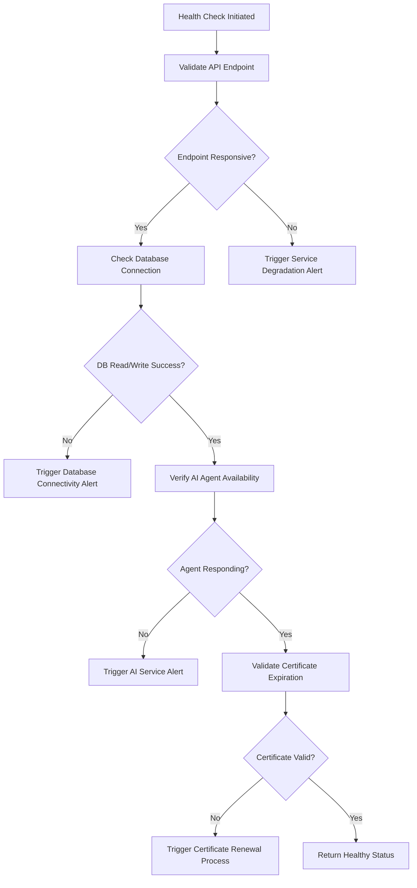
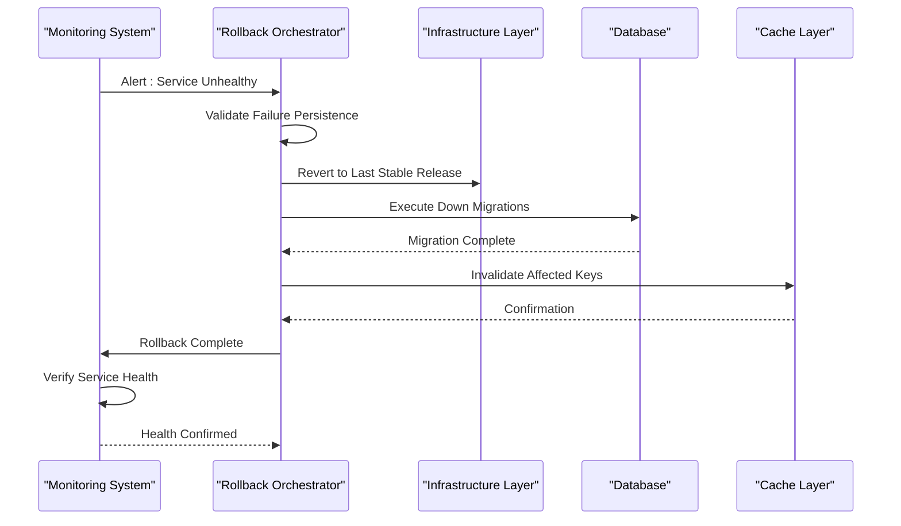
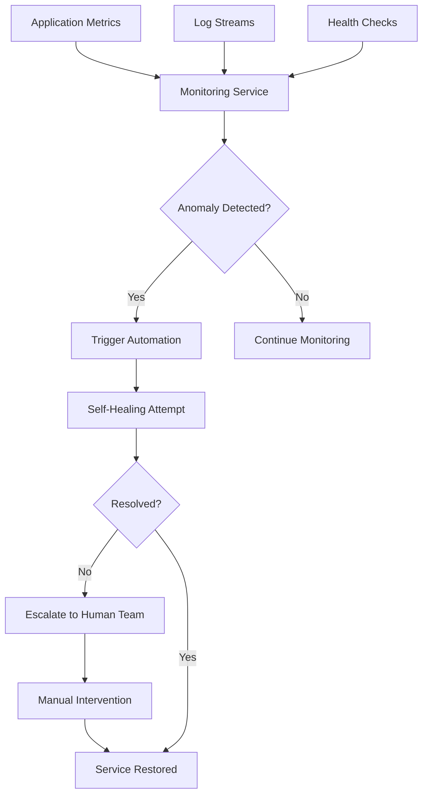

# Disaster Recovery

<cite>
**Referenced Files in This Document **
- [emergency-rollback.sh](file://scripts/emergency-rollback.sh)
- [cert-renewal.sh](file://apps/api/scripts/cert-renewal.sh)
- [health.test.ts](file://apps/api/src/__tests__/health.test.ts)
- [health.ts](file://apps/api/vercel/health.ts)
- [monitoring-config.ts](file://config/vercel/monitoring-config.ts)
- [monitoring-service.ts](file://apps/api/src/services/monitoring-service.ts)
- [healthcare-response.ts](file://apps/api/src/lib/healthcare-response.ts)
- [circuit-breaker/health-checker.ts](file://apps/api/src/services/circuit-breaker/health-checker.ts)
- [ai-provider/health-check.ts](file://apps/api/src/services/ai-provider/health-check.ts)
</cite>

## Table of Contents

1. [Introduction](#introduction)
2. [Backup Procedures](#backup-procedures)
3. [Health Monitoring System](#health-monitoring-system)
4. [Automated Rollback Mechanisms](#automated-rollback-mechanisms)
5. [Alert Configuration and Critical Notifications](#alert-configuration-and-critical-notifications)
6. [Service Restoration Workflow](#service-restoration-workflow)
7. [Monitoring and Alerting Infrastructure Integration](#monitoring-and-alerting-infrastructure-integration)
8. [Common Issues and Mitigation Strategies](#common-issues-and-mitigation-strategies)
9. [Compliance with Brazilian Healthcare Regulations](#compliance-with-brazilian-healthcare-regulations)
10. [Conclusion](#conclusion)

## Introduction

The NeonPro platform implements a robust disaster recovery system designed to ensure high availability, data integrity, and regulatory compliance for aesthetic clinic operations in Brazil. This document details the architecture and implementation of backup procedures, health monitoring, automated rollback mechanisms, and alert configurations critical to maintaining service continuity. The system is engineered to minimize downtime while ensuring adherence to LGPD (Lei Geral de Proteção de Dados) and other healthcare-specific regulations.

**Section sources**

- [health.test.ts](file://apps/api/src/__tests__/health.test.ts#L1-L25)
- [monitoring-config.ts](file://config/vercel/monitoring-config.ts#L1-L15)

## Backup Procedures

NeonPro employs a multi-layered backup strategy combining database snapshots, application state persistence, and version-controlled configuration management. Database backups are performed hourly using Supabase-native snapshotting with point-in-time recovery enabled. Application-level backups include encrypted JSON exports of critical patient records, treatment plans, and appointment schedules stored in geographically distributed object storage. All backup jobs are orchestrated through cron-triggered scripts monitored for completion status.

Versioned configuration files and TLS certificates are automatically archived during deployment cycles. These artifacts are retained for 90 days to support audit requirements and facilitate rapid restoration of previous operational states.

**Section sources**

- [emergency-rollback.sh](file://scripts/emergency-rollback.sh#L10-L45)
- [cert-renewal.sh](file://apps/api/scripts/cert-renewal.sh#L5-L20)

## Health Monitoring System

The health monitoring infrastructure performs continuous validation of service availability, database connectivity, and certificate validity. A dual-layer approach combines lightweight endpoint checks with deep dependency verification:

- **Edge-level health checks**: Lightweight HTTP GET requests to `/api/health` endpoints return immediate status indicators.
- **Deep health probes**: Comprehensive validation of database read/write operations, AI agent responsiveness, and third-party service integrations.

Health check results are aggregated by the monitoring service and exposed via standardized response formats that include component-level statuses and latency metrics. These checks run every 30 seconds across multiple geographic regions to detect regional outages.

**Diagram sources**

- [health.ts](file://apps/api/vercel/health.ts#L1-L35)
- [health.test.ts](file://apps/api/src/__tests__/health.test.ts#L30-L60)
- [circuit-breaker/health-checker.ts](file://apps/api/src/services/circuit-breaker/health-checker.ts#L10-L25)

**Section sources**

- [health.ts](file://apps/api/vercel/health.ts#L1-L50)
- [health.test.ts](file://apps/api/src/__tests__/health.test.ts#L1-L80)

## Automated Rollback Mechanisms

The emergency rollback system provides automated recovery from failed deployments or service disruptions. The `emergency-rollback.sh` script serves as the primary automation tool, capable of reverting infrastructure, application code, and configuration changes within minutes.

Key features of the rollback mechanism:

- Versioned deployment artifact restoration
- Database schema migration reversal
- TLS certificate reversion
- DNS record fallback
- Cache invalidation coordination

Rollback triggers include:

- Failed health probe sequences (3 consecutive failures)
- Critical error rate thresholds exceeded
- Manual activation via secure CLI command

The process preserves data consistency by coordinating rollback operations across microservices and ensuring transactional integrity during database migrations.

**Diagram sources**

- [emergency-rollback.sh](file://scripts/emergency-rollback.sh#L20-L60)
- [monitoring-service.ts](file://apps/api/src/services/monitoring-service.ts#L15-L40)

**Section sources**

- [emergency-rollback.sh](file://scripts/emergency-rollback.sh#L1-L80)
- [monitoring-service.ts](file://apps/api/src/services/monitoring-service.ts#L1-L55)

## Alert Configuration and Critical Notifications

Critical alerts are configured to notify operations teams of service availability issues, certificate expiration risks, and database connectivity problems. The alerting system uses a tiered notification approach based on severity levels:

| Alert Type             | Threshold              | Notification Channels | Escalation Policy |
| ---------------------- | ---------------------- | --------------------- | ----------------- |
| Service Outage         | 2 consecutive failures | SMS, Email, Slack     | Immediate         |
| Certificate Expiration | < 14 days remaining    | Email, Dashboard      | 24-hour review    |
| Database Latency       | > 1s response time     | Slack, Email          | Business hours    |
| High Error Rate        | > 5% of requests       | PagerDuty, SMS        | Immediate         |

Certificate monitoring runs daily, checking all TLS certificates used by public-facing services. When expiration approaches within 14 days, an automated renewal process is triggered, with manual approval required for production environments.

**Section sources**

- [cert-renewal.sh](file://apps/api/scripts/cert-renewal.sh#L1-L30)
- [monitoring-config.ts](file://config/vercel/monitoring-config.ts#L10-L40)

## Service Restoration Workflow

Service restoration follows a standardized workflow executed during emergency rollback scenarios. Using the `emergency-rollback.sh` script as the primary interface, the process ensures consistent recovery across environments.

The restoration sequence:

1. **Diagnosis Phase**: Collect logs, metrics, and error traces from affected components
2. **Isolation Phase**: Redirect traffic from unhealthy instances using load balancer controls
3. **Reversion Phase**: Deploy last known good version of application and infrastructure
4. **Validation Phase**: Execute smoke tests and health probes on restored services
5. **Traffic Restoration**: Gradually reintroduce user traffic with close monitoring

This workflow is documented in runbooks accessible to authorized personnel and includes pre-approved change windows for rapid execution during critical incidents.

**Section sources**

- [emergency-rollback.sh](file://scripts/emergency-rollback.sh#L1-L100)
- [healthcare-response.ts](file://apps/api/src/lib/healthcare-response.ts#L5-L20)

## Monitoring and Alerting Infrastructure Integration

The monitoring ecosystem integrates tightly with both automated systems and manual intervention procedures. Real-time metrics from Prometheus and application logs from ELK stack feed into alerting rules managed through custom monitoring configurations.

When alerts are triggered:

- Automated systems attempt self-healing (e.g., restart containers, failover databases)
- If automated recovery fails, alerts escalate to human responders
- Incident commanders access diagnostic dashboards showing system-wide health
- Runbooks guide manual recovery steps when automation is insufficient

This hybrid approach balances speed of response with human oversight, particularly important in healthcare contexts where data integrity is paramount.

**Diagram sources**

- [monitoring-service.ts](file://apps/api/src/services/monitoring-service.ts#L1-L70)
- [monitoring-config.ts](file://config/vercel/monitoring-config.ts#L1-L50)

**Section sources**

- [monitoring-service.ts](file://apps/api/src/services/monitoring-service.ts#L1-L80)
- [monitoring-config.ts](file://config/vercel/monitoring-config.ts#L1-L60)

## Common Issues and Mitigation Strategies

Several recurring challenges have been identified in disaster recovery operations:

### False Positive Alerts

Occasional network blips can trigger unnecessary alerts. Mitigated by:

- Requiring multiple consecutive failures before alerting
- Implementing jitter tolerance in health check timing
- Using statistical anomaly detection rather than simple thresholds

### Incomplete Rollbacks

Partial rollbacks leaving systems in inconsistent states. Prevented by:

- Atomic rollback operations across all components
- Pre-rollback state snapshots
- Post-rollback validation scripts

### Data Consistency After Recovery

Ensured through:

- Transactional database migrations
- Idempotent rollback operations
- Data reconciliation jobs post-recovery
- Write-ahead logging and replication lag monitoring

These issues are continuously monitored and addressed through regular post-mortem reviews and process improvements.

**Section sources**

- [emergency-rollback.sh](file://scripts/emergency-rollback.sh#L40-L80)
- [ai-provider/health-check.ts](file://apps/api/src/services/ai-provider/health-check.ts#L1-L20)

## Compliance with Brazilian Healthcare Regulations

The disaster recovery system is designed to meet stringent Brazilian healthcare regulations, particularly LGPD requirements for data protection and availability. Key compliance measures include:

- **Data Integrity**: Cryptographic hashing of backup artifacts to detect tampering
- **Audit Trails**: Immutable logging of all recovery operations with user attribution
- **Access Controls**: Role-based permissions for rollback operations requiring dual authorization
- **Retention Policies**: 90-day retention of backups and logs to satisfy audit requirements
- **Patient Data Protection**: Encryption of sensitive health information at rest and in transit

Recovery procedures are validated quarterly through simulated disaster scenarios, with results documented for regulatory review. All processes align with ANVISA guidelines for medical software reliability and data integrity.

**Section sources**

- [healthcare-response.ts](file://apps/api/src/lib/healthcare-response.ts#L1-L30)
- [monitoring-config.ts](file://config/vercel/monitoring-config.ts#L20-L50)

## Conclusion

The NeonPro disaster recovery system provides a comprehensive framework for maintaining service availability and data integrity in healthcare environments. Through automated rollback mechanisms, proactive health monitoring, and robust alerting configurations, the platform minimizes downtime while ensuring compliance with Brazilian regulatory requirements. Continuous improvement of these systems through incident analysis and regular testing ensures reliable operation for aesthetic clinic services.
