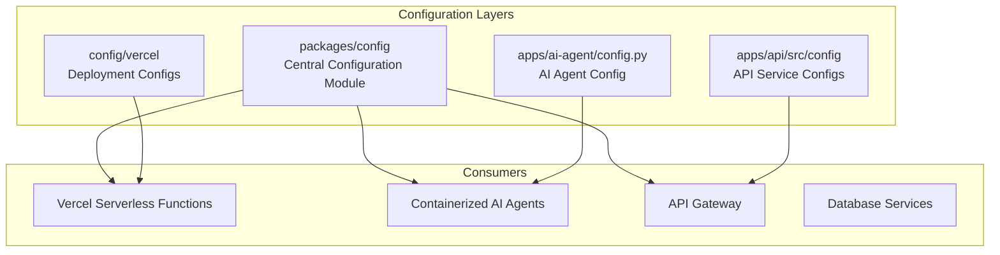
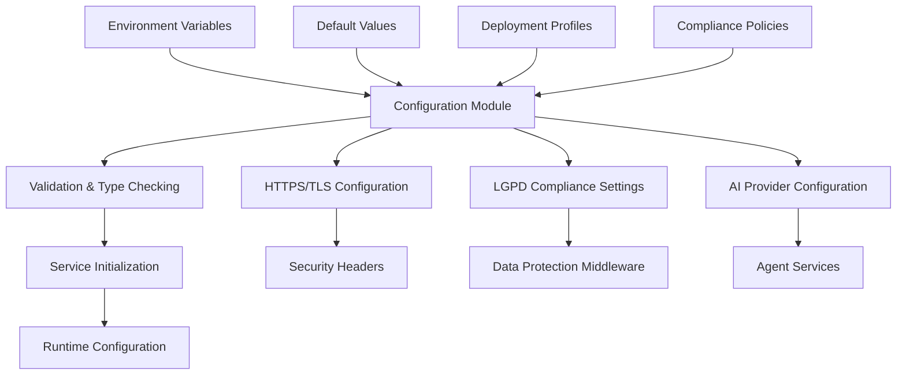
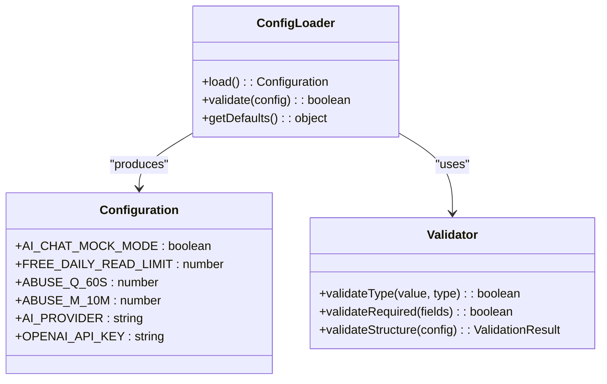
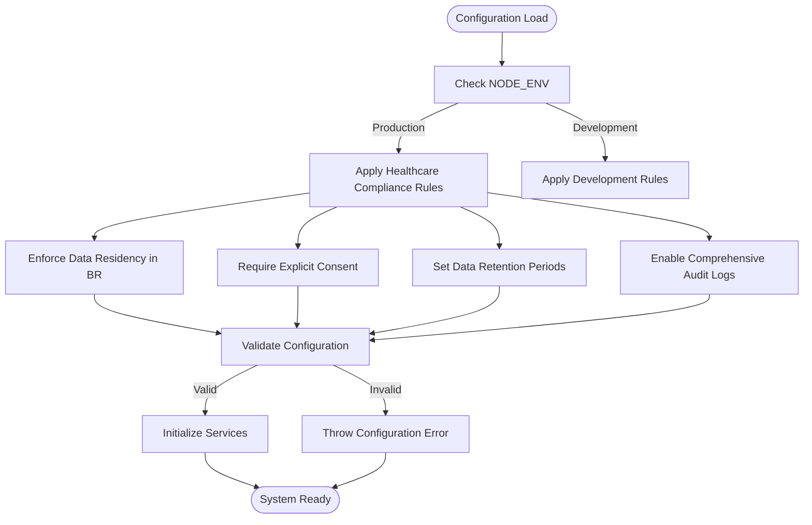
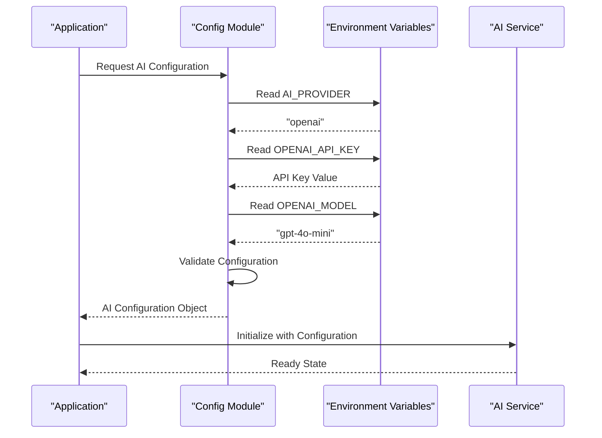
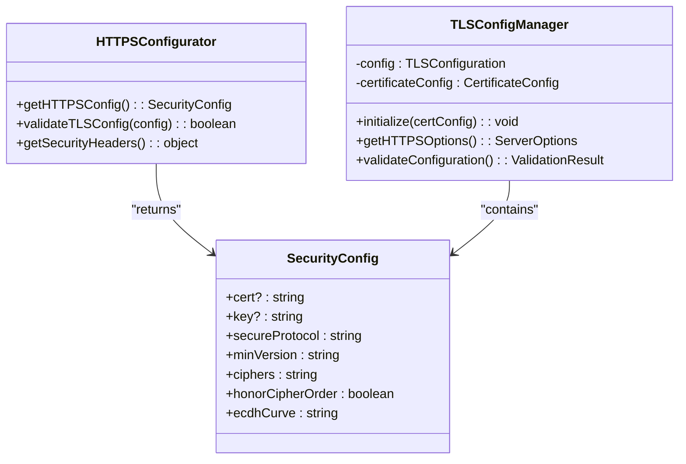
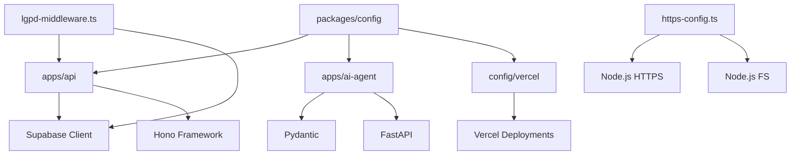

# Environment Configuration

<cite>
**Referenced Files in This Document **
- [env.ts](file://packages/config/src/env.ts)
- [ai.ts](file://packages/config/src/ai.ts)
- [https-config.ts](file://apps/api/src/config/https-config.ts)
- [tls-config.ts](file://apps/api/src/config/tls-config.ts)
- [tls-constants.ts](file://apps/api/src/config/tls-constants.ts)
- [config.py](file://apps/ai-agent/config.py)
- [healthcare-compliance-config.ts](file://config/vercel/healthcare-compliance-config.ts)
- [lgpd-middleware.ts](file://apps/api/src/middleware/lgpd-middleware.ts)
</cite>

## Table of Contents

1. [Introduction](#introduction)
2. [Project Structure](#project-structure)
3. [Core Components](#core-components)
4. [Architecture Overview](#architecture-overview)
5. [Detailed Component Analysis](#detailed-component-analysis)
6. [Dependency Analysis](#dependency-analysis)
7. [Performance Considerations](#performance-considerations)
8. [Troubleshooting Guide](#troubleshooting-guide)
9. [Conclusion](#conclusion)

## Introduction

The NeonPro platform employs a robust, multi-layered environment configuration system designed to support diverse deployment targets including Vercel serverless functions and containerized AI agents. This document details the implementation of configuration management across the platform with emphasis on healthcare compliance (LGPD), security hardening, and AI service integration. The system leverages a centralized configuration module (`@neonpro/config`) that provides type-safe access to environment variables, implements validation and fallback mechanisms, and ensures secure handling of sensitive credentials. Special attention is given to TLS/HTTPS configuration for healthcare data protection, Brazilian regulatory compliance, and secure AI provider integration.

## Project Structure

The environment configuration system spans multiple directories and services within the NeonPro platform. The core configuration logic resides in the `packages/config` module, while deployment-specific configurations are maintained in the `config/vercel` directory. Application-level configurations are implemented in individual services such as the AI agent and API server. The structure follows a layered approach with shared configuration utilities, environment-specific overrides, and service-specific implementations.

**Diagram sources **

- [packages/config](file://packages/config)
- [config/vercel](file://config/vercel)
- [apps/api/src/config](file://apps/api/src/config)
- [apps/ai-agent](file://apps/ai-agent)

**Section sources**

- [project_structure](file://workspace_path)

## Core Components

The environment configuration system comprises several key components that work together to provide a secure, compliant, and flexible configuration framework. The `packages/config` module serves as the central repository for configuration definitions, exposing typed environment variables and providing validation utilities. Deployment-specific configurations in the `config/vercel` directory implement healthcare compliance policies for production environments. Service-specific configuration files like `config.py` in the AI agent application define runtime parameters and integrate with the central configuration system. Security-related configurations, particularly for HTTPS/TLS, are implemented in dedicated modules that enforce healthcare-grade encryption standards.

**Section sources**

- [env.ts](file://packages/config/src/env.ts)
- [ai.ts](file://packages/config/src/ai.ts)
- [config.py](file://apps/ai-agent/config.py)
- [healthcare-compliance-config.ts](file://config/vercel/healthcare-compliance-config.ts)

## Architecture Overview

The environment configuration architecture follows a hierarchical model where base configurations are defined centrally and extended or overridden based on deployment context and service requirements. The system implements a cascading configuration pattern with sensible defaults, environment-specific overrides, and runtime validation. Configuration values flow from environment variables through typed interfaces to consuming services, with comprehensive validation at each stage. Security-sensitive configurations, particularly for TLS and healthcare compliance, are enforced through middleware and configuration managers that validate settings before service initialization.

**Diagram sources **

- [env.ts](file://packages/config/src/env.ts)
- [https-config.ts](file://apps/api/src/config/https-config.ts)
- [lgpd-middleware.ts](file://apps/api/src/middleware/lgpd-middleware.ts)
- [ai.ts](file://packages/config/src/ai.ts)

## Detailed Component Analysis

### Configuration Loading and Validation

The configuration system implements a comprehensive loading and validation mechanism that ensures all required environment variables are present and correctly typed. The `packages/config` module uses TypeScript interfaces to define the expected shape of configuration objects, with runtime validation to catch type mismatches. Default values are provided for optional parameters, ensuring the application can start even when certain environment variables are missing. The system distinguishes between required and optional configuration parameters, throwing descriptive errors when required variables are absent.

#### For Object-Oriented Components:

**Diagram sources **

- [env.ts](file://packages/config/src/env.ts)
- [ai.ts](file://packages/config/src/ai.ts)

**Section sources**

- [env.ts](file://packages/config/src/env.ts#L1-L23)
- [ai.ts](file://packages/config/src/ai.ts#L1-L32)

### Healthcare Compliance Configuration

Healthcare compliance settings are managed through a dedicated configuration object that implements LGPD (Brazilian General Data Protection Law) requirements. The `healthcare-compliance-config.ts` file defines a comprehensive set of compliance policies covering data residency, consent management, data subject rights, and breach notification procedures. These settings are used by middleware components to enforce compliance rules at runtime, ensuring that all data processing activities adhere to Brazilian regulations. The configuration includes specific retention periods for different types of medical records and financial data, with automatic enforcement through database policies.

#### For Complex Logic Components:

**Diagram sources **

- [healthcare-compliance-config.ts](file://config/vercel/healthcare-compliance-config.ts#L1-L253)

**Section sources**

- [healthcare-compliance-config.ts](file://config/vercel/healthcare-compliance-config.ts#L1-L253)

### AI Service Endpoint Configuration

AI service endpoints are configured through a dedicated module that manages provider selection, API keys, and model parameters. The system supports multiple AI providers (OpenAI, Anthropic, Google AI) with configurable fallback mechanisms. Each provider has its own set of configuration parameters including model names, token limits, and temperature settings. The configuration system validates the presence of required API keys and provides default values for optional parameters. Provider selection is controlled by the `AI_PROVIDER` environment variable, allowing seamless switching between providers without code changes.

#### For API/Service Components:

**Diagram sources **

- [ai.ts](file://packages/config/src/ai.ts#L1-L32)
- [env.ts](file://packages/config/src/env.ts#L1-L23)

**Section sources**

- [ai.ts](file://packages/config/src/ai.ts#L1-L32)

### Security Parameter Management

Security parameters are managed through a combination of environment variables and hardcoded security policies. The system implements strict TLS 1.3+ requirements for all production deployments, with cipher suites configured to ensure Perfect Forward Secrecy. Security headers are automatically applied to all HTTP responses, including HSTS, CSP, and XSS protection. Sensitive credentials like database passwords and API keys are never stored in code but are instead injected through environment variables. The configuration system includes validation functions that verify security settings before the application starts, preventing insecure configurations from being deployed.

#### For Object-Oriented Components:

**Diagram sources **

- [https-config.ts](file://apps/api/src/config/https-config.ts#L1-L165)
- [tls-config.ts](file://apps/api/src/config/tls-config.ts#L1-L311)

**Section sources**

- [https-config.ts](file://apps/api/src/config/https-config.ts#L1-L165)
- [tls-config.ts](file://apps/api/src/config/tls-config.ts#L1-L311)

## Dependency Analysis

The environment configuration system has well-defined dependencies across the NeonPro platform. The core `packages/config` module is consumed by all services that require environment-aware behavior, including the API server and AI agents. Deployment-specific configurations in `config/vercel` depend on the central configuration module while adding Vercel-specific settings. Security-related components, particularly TLS and HTTPS configuration, have dependencies on Node.js crypto and HTTPS modules. The LGPD compliance middleware depends on both the configuration system and the Supabase client for database operations. There are no circular dependencies in the configuration system, ensuring clean separation of concerns and predictable initialization order.

**Diagram sources **

- [package.json](file://package.json)
- [pnpm-workspace.yaml](file://pnpm-workspace.yaml)

**Section sources**

- [package.json](file://package.json)
- [pnpm-workspace.yaml](file://pnpm-workspace.yaml)

## Performance Considerations

The configuration system is designed for minimal performance impact during application startup and runtime. Configuration loading occurs synchronously during initialization, with cached results to prevent repeated file system access. The use of environment variables for configuration enables fast lookups without external dependencies. Validation is performed once at startup, avoiding runtime overhead. For serverless deployments on Vercel, the configuration system is optimized to minimize cold start times by reducing the amount of synchronous file reading and cryptographic operations during initialization. The AI configuration module caches provider settings to avoid repeated environment variable parsing during request processing.

[No sources needed since this section provides general guidance]

## Troubleshooting Guide

Common issues with the environment configuration system typically involve missing environment variables, type mismatches, or invalid security settings. When encountering configuration errors, first verify that all required environment variables are set in the deployment environment. Check the application logs for specific error messages indicating which variables are missing or invalid. For HTTPS/TLS configuration issues, validate that certificate paths are correct and files are accessible. When implementing LGPD compliance, ensure that consent management endpoints are properly configured and accessible. Use the configuration validation functions to test settings before deployment. For AI service connectivity issues, verify that API keys are correctly set and have the necessary permissions.

**Section sources**

- [env.ts](file://packages/config/src/env.ts#L1-L23)
- [https-config.ts](file://apps/api/src/config/https-config.ts#L1-L165)
- [lgpd-middleware.ts](file://apps/api/src/middleware/lgpd-middleware.ts#L1-L685)

## Conclusion

The NeonPro platform's environment configuration system provides a robust, secure, and compliant framework for managing application settings across diverse deployment targets. By centralizing configuration logic while allowing for environment-specific overrides, the system balances consistency with flexibility. The implementation of healthcare compliance policies, particularly for LGPD, demonstrates a commitment to data protection and regulatory adherence. Security-focused configurations for HTTPS/TLS ensure that sensitive medical data is protected in transit. The modular design allows for easy extension and maintenance, while comprehensive validation prevents misconfigurations from reaching production. This configuration system serves as a foundation for building secure, compliant, and reliable healthcare applications on the NeonPro platform.

[No sources needed since this section summarizes without analyzing specific files]
