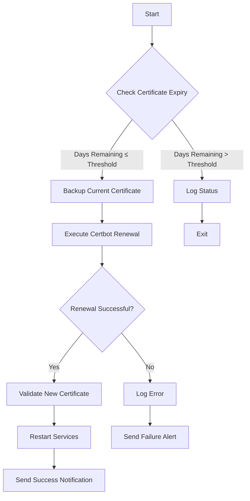
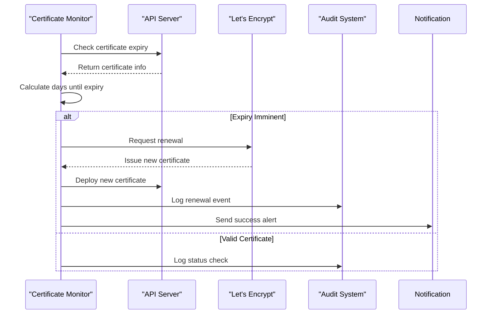
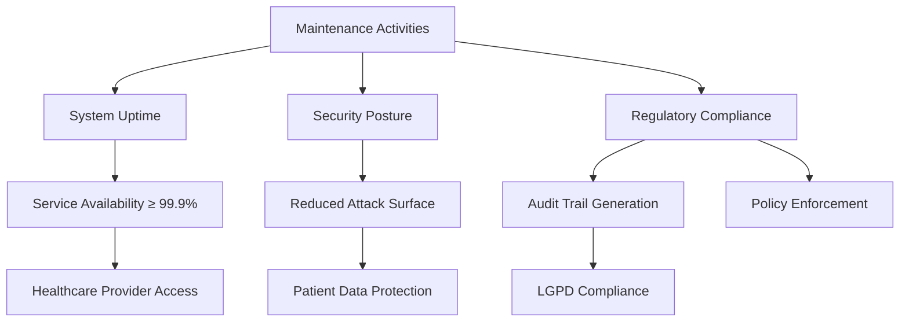

# Maintenance Procedures

<cite>
**Referenced Files in This Document**   
- [cert-renewal.sh](file://apps/api/scripts/cert-renewal.sh)
- [cert-monitor.js](file://apps/api/scripts/cert-monitor.js)
- [certificate-renewal.ts](file://apps/api/src/config/certificate-renewal.ts)
- [tls-config.ts](file://apps/api/src/config/tls-config.ts)
- [dev-setup.sh](file://scripts/dev-setup.sh)
- [install-hooks.sh](file://scripts/install-hooks.sh)
</cite>

## Table of Contents
1. [Introduction](#introduction)
2. [Routine Operational Tasks](#routine-operational-tasks)
3. [Automated Maintenance Scripts](#automated-maintenance-scripts)
4. [Security Patch Management and Compliance](#security-patch-management-and-compliance)
5. [Maintenance Impact on System Metrics](#maintenance-impact-on-system-metrics)
6. [Common Maintenance Issues](#common-maintenance-issues)
7. [Maintenance Scheduling Guidelines](#maintenance-scheduling-guidelines)
8. [Conclusion](#conclusion)

## Introduction
The NeonPro platform implements a comprehensive maintenance framework to ensure continuous availability, security, and regulatory compliance for healthcare services. This document details the operational procedures for maintaining critical system components, with emphasis on automated certificate management, dependency updates, and environment provisioning. The platform's maintenance architecture is designed to meet LGPD requirements equivalent to HIPAA standards, ensuring patient data protection through robust security practices and audit trails.

**Section sources**
- [cert-renewal.sh](file://apps/api/scripts/cert-renewal.sh#L1-L230)
- [certificate-renewal.ts](file://apps/api/src/config/certificate-renewal.ts#L1-L296)

## Routine Operational Tasks

### TLS Certificate Renewal
NeonPro employs an automated Let's Encrypt certificate renewal system that monitors certificate expiration and performs renewals before certificates expire. The system checks certificate validity daily and triggers renewal when certificates approach their expiration threshold (default: 30 days). The renewal process includes backup creation, certificate validation, and service restart procedures to ensure uninterrupted HTTPS connectivity.

The certificate monitoring service runs as a Node.js daemon that performs health checks at configurable intervals (default: 6 hours). It evaluates certificate status across multiple domains and reports health metrics that integrate with the platform's observability system. Critical alerts are generated when certificates have fewer than 7 days remaining, while warning alerts trigger at 30 days.

### Dependency Updates
Dependency management follows a structured update cycle with automated testing and rollback capabilities. The platform uses semantic versioning with strict compatibility checks to prevent breaking changes. All dependency updates undergo automated security scanning and compliance validation before deployment. Critical security patches are prioritized and can be deployed outside regular maintenance windows when necessary.

### Environment Provisioning
Development and production environments are provisioned through automated scripts that ensure consistency across deployments. The provisioning process includes Python environment setup, Git hook installation, and configuration of security policies. Environments are validated against compliance requirements before being approved for use.

**Section sources**
- [cert-renewal.sh](file://apps/api/scripts/cert-renewal.sh#L1-L230)
- [cert-monitor.js](file://apps/api/scripts/cert-monitor.js#L1-L120)
- [certificate-renewal.ts](file://apps/api/src/config/certificate-renewal.ts#L1-L296)

## Automated Maintenance Scripts

### Certificate Lifecycle Management
The certificate lifecycle management system consists of two primary components: a Bash script for certificate renewal and a JavaScript monitor for continuous health checking.

**Diagram sources**
- [cert-renewal.sh](file://apps/api/scripts/cert-renewal.sh#L1-L230)

The `cert-renewal.sh` script implements a comprehensive renewal workflow that includes error handling, logging, and notification systems. It supports multiple execution modes:
- **auto**: Checks expiry and renews if needed
- **force**: Forces renewal regardless of expiry
- **check**: Only checks certificate status
- **validate**: Validates existing certificate

### Python Environment Setup
The development environment setup is automated through shell scripts that configure Python virtual environments with required dependencies. These scripts ensure consistent package versions across developer machines and include validation steps to verify installation integrity.

### Git Hook Installation
Git hooks are automatically installed to enforce code quality and security standards. Pre-commit hooks perform syntax validation, security scanning, and compliance checks to prevent problematic code from entering the repository. These hooks are managed through the `install-hooks.sh` script which configures the local repository with the organization's standard tooling.

**Section sources**
- [cert-renewal.sh](file://apps/api/scripts/cert-renewal.sh#L1-L230)
- [dev-setup.sh](file://scripts/dev-setup.sh#L1-L50)
- [install-hooks.sh](file://scripts/install-hooks.sh#L1-L30)

## Security Patch Management and Compliance

### LGPD Compliance Implementation
NeonPro's maintenance procedures are designed to meet LGPD requirements equivalent to HIPAA standards. The certificate management system includes comprehensive audit logging that records all certificate operations in a tamper-evident log file. Each certificate change generates entries in both the operational log and the separate security audit log, ensuring complete traceability.

The platform implements TLS 1.3 as the minimum protocol version with strong cipher suites configured through centralized security policies. Certificate validation includes subject verification to prevent domain mismatches and ensure proper identity confirmation.

**Diagram sources**
- [cert-monitor.js](file://apps/api/scripts/cert-monitor.js#L1-L120)
- [certificate-renewal.ts](file://apps/api/src/config/certificate-renewal.ts#L1-L296)

### Security Patch Application
Security patches are applied through a controlled process that includes:
1. Vulnerability assessment and prioritization
2. Testing in isolated environments
3. Staged rollout to production
4. Post-deployment monitoring

Critical security patches related to TLS/SSL vulnerabilities are given highest priority and can be deployed immediately with appropriate approvals. The patch management system integrates with vulnerability databases to automatically identify relevant patches for the platform's technology stack.

**Section sources**
- [certificate-renewal.ts](file://apps/api/src/config/certificate-renewal.ts#L1-L296)
- [tls-config.ts](file://apps/api/src/config/tls-config.ts#L1-L311)

## Maintenance Impact on System Metrics

### System Uptime
Maintenance activities are designed to minimize impact on system uptime. Certificate renewals use zero-downtime techniques where possible, with service reloads instead of restarts. The monitoring system ensures that renewals occur during periods of low traffic to further reduce potential impact.

### Security Posture
Regular maintenance significantly enhances the platform's security posture by ensuring cryptographic materials remain current and vulnerabilities are promptly addressed. Automated certificate renewal prevents service disruptions due to expired certificates, while dependency updates eliminate known security flaws.

### Regulatory Requirements
The maintenance system generates comprehensive audit trails that satisfy regulatory requirements for healthcare applications. All maintenance operations are logged with timestamps, operator information (when applicable), and outcome status. These logs are retained for the required period and are available for compliance audits.

**Diagram sources**
- [cert-renewal.sh](file://apps/api/scripts/cert-renewal.sh#L1-L230)
- [certificate-renewal.ts](file://apps/api/src/config/certificate-renewal.ts#L1-L296)

**Section sources**
- [cert-renewal.sh](file://apps/api/scripts/cert-renewal.sh#L1-L230)
- [certificate-renewal.ts](file://apps/api/src/config/certificate-renewal.ts#L1-L296)

## Common Maintenance Issues

### Failed Certificate Renewals
Certificate renewal failures typically occur due to:
- Network connectivity issues preventing domain validation
- Insufficient file permissions for certificate directories
- Resource constraints on the server
- Rate limiting from Let's Encrypt

Troubleshooting steps include verifying domain accessibility, checking log files for specific error messages, and ensuring the certbot utility is properly installed and configured.

### Broken Development Environments
Development environment issues often stem from:
- Incompatible Python versions
- Missing system dependencies
- Corrupted virtual environments
- Network restrictions on package downloads

Resolution involves using the standardized setup scripts, clearing corrupted environments, and verifying network connectivity to package repositories.

### Incompatible Dependency Upgrades
Dependency conflicts arise when:
- Major version upgrades introduce breaking changes
- Transitive dependencies have version conflicts
- Security patches require incompatible API changes

The platform addresses these through comprehensive testing, dependency locking, and gradual rollout strategies that allow for quick rollback if issues are detected.

**Section sources**
- [cert-renewal.sh](file://apps/api/scripts/cert-renewal.sh#L1-L230)
- [dev-setup.sh](file://scripts/dev-setup.sh#L1-L50)

## Maintenance Scheduling Guidelines

### Optimal Maintenance Windows
Maintenance should be scheduled during periods of lowest clinical activity, typically:
- Weekday nights (10 PM - 6 AM local time)
- Weekend mornings (6 AM - 8 AM local time)
- Avoiding peak hours when healthcare providers are actively using the system

Emergency maintenance for critical security patches may occur outside these windows with appropriate notifications to affected parties.

### Minimizing Disruption
To minimize disruption to healthcare providers and patients:
- Schedule maintenance during natural lulls in clinical workflow
- Provide advance notice through multiple communication channels
- Implement rolling updates for multi-region deployments
- Maintain read-only access when possible during updates
- Ensure backup systems are available during maintenance

The automated nature of certificate renewals allows them to occur with minimal human intervention, reducing the window of potential disruption.

**Section sources**
- [cert-renewal.sh](file://apps/api/scripts/cert-renewal.sh#L1-L230)
- [certificate-renewal.ts](file://apps/api/src/config/certificate-renewal.ts#L1-L296)

## Conclusion
The NeonPro platform's maintenance procedures provide a robust framework for ensuring system reliability, security, and compliance. Through automation of critical tasks like certificate management and environment provisioning, the platform reduces human error and ensures consistent operations. The integration of compliance requirements into maintenance workflows guarantees that security practices meet healthcare industry standards. By following the guidelines outlined in this document, operations teams can maintain high system availability while protecting sensitive patient data and supporting uninterrupted healthcare delivery.