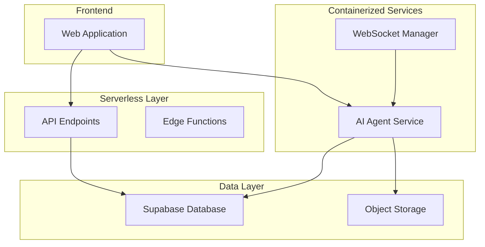
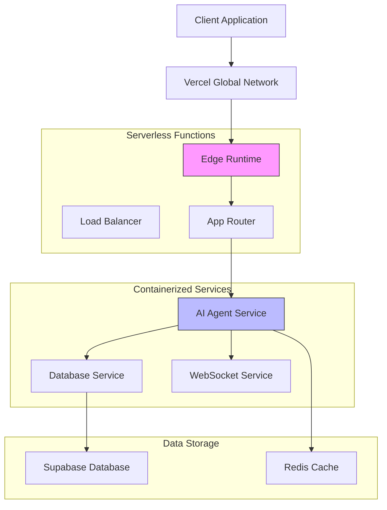
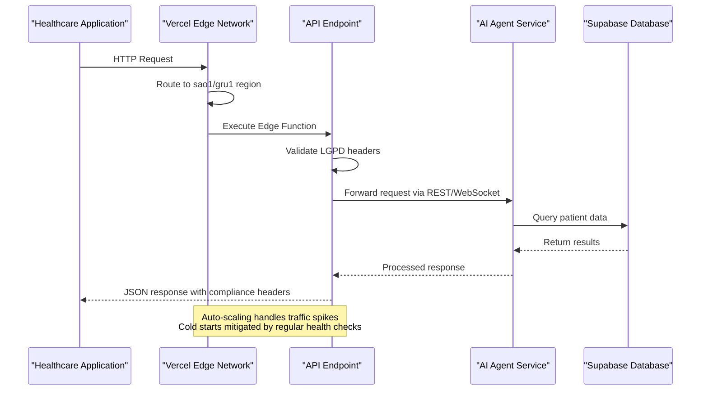
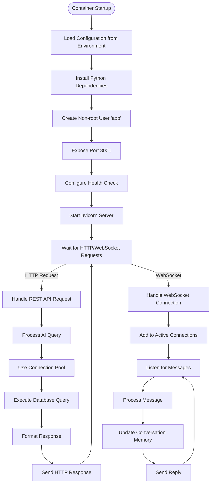
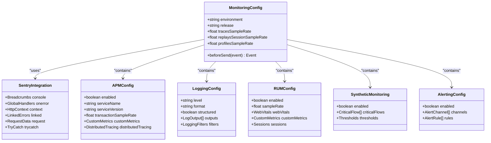
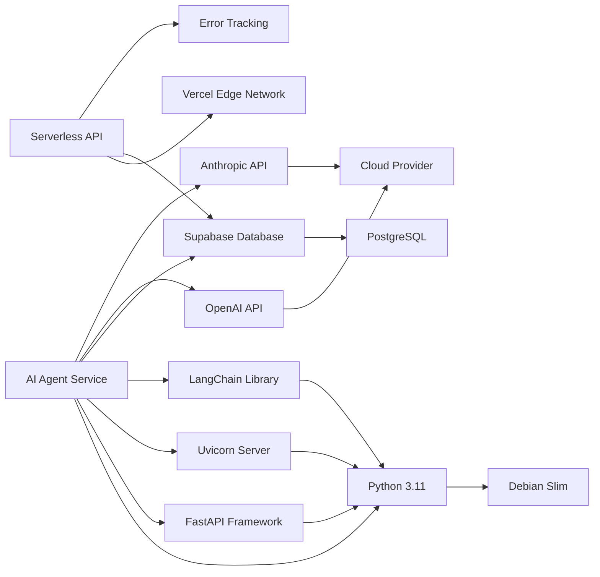

# Scaling Strategy

<cite>
**Referenced Files in This Document **
- [vercel.json](file://apps/api/vercel.json)
- [Dockerfile](file://apps/ai-agent/Dockerfile)
- [performance-config.ts](file://config/vercel/performance-config.ts)
- [monitoring-config.ts](file://config/vercel/monitoring-config.ts)
- [main.py](file://apps/ai-agent/main.py)
- [config.py](file://apps/ai-agent/config.py)
- [agent_service.py](file://apps/ai-agent/services/agent_service.py)
- [database_service.py](file://apps/ai-agent/services/database_service.py)
- [websocket_manager.py](file://apps/ai-agent/services/websocket_manager.py)
</cite>

## Table of Contents

1. [Introduction](#introduction)
2. [Project Structure](#project-structure)
3. [Core Components](#core-components)
4. [Architecture Overview](#architecture-overview)
5. [Detailed Component Analysis](#detailed-component-analysis)
6. [Dependency Analysis](#dependency-analysis)
7. [Performance Considerations](#performance-considerations)
8. [Troubleshooting Guide](#troubleshooting-guide)
9. [Conclusion](#conclusion)

## Introduction

The NeonPro platform implements a hybrid scaling infrastructure that combines serverless API endpoints on Vercel with containerized AI agent services to support healthcare applications with strict compliance requirements. This document details the architectural patterns and implementation specifics for horizontal scaling, load distribution, connection pooling, and resource allocation based on traffic patterns. The system is designed to handle peak usage periods typical in healthcare settings while maintaining LGPD, ANVISA, and CFM compliance.

## Project Structure

The project follows a monorepo structure with distinct applications for different components. The API layer is hosted on Vercel as serverless functions, while AI agents run as containerized services. Configuration files in the `config/vercel` directory manage performance, monitoring, and compliance settings across environments.

**Diagram sources **

- [vercel.json](file://apps/api/vercel.json#L1-L180)
- [Dockerfile](file://apps/ai-agent/Dockerfile#L1-L32)

**Section sources**

- [vercel.json](file://apps/api/vercel.json#L1-L180)
- [Dockerfile](file://apps/ai-agent/Dockerfile#L1-L32)

## Core Components

The core components include serverless API endpoints configured through Vercel's edge runtime and containerized AI agent services built with Python and FastAPI. The API layer handles request routing, authentication, and compliance checks, while the AI agent services process complex queries using RAG (Retrieval-Augmented Generation) patterns and maintain WebSocket connections for real-time communication.

**Section sources**

- [main.py](file://apps/ai-agent/main.py#L1-L180)
- [config.py](file://apps/ai-agent/config.py#L1-L90)

## Architecture Overview

The architecture employs a multi-layered approach to scaling, with serverless functions handling stateless API requests and containerized services managing stateful AI operations. Request load is distributed through Vercel's global network with regional deployment in São Paulo (sao1, gru1) to ensure data residency compliance. Connection pooling is implemented at the database service level, while resource allocation adapts to traffic patterns through auto-scaling configurations.

**Diagram sources **

- [vercel.json](file://apps/api/vercel.json#L1-L180)
- [main.py](file://apps/ai-agent/main.py#L1-L180)

## Detailed Component Analysis

### Serverless API Scaling

The serverless API endpoints are configured for optimal performance and compliance through the vercel.json configuration file. Functions are deployed to Brazilian regions (sao1, gru1) to ensure data residency, with memory limits set between 128MB and 256MB based on endpoint complexity. The edge runtime enables low-latency execution close to end users.

#### For API/Service Components:

**Diagram sources **

- [vercel.json](file://apps/api/vercel.json#L1-L180)
- [performance-config.ts](file://config/vercel/performance-config.ts#L1-L246)

**Section sources**

- [vercel.json](file://apps/api/vercel.json#L1-L180)
- [performance-config.ts](file://config/vercel/performance-config.ts#L1-L246)

### Containerized AI Agent Scaling

The AI agent services run in Docker containers with resource limits defined by the Dockerfile and runtime configuration. Each container exposes port 8001 with a health check endpoint that ensures service availability. The uvicorn server runs with multiple workers to handle concurrent requests, while connection pooling optimizes database interactions.

#### For Complex Logic Components:

**Diagram sources **

- [Dockerfile](file://apps/ai-agent/Dockerfile#L1-L32)
- [main.py](file://apps/ai-agent/main.py#L1-L180)

**Section sources**

- [Dockerfile](file://apps/ai-agent/Dockerfile#L1-L32)
- [main.py](file://apps/ai-agent/main.py#L1-L180)

### Performance Monitoring and Metrics Collection

Comprehensive monitoring is implemented through integration with Sentry and custom metrics collection. The monitoring-config.ts file defines sampling rates, alerting rules, and compliance monitoring for healthcare-specific operations. Real User Monitoring (RUM) tracks Core Web Vitals with 100% sampling rate to ensure patient safety.

#### For Object-Oriented Components:

**Diagram sources **

- [monitoring-config.ts](file://config/vercel/monitoring-config.ts#L1-L484)
- [agent_service.py](file://apps/ai-agent/services/agent_service.py#L1-L480)

## Dependency Analysis

The system dependencies are carefully managed to ensure scalability and compliance. The serverless API layer depends on Vercel's edge network for global distribution, while the AI agent services depend on Supabase for database access and OpenAI/Anthropic for AI capabilities. All dependencies are pinned to specific versions in requirements.txt to prevent unexpected behavior during scaling events.

**Diagram sources **

- [requirements.txt](file://apps/ai-agent/requirements.txt)
- [Dockerfile](file://apps/ai-agent/Dockerfile#L1-L32)

**Section sources**

- [Dockerfile](file://apps/ai-agent/Dockerfile#L1-L32)
- [requirements.txt](file://apps/ai-agent/requirements.txt)

## Performance Considerations

The platform implements several performance optimizations to handle healthcare workloads efficiently. Static assets are cached for one year with immutable headers, while API responses use stale-while-revalidate caching for five minutes. Patient and medical data endpoints have no-cache policies to comply with LGPD requirements. Image optimization uses WebP and AVIF formats with responsive sizing.

For serverless functions, cold start mitigation is achieved through regular health checks every five minutes, ensuring functions remain warm during peak usage periods. The containerized AI agents use connection pooling with a configurable pool size to minimize database connection overhead. Resource allocation scales based on traffic patterns, with higher memory allocation for complex AI processing endpoints.

**Section sources**

- [performance-config.ts](file://config/vercel/performance-config.ts#L1-L246)
- [config.py](file://apps/ai-agent/config.py#L1-L90)

## Troubleshooting Guide

When diagnosing scaling issues, first verify the health of both serverless and containerized components. Check the /health endpoint on API routes and container logs for errors. Monitor database connection pools for exhaustion, and review rate limiting configurations that may be throttling legitimate traffic. For AI agent issues, validate the connection to external AI providers and check conversation memory usage.

Common issues include:

- Cold starts in serverless functions during traffic spikes
- Database connection pool exhaustion under high load
- Rate limiting blocking legitimate healthcare workflows
- Memory leaks in long-running AI agent processes
- WebSocket connection timeouts in high-latency networks

Implement gradual traffic increases during testing to identify scaling bottlenecks before they impact production users. Use the synthetic monitoring critical flows to validate end-to-end functionality under load.

**Section sources**

- [main.py](file://apps/ai-agent/main.py#L1-L180)
- [websocket_manager.py](file://apps/ai-agent/services/websocket_manager.py#L1-L230)

## Conclusion

The NeonPro platform's scaling infrastructure effectively combines serverless and containerized architectures to meet the demanding requirements of healthcare applications. By deploying serverless functions on Vercel with regional constraints for data residency and running AI agents in optimized Docker containers, the system achieves both scalability and compliance. The comprehensive monitoring and performance optimization strategies ensure reliable operation during peak usage periods while maintaining strict adherence to LGPD, ANVISA, and CFM regulations.
