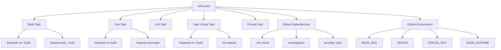

# Directory Structure Breakdown

<cite>
**Referenced Files in This Document**
- [turbo.json](file://turbo.json)
- [pnpm-workspace.yaml](file://pnpm-workspace.yaml)
- [bun-workspace.json](file://bun-workspace.json)
- [apps/api/src/middleware/auth.ts](file://apps/api/src/middleware/auth.ts)
- [packages/shared/src/models/api-contract.ts](file://packages/shared/src/models/api-contract.ts)
- [specs/006-implemente-o-https/contracts/api.yaml](file://specs/006-implemente-o-https/contracts/api.yaml)
- [apps/api/src/routes/ai-chat.ts](file://apps/api/src/routes/ai-chat.ts)
- [apps/api/src/services/semantic-cache.ts](file://apps/api/src/services/semantic-cache.ts)
- [apps/api/src/lib/pii-redaction.ts](file://apps/api/src/lib/pii-redaction.ts)
</cite>

## Table of Contents

1. [Top-Level Directory Overview](#top-level-directory-overview)
2. [Domain-Driven Design and Separation of Concerns](#domain-driven-design-and-separation-of-concerns)
3. [Workspace Management with pnpm and bun](#workspace-management-with-pnpm-and-bun)
4. [Dependency Resolution Between Packages](#dependency-resolution-between-packages)
5. [Feature Placement Guidance](#feature-placement-guidance)
6. [Build Optimization with turbo.json](#build-optimization-with-turbojson)

## Top-Level Directory Overview

The neonpro monorepo follows a well-structured organization that enables scalability, maintainability, and efficient development workflows. Each top-level directory serves a specific purpose in the overall architecture:

### apps (Main Applications)

The `apps` directory contains complete, deployable applications that represent the primary user-facing products. These include:

- **ai-agent**: A Python-based AI agent service with WebSocket capabilities and database integration
- **api**: The core API server built with Hono.js, containing healthcare-specific routes and middleware
- **tools**: End-to-end testing suite using Playwright for quality assurance
- **web**: Frontend web application with React components and routing

Each application is self-contained with its own configuration files, dependencies, and test suites, allowing independent deployment while sharing common infrastructure through the monorepo.

### packages (Shared Reusable Components)

The `packages` directory houses shared libraries and utilities that can be consumed across multiple applications. Key packages include:

- **agui-protocol**: Protocol definitions for AGUI communication
- **ai-providers**: Abstraction layer for various AI providers with failover capabilities
- **analytics**: Data collection and analysis services with ML capabilities
- **chat-domain**: Business logic for chat functionality
- **core-services**: Foundational services like analytics, audit, chat, and database operations
- **database**: Database migration scripts and repository patterns
- **governance**: Healthcare governance services compliant with Brazilian regulations
- **shared**: Cross-cutting concerns including authentication, logging, models, and validators
- **ui**: Reusable UI components and theme definitions

These packages follow semantic versioning and are published to a private registry, enabling controlled updates across dependent applications.

### tools (Testing and Development Utilities)

The `tools` directory contains specialized tooling for development, testing, and quality assurance:

- **audit-consolidated**: CLI tool for security audits with configurable runners
- **backend/frontend**: Shared tooling configurations for different parts of the stack
- **monitoring**: Alert configurations and dashboard definitions for observability
- **orchestration**: Workflow engines for coordinating complex processes
- **performance**: Scripts for validating performance budgets
- **quality**: Configuration for code quality tools like dprint and oxlint
- **testing-toolkit**: Comprehensive testing framework with compliance checks

This separation ensures that development tools don't pollute application codebases while maintaining consistency across the organization.

### specs (API Contracts and Specifications)

The `specs` directory stores formal specifications for features and APIs:

- Each specification includes detailed documentation (spec.md), implementation plan (plan.md), research findings (research.md), and OpenAPI contracts
- Example: The HTTPS implementation spec (006-implemente-o-https) includes comprehensive security requirements and TLS configuration guidelines
- API contracts are defined in YAML format following OpenAPI 3.0+ specifications with healthcare-specific extensions

These specifications serve as the single source of truth for feature development and enable contract-first API design.

### scripts (Deployment and Maintenance Automation)

The `scripts` directory contains executable scripts for various operational tasks:

- Deployment automation (deploy.sh, deploy-vercel.sh)
- Environment setup (dev-setup.sh)
- Security operations (security-audit.ts)
- Code maintenance (fix-unused-imports.sh, fix-lint-warnings.js)
- Database management (setup-supabase-migrations.sh)

These scripts standardize operations across environments and reduce manual error potential.

### config (Service Configurations)

The `config` directory holds environment-specific configurations:

- Vercel edge configurations and middleware settings
- Healthcare compliance configurations aligned with ANVISA and LGPD requirements
- Monitoring and performance tuning parameters
- Centralized configuration that can be shared across applications

This centralized approach ensures consistent behavior across services while allowing environment-specific overrides.

### tests (Additional Test Suites)

While each application maintains its own tests, the root `tests` directory contains cross-cutting test suites:

- **e2e**: End-to-end tests that span multiple services
- **integration**: Integration tests for complex workflows
- **tdd-infrastructure**: Tests for infrastructure-as-code components
- **unit**: Unit tests for low-level utilities that don't belong to specific packages

This structure allows for both isolated and holistic testing strategies.

### supabase (Database Functions)

The `supabase` directory manages database-related artifacts:

- Serverless functions that execute within the Supabase environment
- Shared CORS configuration for secure cross-origin requests
- Database configuration files (config.toml, config-full.toml)
- Functions for critical operations like appointment reminders and patient lookup

This separation keeps database logic close to the data layer while making it version-controlled and testable.

**Section sources**

- [turbo.json](file://turbo.json)
- [pnpm-workspace.yaml](file://pnpm-workspace.yaml)
- [bun-workspace.json](file://bun-workspace.json)

## Domain-Driven Design and Separation of Concerns

The neonpro monorepo implements domain-driven design principles through its directory structure and component organization. Domains are clearly delineated by functionality rather than technical layers, promoting bounded contexts that align with business capabilities.

### Healthcare Domain Organization

Healthcare-specific functionality is organized across multiple directories to maintain separation of concerns:

- **API Layer**: Routes in `apps/api/src/routes/healthcare.ts` handle HTTP requests with proper authentication and authorization
- **Business Logic**: Core services in `packages/core-services` implement healthcare workflows with appropriate validation
- **Data Access**: Database operations are encapsulated in `packages/database` with repository patterns
- **Compliance**: Regulatory requirements (LGPD, ANVISA) are enforced through dedicated packages like `packages/compliance` and `packages/governance`

For example, when processing a patient appointment request:

1. The API route validates input and enforces role-based access control
2. Business logic coordinates between scheduling, notifications, and audit logging
3. Data access components persist changes to the database
4. Compliance components ensure all operations meet regulatory requirements

### Cross-Domain Capabilities

Shared capabilities are extracted into reusable packages to avoid duplication:

- **Authentication**: Implemented in `packages/shared/src/models/api-contract.ts` with standardized interfaces
- **AI Services**: Abstracted in `packages/ai-providers` to support multiple AI backends with automatic failover
- **Analytics**: Centralized in `packages/analytics` with adapters for different ingestion targets
- **Security**: Common security patterns implemented in `packages/security` including encryption and anonymization

This approach enables consistent implementation of cross-cutting concerns while allowing domains to focus on their unique business logic.

### Layered Architecture Within Domains

Within each domain, a clean layered architecture is maintained:

- **Presentation Layer**: API routes and controllers handle HTTP concerns
- **Application Layer**: Services coordinate workflows and enforce business rules
- **Domain Layer**: Entities and value objects represent core business concepts
- **Infrastructure Layer**: Data access and external integrations

For instance, the AI chat functionality demonstrates this pattern:

- Presentation: `apps/api/src/routes/ai-chat.ts` handles streaming responses
- Application: Semantic caching service optimizes AI costs
- Domain: Healthcare context determines appropriate redaction levels
- Infrastructure: AI provider abstraction enables backend flexibility

**Section sources**

- [apps/api/src/middleware/auth.ts](file://apps/api/src/middleware/auth.ts)
- [packages/shared/src/models/api-contract.ts](file://packages/shared/src/models/api-contract.ts)
- [apps/api/src/routes/ai-chat.ts](file://apps/api/src/routes/ai-chat.ts)
- [apps/api/src/services/semantic-cache.ts](file://apps/api/src/services/semantic-cache.ts)

## Workspace Management with pnpm and bun

The neonpro monorepo leverages modern package managers to optimize dependency management and build performance across the workspace.

### pnpm Workspace Configuration

The `pnpm-workspace.yaml` file defines the workspace structure:

```yaml
packages:
  - "apps/*"
  - "packages/*"
  - "tools/*"
```

This configuration enables:

- **Symlinked Dependencies**: Local packages are linked directly, enabling real-time changes without publishing
- **Atomic Operations**: Commands can be run across all packages simultaneously
- **Consistent Dependency Versions**: Shared dependencies are hoisted to the root node_modules
- **Efficient Disk Usage**: Hard links reduce storage requirements for duplicated packages

The workspace includes applications, shared packages, and development tools, creating a comprehensive development environment.

### bun Workspace Configuration

The `bun-workspace.json` complements pnpm with additional optimizations:

```json
{
  "workspaces": ["apps/*", "packages/*", "tools/*"],
  "ignore": ["node_modules", "dist", "build", ".git", "*.log"],
  "hoist": [
    "typescript",
    "react",
    "react-dom",
    "@types/*",
    "tailwindcss",
    "vitest",
    "turbo"
  ],
  "strict": true,
  "linkWorkspacePackages": true
}
```

Key benefits include:

- **Performance Optimization**: Critical packages like TypeScript and React are explicitly hoisted for faster resolution
- **Strict Mode**: Prevents accidental modifications to workspace packages
- **Enhanced Linking**: Workspace packages are automatically linked with proper type resolution
- **Ignored Paths**: Build artifacts and logs are excluded from workspace operations

### Complementary Tooling

The combination of pnpm and bun provides a robust foundation:

- **pnpm** excels at dependency resolution and installation speed
- **bun** offers superior runtime performance and developer experience
- **turbo** orchestrates builds and tests across the workspace

This multi-tool approach leverages the strengths of each system while mitigating their individual limitations.

**Section sources**

- [pnpm-workspace.yaml](file://pnpm-workspace.yaml)
- [bun-workspace.json](file://bun-workspace.json)

## Dependency Resolution Between Packages

The monorepo employs a sophisticated dependency management strategy to handle inter-package relationships while maintaining stability and security.

### Explicit Versioning Strategy

Packages use explicit versioning to manage dependencies:

- **Local Development**: During development, packages reference each other via workspace protocols (e.g., `workspace:*`)
- **Production Releases**: Published versions use semantic versioning with caret ranges for backward-compatible updates
- **Breaking Changes**: Major version increments require manual review and coordinated releases

For example, the AI chat service depends on shared models:

```json
// packages/ai-providers/package.json
{
  "dependencies": {
    "@neonpro/shared": "workspace:^1.0.0"
  }
}
```

### Circular Dependency Prevention

The architecture actively prevents circular dependencies through:

- **Layered Dependencies**: Higher-level packages can depend on lower-level ones, but not vice versa
- **Interface Abstraction**: Concrete implementations depend on interfaces rather than other concrete classes
- **Dependency Inversion**: Shared abstractions are placed in dedicated packages

The `packages/shared` directory acts as a stable foundation that other packages can safely depend on without creating cycles.

### Type Safety Across Packages

TypeScript configuration ensures type safety across package boundaries:

- **Base Configuration**: `tsconfig.base.json` defines shared compiler options
- **Package-Specific Configs**: Each package extends the base configuration with appropriate paths
- **Type Declarations**: Packages publish type declarations alongside compiled code

This enables seamless type checking across the entire codebase, catching errors early in development.

### Security and Compliance Dependencies

Healthcare-specific compliance requirements are managed through dedicated packages:

- **PII Redaction**: The `pii-redaction` module in `apps/api/src/lib/pii-redaction.ts` handles sensitive data protection
- **Audit Logging**: Compliance events are captured and stored according to regulatory requirements
- **Data Minimization**: Only necessary data is processed and retained

These dependencies are carefully vetted and updated to address emerging security threats.

**Section sources**

- [apps/api/src/lib/pii-redaction.ts](file://apps/api/src/lib/pii-redaction.ts)
- [packages/shared/src/index.ts](file://packages/shared/src/index.ts)

## Feature Placement Guidance

When adding new features to the neonpro monorepo, placement should follow domain-driven principles and established patterns.

### Domain-Based Placement

Features should be placed according to their primary domain:

- **User-Facing Applications**: New applications go in `apps/` with clear naming conventions
- **Shared Functionality**: Reusable components belong in `packages/` with appropriate scoping
- **Development Tools**: Testing and quality assurance tools reside in `tools/`
- **Specification-Driven Features**: New capabilities should start with a spec in `specs/`

For example, a new telemedicine feature would follow this path:

1. Create specification in `specs/008-telemedicine-integration/`
2. Implement shared models in `packages/shared/src/models/telemedicine.ts`
3. Add API routes in `apps/api/src/routes/telemedicine.ts`
4. Develop frontend components in `apps/web/src/components/Telemedicine`

### Package Organization Principles

When creating new packages, consider these guidelines:

- **Single Responsibility**: Each package should have one clear purpose
- **Stable Interfaces**: Public APIs should be carefully designed and documented
- **Minimal Dependencies**: Avoid unnecessary dependencies to reduce coupling
- **Comprehensive Testing**: Include unit and integration tests with high coverage

The existing package structure provides templates for new additions:

- `packages/domain` for business entities and value objects
- `packages/services` for application logic
- `packages/adapters` for external integrations

### Configuration and Script Organization

Environment-specific configurations should follow established patterns:

- **Vercel Configurations**: Place in `config/vercel/` with descriptive names
- **Deployment Scripts**: Add to `scripts/` with clear naming and documentation
- **Database Migrations**: Store in `supabase/migrations/` with proper versioning

This consistency makes it easier for team members to locate and understand configuration across the system.

**Section sources**

- [specs/006-implemente-o-https/contracts/api.yaml](file://specs/006-implemente-o-https/contracts/api.yaml)
- [apps/api/src/routes/ai-explanation.ts](file://apps/api/src/routes/ai-explanation.ts)

## Build Optimization with turbo.json

The `turbo.json` configuration file orchestrates build performance optimization across the monorepo, leveraging incremental builds and intelligent caching.

### Task Configuration

The turbo configuration defines key tasks with optimized execution:

```json
{
  "tasks": {
    "build": {
      "dependsOn": ["^build"],
      "outputs": ["dist/**", ".next/**", "!.next/cache/**"]
    },
    "test": {
      "dependsOn": ["build"],
      "outputs": ["coverage/**"]
    },
    "type-check": {
      "dependsOn": ["^build"],
      "outputs": []
    }
  }
}
```

Key aspects include:

- **Task Dependencies**: The `^` prefix indicates dependencies on parent packages, enabling parallel execution where possible
- **Output Caching**: Generated files are cached to avoid redundant builds
- **Incremental Builds**: Only changed packages and their dependents are rebuilt

### Global Configuration

The global settings enhance performance and consistency:

```json
{
  "globalDependencies": ["**/.env.*local", "tsconfig.json", "tsconfig.*.json"],
  "globalEnv": ["NODE_ENV", "VERCEL", "VERCEL_ENV", "EDGE_RUNTIME"]
}
```

These settings ensure:

- **Configuration Consistency**: Changes to global configuration files trigger appropriate rebuilds
- **Environment Parity**: Critical environment variables are synchronized across tasks
- **Cache Invalidation**: Proper cache invalidation when global dependencies change

### Performance Benefits

The turbo configuration delivers significant performance improvements:

- **Parallel Execution**: Independent tasks run simultaneously across CPU cores
- **Remote Caching**: Build artifacts can be shared across CI/CD pipelines and developer machines
- **Partial Rebuilds**: Only affected components are rebuilt after changes
- **Task Orchestration**: Complex workflows are coordinated efficiently

For example, when modifying the AI chat service:

1. Only the affected package and its dependents are rebuilt
2. Unrelated applications continue using cached builds
3. Test execution is parallelized across available resources
4. Type checking runs concurrently with other tasks

This optimization reduces feedback cycles and improves developer productivity.



**Diagram sources**

- [turbo.json](file://turbo.json)

**Section sources**

- [turbo.json](file://turbo.json)
