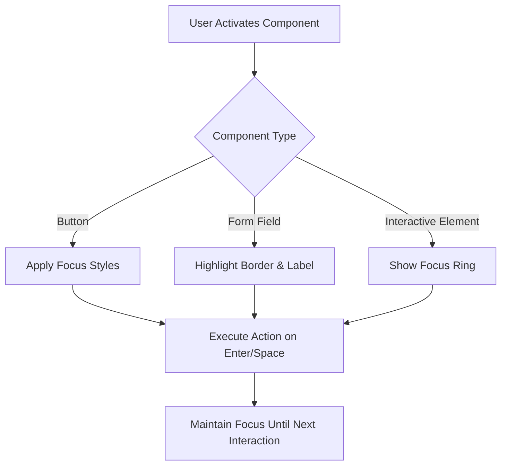
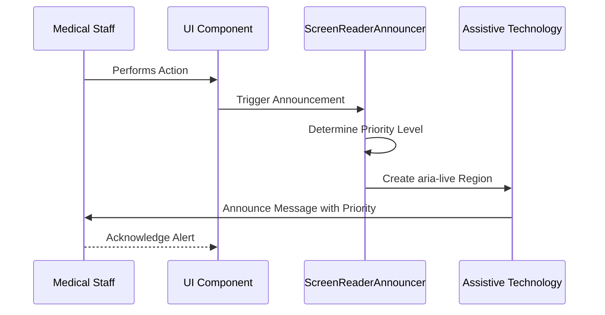
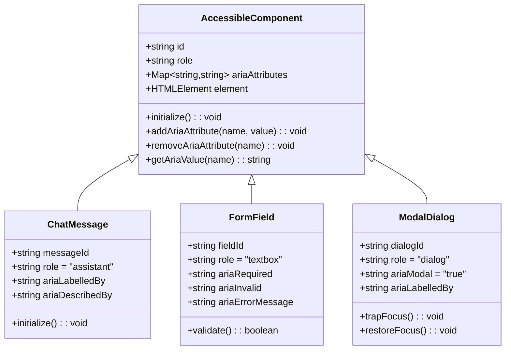
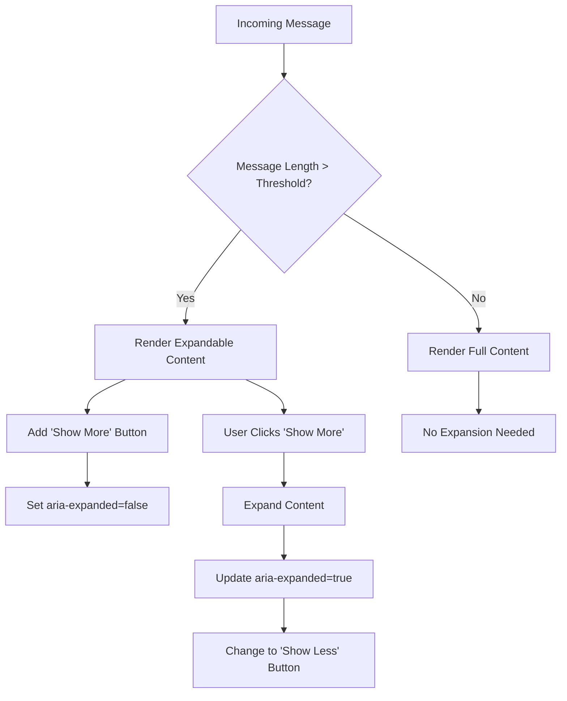
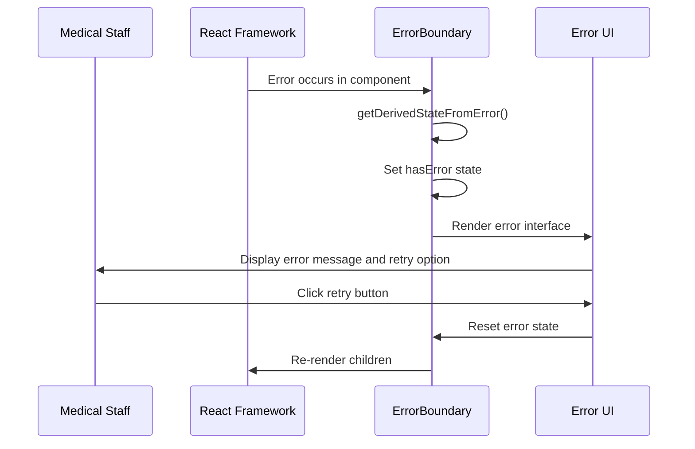
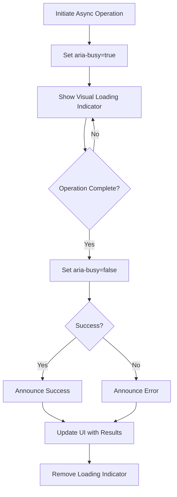
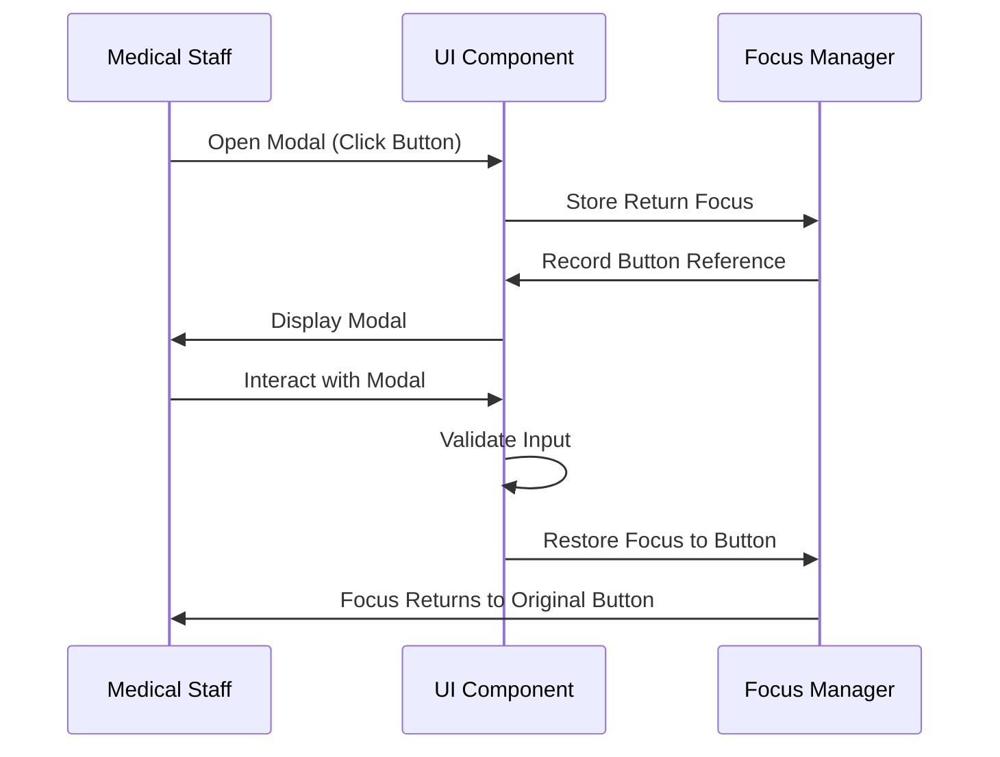
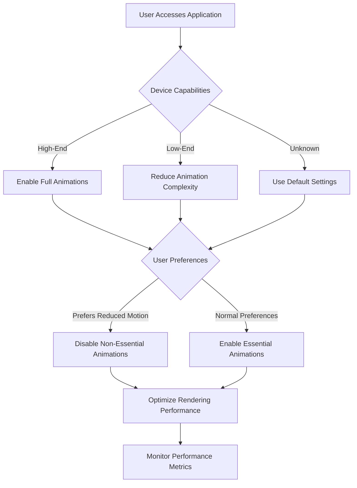

# Accessibility Features

<cite>
**Referenced Files in This Document**
- [NeonProChatProvider.tsx](file://apps/web/src/components/chat/NeonProChatProvider.tsx)
- [ErrorBoundary.tsx](file://apps/web/src/components/ErrorBoundary.tsx)
- [ACCESSIBILITY_GUIDE.md](file://apps/web/src/components/chat/ACCESSIBILITY_GUIDE.md)
- [accessibility.css](file://apps/web/src/components/chat/accessibility.css)
- [accessibility.test.tsx](file://apps/web/src/components/chat/__tests__/accessibility.test.tsx)
- [ai-chat.spec.ts](file://tests/e2e/ai-chat.spec.ts)
- [useAnimationPerformance.ts](file://packages/ui/src/hooks/useAnimationPerformance.ts)
- [accessibility.ts](file://packages/ui/src/utils/accessibility.ts)
- [anvisa-compliance.ts](file://apps/api/src/services/anvisa-compliance.ts)
</cite>

## Table of Contents

1. [Introduction](#introduction)
2. [Core Accessibility Implementation](#core-accessibility-implementation)
3. [Keyboard Navigation Patterns](#keyboard-navigation-patterns)
4. [Screen Reader Support](#screen-reader-support)
5. [ARIA Attributes Usage](#aria-attributes-usage)
6. [Chat Accessibility Implementation](#chat-accessibility-implementation)
7. [Error Boundary Components](#error-boundary-components)
8. [Dynamic Content Updates](#dynamic-content-updates)
9. [Focus Management](#focus-management)
10. [Performance Considerations](#performance-considerations)
11. [WCAG Compliance for Healthcare Applications](#wcag-compliance-for-healthcare-applications)

## Introduction

The NeonPro frontend implements comprehensive accessibility features designed specifically for healthcare applications, following WCAG 2.1 AA+ guidelines. The system prioritizes accessibility for medical staff who may have various disabilities or work in challenging clinical environments. The implementation focuses on keyboard navigation, screen reader support, ARIA attributes, and cognitive accessibility to ensure that all users can effectively interact with the application.

The accessibility framework is built around several core principles: perceivability, operability, understandability, and robustness. These principles are implemented through semantic HTML, proper ARIA labeling, focus management, and compatibility with assistive technologies commonly used in healthcare settings.

**Section sources**

- [ACCESSIBILITY_GUIDE.md](file://apps/web/src/components/chat/ACCESSIBILITY_GUIDE.md#L0-L38)

## Core Accessibility Implementation

The NeonPro frontend implements a comprehensive accessibility framework that addresses multiple aspects of accessible design for healthcare applications. The implementation follows WCAG 2.1 AA+ guidelines and includes support for screen readers, keyboard navigation, high contrast themes, reduced motion preferences, text resizing, and cognitive accessibility features.

Key implementation areas include:

- **Screen reader support**: Implementation of ARIA labels, live regions, and semantic HTML structure
- **Keyboard navigation**: Comprehensive keyboard support with proper focus management and keyboard shortcuts
- **High contrast mode**: Support for high contrast themes that meet medical display requirements
- **Reduced motion**: Respect for user preferences regarding animations and transitions
- **Text sizing**: Support for text resizing up to 200% without loss of functionality
- **Cognitive accessibility**: Clear instructions, consistent navigation patterns, and accessible error handling

The system also implements specific healthcare-focused accessibility features such as emergency mode alerts, patient data visibility controls, and medical-specific keyboard shortcuts that cater to the unique needs of medical professionals.

**Section sources**

- [ACCESSIBILITY_GUIDE.md](file://apps/web/src/components/chat/ACCESSIBILITY_GUIDE.md#L38-L111)
- [accessibility.css](file://apps/web/src/components/chat/accessibility.css#L0-L1085)

## Keyboard Navigation Patterns

The NeonPro frontend implements comprehensive keyboard navigation patterns that enable full operability without requiring a mouse. These patterns follow WCAG 2.1 guidelines for keyboard accessibility and are specifically designed for healthcare workflows where medical staff may need to operate the system quickly and efficiently.

Key keyboard navigation features include:

### Focus Management

The system implements proper focus management with visible focus indicators that meet minimum contrast requirements. Focusable elements include buttons, form controls, links, and interactive components. The focus order follows the logical reading order of the content, ensuring predictable navigation.



**Diagram sources**

- [accessibility.css](file://apps/web/src/components/chat/accessibility.css#L425-L521)
- [accessibility.test.tsx](file://apps/web/src/components/chat/__tests__/accessibility.test.tsx#L93-L136)

### Keyboard Shortcuts

The system implements healthcare-specific keyboard shortcuts for common actions:

- **Ctrl+Enter**: Submit form or message
- **Escape**: Cancel current operation or close modal
- **F2**: Edit selected field
- **Alt+E**: Activate emergency mode
- **Alt+P**: Navigate to patient data
- **Alt+M**: Navigate to medical history
- **Tab/Shift+Tab**: Navigate between focusable elements
- **Arrow keys**: Navigate within component groups

These shortcuts are designed to minimize hand movement and enable rapid data entry in clinical settings.

### Focus Trapping

Modal dialogs and emergency alerts implement focus trapping to prevent keyboard users from accidentally navigating outside the active component. When a modal is open, the tab key cycles only through the focusable elements within the modal, returning to the first element after the last.

**Section sources**

- [accessibility.ts](file://packages/ui/src/utils/accessibility.ts#L86-L134)
- [accessibility.test.tsx](file://apps/web/src/components/chat/__tests__/accessibility.test.tsx#L208-L248)

## Screen Reader Support

The NeonPro frontend provides comprehensive support for screen readers used by medical staff, ensuring that all information and functionality is accessible to users who rely on assistive technologies. The implementation follows WAI-ARIA best practices and includes specific features for healthcare applications.

### ARIA Live Regions

The system uses ARIA live regions to announce dynamic content updates to screen readers. Different priority levels are used based on the medical context:

- **Polite announcements**: For routine messages and status updates
- **Assertive announcements**: For critical alerts and emergency notifications
- **Emergency prefix**: "ALERTA MÉDICO:" prefix for life-critical alerts



**Diagram sources**

- [accessibility.ts](file://packages/ui/src/utils/accessibility.ts#L38-L84)
- [accessibility.test.tsx](file://apps/web/src/components/chat/__tests__/accessibility.test.tsx#L290-L336)

### Semantic HTML Structure

The interface uses proper semantic HTML elements to convey document structure to screen readers:

- `<main>` landmark for primary content
- `<nav>` for navigation sections
- `<article>` for chat messages and medical records
- `<section>` for content grouping
- `<header>` and `<footer>` for page organization

Each landmark has an appropriate `aria-label` to help screen reader users understand the purpose of each section.

### Screen Reader-Specific Features

The system includes several features specifically designed for screen reader users in healthcare settings:

- **Medical terminology support**: Proper pronunciation of medical terms
- **Patient data formatting**: Structured presentation of patient information
- **Emergency alerts**: Distinctive audio cues for critical situations
- **Workflow guidance**: Verbal instructions for complex procedures

**Section sources**

- [accessibility.ts](file://packages/ui/src/utils/accessibility.ts#L0-L36)
- [ai-chat.spec.ts](file://tests/e2e/ai-chat.spec.ts#L425-L458)

## ARIA Attributes Usage

The NeonPro frontend extensively uses ARIA (Accessible Rich Internet Applications) attributes to enhance accessibility and provide additional context to assistive technologies. The implementation follows WAI-ARIA 1.1 specifications and is tailored for healthcare applications.

### Core ARIA Implementation

#### Roles and Properties

The system implements appropriate ARIA roles and properties for all interactive components:

- **Landmark roles**: `main`, `navigation`, `complementary`, `contentinfo`
- **Widget roles**: `button`, `checkbox`, `radio`, `tab`, `tabpanel`
- **Document structure**: `heading`, `paragraph`, `list`, `listitem`
- **Live regions**: `alert`, `status`, `log`, `marquee`, `timer`



**Diagram sources**

- [accessibility.test.tsx](file://apps/web/src/components/chat/__tests__/accessibility.test.tsx#L51-L91)
- [accessibility.css](file://apps/web/src/components/chat/accessibility.css#L425-L521)

#### State Management

Dynamic ARIA states are updated in response to user interactions and system events:

- `aria-expanded`: Indicates whether expandable content is currently expanded
- `aria-selected`: Indicates selection state for tabular or list items
- `aria-checked`: Indicates checked state for checkboxes and radio buttons
- `aria-busy`: Indicates when an element is loading or processing
- `aria-disabled`: Indicates disabled state for interactive elements

### Healthcare-Specific ARIA Patterns

#### Patient Data Disclosure

When displaying sensitive patient information, the system uses ARIA attributes to control disclosure:

```tsx
<div
  role='region'
  aria-label='Patient Information'
  aria-describedby='pii-warning'
  data-sensitivity='high'
>
  {/* Patient data content */}
</div>;
```

#### Clinical Workflow Indicators

ARIA attributes are used to indicate the state of clinical workflows:

- `aria-current="step"`: Highlights the current step in a multi-step process
- `aria-required="true"`: Marks mandatory fields in medical forms
- `aria-invalid="grammar"`: Indicates potential errors in medical documentation

**Section sources**

- [accessibility.test.tsx](file://apps/web/src/components/chat/__tests__/accessibility.test.tsx#L290-L336)
- [accessibility.css](file://apps/web/src/components/chat/accessibility.css#L425-L521)

## Chat Accessibility Implementation

The NeonPro chat interface implements comprehensive accessibility features that follow WCAG 2.1 AA+ guidelines for healthcare applications. The implementation ensures that all users, including those with disabilities, can effectively communicate through the chat system.

### AccessibleChatMessage Component

The `AccessibleChatMessage` component is designed with multiple accessibility features:

- **Semantic structure**: Uses `<article>` element with appropriate ARIA labels
- **Keyboard navigation**: All action buttons are focusable and operable via keyboard
- **Content expansion**: Long messages can be expanded/collapsed with proper ARIA states
- **Action accessibility**: Copy, speak, and report actions are available via keyboard



**Diagram sources**

- [accessibility.test.tsx](file://apps/web/src/components/chat/__tests__/accessibility.test.tsx#L93-L136)
- [ACCESSIBILITY_GUIDE.md](file://apps/web/src/components/chat/ACCESSIBILITY_GUIDE.md#L40-L111)

### Accessibility Settings Panel

The `AccessibilitySettingsPanel` provides users with control over accessibility features:

- **High contrast mode**: Toggle for improved color contrast
- **Text size adjustment**: Options for small, medium, large, and extra-large text
- **Motion reduction**: Option to reduce or disable animations
- **Keyboard navigation mode**: Enhanced focus indicators for keyboard users

The panel itself is fully accessible, with proper ARIA attributes and keyboard navigation support.

### Performance Optimization

The chat accessibility implementation includes performance optimizations to ensure responsiveness:

- **Virtualized rendering**: Only visible messages are rendered to the DOM
- **Debounced updates**: Rapid successive updates are batched to prevent overwhelming screen readers
- **Efficient re-renders**: React memoization prevents unnecessary component updates
- **Lazy loading**: Large media content is loaded on demand

**Section sources**

- [NeonProChatProvider.tsx](file://apps/web/src/components/chat/NeonProChatProvider.tsx#L65-L279)
- [accessibility.test.tsx](file://apps/web/src/components/chat/__tests__/accessibility.test.tsx#L338-L384)

## Error Boundary Components

The NeonPro frontend implements accessible error boundary components that provide clear, actionable feedback when errors occur. These components follow WCAG guidelines for error handling and are designed to maintain usability even in error states.

### ErrorBoundary Implementation

The `ErrorBoundary` component catches JavaScript errors in the component tree and displays a user-friendly error interface:

```tsx
export class ErrorBoundary extends React.Component<
  ErrorBoundaryProps,
  ErrorBoundaryState
> {
  constructor(props: ErrorBoundaryProps) {
    super(props);
    this.state = { hasError: false };
  }

  static getDerivedStateFromError(error: Error): ErrorBoundaryState {
    return { hasError: true, error };
  }

  componentDidCatch(error: Error, errorInfo: React.ErrorInfo) {
    console.error('Error caught by boundary:', error, errorInfo);
  }

  render() {
    if (this.state.hasError) {
      return (
        <div className='min-h-screen flex items-center justify-center bg-gray-50'>
          <div className='max-w-md w-full bg-white shadow-lg rounded-lg p-6 text-center'>
            <div className='mx-auto h-12 w-12 bg-red-100 rounded-full flex items-center justify-center mb-4'>
              <AlertTriangle className='h-6 w-6 text-red-600' />
            </div>
            <h2 className='text-xl font-bold text-gray-900 mb-2'>
              Oops! Something went wrong
            </h2>
            <p className='text-gray-600 mb-6'>
              {this.state.error?.message
                || 'An unexpected error occurred. Please try again.'}
            </p>
            <button
              onClick={() => {
                this.setState({ hasError: false, error: undefined });
                window.location.reload();
              }}
              className='inline-flex items-center px-4 py-2 bg-blue-600 text-white rounded-md hover:bg-blue-700 focus:outline-none focus:ring-2 focus:ring-blue-500 focus:ring-offset-2'
            >
              <RefreshCw className='h-4 w-4 mr-2' />
              Try again
            </button>
          </div>
        </div>
      );
    }

    return this.props.children;
  }
}
```

### Accessibility Features of Error Handling

#### Visual Design

- **High contrast colors**: Error state uses high contrast color scheme for visibility
- **Clear iconography**: Warning triangle icon provides visual cue
- **Sufficient text size**: Error message is readable at standard zoom levels
- **Focus management**: Focus is automatically set to the retry button

#### Screen Reader Support

- **Role alert**: Error container has `role="alert"` for immediate announcement
- **Descriptive text**: Error message clearly explains the problem and solution
- **Actionable instructions**: Users are told exactly what to do to resolve the issue
- **Retry mechanism**: Single button to retry the operation



**Diagram sources**

- [ErrorBoundary.tsx](file://apps/web/src/components/ErrorBoundary.tsx#L0-L72)

**Section sources**

- [ErrorBoundary.tsx](file://apps/web/src/components/ErrorBoundary.tsx#L0-L72)

## Dynamic Content Updates

The NeonPro frontend handles dynamic content updates in a way that is accessible to all users, particularly those using screen readers. The system ensures that changes to the interface are properly announced and do not disrupt the user's workflow.

### Live Regions for Chat Messages

When new chat messages arrive, the system uses ARIA live regions to announce them to screen readers:

```tsx
<ScreenReaderAnnouncer
  message='New message received from patient'
  priority='polite'
  timeout={5000}
/>;
```

The implementation includes several key features:

- **Priority-based announcements**: Critical medical alerts use assertive priority, while routine messages use polite priority
- **Contextual prefixes**: Emergency alerts include "MEDICAL ALERT:" prefix
- **Timeout management**: Announcements are automatically removed after a specified time
- **Duplicate prevention**: Identical messages are not announced multiple times

### Asynchronous Operation Handling

When performing asynchronous operations such as API calls or data processing, the system provides appropriate feedback:

#### Loading States

- **Visual indicators**: Spinner or progress bar shows operation progress
- **ARIA busy state**: Elements set `aria-busy="true"` during loading
- **Screen reader announcements**: "Loading..." or "Processing..." messages are announced

#### Success and Error States

- **Success announcements**: "Operation completed successfully" with relevant details
- **Error announcements**: Clear description of the error and suggested actions
- **Status persistence**: Important status messages remain until acknowledged



**Diagram sources**

- [accessibility.test.tsx](file://apps/web/src/components/chat/__tests__/accessibility.test.tsx#L208-L248)
- [accessibility.ts](file://packages/ui/src/utils/accessibility.ts#L38-L84)

**Section sources**

- [NeonProChatProvider.tsx](file://apps/web/src/components/chat/NeonProChatProvider.tsx#L65-L279)
- [accessibility.test.tsx](file://apps/web/src/components/chat/__tests__/accessibility.test.tsx#L208-L248)

## Focus Management

Effective focus management is critical for keyboard accessibility in the NeonPro frontend. The system implements comprehensive focus management strategies to ensure that keyboard users can navigate the interface efficiently and predictably.

### Focus Indicators

The system provides highly visible focus indicators that meet WCAG 2.1 requirements:

- **Outline styling**: 3px solid blue outline with 2px offset
- **High contrast**: Focus indicator contrasts well with all background colors
- **Consistent appearance**: Same focus style across all components
- **No removal**: Focus outlines are never removed via CSS

```css
*:focus,
*:focus-visible {
  outline: 3px solid #2563eb !important;
  outline-offset: 2px !important;
  box-shadow: 0 0 0 2px #2563eb !important;
}
```

### Focus Trapping

Modal dialogs and emergency alerts implement focus trapping to prevent keyboard users from navigating outside the active component:

```tsx
export function useFocusTrap(isActive: boolean) {
  const containerRef = useRef<HTMLElement>(null);

  useEffect(() => {
    if (!isActive || !containerRef.current) return;

    const container = containerRef.current;
    const focusableElements = container.querySelectorAll(
      'button, [href], input, select, textarea, [tabindex]:not([tabindex="-1"])',
    );

    const firstElement = focusableElements[0] as HTMLElement;
    const lastElement = focusableElements[
      focusableElements.length - 1
    ] as HTMLElement;

    function handleTabKey(event: KeyboardEvent) {
      if (event.key !== 'Tab') return;

      if (event.shiftKey) {
        if (document.activeElement === firstElement) {
          event.preventDefault();
          lastElement?.focus();
        }
      } else {
        if (document.activeElement === lastElement) {
          event.preventDefault();
          firstElement?.focus();
        }
      }
    }

    container.addEventListener('keydown', handleTabKey);
    return () => container.removeEventListener('keydown', handleTabKey);
  }, [isActive]);
}
```

### Focus Restoration

After dismissing modal dialogs or completing operations, the system restores focus to the appropriate element:

- **Return to trigger**: Focus returns to the button that opened the modal
- **Sequential flow**: In multi-step processes, focus moves to the next logical element
- **Error recovery**: When form validation fails, focus moves to the first invalid field



**Diagram sources**

- [accessibility.ts](file://packages/ui/src/utils/accessibility.ts#L86-L134)
- [accessibility.test.tsx](file://apps/web/src/components/chat/__tests__/accessibility.test.tsx#L208-L248)

**Section sources**

- [accessibility.ts](file://packages/ui/src/utils/accessibility.ts#L86-L134)
- [ErrorBoundary.tsx](file://apps/web/src/components/ErrorBoundary.tsx#L25-L72)

## Performance Considerations

Accessibility enhancements in the NeonPro frontend are implemented with careful consideration of performance implications. The system balances accessibility requirements with rendering performance to ensure a responsive experience for all users, including those on lower-end devices commonly found in healthcare settings.

### Animation Performance

The system adapts animation performance based on device capabilities and user preferences:

```tsx
const generatePerformanceSettings = (
  capabilities: DeviceCapabilities,
): PerformanceSettings => {
  const { isLowEnd, prefersReducedMotion, isMobile, hasGPU, cpuPower } = capabilities;

  // Disable animations if user prefers reduced motion
  if (prefersReducedMotion) {
    return {
      enableAnimations: false,
      reduceComplexity: true,
      useSimpleFallbacks: true,
      targetFPS: 30,
      debounceMs: 100,
      useHardwareAcceleration: false,
      maxConcurrentAnimations: 1,
    };
  }

  // Low-end device settings
  if (isLowEnd) {
    return {
      enableAnimations: true,
      reduceComplexity: true,
      useSimpleFallbacks: true,
      targetFPS: 30,
      debounceMs: 32, // ~30fps
      useHardwareAcceleration: hasGPU,
      maxConcurrentAnimations: 2,
    };
  }
};
```

### Rendering Optimization

Several strategies are employed to maintain performance while providing accessibility features:

#### Virtualized Lists

Long lists of chat messages are virtualized to render only visible items, reducing DOM size and improving scroll performance.

#### Debounced Updates

Rapid successive updates to screen reader announcements are debounced to prevent overwhelming assistive technologies.

#### Efficient Re-renders

React's memoization and shouldComponentUpdate are used to prevent unnecessary re-renders of accessible components.

#### Conditional Feature Loading

Advanced accessibility features are loaded conditionally based on user needs and device capabilities.



**Diagram sources**

- [useAnimationPerformance.ts](file://packages/ui/src/hooks/useAnimationPerformance.ts#L154-L206)
- [accessibility.test.tsx](file://apps/web/src/components/chat/__tests__/accessibility.test.tsx#L338-L384)

**Section sources**

- [useAnimationPerformance.ts](file://packages/ui/src/hooks/useAnimationPerformance.ts#L154-L206)
- [accessibility.test.tsx](file://apps/web/src/components/chat/__tests__/accessibility.test.tsx#L338-L384)

## WCAG Compliance for Healthcare Applications

The NeonPro frontend achieves WCAG 2.1 AA+ compliance with specific considerations for healthcare applications. The implementation goes beyond basic compliance to address the unique requirements of medical software and clinical environments.

### ANVISA Compliance Requirements

The system meets Brazilian health regulatory requirements through specific accessibility implementations:

```tsx
// Check for missing professional accessibility features
if (!professionalAccessibility) {
  issues.push({
    id: 'missing-professional-accessibility',
    requirement: ANVISA_REQUIREMENTS.ACCESSIBILITY,
    severity: 'high',
    title: 'Missing professional accessibility features',
    description: 'System does not meet accessibility requirements for healthcare professionals',
    recommendation: 'Implement accessibility features specific to healthcare professionals',
    affectedComponents: ['user_interface', 'navigation', 'forms'],
    anvisaReference: 'RDC 185/2001 - Accessibility',
    remediation: {
      steps: [
        'Implement keyboard navigation for clinical workflows',
        'Add support for assistive technologies',
        'Create keyboard shortcuts for critical functions',
        'Implement auditory feedback for critical alerts',
      ],
      timeframe: '60 days',
      responsible: 'Development Team',
      cost: 'medium',
    },
    detectedAt: new Date(),
  });
}
```

### Healthcare-Specific Accessibility Features

#### Emergency Mode

A dedicated emergency mode enhances accessibility during critical situations:

- High contrast color scheme
- Simplified interface with essential functions only
- Auditory alerts for critical notifications
- Large touch targets for gloved hands

#### Medical Workflow Optimization

Accessibility features are optimized for common medical workflows:

- **Patient intake**: Streamlined form filling with predictive text
- **Medication administration**: Double-check mechanisms with audible confirmation
- **Diagnostic reporting**: Structured data entry with validation
- **Emergency response**: One-touch activation of emergency protocols

#### Multilingual Support

The system supports multiple languages with attention to accessibility:

- Proper language tagging for screen readers
- Culturally appropriate icons and symbols
- Right-to-left language support
- Translation of accessibility hints and instructions

### Compliance Verification

The system includes automated checks to verify ongoing compliance:

- Regular accessibility audits using axe-core
- Integration with CI/CD pipeline for automated testing
- Manual testing with actual assistive technologies
- User feedback collection from medical staff with disabilities

**Section sources**

- [anvisa-compliance.ts](file://apps/api/src/services/anvisa-compliance.ts#L190-L259)
- [ACCESSIBILITY_GUIDE.md](file://apps/web/src/components/chat/ACCESSIBILITY_GUIDE.md#L241-L268)
