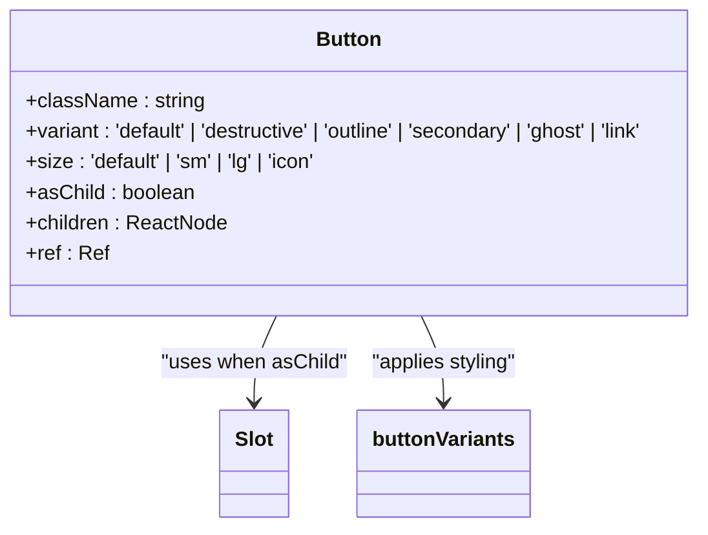
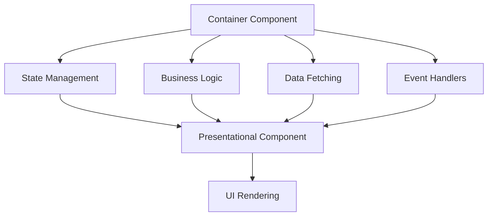
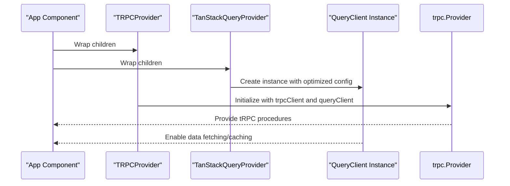
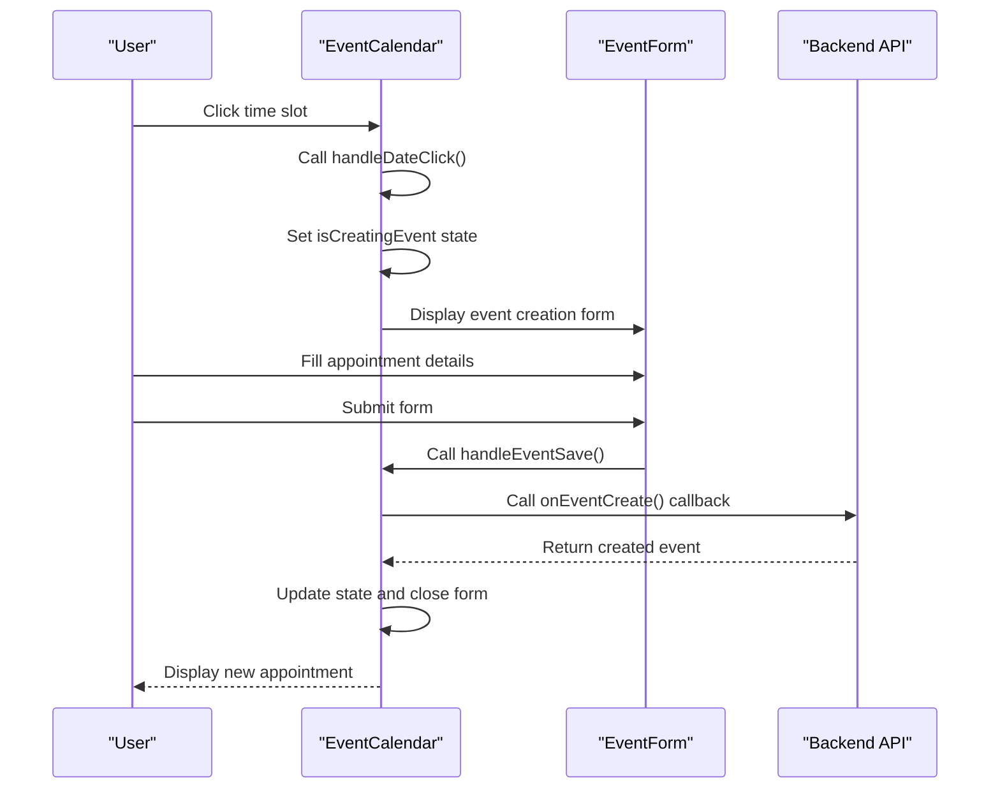
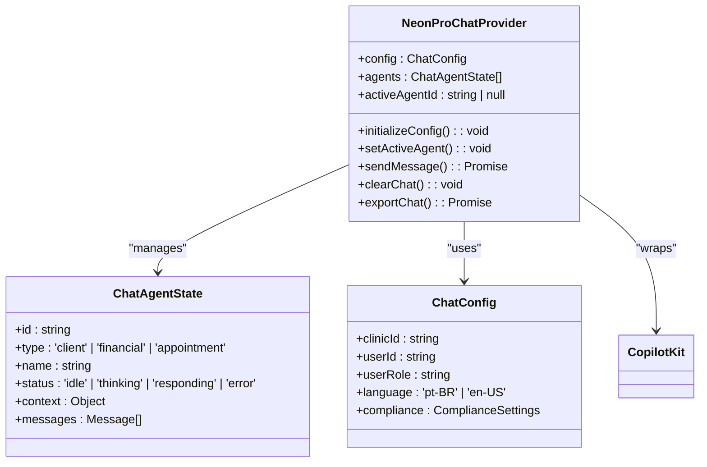
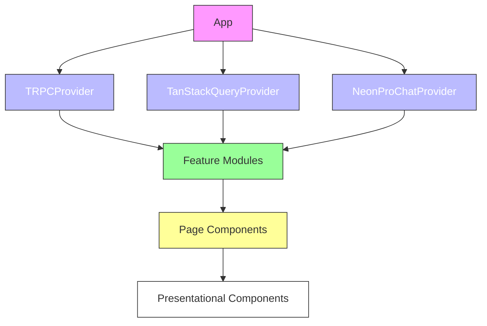

# Component Hierarchy

<cite>
**Referenced Files in This Document**
- [EventCalendar.tsx](file://apps/web/src/components/event-calendar/EventCalendar.tsx)
- [NeonProChatProvider.tsx](file://apps/web/src/components/chat/NeonProChatProvider.tsx)
- [TRPCProvider.tsx](file://apps/web/src/components/providers/TRPCProvider.tsx)
- [TanStackQueryProvider.tsx](file://apps/web/src/components/providers/TanStackQueryProvider.tsx)
- [button.tsx](file://apps/web/src/components/ui/button.tsx)
</cite>

## Table of Contents

1. [Introduction](#introduction)
2. [Core UI Components](#core-ui-components)
3. [Component Composition Patterns](#component-composition-patterns)
4. [Provider Wrappers and State Management](#provider-wrappers-and-state-management)
5. [Event Calendar Implementation](#event-calendar-implementation)
6. [Patient Scheduling Example](#patient-scheduling-example)
7. [Dashboard Integration](#dashboard-integration)
8. [Prop Drilling Solutions](#prop-drilling-solutions)
9. [Conclusion](#conclusion)

## Introduction

This document provides a comprehensive analysis of the component hierarchy in the neonpro frontend application, focusing on key UI components including buttons, calendars, and provider wrappers. The documentation explains how these components are structured, composed, and integrated within patient scheduling and dashboard views. Special attention is given to implementation details, props/attributes, event handling patterns, and solutions to common issues like prop drilling through context and state management systems.

## Core UI Components

The neonpro frontend implements a robust set of reusable UI components that follow modern React patterns and accessibility standards. These components serve as the building blocks for higher-level interfaces across the application.

### Button Component

The Button component is implemented as a polymorphic component that can render as either a native button or any other element via the `asChild` prop. It uses the `class-variance-authority` (cva) pattern to manage variant styles and supports multiple predefined variants including default, destructive, outline, secondary, ghost, and link.

**Diagram sources**

- [button.tsx](file://apps/web/src/components/ui/button.tsx#L41-L52)

**Section sources**

- [button.tsx](file://apps/web/src/components/ui/button.tsx#L41-L52)

## Component Composition Patterns

The application follows composition over inheritance principles, allowing components to be flexibly combined to create complex interfaces. This section examines how presentational and container components work together.

### Presentational vs Container Components

Presentational components focus on how things look and are typically pure functions of their props. Container components manage state and behavior, providing data and callbacks to presentational components. The EventCalendar serves as a prime example of this pattern, where it manages calendar state while delegating rendering to view components (DayView, WeekView, MonthView).

**Diagram sources**

- [EventCalendar.tsx](file://apps/web/src/components/event-calendar/EventCalendar.tsx#L21-L239)

**Section sources**

- [EventCalendar.tsx](file://apps/web/src/components/event-calendar/EventCalendar.tsx#L21-L239)

## Provider Wrappers and State Management

The application utilizes several provider components to manage global state and dependencies, avoiding prop drilling through context-based solutions.

### TRPC and TanStack Query Providers

The TRPCProvider and TanStackQueryProvider components establish the data fetching layer for the application. They provide shared clients and query caches to all child components, enabling efficient data synchronization and caching.

**Diagram sources**

- [TRPCProvider.tsx](file://apps/web/src/components/providers/TRPCProvider.tsx#L8-L15)
- [TanStackQueryProvider.tsx](file://apps/web/src/components/providers/TanStackQueryProvider.tsx#L35-L45)

**Section sources**

- [TRPCProvider.tsx](file://apps/web/src/components/providers/TRPCProvider.tsx#L8-L15)
- [TanStackQueryProvider.tsx](file://apps/web/src/components/providers/TanStackQueryProvider.tsx#L35-L45)

## Event Calendar Implementation

The EventCalendar component represents a sophisticated calendar system designed for healthcare scheduling with multiple view modes and filtering capabilities.

### Calendar Component Props

The EventCalendar accepts several props that control its behavior and appearance:

| Prop Name       | Type                         | Description                                   | Required |
| --------------- | ---------------------------- | --------------------------------------------- | -------- |
| events          | CalendarEvent[]              | Array of calendar events to display           | Yes      |
| view            | CalendarView                 | Initial view configuration (day, week, month) | No       |
| filters         | CalendarFilters              | Filter criteria for events                    | No       |
| onEventClick    | Function                     | Callback when an event is clicked             | No       |
| onDateChange    | Function                     | Callback when current date changes            | No       |
| onViewChange    | Function                     | Callback when view type changes               | No       |
| onEventCreate   | Function                     | Callback to create new events                 | No       |
| onEventUpdate   | Function                     | Callback to update existing events            | No       |
| onEventDelete   | Function                     | Callback to delete events                     | No       |
| isLoading       | boolean                      | Loading state indicator                       | No       |
| workingHours    | {start: number, end: number} | Business hours for day/week views             | No       |
| intervalMinutes | number                       | Time slot interval in minutes                 | No       |

### State Management

The component maintains internal state using React's useState hook, managing:

- Current date navigation
- Active view mode
- Selected event
- Event creation state
- Filter settings
- Loading status

The state transitions are handled through useCallback memoized functions to prevent unnecessary re-renders.

**Section sources**

- [EventCalendar.tsx](file://apps/web/src/components/event-calendar/EventCalendar.tsx#L21-L239)

## Patient Scheduling Example

The EventCalendar component is used extensively in patient scheduling interfaces, demonstrating practical implementation of the component hierarchy.

### Scheduling Workflow

When a user clicks on a time slot in the calendar, the following sequence occurs:

The component handles both creation and editing of appointments through the same form interface, with the presence of an event ID determining whether it's creating a new appointment or updating an existing one.

**Section sources**

- [EventCalendar.tsx](file://apps/web/src/components/event-calendar/EventCalendar.tsx#L21-L239)

## Dashboard Integration

The NeonProChatProvider demonstrates how provider wrappers integrate with dashboard views to deliver AI-powered assistance.

### Chat Provider Implementation

The NeonProChatProvider establishes a multi-agent chat system specifically designed for healthcare applications with LGPD compliance features.

**Diagram sources**

- [NeonProChatProvider.tsx](file://apps/web/src/components/chat/NeonProChatProvider.tsx#L65-L279)

**Section sources**

- [NeonProChatProvider.tsx](file://apps/web/src/components/chat/NeonProChatProvider.tsx#L65-L279)

## Prop Drilling Solutions

The application addresses prop drilling through strategic use of React Context and provider patterns, ensuring clean component interfaces.

### Context-Based State Management

Instead of passing props through multiple component layers, the application uses context providers at appropriate levels of the component tree:

The EventCalendar component exemplifies this approach by accepting callback props for data operations rather than the data itself, allowing parent components to manage data fetching concerns through the established provider context.

**Section sources**

- [EventCalendar.tsx](file://apps/web/src/components/event-calendar/EventCalendar.tsx#L21-L239)
- [NeonProChatProvider.tsx](file://apps/web/src/components/chat/NeonProChatProvider.tsx#L65-L279)

## Conclusion

The neonpro frontend demonstrates a well-structured component hierarchy that effectively separates concerns between presentational and container components. Key UI elements like buttons and calendars are implemented with flexibility and accessibility in mind, while provider wrappers solve prop drilling issues through context-based state management. The EventCalendar component showcases sophisticated state management and composition patterns, serving as a central interface for patient scheduling. Meanwhile, the NeonProChatProvider illustrates how specialized provider components can deliver domain-specific functionality with compliance considerations. These patterns enable the creation of maintainable, scalable interfaces that support both simple interactions and complex workflows in healthcare applications.
