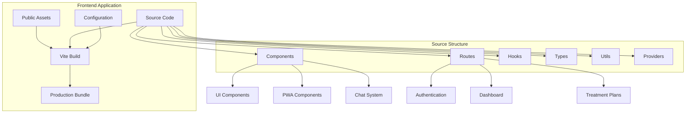
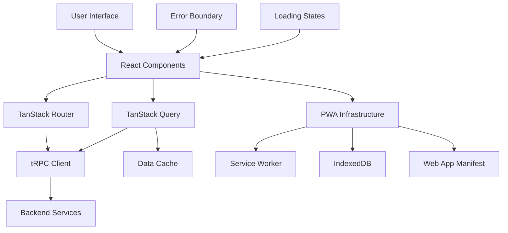
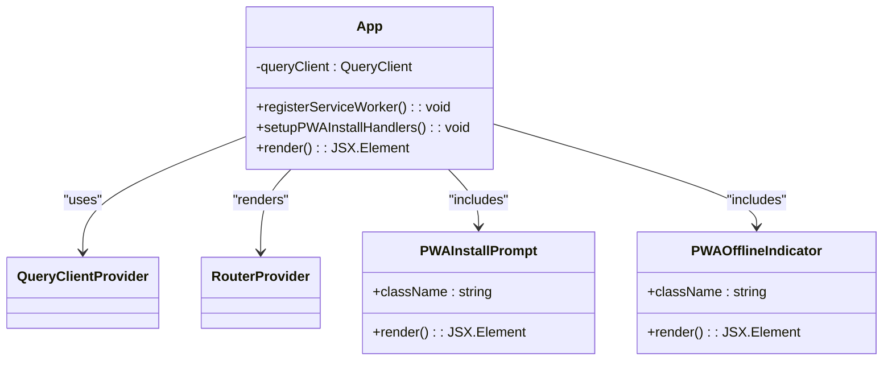
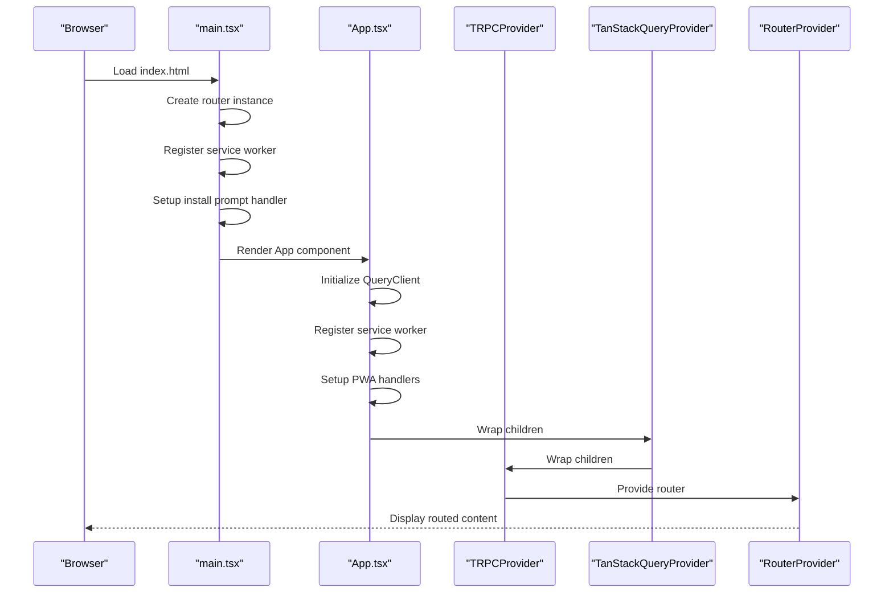
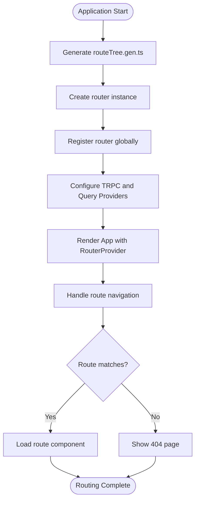

# Frontend Architecture

<cite>
**Referenced Files in This Document **
- [App.tsx](file://apps/web/src/App.tsx)
- [main.tsx](file://apps/web/src/main.tsx)
- [routeTree.gen.ts](file://apps/web/src/routeTree.gen.ts)
- [router.ts](file://apps/web/src/router.ts)
- [vite.config.ts](file://apps/web/vite.config.ts)
- [TRPCProvider.tsx](file://apps/web/src/components/providers/TRPCProvider.tsx)
- [TanStackQueryProvider.tsx](file://apps/web/src/components/providers/TanStackQueryProvider.tsx)
- [ErrorBoundary.tsx](file://apps/web/src/components/ErrorBoundary.tsx)
- [PWAInstallPrompt.tsx](file://apps/web/src/components/pwa/PWAInstallPrompt.tsx)
- [usePWA.ts](file://apps/web/src/hooks/usePWA.ts)
</cite>

## Table of Contents

1. [Introduction](#introduction)
2. [Project Structure](#project-structure)
3. [Core Components](#core-components)
4. [Architecture Overview](#architecture-overview)
5. [Detailed Component Analysis](#detailed-component-analysis)
6. [Dependency Analysis](#dependency-analysis)
7. [Performance Considerations](#performance-considerations)
8. [Troubleshooting Guide](#troubleshooting-guide)
9. [Conclusion](#conclusion)

## Introduction

The NeonPro frontend application is a modern React-based platform built with Vite as the build tool, designed to deliver a high-performance, accessible, and compliant user experience for healthcare management. The architecture follows a component-based design pattern with a robust routing system powered by TanStack Router through the generated routeTree.gen.ts file. Built with TypeScript, the application ensures type safety across all layers while integrating seamlessly with backend services via tRPC and REST APIs. The frontend supports Progressive Web App (PWA) capabilities, enabling offline functionality and device installation. This document provides a comprehensive overview of the frontend architecture, detailing its technology stack, component structure, state management, error handling, accessibility compliance, and build configuration.

## Project Structure

The frontend application resides within the `/apps/web` directory and follows a modular structure that separates concerns across components, routes, hooks, and utilities. The source code is organized under `/src` with dedicated folders for components, routes, hooks, types, and integration-specific modules. The routing configuration is automatically generated into `routeTree.gen.ts`, while the main application entry points are defined in `main.tsx` and `App.tsx`. The build process is configured through `vite.config.ts`, which sets up aliases, optimization dependencies, and development server settings. The project leverages a monorepo structure with shared packages for UI components, analytics, and domain models, ensuring consistency across different applications within the NeonPro platform.



**Diagram sources **

- [main.tsx](file://apps/web/src/main.tsx#L1-L98)
- [vite.config.ts](file://apps/web/vite.config.ts#L1-L53)

**Section sources**

- [main.tsx](file://apps/web/src/main.tsx#L1-L98)
- [vite.config.ts](file://apps/web/vite.config.ts#L1-L53)

## Core Components

The core components of the NeonPro frontend include the main application shell (`App.tsx`), the routing system (`router.ts` and `routeTree.gen.ts`), state providers (`TanStackQueryProvider` and `TRPCProvider`), and PWA integration modules. These components work together to provide a cohesive user experience with proper state management, data fetching, and offline capabilities. The application uses ErrorBoundary for graceful error handling and LoadingSpinner for visual feedback during asynchronous operations. The component architecture emphasizes reusability and separation of concerns, with atomic components composed into larger functional units.

**Section sources**

- [App.tsx](file://apps/web/src/App.tsx#L1-L95)
- [components](file://apps/web/src/components#L1-L100)

## Architecture Overview

The NeonPro frontend architecture is built around React with TypeScript, using Vite for fast development builds and optimized production output. The routing system is implemented using TanStack Router, which generates type-safe routes in `routeTree.gen.ts` based on the file structure under `/routes`. This enables automatic route discovery and compile-time type checking for navigation. The application integrates with backend services through tRPC, providing end-to-end type safety from API endpoints to client consumption. State management is handled by TanStack Query (React Query) for server state, while React's built-in context and useState are used for local component state. The architecture supports PWA features including service workers, offline caching, and install prompts, making it suitable for clinical environments with intermittent connectivity.



**Diagram sources **

- [App.tsx](file://apps/web/src/App.tsx#L1-L95)
- [main.tsx](file://apps/web/src/main.tsx#L1-L98)
- [routeTree.gen.ts](file://apps/web/src/routeTree.gen.ts#L1-L113)

## Detailed Component Analysis

### Application Shell Analysis

The `App.tsx` component serves as the root container for the entire application, wrapping all other components with necessary providers and setting up global event listeners. It initializes the QueryClient for TanStack Query with default options that optimize performance by setting staleTime and disabling refetching on window focus. The component also handles PWA lifecycle events, registering the service worker and setting up beforeinstallprompt and appinstalled event listeners. Online/offline status is monitored and broadcast through custom events, allowing other components to respond appropriately to network changes.

#### For Object-Oriented Components:



**Diagram sources **

- [App.tsx](file://apps/web/src/App.tsx#L1-L95)

#### For API/Service Components:



**Diagram sources **

- [main.tsx](file://apps/web/src/main.tsx#L1-L98)
- [App.tsx](file://apps/web/src/App.tsx#L1-L95)

### Routing System Analysis

The routing system is implemented using TanStack Router, which generates a type-safe route tree based on the file structure in the routes directory. The `routeTree.gen.ts` file contains the complete route configuration, defining paths, IDs, and parent-child relationships for all application routes. The `router.ts` file creates the actual router instance using this generated route tree and registers it with the framework. This approach provides autocompletion and type checking for route parameters and navigation, reducing runtime errors and improving developer experience.

#### For Complex Logic Components:



**Diagram sources **

- [routeTree.gen.ts](file://apps/web/src/routeTree.gen.ts#L1-L113)
- [router.ts](file://apps/web/src/router.ts#L1-L11)

**Section sources**

- [routeTree.gen.ts](file://apps/web/src/routeTree.gen.ts#L1-L113)
- [router.ts](file://apps/web/src/router.ts#L1-L11)

## Dependency Analysis

The frontend application has well-defined dependencies managed through the monorepo structure. Direct dependencies include React, ReactDOM, Vite, TanStack Router, TanStack Query, tRPC client, and various utility libraries like Zod for validation and Valibot for schema parsing. The application also depends on shared internal packages such as @neonpro/ui for consistent UI components, @neonpro/shared for common types and utilities, and @neonpro/analytics for tracking. The build process optimizes dependency loading by pre-bundling frequently used packages in the `optimizeDeps.include` array in vite.config.ts, which improves development server startup time and hot module replacement performance.

```mermaid
graph LR
A[NeonPro Web App] --> B[React & ReactDOM]
A --> C[Vite]
A --> D[TanStack Router]
A --> E[TanStack Query]
A --> F[tRPC Client]
A --> G[Zod]
A --> H[Valibot]
A --> I[Lucide Icons]
A --> J[Tailwind CSS]
A --> K[@neonpro/ui]
A --> L[@neonpro/shared]
A --> M[@neonpro/analytics]
A --> N[@neonpro/core-services]
```

**Diagram sources **

- [package.json](file://apps/web/package.json#L1-L50)
- [vite.config.ts](file://apps/web/vite.config.ts#L1-L53)

**Section sources**

- [vite.config.ts](file://apps/web/vite.config.ts#L1-L53)
- [package.json](file://apps/web/package.json#L1-L50)

## Performance Considerations

The frontend implementation incorporates several performance optimization techniques to ensure responsive user experiences even in resource-constrained clinical environments. The Vite configuration includes code splitting and lazy loading through dynamic imports, with critical dependencies pre-bundled for faster initial loads. The application leverages TanStack Query's caching mechanisms to minimize redundant network requests, with a 60-second staleTime configured by default. PWA capabilities enable offline access and background synchronization of data, reducing perceived latency. The use of React's StrictMode helps identify potential performance issues during development, while the optimized build targets ESNext for modern browsers. Image and asset loading is optimized through the public directory serving, and the service worker caches static assets for instant subsequent visits.

## Troubleshooting Guide

The application includes comprehensive error handling and debugging capabilities. The ErrorBoundary component catches unhandled JavaScript errors in the component tree and displays a user-friendly recovery interface with a reload option. During development, React Query Devtools are enabled to inspect query states and cache contents. The PWA integration includes detailed console logging for service worker registration and installation events. Network requests can be monitored through the browser's developer tools, with tRPC providing structured error responses that include both technical details and user-friendly messages. For production issues, the application broadcasts custom events like "pwa-install-available", "app-online", and "app-offline" that can be listened to for diagnostic purposes.

**Section sources**

- [ErrorBoundary.tsx](file://apps/web/src/components/ErrorBoundary.tsx#L1-L61)
- [main.tsx](file://apps/web/src/main.tsx#L1-L98)
- [App.tsx](file://apps/web/src/App.tsx#L1-L95)

## Conclusion

The NeonPro frontend architecture represents a modern, scalable approach to building healthcare applications with React and Vite. By leveraging type-safe routing, efficient state management, and robust PWA capabilities, the application delivers a reliable and performant user experience across various devices and network conditions. The component-based design promotes reusability and maintainability, while the integration with tRPC ensures end-to-end type safety between frontend and backend services. The architecture successfully addresses key requirements for healthcare applications, including accessibility, error resilience, and offline functionality, positioning it well for future enhancements and feature expansions.
